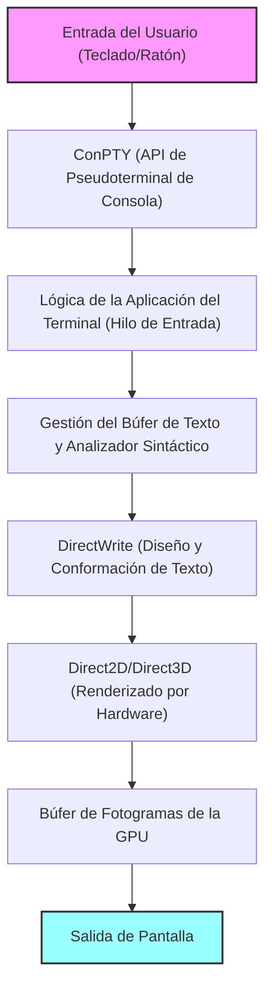
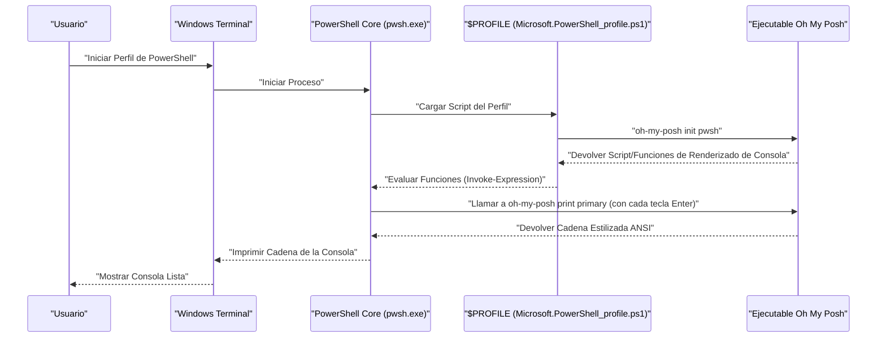

# Introducción: ¿Por qué personalizar Windows Terminal al extremo?

En el desarrollo de software moderno, el emulador de terminal ha superado el ser una simple interfaz de entrada y salida de comandos para convertirse en la "cabina" más importante que afecta directamente la productividad de los desarrolladores. El antiguo "Símbolo del sistema (cmd.exe)" y la consola tradicional de "Windows PowerShell" (conhost.exe), que solían ser el estándar en entornos Windows, eran significativamente inferiores en comparación con los refinados entornos de terminal de Linux y macOS debido a su bajo rendimiento de renderizado, su falta de opciones de personalización y su soporte incompleto de Unicode.

Sin embargo, con la llegada de "Windows Terminal", un proyecto de código abierto liderado por Microsoft, esta situación ha cambiado drásticamente. Ofrece un renderizado de texto ultrarrápido gracias a la aceleración de hardware basada en DirectX, soporte nativo para interfaz de pestañas y división de paneles, configuración libre de atajos de teclado y funcionalidades avanzadas de gestión de perfiles. Windows Terminal es una aplicación extremadamente potente que cumple con todos los requisitos de un "terminal moderno" que los desarrolladores realmente deseaban.

En este artículo, proporcionamos la guía definitiva de personalización para elevar este Windows Terminal a un entorno "supremo". Más allá de los cambios estéticos superficiales, explicaremos de manera exhaustiva y desde una perspectiva técnica, los modelos matemáticos subyacentes del renderizado de texto, la estructura profunda de `settings.json`, la implementación de Oh My Posh en PowerShell, la configuración de Starship en entornos WSL e incluso el análisis teórico de la latencia de renderizado.

Esperamos que esta guía ayude a los lectores a construir su propio entorno de terminal definitivo y a mejorar drásticamente su experiencia diaria de programación.

---

# 1. Arquitectura de renderizado y modelo matemático de Windows Terminal

Detrás del funcionamiento tan rápido y fluido de Windows Terminal, existe un pipeline de renderizado sofisticado que aprovecha al máximo la pila de gráficos moderna de Windows. En lugar del GDI (Graphics Device Interface) tradicional, Windows Terminal emplea aceleración de hardware basada en GPU que utiliza DirectWrite y DirectX (Direct2D/Direct3D).

A continuación se muestra un diagrama conceptual del pipeline de renderizado del terminal, desde la entrada de una tecla hasta que el texto se dibuja en la pantalla.



## 1.1 Suavizado de bordes (antialiasing) de subpíxeles de fuentes y geometría

Para asegurar una alta legibilidad al dibujar texto, que no cause fatiga ocular incluso durante largas jornadas de trabajo, la tecnología de suavizado de bordes (antialiasing) es indispensable. DirectWrite soporta un avanzado suavizado de subpíxeles aplicando la tecnología ClearType.

Cada píxel en una pantalla LCD (cristal líquido) estándar se compone de tres subpíxeles verticales u horizontales: R (rojo), G (verde) y B (azul). El antialiasing de subpíxeles es una técnica que controla el brillo utilizando esta alta resolución espacial en unidades de 1/3 de píxel, en lugar de unidades de un solo píxel (antialiasing en escala de grises).

Sea $ f(x, y) $ una función binaria que define el contorno ideal de un glifo de una fuente vectorial. Si las coordenadas $ (x, y) $ dentro de un píxel están en el interior del glifo, entonces $ f(x, y) = 1 $; si están en el exterior, $ f(x, y) = 0 $.

El brillo $ I_R $ de un solo subpíxel (por ejemplo, el subpíxel rojo) se calcula como la convolución de la integral de $ f(x, y) $ sobre el dominio espacial $ S_R $ de ese subpíxel, y una función de filtro $ h(x, y) $ para compensar las propiedades físicas de la pantalla y las características visuales humanas (como las características gamma).

$$
I_R = \iint_{S_R} f(x, y) \ast h(x, y) \,dx\,dy
$$

De manera similar, para el verde ($ I_G $) y el azul ($ I_B $), el brillo se calcula basándose en sus dominios respectivos $ S_G $ y $ S_B $. Windows Terminal logra un hermoso renderizado de texto sin demoras, y sin sobrecargar la CPU, procesando en paralelo estos complejos cálculos integrales y convolucionales a nivel de subpíxel mediante el uso de cachés de glifos generadas previamente (texturas Atlas) y sombreadores de píxeles (pixel shaders) de la GPU.

---

# 2. Comprensión completa y configuración profunda de settings.json

El núcleo de la personalización de Windows Terminal reside en editar el archivo de configuración `settings.json`. Aunque muchos elementos se pueden modificar desde la pantalla de configuración GUI, para buscar la personalización definitiva y gestionar las versiones de la configuración con herramientas como Git, es fundamental tener conocimientos para editar directamente el JSON.

El archivo de configuración consta principalmente de las siguientes 3 secciones:

1. **`profiles`**: Define el comportamiento y la apariencia (fuentes, fondo, directorio de inicio) de cada shell (PowerShell, cmd, WSL, Azure Cloud Shell, etc.).
2. **`schemes`**: Define las paletas de colores de 16 colores (esquemas de colores) que se utilizan dentro del terminal.
3. **`actions`**: Define acciones personalizadas (combinaciones de teclas o división de paneles) que se llaman desde atajos de teclado o desde la paleta de comandos.

## 2.1 Estructura jerárquica de perfiles y modelo de herencia

En la configuración de perfiles, las configuraciones comunes a todos los perfiles se describen en el objeto `defaults`, y las configuraciones individuales se describen en cada objeto dentro del array `list`. Este modelo de herencia elimina la redundancia en el archivo de configuración y mejora la mantenibilidad.

```json
{
    "profiles": {
        "defaults": {
            "font": {
                "face": "CaskaydiaCove Nerd Font",
                "size": 11,
                "weight": "normal",
                "features": {
                    "calt": 1,
                    "liga": 1
                }
            },
            "useAcrylic": true,
            "acrylicOpacity": 0.85,
            "cursorShape": "filledBox",
            "cursorBlinking": true,
            "padding": "12, 12, 12, 12",
            "antialiasingMode": "cleartype",
            "historySize": 10000
        },
        "list": [
            {
                "guid": "{574e775e-4f2a-5b96-ac1e-a2962a402336}",
                "hidden": false,
                "name": "PowerShell 7",
                "source": "Windows.Terminal.PowershellCore",
                "colorScheme": "Tokyo Night",
                "backgroundImage": "C:\\Users\\Username\\Pictures\\Terminal\\cyberpunk_bg.png",
                "backgroundImageOpacity": 0.15,
                "backgroundImageStretchMode": "uniformToFill",
                "startingDirectory": "%USERPROFILE%\\Projects"
            },
            {
                "guid": "{2c4de342-38b7-51cf-b940-2309a097f518}",
                "hidden": false,
                "name": "Ubuntu-22.04",
                "source": "Windows.Terminal.Wsl",
                "colorScheme": "One Half Dark",
                "startingDirectory": "\\\\wsl$\\Ubuntu-22.04\\home\\username"
            }
        ]
    }
}
```

En el ejemplo anterior, se ha añadido la configuración `"features": { "calt": 1, "liga": 1 }` para habilitar las ligaduras tipográficas en la fuente. Esto permite que múltiples caracteres como `!=` o `=>` se representen como un solo y hermoso símbolo, ideal para la programación.

## 2.2 Configuraciones modulares con JSON Fragments

Windows Terminal soporta un mecanismo de extensión llamado "JSON Fragments". Se trata de un sistema que permite a aplicaciones de terceros (por ejemplo, una distribución WSL recién instalada o herramientas de desarrollo como Visual Studio) añadir perfiles y esquemas de color propios al terminal de manera dinámica y segura, sin modificar directamente el `settings.json` principal del usuario.

Los desarrolladores también pueden aplicar este mecanismo si desean gestionar su propia configuración por partes (los archivos JSON se combinan con solo colocarlos en un directorio especificado).

---

# 3. La experiencia visual suprema: Los secretos de temas, fuentes y fondos

La paleta de colores del terminal es un factor crucial que no solo afecta a la estética, sino también a la legibilidad del código y los registros, y a la reducción de la fatiga visual durante largas horas de trabajo.

## 3.1 Creación y aplicación de esquemas de colores

Existen muchos esquemas de colores para Windows Terminal disponibles en Internet (el sitio web "Windows Terminal Themes" es famoso). Puedes utilizar estas combinaciones de colores libremente agregándolas a tu array de `schemes`.

A continuación se muestra un ejemplo de definición JSON del tema "Tokyo Night", el cual es inmensamente popular entre los desarrolladores en la actualidad. Es un tema de alto contraste y agradable a la vista, con tonos azules y violetas.

```json
"schemes": [
    {
        "name": "Tokyo Night",
        "background": "#1A1B26",
        "foreground": "#A9B1D6",
        "black": "#32344A",
        "red": "#F7768E",
        "green": "#9ECE6A",
        "yellow": "#E0AF68",
        "blue": "#7AA2F7",
        "purple": "#BB9AF7",
        "cyan": "#7DCFFF",
        "white": "#A9B1D6",
        "brightBlack": "#414868",
        "brightRed": "#F7768E",
        "brightGreen": "#9ECE6A",
        "brightYellow": "#E0AF68",
        "brightBlue": "#7AA2F7",
        "brightPurple": "#BB9AF7",
        "brightCyan": "#7DCFFF",
        "brightWhite": "#C0CAF5",
        "cursorColor": "#C0CAF5",
        "selectionBackground": "#33467C"
    }
]
```

Cada color se especifica usando un código de color hexadecimal (HEX) y corresponde a cada número de color de la secuencia de escape ANSI (del 0 al 15).

## 3.2 Instalación de Nerd Fonts y optimización de la configuración de fuentes (CaskaydiaCove Nerd Font)

Cuando se utilizan herramientas avanzadas de línea de comandos (prompt) como Oh My Posh o Starship, que mencionaremos más adelante, resulta imprescindible utilizar una fuente que contenga glifos especiales (iconos) como el símbolo de la rama de Git, los logotipos de los lenguajes de programación y los símbolos del sistema operativo. "Nerd Fonts" es una colección de fuentes de programación a las que se les han parcheado (añadido) estos iconos.

La fuente de programación "Cascadia Code" desarrollada por Microsoft es excelente y muy fácil de leer, pero por defecto no incluye los iconos de Nerd Font. Por ello, es muy recomendable instalar "CaskaydiaCove Nerd Font", que aplica el parche de Nerd Font a Cascadia Code.

### Pasos de instalación:
1. Descarga el archivo `CascadiaCode.zip` desde la [página oficial de lanzamientos en GitHub de Nerd Fonts](https://github.com/ryanoasis/nerd-fonts/releases).
2. Descomprímelo, selecciona los archivos `.ttf` incluidos, haz clic derecho y elige "Instalar para todos los usuarios".
3. Cambia el valor de `font.face` en `settings.json` a `"CaskaydiaCove Nerd Font"`.

## 3.3 Efecto Acrílico e imágenes de fondo para una experiencia inmersiva

Una de las características que encarna el Fluent Design System de Windows 11 es el efecto de material "Acrylic (acrílico)". Permite hacer que el fondo del terminal sea translúcido, desenfocando elegantemente la ventana o el fondo de escritorio que se encuentre detrás.

```json
"useAcrylic": true,
"acrylicOpacity": 0.75,
```

Además, es posible establecer cualquier imagen como fondo. También se admiten animaciones GIF, por lo que puedes crear fondos dinámicos. Puedes controlar de forma precisa la posición y la opacidad de la imagen.

```json
"backgroundImage": "C:\\Users\\Username\\Pictures\\wallpapers\\anime_cyberpunk.gif",
"backgroundImageOpacity": 0.2,
"backgroundImageStretchMode": "none",
"backgroundImageAlignment": "bottomRight"
```

Esto permite realizar personalizaciones que incrementan tu motivación, como colocar un personaje o logo favorito de forma discreta en la esquina inferior derecha del terminal.

---

# 4. Maximizando la productividad: División de paneles, atajos de teclado y paleta de comandos

Windows Terminal cuenta de forma nativa con características fundamentales (como la división de paneles de la pantalla) similares a las de multiplexores de terminales como tmux o screen.

Al personalizar la sección de `actions`, puedes dividir, mover y redimensionar la pantalla a tu voluntad solo con atajos de teclado, sin tocar en absoluto el ratón.

```json
"actions": [
    { "command": { "action": "splitPane", "split": "auto", "splitMode": "duplicate" }, "keys": "alt+shift+d" },
    { "command": { "action": "splitPane", "split": "right" }, "keys": "alt+shift+plus" },
    { "command": { "action": "splitPane", "split": "down" }, "keys": "alt+shift+minus" },
    { "command": { "action": "moveFocus", "direction": "left" }, "keys": "alt+left" },
    { "command": { "action": "moveFocus", "direction": "right" }, "keys": "alt+right" },
    { "command": { "action": "moveFocus", "direction": "up" }, "keys": "alt+up" },
    { "command": { "action": "moveFocus", "direction": "down" }, "keys": "alt+down" },
    { "command": { "action": "resizePane", "direction": "left" }, "keys": "alt+shift+left" },
    { "command": { "action": "resizePane", "direction": "right" }, "keys": "alt+shift+right" },
    { "command": { "action": "resizePane", "direction": "up" }, "keys": "alt+shift+up" },
    { "command": { "action": "resizePane", "direction": "down" }, "keys": "alt+shift+down" },
    { "command": { "action": "closePane" }, "keys": "ctrl+w" }
]
```

Al configurar los atajos de teclado anteriores, puedes ajustar el tamaño de los paneles con `Alt + Shift + Flecha` y cambiar rápidamente el enfoque entre paneles con `Alt + Flecha`. De esta forma, puedes ejecutar un servidor local de Node.js en un panel para monitorear los registros, mientras usas comandos de Git en otro panel y verificas el estado de los contenedores Docker en un tercer panel, logrando un trabajo en paralelo avanzado y fluido.

## 4.1 Modo Quake (Terminal desplegable global)

También se soporta el "Modo Quake (Modo Desplegable)", que permite invocar el terminal desde la parte superior de la pantalla en cualquier momento, al estilo de la pantalla de consola del juego FPS "Quake". Por defecto, pulsando `Win + \`, se desliza un terminal con animación desde la parte superior que ocupa la mitad del tamaño de la ventana. Esto es de gran utilidad cuando quieres introducir un comando rápidamente.

---

# 5. Automatización del diseño de inicio utilizando `wt.exe`

Tareas rutinarias como abrir el terminal en un directorio de proyecto específico cada mañana, dividir la pantalla en tres partes, y luego ejecutar los comandos de compilación del frontend, el inicio del servidor backend y la monitorización de la base de datos respectivamente, deben ser automatizadas.

El ejecutable real de Windows Terminal, `wt.exe`, admite potentes argumentos de línea de comandos, lo que te permite controlar mediante argumentos qué perfil utilizar y el estado de la división de los paneles al iniciar.

```powershell
wt -p "PowerShell 7" -d "C:\Projects\MyApp" ; split-pane -p "Ubuntu-22.04" -d "/var/log" -V ; split-pane -p "cmd" -H
```

Si guardas este comando como un acceso directo o archivo por lotes en Windows, la disposición de tu complejo entorno de desarrollo se restaurará al instante con un solo clic.

---

# 6. La evolución del prompt 1: PowerShell y Oh My Posh

"Oh My Posh" es lo que hace que PowerShell, el shell predeterminado en entornos Windows (especialmente la versión más reciente multiplataforma, PowerShell 7 / PowerShell Core), evolucione drásticamente. Oh My Posh es un motor de personalización de consola (prompt) para cualquier shell. Te presenta visualmente todos los estados que necesitas para el desarrollo, como tu directorio actual, las ramas y estados de modificación de Git, las versiones de Node.js o Python, o el contexto de Kubernetes.

El siguiente diagrama de secuencia muestra cómo se carga Oh My Posh al iniciar PowerShell y cómo se renderiza la consola.



## 6.1 Instalación y configuración de Oh My Posh

En entornos Windows, puedes instalarlo fácilmente usando `winget`, el administrador de paquetes oficial.

```powershell
winget install JanDeDobbeleer.OhMyPosh -s winget
```

Después de la instalación, edita el script de perfil de PowerShell para inicializar Oh My Posh y que se cargue al iniciar. La ruta al perfil se almacena en la variable automática `$PROFILE`.

```powershell
notepad $PROFILE
```

Una vez que el archivo esté abierto, añade el siguiente código.

```powershell
# Configuración de alias
Set-Alias ll ls
Set-Alias g git

# Habilitar IntelliSense predictivo (módulo PSReadLine)
Set-PSReadLineOption -PredictionSource History
Set-PSReadLineOption -PredictionViewStyle ListView

# Inicialización de Oh My Posh
# Especifica el tema de tu preferencia (ej. jandedobbeleer).
# La ruta de los temas integrados está en la variable de entorno $env:POSH_THEMES_PATH.
oh-my-posh init pwsh --config "$env:POSH_THEMES_PATH\tokyonight_storm.omp.json" | Invoke-Expression

# Módulo Terminal-Icons para mostrar iconos en carpetas y archivos
# (Requiere Install-Module -Name Terminal-Icons -Repository PSGallery -Force solo la primera vez)
Import-Module -Name Terminal-Icons
```

Hay cientos de temas (configuraciones) disponibles y también puedes crear el tuyo propio completamente en formatos JSON, YAML o TOML. Se diseña la consola combinando libremente la información a mostrar en los lados izquierdo (Left) y derecho (Right) usando un concepto llamado "segmentos".

---

# 7. La evolución del prompt 2: Arquitectura WSL2 e integración de Starship

WSL2 (Windows Subsystem for Linux 2), que te permite ejecutar un núcleo de Linux real en Windows, es indispensable para el desarrollo web moderno y el desarrollo nativo en la nube. "Starship" es la solución óptima para personalizar la consola de los shells (Bash o Zsh) dentro de WSL.

Starship es una consola multi-shell extremadamente rápida y personalizable escrita en Rust. Su mayor ventaja es que puedes reproducir exactamente el mismo prompt en cualquier shell, como Bash, Zsh o Fish, escribiendo un solo archivo de configuración (TOML).

## 7.1 Instalación de Starship

Abre tu terminal de WSL (por ejemplo, Ubuntu) y ejecuta el script de instalación oficial.

```bash
curl -sS https://starship.rs/install.sh | sh
```

Luego, si utilizas Bash, añade lo siguiente al final de tu archivo `~/.bashrc` para habilitar el hook.

```bash
# ~/.bashrc
eval "$(starship init bash)"
```

Si usas Zsh, añade lo siguiente al final de `~/.zshrc`.

```bash
# ~/.zshrc
eval "$(starship init zsh)"
```

## 7.2 Personalización definitiva con starship.toml

La configuración de Starship se especifica en `~/.config/starship.toml`. Se caracteriza por estar en formato TOML, lo que lo hace más fácil de leer y escribir por los humanos que el JSON, y permite añadir comentarios.

A continuación se muestra un ejemplo de configuración para lograr un prompt moderno y rico en información.

```toml
# ~/.config/starship.toml

# Definir el formato general (orden) de todo el prompt
format = """
[╭─](bold blue)$os$directory$git_branch$git_status$nodejs$python$golang$rust
[╰─$character](bold blue)"""

# Configuración de visualización del icono del sistema operativo
[os]
disabled = false
format = "[$symbol]($style) "

[os.symbols]
Ubuntu = " "
Windows = " "
Macos = " "
Alpine = " "

# Configuración de visualización del directorio
[directory]
style = "bold cyan"
read_only = " "
truncation_length = 3
truncate_to_repo = true

# Configuración de la rama de Git
[git_branch]
symbol = " "
style = "bold purple"

# Configuración del estado de Git
[git_status]
style = "bold red"
modified = " "
staged = " "
untracked = " "
deleted = "✖ "

# Carácter del prompt (símbolo de la línea de entrada)
[character]
success_symbol = "[❯](bold green)"
error_symbol = "[❯](bold red)"
```

Con esta configuración, el prompt tiene una estructura de dos líneas: la primera línea muestra el icono del sistema operativo, la ruta del directorio actual, la rama y el estado de Git, y la información de versión de cada entorno de lenguaje (Node.js, Python, etc.). La segunda línea es una entrada sencilla que no satura el espacio en la pantalla cuando introduces comandos largos.

---

# 8. Modelo matemático de latencia y rendimiento de renderizado en el terminal

Uno de los indicadores más importantes a la hora de evaluar la usabilidad de un terminal es la "**latencia de entrada (Input Latency)**". Hace referencia al retraso en el tiempo desde que se presiona una tecla en el teclado hasta que los colores de los píxeles correspondientes en la pantalla cambian y se recibe un feedback visual.

Este retardo total $ T_{total} $ puede modelarse rigurosamente a nivel matemático como la suma de los siguientes componentes:

$$
T_{total} = T_{hw\_input} + T_{os} + T_{pty} + T_{app} + T_{render} + T_{display}
$$

El significado y el tiempo requerido típico de cada variable son los siguientes:

- $ T_{hw\_input} $: Latencia de hardware desde que el interruptor mecánico del teclado se enciende, es escaneado mediante el controlador USB y se envía la señal de interrupción (aproximadamente 1-5 ms).
- $ T_{os} $: Retraso de procesamiento de la cola de mensajes debido a la capa del controlador HID (Human Interface Device) del sistema operativo (aproximadamente 1-2 ms).
- $ T_{pty} $: Latencia debido al almacenamiento en búfer y la conversión de codificación de caracteres (como de UTF-8 a UTF-16) por parte del ConPTY (pseudoterminal) (aproximadamente 2-10 ms).
- $ T_{app} $: Tiempo de procesamiento por parte del shell (PowerShell/Bash) para interpretar el comando y determinar la salida en pantalla. El tiempo empleado en obtener el estado de Git por Oh My Posh o Starship también se incluye aquí (aproximadamente 10-50 ms).
- $ T_{render} $: Retraso de renderizado por parte de Windows Terminal (DirectWrite/DirectX) desde la rasterización de los glifos de texto como texturas, su transferencia a la memoria de la GPU, hasta el intercambio (flipping) del búfer (swap chain) (aproximadamente 2-8 ms).
- $ T_{display} $: Latencia de visualización desde que se envía la señal del búfer de fotogramas de la GPU al monitor, hasta que las moléculas de cristal líquido responden y cambian físicamente de estado emitiendo luz (velocidad de respuesta GtG, etc. aproximadamente 5-20 ms).

El equipo de desarrollo de Windows Terminal ha invertido grandes esfuerzos en minimizar especialmente $ T_{pty} $ y $ T_{render} $. En las primeras versiones, ocurrían picos de latencia (caídas de fotogramas o frame drops) debido a fallos en la caché durante la rasterización de texto, pero en las versiones recientes se ha introducido un algoritmo de "caché de glifos basada en Atlas" (Atlas-based glyph cache).

Al convertir los glifos en Atlas, el dibujo de cadenas de texto se reduce a una sencilla operación matricial en la GPU, consistente en "recortar porciones de una enorme textura de fuente previamente generada en la memoria, y componerlas en la pantalla mediante mezcla alfa (alpha blending)".

Cuando la cadena de caracteres a dibujar tiene $ N $ caracteres, el coste de dibujo secuencial por parte de la CPU en el enfoque tradicional del GDI requería un tiempo de $ \mathcal{O}(N) $. Sin embargo, en el renderizado mediante Atlas basado en la GPU, es posible dibujar en un tiempo constante cercano a $ \mathcal{O}(1) $ gracias a los shaders paralelos.

Como resultado de esto, incluso cuando se envía una gran cantidad de registros a la salida estándar (por ejemplo, mensajes de compilación de `npm install` o de un gran proyecto en C++), Windows Terminal puede continuar desplazando el texto de forma suave a 60 fps (o en entornos con una alta tasa de refresco como 144Hz o más) sin experimentar caídas en el procesamiento.

---

# 9. Solución de problemas avanzados y técnicas de depuración

Al personalizar Windows Terminal al extremo, es posible que te encuentres con problemas inesperados, como errores de sintaxis en los archivos de configuración o fallos en el renderizado de fuentes. Aquí presentamos técnicas avanzadas de solución de problemas para ingenieros.

## 9.1 Validación de JSON Schema de settings.json
La estructura de `settings.json` está estrictamente definida, y se recomienda emplear un editor (como VS Code) para comprobar la sintaxis en tiempo real usando JSON Schema. Al abrir `settings.json` en VS Code, el esquema de Windows Terminal se aplica de forma predeterminada, advirtiéndote al instante de nombres de propiedades no válidos o errores de tipo en los valores (por ejemplo, si especificas una cadena donde se esperaba un número) mediante subrayados ondulados.

## 9.2 Análisis de rendimiento del prompt (profiling)
Si la consola tarda demasiado en aparecer (hay un retraso entre el momento en que se presiona la tecla Enter y el momento en que aparece la siguiente línea de entrada), es probable que el tiempo de ejecución de Oh My Posh o Starship sea el problema. Oh My Posh tiene una función avanzada de depuración que mide el tiempo de representación de cada bloque.

```powershell
oh-my-posh debug
```

Al ejecutar este comando, se mostrarán detalladamente las variables del entorno del terminal, la ruta del archivo de configuración cargado y el tiempo de procesamiento en milisegundos (ms) de cada segmento que compone la consola. Esto te permite identificar con precisión qué obtención de información está causando el cuello de botella (por ejemplo, obtener el estado de Git en un monorepositorio gigante, comprobar el estado de autenticación en un proveedor de la nube o la latencia de la red) y realizar ajustes como desactivar módulos innecesarios.

## 9.3 Desactivación de la aceleración por GPU (retorno al renderizado por software)
Existen casos excepcionales donde hardware antiguo o errores en controladores de GPU específicos pueden causar parpadeos de pantalla (flickering) o que falten caracteres debido al renderizado de hardware por DirectX. En estos casos, hay una opción de configuración para forzar el cambio (fallback) hacia el renderizado por software.

Añade la siguiente configuración al nivel raíz de tu `settings.json`.

```json
"softwareRendering": true
```

Al hacer esto, se cambia al renderizado basado en la CPU (WARP) en lugar de la GPU. Aunque el rendimiento disminuye, puede garantizar la precisión del dibujo. Esta es una medida poderosa para aislar fallos relacionados con los gráficos.

---

# Conclusión

El verdadero valor de Windows Terminal va mucho más allá de ser un simple "sustituto del antiguo símbolo del sistema". Una tecnología de renderizado de vanguardia impulsada por DirectX, un mecanismo de configuración flexible y poderoso basado en JSON, y una integración perfecta con diversas shells como WSL y PowerShell. Al comprender esto en profundidad y personalizar el terminal para que se adapte a tus necesidades, reducirás la fricción en el proceso de desarrollo al mínimo.

Las diversas técnicas de configuración explicadas en este artículo (la personalización de los esquemas de color, la extensión de la información visual con Nerd Fonts, los prompts inteligentes y sensibles al contexto con Oh My Posh y Starship, y la construcción de un entorno multitarea mediante la división de paneles) no solo mejorarán tu experiencia de codificación diaria, sino que también impulsarán tu propia motivación frente al terminal.

La optimización del entorno de desarrollo no tiene fin. Cada vez que aparezcan nuevas herramientas de línea de comandos y evolucione la arquitectura de los sistemas operativos, nuestros terminales también cambiarán de forma. Esperamos de todo corazón que este artículo sirva como una guía sólida para los lectores en su incesante viaje en busca del "entorno de desarrollo definitivo".
