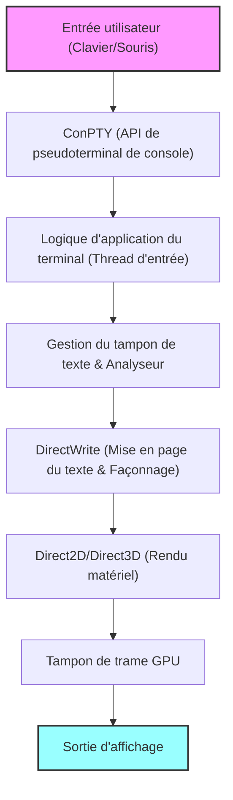
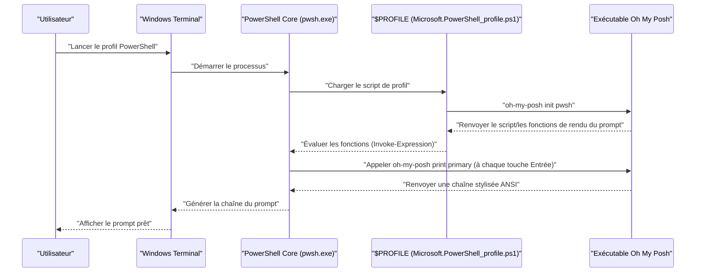

# Introduction : Pourquoi personnaliser Windows Terminal à l'extrême ?

Dans le développement logiciel moderne, l'émulateur de terminal dépasse la simple interface d'entrée/sortie de commandes pour devenir le « cockpit » le plus important qui influence directement la productivité des développeurs. L'« Invite de commandes (cmd.exe) » standard et l'ancienne console « Windows PowerShell » (conhost.exe) des environnements Windows passés étaient largement inférieurs aux environnements de terminaux sophistiqués de Linux et macOS, en raison de leurs faibles performances de rendu, de leur manque de personnalisation et de leur prise en charge incomplète d'Unicode.

Cependant, avec l'avènement de « Windows Terminal », dont le développement open-source est mené par Microsoft, cette situation a radicalement changé. Rendu de texte ultra-rapide grâce à l'accélération matérielle basée sur DirectX, prise en charge native de l'interface utilisateur à onglets et du fractionnement de panneaux, paramètres de raccourcis clavier entièrement libres et fonctionnalités de gestion de profils avancées. Windows Terminal est une application extrêmement puissante qui répond à toutes les exigences d'un « terminal moderne » que les développeurs recherchaient véritablement.

Cet article fournit un guide de personnalisation ultime pour sublimer ce Windows Terminal en un environnement « optimal ». Au-delà des simples modifications d'apparence superficielles, nous l'expliquerons d'un point de vue approfondi et technique : des modèles mathématiques sous-jacents au rendu de texte à la structure profonde de `settings.json`, en passant par l'introduction de Oh My Posh dans PowerShell, la configuration de Starship dans l'environnement WSL, et même l'analyse théorique de la latence de rendu.

Nous espérons que cela aidera nos lecteurs à construire leur propre environnement de terminal ultime et à améliorer de manière spectaculaire leur expérience de codage quotidienne.

---

# 1. Architecture de rendu de Windows Terminal et Modèle Mathématique

Derrière la fluidité et la rapidité d'exécution de Windows Terminal se cache un pipeline de rendu sophistiqué qui tire pleinement parti de la pile graphique moderne de Windows. Au lieu de la traditionnelle GDI (Graphics Device Interface), Windows Terminal adopte l'accélération matérielle basée sur le GPU utilisant DirectWrite et DirectX (Direct2D/Direct3D).

Le schéma conceptuel du pipeline de rendu de terminal, de la saisie au clavier jusqu'à l'affichage du texte à l'écran, est présenté ci-dessous.



## 1.1 Anticrénelage des sous-pixels des polices et Géométrie

Lors du rendu de texte, la technologie d'anticrénelage (anti-aliasing) est essentielle pour garantir une haute lisibilité qui ne fatigue pas les yeux, même lors de travaux prolongés. DirectWrite prend en charge un anticrénelage avancé des sous-pixels en appliquant la technologie ClearType.

Chaque pixel d'un écran LCD (cristaux liquides) typique est composé de trois sous-pixels verticaux ou horizontaux : R (Rouge), G (Vert) et B (Bleu). L'anticrénelage des sous-pixels est une technologie qui contrôle la luminosité en utilisant cette haute résolution spatiale au niveau de 1/3 de pixel, plutôt qu'à l'échelle d'un pixel unique (anticrénelage en niveaux de gris).

Soit $ f(x, y) $ la fonction binaire qui définit le contour idéal du glyphe d'une police vectorielle. Si la coordonnée $ (x, y) $ à l'intérieur du pixel se trouve à l'intérieur du glyphe, alors $ f(x, y) = 1 $, et si elle est à l'extérieur, $ f(x, y) = 0 $.

La luminosité $ I_R $ d'un seul sous-pixel (par exemple, le sous-pixel rouge) est calculée comme la convolution de l'intégrale de $ f(x, y) $ dans le domaine spatial $ S_R $ de ce sous-pixel avec une fonction de filtrage $ h(x, y) $ destinée à compenser les caractéristiques physiques de l'écran et les caractéristiques visuelles humaines (telles que la correction gamma).

$$
I_R = \iint_{S_R} f(x, y) \ast h(x, y) \,dx\,dy
$$

Pour le vert ($ I_G $) et le bleu ($ I_B $), le calcul s'effectue de la même manière sur la base de leurs domaines respectifs $ S_G $ et $ S_B $. Dans Windows Terminal, ces opérations complexes d'intégration et de convolution au niveau des sous-pixels sont traitées massivement en parallèle en utilisant un cache de glyphes pré-généré (Texture Atlas) et les nuanceurs de pixels (pixel shaders) du GPU, ce qui permet un rendu de texte magnifique sans latence et sans surcharger le CPU.

---

# 2. Compréhension totale de settings.json et Paramètres approfondis

Le cœur de la personnalisation de Windows Terminal réside dans l'édition de son fichier de configuration, `settings.json`. Bien que de nombreux éléments puissent être modifiés depuis l'écran de configuration de l'interface graphique, la connaissance de l'édition directe du JSON est indispensable pour rechercher la personnalisation ultime et gérer les versions des paramètres avec Git.

Le fichier de configuration est principalement composé des trois grandes sections suivantes :

1. **`profiles`** : Définit le comportement et l'apparence (police, arrière-plan, répertoire de démarrage) pour chaque shell (PowerShell, cmd, WSL, Azure Cloud Shell, etc.).
2. **`schemes`** : Définit la palette de 16 couleurs (schéma de couleurs) utilisée dans le terminal.
3. **`actions`** : Définit les actions personnalisées (raccourcis clavier, fractionnement de panneaux) appelées par des touches de raccourci ou la palette de commandes.

## 2.1 Structure hiérarchique des profils et Modèle d'héritage

Dans les paramètres de profil, la configuration commune à tous les profils est écrite dans l'objet `defaults`, tandis que les paramètres spécifiques sont définis dans chaque objet du tableau `list`. Ce modèle d'héritage élimine la redondance dans le fichier de configuration et en améliore la maintenabilité.

```json
{
    "profiles": {
        "defaults": {
            "font": {
                "face": "CaskaydiaCove Nerd Font",
                "size": 11,
                "weight": "normal",
                "features": {
                    "calt": 1,
                    "liga": 1
                }
            },
            "useAcrylic": true,
            "acrylicOpacity": 0.85,
            "cursorShape": "filledBox",
            "cursorBlinking": true,
            "padding": "12, 12, 12, 12",
            "antialiasingMode": "cleartype",
            "historySize": 10000
        },
        "list": [
            {
                "guid": "{574e775e-4f2a-5b96-ac1e-a2962a402336}",
                "hidden": false,
                "name": "PowerShell 7",
                "source": "Windows.Terminal.PowershellCore",
                "colorScheme": "Tokyo Night",
                "backgroundImage": "C:\\Users\\Username\\Pictures\\Terminal\\cyberpunk_bg.png",
                "backgroundImageOpacity": 0.15,
                "backgroundImageStretchMode": "uniformToFill",
                "startingDirectory": "%USERPROFILE%\\Projects"
            },
            {
                "guid": "{2c4de342-38b7-51cf-b940-2309a097f518}",
                "hidden": false,
                "name": "Ubuntu-22.04",
                "source": "Windows.Terminal.Wsl",
                "colorScheme": "One Half Dark",
                "startingDirectory": "\\\\wsl$\\Ubuntu-22.04\\home\\username"
            }
        ]
    }
}
```

Dans l'exemple ci-dessus, nous avons ajouté le paramètre `"features": { "calt": 1, "liga": 1 }` pour activer les ligatures dans la police. Ainsi, plusieurs symboles tels que `!=` ou `=>` seront rendus comme un seul symbole esthétique adapté à la programmation.

## 2.2 Configuration modulaire via les JSON Fragments

Windows Terminal prend en charge un mécanisme d'extension appelé "JSON Fragments". Il permet aux applications tierces (par exemple, une distribution WSL nouvellement installée, ou un outil de développement comme Visual Studio) d'ajouter dynamiquement et de manière sécurisée leurs propres profils et schémas de couleurs au terminal, sans modifier directement le fichier `settings.json` principal de l'utilisateur.

Vous pouvez également appliquer ce mécanisme lorsque vous souhaitez gérer séparément vos propres paramètres personnalisés (les fichiers JSON sont simplement fusionnés lorsqu'ils sont placés dans le répertoire spécifié).

---

# 3. L'expérience visuelle suprême : Thèmes, Polices et Arrière-plans

Les couleurs du terminal ne sont pas qu'une question d'esthétique ; c'est un élément clé qui affecte directement la lisibilité du code et des journaux d'événements, tout en réduisant la fatigue oculaire lors de longues sessions de travail.

## 3.1 Création et application d'un schéma de couleurs

Il existe un grand nombre de schémas de couleurs publics pour Windows Terminal sur Internet (le site web "Windows Terminal Themes" est bien connu). En les ajoutant au tableau `schemes`, vous pouvez utiliser librement les couleurs de votre choix.

Voici un exemple de définition JSON pour le thème "Tokyo Night", qui jouit d'une immense popularité parmi les développeurs ces dernières années. C'est un thème apaisant pour les yeux, avec un fort contraste et dominé par des teintes bleues et violettes.

```json
"schemes": [
    {
        "name": "Tokyo Night",
        "background": "#1A1B26",
        "foreground": "#A9B1D6",
        "black": "#32344A",
        "red": "#F7768E",
        "green": "#9ECE6A",
        "yellow": "#E0AF68",
        "blue": "#7AA2F7",
        "purple": "#BB9AF7",
        "cyan": "#7DCFFF",
        "white": "#A9B1D6",
        "brightBlack": "#414868",
        "brightRed": "#F7768E",
        "brightGreen": "#9ECE6A",
        "brightYellow": "#E0AF68",
        "brightBlue": "#7AA2F7",
        "brightPurple": "#BB9AF7",
        "brightCyan": "#7DCFFF",
        "brightWhite": "#C0CAF5",
        "cursorColor": "#C0CAF5",
        "selectionBackground": "#33467C"
    }
]
```

Chaque couleur est spécifiée avec un code couleur hexadécimal (HEX), correspondant à chaque numéro de couleur (0 à 15) des séquences d'échappement ANSI.

## 3.2 Introduction des Nerd Fonts et optimisation des paramètres de police (CaskaydiaCove Nerd Font)

Lorsque vous utilisez des outils de prompt avancés comme Oh My Posh et Starship (expliqués ci-dessous), une police contenant des glyphes spéciaux (icônes) est indispensable. Cela inclut les icônes de branche Git, les logos de langages de programmation, les symboles de système d'exploitation, etc. Les polices pour la programmation qui ont été modifiées avec ces icônes sont appelées "**Nerd Fonts**".

La police de programmation "Cascadia Code" développée par Microsoft est excellente et très lisible, mais elle n'inclut pas les icônes Nerd Font par défaut. Nous vous recommandons donc vivement d'installer "**CaskaydiaCove Nerd Font**", qui applique le correctif Nerd Font à Cascadia Code.

### Instructions d'installation :
1. Téléchargez `CascadiaCode.zip` depuis [la page des versions GitHub officielle de Nerd Fonts](https://github.com/ryanoasis/nerd-fonts/releases).
2. Décompressez-le, sélectionnez les fichiers `.ttf` qu'il contient, faites un clic droit, et choisissez "Installer pour tous les utilisateurs".
3. Dans `settings.json`, modifiez la valeur de `font.face` par `"CaskaydiaCove Nerd Font"`.

## 3.3 Création d'une immersion avec l'effet Acrylic et l'image d'arrière-plan

L'une des caractéristiques incarnant le Fluent Design System de Windows 11 est l'effet de matériau "Acrylic". Il rend l'arrière-plan du terminal semi-transparent, floutant gracieusement les fenêtres et le fond d'écran à l'arrière.

```json
"useAcrylic": true,
"acrylicOpacity": 0.75,
```

De plus, il est possible de définir n'importe quelle image comme arrière-plan. Les animations GIF sont également prises en charge, permettant de créer des arrière-plans dynamiques. Vous pouvez contrôler de manière précise la position et l'opacité de l'image.

```json
"backgroundImage": "C:\\Users\\Username\\Pictures\\wallpapers\\anime_cyberpunk.gif",
"backgroundImageOpacity": 0.2,
"backgroundImageStretchMode": "none",
"backgroundImageAlignment": "bottomRight"
```

Cela vous permet de réaliser une personnalisation motivante, comme placer subtilement votre personnage ou logo préféré dans le coin inférieur droit de votre terminal.

---

# 4. Maximiser la productivité : Fractionnement de panneaux, Raccourcis clavier, Palette de commandes

Windows Terminal inclut nativement les fonctionnalités de base des multiplexeurs de terminaux tels que tmux ou screen (fractionnement de panneaux d'écran).

En personnalisant la section `actions`, vous pouvez diviser, déplacer et redimensionner l'écran librement et instantanément en utilisant uniquement le clavier, sans jamais avoir besoin de toucher à la souris.

```json
"actions": [
    { "command": { "action": "splitPane", "split": "auto", "splitMode": "duplicate" }, "keys": "alt+shift+d" },
    { "command": { "action": "splitPane", "split": "right" }, "keys": "alt+shift+plus" },
    { "command": { "action": "splitPane", "split": "down" }, "keys": "alt+shift+minus" },
    { "command": { "action": "moveFocus", "direction": "left" }, "keys": "alt+left" },
    { "command": { "action": "moveFocus", "direction": "right" }, "keys": "alt+right" },
    { "command": { "action": "moveFocus", "direction": "up" }, "keys": "alt+up" },
    { "command": { "action": "moveFocus", "direction": "down" }, "keys": "alt+down" },
    { "command": { "action": "resizePane", "direction": "left" }, "keys": "alt+shift+left" },
    { "command": { "action": "resizePane", "direction": "right" }, "keys": "alt+shift+right" },
    { "command": { "action": "resizePane", "direction": "up" }, "keys": "alt+shift+up" },
    { "command": { "action": "resizePane", "direction": "down" }, "keys": "alt+shift+down" },
    { "command": { "action": "closePane" }, "keys": "ctrl+w" }
]
```

En définissant les raccourcis clavier ci-dessus, vous pouvez ajuster la taille du panneau avec `Alt + Maj + Flèches` et déplacer instantanément le focus entre les panneaux avec `Alt + Flèches`. Cela permet un multitâche avancé de manière fluide, comme lancer un serveur local Node.js et surveiller les journaux dans un panneau, tout en exécutant des commandes Git dans un autre panneau et en vérifiant l'état d'un conteneur Docker dans un troisième panneau.

## 4.1 Quake Mode (Terminal déroulant global)

À l'image de la console du jeu FPS "Quake", Windows Terminal prend également en charge un "Quake Mode" (mode déroulant) qui vous permet d'invoquer le terminal à partir du haut de l'écran à tout moment. Par défaut, en utilisant `Win + \`, un terminal de la taille de la moitié de la fenêtre glisse vers le bas avec une animation. C'est extrêmement pratique lorsque vous souhaitez taper une commande rapidement.

---

# 5. Automatisation de la disposition de démarrage grâce à `wt.exe`

Les tâches de routine, telles qu'ouvrir un terminal dans un répertoire de projet spécifique chaque matin au début du travail, diviser l'écran en trois et exécuter une compilation front-end, démarrer un serveur back-end, et surveiller une base de données dans chacun d'eux, devraient être automatisées.

L'exécutable réel de Windows Terminal, `wt.exe`, prend en charge de puissants arguments de ligne de commande, vous permettant de contrôler le profil au démarrage et les états de fractionnement des panneaux via des arguments.

```powershell
wt -p "PowerShell 7" -d "C:\Projects\MyApp" ; split-pane -p "Ubuntu-22.04" -d "/var/log" -V ; split-pane -p "cmd" -H
```

En enregistrant cette commande en tant que raccourci Windows ou fichier batch, la disposition de votre environnement de développement complexe sera restaurée instantanément en un seul clic.

---

# 6. Évolution du prompt 1 : PowerShell et Oh My Posh

Ce qui fait évoluer de façon spectaculaire le shell standard dans l'environnement Windows, PowerShell (en particulier la dernière version multiplateforme, PowerShell 7 / PowerShell Core), c'est "**Oh My Posh**". Oh My Posh est un moteur de prompt personnalisé compatible avec n'importe quel shell. Il affiche visuellement de manière élégante tous les états dont vous avez besoin pour le développement : répertoire actuel, branche Git et statut des modifications, version de Node.js ou Python, contexte Kubernetes, etc.

Le diagramme suivant montre la séquence de chargement d'Oh My Posh au démarrage de PowerShell et comment le prompt est rendu.



## 6.1 Installation et configuration d'Oh My Posh

Dans un environnement Windows, l'installation est simple avec `winget`, le gestionnaire de paquets officiel.

```powershell
winget install JanDeDobbeleer.OhMyPosh -s winget
```

Après l'installation, éditez votre script de profil PowerShell pour initialiser Oh My Posh au démarrage. Le chemin du profil est stocké dans la variable automatique `$PROFILE`.

```powershell
notepad $PROFILE
```

Une fois le fichier ouvert, ajoutez le code suivant :

```powershell
# Configuration des alias
Set-Alias ll ls
Set-Alias g git

# Activer l'IntelliSense prédictive (Module PSReadLine)
Set-PSReadLineOption -PredictionSource History
Set-PSReadLineOption -PredictionViewStyle ListView

# Initialisation d'Oh My Posh
# Spécifiez le thème de votre choix (ex. jandedobbeleer).
# Le chemin vers les thèmes intégrés se trouve dans la variable d'environnement $env:POSH_THEMES_PATH.
oh-my-posh init pwsh --config "$env:POSH_THEMES_PATH\tokyonight_storm.omp.json" | Invoke-Expression

# Module Terminal-Icons pour afficher les icônes des dossiers et des fichiers
# (La première fois, Install-Module -Name Terminal-Icons -Repository PSGallery -Force est requis)
Import-Module -Name Terminal-Icons
```

Il y a des centaines de thèmes (config) disponibles. Vous pouvez également créer entièrement le vôtre aux formats JSON, YAML ou TOML. En utilisant le concept de "segments", vous pouvez concevoir votre prompt en combinant librement les informations affichées sur le côté gauche (Left) et le côté droit (Right).

---

# 7. Évolution du prompt 2 : Architecture WSL2 et fusion avec Starship

WSL2 (Windows Subsystem for Linux 2), qui permet d'exécuter un véritable noyau Linux sur Windows, est indispensable pour le développement Web moderne et le développement cloud natif. "**Starship**" est la solution optimale pour personnaliser le prompt dans le shell (Bash ou Zsh) au sein de WSL.

Starship est un prompt multi-shell extrêmement rapide, écrit en langage Rust et hautement personnalisable. Son principal avantage est que vous pouvez reproduire le même prompt, quel que soit le shell (Bash, Zsh, Fish, etc.), avec un seul fichier de configuration (TOML).

## 7.1 Installation de Starship

Ouvrez le terminal WSL (Ubuntu, etc.) et exécutez le script d'installation officiel.

```bash
curl -sS https://starship.rs/install.sh | sh
```

Ensuite, si vous utilisez Bash, activez le hook en ajoutant la ligne suivante à la fin du fichier `~/.bashrc`.

```bash
# ~/.bashrc
eval "$(starship init bash)"
```

Si vous utilisez Zsh, ajoutez-la à la fin de `~/.zshrc`.

```bash
# ~/.zshrc
eval "$(starship init zsh)"
```

## 7.2 Personnalisation ultime avec starship.toml

La configuration de Starship est décrite dans `~/.config/starship.toml`. Le format TOML a l'avantage d'être plus facile à lire et à écrire pour les humains que le JSON, et il permet d'inclure des commentaires.

Voici un exemple de configuration qui offre un prompt moderne et riche en informations :

```toml
# ~/.config/starship.toml

# Définir le format général (ordre d'affichage) du prompt
format = """
[╭─](bold blue)$os$directory$git_branch$git_status$nodejs$python$golang$rust
[╰─$character](bold blue)"""

# Paramètres d'affichage de l'icône de l'OS
[os]
disabled = false
format = "[$symbol]($style) "

[os.symbols]
Ubuntu = " "
Windows = " "
Macos = " "
Alpine = " "

# Paramètres d'affichage du répertoire
[directory]
style = "bold cyan"
read_only = " "
truncation_length = 3
truncate_to_repo = true

# Paramètres de la branche Git
[git_branch]
symbol = " "
style = "bold purple"

# Paramètres du statut Git
[git_status]
style = "bold red"
modified = " "
staged = " "
untracked = " "
deleted = "✖ "

# Caractère du prompt (symbole de la ligne d'entrée)
[character]
success_symbol = "[❯](bold green)"
error_symbol = "[❯](bold red)"
```

Dans cette configuration, le prompt est sur deux lignes. La première ligne affiche l'icône de l'OS, le chemin du répertoire actuel, la branche et le statut Git, ainsi que les informations de version pour chaque environnement de langage (Node.js, Python, etc.). La deuxième ligne est une simple ligne d'entrée, ce qui libère de l'espace sur l'écran lors de la saisie de commandes longues.

---

# 8. Modèle mathématique de la latence de rendu du terminal et des performances

Un des indicateurs les plus importants pour évaluer le confort d'utilisation d'un terminal est la "**Latence d'entrée (Input Latency)**". Elle correspond au temps de retard entre le moment où l'utilisateur appuie sur une touche du clavier et le moment où les pixels correspondants changent de couleur sur l'écran pour fournir un retour visuel.

Le délai total $ T_{total} $ peut être strictement modélisé comme la somme des composants suivants de manière mathématique :

$$
T_{total} = T_{hw\_input} + T_{os} + T_{pty} + T_{app} + T_{render} + T_{display}
$$

La signification de chaque variable et les temps d'exécution typiques sont les suivants :

- $ T_{hw\_input} $ : Le délai matériel entre le moment où l'interrupteur mécanique du clavier s'active, est sondé via le contrôleur USB, et un signal d'interruption est envoyé (environ 1 à 5 ms).
- $ T_{os} $ : Le délai de traitement de la file d'attente des messages par la couche de pilotes HID (Human Interface Device) du système d'exploitation (environ 1 à 2 ms).
- $ T_{pty} $ : Le délai dû à la mise en mémoire tampon et à la conversion d'encodage des caractères (par exemple de UTF-8 à UTF-16) par ConPTY (pseudo-terminal) (environ 2 à 10 ms).
- $ T_{app} $ : Le temps de traitement pour l'interprétation des commandes du côté du shell (PowerShell/Bash) et la détermination de la sortie d'écran. Cela inclut également le temps de traitement de Oh My Posh ou Starship pour l'acquisition du statut Git, par exemple (environ 10 à 50 ms).
- $ T_{render} $ : Le délai de rendu pris par Windows Terminal (DirectWrite/DirectX) pour rastériser les glyphes du texte sous forme de textures, les transférer dans la mémoire du GPU et faire basculer (flip) la chaîne d'échange (swap chain) (environ 2 à 8 ms).
- $ T_{display} $ : Le délai d'affichage à partir du tampon de trame (frame buffer) du GPU jusqu'à l'envoi du signal au moniteur et la modification de l'émission de lumière par les molécules de cristaux liquides (par exemple, temps de réponse GtG. Environ 5 à 20 ms).

L'équipe de développement de Windows Terminal a consacré d'énormes efforts, notamment à la minimisation de $ T_{pty} $ et de $ T_{render} $. Dans les premières versions, un défaut de cache lors de la rastérisation du texte causait des pointes de latence (chutes de frames). Toutefois, l'algorithme "Atlas-based glyph cache" (cache de glyphes basé sur des atlas) a été introduit dans les versions récentes.

En utilisant l'atlas de glyphes, le dessin d'une chaîne de caractères se réduit à une simple opération matricielle sur le GPU : une "découpe à partir d'une gigantesque texture de polices pré-générée en mémoire, et une synthèse par mélange alpha sur l'écran".

Pour une chaîne de caractères de $ N $ caractères à dessiner, l'approche GDI classique par un rendu séquentiel du processeur demandait un coût temporel de $ \mathcal{O}(N) $. En revanche, avec le rendu basé sur un atlas GPU, un traitement via des nuanceurs (shaders) parallèles permet un temps de dessin presque constant de l'ordre de $ \mathcal{O}(1) $.

Par conséquent, même lorsque des journaux massifs défilent sur la sortie standard (par exemple : les messages de `npm install` ou la compilation d'un projet C++ à grande échelle), Windows Terminal peut faire défiler le texte de manière fluide à 60 fps (ou sur un environnement avec un taux de rafraîchissement élevé supérieur à 144 Hz) sans chute de performance.

---

# 9. Dépannage avancé et méthodes de débogage

Lorsque vous poussez la personnalisation de Windows Terminal à son maximum, vous pouvez rencontrer des problèmes inattendus tels que des erreurs de syntaxe dans le fichier de configuration ou des bugs de rendu des polices. Nous présenterons ici des méthodes de dépannage avancées pour les ingénieurs.

## 9.1 Validation JSON Schema de settings.json
La structure de `settings.json` est strictement définie. Il est recommandé de vérifier la syntaxe en temps réel avec JSON Schema dans un éditeur tel que VS Code. Lorsque vous ouvrez `settings.json` avec VS Code, le schéma de Windows Terminal est appliqué par défaut, et les noms de propriétés non valides ou les erreurs de type de valeur (par exemple, spécifier une chaîne de caractères à un endroit qui attend une valeur numérique) sont immédiatement signalés par un soulignement ondulé.

## 9.2 Profilage des performances du prompt
Si l'affichage du prompt est extrêmement lent (s'il y a un décalage entre le moment où vous appuyez sur la touche Entrée et l'apparition de la ligne de saisie suivante), il est fort probable qu'il y ait un problème avec le temps d'exécution d'Oh My Posh ou de Starship. Oh My Posh dispose d'une fonctionnalité de débogage avancée pour mesurer le temps de rendu de chaque bloc.

```powershell
oh-my-posh debug
```

L'exécution de cette commande affichera en détail les variables de l'environnement du terminal, le chemin du fichier de configuration chargé, ainsi que le temps de traitement en millisecondes (ms) de chaque segment composant le prompt. Cela permet d'identifier précisément quel système d'acquisition (par exemple, l'acquisition de l'état Git sur un dépôt monolithe massif, la vérification de l'état d'authentification d'un fournisseur cloud, un délai réseau, etc.) crée le goulot d'étranglement, permettant de l'optimiser en désactivant les modules inutiles.

## 9.3 Désactivation de l'accélération GPU (Basculement vers le rendu logiciel)
Dans de rares cas, dus à du matériel ancien ou à un dysfonctionnement de pilote GPU spécifique, l'accélération matérielle par DirectX peut provoquer un scintillement de l'écran ou des caractères manquants. Dans ces situations, il existe une option de configuration pour forcer le basculement vers un rendu logiciel.

Ajoutez le paramètre suivant au niveau racine de `settings.json` :

```json
"softwareRendering": true
```

Cela bascule le rendu vers une approche basée sur le processeur (WARP) au lieu du GPU. Bien que les performances diminuent, la précision de l'affichage sera garantie. C'est une méthode puissante pour isoler les bugs liés au graphisme.

---

# Conclusion

La véritable valeur de Windows Terminal va bien au-delà d'être une simple « alternative à l'ancienne Invite de commandes ». Les technologies de rendu de pointe pilotées par DirectX, un mécanisme de configuration JSON flexible et puissant, ainsi qu'une intégration transparente avec divers shells tels que WSL et PowerShell. En comprenant profondément ces éléments et en appliquant des personnalisations qui s'adaptent à vos besoins, la friction (résistance) dans le processus de développement est réduite à l'extrême.

Les nombreuses méthodes de configuration expliquées dans cet article — l'ajustement du schéma de couleurs, l'expansion des informations visuelles grâce à Nerd Font, un prompt intelligent conscient du contexte avec Oh My Posh ou Starship, et la création d'un environnement multitâche exploitant le fractionnement de panneaux. Ces techniques ne feront pas qu'améliorer votre expérience de codage quotidienne, elles devraient également accroître votre motivation globale lorsque vous faites face à votre terminal.

L'optimisation d'un environnement de développement n'a pas de fin. À chaque apparition d'un nouvel outil en ligne de commande ou évolution de l'architecture d'un système d'exploitation, notre terminal changera également de forme. Nous espérons sincèrement que cet article servira de repère fiable aux lecteurs dans leur quête sans fin de l'« environnement de développement ultime ».
