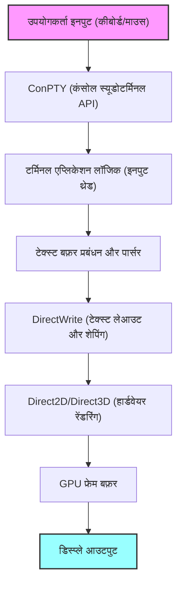
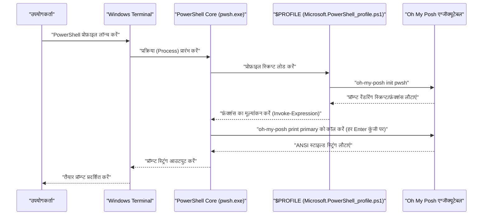

# प्रस्तावना: Windows Terminal को चरम सीमा तक कस्टमाइज़ क्यों करें

आधुनिक सॉफ्टवेयर विकास में, एक टर्मिनल एमुलेटर केवल कमांड इनपुट/आउटपुट इंटरफ़ेस से कहीं अधिक हो गया है; यह सबसे महत्वपूर्ण "कॉकपिट" है जो सीधे एक डेवलपर की उत्पादकता को प्रभावित करता है। पुराने Windows वातावरण में मानक "कमांड प्रॉम्प्ट (cmd.exe)" और पारंपरिक "Windows PowerShell" कंसोल (conhost.exe) अपने खराब रेंडरिंग प्रदर्शन, कम कस्टमाइज़ेबिलिटी और अपूर्ण Unicode समर्थन के कारण Linux और macOS के परिष्कृत टर्मिनल वातावरण की तुलना में बहुत कमजोर थे।

हालाँकि, Microsoft के ओपन-सोर्स "Windows Terminal" के आगमन के साथ स्थिति नाटकीय रूप से बदल गई है। DirectX पर आधारित हार्डवेयर एक्सेलेरेशन द्वारा संचालित अति-तीव्र टेक्स्ट रेंडरिंग, टैब UI और पैन विभाजन (pane splitting) का नेटिव समर्थन, स्वतंत्र शॉर्टकट कुंजी सेटिंग्स, और उन्नत प्रोफ़ाइल प्रबंधन क्षमताएं। Windows Terminal एक अत्यंत शक्तिशाली एप्लिकेशन है जो उन सभी "आधुनिक टर्मिनल" आवश्यकताओं को पूरा करता है जिनकी डेवलपर्स वास्तव में तलाश कर रहे थे।

इस लेख में, हम इस Windows Terminal को "सर्वोत्तम" वातावरण में अपग्रेड करने के लिए एक परम कस्टमाइज़ेशन गाइड प्रदान करते हैं। सतही दिखावे में बदलावों से परे, हम गहन और तकनीकी दृष्टिकोण से स्पष्टीकरण देंगे, जिसमें टेक्स्ट रेंडरिंग के पीछे का गणितीय मॉडल, `settings.json` की गहरी संरचना, PowerShell में Oh My Posh की शुरूआत, WSL वातावरण में Starship का निर्माण, और यहां तक कि रेंडरिंग विलंब (rendering latency) का सैद्धांतिक विश्लेषण भी शामिल है।

हमें उम्मीद है कि यह लेख पाठकों को अपना स्वयं का सर्वश्रेष्ठ टर्मिनल वातावरण बनाने और उनके दैनिक कोडिंग अनुभव को नाटकीय रूप से बेहतर बनाने में मदद करेगा।

---

# 1. Windows Terminal का रेंडरिंग आर्किटेक्चर और गणितीय मॉडल

Windows Terminal इतनी तेज़ी से और सुचारू रूप से क्यों काम करता है, इसके पीछे एक परिष्कृत रेंडरिंग पाइपलाइन है जो Windows के आधुनिक ग्राफ़िक्स स्टैक का पूरा उपयोग करती है। पारंपरिक GDI (Graphics Device Interface) की जगह, Windows Terminal DirectWrite और DirectX (Direct2D/Direct3D) का उपयोग करके GPU-आधारित हार्डवेयर एक्सेलेरेशन अपनाता है।

नीचे टर्मिनल रेंडरिंग पाइपलाइन का वैचारिक आरेख दिया गया है, जो कीबोर्ड इनपुट से लेकर स्क्रीन पर कैरेक्टर रेंडर होने तक की प्रक्रिया को दर्शाता है।



## 1.1 फॉन्ट की सबपिक्सेल एंटी-एलियासिंग और ज्यामिति

लंबे समय तक काम करने के दौरान भी आंखों पर जोर न पड़े, इसके लिए उच्च दृश्यता (visibility) सुनिश्चित करने हेतु टेक्स्ट रेंडरिंग में एंटी-एलियासिंग (Anti-aliasing) तकनीक आवश्यक है। DirectWrite उन्नत सबपिक्सेल एंटी-एलियासिंग का समर्थन करता है जो ClearType तकनीक पर आधारित है।

एक सामान्य LCD डिस्प्ले का प्रत्येक पिक्सेल R (लाल), G (हरा), और B (नीला) के तीन लंबवत (vertical) या क्षैतिज (horizontal) सबपिक्सेल से बना होता है। सबपिक्सेल एंटी-एलियासिंग एक ऐसी तकनीक है जो चमक को नियंत्रित करने के लिए एकल पिक्सेल इकाई (ग्रेस्केल एंटी-एलियासिंग) के बजाय इन 1/3 पिक्सेल इकाइयों के उच्च स्थानिक रिज़ॉल्यूशन (spatial resolution) का उपयोग करती है।

मान लें कि एक द्विआधारी फलन (binary function) $ f(x, y) $ है, जो एक आदर्श वेक्टर फॉन्ट के ग्लिफ़ (glyph) की रूपरेखा (outline) को परिभाषित करता है। यदि पिक्सेल में निर्देशांक $ (x, y) $ ग्लिफ़ के अंदर हैं, तो $ f(x, y) = 1 $, और यदि वे बाहर हैं, तो $ f(x, y) = 0 $ होता है।

एकल सबपिक्सेल (उदाहरण के लिए, लाल सबपिक्सेल) की चमक (luminance) $ I_R $ की गणना उस सबपिक्सेल के स्थानिक क्षेत्र $ S_R $ में $ f(x, y) $ के समाकलन (integral) और डिस्प्ले की भौतिक विशेषताओं या मानव दृश्य विशेषताओं (जैसे गामा विशेषताएँ) को ठीक करने वाले फ़िल्टर फ़ंक्शन $ h(x, y) $ के साथ कनवोल्यूशन (convolution) के रूप में की जाती है।

$$
I_R = \iint_{S_R} f(x, y) \ast h(x, y) \,dx\,dy
$$

हरे ($ I_G $) और नीले ($ I_B $) के लिए भी इसी तरह, उनके संबंधित क्षेत्रों $ S_G, S_B $ के आधार पर गणना की जाती है। Windows Terminal में, इस तरह के जटिल सबपिक्सेल-स्तर के समाकलन और कनवोल्यूशन संचालन (operations) को पहले से उत्पन्न ग्लिफ़ कैश (एटलस टेक्सचर) और GPU के पिक्सेल शेडर का उपयोग करके बड़े पैमाने पर समानांतर प्रसंस्करण (parallel processing) द्वारा नियंत्रित किया जाता है, जिससे CPU पर भार डाले बिना शून्य-विलंब (zero-latency) वाली सुंदर टेक्स्ट रेंडरिंग प्राप्त होती है।

---

# 2. settings.json को पूरी तरह से समझना और गहरी सेटिंग्स

Windows Terminal कस्टमाइज़ेशन का मुख्य भाग कॉन्फ़िगरेशन फ़ाइल `settings.json` का संपादन है। यद्यपि कई आइटम GUI सेटिंग्स स्क्रीन से बदले जा सकते हैं, बेहतरीन कस्टमाइज़ेशन प्राप्त करने और Git का उपयोग करके सेटिंग्स को वर्शन-कंट्रोल करने के लिए, सीधे JSON को संपादित करने का ज्ञान होना आवश्यक है।

सेटिंग्स फ़ाइल मुख्य रूप से निम्नलिखित तीन वर्गों (sections) से बनी होती है:

1. **`profiles`**: प्रत्येक शेल (PowerShell, cmd, WSL, Azure Cloud Shell, आदि) के लिए व्यवहार और रूप (फॉन्ट, पृष्ठभूमि, आरंभिक निर्देशिका (starting directory)) को परिभाषित करता है।
2. **`schemes`**: टर्मिनल के भीतर उपयोग किए जाने वाले 16-रंगों के पैलेट (कलर स्कीम) को परिभाषित करता है।
3. **`actions`**: कस्टम क्रियाओं (कस्टम एक्शन्स) को परिभाषित करता है (जैसे कीबाइंडिंग या पैन विभाजन) जिन्हें शॉर्टकट कुंजियों या कमांड पैलेट से कॉल किया जाता है।

## 2.1 प्रोफाइल की पदानुक्रमित संरचना और इनहेरिटेंस मॉडल

प्रोफाइल सेटिंग्स में, सभी प्रोफाइलों में सामान्य सेटिंग्स को `defaults` ऑब्जेक्ट में लिखा जाता है, और व्यक्तिगत सेटिंग्स को `list` एरे के भीतर प्रत्येक ऑब्जेक्ट में लिखा जाता है। यह इनहेरिटेंस मॉडल कॉन्फ़िगरेशन फ़ाइल में अनावश्यक दोहराव (redundancy) को हटाता है और मेंटेनेबिलिटी में सुधार करता है।

```json
{
    "profiles": {
        "defaults": {
            "font": {
                "face": "CaskaydiaCove Nerd Font",
                "size": 11,
                "weight": "normal",
                "features": {
                    "calt": 1,
                    "liga": 1
                }
            },
            "useAcrylic": true,
            "acrylicOpacity": 0.85,
            "cursorShape": "filledBox",
            "cursorBlinking": true,
            "padding": "12, 12, 12, 12",
            "antialiasingMode": "cleartype",
            "historySize": 10000
        },
        "list": [
            {
                "guid": "{574e775e-4f2a-5b96-ac1e-a2962a402336}",
                "hidden": false,
                "name": "PowerShell 7",
                "source": "Windows.Terminal.PowershellCore",
                "colorScheme": "Tokyo Night",
                "backgroundImage": "C:\\Users\\Username\\Pictures\\Terminal\\cyberpunk_bg.png",
                "backgroundImageOpacity": 0.15,
                "backgroundImageStretchMode": "uniformToFill",
                "startingDirectory": "%USERPROFILE%\\Projects"
            },
            {
                "guid": "{2c4de342-38b7-51cf-b940-2309a097f518}",
                "hidden": false,
                "name": "Ubuntu-22.04",
                "source": "Windows.Terminal.Wsl",
                "colorScheme": "One Half Dark",
                "startingDirectory": "\\\\wsl$\\Ubuntu-22.04\\home\\username"
            }
        ]
    }
}
```

उपरोक्त उदाहरण में, फॉन्ट में लिगेचर (ligatures) को सक्षम करने के लिए सेटिंग `"features": { "calt": 1, "liga": 1 }` जोड़ी गई है। नतीजतन, `!=` या `=>` जैसे कई प्रतीक (symbols) प्रोग्रामिंग के लिए उपयुक्त एकल, सुंदर प्रतीक के रूप में रेंडर होते हैं।

## 2.2 JSON Fragments के माध्यम से मॉड्यूलर सेटिंग्स

Windows Terminal "JSON Fragments" नामक एक्सटेंशन तंत्र (extension mechanism) का समर्थन करता है। यह एक ऐसा तंत्र है जो थर्ड-पार्टी एप्लिकेशन्स (उदाहरण के लिए, नए स्थापित WSL वितरण (distributions) या Visual Studio जैसे विकास उपकरण) को उपयोगकर्ता के मुख्य `settings.json` को सीधे ओवरराइट किए बिना टर्मिनल में गतिशील (dynamically) और सुरक्षित रूप से अपने स्वयं के प्रोफाइल या कलर स्कीम जोड़ने की अनुमति देता है।

यदि कोई डेवलपर अपनी सेटिंग्स को अलग से प्रबंधित करना चाहता है तो वे भी इस तंत्र को लागू कर सकते हैं (बस निर्दिष्ट निर्देशिका में एक JSON फ़ाइल रखें और इसे मर्ज कर दिया जाएगा)।

---

# 3. सर्वोच्च दृश्य अनुभव: थीम, फॉन्ट और पृष्ठभूमि के रहस्य

टर्मिनल की कलर स्कीम केवल दिखावे के बारे में नहीं है, बल्कि यह कोड और लॉग की पठनीयता (readability) से सीधे जुड़ी हुई है, और लंबे समय तक काम करने पर आंखों की थकान को कम करने में एक महत्वपूर्ण कारक है।

## 3.1 कस्टम कलर स्कीम बनाना और लागू करना

इंटरनेट पर Windows Terminal के लिए कई कलर स्कीम उपलब्ध हैं (एक प्रसिद्ध वेबसाइट "Windows Terminal Themes" है)। उन्हें `schemes` एरे में जोड़कर, आप किसी भी कलर स्कीम का उपयोग कर सकते हैं।

हाल के वर्षों में डेवलपर्स के बीच बेहद लोकप्रिय "Tokyo Night" थीम का JSON परिभाषा उदाहरण नीचे दिया गया है। यह नीले और बैंगनी रंग पर आधारित, आंखों के लिए आरामदायक और उच्च कंट्रास्ट वाली थीम है।

```json
"schemes": [
    {
        "name": "Tokyo Night",
        "background": "#1A1B26",
        "foreground": "#A9B1D6",
        "black": "#32344A",
        "red": "#F7768E",
        "green": "#9ECE6A",
        "yellow": "#E0AF68",
        "blue": "#7AA2F7",
        "purple": "#BB9AF7",
        "cyan": "#7DCFFF",
        "white": "#A9B1D6",
        "brightBlack": "#414868",
        "brightRed": "#F7768E",
        "brightGreen": "#9ECE6A",
        "brightYellow": "#E0AF68",
        "brightBlue": "#7AA2F7",
        "brightPurple": "#BB9AF7",
        "brightCyan": "#7DCFFF",
        "brightWhite": "#C0CAF5",
        "cursorColor": "#C0CAF5",
        "selectionBackground": "#33467C"
    }
]
```

प्रत्येक रंग हेक्साडेसिमल कलर कोड (HEX) में निर्दिष्ट किया जाता है, जो ANSI एस्केप अनुक्रमों (escape sequences) के प्रत्येक रंग संख्या (0-15) से मेल खाता है।

## 3.2 Nerd Fonts स्थापित करना और फॉन्ट सेटिंग्स को अनुकूलित करना (CaskaydiaCove Nerd Font)

जब आप उन्नत प्रॉम्प्ट टूल का उपयोग करते हैं, जैसे कि Oh My Posh या Starship (जिनके बारे में बाद में चर्चा की गई है), तो विशेष ग्लिफ़ (icons) वाले फॉन्ट का होना आवश्यक है, जैसे कि Git ब्रांच आइकन, प्रोग्रामिंग भाषा लोगो और OS प्रतीक। मौजूदा प्रोग्रामिंग फॉन्ट्स में इन आइकनों को पैच करके बनाए गए फॉन्ट को "**Nerd Fonts**" कहा जाता है।

Microsoft द्वारा विकसित प्रोग्रामिंग फॉन्ट "Cascadia Code" पढ़ने में बहुत आसान और बेहतरीन है, लेकिन इसमें डिफ़ॉल्ट रूप से Nerd Font के आइकन शामिल नहीं होते हैं। इसलिए, हम "**CaskaydiaCove Nerd Font**" स्थापित करने की दृढ़ता से अनुशंसा करते हैं, जो Nerd Font के साथ पैच किया गया Cascadia Code है।

### स्थापना के चरण (Installation steps):
1. [Nerd Fonts के आधिकारिक GitHub रिलीज़ पेज](https://github.com/ryanoasis/nerd-fonts/releases) से `CascadiaCode.zip` डाउनलोड करें।
2. इसे अनज़िप करें, अंदर मौजूद `.ttf` फ़ाइलों का चयन करें, राइट-क्लिक करें, और "सभी उपयोगकर्ताओं के लिए इंस्टॉल करें" (Install for all users) चुनें।
3. अपने `settings.json` में `font.face` को `"CaskaydiaCove Nerd Font"` में बदलें।

## 3.3 Acrylic इफेक्ट और पृष्ठभूमि छवियों के साथ इमर्सिव अनुभव बनाना

Windows 11 के Fluent Design System की विशेषताओं में से एक "Acrylic" सामग्री प्रभाव है। आप टर्मिनल की पृष्ठभूमि को पारभासी (translucent) बना सकते हैं, जिससे पृष्ठभूमि की विंडो या वॉलपेपर खूबसूरती से धुंधले और दिखाई देने लगते हैं।

```json
"useAcrylic": true,
"acrylicOpacity": 0.75,
```

इसके अलावा, पृष्ठभूमि के रूप में कोई भी चित्र (image) सेट किया जा सकता है। Gif एनिमेशन भी समर्थित हैं, जिससे आप एक गतिशील पृष्ठभूमि (dynamic background) बना सकते हैं। आप चित्र की स्थिति (alignment) और अपारदर्शिता (opacity) को भी बारीकी से नियंत्रित कर सकते हैं।

```json
"backgroundImage": "C:\\Users\\Username\\Pictures\\wallpapers\\anime_cyberpunk.gif",
"backgroundImageOpacity": 0.2,
"backgroundImageStretchMode": "none",
"backgroundImageAlignment": "bottomRight"
```

यह आपके टर्मिनल के निचले दाएं कोने में आपके पसंदीदा पात्र या लोगो को रखने जैसे कस्टमाइज़ेशन की अनुमति देता है, जिससे आपका उत्साह और प्रेरणा बढ़ती है।

---

# 4. उत्पादकता को अधिकतम करना: पैन विभाजन, कीबाइंडिंग और कमांड पैलेट

Windows Terminal में मूल रूप से टर्मिनल मल्टीप्लेक्सर (tmux या screen जैसे) की बुनियादी सुविधा (पैन विभाजन) मौजूद होती है।

`actions` अनुभाग को कस्टमाइज़ करके, आप माउस को छुए बिना, केवल कीबोर्ड संचालन के साथ स्क्रीन को स्वतंत्र रूप से विभाजित, स्थानांतरित और आकार बदल सकते हैं।

```json
"actions": [
    { "command": { "action": "splitPane", "split": "auto", "splitMode": "duplicate" }, "keys": "alt+shift+d" },
    { "command": { "action": "splitPane", "split": "right" }, "keys": "alt+shift+plus" },
    { "command": { "action": "splitPane", "split": "down" }, "keys": "alt+shift+minus" },
    { "command": { "action": "moveFocus", "direction": "left" }, "keys": "alt+left" },
    { "command": { "action": "moveFocus", "direction": "right" }, "keys": "alt+right" },
    { "command": { "action": "moveFocus", "direction": "up" }, "keys": "alt+up" },
    { "command": { "action": "moveFocus", "direction": "down" }, "keys": "alt+down" },
    { "command": { "action": "resizePane", "direction": "left" }, "keys": "alt+shift+left" },
    { "command": { "action": "resizePane", "direction": "right" }, "keys": "alt+shift+right" },
    { "command": { "action": "resizePane", "direction": "up" }, "keys": "alt+shift+up" },
    { "command": { "action": "resizePane", "direction": "down" }, "keys": "alt+shift+down" },
    { "command": { "action": "closePane" }, "keys": "ctrl+w" }
]
```

उपरोक्त कीबाइंड सेट करके, आप `Alt + Shift + तीर (Arrow)` कुंजियों के साथ पैन का आकार समायोजित कर सकते हैं, और `Alt + तीर (Arrow)` कुंजियों के साथ पैन के बीच फ़ोकस को तुरंत स्थानांतरित कर सकते हैं। यह आपको एक साथ जटिल कार्य करने की अनुमति देता है: एक पैन में Node.js स्थानीय सर्वर चलाना और लॉग की निगरानी करना, दूसरे में Git कमांड चलाना, और तीसरे में Docker कंटेनरों की स्थिति की जांच करना।

## 4.1 Quake मोड (ग्लोबल ड्रॉप-डाउन टर्मिनल)

FPS गेम "Quake" के कंसोल स्क्रीन की तरह, "Quake Mode" (ड्रॉप-डाउन मोड) भी समर्थित है, जिससे आप कभी भी स्क्रीन के ऊपर से टर्मिनल ला सकते हैं। डिफ़ॉल्ट रूप से, `Win + \` कुंजी दबाने पर टर्मिनल (स्क्रीन के आधे आकार का) एनीमेशन के साथ ऊपर से नीचे खिसक आता है। जब आप तुरंत कोई कमांड टाइप करना चाहते हैं तो यह बहुत उपयोगी होता है।

---

# 5. स्टार्टअप लेआउट के स्वचालन (automation) के लिए `wt.exe` का उपयोग करना

हर सुबह काम शुरू करते समय: किसी विशिष्ट प्रोजेक्ट डायरेक्टरी में टर्मिनल खोलना, स्क्रीन को 3 भागों में विभाजित करना, और क्रमशः फ्रंटएंड बिल्ड, बैकएंड सर्वर स्टार्टअप और डेटाबेस मॉनिटरिंग कमांड चलाना... ऐसे नियमित कार्यों को स्वचालित किया जाना चाहिए।

Windows Terminal का वास्तविक एग्जीक्यूटेबल `wt.exe` है, जो शक्तिशाली कमांड-लाइन तर्कों (arguments) का समर्थन करता है, जिससे आप तर्कों का उपयोग करके स्टार्टअप प्रोफ़ाइल और पैन विभाजन स्थिति को नियंत्रित कर सकते हैं।

```powershell
wt -p "PowerShell 7" -d "C:\Projects\MyApp" ; split-pane -p "Ubuntu-22.04" -d "/var/log" -V ; split-pane -p "cmd" -H
```

यदि आप इस कमांड को Windows शॉर्टकट या बैच फ़ाइल के रूप में सहेजते हैं, तो एक जटिल विकास वातावरण (development environment) लेआउट एक क्लिक से तुरंत बहाल (restore) हो जाएगा।

---

# 6. प्रॉम्प्ट का विकास 1: PowerShell और Oh My Posh

"**Oh My Posh**" Windows वातावरण (विशेष रूप से नवीनतम क्रॉस-प्लेटफ़ॉर्म PowerShell 7 / PowerShell Core) में मानक शेल PowerShell में भारी सुधार करता है। Oh My Posh सभी शेल्स के लिए एक कस्टम प्रॉम्प्ट इंजन है, जो वर्तमान डायरेक्टरी, Git ब्रांच और संशोधन (modification) स्थिति, Node.js और Python वर्शन, Kubernetes संदर्भ (context) आदि जैसी विकास के लिए आवश्यक सभी स्थितियों को खूबसूरती से और दृष्टिगत रूप से प्रदर्शित करता है।

नीचे दिया गया आरेख PowerShell शुरू होने पर Oh My Posh कैसे लोड होता है और प्रॉम्प्ट कैसे रेंडर होता है, इसका अनुक्रम (sequence) दिखाता है।



## 6.1 Oh My Posh की स्थापना और कॉन्फ़िगरेशन

Windows वातावरण में, इसे आधिकारिक पैकेज मैनेजर `winget` का उपयोग करके आसानी से स्थापित किया जा सकता है।

```powershell
winget install JanDeDobbeleer.OhMyPosh -s winget
```

स्थापना के बाद, स्टार्टअप के समय Oh My Posh को इनिशियलाइज़ (initialize) करने के लिए PowerShell प्रोफ़ाइल स्क्रिप्ट को संपादित करें। प्रोफ़ाइल का पथ (path) स्वचालित चर (automatic variable) `$PROFILE` में संग्रहीत होता है।

```powershell
notepad $PROFILE
```

जब फ़ाइल खुल जाए, तो निम्नलिखित कोड जोड़ें:

```powershell
# उपनाम (Alias) सेटिंग्स
Set-Alias ll ls
Set-Alias g git

# प्रेडिक्टिव IntelliSense सक्षम करना (PSReadLine मॉड्यूल)
Set-PSReadLineOption -PredictionSource History
Set-PSReadLineOption -PredictionViewStyle ListView

# Oh My Posh को इनिशियलाइज़ करना
# अपनी पसंद की थीम चुनें (उदा: jandedobbeleer)।
# अंतर्निहित थीम का पथ $env:POSH_THEMES_PATH में है।
oh-my-posh init pwsh --config "$env:POSH_THEMES_PATH\tokyonight_storm.omp.json" | Invoke-Expression

# टर्मिनल-आइकन्स (Terminal-Icons) मॉड्यूल जो फ़ोल्डर्स और फाइलों में आइकन दिखाता है
# (केवल पहली बार Install-Module -Name Terminal-Icons -Repository PSGallery -Force आवश्यक है)
Import-Module -Name Terminal-Icons
```

सैकड़ों थीम (config) उपलब्ध हैं, और आप JSON, YAML या TOML प्रारूपों में अपनी खुद की पूरी थीम भी बना सकते हैं। "खंड" (Segment) की अवधारणा का उपयोग करके, आप बाएँ (Left) और दाएँ (Right) प्रदर्शित होने वाली जानकारी को स्वतंत्र रूप से जोड़कर प्रॉम्प्ट को डिज़ाइन कर सकते हैं।

---

# 7. प्रॉम्प्ट का विकास 2: WSL2 आर्किटेक्चर और Starship का एकीकरण

WSL2 (Windows Subsystem for Linux 2), जो Windows पर वास्तविक Linux कर्नेल चला सकता है, आधुनिक वेब विकास और क्लाउड-नेटिव विकास के लिए आवश्यक है। WSL (Bash या Zsh) के भीतर शेल के प्रॉम्प्ट को कस्टमाइज़ करने के लिए "**Starship**" सबसे अच्छा समाधान है।

Rust भाषा में लिखा गया, Starship एक अत्यंत तीव्र और अत्यधिक अनुकूलन योग्य (customizable) क्रॉस-शेल प्रॉम्प्ट है। इसका लाभ यह है कि सिर्फ एक कॉन्फ़िगरेशन फ़ाइल (TOML) लिखकर, आप किसी भी शेल जैसे Bash, Zsh, या Fish में बिल्कुल वही प्रॉम्प्ट फिर से बना सकते हैं।

## 7.1 Starship की स्थापना

WSL टर्मिनल (जैसे Ubuntu) खोलें और आधिकारिक इंस्टॉलेशन स्क्रिप्ट चलाएँ।

```bash
curl -sS https://starship.rs/install.sh | sh
```

फिर, यदि आप Bash का उपयोग कर रहे हैं, तो हुक (hook) को सक्षम करने के लिए `~/.bashrc` के अंत में निम्नलिखित जोड़ें।

```bash
# ~/.bashrc
eval "$(starship init bash)"
```

यदि आप Zsh का उपयोग कर रहे हैं, तो इसे `~/.zshrc` के अंत में जोड़ें।

```bash
# ~/.zshrc
eval "$(starship init zsh)"
```

## 7.2 starship.toml के साथ अंतिम कस्टमाइज़ेशन

Starship की सेटिंग्स `~/.config/starship.toml` में लिखी जाती हैं। चूँकि यह TOML प्रारूप (format) है, इसलिए मनुष्यों के लिए JSON की तुलना में इसे पढ़ना और लिखना आसान है, और इसमें टिप्पणियाँ (comments) भी लिखी जा सकती हैं।

नीचे एक आधुनिक और सूचनात्मक प्रॉम्प्ट के लिए कॉन्फ़िगरेशन का उदाहरण दिया गया है।

```toml
# ~/.config/starship.toml

# संपूर्ण प्रॉम्प्ट का प्रारूप (क्रम) परिभाषित करें
format = """
[╭─](bold blue)$os$directory$git_branch$git_status$nodejs$python$golang$rust
[╰─$character](bold blue)"""

# OS आइकन के लिए प्रदर्शन सेटिंग्स
[os]
disabled = false
format = "[$symbol]($style) "

[os.symbols]
Ubuntu = " "
Windows = " "
Macos = " "
Alpine = " "

# डायरेक्टरी प्रदर्शन सेटिंग्स
[directory]
style = "bold cyan"
read_only = " "
truncation_length = 3
truncate_to_repo = true

# Git ब्रांच सेटिंग्स
[git_branch]
symbol = " "
style = "bold purple"

# Git स्थिति (status) सेटिंग्स
[git_status]
style = "bold red"
modified = " "
staged = " "
untracked = " "
deleted = "✖ "

# प्रॉम्प्ट कैरेक्टर (इनपुट लाइन प्रतीक)
[character]
success_symbol = "[❯](bold green)"
error_symbol = "[❯](bold red)"
```

इस सेटिंग के साथ, प्रॉम्प्ट को 2 पंक्तियों में कॉन्फ़िगर किया जाता है। पहली पंक्ति में OS का आइकन, वर्तमान डायरेक्टरी का पथ, Git ब्रांच और स्थिति, और प्रत्येक भाषा के वातावरण (Node.js, Python, आदि) के वर्शन की जानकारी प्रदर्शित होती है। दूसरी पंक्ति एक सरल इनपुट पंक्ति है, जो लंबे कमांड टाइप करते समय स्क्रीन स्पेस नहीं घेरती।

---

# 8. टर्मिनल रेंडरिंग में विलंब और प्रदर्शन का गणितीय मॉडल

टर्मिनल की उपयोगिता का मूल्यांकन करने के लिए सबसे महत्वपूर्ण मेट्रिक्स में से एक "**इनपुट विलंब (Input Latency)**" है। यह कीबोर्ड की कुंजी (key) दबाने और स्क्रीन पर संबंधित पिक्सेल का रंग बदलने तक, यानी दृश्य प्रतिक्रिया (visual feedback) प्राप्त होने तक के समय के अंतर (time delay) को संदर्भित करता है।

इस कुल विलंब $ T_{total} $ को सख्ती से निम्नलिखित घटकों के योग के रूप में गणितीय रूप से मॉडल किया जा सकता है:

$$
T_{total} = T_{hw\_input} + T_{os} + T_{pty} + T_{app} + T_{render} + T_{display}
$$

प्रत्येक चर (variable) का अर्थ और विशिष्ट लगने वाला समय इस प्रकार है:

- $ T_{hw\_input} $: हार्डवेयर विलंब जब कीबोर्ड का मैकेनिकल स्विच चालू होता है, USB नियंत्रक (controller) द्वारा पोल (poll) किया जाता है, और एक इंटरप्ट (interrupt) संकेत भेजा जाता है (लगभग 1-5 ms)।
- $ T_{os} $: OS के HID (Human Interface Device) ड्राइवर लेयर द्वारा संदेश कतार प्रसंस्करण (message queue processing) में विलंब (लगभग 1-2 ms)।
- $ T_{pty} $: ConPTY (स्यूडो-टर्मिनल) के कारण बफरिंग और कैरेक्टर एन्कोडिंग (जैसे UTF-8 से UTF-16) रूपांतरण में विलंब (लगभग 2-10 ms)।
- $ T_{app} $: शेल (PowerShell/Bash) द्वारा कमांड इंटरप्रिटेशन और स्क्रीन आउटपुट को निर्धारित करने में लगने वाला समय। Oh My Posh या Starship के साथ Git स्थिति (status) लाने में लगने वाला समय भी इसमें शामिल है (लगभग 10-50 ms)।
- $ T_{render} $: Windows Terminal (DirectWrite/DirectX) द्वारा टेक्स्ट ग्लिफ़ (glyphs) को टेक्सचर के रूप में रास्टराइज़ करने, उन्हें GPU मेमोरी में स्थानांतरित करने, और स्वैप चेन (swap chain) को फ्लिप करने में लगने वाला रेंडरिंग विलंब (लगभग 2-8 ms)।
- $ T_{display} $: डिस्प्ले विलंब जब GPU के फ्रेम बफर से मॉनिटर पर सिग्नल आउटपुट होता है, और लिक्विड क्रिस्टल अणु भौतिक रूप से प्रकाश-उत्सर्जक अवस्था को बदलने के लिए प्रतिक्रिया करते हैं (GtG प्रतिक्रिया समय, आदि। लगभग 5-20 ms)।

Windows Terminal विकास टीम ने विशेष रूप से $ T_{pty} $ और $ T_{render} $ को कम करने में बहुत प्रयास किया है। शुरुआती वर्शन में, टेक्स्ट रास्टराइज़ेशन के दौरान कैश मिस होने के कारण स्पाइक-जैसे विलंब (फ्रेम ड्रॉप) होते थे, लेकिन नवीनतम वर्शन ने "एटलस-आधारित ग्लिफ़ कैश (Atlas-based glyph cache)" एल्गोरिथ्म पेश किया है।

ग्लिफ़ को एटलस में बदलकर, स्ट्रिंग्स को रेंडर करना GPU पर एक साधारण मैट्रिक्स ऑपरेशन (matrix operation) बन जाता है: "स्मृति (memory) में पहले से उत्पन्न एक विशाल फॉन्ट टेक्सचर से काटना और स्क्रीन पर अल्फा सम्मिश्रण (alpha blending) के साथ 합성 (synthesizing) करना।"

जब रेंडर की जाने वाली स्ट्रिंग में $ N $ कैरेक्टर होते हैं, तो पारंपरिक GDI दृष्टिकोण का उपयोग करते हुए CPU द्वारा अनुक्रमिक रेंडरिंग (sequential rendering) लागत में $ \mathcal{O}(N) $ समय लगता था, लेकिन GPU-आधारित एटलस रेंडरिंग समानांतर शेडर्स (parallel shaders) का उपयोग करके $ \mathcal{O}(1) $ के करीब निरंतर समय (constant time) में रेंडरिंग की अनुमति देता है।

परिणामस्वरूप, यहां तक कि ऐसी स्थितियों में भी जहां मानक आउटपुट (standard output) में बड़ी मात्रा में लॉग बहते हैं (उदाहरण के लिए: `npm install` या बड़े पैमाने पर C++ प्रोजेक्ट के संकलन संदेश (compile messages)), Windows Terminal बिना रुके (processing drop) 60fps (या 144Hz और उच्चतर रीफ्रेश दर वाले वातावरण में) पर टेक्स्ट को आसानी से स्क्रॉल करना जारी रख सकता है।

---

# 9. उन्नत समस्या निवारण और डिबगिंग तकनीकें

जैसे ही आप Windows Terminal को चरम सीमा तक कस्टमाइज़ करते हैं, आपको कॉन्फ़िगरेशन फ़ाइलों में सिंटैक्स त्रुटियों (syntax errors) या फॉन्ट रेंडरिंग समस्याओं जैसी अप्रत्याशित समस्याओं का सामना करना पड़ सकता है। यहां हम इंजीनियरों के लिए उन्नत समस्या निवारण (troubleshooting) तकनीकों का परिचय देते हैं।

## 9.1 settings.json का JSON Schema सत्यापन

`settings.json` की संरचना सख्ती से परिभाषित है, और JSON Schema का उपयोग करके एडिटर (जैसे VS Code) में रीयल-टाइम सिंटैक्स जाँच करने की अनुशंसा की जाती है। जब आप VS Code में `settings.json` खोलते हैं, तो Windows Terminal स्कीमा डिफ़ॉल्ट रूप से लागू होता है, और अमान्य प्रॉपर्टी नाम या प्रकार की त्रुटियों (type errors) (उदाहरण के लिए, जहाँ किसी संख्या की अपेक्षा हो वहाँ स्ट्रिंग निर्दिष्ट करना) को तुरंत लहरदार रेखाओं (wavy lines) के साथ चेतावनी दी जाती है।

## 9.2 प्रॉम्प्ट प्रदर्शन प्रोफाइलिंग (Performance Profiling)

यदि प्रॉम्प्ट बहुत धीमा है (Enter कुंजी दबाने और अगले इनपुट लाइन के प्रकट होने के बीच अंतराल (lag) है), तो संभावना है कि Oh My Posh या Starship के निष्पादन (execution) समय में कोई समस्या है। Oh My Posh में प्रत्येक ब्लॉक के रेंडरिंग समय को मापने के लिए एक उन्नत डिबगिंग सुविधा है।

```powershell
oh-my-posh debug
```

इस कमांड को निष्पादित करने से, टर्मिनल वातावरण के चर, लोड किए गए कॉन्फ़िगरेशन फ़ाइल का पथ, और प्रॉम्प्ट बनाने वाले प्रत्येक खंड (segment) का प्रसंस्करण समय मिलीसेकंड (ms) में विस्तार से आउटपुट होता है। यह आपको सटीक रूप से यह पहचानने की अनुमति देता है कि कौन सी जानकारी पुनर्प्राप्त करना (उदाहरण के लिए, एक बड़े मोनोरेपो में Git स्थिति प्राप्त करना, क्लाउड प्रदाता की प्रमाणीकरण (authentication) स्थिति की जांच करना, नेटवर्क विलंब (network latency), आदि) अड़चन (bottleneck) बन रही है, जिससे आप अनावश्यक मॉड्यूल को अक्षम करके कस्टमाइज़ कर सकते हैं।

## 9.3 GPU एक्सेलेरेशन को अक्षम करना (सॉफ़्टवेयर रेंडरिंग में फ़ॉलबैक)

पुराने हार्डवेयर या विशिष्ट GPU ड्राइवरों में बग के साथ दुर्लभ मामलों में, DirectX हार्डवेयर रेंडरिंग के कारण स्क्रीन टिमटिमा सकती है (flickering) या कैरेक्टर कट सकते हैं। इस स्थिति में, जबरन सॉफ़्टवेयर रेंडरिंग में फ़ॉलबैक करने का एक सेटिंग विकल्प है।

`settings.json` के रूट लेवल (root level) पर निम्नलिखित सेटिंग जोड़ें।

```json
"softwareRendering": true
```

यह GPU के बजाय CPU-आधारित (WARP) रेंडरिंग पर स्विच कर देगा। हालांकि इससे प्रदर्शन कम incremental हो जाएगा, लेकिन यह रेंडरिंग की सटीकता सुनिश्चित करेगा। ग्राफिक्स से संबंधित समस्याओं को अलग करने (isolating) के लिए यह एक शक्तिशाली तरीका है।

---

# निष्कर्ष

Windows Terminal का वास्तविक मूल्य केवल "पुराने कमांड प्रॉम्प्ट के विकल्प" के रूप में इसकी स्थिति से कहीं अधिक है। DirectX का उपयोग करते हुए नवीनतम रेंडरिंग तकनीक, एक लचीला और शक्तिशाली JSON-आधारित कॉन्फ़िगरेशन तंत्र, और WSL और PowerShell जैसे विभिन्न शेल्स के साथ सहज एकीकरण। इन्हें गहराई से समझकर और इन्हें अपने अनुकूल बनाने के लिए कस्टमाइज़ करके, विकास प्रक्रिया (development process) में घर्षण (friction) को काफी कम किया जा सकता है।

इस लेख में जिन कस्टमाइज़ेशन विधियों पर चर्चा की गई है—कलर स्कीम की ट्यूनिंग, Nerd Font के साथ दृश्य जानकारी का विस्तार, Oh My Posh और Starship का उपयोग करके संदर्भ-जागरूक (context-aware) स्मार्ट प्रॉम्प्ट, और पैन विभाजन का उपयोग करके मल्टीटास्किंग वातावरण का निर्माण। ये न केवल आपके रोजमर्रा के कोडिंग अनुभव को बेहतर बनाएंगे, बल्कि टर्मिनल का उपयोग करने के लिए आपकी प्रेरणा को भी बढ़ाएंगे।

विकास वातावरण (development environment) के अनुकूलन (optimization) का कोई अंत नहीं है। जैसे-जैसे नए कमांड लाइन टूल सामने आएंगे और OS आर्किटेक्चर विकसित होंगे, हमारे टर्मिनल भी आकार बदलते रहेंगे। हमें उम्मीद है कि यह लेख पाठकों के लिए उनके "परम विकास वातावरण" की खोज की अंतहीन यात्रा में एक निश्चित मार्गदर्शक साबित होगा।
