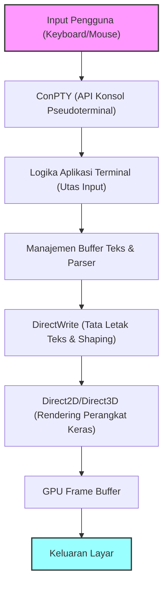
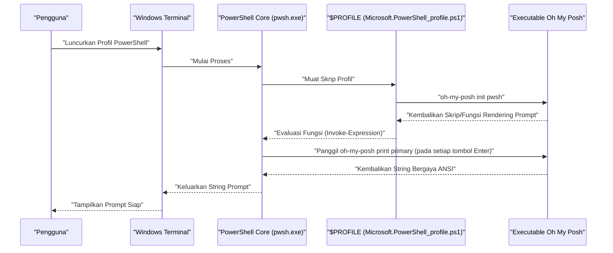

# Pendahuluan: Mengapa Mengustomisasi Windows Terminal Secara Ekstrem?

Dalam pengembangan perangkat lunak modern, emulator terminal telah melampaui antarmuka input/output perintah biasa, menjadi "kokpit" paling penting yang secara langsung memengaruhi produktivitas pengembang. Standar sebelumnya di lingkungan Windows, yaitu "Command Prompt (cmd.exe)" dan konsol "Windows PowerShell" tradisional (conhost.exe), sangat tertinggal jika dibandingkan dengan lingkungan terminal yang canggih di Linux atau macOS, karena performa penggambaran dan kemampuannya untuk dikustomisasi yang rendah, serta dukungan Unicode yang tidak sempurna.

Namun, dengan hadirnya "Windows Terminal" yang pengembangan sumber terbukanya dipimpin oleh Microsoft, situasinya berubah drastis. Rendering teks super cepat dengan akselerasi perangkat keras berbasis DirectX, dukungan native untuk antarmuka tab dan pembagian panel, pintasan keyboard yang dapat diatur dengan bebas, dan fitur manajemen profil tingkat lanjut. Windows Terminal adalah aplikasi yang sangat kuat yang memenuhi semua persyaratan "terminal modern" yang benar-benar diinginkan pengembang.

Dalam artikel ini, kami menyediakan panduan kustomisasi pamungkas untuk mengangkat Windows Terminal ini menjadi lingkungan "terkuat". Tidak hanya mengubah tampilan luar, kami akan menjelaskan secara menyeluruh dan dari perspektif teknis mengenai model matematis yang mendasari rendering teks, struktur mendalam `settings.json`, pengenalan Oh My Posh di PowerShell, pembangunan Starship di lingkungan WSL, hingga analisis teoretis mengenai keterlambatan (delay) penggambaran.

Semoga artikel ini dapat membantu para pembaca untuk membangun lingkungan terminal terbaik mereka sendiri dan meningkatkan pengalaman pengkodean sehari-hari secara drastis.

---

# 1. Arsitektur Rendering Windows Terminal dan Model Matematis

Di balik operasi Windows Terminal yang begitu cepat dan mulus, terdapat alur rendering canggih yang memanfaatkan tumpukan grafis modern Windows secara maksimal. Menggantikan GDI (Graphics Device Interface) konvensional, Windows Terminal mengadopsi akselerasi perangkat keras berbasis GPU yang memanfaatkan DirectWrite dan DirectX (Direct2D/Direct3D).

Berikut adalah diagram konseptual dari alur rendering terminal, dari input tombol hingga karakter digambar di layar.



## 1.1 Anti-Aliasing Subpiksel Font dan Geometri

Dalam menggambar teks, teknologi anti-aliasing sangat penting untuk memastikan visibilitas tinggi yang tidak membuat mata lelah bahkan selama pekerjaan berjam-jam. DirectWrite mendukung anti-aliasing subpiksel tingkat lanjut yang menerapkan teknologi ClearType.

Setiap piksel pada layar LCD (Liquid Crystal Display) umumnya terdiri dari tiga subpiksel vertikal atau horizontal: R (Merah), G (Hijau), dan B (Biru). Anti-aliasing subpiksel adalah teknologi yang mengontrol kecerahan menggunakan resolusi spasial tinggi unit 1/3 piksel ini, bukan satu unit piksel (anti-aliasing skala abu-abu).

Misalkan fungsi biner yang menentukan kontur mesin terbang (glyph) dari font vektor ideal adalah $ f(x, y) $. Jika koordinat $ (x, y) $ dalam piksel berada di dalam glyph, maka $ f(x, y) = 1 $, dan jika berada di luar, maka $ f(x, y) = 0 $.

Kecerahan $ I_R $ dari subpiksel tunggal (misalnya, subpiksel merah) dihitung sebagai konvolusi dari integral $ f(x, y) $ pada domain spasial $ S_R $ dari subpiksel tersebut dengan fungsi filter $ h(x, y) $ untuk mengoreksi karakteristik fisik tampilan dan karakteristik visual manusia (seperti karakteristik gamma).

$$
I_R = \iint_{S_R} f(x, y) \ast h(x, y) \,dx\,dy
$$

Demikian juga untuk hijau ($ I_G $) dan biru ($ I_B $), dihitung berdasarkan domain spasial masing-masing $ S_G, S_B $. Di Windows Terminal, operasi integral/konvolusi tingkat subpiksel yang kompleks ini diproses secara super paralel menggunakan cache glyph (Tekstur Atlas) yang dihasilkan sebelumnya dan pixel shader GPU, sehingga menghasilkan rendering teks yang indah tanpa penundaan dan tanpa membebani CPU.

---

# 2. Pemahaman Lengkap settings.json dan Pengaturan Mendalam

Inti dari kustomisasi Windows Terminal terletak pada pengeditan file konfigurasi `settings.json`. Banyak item yang juga dapat diubah melalui layar pengaturan GUI, tetapi untuk mengejar kustomisasi yang ekstrem dan mengelola versi pengaturan menggunakan Git, dll., pengetahuan untuk mengedit JSON secara langsung sangatlah penting.

File konfigurasi terutama terdiri dari 3 bagian utama berikut:

1. **`profiles`**: Mendefinisikan perilaku dan tampilan (font, latar belakang, direktori awal) untuk setiap shell (PowerShell, cmd, WSL, Azure Cloud Shell, dll.).
2. **`schemes`**: Mendefinisikan 16 palet warna (skema warna) yang digunakan di dalam terminal.
3. **`actions`**: Mendefinisikan tindakan kustom (pengikatan tombol atau pembagian panel) yang dipanggil dari pintasan keyboard atau palet perintah.

## 2.1 Struktur Hierarki Profil dan Model Pewarisan

Dalam pengaturan profil, pengaturan yang umum untuk semua profil ditulis di objek `defaults`, dan pengaturan individu ditulis di setiap objek dalam array `list`. Melalui model pewarisan ini, redundansi file konfigurasi dapat dihilangkan dan pemeliharaannya dapat ditingkatkan.

```json
{
    "profiles": {
        "defaults": {
            "font": {
                "face": "CaskaydiaCove Nerd Font",
                "size": 11,
                "weight": "normal",
                "features": {
                    "calt": 1,
                    "liga": 1
                }
            },
            "useAcrylic": true,
            "acrylicOpacity": 0.85,
            "cursorShape": "filledBox",
            "cursorBlinking": true,
            "padding": "12, 12, 12, 12",
            "antialiasingMode": "cleartype",
            "historySize": 10000
        },
        "list": [
            {
                "guid": "{574e775e-4f2a-5b96-ac1e-a2962a402336}",
                "hidden": false,
                "name": "PowerShell 7",
                "source": "Windows.Terminal.PowershellCore",
                "colorScheme": "Tokyo Night",
                "backgroundImage": "C:\\Users\\Username\\Pictures\\Terminal\\cyberpunk_bg.png",
                "backgroundImageOpacity": 0.15,
                "backgroundImageStretchMode": "uniformToFill",
                "startingDirectory": "%USERPROFILE%\\Projects"
            },
            {
                "guid": "{2c4de342-38b7-51cf-b940-2309a097f518}",
                "hidden": false,
                "name": "Ubuntu-22.04",
                "source": "Windows.Terminal.Wsl",
                "colorScheme": "One Half Dark",
                "startingDirectory": "\\\\wsl$\\Ubuntu-22.04\\home\\username"
            }
        ]
    }
}
```

Pada contoh di atas, pengaturan untuk mengaktifkan ligatur pada font `"features": { "calt": 1, "liga": 1 }` ditambahkan. Hal ini membuat beberapa simbol seperti `!=` dan `=>` digambar sebagai satu simbol indah yang cocok untuk pemrograman.

## 2.2 Pengaturan Modular dengan Fragmen JSON

Windows Terminal mendukung mekanisme ekstensi yang disebut "JSON Fragments". Ini adalah mekanisme di mana aplikasi pihak ketiga (misalnya, distribusi WSL yang baru diinstal atau alat pengembangan seperti Visual Studio) dapat menambahkan profil dan skema warnanya sendiri ke terminal secara dinamis dan aman tanpa menimpa `settings.json` utama pengguna secara langsung.

Mekanisme ini juga dapat diterapkan ketika pengembang ingin membagi dan mengelola pengaturan kustom mereka sendiri (hanya dengan menempatkan file JSON di direktori yang ditentukan, maka file tersebut akan digabungkan).

---

# 3. Pengalaman Visual Tertinggi: Rahasia Tema, Font, dan Latar Belakang

Skema warna terminal merupakan elemen penting yang terhubung langsung tidak hanya dengan estetika, tetapi juga dengan keterbacaan kode atau log dan pengurangan kelelahan mata saat bekerja berjam-jam.

## 3.1 Membuat Sendiri dan Menerapkan Skema Warna

Banyak skema warna untuk Windows Terminal dipublikasikan di internet (Situs web bernama "Windows Terminal Themes" sangat terkenal). Anda dapat menggunakan skema warna secara bebas dengan menambahkannya ke array `schemes`.

Berikut ini adalah contoh definisi JSON untuk tema "Tokyo Night" yang sangat populer di kalangan pengembang akhir-akhir ini. Ini adalah tema berbasis biru dan ungu yang ramah di mata dan kontrasnya tinggi.

```json
"schemes": [
    {
        "name": "Tokyo Night",
        "background": "#1A1B26",
        "foreground": "#A9B1D6",
        "black": "#32344A",
        "red": "#F7768E",
        "green": "#9ECE6A",
        "yellow": "#E0AF68",
        "blue": "#7AA2F7",
        "purple": "#BB9AF7",
        "cyan": "#7DCFFF",
        "white": "#A9B1D6",
        "brightBlack": "#414868",
        "brightRed": "#F7768E",
        "brightGreen": "#9ECE6A",
        "brightYellow": "#E0AF68",
        "brightBlue": "#7AA2F7",
        "brightPurple": "#BB9AF7",
        "brightCyan": "#7DCFFF",
        "brightWhite": "#C0CAF5",
        "cursorColor": "#C0CAF5",
        "selectionBackground": "#33467C"
    }
]
```

Setiap warna ditentukan dalam kode warna heksadesimal (HEX) dan sesuai dengan masing-masing nomor warna (0-15) dari urutan escape ANSI.

## 3.2 Pengenalan Nerd Fonts dan Optimalisasi Pengaturan Font (CaskaydiaCove Nerd Font)

Saat menggunakan alat prompt tingkat lanjut seperti Oh My Posh dan Starship (akan dijelaskan nanti), Anda harus memiliki font yang mencakup glyph khusus (ikon) seperti ikon cabang Git, logo bahasa pemrograman, dan simbol OS. Font yang dipatch (ditambahkan) dengan ikon-ikon ini ke font pemrograman yang sudah ada disebut "**Nerd Fonts**".

Font pemrograman "Cascadia Code" yang dikembangkan oleh Microsoft sangat mudah dibaca dan luar biasa, tetapi secara default tidak menyertakan ikon Nerd Font. Oleh karena itu, sangat disarankan untuk memperkenalkan "**CaskaydiaCove Nerd Font**", yaitu Cascadia Code dengan patch Nerd Font yang diterapkan.

### Langkah-langkah Instalasi:
1. Unduh `CascadiaCode.zip` dari [Halaman Rilis GitHub Resmi Nerd Fonts](https://github.com/ryanoasis/nerd-fonts/releases).
2. Ekstrak, pilih file `.ttf` di dalamnya, klik kanan, dan pilih "Instal untuk semua pengguna".
3. Ubah `font.face` di `settings.json` menjadi `"CaskaydiaCove Nerd Font"`.

## 3.3 Menghadirkan Imersi dengan Efek Akrilik dan Gambar Latar Belakang

Salah satu fitur yang mewujudkan Fluent Design System Windows 11 adalah efek material "Acrylic" (Akrilik). Anda dapat membuat latar belakang terminal menjadi semitransparan, memburamkan jendela atau wallpaper di belakangnya dengan indah.

```json
"useAcrylic": true,
"acrylicOpacity": 0.75,
```

Selain itu, dimungkinkan untuk menetapkan gambar apa pun sebagai latar belakang. Animasi GIF juga didukung, sehingga Anda dapat membuat latar belakang yang dinamis. Anda juga dapat mengontrol perataan dan opasitas gambar secara detail.

```json
"backgroundImage": "C:\\Users\\Username\\Pictures\\wallpapers\\anime_cyberpunk.gif",
"backgroundImageOpacity": 0.2,
"backgroundImageStretchMode": "none",
"backgroundImageAlignment": "bottomRight"
```

Ini memungkinkan kustomisasi yang meningkatkan motivasi, seperti menempatkan karakter atau logo favorit secara halus di sudut kanan bawah terminal.

---

# 4. Memaksimalkan Produktivitas: Pembagian Panel, Keybinding, dan Palet Perintah

Windows Terminal secara native memiliki fungsi dasar (pembagian panel layar) yang dimiliki oleh terminal multiplexer seperti tmux atau screen.

Dengan menyesuaikan bagian `actions`, Anda akan dapat membagi, memindahkan, dan mengubah ukuran layar secara bebas hanya dengan menggunakan operasi keyboard, tanpa perlu menyentuh mouse sama sekali.

```json
"actions": [
    { "command": { "action": "splitPane", "split": "auto", "splitMode": "duplicate" }, "keys": "alt+shift+d" },
    { "command": { "action": "splitPane", "split": "right" }, "keys": "alt+shift+plus" },
    { "command": { "action": "splitPane", "split": "down" }, "keys": "alt+shift+minus" },
    { "command": { "action": "moveFocus", "direction": "left" }, "keys": "alt+left" },
    { "command": { "action": "moveFocus", "direction": "right" }, "keys": "alt+right" },
    { "command": { "action": "moveFocus", "direction": "up" }, "keys": "alt+up" },
    { "command": { "action": "moveFocus", "direction": "down" }, "keys": "alt+down" },
    { "command": { "action": "resizePane", "direction": "left" }, "keys": "alt+shift+left" },
    { "command": { "action": "resizePane", "direction": "right" }, "keys": "alt+shift+right" },
    { "command": { "action": "resizePane", "direction": "up" }, "keys": "alt+shift+up" },
    { "command": { "action": "resizePane", "direction": "down" }, "keys": "alt+shift+down" },
    { "command": { "action": "closePane" }, "keys": "ctrl+w" }
]
```

Dengan mengatur pengikatan tombol di atas, Anda dapat menyesuaikan ukuran panel dengan `Alt + Shift + Panah`, dan menggeser fokus antar panel secara instan dengan `Alt + Panah`. Hal ini memungkinkan kerja paralel tingkat lanjut dengan mulus, seperti memulai server lokal Node.js dan memantau log di satu panel, menjalankan perintah Git di panel lain, dan memeriksa status kontainer Docker di panel lainnya.

## 4.1 Mode Quake (Terminal Drop-down Global)

Mode Quake (Mode Drop-down) juga didukung, yang memungkinkan Anda memanggil terminal dari bagian atas layar kapan saja, seperti layar konsol dalam game FPS "Quake". Secara default, menekan tombol `Win + \` akan menyebabkan terminal berukuran setengah jendela meluncur turun dari atas dengan animasi. Ini sangat berguna ketika Anda ingin mengetik perintah untuk sementara waktu.

---

# 5. Mengotomatiskan Tata Letak Saat Startup Menggunakan `wt.exe`

Pekerjaan rutin di awal tugas setiap pagi, seperti membuka terminal di direktori proyek tertentu, membagi layar menjadi 3 bagian, dan menjalankan build frontend, menyalakan server backend, dan memantau database di masing-masing panel, harus diotomatisasi.

`wt.exe`, yang merupakan entitas dari Windows Terminal, mendukung argumen baris perintah yang kuat dan dapat mengontrol profil awal serta status pembagian panel.

```powershell
wt -p "PowerShell 7" -d "C:\Projects\MyApp" ; split-pane -p "Ubuntu-22.04" -d "/var/log" -V ; split-pane -p "cmd" -H
```

Jika Anda menyimpan perintah ini sebagai pintasan Windows atau file batch, tata letak lingkungan pengembangan yang kompleks dapat dipulihkan dalam sekejap dengan satu klik.

---

# 6. Teori Evolusi Prompt 1: PowerShell dan Oh My Posh

"**Oh My Posh**" secara drastis mengembangkan PowerShell (khususnya versi terbaru, PowerShell 7 / PowerShell Core, yang lintas platform), yang merupakan shell standar di lingkungan Windows. Oh My Posh adalah mesin prompt kustom untuk semua shell yang secara visual dan indah menyajikan setiap status yang diperlukan untuk pengembangan, seperti direktori saat ini, cabang Git dan status perubahannya, versi Node.js atau Python, dan konteks Kubernetes.

Diagram di bawah ini menunjukkan urutan bagaimana Oh My Posh dimuat saat PowerShell dihidupkan, dan bagaimana prompt dirender.



## 6.1 Instalasi dan Konfigurasi Oh My Posh

Di lingkungan Windows, Anda dapat menginstalnya dengan mudah menggunakan pengelola paket resmi `winget`.

```powershell
winget install JanDeDobbeleer.OhMyPosh -s winget
```

Setelah instalasi, edit skrip profil PowerShell dan inisialisasi Oh My Posh agar dimuat pada saat startup. Jalur (path) profil disimpan dalam variabel otomatis `$PROFILE`.

```powershell
notepad $PROFILE
```

Setelah file terbuka, tambahkan kode berikut.

```powershell
# Pengaturan Alias
Set-Alias ll ls
Set-Alias g git

# Mengaktifkan prediksi IntelliSense (Modul PSReadLine)
Set-PSReadLineOption -PredictionSource History
Set-PSReadLineOption -PredictionViewStyle ListView

# Inisialisasi Oh My Posh
# Tentukan tema favorit Anda (contoh: jandedobbeleer).
# Jalur (path) tema bawaan ada di variabel lingkungan $env:POSH_THEMES_PATH.
oh-my-posh init pwsh --config "$env:POSH_THEMES_PATH\tokyonight_storm.omp.json" | Invoke-Expression

# Modul Terminal-Icons untuk menampilkan ikon folder dan file
# (Memerlukan Install-Module -Name Terminal-Icons -Repository PSGallery -Force pada saat pertama kali)
Import-Module -Name Terminal-Icons
```

Tersedia ratusan jenis tema (config), dan juga memungkinkan untuk membuatnya sendiri sepenuhnya dalam format JSON, YAML, dan TOML. Dengan menggunakan konsep "segmen", informasi yang akan ditampilkan di sisi kiri (Kiri) dan kanan (Kanan) digabungkan secara bebas untuk merancang prompt.

---

# 7. Teori Evolusi Prompt 2: Fusi Arsitektur WSL2 dan Starship

WSL2 (Windows Subsystem for Linux 2), yang dapat menjalankan kernel Linux asli di Windows, sangat diperlukan untuk pengembangan web modern atau pengembangan cloud-native. Untuk mengustomisasi prompt shell (Bash atau Zsh) di dalam WSL, "**Starship**" adalah solusi terbaik.

Starship adalah prompt lintas shell yang ditulis dalam bahasa Rust, yang sangat cepat dan sangat dapat dikustomisasi. Kelebihannya adalah dapat mereproduksi prompt yang sama persis di shell apa pun seperti Bash, Zsh, atau Fish hanya dengan menulis satu file konfigurasi (TOML).

## 7.1 Instalasi Starship

Buka terminal WSL (seperti Ubuntu) dan jalankan skrip instalasi resmi.

```bash
curl -sS https://starship.rs/install.sh | sh
```

Selanjutnya, jika Anda menggunakan Bash, tambahkan yang berikut ini ke akhir `~/.bashrc` untuk mengaktifkan hook.

```bash
# ~/.bashrc
eval "$(starship init bash)"
```

Jika Anda menggunakan Zsh, tambahkan ke akhir `~/.zshrc`.

```bash
# ~/.zshrc
eval "$(starship init zsh)"
```

## 7.2 Kustomisasi Ekstrem Melalui starship.toml

Pengaturan Starship ditulis di `~/.config/starship.toml`. Karena berformat TOML, lebih mudah dibaca dan ditulis oleh manusia daripada JSON, dan juga Anda dapat menulis komentar.

Berikut ini adalah contoh pengaturan untuk mewujudkan prompt modern yang kaya informasi.

```toml
# ~/.config/starship.toml

# Menentukan format keseluruhan prompt (urutan)
format = """
[╭─](bold blue)$os$directory$git_branch$git_status$nodejs$python$golang$rust
[╰─$character](bold blue)"""

# Pengaturan tampilan ikon OS
[os]
disabled = false
format = "[$symbol]($style) "

[os.symbols]
Ubuntu = " "
Windows = " "
Macos = " "
Alpine = " "

# Pengaturan tampilan direktori
[directory]
style = "bold cyan"
read_only = " "
truncation_length = 3
truncate_to_repo = true

# Pengaturan cabang Git
[git_branch]
symbol = " "
style = "bold purple"

# Pengaturan status Git
[git_status]
style = "bold red"
modified = " "
staged = " "
untracked = " "
deleted = "✖ "

# Karakter prompt (simbol baris input)
[character]
success_symbol = "[❯](bold green)"
error_symbol = "[❯](bold red)"
```

Dalam pengaturan ini, prompt dikonfigurasikan dalam 2 baris, dan ikon OS, jalur (path) direktori saat ini, cabang dan status Git, serta informasi versi setiap lingkungan bahasa (Node.js, Python, dll.) ditampilkan pada baris ke-1. Baris ke-2 adalah baris masukan yang sederhana, sehingga tidak memakan ruang di layar saat memasukkan perintah yang panjang.

---

# 8. Model Matematis Keterlambatan Penggambaran Terminal dan Performa

Salah satu metrik paling penting untuk mengevaluasi pengalaman penggunaan terminal adalah "**Keterlambatan Input (Input Latency)**". Ini mengacu pada waktu tunda dari penekanan tombol keyboard hingga piksel yang sesuai di layar berubah warna dan memberikan umpan balik visual.

Keterlambatan keseluruhan $ T_{total} $ dapat dimodelkan secara matematis dengan ketat sebagai jumlah dari komponen-komponen berikut.

$$
T_{total} = T_{hw\_input} + T_{os} + T_{pty} + T_{app} + T_{render} + T_{display}
$$

Makna dan waktu yang dibutuhkan masing-masing variabel adalah sebagai berikut:

- $ T_{hw\_input} $: Keterlambatan perangkat keras (sekitar 1-5 ms) dari sakelar mekanis keyboard yang menyala, melalui poling pengontrol USB, hingga sinyal interupsi dikirim.
- $ T_{os} $: Keterlambatan pemrosesan antrean pesan oleh lapisan driver HID (Human Interface Device) sistem operasi (sekitar 1-2 ms).
- $ T_{pty} $: Keterlambatan konversi penyandian karakter (seperti UTF-8 ke UTF-16) dan buffering oleh ConPTY (API Konsol Pseudoterminal) (sekitar 2-10 ms).
- $ T_{app} $: Waktu pemrosesan penafsiran perintah di shell (PowerShell/Bash) dan penentuan keluaran layar. Waktu pemrosesan seperti pengambilan status Git oleh Oh My Posh atau Starship juga termasuk di sini (sekitar 10-50 ms).
- $ T_{render} $: Keterlambatan rendering (sekitar 2-8 ms) di mana Windows Terminal (DirectWrite/DirectX) melakukan rasterisasi karakter glyph sebagai tekstur, mentransfernya ke memori GPU, dan membalikkan rantai swap.
- $ T_{display} $: Keterlambatan layar dari keluaran sinyal buffer frame GPU ke monitor, di mana molekul kristal cair bereaksi secara fisik mengubah kondisi pencahayaan (waktu respons GtG dll. sekitar 5-20 ms).

Tim pengembangan Windows Terminal telah mencurahkan upaya besar untuk meminimalkan secara khusus $ T_{pty} $ dan $ T_{render} $. Pada versi awal, lonjakan keterlambatan (frame drop) sering terjadi akibat cache miss saat melakukan rasterisasi teks, namun pada versi terbaru, algoritma "cache glyph berbasis atlas (Atlas-based glyph cache)" telah diperkenalkan.

Dengan menggunakan atlas glyph, penggambaran string karakter tereduksi menjadi operasi matriks sederhana pada GPU berupa "pemotongan dari tekstur font besar yang dihasilkan sebelumnya di memori dan komposisi alpha blend ke layar".

Bila string yang akan dirender terdiri dari $ N $ karakter, biaya rendering berurutan oleh CPU melalui pendekatan GDI konvensional membutuhkan waktu $ \mathcal{O}(N) $, tetapi dengan menggunakan rendering atlas berbasis GPU, maka dimungkinkan untuk merender dalam waktu konstan yang mendekati $ \mathcal{O}(1) $ secara paralel dengan shader.

Hal ini memungkinkan Windows Terminal terus menggulirkan teks dengan lancar tanpa frame drop pada 60fps (atau lingkungan refresh rate tinggi di atas 144Hz) bahkan di saat sejumlah besar log mengalir di output standar (contoh: pesan `npm install` atau saat mengkompilasi proyek C++ yang sangat besar).

---

# 9. Pemecahan Masalah Tingkat Lanjut dan Metode Debugging

Bila Anda menyesuaikan Windows Terminal secara ekstrem, Anda mungkin mengalami masalah tak terduga seperti kesalahan sintaks pada file pengaturan atau masalah terkait rendering font. Di sini, kami akan memperkenalkan beberapa teknik pemecahan masalah tingkat lanjut untuk para insinyur.

## 9.1 Validasi JSON Schema untuk settings.json
Struktur `settings.json` didefinisikan secara ketat, dan disarankan untuk menggunakan JSON Schema di editor (seperti VS Code) untuk memeriksa kesalahan sintaks secara real-time. Jika Anda membuka `settings.json` di VS Code, schema Windows Terminal diterapkan secara default, dan nama properti yang tidak valid atau kesalahan tipe nilai (sebagai contoh, menentukan string pada bagian yang mengharapkan nilai numerik) secara instan diperingatkan dengan garis bergelombang.

## 9.2 Profiling Performa Prompt
Jika tampilan prompt berjalan sangat lambat (ketika ada kelambatan setelah menekan tombol Enter sebelum baris masukan berikutnya muncul), kemungkinan besar ada masalah pada waktu eksekusi Oh My Posh atau Starship. Oh My Posh memiliki kemampuan debugging tingkat lanjut untuk mengukur waktu eksekusi yang diperlukan oleh masing-masing blok.

```powershell
oh-my-posh debug
```

Dengan menjalankan perintah ini, variabel pada lingkungan terminal, file konfigurasi yang sedang dimuat, dan milidetik (ms) pemrosesan spesifik yang diperlukan oleh masing-masing segmen pembentuk prompt akan ditampilkan secara mendetail. Hal ini memungkinkan Anda untuk mengidentifikasi dengan tepat pengambilan informasi mana yang menjadi penghambat (bottleneck) (misalnya, pengambilan status Git di repositori mono besar, pemeriksaan status otentikasi penyedia cloud, kelambatan jaringan, dll.), dan mematikan modul yang tidak perlu untuk penyetelan (tuning).

## 9.3 Menonaktifkan Akselerasi GPU (Fallback ke Rendering Perangkat Lunak)
Dalam kasus yang jarang terjadi, perangkat keras atau driver GPU lama bisa menyebabkan layar berkedip (flicker) atau karakter terpotong karena masalah rendering perangkat keras menggunakan DirectX. Dalam kasus ini, terdapat opsi pengaturan untuk memaksa fallback ke rendering perangkat lunak.

Tambahkan pengaturan berikut di tingkat akar `settings.json`.

```json
"softwareRendering": true
```

Dengan ini, rendering dialihkan menggunakan CPU (WARP) alih-alih GPU. Meskipun performa menurun, namun keakuratan rendering dapat dipastikan. Ini adalah cara yang ampuh saat mengisolasi masalah yang terkait dengan grafik.

---

# Kesimpulan

Nilai nyata Windows Terminal terletak jauh melampaui sekadar "alternatif command prompt lama". Teknologi rendering terbaru yang memanfaatkan DirectX, mekanisme konfigurasi berbasis JSON yang fleksibel dan kuat, serta integrasi mulus dengan berbagai shell seperti WSL dan PowerShell. Dengan memahaminya secara mendalam dan menyesuaikannya agar pas di tangan Anda sendiri, gesekan (friction) dalam proses pengembangan dapat direduksi hingga batas ekstrem.

Berbagai teknik konfigurasi yang diuraikan dalam artikel ini — penyelarasan skema warna, perluasan informasi visual melalui Nerd Font, prompt cerdas sadar-konteks (context-aware) menggunakan Oh My Posh atau Starship, dan pembangunan lingkungan multitasking dengan memanfaatkan pembagian panel — tidak hanya meningkatkan pengalaman coding harian Anda, tetapi juga akan meningkatkan motivasi itu sendiri saat menghadapi terminal.

Optimisasi lingkungan pengembangan tidak ada habisnya. Setiap kali alat baris perintah baru muncul dan arsitektur OS berkembang, terminal kita juga akan berubah bentuk. Kami sangat berharap artikel ini akan menjadi penunjuk jalan yang kuat bagi para pembaca dalam perjalanan tanpa akhir mereka untuk mengeksplorasi "lingkungan pengembangan terkuat (ultimate)".
