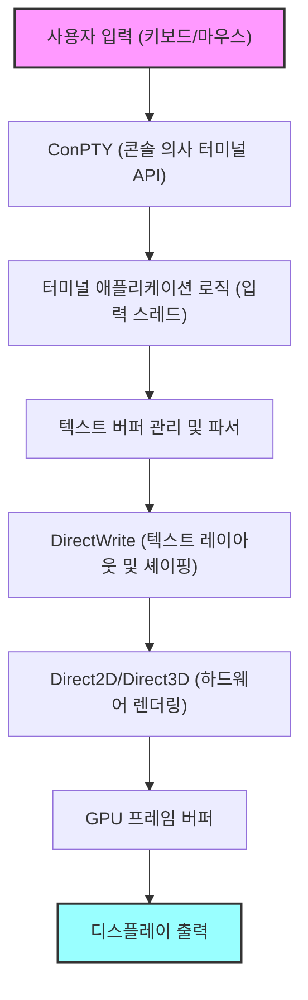
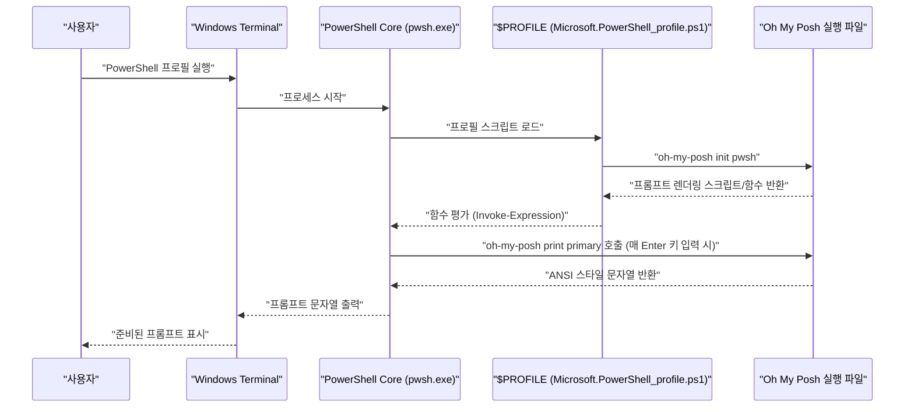

# 시작하며: 왜 Windows Terminal을 극한까지 커스터마이즈하는가

현대의 소프트웨어 개발에서 터미널 에뮬레이터는 단순한 명령어의 입출력 인터페이스를 넘어, 개발자의 생산성을 직접적으로 좌우하는 가장 중요한 '조종석'이 되었습니다. 과거 Windows 환경의 표준이었던 '명령 프롬프트(cmd.exe)'나 기존의 'Windows PowerShell' 콘솔(conhost.exe)은 그 렌더링 성능이나 커스터마이즈성의 부족, 유니코드 지원의 불완전함 때문에 Linux나 macOS의 세련된 터미널 환경과 비교하여 크게 뒤떨어지는 것이었습니다.

하지만 Microsoft가 오픈 소스로 개발을 주도하는 'Windows Terminal'의 등장으로 그 상황은 극적으로 변했습니다. DirectX를 기반으로 한 하드웨어 가속을 통한 초고속 텍스트 렌더링, 탭 UI와 창 분할의 네이티브 지원, 자유자재의 단축키 설정, 그리고 고급 프로필 관리 기능. Windows Terminal은 개발자가 진정으로 원하던 '모던한 터미널'의 요건을 모두 충족하는 매우 강력한 애플리케이션입니다.

본 문서에서는 이 Windows Terminal을 '최강'의 환경으로 승화시키기 위한 궁극의 커스터마이즈 가이드를 제공합니다. 표면적인 외관 변경에 그치지 않고, 텍스트 렌더링의 기반이 되는 수학적 모델, `settings.json`의 심층 구조, PowerShell에서의 Oh My Posh 도입, WSL 환경에서의 Starship 구축, 나아가 렌더링 지연의 이론적 분석까지 철저하고 기술적인 관점에서 해설을 진행합니다.

독자 여러분이 자신만의 최고의 터미널 환경을 구축하고, 매일의 코딩 경험을 극적으로 향상시키는 데 도움이 되기를 바랍니다.

---

# 1. Windows Terminal의 렌더링 아키텍처와 수리 모델

Windows Terminal이 이토록 빠르고 부드럽게 동작하는 배경에는 Windows의 모던한 그래픽 스택을 최대한 활용한 세련된 렌더링 파이프라인이 존재합니다. 기존의 GDI(Graphics Device Interface)를 대신하여, Windows Terminal은 DirectWrite와 DirectX(Direct2D/Direct3D)를 활용한 GPU 기반 하드웨어 가속을 채택하고 있습니다.

아래에 키 입력부터 화면에 문자가 렌더링될 때까지의 터미널 렌더링 파이프라인의 개념도를 나타냅니다.



## 1.1 폰트 서브픽셀 안티앨리어싱과 기하학

텍스트 렌더링에서 장시간 작업에도 눈이 피로하지 않은 높은 가독성을 확보하기 위해 안티앨리어싱 기술은 필수적입니다. DirectWrite는 ClearType 기술을 응용한 고급 서브픽셀 안티앨리어싱을 지원합니다.

일반적인 LCD(액정) 디스플레이의 각 픽셀은 R(빨강), G(초록), B(파랑) 3개의 수직 또는 수평 서브픽셀로 구성됩니다. 서브픽셀 안티앨리어싱은 단일 픽셀 단위(그레이스케일 안티앨리어싱)가 아닌, 이들 1/3 픽셀 단위의 높은 공간 해상도를 활용하여 휘도를 제어하는 기술입니다.

이상적인 벡터 폰트의 글리프 윤곽을 정의하는 이진 함수를 $ f(x, y) $ 라고 합시다. 픽셀 내의 좌표 $ (x, y) $ 가 글리프 내부에 있는 경우에는 $ f(x, y) = 1 $, 외부에 있는 경우에는 $ f(x, y) = 0 $ 이 됩니다.

단일 서브픽셀(예: 빨간색 서브픽셀)의 휘도 $ I_R $ 은 그 서브픽셀의 공간 영역 $ S_R $ 에서의 $ f(x, y) $ 의 적분과, 디스플레이의 물리적 특성이나 인간의 시각 특성(감마 특성 등)을 보정하기 위한 필터 함수 $ h(x, y) $ 와의 합성곱(컨볼루션)으로 계산됩니다.

$$
I_R = \iint_{S_R} f(x, y) \ast h(x, y) \,dx\,dy
$$

초록($ I_G $)과 파랑($ I_B $)에 대해서도 동일하게 각각의 영역 $ S_G, S_B $ 에 기반하여 계산됩니다. Windows Terminal에서는 이처럼 복잡한 서브픽셀 단위의 적분 및 합성곱 연산을 미리 생성된 글리프 캐시(Atlas 텍스처)와 GPU의 픽셀 셰이더를 사용하여 초병렬 처리함으로써, CPU에 부하를 주지 않고 지연 없는 아름다운 텍스트 렌더링을 실현하고 있습니다.

---

# 2. settings.json 의 완벽한 이해와 심층 설정

Windows Terminal 커스터마이즈의 핵심은 설정 파일인 `settings.json` 을 편집하는 데 있습니다. GUI 설정 화면에서도 많은 항목을 변경할 수 있지만, 궁극의 커스터마이즈를 추구하고 설정을 Git 등으로 버전 관리하기 위해서는 직접 JSON을 편집하는 지식이 필수적입니다.

설정 파일은 주로 다음 3개의 주요 섹션으로 구성되어 있습니다.

1. **`profiles`**: 각 셸(PowerShell, cmd, WSL, Azure Cloud Shell 등)마다의 동작이나 외관(폰트, 배경, 시작 디렉토리)을 정의합니다.
2. **`schemes`**: 터미널 내에서 사용되는 16색의 컬러 팔레트(컬러 스킴)를 정의합니다.
3. **`actions`**: 단축키나 명령 팔레트에서 호출되는 커스텀 작업(키 바인딩이나 창 분할)을 정의합니다.

## 2.1 프로필의 계층 구조와 상속 모델

프로필 설정에서는 모든 프로필에 공통된 설정을 `defaults` 객체에 기술하고, 개별 설정을 `list` 배열 내의 각 객체에 기술합니다. 이 상속 모델을 통해 설정 파일의 중복성을 제거하고 유지 보수성을 높일 수 있습니다.

```json
{
    "profiles": {
        "defaults": {
            "font": {
                "face": "CaskaydiaCove Nerd Font",
                "size": 11,
                "weight": "normal",
                "features": {
                    "calt": 1,
                    "liga": 1
                }
            },
            "useAcrylic": true,
            "acrylicOpacity": 0.85,
            "cursorShape": "filledBox",
            "cursorBlinking": true,
            "padding": "12, 12, 12, 12",
            "antialiasingMode": "cleartype",
            "historySize": 10000
        },
        "list": [
            {
                "guid": "{574e775e-4f2a-5b96-ac1e-a2962a402336}",
                "hidden": false,
                "name": "PowerShell 7",
                "source": "Windows.Terminal.PowershellCore",
                "colorScheme": "Tokyo Night",
                "backgroundImage": "C:\\Users\\Username\\Pictures\\Terminal\\cyberpunk_bg.png",
                "backgroundImageOpacity": 0.15,
                "backgroundImageStretchMode": "uniformToFill",
                "startingDirectory": "%USERPROFILE%\\Projects"
            },
            {
                "guid": "{2c4de342-38b7-51cf-b940-2309a097f518}",
                "hidden": false,
                "name": "Ubuntu-22.04",
                "source": "Windows.Terminal.Wsl",
                "colorScheme": "One Half Dark",
                "startingDirectory": "\\\\wsl$\\Ubuntu-22.04\\home\\username"
            }
        ]
    }
}
```

위의 예에서는 폰트에 합자(리가처)를 활성화하는 설정 `"features": { "calt": 1, "liga": 1 }` 을 추가했습니다. 이를 통해 `!=` 이나 `=>` 같은 여러 기호가 프로그래밍에 적합한 하나의 아름다운 기호로 렌더링됩니다.

## 2.2 JSON Fragments를 통한 모듈화된 설정

Windows Terminal은 'JSON Fragments'라고 불리는 확장 메커니즘을 지원합니다. 이는 서드 파티 애플리케이션(예: 새로 설치한 WSL 배포판이나 Visual Studio 등의 개발 도구)이 사용자의 메인 `settings.json` 을 직접 수정하지 않고도 자체 프로필이나 컬러 스킴을 터미널에 동적이고 안전하게 추가할 수 있는 방식입니다.

개발자 자신이 독자적인 설정을 분할 관리하고 싶은 경우에도 이 방식을 응용할 수 있습니다(지정된 디렉토리에 JSON 파일을 배치하기만 하면 병합됩니다).

---

# 3. 최고의 시각적 경험: 테마, 폰트, 배경의 비결

터미널의 색상은 단순히 보기 좋은 것뿐만 아니라 코드나 로그의 가독성, 장시간 작업 시의 눈 피로 감소와 직결되는 중요한 요소입니다.

## 3.1 컬러 스킴 자체 제작 및 적용

인터넷상에는 수많은 Windows Terminal용 컬러 스킴이 공개되어 있습니다('Windows Terminal Themes'라는 웹사이트가 유명합니다). 이들을 `schemes` 배열에 추가함으로써 자유로운 배색을 이용할 수 있습니다.

최근 개발자들 사이에서 절대적인 인기를 누리고 있는 'Tokyo Night' 테마의 JSON 정의 예를 아래에 나타냅니다. 파란색과 보라색을 기조로 한, 눈에 편안하고 대비가 높은 테마입니다.

```json
"schemes": [
    {
        "name": "Tokyo Night",
        "background": "#1A1B26",
        "foreground": "#A9B1D6",
        "black": "#32344A",
        "red": "#F7768E",
        "green": "#9ECE6A",
        "yellow": "#E0AF68",
        "blue": "#7AA2F7",
        "purple": "#BB9AF7",
        "cyan": "#7DCFFF",
        "white": "#A9B1D6",
        "brightBlack": "#414868",
        "brightRed": "#F7768E",
        "brightGreen": "#9ECE6A",
        "brightYellow": "#E0AF68",
        "brightBlue": "#7AA2F7",
        "brightPurple": "#BB9AF7",
        "brightCyan": "#7DCFFF",
        "brightWhite": "#C0CAF5",
        "cursorColor": "#C0CAF5",
        "selectionBackground": "#33467C"
    }
]
```

각 색상은 16진수 컬러 코드(HEX)로 지정되며, ANSI 이스케이프 시퀀스의 각 색 번호(0~15)에 대응합니다.

## 3.2 Nerd Fonts 도입과 폰트 설정 최적화 (CaskaydiaCove Nerd Font)

후술할 Oh My Posh나 Starship 같은 고급 프롬프트 도구를 사용할 경우, Git의 브랜치 아이콘, 프로그래밍 언어의 로고, OS의 기호 등 특수 글리프(아이콘)를 포함한 폰트가 필수적입니다. 이러한 아이콘을 기존의 프로그래밍용 폰트에 패치(추가)한 것이 '**Nerd Fonts**'입니다.

Microsoft가 개발한 프로그래밍용 폰트 'Cascadia Code'는 매우 읽기 편하고 훌륭하지만 기본적으로 Nerd Font의 아이콘을 포함하지 않습니다. 따라서 Cascadia Code에 Nerd Font 패치를 적용한 '**CaskaydiaCove Nerd Font**'를 도입할 것을 강력히 권장합니다.

### 설치 과정:
1. [Nerd Fonts 공식 GitHub 릴리스 페이지](https://github.com/ryanoasis/nerd-fonts/releases)에서 `CascadiaCode.zip` 을 다운로드합니다.
2. 압축을 풀고 안에 포함된 `.ttf` 파일을 선택한 후 우클릭하여 '모든 사용자에 대해 설치'를 선택합니다.
3. `settings.json` 의 `font.face` 를 `"CaskaydiaCove Nerd Font"` 로 변경합니다.

## 3.3 Acrylic 효과와 배경 이미지를 통한 몰입감 연출

Windows 11의 Fluent Design System을 체현하는 기능 중 하나가 'Acrylic(아크릴)' 머티리얼 효과입니다. 터미널 배경을 반투명하게 만들어 뒤의 창이나 배경화면을 아름답게 흐리게 투과시킬 수 있습니다.

```json
"useAcrylic": true,
"acrylicOpacity": 0.75,
```

더 나아가 임의의 이미지를 배경으로 설정하는 것도 가능합니다. Gif 애니메이션도 지원되어 동적인 배경을 만들 수도 있습니다. 이미지의 배치 위치나 불투명도도 세밀하게 제어할 수 있습니다.

```json
"backgroundImage": "C:\\Users\\Username\\Pictures\\wallpapers\\anime_cyberpunk.gif",
"backgroundImageOpacity": 0.2,
"backgroundImageStretchMode": "none",
"backgroundImageAlignment": "bottomRight"
```

이를 통해 터미널의 우측 하단에 좋아하는 캐릭터나 로고를 은은하게 배치하는 등 동기를 부여하는 커스터마이즈가 가능합니다.

---

# 4. 생산성을 극대화하다: 창 분할, 키 바인딩, 명령 팔레트

Windows Terminal은 tmux나 screen 같은 터미널 멀티플렉서가 가지는 기본적인 기능(화면의 창 분할)을 네이티브로 갖추고 있습니다.

`actions` 섹션을 커스터마이즈하여 마우스에 전혀 손대지 않고 키보드 조작만으로 자유자재로 화면을 분할·이동·크기 조절할 수 있게 됩니다.

```json
"actions": [
    { "command": { "action": "splitPane", "split": "auto", "splitMode": "duplicate" }, "keys": "alt+shift+d" },
    { "command": { "action": "splitPane", "split": "right" }, "keys": "alt+shift+plus" },
    { "command": { "action": "splitPane", "split": "down" }, "keys": "alt+shift+minus" },
    { "command": { "action": "moveFocus", "direction": "left" }, "keys": "alt+left" },
    { "command": { "action": "moveFocus", "direction": "right" }, "keys": "alt+right" },
    { "command": { "action": "moveFocus", "direction": "up" }, "keys": "alt+up" },
    { "command": { "action": "moveFocus", "direction": "down" }, "keys": "alt+down" },
    { "command": { "action": "resizePane", "direction": "left" }, "keys": "alt+shift+left" },
    { "command": { "action": "resizePane", "direction": "right" }, "keys": "alt+shift+right" },
    { "command": { "action": "resizePane", "direction": "up" }, "keys": "alt+shift+up" },
    { "command": { "action": "resizePane", "direction": "down" }, "keys": "alt+shift+down" },
    { "command": { "action": "closePane" }, "keys": "ctrl+w" }
]
```

위의 키 바인딩을 설정하면 `Alt + Shift + 방향키` 로 창 크기를 조절하고, `Alt + 방향키` 로 창 간 포커스를 즉시 이동할 수 있습니다. 이를 통해 하나의 창에서 Node.js의 로컬 서버를 실행하여 로그를 모니터링하면서, 다른 창에서 Git 명령어를 실행하고, 또 다른 창에서 Docker 컨테이너의 상태를 확인하는 등의 고도의 병렬 작업을 원활하게 수행할 수 있습니다.

## 4.1 Quake Mode (글로벌 드롭다운 터미널)

FPS 게임 'Quake'의 콘솔 화면처럼 화면 상단에서 언제든지 터미널을 호출할 수 있는 'Quake Mode(드롭다운 모드)'도 지원됩니다. 기본적으로 `Win + \` 키로 화면 절반 크기의 터미널이 상단에서 애니메이션과 함께 슬라이드 다운되어 나타납니다. 이는 일시적으로 명령어를 입력하고 싶을 때 매우 유용합니다.

---

# 5. `wt.exe` 를 구사한 시작 시 레이아웃 자동화

매일 아침 업무 시작 시 특정 프로젝트 디렉토리에서 터미널을 열고, 화면을 3개로 분할하여 각각에서 프론트엔드 빌드, 백엔드 서버 실행, 데이터베이스 모니터링 명령어를 실행하는 등의 반복 작업은 자동화해야 합니다.

Windows Terminal의 실체인 `wt.exe` 는 강력한 명령줄 인수를 지원하여 시작 시의 프로필 지정이나 창 분할 상태를 인수로 제어할 수 있습니다.

```powershell
wt -p "PowerShell 7" -d "C:\Projects\MyApp" ; split-pane -p "Ubuntu-22.04" -d "/var/log" -V ; split-pane -p "cmd" -H
```

이 명령어를 Windows의 단축 아이콘이나 배치 파일로 저장해 두면, 원클릭으로 복잡한 개발 환경 레이아웃이 순식간에 복원됩니다.

---

# 6. 프롬프트 진화론 1: PowerShell과 Oh My Posh

Windows 환경의 표준 셸인 PowerShell(특히 크로스 플랫폼을 지원하는 최신 버전 PowerShell 7 / PowerShell Core)을 극적으로 진화시키는 것이 바로 '**Oh My Posh**'입니다. Oh My Posh는 모든 셸을 지원하는 커스텀 프롬프트 엔진으로, 현재 디렉토리, Git 브랜치와 변경 상태, Node.js나 Python의 버전, Kubernetes의 컨텍스트 등 개발에 필요한 모든 상태를 아름답고 시각적으로 제시해 줍니다.

다음 다이어그램은 PowerShell 시작 시 Oh My Posh가 어떻게 로드되고 프롬프트가 렌더링되는지의 시퀀스를 보여줍니다.



## 6.1 Oh My Posh 설치 및 설정

Windows 환경에서는 공식 패키지 관리자인 `winget` 을 사용하여 쉽게 설치할 수 있습니다.

```powershell
winget install JanDeDobbeleer.OhMyPosh -s winget
```

설치 후 PowerShell 프로필 스크립트를 편집하여 시작 시 Oh My Posh가 로드되도록 초기화합니다. 프로필 경로는 자동 변수 `$PROFILE` 에 저장되어 있습니다.

```powershell
notepad $PROFILE
```

파일이 열리면 다음 코드를 추가합니다.

```powershell
# 별칭 설정
Set-Alias ll ls
Set-Alias g git

# 예측 IntelliSense 활성화 (PSReadLine 모듈)
Set-PSReadLineOption -PredictionSource History
Set-PSReadLineOption -PredictionViewStyle ListView

# Oh My Posh 초기화
# 테마는 원하는 것(예: jandedobbeleer)을 지정합니다.
# 내장 테마 경로는 환경 변수 $env:POSH_THEMES_PATH 에 있습니다.
oh-my-posh init pwsh --config "$env:POSH_THEMES_PATH\tokyonight_storm.omp.json" | Invoke-Expression

# 폴더나 파일에 아이콘을 표시하는 Terminal-Icons 모듈
# (최초 한 번 Install-Module -Name Terminal-Icons -Repository PSGallery -Force 필요)
Import-Module -Name Terminal-Icons
```

테마(config)는 수백 종류가 준비되어 있으며, JSON, YAML, TOML 형식으로 완전히 직접 제작하는 것도 가능합니다. '세그먼트'라는 개념을 사용하여 왼쪽(Left)과 오른쪽(Right)에 표시할 정보를 자유롭게 조합하여 프롬프트를 설계합니다.

---

# 7. 프롬프트 진화론 2: WSL2 아키텍처와 Starship의 융합

Windows 상에서 실제 Linux 커널을 실행할 수 있는 WSL2(Windows Subsystem for Linux 2)는 모던 웹 개발이나 클라우드 네이티브 개발에 필수적입니다. WSL 내의 셸(Bash나 Zsh) 프롬프트를 커스터마이즈하려면 '**Starship**'이 최적의 해답이 됩니다.

Starship은 Rust 언어로 작성된 매우 빠르고 커스터마이즈성이 뛰어난 크로스 셸 프롬프트입니다. 설정 파일(TOML) 하나만 작성하면 Bash, Zsh, Fish 등 어떤 셸에서든 완전히 동일한 프롬프트를 재현할 수 있다는 것이 장점입니다.

## 7.1 Starship 설치

WSL 터미널(Ubuntu 등)을 열고 공식 설치 스크립트를 실행합니다.

```bash
curl -sS https://starship.rs/install.sh | sh
```

다음으로 Bash를 사용하는 경우 `~/.bashrc` 마지막에 아래 내용을 추가하여 훅을 활성화합니다.

```bash
# ~/.bashrc
eval "$(starship init bash)"
```

Zsh를 사용하는 경우 `~/.zshrc` 마지막에 추가합니다.

```bash
# ~/.zshrc
eval "$(starship init zsh)"
```

## 7.2 starship.toml 을 통한 궁극의 커스터마이즈

Starship 설정은 `~/.config/starship.toml` 에 기술합니다. TOML 형식이므로 JSON보다 인간이 읽고 쓰기 쉬우며, 주석도 달 수 있는 것이 특징입니다.

아래에 모던하고 정보량이 풍부한 프롬프트를 구현하는 설정 예를 나타냅니다.

```toml
# ~/.config/starship.toml

# 프롬프트 전체 형식(순서) 정의
format = """
[╭─](bold blue)$os$directory$git_branch$git_status$nodejs$python$golang$rust
[╰─$character](bold blue)"""

# OS 아이콘 표시 설정
[os]
disabled = false
format = "[$symbol]($style) "

[os.symbols]
Ubuntu = " "
Windows = " "
Macos = " "
Alpine = " "

# 디렉토리 표시 설정
[directory]
style = "bold cyan"
read_only = " "
truncation_length = 3
truncate_to_repo = true

# Git 브랜치 설정
[git_branch]
symbol = " "
style = "bold purple"

# Git 상태 설정
[git_status]
style = "bold red"
modified = " "
staged = " "
untracked = " "
deleted = "✖ "

# 프롬프트 캐릭터 (입력줄 기호)
[character]
success_symbol = "[❯](bold green)"
error_symbol = "[❯](bold red)"
```

이 설정에서는 프롬프트를 2줄로 구성하여, 1번째 줄에 OS 아이콘, 현재 디렉토리 경로, Git 브랜치와 상태, 각 언어 환경(Node.js, Python 등)의 버전 정보를 표시합니다. 2번째 줄은 심플한 입력줄로 되어 있어, 긴 명령어를 입력할 때도 화면 공간을 압박하지 않습니다.

---

# 8. 터미널 렌더링 지연과 성능의 수리 모델

터미널의 사용성을 평가하는 데 있어 가장 중요한 지표 중 하나가 '**입력 지연(Input Latency)**'입니다. 키보드의 키를 누른 후 화면 상의 해당 픽셀 색상이 변하여 시각적인 피드백을 얻을 때까지의 시간 지연을 의미합니다.

이 전체 지연 $ T_{total} $ 은 수학적으로 다음과 같은 컴포넌트의 합으로 엄밀하게 모델링할 수 있습니다.

$$
T_{total} = T_{hw\_input} + T_{os} + T_{pty} + T_{app} + T_{render} + T_{display}
$$

각 변수의 의미와 전형적인 소요 시간은 다음과 같습니다:

- $ T_{hw\_input} $: 키보드의 기계식 스위치가 켜지고, USB 컨트롤러를 통해 폴링되어 인터럽트 신호가 전송될 때까지의 하드웨어 지연 (약 1~5 ms).
- $ T_{os} $: OS의 HID(Human Interface Device) 드라이버 계층에 의한 메시지 큐 처리 지연 (약 1~2 ms).
- $ T_{pty} $: ConPTY(의사 터미널)에 의한 버퍼링 및 문자 인코딩(UTF-8에서 UTF-16 등) 변환 지연 (약 2~10 ms).
- $ T_{app} $: 셸(PowerShell/Bash) 측의 명령어 해석 및 화면 출력을 결정하는 처리 시간. Oh My Posh나 Starship에 의한 Git 상태 가져오기 등의 처리 시간도 여기에 포함됩니다 (약 10~50 ms).
- $ T_{render} $: Windows Terminal(DirectWrite/DirectX)이 텍스트 글리프를 텍스처로 래스터라이즈하고, GPU 메모리로 전송하여 스왑 체인을 플립하기까지의 렌더링 지연 (약 2~8 ms).
- $ T_{display} $: GPU 프레임 버퍼에서 모니터로 신호가 출력되어 액정 분자가 반응하여 물리적으로 발광 상태가 바뀔 때까지의 디스플레이 지연 (GtG 응답 속도 등. 약 5~20 ms).

Windows Terminal 개발팀은 특히 $ T_{pty} $ 와 $ T_{render} $ 를 최소화하는 데 많은 노력을 기울이고 있습니다. 초기 버전에서는 텍스트 래스터라이즈 시의 캐시 미스로 인해 스파이크 형태의 지연(프레임 드롭)이 발생했으나, 최신 버전에서는 '아틀라스 기반 글리프 캐시(Atlas-based glyph cache)' 알고리즘이 도입되었습니다.

글리프의 아틀라스화를 통해 문자열 렌더링은 '미리 메모리 상에 생성된 거대한 폰트 텍스처로부터 잘라내어 화면에 알파 블렌딩 합성하는 것'이라는 단순한 GPU 상의 행렬 연산으로 귀결됩니다.

렌더링 대상 문자열이 $ N $ 글자일 때, 기존 GDI 방식에서의 CPU에 의한 순차 렌더링 비용은 $ \mathcal{O}(N) $ 의 시간이 필요했지만, GPU 기반 아틀라스 렌더링에서는 병렬 셰이더를 통해 $ \mathcal{O}(1) $ 에 가까운 상수 시간으로 렌더링이 가능해졌습니다.

이로 인해 대량의 로그가 표준 출력으로 흐르는(예: `npm install` 이나 대규모 C++ 프로젝트의 컴파일 메시지) 상황에서도 Windows Terminal은 프레임 저하 없이 60fps(또는 144Hz 이상의 고주사율 환경)로 텍스트를 매끄럽게 스크롤할 수 있는 것입니다.

---

# 9. 고급 문제 해결과 디버깅 기법

Windows Terminal을 극한까지 커스터마이즈하다 보면, 설정 파일의 구문 오류나 폰트 렌더링 불량 등 예기치 않은 문제에 직면할 수 있습니다. 여기서는 엔지니어를 위한 고급 문제 해결 기법을 소개합니다.

## 9.1 settings.json 의 JSON Schema 유효성 검사
`settings.json` 의 구조는 엄격하게 정의되어 있으며, JSON Schema를 사용하여 에디터(VS Code 등)에서 실시간으로 구문 검사를 수행하는 것이 권장됩니다. VS Code에서 `settings.json` 을 열면 기본적으로 Windows Terminal의 스키마가 적용되어 유효하지 않은 속성 이름이나 값의 타입 오류(예를 들어, 숫자를 기대하는 곳에 문자열을 지정한 경우 등)가 물결선으로 즉시 경고됩니다.

## 9.2 프롬프트 성능 프로파일링
프롬프트 표시가 극단적으로 느린 경우(엔터 키를 누른 후 다음 입력줄이 나올 때까지 랙이 있는 경우) Oh My Posh나 Starship의 실행 시간에 문제가 있을 가능성이 높습니다. Oh My Posh에는 각 블록의 렌더링 시간을 측정하는 고급 디버그 기능이 갖추어져 있습니다.

```powershell
oh-my-posh debug
```

이 명령어를 실행하면 터미널 환경 변수, 로드된 설정 파일 경로, 그리고 프롬프트를 구성하는 각 세그먼트의 처리 밀리초(ms)가 상세하게 출력됩니다. 이를 통해 어떤 정보 가져오기(예를 들어, 거대한 모노레포에서의 Git 상태 가져오기나 클라우드 제공자의 인증 상태 확인, 네트워크 상의 지연 등)가 병목이 되고 있는지를 정확히 파악하여 불필요한 모듈을 비활성화하는 등의 튜닝이 가능합니다.

## 9.3 GPU 가속 비활성화 (소프트웨어 렌더링으로 폴백)
오래된 하드웨어나 특정 GPU 드라이버의 결함으로 인해 DirectX를 통한 하드웨어 렌더링이 원인이 되어 화면 깜빡임(플리커)이나 문자가 깨지는 드문 경우가 있습니다. 이 경우 강제로 소프트웨어 렌더링으로 폴백시키는 설정 옵션이 존재합니다.

`settings.json` 의 루트 레벨에 다음 설정을 추가합니다.

```json
"softwareRendering": true
```

이를 통해 GPU 대신 CPU 기반(WARP) 렌더링으로 전환됩니다. 성능은 저하되지만 렌더링의 정확성을 보장할 수 있습니다. 그래픽 관련 결함의 원인을 파악할 때 강력한 수단이 됩니다.

---

# 맺음말

Windows Terminal의 진정한 가치는 단순한 '오래된 명령 프롬프트의 대체'라는 위치를 훨씬 넘어서는 곳에 있습니다. DirectX를 구사한 최신 렌더링 기술, JSON 기반의 유연하고 강력한 설정 구조, 그리고 WSL이나 PowerShell 등 다양한 셸과의 원활한 통합. 이들을 깊이 이해하고 자신의 손에 익도록 커스터마이즈함으로써 개발 프로세스에서의 마찰(프릭션)은 극한까지 줄어듭니다.

본 문서에서 해설한 수많은 설정 기법——컬러 스킴의 조율, Nerd Font를 통한 시각 정보의 확장, Oh My Posh나 Starship에 의한 컨텍스트 대응의 똑똑한 프롬프트, 그리고 창 분할을 활용한 멀티태스킹 환경 구축. 이들은 일상의 코딩 경험을 향상시킬 뿐만 아니라, 터미널을 대하는 동기 부여 그 자체를 높여줄 것입니다.

개발 환경 최적화에는 끝이 없습니다. 새로운 명령줄 도구가 등장하고 OS 아키텍처가 진화할 때마다 우리의 터미널 또한 모습을 바꿔 나갈 것입니다. 이 글이 독자 여러분에게 '궁극의 개발 환경'을 탐구하는 끝없는 여정에 확실한 이정표가 되기를 진심으로 바랍니다.
