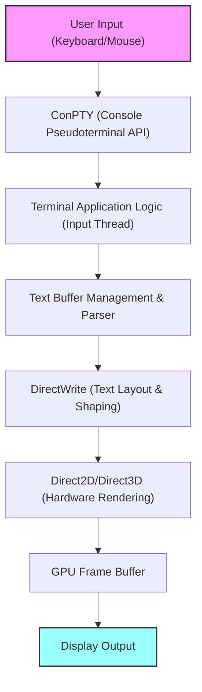
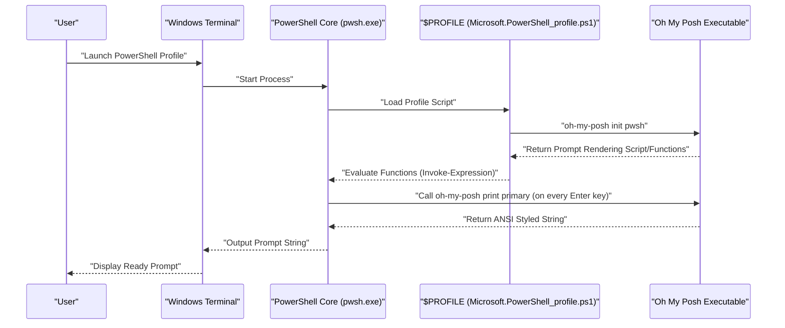

# はじめに：なぜWindows Terminalを極限までカスタマイズするのか

現代のソフトウェア開発において、ターミナルエミュレータは単なるコマンドの入出力インターフェースを超え、開発者の生産性を直接的に左右する最重要の「コックピット」となっています。かつてのWindows環境における標準であった「コマンドプロンプト（cmd.exe）」や従来の「Windows PowerShell」コンソール（conhost.exe）は、その描画性能やカスタマイズ性の低さ、Unicodeサポートの不完全さから、LinuxやmacOSの洗練されたターミナル環境と比較して大きく見劣りするものでした。

しかし、Microsoftがオープンソースで開発を主導する「Windows Terminal」の登場により、その状況は劇的に変化しました。DirectXをベースとしたハードウェアアクセラレーションによる超高速なテキストレンダリング、タブUIとペイン分割のネイティブサポート、自由自在なショートカットキー設定、そして高度なプロファイル管理機能。Windows Terminalは、開発者が真に求めていた「モダンなターミナル」の要件をすべて満たす、極めて強力なアプリケーションです。

本記事では、このWindows Terminalを「最強」の環境へと昇華させるための究極のカスタマイズガイドを提供します。表面的な見た目の変更にとどまらず、テキストレンダリングの基盤となる数学的モデル、`settings.json`の深層構造、PowerShellにおけるOh My Poshの導入、WSL環境におけるStarshipの構築、さらには描画遅延の理論的分析まで、徹底的かつ技術的な視点から解説を行います。

読者の皆様が、自分だけの最高のターミナル環境を構築し、日々のコーディング体験を劇的に向上させる一助となれば幸いです。

---

# 1. Windows Terminalのレンダリングアーキテクチャと数理モデル

Windows Terminalがこれほどまでに高速かつ滑らかに動作する背景には、Windowsのモダンなグラフィックススタックを最大限に活用した洗練されたレンダリングパイプラインが存在します。従来のGDI（Graphics Device Interface）に代わり、Windows TerminalはDirectWriteとDirectX（Direct2D/Direct3D）を活用したGPUベースのハードウェアアクセラレーションを採用しています。

以下に、キー入力から画面に文字が描画されるまでのターミナルレンダリングパイプラインの概念図を示します。



## 1.1 フォントのサブピクセルアンチエイリアシングと幾何学

テキストの描画において、長時間の作業でも目が疲れない高い視認性を確保するために、アンチエイリアシング技術は不可欠です。DirectWriteは、ClearType技術を応用した高度なサブピクセルアンチエイリアシングをサポートしています。

一般的なLCD（液晶）ディスプレイの各ピクセルは、R（赤）、G（緑）、B（青）の3つの垂直または水平のサブピクセルで構成されています。サブピクセルアンチエイリアシングは、単一のピクセル単位（グレースケールアンチエイリアシング）ではなく、これら1/3ピクセル単位の高い空間解像度を利用して輝度を制御する技術です。

理想的なベクターフォントのグリフ輪郭を定義する二値関数を $ f(x, y) $ とします。ピクセル内の座標 $ (x, y) $ がグリフの内部にある場合は $ f(x, y) = 1 $、外部にある場合は $ f(x, y) = 0 $ となります。

単一のサブピクセル（例えば赤色のサブピクセル）の輝度 $ I_R $ は、そのサブピクセルの空間領域 $ S_R $ における $ f(x, y) $ の積分と、ディスプレイの物理特性や人間の視覚特性（ガンマ特性など）を補正するためのフィルタ関数 $ h(x, y) $ との畳み込み（コンボリューション）として計算されます。

$$
I_R = \iint_{S_R} f(x, y) \ast h(x, y) \,dx\,dy
$$

緑（$ I_G $）と青（$ I_B $）についても同様に、それぞれの領域 $ S_G, S_B $ に基づいて計算されます。Windows Terminalでは、このような複雑なサブピクセルレベルの積分・畳み込み演算を、事前に生成されたグリフキャッシュ（Atlasテクスチャ）とGPUのピクセルシェーダーを用いて超並列処理することで、CPUに負荷をかけることなく、遅延のない美しいテキストレンダリングを実現しています。

---

# 2. settings.json の完全理解と深層設定

Windows Terminalのカスタマイズの核心は、設定ファイルである `settings.json` の編集にあります。GUIの設定画面からも多くの項目を変更できますが、究極のカスタマイズを追求し、設定をGitなどでバージョン管理するためには、直接JSONを編集する知識が不可欠です。

設定ファイルは主に以下の3つの主要なセクションから構成されています。

1. **`profiles`**: 各シェル（PowerShell、cmd、WSL、Azure Cloud Shellなど）ごとの動作や見た目（フォント、背景、起動ディレクトリ）を定義します。
2. **`schemes`**: ターミナル内で使用される16色のカラーパレット（カラースキーム）を定義します。
3. **`actions`**: ショートカットキーやコマンドパレットから呼び出されるカスタムアクション（キーバインドやペイン分割）を定義します。

## 2.1 プロファイルの階層構造と継承モデル

プロファイル設定では、すべてのプロファイルに共通する設定を `defaults` オブジェクトに記述し、個別の設定を `list` 配列内の各オブジェクトに記述します。この継承モデルにより、設定ファイルの冗長性を排除し、メンテナンス性を高めることができます。

```json
{
    "profiles": {
        "defaults": {
            "font": {
                "face": "CaskaydiaCove Nerd Font",
                "size": 11,
                "weight": "normal",
                "features": {
                    "calt": 1,
                    "liga": 1
                }
            },
            "useAcrylic": true,
            "acrylicOpacity": 0.85,
            "cursorShape": "filledBox",
            "cursorBlinking": true,
            "padding": "12, 12, 12, 12",
            "antialiasingMode": "cleartype",
            "historySize": 10000
        },
        "list": [
            {
                "guid": "{574e775e-4f2a-5b96-ac1e-a2962a402336}",
                "hidden": false,
                "name": "PowerShell 7",
                "source": "Windows.Terminal.PowershellCore",
                "colorScheme": "Tokyo Night",
                "backgroundImage": "C:\\Users\\Username\\Pictures\\Terminal\\cyberpunk_bg.png",
                "backgroundImageOpacity": 0.15,
                "backgroundImageStretchMode": "uniformToFill",
                "startingDirectory": "%USERPROFILE%\\Projects"
            },
            {
                "guid": "{2c4de342-38b7-51cf-b940-2309a097f518}",
                "hidden": false,
                "name": "Ubuntu-22.04",
                "source": "Windows.Terminal.Wsl",
                "colorScheme": "One Half Dark",
                "startingDirectory": "\\\\wsl$\\Ubuntu-22.04\\home\\username"
            }
        ]
    }
}
```

上記の例では、フォントに合字（リガチャ）を有効にする設定 `"features": { "calt": 1, "liga": 1 }` を追加しています。これにより、`!=` や `=>` といった複数の記号が、プログラミングに適した一つの美しいシンボルとして描画されます。

## 2.2 JSON Fragmentsによるモジュール化された設定

Windows Terminalは「JSON Fragments」と呼ばれる拡張メカニズムをサポートしています。これは、サードパーティのアプリケーション（例えば、新しくインストールしたWSLディストリビューションや、Visual Studioなどの開発ツール）が、ユーザーのメインの `settings.json` を直接書き換えることなく、独自のプロファイルやカラースキームをターミナルに動的かつ安全に追加できる仕組みです。

開発者自身が独自の設定を分割管理したい場合にも、この仕組みを応用することができます（指定されたディレクトリにJSONファイルを配置するだけでマージされます）。

---

# 3. 至高の視覚体験：テーマ、フォント、背景の極意

ターミナルの配色は、単に見た目の良さだけでなく、コードやログの可読性、長時間の作業における眼精疲労の軽減に直結する重要な要素です。

## 3.1 カラースキームの自作と適用

インターネット上には数多くのWindows Terminal用カラースキームが公開されています（「Windows Terminal Themes」というWebサイトが有名です）。これらを `schemes` 配列に追加することで、自由な配色を利用できます。

近年、開発者の間で絶大な人気を誇る「Tokyo Night」テーマのJSON定義例を以下に示します。青と紫を基調とした、目に優しくコントラストの高いテーマです。

```json
"schemes": [
    {
        "name": "Tokyo Night",
        "background": "#1A1B26",
        "foreground": "#A9B1D6",
        "black": "#32344A",
        "red": "#F7768E",
        "green": "#9ECE6A",
        "yellow": "#E0AF68",
        "blue": "#7AA2F7",
        "purple": "#BB9AF7",
        "cyan": "#7DCFFF",
        "white": "#A9B1D6",
        "brightBlack": "#414868",
        "brightRed": "#F7768E",
        "brightGreen": "#9ECE6A",
        "brightYellow": "#E0AF68",
        "brightBlue": "#7AA2F7",
        "brightPurple": "#BB9AF7",
        "brightCyan": "#7DCFFF",
        "brightWhite": "#C0CAF5",
        "cursorColor": "#C0CAF5",
        "selectionBackground": "#33467C"
    }
]
```

各色は16進数カラーコード（HEX）で指定され、ANSIエスケープシーケンスの各色番号（0〜15）に対応しています。

## 3.2 Nerd Fontsの導入とフォント設定の最適化（CaskaydiaCove Nerd Font）

後述するOh My PoshやStarshipのような高度なプロンプトツールを使用する場合、Gitのブランチアイコン、プログラミング言語のロゴ、OSのシンボルなど、特殊なグリフ（アイコン）を含むフォントが必須となります。これらのアイコンを既存のプログラミング用フォントにパッチ（追加）したものが「**Nerd Fonts**」です。

Microsoftが開発したプログラミング用フォント「Cascadia Code」は、非常に読みやすく優れていますが、デフォルトではNerd Fontのアイコンを含んでいません。そこで、Cascadia CodeにNerd Fontパッチを適用した「**CaskaydiaCove Nerd Font**」を導入することを強く推奨します。

### インストール手順：
1. [Nerd Fontsの公式GitHubリリースページ](https://github.com/ryanoasis/nerd-fonts/releases)から `CascadiaCode.zip` をダウンロードします。
2. 解凍し、中に含まれる `.ttf` ファイルを選択して右クリックし、「すべてのユーザーに対してインストール」を選択します。
3. `settings.json` の `font.face` を `"CaskaydiaCove Nerd Font"` に変更します。

## 3.3 Acrylic効果と背景画像による没入感の演出

Windows 11のFluent Design Systemを体現する機能の一つが「Acrylic（アクリル）」マテリアル効果です。ターミナルの背景を半透明にし、背後のウィンドウや壁紙を美しくぼかして透過させることができます。

```json
"useAcrylic": true,
"acrylicOpacity": 0.75,
```

さらに、任意の画像を背景として設定することも可能です。Gifアニメーションもサポートされており、動的な背景を作ることもできます。画像の配置位置や不透明度も細かく制御できます。

```json
"backgroundImage": "C:\\Users\\Username\\Pictures\\wallpapers\\anime_cyberpunk.gif",
"backgroundImageOpacity": 0.2,
"backgroundImageStretchMode": "none",
"backgroundImageAlignment": "bottomRight"
```

これにより、ターミナルの右下にお気に入りのキャラクターやロゴを控えめに配置するといった、モチベーションを高めるカスタマイズが可能です。

---

# 4. 生産性を最大化する：ペイン分割、キーバインド、コマンドパレット

Windows Terminalは、tmuxやscreenのようなターミナルマルチプレクサが持つ基本的な機能（画面のペイン分割）をネイティブで備えています。

`actions` セクションをカスタマイズすることで、マウスに一切触れることなく、キーボード操作のみで自由自在に画面を分割・移動・リサイズできるようになります。

```json
"actions": [
    { "command": { "action": "splitPane", "split": "auto", "splitMode": "duplicate" }, "keys": "alt+shift+d" },
    { "command": { "action": "splitPane", "split": "right" }, "keys": "alt+shift+plus" },
    { "command": { "action": "splitPane", "split": "down" }, "keys": "alt+shift+minus" },
    { "command": { "action": "moveFocus", "direction": "left" }, "keys": "alt+left" },
    { "command": { "action": "moveFocus", "direction": "right" }, "keys": "alt+right" },
    { "command": { "action": "moveFocus", "direction": "up" }, "keys": "alt+up" },
    { "command": { "action": "moveFocus", "direction": "down" }, "keys": "alt+down" },
    { "command": { "action": "resizePane", "direction": "left" }, "keys": "alt+shift+left" },
    { "command": { "action": "resizePane", "direction": "right" }, "keys": "alt+shift+right" },
    { "command": { "action": "resizePane", "direction": "up" }, "keys": "alt+shift+up" },
    { "command": { "action": "resizePane", "direction": "down" }, "keys": "alt+shift+down" },
    { "command": { "action": "closePane" }, "keys": "ctrl+w" }
]
```

上記のキーバインドを設定することで、`Alt + Shift + 矢印` でペインサイズを調整し、`Alt + 矢印` でペイン間のフォーカスを瞬時に移動できます。これにより、1つのペインでNode.jsのローカルサーバーを起動してログを監視しつつ、別のペインでGitコマンドを実行し、さらに別のペインでDockerコンテナのステータスを確認するといった、高度な並行作業がシームレスに行えます。

## 4.1 Quake Mode（グローバル・ドロップダウン・ターミナル）

FPSゲーム「Quake」のコンソール画面のように、画面の上部からいつでもターミナルを呼び出せる「Quake Mode（ドロップダウンモード）」もサポートされています。デフォルトでは `Win + \` キーでウィンドウの半分のサイズのターミナルが上部からアニメーション付きでスライドダウンしてきます。これは、一時的にコマンドを打ちたい時に非常に便利です。

---

# 5. `wt.exe` を駆使した起動時レイアウトの自動化

毎朝の業務開始時に、特定のプロジェクトディレクトリでターミナルを開き、画面を3つに分割して、それぞれでフロントエンドのビルド、バックエンドのサーバー起動、データベースの監視コマンドを実行する……といった定型作業は自動化すべきです。

Windows Terminalの実体である `wt.exe` は、強力なコマンドライン引数をサポートしており、起動時のプロファイル指定やペイン分割状態を引数で制御できます。

```powershell
wt -p "PowerShell 7" -d "C:\Projects\MyApp" ; split-pane -p "Ubuntu-22.04" -d "/var/log" -V ; split-pane -p "cmd" -H
```

このコマンドをWindowsのショートカットやバッチファイルとして保存しておけば、ワンクリックで複雑な開発環境のレイアウトが一瞬にして復元されます。

---

# 6. プロンプトの進化論1：PowerShellとOh My Posh

Windows環境における標準シェルであるPowerShell（特にクロスプラットフォーム対応の最新版 PowerShell 7 / PowerShell Core）を劇的に進化させるのが、「**Oh My Posh**」です。Oh My Poshは、あらゆるシェルに対応したカスタムプロンプトエンジンであり、現在のディレクトリ、Gitのブランチと変更ステータス、Node.jsやPythonのバージョン、Kubernetesのコンテキストなど、開発に必要なあらゆる状態を美しく視覚的に提示してくれます。

以下の図は、PowerShell起動時にOh My Poshがどのようにロードされ、プロンプトがレンダリングされるかのシーケンスを示しています。



## 6.1 Oh My Poshのインストールと設定

Windows環境では、公式パッケージマネージャーである `winget` を使用して簡単にインストールできます。

```powershell
winget install JanDeDobbeleer.OhMyPosh -s winget
```

インストール後、PowerShellのプロファイルスクリプトを編集して、起動時にOh My Poshが読み込まれるように初期化します。プロファイルのパスは自動変数 `$PROFILE` に格納されています。

```powershell
notepad $PROFILE
```

ファイルが開いたら、以下のコードを追記します。

```powershell
# エイリアスの設定
Set-Alias ll ls
Set-Alias g git

# 予測IntelliSenseの有効化 (PSReadLineモジュール)
Set-PSReadLineOption -PredictionSource History
Set-PSReadLineOption -PredictionViewStyle ListView

# Oh My Posh の初期化
# テーマは好みのもの（例：jandedobbeleer）を指定します。
# 組み込みテーマのパスは環境変数 $env:POSH_THEMES_PATH にあります。
oh-my-posh init pwsh --config "$env:POSH_THEMES_PATH\tokyonight_storm.omp.json" | Invoke-Expression

# フォルダやファイルにアイコンを表示する Terminal-Icons モジュール
# (初回のみ Install-Module -Name Terminal-Icons -Repository PSGallery -Force が必要)
Import-Module -Name Terminal-Icons
```

テーマ（config）は数百種類用意されており、JSON、YAML、TOML形式で完全に自作することも可能です。「セグメント」という概念を用いて、左側（Left）と右側（Right）に表示する情報を自由に組み合わせてプロンプトを設計します。

---

# 7. プロンプトの進化論2：WSL2アーキテクチャとStarshipの融合

Windows上で本物のLinuxカーネルを実行できるWSL2（Windows Subsystem for Linux 2）は、モダンなWeb開発やクラウドネイティブ開発に不可欠です。WSL内のシェル（BashやZsh）のプロンプトをカスタマイズするには、「**Starship**」が最適解となります。

StarshipはRust言語で記述された、極めて高速でカスタマイズ性に優れたクロスシェルプロンプトです。設定ファイル（TOML）を一つ書くだけで、Bash、Zsh、Fishなどどのシェルでも全く同じプロンプトを再現できるのが強みです。

## 7.1 Starshipのインストール

WSLのターミナル（Ubuntu等）を開き、公式のインストールスクリプトを実行します。

```bash
curl -sS https://starship.rs/install.sh | sh
```

次に、Bashを使用している場合は `~/.bashrc` の末尾に以下を追記してフックを有効化します。

```bash
# ~/.bashrc
eval "$(starship init bash)"
```

Zshを使用している場合は `~/.zshrc` の末尾に追記します。

```bash
# ~/.zshrc
eval "$(starship init zsh)"
```

## 7.2 starship.toml による究極のカスタマイズ

Starshipの設定は `~/.config/starship.toml` に記述します。TOML形式であるため、JSONよりも人間にとって読み書きがしやすく、コメントも記述できるのが特徴です。

以下に、モダンかつ情報量豊かなプロンプトを実現する設定例を示します。

```toml
# ~/.config/starship.toml

# プロンプト全体のフォーマット（並び順）を定義
format = """
[╭─](bold blue)$os$directory$git_branch$git_status$nodejs$python$golang$rust
[╰─$character](bold blue)"""

# OSアイコンの表示設定
[os]
disabled = false
format = "[$symbol]($style) "

[os.symbols]
Ubuntu = " "
Windows = " "
Macos = " "
Alpine = " "

# ディレクトリの表示設定
[directory]
style = "bold cyan"
read_only = " "
truncation_length = 3
truncate_to_repo = true

# Gitブランチの設定
[git_branch]
symbol = " "
style = "bold purple"

# Gitステータスの設定
[git_status]
style = "bold red"
modified = " "
staged = " "
untracked = " "
deleted = "✖ "

# プロンプトキャラクター（入力行の記号）
[character]
success_symbol = "[❯](bold green)"
error_symbol = "[❯](bold red)"
```

この設定では、プロンプトを2行構成にし、1行目にOSのアイコン、現在のディレクトリパス、Gitのブランチと状態、各言語環境（Node.js, Python等）のバージョン情報を表示します。2行目はシンプルな入力行となっており、長いコマンドを入力する際にも画面のスペースを圧迫しません。

---

# 8. ターミナル描画の遅延とパフォーマンスの数理モデル

ターミナルの使い心地を評価する上で最も重要な指標の一つが「**入力レイテンシ（Input Latency）**」です。キーボードのキーを押し込んでから、画面上の対応するピクセルの色が変化し、視覚的なフィードバックが得られるまでの時間遅延を指します。

この全体遅延 $ T_{total} $ は、数学的に以下のようなコンポーネントの総和として厳密にモデル化できます。

$$
T_{total} = T_{hw\_input} + T_{os} + T_{pty} + T_{app} + T_{render} + T_{display}
$$

各変数の意味と典型的な所要時間は以下の通りです：

- $ T_{hw\_input} $: キーボードのメカニカルスイッチがオンになり、USBコントローラ経由でポーリングされ、割り込み信号が送られるまでのハードウェア遅延（約 1〜5 ms）。
- $ T_{os} $: OSのHID（Human Interface Device）ドライバ層によるメッセージキュー処理遅延（約 1〜2 ms）。
- $ T_{pty} $: ConPTY（擬似ターミナル）によるバッファリングと文字エンコーディング（UTF-8からUTF-16など）変換の遅延（約 2〜10 ms）。
- $ T_{app} $: シェル（PowerShell/Bash）側のコマンド解釈と、画面出力を決定する処理時間。Oh My PoshやStarshipによるGitステータス取得などの処理時間もここに含まれます（約 10〜50 ms）。
- $ T_{render} $: Windows Terminal（DirectWrite/DirectX）がテキストグリフをテクスチャとしてラスタライズし、GPUメモリに転送、スワップチェーンをフリップするまでのレンダリング遅延（約 2〜8 ms）。
- $ T_{display} $: GPUのフレームバッファからモニターへ信号が出力され、液晶分子が応答して物理的に発光状態が変わるまでのディスプレイ遅延（GtG応答速度など。約 5〜20 ms）。

Windows Terminalの開発チームは、特に $ T_{pty} $ と $ T_{render} $ の最小化に多大な努力を注いでいます。初期のバージョンでは、テキストラスタライズ時のキャッシュミスによってスパイク状の遅延（フレームドロップ）が発生していましたが、最新バージョンでは「アトラスベースのグリフキャッシュ（Atlas-based glyph cache）」アルゴリズムが導入されました。

グリフのアトラス化により、文字列の描画は「事前にメモリ上に生成された巨大なフォントテクスチャからの切り出しと、画面へのアルファブレンド合成」という単純なGPU上の行列演算に帰着します。

描画対象の文字列が $ N $ 文字であるとき、従来のGDIアプローチでのCPUによる逐次描画コストは $ \mathcal{O}(N) $ の時間を要しましたが、GPUベースのアトラスレンダリングでは、並列シェーダーによって $ \mathcal{O}(1) $ に近い定数時間での描画が可能となっています。

これにより、大量のログが標準出力に流れる（例： `npm install` や大規模なC++プロジェクトのコンパイルメッセージ）状況下でも、Windows Terminalは処理落ちを起こすことなく、60fps（あるいは144Hz以上の高リフレッシュレート環境）でテキストを滑らかにスクロールし続けることができるのです。

---

# 9. 高度なトラブルシューティングとデバッグ手法

Windows Terminalを極限までカスタマイズしていくと、設定ファイルの構文エラーや、フォントのレンダリング不具合など、予期せぬ問題に遭遇することがあります。ここでは、エンジニア向けの高度なトラブルシューティング手法を紹介します。

## 9.1 settings.json のJSON Schemaバリデーション
`settings.json` の構造は厳密に定義されており、JSON Schemaを用いてエディタ（VS Codeなど）でリアルタイムに構文チェックを行うことが推奨されます。VS Codeで `settings.json` を開くと、デフォルトでWindows Terminalのスキーマが適用され、無効なプロパティ名や値の型エラー（例えば、数値を期待する箇所に文字列を指定した場合など）が波線で即座に警告されます。

## 9.2 プロンプトのパフォーマンスプロファイリング
プロンプトの表示が極端に遅い場合（エンターキーを押してから次の入力行が出るまでにラグがある場合）、Oh My PoshやStarshipの実行時間に問題がある可能性が高いです。Oh My Poshには、各ブロックの描画時間を計測する高度なデバッグ機能が備わっています。

```powershell
oh-my-posh debug
```

このコマンドを実行すると、ターミナル環境の変数、ロードされた設定ファイルパス、そしてプロンプトを構成する各セグメントの処理ミリ秒数（ms）が詳細に出力されます。これにより、どの情報取得（例えば、巨大なモノレポでのGitステータス取得や、クラウドプロバイダの認証状態チェック、ネットワーク上の遅延など）がボトルネックになっているかを正確に特定し、不要なモジュールを無効化するなどのチューニングが可能です。

## 9.3 GPUアクセラレーションの無効化（ソフトウェアレンダリングへのフォールバック）
古いハードウェアや、特定のGPUドライバの不具合により、DirectXによるハードウェアレンダリングが原因で画面のちらつき（フリッカー）や文字の欠けが発生する稀なケースがあります。この場合、強制的にソフトウェアレンダリングにフォールバックさせる設定オプションが存在します。

`settings.json` のルートレベルに以下の設定を追加します。

```json
"softwareRendering": true
```

これにより、GPUの代わりにCPUベース（WARP）での描画に切り替わります。パフォーマンスは低下しますが、描画の正確性を担保することができます。グラフィック関連の不具合の切り分けを行う際の強力な手段となります。

---

# おわりに

Windows Terminalの真価は、単なる「古いコマンドプロンプトの代替」という位置づけを遥かに超えたところにあります。DirectXを駆使した最新のレンダリング技術、JSONベースの柔軟かつ強力な設定機構、そしてWSLやPowerShellなど多様なシェルとのシームレスな統合。これらを深く理解し、自身の手に馴染むようカスタマイズを施すことで、開発プロセスにおける摩擦（フリクション）は極限まで低減されます。

本記事で解説した数々の設定手法——カラースキームの調律、Nerd Fontによる視覚情報の拡張、Oh My PoshやStarshipによるコンテキスト対応の賢いプロンプト、そしてペイン分割を活用したマルチタスク環境の構築。これらは、日々のコーディング体験を向上させるだけでなく、ターミナルに向かうモチベーションそのものを高めてくれることでしょう。

開発環境の最適化に終わりはありません。新しいコマンドラインツールが登場し、OSのアーキテクチャが進化するたびに、私たちのターミナルもまた形を変えていくはずです。この記事が、読者の皆様にとっての「究極の開発環境」を探求する終わりのない旅の、確かな道標となることを願ってやみません。
