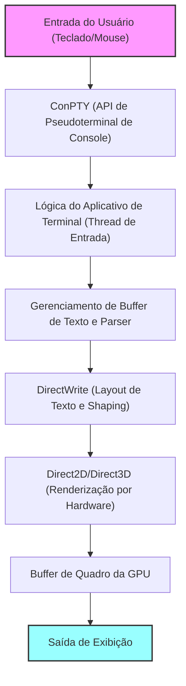
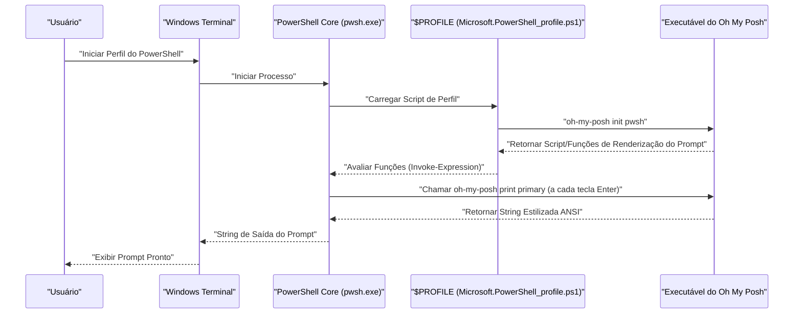

# Introdução: Por que personalizar o Windows Terminal ao máximo

No desenvolvimento de software moderno, o emulador de terminal vai além de uma simples interface de entrada e saída de comandos; tornou-se o "cockpit" mais importante que afeta diretamente a produtividade do desenvolvedor. O "Prompt de Comando (cmd.exe)", que costumava ser o padrão em ambientes Windows, e o console tradicional do "Windows PowerShell" (conhost.exe), eram bastante inferiores aos ambientes de terminal refinados do Linux e macOS, devido ao seu baixo desempenho de renderização, baixa capacidade de personalização e suporte incompleto a Unicode.

No entanto, com o surgimento do "Windows Terminal", cujo desenvolvimento de código aberto é liderado pela Microsoft, essa situação mudou drasticamente. Renderização de texto ultrarrápida baseada em aceleração de hardware utilizando DirectX, suporte nativo para interface com abas e divisão de painéis, configuração flexível de teclas de atalho e recursos avançados de gerenciamento de perfil. O Windows Terminal é um aplicativo extremamente poderoso que atende a todos os requisitos de um "terminal moderno" que os desenvolvedores realmente desejavam.

Neste artigo, forneceremos o guia definitivo de personalização para elevar este Windows Terminal ao ambiente "supremo". Não nos limitaremos a mudanças visuais superficiais, mas explicaremos a partir de uma perspectiva técnica e aprofundada, abrangendo o modelo matemático subjacente à renderização de texto, a estrutura profunda do `settings.json`, a introdução do Oh My Posh no PowerShell, a configuração do Starship no ambiente WSL e até mesmo uma análise teórica do atraso de renderização.

Esperamos que este artigo ajude os leitores a construir o seu próprio e melhor ambiente de terminal, melhorando drasticamente a sua experiência diária de codificação.

---

# 1. Arquitetura de Renderização do Windows Terminal e Modelo Matemático

Por trás do funcionamento tão rápido e suave do Windows Terminal, existe um pipeline de renderização sofisticado que aproveita ao máximo a moderna pilha de gráficos do Windows. Em vez da tradicional GDI (Graphics Device Interface), o Windows Terminal emprega aceleração de hardware baseada em GPU utilizando DirectWrite e DirectX (Direct2D/Direct3D).

Abaixo é mostrado um diagrama conceitual do pipeline de renderização do terminal, desde a entrada de teclas até o texto ser desenhado na tela.



## 1.1 Anti-aliasing de Subpixel de Fonte e Geometria

Para garantir uma alta visibilidade que não cansa os olhos, mesmo durante longas horas de trabalho, a tecnologia de anti-aliasing é indispensável na renderização de texto. O DirectWrite suporta anti-aliasing de subpixel avançado, que é uma aplicação da tecnologia ClearType.

Cada pixel de um display típico de LCD (cristal líquido) é composto por três subpixels verticais ou horizontais: R (Vermelho), G (Verde) e B (Azul). O anti-aliasing de subpixel não é uma unidade de pixel único (anti-aliasing em tons de cinza), mas uma tecnologia que controla a luminância utilizando essa alta resolução espacial em unidades de 1/3 de pixel.

Seja $ f(x, y) $ a função binária que define o contorno ideal do glifo de uma fonte vetorial. Se a coordenada $ (x, y) $ dentro do pixel estiver dentro do glifo, $ f(x, y) = 1 $, e se estiver fora, $ f(x, y) = 0 $.

A luminância $ I_R $ de um único subpixel (por exemplo, o subpixel vermelho) é calculada como a convolução da integral de $ f(x, y) $ na região espacial $ S_R $ daquele subpixel com a função de filtro $ h(x, y) $ para compensar as características físicas do display e as características visuais humanas (como a característica de gama).

$$
I_R = \iint_{S_R} f(x, y) \ast h(x, y) \,dx\,dy
$$

Da mesma forma, o verde ($ I_G $) e o azul ($ I_B $) são calculados com base em suas respectivas regiões $ S_G, S_B $. No Windows Terminal, essas complexas operações de integração e convolução no nível de subpixel são processadas em ultraparalelo usando cache de glifo pré-gerado (textura Atlas) e shaders de pixel da GPU, realizando uma bela renderização de texto sem atrasos e sem sobrecarregar a CPU.

---

# 2. Compreensão Completa e Configurações Profundas do settings.json

O núcleo da personalização do Windows Terminal reside na edição de seu arquivo de configuração, o `settings.json`. Embora muitos itens possam ser alterados pela tela de configurações da GUI, o conhecimento para editar diretamente o JSON é essencial se você deseja buscar a personalização definitiva e gerenciar a versão de suas configurações usando o Git.

O arquivo de configuração é composto principalmente por três seções principais:

1. **`profiles`**: Define o comportamento e a aparência (fonte, fundo, diretório de inicialização) de cada shell (PowerShell, cmd, WSL, Azure Cloud Shell, etc.).
2. **`schemes`**: Define as paletas de cores de 16 cores (esquemas de cores) usadas dentro do terminal.
3. **`actions`**: Define ações personalizadas (atalhos de teclado ou divisão de painéis) que são chamadas a partir das teclas de atalho ou da paleta de comandos.

## 2.1 Estrutura Hierárquica e Modelo de Herança de Perfis

Nas configurações de perfil, as configurações comuns a todos os perfis são descritas no objeto `defaults`, e configurações individuais são descritas em cada objeto dentro do array `list`. Este modelo de herança pode eliminar redundâncias no arquivo de configuração e melhorar a manutenibilidade.

```json
{
    "profiles": {
        "defaults": {
            "font": {
                "face": "CaskaydiaCove Nerd Font",
                "size": 11,
                "weight": "normal",
                "features": {
                    "calt": 1,
                    "liga": 1
                }
            },
            "useAcrylic": true,
            "acrylicOpacity": 0.85,
            "cursorShape": "filledBox",
            "cursorBlinking": true,
            "padding": "12, 12, 12, 12",
            "antialiasingMode": "cleartype",
            "historySize": 10000
        },
        "list": [
            {
                "guid": "{574e775e-4f2a-5b96-ac1e-a2962a402336}",
                "hidden": false,
                "name": "PowerShell 7",
                "source": "Windows.Terminal.PowershellCore",
                "colorScheme": "Tokyo Night",
                "backgroundImage": "C:\\Users\\Username\\Pictures\\Terminal\\cyberpunk_bg.png",
                "backgroundImageOpacity": 0.15,
                "backgroundImageStretchMode": "uniformToFill",
                "startingDirectory": "%USERPROFILE%\\Projects"
            },
            {
                "guid": "{2c4de342-38b7-51cf-b940-2309a097f518}",
                "hidden": false,
                "name": "Ubuntu-22.04",
                "source": "Windows.Terminal.Wsl",
                "colorScheme": "One Half Dark",
                "startingDirectory": "\\\\wsl$\\Ubuntu-22.04\\home\\username"
            }
        ]
    }
}
```

No exemplo acima, a configuração `"features": { "calt": 1, "liga": 1 }` foi adicionada para habilitar ligaturas na fonte. Isso fará com que múltiplos símbolos como `!=` e `=>` sejam desenhados como um único e belo símbolo, o que é mais adequado para a programação.

## 2.2 Configurações Modularizadas usando JSON Fragments

O Windows Terminal suporta um mecanismo de extensão chamado "JSON Fragments". Esse é um sistema onde aplicativos de terceiros (como uma distribuição WSL recém-instalada ou uma ferramenta de desenvolvimento como o Visual Studio) podem adicionar dinamicamente e com segurança seus próprios perfis e esquemas de cores ao terminal, sem modificar diretamente o `settings.json` principal do usuário.

Se os próprios desenvolvedores desejarem dividir e gerenciar suas próprias configurações de forma isolada, eles podem aplicar este mecanismo (simplesmente colocando os arquivos JSON no diretório especificado para que sejam mesclados).

---

# 3. A Experiência Visual Suprema: Os Segredos de Temas, Fontes e Fundos

O esquema de cores de um terminal não diz respeito apenas à boa aparência, mas é um elemento crucial diretamente ligado à legibilidade do código e dos logs, e à redução da fadiga ocular durante horas prolongadas de trabalho.

## 3.1 Criação e Aplicação de Esquemas de Cores

Existem inúmeros esquemas de cores para o Windows Terminal disponíveis publicamente na internet (o site "Windows Terminal Themes" é bem conhecido). Ao adicioná-los à matriz `schemes`, você pode usar qualquer cor que desejar.

Abaixo está um exemplo de definição JSON para o tema "Tokyo Night", que tem desfrutado de imensa popularidade entre os desenvolvedores nos últimos anos. É um tema com tons de azul e roxo, com alto contraste e agradável aos olhos.

```json
"schemes": [
    {
        "name": "Tokyo Night",
        "background": "#1A1B26",
        "foreground": "#A9B1D6",
        "black": "#32344A",
        "red": "#F7768E",
        "green": "#9ECE6A",
        "yellow": "#E0AF68",
        "blue": "#7AA2F7",
        "purple": "#BB9AF7",
        "cyan": "#7DCFFF",
        "white": "#A9B1D6",
        "brightBlack": "#414868",
        "brightRed": "#F7768E",
        "brightGreen": "#9ECE6A",
        "brightYellow": "#E0AF68",
        "brightBlue": "#7AA2F7",
        "brightPurple": "#BB9AF7",
        "brightCyan": "#7DCFFF",
        "brightWhite": "#C0CAF5",
        "cursorColor": "#C0CAF5",
        "selectionBackground": "#33467C"
    }
]
```

Cada cor é especificada usando códigos de cores hexadecimais (HEX) e corresponde a cada número de cor (0-15) das sequências de escape ANSI.

## 3.2 Introdução de Nerd Fonts e Otimização da Configuração de Fontes (CaskaydiaCove Nerd Font)

Ao usar ferramentas avançadas de prompt, como o Oh My Posh ou Starship, discutidos posteriormente, é essencial o uso de fontes contendo glifos (ícones) especiais, como ícones de branch do Git, logotipos de linguagens de programação e símbolos de sistema operacional. As "Nerd Fonts" são criadas através da aplicação de patches (adições) desses ícones em fontes de programação já existentes.

A fonte de programação "Cascadia Code", desenvolvida pela Microsoft, é extremamente legível e de excelente qualidade, mas por padrão não inclui ícones do Nerd Font. Portanto, é altamente recomendável que você introduza o "**CaskaydiaCove Nerd Font**", que aplica o patch do Nerd Font ao Cascadia Code.

### Passos de Instalação:
1. Faça o download de `CascadiaCode.zip` da [Página oficial de Lançamentos do GitHub do Nerd Fonts](https://github.com/ryanoasis/nerd-fonts/releases).
2. Extraia o conteúdo, selecione o arquivo `.ttf` incluso, clique com o botão direito e escolha "Instalar para todos os usuários".
3. Altere o `font.face` do arquivo `settings.json` para `"CaskaydiaCove Nerd Font"`.

## 3.3 Efeito Acrylic e Imagem de Fundo para Promover a Imersão

Uma das funções que personifica o Fluent Design System do Windows 11 é o efeito de material "Acrylic" (Acrílico). O fundo do terminal pode ser tornado semitransparente, permitindo que a janela ou o papel de parede por trás seja graciosamente desfocado e transparente.

```json
"useAcrylic": true,
"acrylicOpacity": 0.75,
```

Além disso, também é possível definir qualquer imagem como fundo. Animações Gif também são suportadas, permitindo a criação de fundos dinâmicos. A posição e a opacidade da imagem podem ser controlada detalhadamente.

```json
"backgroundImage": "C:\\Users\\Username\\Pictures\\wallpapers\\anime_cyberpunk.gif",
"backgroundImageOpacity": 0.2,
"backgroundImageStretchMode": "none",
"backgroundImageAlignment": "bottomRight"
```

Isso permite um layout motivador, como colocar seus personagens ou logotipos favoritos de forma modesta no canto inferior direito do terminal.

---

# 4. Maximizando a Produtividade: Divisão de Painéis, Atalhos de Teclado e Paleta de Comandos

O Windows Terminal vem com a funcionalidade nativa de multiplexadores de terminal (divisão de painéis de tela), como tmux e screen.

Ao personalizar a seção `actions`, você será capaz de dividir, mover e redimensionar telas à vontade apenas operando o teclado, sem tocar no mouse de forma alguma.

```json
"actions": [
    { "command": { "action": "splitPane", "split": "auto", "splitMode": "duplicate" }, "keys": "alt+shift+d" },
    { "command": { "action": "splitPane", "split": "right" }, "keys": "alt+shift+plus" },
    { "command": { "action": "splitPane", "split": "down" }, "keys": "alt+shift+minus" },
    { "command": { "action": "moveFocus", "direction": "left" }, "keys": "alt+left" },
    { "command": { "action": "moveFocus", "direction": "right" }, "keys": "alt+right" },
    { "command": { "action": "moveFocus", "direction": "up" }, "keys": "alt+up" },
    { "command": { "action": "moveFocus", "direction": "down" }, "keys": "alt+down" },
    { "command": { "action": "resizePane", "direction": "left" }, "keys": "alt+shift+left" },
    { "command": { "action": "resizePane", "direction": "right" }, "keys": "alt+shift+right" },
    { "command": { "action": "resizePane", "direction": "up" }, "keys": "alt+shift+up" },
    { "command": { "action": "resizePane", "direction": "down" }, "keys": "alt+shift+down" },
    { "command": { "action": "closePane" }, "keys": "ctrl+w" }
]
```

Configurando esses atalhos, você pode ajustar o tamanho do painel com `Alt + Shift + Setas` e mover o foco entre painéis instantaneamente com `Alt + Setas`. Com isso, operações simultâneas complexas, como observar um servidor local Node.js em um painel, executar comandos do Git em outro e verificar o status do contêiner do Docker em ainda outro painel, podem ser feitas sem problemas.

## 4.1 Quake Mode (Terminal Suspenso Global)

O modo suportado também inclui o "Quake Mode" (modo suspenso), no qual você pode chamar o terminal a partir da parte superior da tela a qualquer momento, exatamente como o console no jogo FPS "Quake". Por padrão, você pode usar a tecla `Win + \` para deslizar uma animação, do topo da tela, de um terminal com a metade do tamanho da janela. Isso é incrivelmente útil quando você deseja digitar um comando temporariamente.

---

# 5. Automação do Layout de Inicialização Aproveitando o `wt.exe`

As tarefas diárias matinais repetitivas, como abrir terminais num diretório de projeto específico, dividindo a tela em três seções, para rodar tarefas como a build do front-end, iniciar os servidores do back-end, e rodar comandos para monitorar os bancos de dados simultaneamente... devem ser automatizadas.

A própria essência do Windows Terminal, `wt.exe`, suporta poderosos argumentos de linha de comando, e você pode controlar os perfis a serem carregados no momento da inicialização, bem como o estado de divisão do painel por meio de argumentos.

```powershell
wt -p "PowerShell 7" -d "C:\Projects\MyApp" ; split-pane -p "Ubuntu-22.04" -d "/var/log" -V ; split-pane -p "cmd" -H
```

Quando esse comando é armazenado como um atalho do Windows ou arquivo em lote, o layout complexo do ambiente de desenvolvimento é recriado instantaneamente com apenas um clique.

---

# 6. A Teoria da Evolução do Prompt 1: PowerShell e Oh My Posh

O que evolui drasticamente o PowerShell, o shell padrão no ambiente Windows (especialmente a versão multiplataforma mais recente PowerShell 7 / PowerShell Core), é o "**Oh My Posh**". O Oh My Posh é um mecanismo de prompt personalizado que suporta todos os shells, apresentando lindamente e visualmente todos os estados necessários para o desenvolvimento, como o diretório atual, a ramificação e o status de alteração do Git, as versões do Node.js ou Python e o contexto do Kubernetes.

O diagrama a seguir mostra a sequência de como o Oh My Posh é carregado e o prompt é renderizado quando o PowerShell é iniciado.



## 6.1 Instalação e Configuração do Oh My Posh

Em ambientes Windows, ele pode ser instalado facilmente utilizando o gerenciador de pacotes oficial, `winget`.

```powershell
winget install JanDeDobbeleer.OhMyPosh -s winget
```

Após a instalação, edite o script de perfil do PowerShell para inicializar e carregar o Oh My Posh na inicialização. O caminho do perfil é armazenado na variável automática `$PROFILE`.

```powershell
notepad $PROFILE
```

Quando o arquivo abrir, adicione o seguinte código:

```powershell
# Configuração de alias
Set-Alias ll ls
Set-Alias g git

# Habilitar IntelliSense Preditivo (módulo PSReadLine)
Set-PSReadLineOption -PredictionSource History
Set-PSReadLineOption -PredictionViewStyle ListView

# Inicialização do Oh My Posh
# Especifique o seu tema favorito (ex: jandedobbeleer).
# O caminho para os temas integrados está na variável de ambiente $env:POSH_THEMES_PATH.
oh-my-posh init pwsh --config "$env:POSH_THEMES_PATH\tokyonight_storm.omp.json" | Invoke-Expression

# Módulo Terminal-Icons para exibir ícones em pastas e arquivos
# (Na primeira vez, é necessário Install-Module -Name Terminal-Icons -Repository PSGallery -Force)
Import-Module -Name Terminal-Icons
```

Existem centenas de temas (config) disponíveis, e também é possível criar os seus próprios em formatos JSON, YAML ou TOML. Usando o conceito de "segmentos", você pode combinar livremente as informações a serem exibidas no lado esquerdo (Left) e no lado direito (Right) para projetar o prompt.

---

# 7. A Teoria da Evolução do Prompt 2: Fusão da Arquitetura WSL2 e Starship

O WSL2 (Windows Subsystem for Linux 2), que permite rodar um verdadeiro kernel do Linux no Windows, é indispensável para o desenvolvimento web moderno e o desenvolvimento nativo em nuvem (cloud-native). O "**Starship**" é a melhor solução para personalizar os prompts de shells no WSL (como Bash ou Zsh).

Starship é um prompt cross-shell escrito em Rust, extremamente rápido e altamente personalizável. Sua principal vantagem é a capacidade de reproduzir exatamente o mesmo prompt em qualquer shell, seja Bash, Zsh ou Fish, escrevendo um único arquivo de configuração (TOML).

## 7.1 Instalação do Starship

Abra o terminal do WSL (ex: Ubuntu) e execute o script de instalação oficial.

```bash
curl -sS https://starship.rs/install.sh | sh
```

Em seguida, se estiver usando Bash, adicione o seguinte ao final do `~/.bashrc` para habilitar o gancho:

```bash
# ~/.bashrc
eval "$(starship init bash)"
```

Se estiver usando Zsh, adicione ao final de `~/.zshrc`:

```bash
# ~/.zshrc
eval "$(starship init zsh)"
```

## 7.2 Personalização Definitiva através do starship.toml

A configuração do Starship é escrita em `~/.config/starship.toml`. O formato TOML se destaca por ser mais fácil de ler e escrever por humanos que o JSON e por permitir a adição de comentários.

Abaixo, um exemplo de configuração para obter um prompt moderno e rico em informações.

```toml
# ~/.config/starship.toml

# Define o formato geral do prompt (ordem)
format = """
[╭─](bold blue)$os$directory$git_branch$git_status$nodejs$python$golang$rust
[╰─$character](bold blue)"""

# Configuração de exibição do ícone do SO
[os]
disabled = false
format = "[$symbol]($style) "

[os.symbols]
Ubuntu = " "
Windows = " "
Macos = " "
Alpine = " "

# Configurações de exibição de diretório
[directory]
style = "bold cyan"
read_only = " "
truncation_length = 3
truncate_to_repo = true

# Configurações do branch do Git
[git_branch]
symbol = " "
style = "bold purple"

# Configurações de status do Git
[git_status]
style = "bold red"
modified = " "
staged = " "
untracked = " "
deleted = "✖ "

# Caractere do prompt (símbolo de linha de entrada)
[character]
success_symbol = "[❯](bold green)"
error_symbol = "[❯](bold red)"
```

Nesta configuração, o prompt é dividido em duas linhas. Na primeira linha aparecem o ícone do sistema operacional, o diretório atual, o branch e status do Git, além das informações de versão de cada ambiente de linguagem (como Node.js, Python). A segunda linha atua como uma linha de entrada simples que não ocupa o espaço da tela, mesmo ao digitar comandos longos.

---

# 8. Modelo Matemático do Atraso de Renderização do Terminal e Desempenho

Um dos indicadores mais importantes para avaliar a usabilidade de um terminal é a "**Latência de Entrada (Input Latency)**". Refere-se ao atraso de tempo desde que uma tecla do teclado é pressionada até que a cor do pixel correspondente na tela mude e o feedback visual seja obtido.

Este atraso total $ T_{total} $ pode ser estritamente modelado matematicamente como a soma dos seguintes componentes:

$$
T_{total} = T_{hw\_input} + T_{os} + T_{pty} + T_{app} + T_{render} + T_{display}
$$

O significado de cada variável e o tempo típico exigido são os seguintes:

- $ T_{hw\_input} $: Atraso de hardware desde que a chave mecânica do teclado é acionada, pesquisada pelo controlador USB, até que o sinal de interrupção seja enviado (cerca de 1 a 5 ms).
- $ T_{os} $: Atraso no processamento da fila de mensagens pela camada do driver HID (Human Interface Device) do SO (cerca de 1 a 2 ms).
- $ T_{pty} $: Atraso de buffer e conversão de codificação de caracteres (como UTF-8 para UTF-16) pelo ConPTY (pseudoterminal) (cerca de 2 a 10 ms).
- $ T_{app} $: Tempo de processamento para interpretação de comandos e determinação da saída na tela pelo shell (PowerShell/Bash). O tempo de processamento para obter o status do Git com Oh My Posh ou Starship também está incluído aqui (cerca de 10 a 50 ms).
- $ T_{render} $: Atraso de renderização desde que o Windows Terminal (DirectWrite/DirectX) rasteriza os glifos de texto como texturas, os transfere para a memória da GPU e inverte a cadeia de troca (swap chain) (cerca de 2 a 8 ms).
- $ T_{display} $: Atraso de exibição desde o envio do sinal do buffer de quadros da GPU para o monitor até que os cristais líquidos respondam fisicamente e mudem seu estado de emissão de luz (como o tempo de resposta GtG. Cerca de 5 a 20 ms).

A equipe de desenvolvimento do Windows Terminal tem dedicado esforços maciços para minimizar especialmente $ T_{pty} $ e $ T_{render} $. Nas versões iniciais, atrasos na forma de picos (quedas de quadros) ocorriam devido a falhas no cache durante a rasterização de texto, mas a versão mais recente introduziu o algoritmo "Atlas-based glyph cache" (cache de glifos baseado em atlas).

Ao criar um atlas de glifos, a renderização de strings de caracteres se resume a operações simples de matriz na GPU: "recorte de uma enorme textura de fonte gerada previamente na memória e síntese alfa blend na tela".

Quando a string a ser desenhada for de $ N $ caracteres, a abordagem tradicional GDI com renderização sequencial pela CPU requeria um tempo de $ \mathcal{O}(N) $, mas na renderização de atlas baseada em GPU, é possível renderizar num tempo constante próximo a $ \mathcal{O}(1) $ usando shaders paralelos.

Como resultado, mesmo em situações onde grandes quantidades de logs fluem para a saída padrão (por exemplo, `npm install` ou mensagens de compilação de grandes projetos C++), o Windows Terminal consegue continuar rolando o texto suavemente a 60 fps (ou em ambientes com alta taxa de atualização de 144 Hz ou superior) sem sofrer quedas de desempenho.

---

# 9. Resolução de Problemas Avançada e Métodos de Depuração

Conforme você personaliza o Windows Terminal ao máximo, pode se deparar com problemas inesperados, como erros de sintaxe no arquivo de configuração ou problemas de renderização de fontes. Aqui, apresentamos métodos avançados de resolução de problemas para engenheiros.

## 9.1 Validação do JSON Schema do settings.json
A estrutura do `settings.json` é rigorosamente definida, e é recomendado usar o JSON Schema para realizar verificações de sintaxe em tempo real em seu editor (como o VS Code). Quando você abre o `settings.json` no VS Code, o esquema do Windows Terminal é aplicado por padrão, e avisos com sublinhado ondulado aparecem imediatamente em nomes de propriedades inválidas ou erros de tipo (por exemplo, quando uma string é usada onde um número é esperado).

## 9.2 Perfilamento de Desempenho do Prompt
Se a exibição do prompt for extremamente lenta (houver um atraso desde pressionar Enter até a próxima linha de entrada aparecer), é altamente provável que haja um problema no tempo de execução do Oh My Posh ou do Starship. O Oh My Posh possui recursos avançados de depuração para medir o tempo de renderização de cada bloco.

```powershell
oh-my-posh debug
```

Ao executar este comando, variáveis de ambiente do terminal, caminhos dos arquivos de configuração carregados e o tempo de processamento em milissegundos (ms) de cada segmento do prompt são gerados em detalhes. Isso permite identificar precisamente qual coleta de informações (por exemplo, buscar o status do Git em um monorepo massivo, verificar o estado de autenticação de provedores de nuvem ou atrasos de rede) está sendo o gargalo, tornando possível o ajuste, como a desativação de módulos desnecessários.

## 9.3 Desativando a Aceleração por GPU (Fallback para Renderização por Software)
No caso de hardwares antigos ou bugs específicos em drivers de GPU, a renderização por hardware via DirectX pode, em casos raros, causar cintilação (flicker) na tela ou caracteres cortados. Nestes casos, existe uma opção de configuração para forçar o fallback para a renderização por software.

Adicione a seguinte configuração no nível raiz do `settings.json`:

```json
"softwareRendering": true
```

Isso alternará a renderização de baseada em GPU para baseada em CPU (WARP). Embora o desempenho diminua, a precisão da renderização pode ser garantida. Esta é uma ferramenta poderosa para isolar problemas relacionados a gráficos.

---

# Conclusão

O verdadeiro valor do Windows Terminal vai muito além de ser um mero "substituto para o antigo prompt de comando". As mais recentes tecnologias de renderização utilizando DirectX, o mecanismo de configuração flexível e poderoso baseado em JSON e a integração perfeita com vários shells como WSL e PowerShell. Compreender profundamente isso e personalizar ao seu gosto reduzirá ao mínimo o atrito no processo de desenvolvimento.

As várias técnicas de configuração explicadas neste artigo — o ajuste de esquemas de cores, a expansão das informações visuais através da Nerd Font, os prompts inteligentes sensíveis ao contexto do Oh My Posh e Starship, e a construção de um ambiente multitarefa utilizando a divisão de painéis. Tudo isso não apenas melhorará a sua experiência diária de codificação, mas também aumentará a sua própria motivação ao usar o terminal.

Não há fim para a otimização de um ambiente de desenvolvimento. Cada vez que uma nova ferramenta de linha de comando surge e a arquitetura do SO evolui, nossos terminais também deverão mudar de forma. Esperamos sinceramente que este artigo se torne um guia confiável para a jornada sem fim de busca pelo "ambiente de desenvolvimento definitivo" para os nossos leitores.
