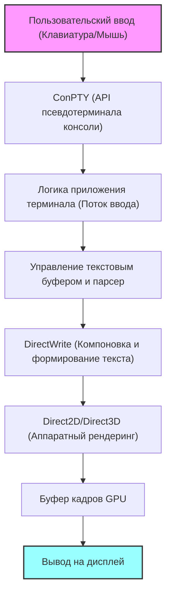
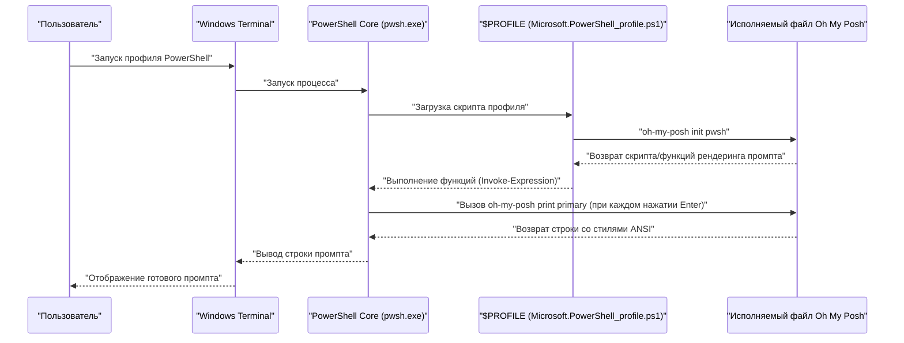

# Введение: Зачем настраивать Windows Terminal по максимуму

В современной разработке программного обеспечения эмулятор терминала выходит за рамки простого интерфейса ввода-вывода команд, становясь важнейшей «кабиной пилота», которая напрямую влияет на производительность разработчика. Ранее стандартная для сред Windows «Командная строка (cmd.exe)» и традиционная консоль «Windows PowerShell» (conhost.exe) значительно уступали проработанным терминальным средам Linux и macOS из-за низкой производительности отрисовки, слабой кастомизации и неполной поддержки Unicode.

Однако с появлением «Windows Terminal», разработку которого Microsoft ведет с открытым исходным кодом, ситуация кардинально изменилась. Сверхбыстрый рендеринг текста с аппаратным ускорением на базе DirectX, нативная поддержка вкладочного интерфейса (UI) и разделения на панели, свободно настраиваемые сочетания клавиш и функции расширенного управления профилями. Windows Terminal — это чрезвычайно мощное приложение, которое удовлетворяет всем требованиям к «современному терминалу», которые действительно искали разработчики.

В этой статье представлено полное руководство по настройке, которое поможет превратить Windows Terminal в «идеальную» среду. Мы не ограничимся поверхностными визуальными изменениями, а проведем тщательный технический анализ: от математических моделей, лежащих в основе рендеринга текста, и глубинной структуры `settings.json`, до внедрения Oh My Posh в PowerShell, настройки Starship в среде WSL и даже теоретического анализа задержек отрисовки.

Надеемся, что эта статья поможет вам создать собственную идеальную среду терминала и кардинально улучшить ваш повседневный опыт написания кода.

---

# 1. Архитектура рендеринга Windows Terminal и математические модели

За столь быстрой и плавной работой Windows Terminal стоит сложный конвейер рендеринга, который максимально использует современный графический стек Windows. В отличие от старого GDI (Graphics Device Interface), Windows Terminal применяет аппаратное ускорение на базе GPU, используя DirectWrite и DirectX (Direct2D/Direct3D).

Ниже представлена концептуальная схема конвейера рендеринга терминала — от ввода с клавиатуры до отображения символов на экране.



## 1.1 Субпиксельное сглаживание шрифтов и геометрия

При отрисовке текста технология сглаживания (anti-aliasing) абсолютно необходима для обеспечения высокой читаемости, предотвращающей усталость глаз даже при длительной работе. DirectWrite поддерживает продвинутое субпиксельное сглаживание, основанное на технологии ClearType.

Каждый пиксель типичного ЖК-дисплея (LCD) состоит из трех вертикальных или горизонтальных субпикселей: R (красный), G (зеленый) и B (синий). Субпиксельное сглаживание — это метод, который управляет яркостью не на уровне целого пикселя (как в сглаживании в градациях серого), а использует высокое пространственное разрешение на уровне 1/3 пикселя.

Пусть $ f(x, y) $ — бинарная функция, определяющая идеальный контур глифа векторного шрифта. Если координаты $ (x, y) $ внутри пикселя находятся внутри глифа, то $ f(x, y) = 1 $, а если снаружи — $ f(x, y) = 0 $.

Яркость $ I_R $ одного субпикселя (например, красного) вычисляется как свертка (convolution) интеграла от $ f(x, y) $ в пространственной области этого субпикселя $ S_R $ с функцией фильтра $ h(x, y) $, которая корректирует физические характеристики дисплея и особенности человеческого зрения (например, гамма-коррекцию).

$$
I_R = \iint_{S_R} f(x, y) \ast h(x, y) \,dx\,dy
$$

Зеленый ($ I_G $) и синий ($ I_B $) цвета рассчитываются аналогичным образом на основе их соответствующих областей $ S_G, S_B $. В Windows Terminal такие сложные операции интегрирования и свертки на субпиксельном уровне обрабатываются с высокой степенью параллелизма с использованием заранее сгенерированного кэша глифов (текстуры Atlas) и пиксельных шейдеров GPU, что позволяет добиться прекрасного рендеринга текста без задержек и без нагрузки на CPU.

---

# 2. Полное понимание и глубокая настройка settings.json

Суть кастомизации Windows Terminal заключается в редактировании конфигурационного файла `settings.json`. Хотя многие параметры можно изменить через графический интерфейс, для достижения максимальной настройки и возможности контроля версий через Git необходимо уметь редактировать JSON напрямую.

Файл конфигурации в основном состоит из трех ключевых разделов:

1. **`profiles`**: Определяет поведение и внешний вид (шрифт, фон, начальная директория) для каждой оболочки (PowerShell, cmd, WSL, Azure Cloud Shell и т.д.).
2. **`schemes`**: Определяет 16-цветные палитры (цветовые схемы), используемые в терминале.
3. **`actions`**: Определяет пользовательские действия (привязки клавиш или разделение панелей), вызываемые сочетаниями клавиш или из палитры команд.

## 2.1 Иерархическая структура профилей и модель наследования

В настройках профилей общие для всех профилей параметры указываются в объекте `defaults`, а индивидуальные — в каждом объекте массива `list`. Такая модель наследования устраняет избыточность файла конфигурации и улучшает его поддерживаемость.

```json
{
    "profiles": {
        "defaults": {
            "font": {
                "face": "CaskaydiaCove Nerd Font",
                "size": 11,
                "weight": "normal",
                "features": {
                    "calt": 1,
                    "liga": 1
                }
            },
            "useAcrylic": true,
            "acrylicOpacity": 0.85,
            "cursorShape": "filledBox",
            "cursorBlinking": true,
            "padding": "12, 12, 12, 12",
            "antialiasingMode": "cleartype",
            "historySize": 10000
        },
        "list": [
            {
                "guid": "{574e775e-4f2a-5b96-ac1e-a2962a402336}",
                "hidden": false,
                "name": "PowerShell 7",
                "source": "Windows.Terminal.PowershellCore",
                "colorScheme": "Tokyo Night",
                "backgroundImage": "C:\\Users\\Username\\Pictures\\Terminal\\cyberpunk_bg.png",
                "backgroundImageOpacity": 0.15,
                "backgroundImageStretchMode": "uniformToFill",
                "startingDirectory": "%USERPROFILE%\\Projects"
            },
            {
                "guid": "{2c4de342-38b7-51cf-b940-2309a097f518}",
                "hidden": false,
                "name": "Ubuntu-22.04",
                "source": "Windows.Terminal.Wsl",
                "colorScheme": "One Half Dark",
                "startingDirectory": "\\\\wsl$\\Ubuntu-22.04\\home\\username"
            }
        ]
    }
}
```

В приведенном выше примере добавлена настройка `"features": { "calt": 1, "liga": 1 }`, которая включает лигатуры для шрифта. Благодаря этому последовательности символов вроде `!=` или `=>` будут отрисовываться как единый красивый символ, удобный для программирования.

## 2.2 Модульная настройка с помощью JSON Fragments

Windows Terminal поддерживает механизм расширений под названием «JSON Fragments». Это позволяет сторонним приложениям (например, свежеустановленному дистрибутиву WSL или инструментам разработки вроде Visual Studio) динамически и безопасно добавлять собственные профили и цветовые схемы в терминал без прямого изменения основного файла `settings.json` пользователя.

Этот механизм можно применять и тогда, когда разработчик хочет разделить свои собственные настройки для удобства управления (достаточно поместить файлы JSON в указанную директорию, и они будут объединены автоматически).

---

# 3. Высший визуальный опыт: секреты тем, шрифтов и фонов

Цветовая схема терминала — это не только эстетика, но и важнейший фактор, напрямую влияющий на читаемость кода и логов, а также на снижение утомляемости глаз при долгой работе.

## 3.1 Создание и применение цветовых схем

В интернете доступно огромное количество цветовых схем для Windows Terminal (популярен сайт «Windows Terminal Themes»). Добавив их в массив `schemes`, вы сможете использовать любые цвета.

Ниже приведен пример определения популярной среди разработчиков темы «Tokyo Night». Это контрастная тема с преобладанием синих и фиолетовых оттенков, приятная для глаз.

```json
"schemes": [
    {
        "name": "Tokyo Night",
        "background": "#1A1B26",
        "foreground": "#A9B1D6",
        "black": "#32344A",
        "red": "#F7768E",
        "green": "#9ECE6A",
        "yellow": "#E0AF68",
        "blue": "#7AA2F7",
        "purple": "#BB9AF7",
        "cyan": "#7DCFFF",
        "white": "#A9B1D6",
        "brightBlack": "#414868",
        "brightRed": "#F7768E",
        "brightGreen": "#9ECE6A",
        "brightYellow": "#E0AF68",
        "brightBlue": "#7AA2F7",
        "brightPurple": "#BB9AF7",
        "brightCyan": "#7DCFFF",
        "brightWhite": "#C0CAF5",
        "cursorColor": "#C0CAF5",
        "selectionBackground": "#33467C"
    }
]
```

Каждый цвет указывается в шестнадцатеричном коде (HEX) и соответствует номеру цвета (от 0 до 15) в ANSI-последовательностях.

## 3.2 Установка Nerd Fonts и оптимизация шрифтов (CaskaydiaCove Nerd Font)

Если вы планируете использовать продвинутые инструменты для промпта, такие как Oh My Posh или Starship (о которых пойдет речь ниже), вам обязательно понадобятся шрифты с поддержкой специальных глифов (иконок), таких как значки веток Git, логотипы языков программирования или символы ОС. Шрифты, в которые добавлены (пропатчены) эти иконки к существующим шрифтам для программирования, называются «**Nerd Fonts**».

Разработанный Microsoft шрифт для программирования «Cascadia Code» отлично читается, но по умолчанию не содержит иконок Nerd Font. Поэтому настоятельно рекомендуется установить «**CaskaydiaCove Nerd Font**» — пропатченную версию Cascadia Code.

### Инструкция по установке:
1. Скачайте `CascadiaCode.zip` со [страницы релизов Nerd Fonts на GitHub](https://github.com/ryanoasis/nerd-fonts/releases).
2. Распакуйте архив, выберите файлы `.ttf`, щелкните правой кнопкой мыши и выберите «Установить для всех пользователей».
3. В `settings.json` измените значение `font.face` на `"CaskaydiaCove Nerd Font"`.

## 3.3 Эффект Acrylic и создание эффекта погружения с помощью фоновых изображений

Одной из функций, воплощающих Fluent Design System в Windows 11, является эффект материала «Acrylic (Акрил)». Он позволяет сделать фон терминала полупрозрачным, красиво размывая и пропуская окна или обои, находящиеся за ним.

```json
"useAcrylic": true,
"acrylicOpacity": 0.75,
```

Кроме того, в качестве фона можно установить любое изображение. Поддерживаются даже GIF-анимации, что позволяет создавать динамичные фоны. Позицию и прозрачность изображения можно точно настроить.

```json
"backgroundImage": "C:\\Users\\Username\\Pictures\\wallpapers\\anime_cyberpunk.gif",
"backgroundImageOpacity": 0.2,
"backgroundImageStretchMode": "none",
"backgroundImageAlignment": "bottomRight"
```

Это открывает возможности для кастомизации, повышающей мотивацию — например, можно аккуратно разместить любимого персонажа или логотип в правом нижнем углу терминала.

---

# 4. Максимизация производительности: разделение панелей, привязка клавиш и палитра команд

Windows Terminal изначально обладает базовыми функциями мультиплексоров терминалов (таких как tmux или screen) для разделения экрана на панели.

Настроив раздел `actions`, вы сможете свободно разделять, перемещать и изменять размер панелей экрана исключительно с помощью клавиатуры, не прикасаясь к мыши.

```json
"actions": [
    { "command": { "action": "splitPane", "split": "auto", "splitMode": "duplicate" }, "keys": "alt+shift+d" },
    { "command": { "action": "splitPane", "split": "right" }, "keys": "alt+shift+plus" },
    { "command": { "action": "splitPane", "split": "down" }, "keys": "alt+shift+minus" },
    { "command": { "action": "moveFocus", "direction": "left" }, "keys": "alt+left" },
    { "command": { "action": "moveFocus", "direction": "right" }, "keys": "alt+right" },
    { "command": { "action": "moveFocus", "direction": "up" }, "keys": "alt+up" },
    { "command": { "action": "moveFocus", "direction": "down" }, "keys": "alt+down" },
    { "command": { "action": "resizePane", "direction": "left" }, "keys": "alt+shift+left" },
    { "command": { "action": "resizePane", "direction": "right" }, "keys": "alt+shift+right" },
    { "command": { "action": "resizePane", "direction": "up" }, "keys": "alt+shift+up" },
    { "command": { "action": "resizePane", "direction": "down" }, "keys": "alt+shift+down" },
    { "command": { "action": "closePane" }, "keys": "ctrl+w" }
]
```

Благодаря этим привязкам, вы можете изменять размер панели с помощью `Alt + Shift + Стрелки` и мгновенно переключать фокус между панелями комбинацией `Alt + Стрелки`. Это позволяет беспрепятственно выполнять сложные параллельные задачи: например, в одной панели запустить локальный сервер Node.js и следить за логами, в другой — выполнять команды Git, а в третьей — проверять статус контейнеров Docker.

## 4.1 Режим Quake (Глобальный выпадающий терминал)

Также поддерживается «Quake Mode (Выпадающий режим)», позволяющий вызывать терминал с верхней части экрана в любой момент, подобно консоли в шутере «Quake». По умолчанию комбинация клавиш `Win + \` плавно опускает сверху окно терминала размером в половину экрана. Это невероятно удобно, когда нужно быстро ввести команду.

---

# 5. Автоматизация макета при запуске с помощью `wt.exe`

Типичные утренние рутины — открыть терминал в определенной папке проекта, разделить экран на три части и в каждой запустить сборку фронтенда, бэкенд-сервер и мониторинг базы данных — следует автоматизировать.

Исполняемый файл Windows Terminal, `wt.exe`, поддерживает мощные аргументы командной строки, позволяющие управлять профилем и состоянием панелей при запуске.

```powershell
wt -p "PowerShell 7" -d "C:\Projects\MyApp" ; split-pane -p "Ubuntu-22.04" -d "/var/log" -V ; split-pane -p "cmd" -H
```

Сохранив эту команду как ярлык Windows или bat-файл, вы сможете одним кликом мгновенно восстанавливать сложную схему среды разработки.

---

# 6. Эволюция промпта 1: PowerShell и Oh My Posh

То, что кардинально улучшает PowerShell (особенно кроссплатформенную последнюю версию PowerShell 7 / PowerShell Core) как стандартную оболочку в Windows — это «**Oh My Posh**». Oh My Posh — это настраиваемый движок промптов, поддерживающий любые оболочки. Он красиво и визуально понятно отображает всю необходимую для разработки информацию: текущую директорию, ветку Git и статус изменений, версию Node.js или Python, контекст Kubernetes и многое другое.

Следующая диаграмма показывает последовательность загрузки Oh My Posh и рендеринга промпта при запуске PowerShell.



## 6.1 Установка и настройка Oh My Posh

В среде Windows его легко установить с помощью официального пакетного менеджера `winget`.

```powershell
winget install JanDeDobbeleer.OhMyPosh -s winget
```

После установки нужно отредактировать скрипт профиля PowerShell, чтобы инициализировать Oh My Posh при загрузке. Путь к профилю хранится в автоматической переменной `$PROFILE`.

```powershell
notepad $PROFILE
```

Когда файл откроется, добавьте следующий код:

```powershell
# Настройка псевдонимов (aliases)
Set-Alias ll ls
Set-Alias g git

# Включение предиктивного ввода IntelliSense (модуль PSReadLine)
Set-PSReadLineOption -PredictionSource History
Set-PSReadLineOption -PredictionViewStyle ListView

# Инициализация Oh My Posh
# Укажите желаемую тему (например: jandedobbeleer).
# Путь к встроенным темам находится в переменной окружения $env:POSH_THEMES_PATH.
oh-my-posh init pwsh --config "$env:POSH_THEMES_PATH\tokyonight_storm.omp.json" | Invoke-Expression

# Модуль Terminal-Icons для отображения иконок папок и файлов
# (При первом запуске требуется Install-Module -Name Terminal-Icons -Repository PSGallery -Force)
Import-Module -Name Terminal-Icons
```

Доступны сотни готовых тем (config), но вы также можете создать собственную в форматах JSON, YAML или TOML. Используя концепцию «сегментов», вы можете свободно комбинировать информацию, отображаемую слева (Left) и справа (Right), для создания идеального промпта.

---

# 7. Эволюция промпта 2: Архитектура WSL2 и интеграция со Starship

WSL2 (Windows Subsystem for Linux 2), позволяющая запускать настоящее ядро Linux в Windows, незаменима для современной веб- и cloud-native разработки. Для настройки промпта в оболочках (Bash или Zsh) внутри WSL, «**Starship**» является оптимальным выбором.

Starship — это невероятно быстрый и настраиваемый кросс-шелл промпт, написанный на языке Rust. Его главное преимущество заключается в том, что написав всего один конфигурационный файл (TOML), вы сможете воспроизвести абсолютно одинаковый промпт в любой оболочке, будь то Bash, Zsh или Fish.

## 7.1 Установка Starship

Откройте терминал WSL (например, Ubuntu) и выполните официальный установочный скрипт:

```bash
curl -sS https://starship.rs/install.sh | sh
```

Далее, если вы используете Bash, добавьте следующее в конец файла `~/.bashrc`, чтобы включить перехватчик:

```bash
# ~/.bashrc
eval "$(starship init bash)"
```

Если вы используете Zsh, добавьте в конец `~/.zshrc`:

```bash
# ~/.zshrc
eval "$(starship init zsh)"
```

## 7.2 Идеальная настройка через starship.toml

Настройки Starship хранятся в файле `~/.config/starship.toml`. Поскольку он в формате TOML, его легче читать и писать человеку по сравнению с JSON, а также он поддерживает комментарии.

Ниже приведен пример конфигурации, которая создает современный и информативный промпт.

```toml
# ~/.config/starship.toml

# Определение общего формата (порядка) промпта
format = """
[╭─](bold blue)$os$directory$git_branch$git_status$nodejs$python$golang$rust
[╰─$character](bold blue)"""

# Настройки отображения иконок ОС
[os]
disabled = false
format = "[$symbol]($style) "

[os.symbols]
Ubuntu = " "
Windows = " "
Macos = " "
Alpine = " "

# Настройки отображения директории
[directory]
style = "bold cyan"
read_only = " "
truncation_length = 3
truncate_to_repo = true

# Настройки ветки Git
[git_branch]
symbol = " "
style = "bold purple"

# Настройки статуса Git
[git_status]
style = "bold red"
modified = " "
staged = " "
untracked = " "
deleted = "✖ "

# Символ промпта (символ в строке ввода)
[character]
success_symbol = "[❯](bold green)"
error_symbol = "[❯](bold red)"
```

В этой конфигурации промпт состоит из двух строк. На первой строке отображаются иконка ОС, текущий путь, ветка и статус Git, а также информация о версиях сред разработки (Node.js, Python и т.д.). Вторая строка — это простая строка ввода, которая экономит место на экране даже при вводе длинных команд.

---

# 8. Математическая модель задержки отрисовки терминала и производительности

Одним из важнейших показателей, определяющих удобство использования терминала, является «**Задержка ввода (Input Latency)**». Это время от момента нажатия клавиши на клавиатуре до момента изменения цвета соответствующих пикселей на экране и получения визуального отклика.

Общую задержку $ T_{total} $ можно строго смоделировать математически как сумму следующих компонентов:

$$
T_{total} = T_{hw\_input} + T_{os} + T_{pty} + T_{app} + T_{render} + T_{display}
$$

Значения переменных и их типичная продолжительность:

- $ T_{hw\_input} $: Аппаратная задержка (около 1-5 мс) — от замыкания механического переключателя клавиши до ее опроса через USB-контроллер и отправки сигнала прерывания.
- $ T_{os} $: Задержка обработки очереди сообщений слоем драйвера HID (Human Interface Device) ОС (около 1-2 мс).
- $ T_{pty} $: Задержка буферизации и преобразования кодировки символов (например, из UTF-8 в UTF-16) модулем ConPTY (псевдотерминал) (около 2-10 мс).
- $ T_{app} $: Время обработки интерпретации команды со стороны оболочки (PowerShell/Bash) и определение вывода на экран. Сюда же входит время выполнения процессов, таких как получение статуса Git через Oh My Posh или Starship (около 10-50 мс).
- $ T_{render} $: Задержка рендеринга (около 2-8 мс) — от растрирования текстовых глифов как текстур в Windows Terminal (DirectWrite/DirectX), их передачи в память GPU до переключения цепочки обмена (swap chain).
- $ T_{display} $: Задержка дисплея (например, скорость отклика GtG, около 5-20 мс) — от вывода сигнала из буфера кадров GPU на монитор до физического изменения свечения молекул жидких кристаллов.

Команда разработчиков Windows Terminal приложила огромные усилия для минимизации именно $ T_{pty} $ и $ T_{render} $. В ранних версиях терминала пропуски кадров в кэше при растрировании текста вызывали резкие задержки (пропуски кадров), но в последних версиях был внедрен алгоритм «кэша глифов на основе атласа (Atlas-based glyph cache)».

Благодаря атласированию глифов, отрисовка текста сводится к простым матричным вычислениям на GPU: «вырезанию из гигантской текстуры шрифта, заранее сгенерированной в памяти, и её композитингу (alpha blending) на экране».

Если нужно отрисовать $ N $ символов, то традиционный подход с последовательной отрисовкой на CPU через GDI требовал времени порядка $ \mathcal{O}(N) $, в то время как рендеринг атласа на базе GPU с параллельными шейдерами позволяет выполнять отрисовку за константное время, близкое к $ \mathcal{O}(1) $.

В результате, даже при огромном объеме логов, выводимых в стандартный поток вывода (например, `npm install` или сообщения компилятора в крупном C++ проекте), Windows Terminal может плавно прокручивать текст с частотой 60 fps (или на дисплеях с высокой частотой обновления, 144 Гц и выше) без каких-либо зависаний.

---

# 9. Продвинутые методы устранения неполадок и отладки

При максимальной настройке Windows Terminal вы можете столкнуться с непредвиденными проблемами, такими как синтаксические ошибки в файле конфигурации или дефекты отрисовки шрифтов. В этом разделе представлены продвинутые методы устранения неполадок, предназначенные для инженеров.

## 9.1 Валидация JSON Schema для settings.json
Структура `settings.json` строго определена, поэтому рекомендуется использовать валидацию JSON Schema в вашем редакторе (например, VS Code) для проверки синтаксиса в реальном времени. Если вы откроете `settings.json` в VS Code, по умолчанию будет применена схема Windows Terminal, и любые недопустимые имена свойств или ошибки типов значений (например, если передать строку туда, где ожидается число) будут сразу же подчеркнуты волнистой линией как предупреждение.

## 9.2 Профилирование производительности промпта
Если промпт отображается слишком медленно (существует лаг между нажатием Enter и появлением следующей строки ввода), то, скорее всего, проблема кроется во времени выполнения Oh My Posh или Starship. Oh My Posh обладает расширенными возможностями отладки, позволяющими измерить время отрисовки каждого блока.

```powershell
oh-my-posh debug
```

При выполнении этой команды в терминал будут выведены переменные среды, пути к загруженным файлам конфигурации, а также подробное время выполнения (в мс) каждого сегмента промпта. Это позволяет точно определить, какой процесс (например, получение статуса Git в гигантском монорепозитории, проверка статуса аутентификации облачного провайдера или сетевые задержки) является узким местом, и провести настройку, отключив ненужные модули.

## 9.3 Отключение аппаратного ускорения GPU (откат к программному рендерингу)
В редких случаях из-за старого оборудования или проблем со специфическими драйверами GPU аппаратный рендеринг через DirectX может вызывать мерцание экрана или обрезание текста. На этот случай существует опция принудительного отката к программному рендерингу.

Добавьте следующую настройку на корневой уровень файла `settings.json`:

```json
"softwareRendering": true
```

Это переключит рендеринг с GPU на отрисовку силами CPU (WARP). Хотя производительность при этом снизится, точность отображения будет гарантирована. Это отличный способ локализовать проблему при возникновении графических артефактов.

---

# Заключение

Истинная ценность Windows Terminal выходит далеко за рамки просто «замены старой командной строки». Новейшие технологии рендеринга с использованием DirectX, гибкая и мощная система настроек на базе JSON и бесшовная интеграция с различными оболочками, такими как WSL и PowerShell. Глубокое понимание этих аспектов и настройка терминала «под себя» позволяют до предела снизить «трение» в процессе разработки.

Описанные в этой статье методы — тонкая настройка цветовых схем, расширение визуальной информации с помощью Nerd Fonts, умные контекстно-зависимые промпты от Oh My Posh и Starship, а также создание многозадачной среды с разделением панелей — не только улучшат ваш опыт написания кода, но и повысят саму мотивацию при работе с терминалом.

Оптимизация рабочей среды не имеет конца. По мере появления новых инструментов командной строки и эволюции архитектуры ОС наши терминалы также будут менять свой облик. Мы надеемся, что эта статья станет для вас надежным ориентиром в бесконечном путешествии к созданию собственной «идеальной среды разработки».
