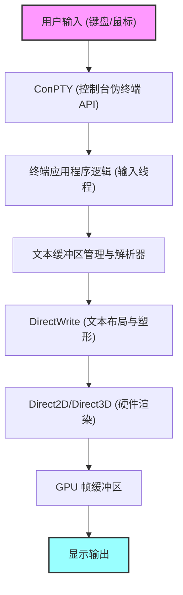
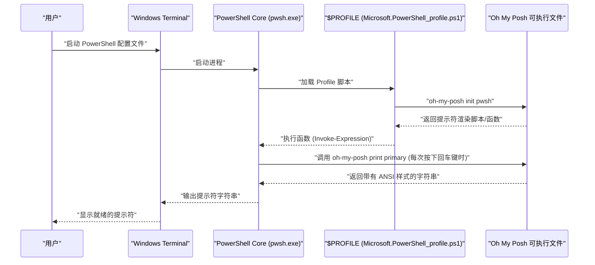

# 引言：为什么要将 Windows Terminal 定制到极致

在现代软件开发中，终端模拟器已经不仅仅是一个简单的命令输入输出界面，它更是直接影响开发者生产力的最重要的“驾驶舱”。过去 Windows 环境下的标准终端“命令提示符（cmd.exe）”或传统的“Windows PowerShell”控制台（conhost.exe），由于其渲染性能低下、定制性差以及不完整的 Unicode 支持，与 Linux 和 macOS 下精良的终端环境相比相形见绌。

然而，随着微软主导开源开发的“Windows Terminal”的出现，这一情况发生了戏剧性的变化。基于 DirectX 的硬件加速带来的超高速文本渲染、对标签页 UI 和窗格分割的原生支持、自由的快捷键设置，以及高级的配置文件管理功能。Windows Terminal 满足了开发者对“现代化终端”所有真正需求，是一款极其强大的应用程序。

本文将提供一份终极定制指南，助您将 Windows Terminal 升华为“最强”的工作环境。我们不仅停留在表面外观的修改，还将从底层文本渲染的数学模型、`settings.json` 的深层结构、PowerShell 中 Oh My Posh 的引入、WSL 环境下 Starship 的构建，甚至渲染延迟的理论分析等方面，从深度技术的视角进行全面讲解。

希望本文能帮助各位读者打造专属于自己的最佳终端环境，大幅提升日常的编码体验。

---

# 1. Windows Terminal 的渲染架构与数学模型

Windows Terminal 之所以能够如此高速且流畅地运行，其背后是充分利用了 Windows 现代化图形堆栈的精妙渲染流水线。与传统的 GDI（Graphics Device Interface）不同，Windows Terminal 采用了基于 DirectX（Direct2D/Direct3D）和 DirectWrite 的 GPU 硬件加速技术。

下面展示了从键盘输入到屏幕绘制文字的终端渲染流水线的概念图。



## 1.1 字体的亚像素抗锯齿与几何学

在文本绘制中，为了确保长时间工作也不会让眼睛疲劳的高可读性，抗锯齿技术是必不可少的。DirectWrite 支持应用了 ClearType 技术的高级亚像素抗锯齿。

一般的 LCD（液晶）显示器上的每个像素，都由 R（红）、G（绿）、B（蓝）三个垂直或水平的亚像素组成。亚像素抗锯齿并非以单个像素为单位（灰阶抗锯齿），而是利用这些 1/3 像素单位的更高空间分辨率来控制亮度的技术。

假设定义理想的矢量字体字形轮廓的二值函数为 $ f(x, y) $。当像素内的坐标 $ (x, y) $ 位于字形内部时， $ f(x, y) = 1 $，位于外部时 $ f(x, y) = 0 $。

单个亚像素（例如红色亚像素）的亮度 $ I_R $，是通过该亚像素空间区域 $ S_R $ 上 $ f(x, y) $ 的积分，与用于校正显示器物理特性及人类视觉特性（如伽马特性）的滤波函数 $ h(x, y) $ 进行卷积计算得出的。

$$
I_R = \iint_{S_R} f(x, y) \ast h(x, y) \,dx\,dy
$$

对于绿色（$ I_G $）和蓝色（$ I_B $），同样基于各自的区域 $ S_G, S_B $ 进行计算。在 Windows Terminal 中，这种复杂的亚像素级积分与卷积运算，通过预先生成的字形缓存（Atlas 纹理）和 GPU 的像素着色器进行超大规模并行处理，从而在不增加 CPU 负担的情况下，实现了无延迟且优美的文本渲染。

---

# 2. 彻底理解 `settings.json` 与深层设置

Windows Terminal 定制的核心在于编辑配置文件 `settings.json`。虽然通过 GUI 设置界面也能修改许多选项，但为了追求极致的定制，并通过 Git 等工具对配置进行版本控制，掌握直接编辑 JSON 的知识是不可或缺的。

配置文件主要由以下 3 个核心部分组成：

1. **`profiles`**：定义各种 Shell（PowerShell、cmd、WSL、Azure Cloud Shell 等）的行为和外观（字体、背景、启动目录）。
2. **`schemes`**：定义终端内使用的 16 色调色板（配色方案）。
3. **`actions`**：定义通过快捷键或命令面板调用的自定义操作（快捷键绑定或窗格分割）。

## 2.1 配置文件的层级结构与继承模型

在配置文件中，所有环境的通用设置写在 `defaults` 对象中，而个性化设置则写在 `list` 数组内的各个对象里。通过这种继承模型，可以消除配置文件的冗余，提高可维护性。

```json
{
    "profiles": {
        "defaults": {
            "font": {
                "face": "CaskaydiaCove Nerd Font",
                "size": 11,
                "weight": "normal",
                "features": {
                    "calt": 1,
                    "liga": 1
                }
            },
            "useAcrylic": true,
            "acrylicOpacity": 0.85,
            "cursorShape": "filledBox",
            "cursorBlinking": true,
            "padding": "12, 12, 12, 12",
            "antialiasingMode": "cleartype",
            "historySize": 10000
        },
        "list": [
            {
                "guid": "{574e775e-4f2a-5b96-ac1e-a2962a402336}",
                "hidden": false,
                "name": "PowerShell 7",
                "source": "Windows.Terminal.PowershellCore",
                "colorScheme": "Tokyo Night",
                "backgroundImage": "C:\\Users\\Username\\Pictures\\Terminal\\cyberpunk_bg.png",
                "backgroundImageOpacity": 0.15,
                "backgroundImageStretchMode": "uniformToFill",
                "startingDirectory": "%USERPROFILE%\\Projects"
            },
            {
                "guid": "{2c4de342-38b7-51cf-b940-2309a097f518}",
                "hidden": false,
                "name": "Ubuntu-22.04",
                "source": "Windows.Terminal.Wsl",
                "colorScheme": "One Half Dark",
                "startingDirectory": "\\\\wsl$\\Ubuntu-22.04\\home\\username"
            }
        ]
    }
}
```

在上面的例子中，我们在字体中添加了启用连字（Ligatures）的设置 `"features": { "calt": 1, "liga": 1 }`。这样一来，像 `!=` 或 `=>` 等多个符号组合，将被渲染成更适合编程的单一美观符号。

## 2.2 通过 JSON Fragments 实现模块化配置

Windows Terminal 支持一种名为“JSON Fragments”的扩展机制。它允许第三方应用程序（例如新安装的 WSL 发行版或 Visual Studio 等开发工具），在不直接修改用户主 `settings.json` 的情况下，动态且安全地向终端添加专属配置文件或配色方案。

当开发者自己想要分割管理自定义配置时，也可以应用此机制（只需将 JSON 文件放在指定目录即可自动合并）。

---

# 3. 极致的视觉体验：主题、字体与背景的奥义

终端的配色不仅关乎美观，更直接影响代码和日志的可读性，并在长时间工作中有效缓解视觉疲劳。

## 3.1 制作和应用配色方案

互联网上公开了许多 Windows Terminal 的配色方案（著名网站如“Windows Terminal Themes”）。只需将它们添加到 `schemes` 数组中，即可自由使用各种配色。

下面展示的是近年来在开发者中极受欢迎的“Tokyo Night”主题的 JSON 定义示例。这是一个以蓝、紫色为基调，既护眼又具有高对比度的主题。

```json
"schemes": [
    {
        "name": "Tokyo Night",
        "background": "#1A1B26",
        "foreground": "#A9B1D6",
        "black": "#32344A",
        "red": "#F7768E",
        "green": "#9ECE6A",
        "yellow": "#E0AF68",
        "blue": "#7AA2F7",
        "purple": "#BB9AF7",
        "cyan": "#7DCFFF",
        "white": "#A9B1D6",
        "brightBlack": "#414868",
        "brightRed": "#F7768E",
        "brightGreen": "#9ECE6A",
        "brightYellow": "#E0AF68",
        "brightBlue": "#7AA2F7",
        "brightPurple": "#BB9AF7",
        "brightCyan": "#7DCFFF",
        "brightWhite": "#C0CAF5",
        "cursorColor": "#C0CAF5",
        "selectionBackground": "#33467C"
    }
]
```

每种颜色都使用 16 进制颜色代码（HEX）指定，分别对应 ANSI 转义序列中的颜色编号（0~15）。

## 3.2 引入 Nerd Fonts 并优化字体设置（CaskaydiaCove Nerd Font）

当使用后文提到的 Oh My Posh 或 Starship 等高级提示符工具时，Git 分支图标、编程语言 Logo、操作系统符号等包含特殊字形（图标）的字体是必不可少的。将这些图标修补（追加）到现有编程字体中而成的便是“**Nerd Fonts**”。

微软开发的编程字体“Cascadia Code”非常易读且优秀，但默认并不包含 Nerd Font 图标。因此，强烈推荐安装应用了 Nerd Font 补丁的 Cascadia Code，即“**CaskaydiaCove Nerd Font**”。

### 安装步骤：
1. 从 [Nerd Fonts 官方 GitHub 发布页](https://github.com/ryanoasis/nerd-fonts/releases) 下载 `CascadiaCode.zip`。
2. 解压后，选中其中的 `.ttf` 文件，右键点击并选择“为所有用户安装”。
3. 将 `settings.json` 中的 `font.face` 修改为 `"CaskaydiaCove Nerd Font"`。

## 3.3 亚克力效果与背景图片营造沉浸感

体现 Windows 11 Fluent Design System 的功能之一就是“亚克力（Acrylic）”材质效果。它可以使终端背景呈现半透明状态，并将背后的窗口或壁纸进行优美的模糊透视。

```json
"useAcrylic": true,
"acrylicOpacity": 0.75,
```

此外，还可以设置任意图片作为背景。支持 Gif 动画，能制作出动态背景。图片的对齐方式和不透明度也可以进行精细控制。

```json
"backgroundImage": "C:\\Users\\Username\\Pictures\\wallpapers\\anime_cyberpunk.gif",
"backgroundImageOpacity": 0.2,
"backgroundImageStretchMode": "none",
"backgroundImageAlignment": "bottomRight"
```

借此，可以在终端右下角低调地放置喜爱的角色或标志，进行一种能够提升动力的个性化定制。

---

# 4. 生产力最大化：窗格分割、快捷键绑定与命令面板

Windows Terminal 原生具备 tmux 或 screen 等终端复用器的基本功能（屏幕窗格分割）。

通过自定义 `actions` 部分，无需触碰鼠标，仅凭键盘操作即可自由地分割、移动和调整屏幕窗格大小。

```json
"actions": [
    { "command": { "action": "splitPane", "split": "auto", "splitMode": "duplicate" }, "keys": "alt+shift+d" },
    { "command": { "action": "splitPane", "split": "right" }, "keys": "alt+shift+plus" },
    { "command": { "action": "splitPane", "split": "down" }, "keys": "alt+shift+minus" },
    { "command": { "action": "moveFocus", "direction": "left" }, "keys": "alt+left" },
    { "command": { "action": "moveFocus", "direction": "right" }, "keys": "alt+right" },
    { "command": { "action": "moveFocus", "direction": "up" }, "keys": "alt+up" },
    { "command": { "action": "moveFocus", "direction": "down" }, "keys": "alt+down" },
    { "command": { "action": "resizePane", "direction": "left" }, "keys": "alt+shift+left" },
    { "command": { "action": "resizePane", "direction": "right" }, "keys": "alt+shift+right" },
    { "command": { "action": "resizePane", "direction": "up" }, "keys": "alt+shift+up" },
    { "command": { "action": "resizePane", "direction": "down" }, "keys": "alt+shift+down" },
    { "command": { "action": "closePane" }, "keys": "ctrl+w" }
]
```

设置上述快捷键后，可通过 `Alt + Shift + 方向键` 调整窗格大小，通过 `Alt + 方向键` 瞬间在窗格间切换焦点。这样就可以实现高级的并行作业体验：在一个窗格中启动 Node.js 本地服务器并监控日志，在另一个窗格执行 Git 命令，同时还在第三个窗格检查 Docker 容器的状态。

## 4.1 Quake 模式（全局下拉终端）

像 FPS 游戏《雷神之锤（Quake）》的控制台画面一样，Windows Terminal 还支持可以随时从屏幕上方呼出终端的“Quake 模式（下拉模式）”。默认情况下，按下 `Win + \` 键，一个占据半个屏幕大小的终端窗口就会带动画地从上方滑出。在需要临时输入命令时非常方便。

---

# 5. 巧用 `wt.exe` 实现启动布局自动化

每天早晨开始工作时，在特定的项目目录中打开终端，将屏幕分为 3 块，分别执行前端构建、后端服务器启动和数据库监控命令……这类常规操作应当自动化。

Windows Terminal 的可执行程序 `wt.exe` 支持强大的命令行参数，可以通过参数控制启动时的配置文件和窗格分割状态。

```powershell
wt -p "PowerShell 7" -d "C:\Projects\MyApp" ; split-pane -p "Ubuntu-22.04" -d "/var/log" -V ; split-pane -p "cmd" -H
```

将该命令保存为 Windows 快捷方式或批处理文件，只需一键点击，就能瞬间恢复复杂的开发环境布局。

---

# 6. 提示符进化论 1：PowerShell 与 Oh My Posh

能让 Windows 环境下的标准 Shell PowerShell（特别是支持跨平台的最新版 PowerShell 7 / PowerShell Core）产生剧变的，便是“**Oh My Posh**”。Oh My Posh 是一款适用于各种 Shell 的自定义提示符引擎，它能以美观且直观的方式呈现当前目录、Git 分支及修改状态、Node.js 或 Python 版本、Kubernetes 上下文等开发所需的所有状态。

下图展示了在启动 PowerShell 时，Oh My Posh 是如何被加载并渲染提示符的序列图。



## 6.1 Oh My Posh 的安装与设置

在 Windows 环境下，可以使用官方包管理器 `winget` 轻松安装。

```powershell
winget install JanDeDobbeleer.OhMyPosh -s winget
```

安装完成后，编辑 PowerShell 的 profile 脚本，以便在启动时初始化 Oh My Posh。配置文件的路径存储在自动变量 `$PROFILE` 中。

```powershell
notepad $PROFILE
```

文件打开后，追加以下代码。

```powershell
# 设置别名
Set-Alias ll ls
Set-Alias g git

# 启用预测型 IntelliSense (PSReadLine 模块)
Set-PSReadLineOption -PredictionSource History
Set-PSReadLineOption -PredictionViewStyle ListView

# Oh My Posh 初始化
# 指定喜欢的主题（例：jandedobbeleer）。
# 内置主题路径在环境变量 $env:POSH_THEMES_PATH 中。
oh-my-posh init pwsh --config "$env:POSH_THEMES_PATH\tokyonight_storm.omp.json" | Invoke-Expression

# 为文件夹和文件显示图标的 Terminal-Icons 模块
# (首次需要运行 Install-Module -Name Terminal-Icons -Repository PSGallery -Force)
Import-Module -Name Terminal-Icons
```

官方准备了数百种主题（config），您也可以使用 JSON、YAML、TOML 格式完全自己制作。通过运用“片段（Segment）”的概念，可自由组合显示在左侧（Left）和右侧（Right）的信息，从而设计出专属的提示符。

---

# 7. 提示符进化论 2：WSL2 架构与 Starship 的融合

能在 Windows 上运行真正 Linux 内核的 WSL2（Windows Subsystem for Linux 2），对于现代 Web 开发和云原生开发是不可或缺的。要定制 WSL 内的 Shell（Bash 或 Zsh）提示符，“**Starship**”无疑是最佳选择。

Starship 是用 Rust 语言编写的，极快且定制性极强的跨 Shell 提示符。它最大的优势在于只需编写一个配置文件（TOML），就能在 Bash、Zsh、Fish 等任何 Shell 中重现完全相同的提示符。

## 7.1 安装 Starship

打开 WSL 的终端（如 Ubuntu 等），并执行官方安装脚本。

```bash
curl -sS https://starship.rs/install.sh | sh
```

接着，如果使用的是 Bash，请在 `~/.bashrc` 的末尾追加以下内容以启用钩子（hook）。

```bash
# ~/.bashrc
eval "$(starship init bash)"
```

如果使用的是 Zsh，则在 `~/.zshrc` 的末尾追加。

```bash
# ~/.zshrc
eval "$(starship init zsh)"
```

## 7.2 通过 starship.toml 实现终极定制

Starship 的配置文件写在 `~/.config/starship.toml` 中。因为采用了 TOML 格式，相比 JSON 更适合人类读写，并且允许添加注释。

下面展示了一个能够实现现代化且信息丰富的提示符配置示例。

```toml
# ~/.config/starship.toml

# 定义整个提示符的格式（排列顺序）
format = """
[╭─](bold blue)$os$directory$git_branch$git_status$nodejs$python$golang$rust
[╰─$character](bold blue)"""

# OS 图标显示设置
[os]
disabled = false
format = "[$symbol]($style) "

[os.symbols]
Ubuntu = " "
Windows = " "
Macos = " "
Alpine = " "

# 目录显示设置
[directory]
style = "bold cyan"
read_only = " "
truncation_length = 3
truncate_to_repo = true

# Git 分支设置
[git_branch]
symbol = " "
style = "bold purple"

# Git 状态设置
[git_status]
style = "bold red"
modified = " "
staged = " "
untracked = " "
deleted = "✖ "

# 提示符字符（输入行的符号）
[character]
success_symbol = "[❯](bold green)"
error_symbol = "[❯](bold red)"
```

在此配置中，提示符被设计为两行。第一行显示操作系统图标、当前目录路径、Git 分支与状态，以及各语言环境（如 Node.js、Python 等）的版本信息。第二行则是简洁的输入行，这样即使输入长命令也不会挤压屏幕空间。

---

# 8. 终端渲染延迟与性能的数学模型

评估终端使用体验的最重要指标之一就是“**输入延迟（Input Latency）**”。它指的是从按下键盘按键开始，到屏幕上对应的像素颜色发生改变、获得视觉反馈为止的时间延迟。

这个总体延迟 $ T_{total} $，在数学上可以严格建模为以下组件的总和。

$$
T_{total} = T_{hw\_input} + T_{os} + T_{pty} + T_{app} + T_{render} + T_{display}
$$

各变量的含义与典型的所需时间如下：

- $ T_{hw\_input} $：键盘机械轴触发后，通过 USB 控制器轮询并发送中断信号的硬件延迟（约 1〜5 ms）。
- $ T_{os} $：操作系统 HID（Human Interface Device）驱动层的消息队列处理延迟（约 1〜2 ms）。
- $ T_{pty} $：ConPTY（伪终端）带来的缓冲与字符编码（如 UTF-8 到 UTF-16）转换延迟（约 2〜10 ms）。
- $ T_{app} $：Shell（PowerShell/Bash）端的命令解析以及决定画面输出的处理时间。Oh My Posh 或 Starship 获取 Git 状态等的处理时间也包含在内（约 10〜50 ms）。
- $ T_{render} $：Windows Terminal（DirectWrite/DirectX）将文本字形光栅化为纹理，并传输至 GPU 内存、翻转交换链的渲染延迟（约 2〜8 ms）。
- $ T_{display} $：从 GPU 帧缓冲区输出信号到显示器，直到液晶分子响应使物理发光状态发生改变的显示器延迟（如 GtG 响应时间。约 5〜20 ms）。

Windows Terminal 开发团队在最小化 $ T_{pty} $ 和 $ T_{render} $ 方面付出了巨大的努力。在早期版本中，曾因文本光栅化时的缓存未命中而产生过尖峰状的延迟（掉帧），但在最新版本中引入了“基于 Atlas 的字形缓存（Atlas-based glyph cache）”算法。

通过字形 Atlas 化，字符串的渲染就变成了一个简单的 GPU 矩阵运算：“从预先在内存中生成的巨大字体纹理中截取，并与屏幕进行 Alpha 混合”。

当待渲染字符串为 $ N $ 个字符时，传统 GDI 方案中由 CPU 进行串行绘制的成本为 $ \mathcal{O}(N) $ 的时间；而在基于 GPU 的 Atlas 渲染中，通过并行着色器，则能够以接近 $ \mathcal{O}(1) $ 的常数时间完成渲染。

正因如此，即使在有大量日志流向标准输出的情况下（例如 `npm install` 或是编译大型 C++ 项目的信息），Windows Terminal 也不会出现掉帧卡顿，能够维持 60fps（或 144Hz 以上的高刷新率）平滑滚动文本。

---

# 9. 高级故障排除与调试技巧

将 Windows Terminal 定制到极致后，有时会遇到配置文件语法错误或字体渲染异常等意料之外的问题。在此介绍面向工程师的高级故障排除技巧。

## 9.1 `settings.json` 的 JSON Schema 验证
`settings.json` 的结构有着严格的定义，建议使用 JSON Schema 在编辑器（如 VS Code）中进行实时的语法检查。在 VS Code 中打开 `settings.json` 时，默认会应用 Windows Terminal 的 Schema，并在出现无效的属性名或值类型错误（例如期待数值的地方却填入了字符串）时，立刻用波浪线发出警告。

## 9.2 提示符性能分析
如果提示符显示极慢（例如按下回车键后要卡顿一下才出现下一行），很有可能是 Oh My Posh 或 Starship 的执行时间存在问题。Oh My Posh 具备高级的调试功能，可以测量各个区块的渲染时间。

```powershell
oh-my-posh debug
```

执行该命令后，会详细输出终端环境变量、加载的配置文件路径，以及构成提示符的各个片段的处理毫秒数（ms）。据此可以准确定位到底是哪一项信息获取（比如在巨型 Mono 仓库中获取 Git 状态、检查云服务商认证状态或网络延迟等）成为了瓶颈，从而进行禁用无用模块等调优操作。

## 9.3 禁用 GPU 加速（回退到软件渲染）
在比较老旧的硬件上，或是特定的 GPU 驱动存在 Bug 时，DirectX 硬件渲染极少数情况下可能导致屏幕闪烁或文字缺失。此时，有一个配置选项可以强制回退到软件渲染。

请在 `settings.json` 的根级别添加以下设置。

```json
"softwareRendering": true
```

这样就会切换为由 CPU（WARP）代替 GPU 进行渲染。虽然性能会有所下降，但能保证渲染的准确性。这也是隔离图形相关问题的一个有力手段。

---

# 结语

Windows Terminal 的真正价值，远远超越了“旧版命令提示符替代品”的定位。它运用了基于 DirectX 的最新渲染技术，拥有基于 JSON 的灵活且强大的配置机制，并且能够与 WSL、PowerShell 等多样化的 Shell 进行无缝整合。只有深入理解这些特性，并对其进行顺手好用的定制，才能将开发过程中的摩擦降至最低。

本文介绍的诸多设置方法——调校配色方案、通过 Nerd Font 扩展视觉信息、利用 Oh My Posh 和 Starship 打造具备上下文感知能力的智能提示符，以及利用窗格分割构建多任务环境——这些不仅能提升日常编码体验，更能提高面对终端时的动力。

开发环境的优化永无止境。每当有新的命令行工具出现、每当操作系统的架构发生演进，我们的终端也必定会随之改变。愿本文能成为各位读者在探寻属于自己的“终极开发环境”这一无尽旅途中的一个坚实路标。
