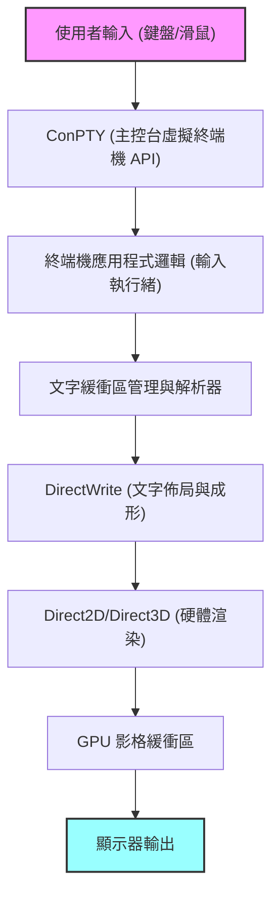
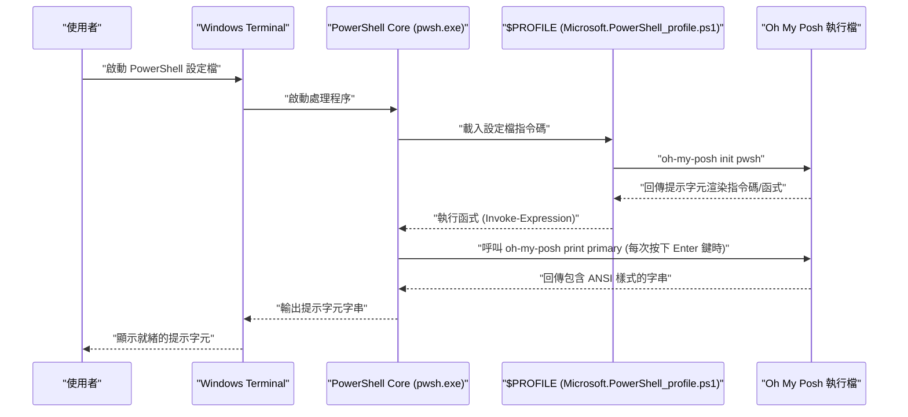

# 前言：為什麼要將 Windows Terminal 客製化到極限

在現代的軟體開發中，終端機模擬器已經超越了單純的指令輸入輸出介面，成為直接影響開發者生產力最重要的「駕駛艙」。過去 Windows 環境中標準的「命令提示字元（cmd.exe）」與傳統的「Windows PowerShell」主控台（conhost.exe），由於其繪圖效能與客製化程度低，加上 Unicode 支援不完全，與 Linux 或 macOS 精緻的終端機環境相比，顯得相形見絀。

然而，隨著微軟主導開發的開源專案「Windows Terminal」的出現，這個情況發生了戲劇性的變化。基於 DirectX 硬體加速的超高速文字渲染、原生支援分頁 UI 與窗格分割、自由自在的快捷鍵設定，以及進階的設定檔管理功能。Windows Terminal 滿足了開發者對「現代終端機」的所有需求，是一款極其強大的應用程式。

本文將提供終極的客製化指南，以將此 Windows Terminal 昇華為「最強」的環境。我們不僅會改變表面的外觀，還會從徹底且技術性的角度進行解說，包括文字渲染基礎的數學模型、`settings.json` 的深層結構、在 PowerShell 中導入 Oh My Posh、在 WSL 環境中建構 Starship，甚至是渲染延遲的理論分析。

希望本文能幫助讀者們建構屬於自己的最佳終端機環境，並大幅提升日常的程式設計體驗。

---

# 1. Windows Terminal 的渲染架構與數學模型

Windows Terminal 能夠如此高速且流暢地運作，其背後存在著一個充分利用 Windows 現代圖形堆疊的精緻渲染管線。取代了傳統的 GDI（Graphics Device Interface），Windows Terminal 採用了基於 GPU 硬體加速的 DirectWrite 與 DirectX（Direct2D/Direct3D）。

以下概念圖展示了從按鍵輸入到畫面上文字繪製的終端機渲染管線。



## 1.1 字型的次像素反鋸齒與幾何學

在文字的繪製中，為了確保長時間工作也不會眼睛疲勞的高辨識度，反鋸齒技術是不可或缺的。DirectWrite 支援應用了 ClearType 技術的進階次像素反鋸齒（Subpixel Anti-aliasing）。

一般 LCD（液晶）顯示器的每個像素是由 R（紅）、G（綠）、B（藍）三個垂直或水平的次像素所組成。次像素反鋸齒並非以單一像素為單位（灰階反鋸齒），而是利用這些 1/3 像素單位的高空間解析度來控制亮度的技術。

假設定義理想向量字型字形輪廓的二元函數為 $ f(x, y) $。當像素內的座標 $ (x, y) $ 在字形內部時 $ f(x, y) = 1 $，在外部時 $ f(x, y) = 0 $。

單一次像素（例如紅色的次像素）的亮度 $ I_R $，是將其次像素的空間區域 $ S_R $ 中的 $ f(x, y) $ 積分，與為了修正顯示器物理特性或人類視覺特性（如伽瑪特性等）的濾波函數 $ h(x, y) $ 進行卷積（Convolution）計算而來。

$$
I_R = \iint_{S_R} f(x, y) \ast h(x, y) \,dx\,dy
$$

綠色（$ I_G $）與藍色（$ I_B $）也同樣基於各自的區域 $ S_G, S_B $ 來計算。在 Windows Terminal 中，這種複雜的次像素等級積分與卷積運算，是透過預先生成的字形快取（Atlas 紋理）與 GPU 的像素著色器（Pixel Shader）進行超平行處理，從而在不增加 CPU 負載的情況下，實現無延遲且優美的文字渲染。

---

# 2. 徹底理解 settings.json 與深層設定

Windows Terminal 客製化的核心在於編輯設定檔 `settings.json`。雖然透過 GUI 的設定畫面也能更改許多項目，但為了追求終極的客製化，並能使用 Git 等工具對設定進行版本控制，直接編輯 JSON 的知識是不可或缺的。

設定檔主要由以下三個核心區塊組成：

1. **`profiles`**：定義每個殼層（如 PowerShell、cmd、WSL、Azure Cloud Shell 等）的行為與外觀（字型、背景、啟動目錄）。
2. **`schemes`**：定義在終端機內使用的 16 色調色盤（色彩配置）。
3. **`actions`**：定義可透過快捷鍵或命令選擇區呼叫的自訂動作（按鍵繫結或窗格分割）。

## 2.1 設定檔的階層結構與繼承模型

在設定檔設定中，適用於所有設定檔的共通設定會寫在 `defaults` 物件中，而個別設定則寫在 `list` 陣列內的各個物件中。這種繼承模型可以消除設定檔的冗餘，並提高維護性。

```json
{
    "profiles": {
        "defaults": {
            "font": {
                "face": "CaskaydiaCove Nerd Font",
                "size": 11,
                "weight": "normal",
                "features": {
                    "calt": 1,
                    "liga": 1
                }
            },
            "useAcrylic": true,
            "acrylicOpacity": 0.85,
            "cursorShape": "filledBox",
            "cursorBlinking": true,
            "padding": "12, 12, 12, 12",
            "antialiasingMode": "cleartype",
            "historySize": 10000
        },
        "list": [
            {
                "guid": "{574e775e-4f2a-5b96-ac1e-a2962a402336}",
                "hidden": false,
                "name": "PowerShell 7",
                "source": "Windows.Terminal.PowershellCore",
                "colorScheme": "Tokyo Night",
                "backgroundImage": "C:\\Users\\Username\\Pictures\\Terminal\\cyberpunk_bg.png",
                "backgroundImageOpacity": 0.15,
                "backgroundImageStretchMode": "uniformToFill",
                "startingDirectory": "%USERPROFILE%\\Projects"
            },
            {
                "guid": "{2c4de342-38b7-51cf-b940-2309a097f518}",
                "hidden": false,
                "name": "Ubuntu-22.04",
                "source": "Windows.Terminal.Wsl",
                "colorScheme": "One Half Dark",
                "startingDirectory": "\\\\wsl$\\Ubuntu-22.04\\home\\username"
            }
        ]
    }
}
```

在上述範例中，我們加入了啟用字型連字（Ligatures）的設定 `"features": { "calt": 1, "liga": 1 }`。這會讓 `!=` 或 `=>` 等多個符號，繪製成適合程式設計的單一優美符號。

## 2.2 透過 JSON Fragments 實現模組化設定

Windows Terminal 支援稱為「JSON Fragments」的擴充機制。這是一種讓第三方應用程式（例如，新安裝的 WSL 發行版，或是 Visual Studio 等開發工具）能動態且安全地將自己的設定檔或色彩配置加入到終端機中，而無需直接修改使用者的主要 `settings.json` 的機制。

當開發者想要將自己獨特的設定分開管理時，也可以應用這個機制（只需將 JSON 檔案放在指定的目錄中，系統就會自動合併）。

---

# 3. 終極的視覺體驗：主題、字型、背景的秘訣

終端機的配色不僅關乎外觀的優劣，更直接影響到程式碼與日誌的易讀性，以及長時間工作下減輕眼睛疲勞等重要因素。

## 3.1 製作與套用色彩配置

網際網路公開了許多供 Windows Terminal 使用的色彩配置（著名的網站有「Windows Terminal Themes」）。透過將這些配置加入到 `schemes` 陣列中，您可以自由地使用各種配色。

以下展示近年來在開發者間極受歡迎的「Tokyo Night」主題的 JSON 定義範例。這是一個以藍色與紫色為基調，對眼睛友善且對比度高的主題。

```json
"schemes": [
    {
        "name": "Tokyo Night",
        "background": "#1A1B26",
        "foreground": "#A9B1D6",
        "black": "#32344A",
        "red": "#F7768E",
        "green": "#9ECE6A",
        "yellow": "#E0AF68",
        "blue": "#7AA2F7",
        "purple": "#BB9AF7",
        "cyan": "#7DCFFF",
        "white": "#A9B1D6",
        "brightBlack": "#414868",
        "brightRed": "#F7768E",
        "brightGreen": "#9ECE6A",
        "brightYellow": "#E0AF68",
        "brightBlue": "#7AA2F7",
        "brightPurple": "#BB9AF7",
        "brightCyan": "#7DCFFF",
        "brightWhite": "#C0CAF5",
        "cursorColor": "#C0CAF5",
        "selectionBackground": "#33467C"
    }
]
```

每個顏色都是以十六進位顏色碼（HEX）指定，並對應 ANSI 跳脫序列（Escape Sequence）的各個顏色編號（0～15）。

## 3.2 導入 Nerd Fonts 與字型設定最佳化（CaskaydiaCove Nerd Font）

當您要使用後述的 Oh My Posh 或 Starship 等進階提示字元工具時，包含 Git 分支圖示、程式語言標誌、OS 符號等特殊字形（圖示）的字型是必須的。將這些圖示修補（加入）到現有的程式設計用字型中所產生的就是「**Nerd Fonts**」。

微軟開發的程式設計用字型「Cascadia Code」非常易讀且優秀，但預設並不包含 Nerd Font 的圖示。因此，強烈建議導入將 Nerd Font 修補套用至 Cascadia Code 的「**CaskaydiaCove Nerd Font**」。

### 安裝步驟：
1. 從 [Nerd Fonts 官方 GitHub 發布頁面](https://github.com/ryanoasis/nerd-fonts/releases)下載 `CascadiaCode.zip`。
2. 解壓縮後，選擇裡面包含的 `.ttf` 檔案並點擊右鍵，選擇「為所有使用者安裝」。
3. 將 `settings.json` 的 `font.face` 變更為 `"CaskaydiaCove Nerd Font"`。

## 3.3 透過 Acrylic 效果與背景圖片營造沉浸感

體現 Windows 11 Fluent Design System 的功能之一就是「Acrylic（壓克力）」材質效果。它可以讓終端機的背景呈現半透明，並將背後的視窗或桌布優美地模糊穿透。

```json
"useAcrylic": true,
"acrylicOpacity": 0.75,
```

此外，您也可以將任意圖片設定為背景。它也支援 Gif 動畫，能讓您製作動態背景。圖片的放置位置與不透明度也能夠進行微調。

```json
"backgroundImage": "C:\\Users\\Username\\Pictures\\wallpapers\\anime_cyberpunk.gif",
"backgroundImageOpacity": 0.2,
"backgroundImageStretchMode": "none",
"backgroundImageAlignment": "bottomRight"
```

藉此，您可以進行像是「在終端機右下角低調地放置喜歡的角色或標誌」等能提升動力的客製化。

---

# 4. 生產力最大化：窗格分割、按鍵繫結、命令選擇區

Windows Terminal 原生具備類似 tmux 或 screen 等終端機多工器（Terminal Multiplexer）的基本功能（畫面的窗格分割）。

透過客製化 `actions` 區塊，您可以完全不碰到滑鼠，僅靠鍵盤操作就能自由自在地分割、移動與調整畫面大小。

```json
"actions": [
    { "command": { "action": "splitPane", "split": "auto", "splitMode": "duplicate" }, "keys": "alt+shift+d" },
    { "command": { "action": "splitPane", "split": "right" }, "keys": "alt+shift+plus" },
    { "command": { "action": "splitPane", "split": "down" }, "keys": "alt+shift+minus" },
    { "command": { "action": "moveFocus", "direction": "left" }, "keys": "alt+left" },
    { "command": { "action": "moveFocus", "direction": "right" }, "keys": "alt+right" },
    { "command": { "action": "moveFocus", "direction": "up" }, "keys": "alt+up" },
    { "command": { "action": "moveFocus", "direction": "down" }, "keys": "alt+down" },
    { "command": { "action": "resizePane", "direction": "left" }, "keys": "alt+shift+left" },
    { "command": { "action": "resizePane", "direction": "right" }, "keys": "alt+shift+right" },
    { "command": { "action": "resizePane", "direction": "up" }, "keys": "alt+shift+up" },
    { "command": { "action": "resizePane", "direction": "down" }, "keys": "alt+shift+down" },
    { "command": { "action": "closePane" }, "keys": "ctrl+w" }
]
```

設定上述的按鍵繫結後，您可以使用 `Alt + Shift + 方向鍵` 調整窗格大小，使用 `Alt + 方向鍵` 在窗格之間瞬間移動焦點。藉此，您可以在一個窗格中啟動 Node.js 本機伺服器並監控日誌，同時在另一個窗格執行 Git 指令，還能在另一個窗格確認 Docker 容器的狀態，流暢地進行進階的並行作業。

## 4.1 Quake Mode（全域下拉式終端機）

它也支援像是 FPS 遊戲「Quake」的主控台畫面一樣，可以隨時從畫面頂端呼叫出終端機的「Quake Mode（下拉模式）」。預設情況下，按下 `Win + \` 鍵，一個視窗一半大小的終端機會伴隨動畫從上方滑下。這在想要暫時輸入指令時非常方便。

---

# 5. 活用 `wt.exe` 自動化啟動時的版面配置

在每天早上開始工作時，於特定專案目錄開啟終端機，將畫面分為三個，分別執行前端的建置、後端伺服器的啟動，以及資料庫的監控指令……像這樣的例行作業應該要自動化。

Windows Terminal 的實體 `wt.exe` 支援強大的命令列引數，您可以透過引數來控制啟動時的設定檔指定與窗格分割狀態。

```powershell
wt -p "PowerShell 7" -d "C:\Projects\MyApp" ; split-pane -p "Ubuntu-22.04" -d "/var/log" -V ; split-pane -p "cmd" -H
```

如果將這個指令儲存為 Windows 的捷徑或批次檔，您只需點擊一下，就能瞬間還原複雜開發環境的版面配置。

---

# 6. 提示字元的演化論 1：PowerShell 與 Oh My Posh

能讓 Windows 環境中的標準殼層 PowerShell（特別是支援跨平台的最新版 PowerShell 7 / PowerShell Core）發生戲劇性進化的，就是「**Oh My Posh**」。Oh My Posh 是一款支援所有殼層的自訂提示字元引擎，它能優美且視覺化地呈現開發所需的所有狀態，如目前的目錄、Git 分支與變更狀態、Node.js 或 Python 的版本、Kubernetes 的上下文（Context）等。

下圖展示了在啟動 PowerShell 時，Oh My Posh 是如何被載入，以及提示字元是如何渲染的序列圖。



## 6.1 安裝與設定 Oh My Posh

在 Windows 環境中，可以使用官方套件管理工具 `winget` 輕鬆安裝。

```powershell
winget install JanDeDobbeleer.OhMyPosh -s winget
```

安裝後，編輯 PowerShell 的設定檔指令碼，以在啟動時初始化並載入 Oh My Posh。設定檔的路徑儲存在自動變數 `$PROFILE` 中。

```powershell
notepad $PROFILE
```

檔案開啟後，加入以下程式碼：

```powershell
# 設定別名
Set-Alias ll ls
Set-Alias g git

# 啟用預測 IntelliSense (PSReadLine 模組)
Set-PSReadLineOption -PredictionSource History
Set-PSReadLineOption -PredictionViewStyle ListView

# 初始化 Oh My Posh
# 指定喜歡的主題（例如：jandedobbeleer）。
# 內建主題的路徑在環境變數 $env:POSH_THEMES_PATH 中。
oh-my-posh init pwsh --config "$env:POSH_THEMES_PATH\tokyonight_storm.omp.json" | Invoke-Expression

# 在資料夾與檔案顯示圖示的 Terminal-Icons 模組
# (初次需要執行 Install-Module -Name Terminal-Icons -Repository PSGallery -Force)
Import-Module -Name Terminal-Icons
```

它準備了數百種主題（config），也可以使用 JSON、YAML、TOML 格式完全自製。利用「區段（Segment）」的概念，自由組合要顯示在左側（Left）與右側（Right）的資訊來設計提示字元。

---

# 7. 提示字元的演化論 2：WSL2 架構與 Starship 的融合

能在 Windows 上執行真正 Linux 核心的 WSL2（Windows Subsystem for Linux 2），對於現代 Web 開發與雲端原生（Cloud Native）開發是不可或缺的。要客製化 WSL 內的殼層（Bash 或 Zsh）的提示字元，「**Starship**」是最佳解答。

Starship 是以 Rust 語言撰寫的，一款極為快速且客製化程度極高的跨殼層提示字元。只要撰寫一個設定檔（TOML），就能在 Bash、Zsh、Fish 等任何殼層中重現完全相同的提示字元，這是它的優勢。

## 7.1 安裝 Starship

開啟 WSL 的終端機（如 Ubuntu 等），執行官方的安裝指令碼。

```bash
curl -sS https://starship.rs/install.sh | sh
```

接著，如果使用的是 Bash，請在 `~/.bashrc` 結尾加入以下內容以啟用掛勾（Hook）：

```bash
# ~/.bashrc
eval "$(starship init bash)"
```

如果使用的是 Zsh，則加入到 `~/.zshrc` 結尾：

```bash
# ~/.zshrc
eval "$(starship init zsh)"
```

## 7.2 透過 starship.toml 實現終極的客製化

Starship 的設定撰寫在 `~/.config/starship.toml` 中。因為是 TOML 格式，比起 JSON 更容易讓人類閱讀與編寫，且能夠加上註解，這是它的特色。

以下展示實現現代且資訊豐富的提示字元的設定範例。

```toml
# ~/.config/starship.toml

# 定義整個提示字元的格式（排列順序）
format = """
[╭─](bold blue)$os$directory$git_branch$git_status$nodejs$python$golang$rust
[╰─$character](bold blue)"""

# OS 圖示的顯示設定
[os]
disabled = false
format = "[$symbol]($style) "

[os.symbols]
Ubuntu = " "
Windows = " "
Macos = " "
Alpine = " "

# 目錄的顯示設定
[directory]
style = "bold cyan"
read_only = " "
truncation_length = 3
truncate_to_repo = true

# Git 分支的設定
[git_branch]
symbol = " "
style = "bold purple"

# Git 狀態的設定
[git_status]
style = "bold red"
modified = " "
staged = " "
untracked = " "
deleted = "✖ "

# 提示字元字元（輸入行的符號）
[character]
success_symbol = "[❯](bold green)"
error_symbol = "[❯](bold red)"
```

在這個設定中，我們將提示字元構成兩行，第一行顯示 OS 的圖示、目前的目錄路徑、Git 的分支與狀態，以及各語言環境（Node.js, Python 等）的版本資訊。第二行則是簡單的輸入行，在輸入長指令時也不會壓迫到畫面的空間。

---

# 8. 終端機繪製延遲與效能的數學模型

在評估終端機使用體驗時，最重要的指標之一就是「**輸入延遲（Input Latency）**」。這指的是從按下鍵盤的按鍵開始，到畫面上對應的像素顏色發生變化，並獲得視覺回饋為止的時間延遲。

這個整體延遲 $ T_{total} $ 在數學上可以嚴格地建模為以下各元件的總和：

$$
T_{total} = T_{hw\_input} + T_{os} + T_{pty} + T_{app} + T_{render} + T_{display}
$$

各變數的意義與典型的所需時間如下：

- $ T_{hw\_input} $：鍵盤的機械開關開啟，透過 USB 控制器輪詢（Polling），直到送出中斷訊號的硬體延遲（約 1～5 ms）。
- $ T_{os} $：由 OS 的 HID（Human Interface Device）驅動程式層造成的訊息佇列處理延遲（約 1～2 ms）。
- $ T_{pty} $：由 ConPTY（虛擬終端機）造成的緩衝與字元編碼（如 UTF-8 轉 UTF-16）轉換延遲（約 2～10 ms）。
- $ T_{app} $：殼層（PowerShell/Bash）端的指令解析與決定畫面輸出的處理時間。也包含 Oh My Posh 或 Starship 取得 Git 狀態等的處理時間（約 10～50 ms）。
- $ T_{render} $：Windows Terminal（DirectWrite/DirectX）將文字字形光柵化為紋理、傳輸至 GPU 記憶體，直到翻轉交換鏈（Swap Chain）的渲染延遲（約 2～8 ms）。
- $ T_{display} $：從 GPU 的影格緩衝區輸出訊號至顯示器，液晶分子反應並物理性改變發光狀態的顯示器延遲（如 GtG 反應時間。約 5～20 ms）。

Windows Terminal 的開發團隊投入了大量心力，特別是在最小化 $ T_{pty} $ 與 $ T_{render} $。在早期的版本中，曾經因為文字光柵化時的快取未命中（Cache Miss）而發生尖峰狀的延遲（掉幀），但在最新版本中導入了「基於圖集的字形快取（Atlas-based glyph cache）」演算法。

透過將字形轉換為圖集，字串的繪製被簡化為「從預先在記憶體上生成的巨大字型紋理中裁切，並在畫面上進行 Alpha 混合合成」這種單純的 GPU 上的矩陣運算。

當要繪製的字串為 $ N $ 個字元時，傳統 GDI 方法透過 CPU 循序繪製的成本需要 $ \mathcal{O}(N) $ 的時間，而在基於 GPU 的圖集渲染中，透過平行著色器可以以接近 $ \mathcal{O}(1) $ 的常數時間進行繪製。

這使得即使在大量日誌流向標準輸出的情況下（例如：`npm install` 或大型 C++ 專案的編譯訊息），Windows Terminal 也不會發生處理延遲，能持續以 60fps（或 144Hz 以上的高更新率環境）流暢地捲動文字。

---

# 9. 進階的疑難排解與除錯手法

當您將 Windows Terminal 客製化到極限時，可能會遇到設定檔的語法錯誤或字型渲染異常等預期外的問題。在這裡，我們將介紹給工程師的進階疑難排解手法。

## 9.1 settings.json 的 JSON Schema 驗證
`settings.json` 的結構有著嚴格的定義，建議使用 JSON Schema 在編輯器（如 VS Code 等）中進行即時的語法檢查。在 VS Code 開啟 `settings.json` 時，預設會套用 Windows Terminal 的結構描述，無效的屬性名稱或值的型別錯誤（例如：在預期數字的地方指定了字串等），都會立刻以波浪線顯示警告。

## 9.2 提示字元的效能分析
當提示字元顯示極度緩慢時（按下 Enter 鍵後到出現下一個輸入行有延遲），很可能是 Oh My Posh 或 Starship 的執行時間出現了問題。Oh My Posh 具備了測量各個區塊繪製時間的進階除錯功能。

```powershell
oh-my-posh debug
```

執行這個指令後，會詳細輸出終端機環境的變數、載入的設定檔路徑，以及構成提示字元各個區段的處理毫秒數（ms）。藉此，可以準確找出是哪一項資訊取得（例如：在巨大的單一儲存庫中取得 Git 狀態、檢查雲端供應商的驗證狀態、網路上的延遲等）成為了瓶頸，並進行關閉不必要模組等調校。

## 9.3 停用 GPU 加速（降級至軟體渲染）
在舊硬體或特定 GPU 驅動程式異常的情況下，由於 DirectX 硬體渲染的原因，可能會發生畫面閃爍（Flicker）或文字殘缺的罕見案例。在這種情況下，有一個設定選項可以強制降級到軟體渲染。

請在 `settings.json` 的根層級加入以下設定：

```json
"softwareRendering": true
```

這將切換為以 CPU 基礎（WARP）進行繪製，以取代 GPU。雖然效能會降低，但可以確保繪製的正確性。這是在隔離圖形相關異常時非常有用的強大手段。

---

# 結語

Windows Terminal 的真正價值，遠遠超乎其單純作為「舊命令提示字元的替代品」的定位。它運用 DirectX 的最新渲染技術、基於 JSON 彈性且強大的設定機制，並與 WSL、PowerShell 等多樣化殼層進行無縫整合。透過深入了解這些特性並進行客製化以符合自身習慣，您可以將開發過程中的摩擦（Friction）降到最低。

本文所解說的眾多設定手法——色彩配置的調校、透過 Nerd Font 擴充視覺資訊、由 Oh My Posh 或 Starship 提供具備上下文感知（Context-aware）的智慧提示字元，以及活用窗格分割建構多工處理環境。這些不僅能提升日常的程式設計體驗，更能提高您面對終端機時的工作動力。

開發環境的最佳化是沒有終點的。每當新的命令列工具出現、作業系統架構演進時，我們的終端機也會隨之改變樣貌。我們衷心希望這篇文章，能成為各位讀者在探索「終極開發環境」這趟無止盡旅程中的可靠路標。
