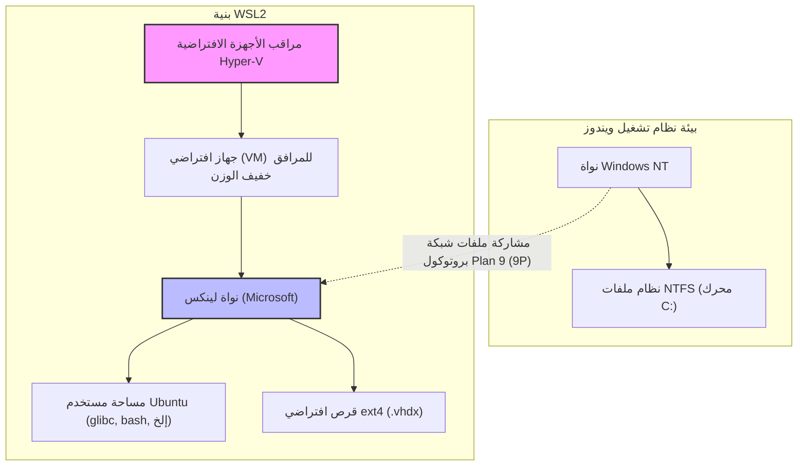
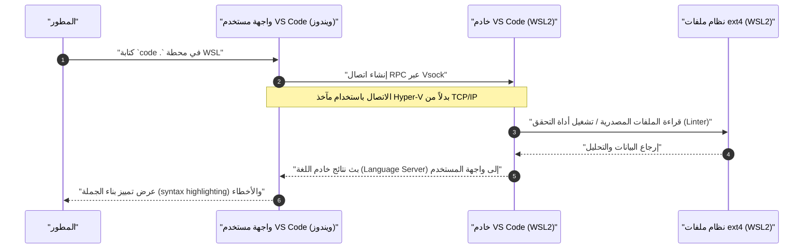

يوفر "WSL2" (نظام ويندوز الفرعي لنظام لينكس 2)، والذي يقدم بيئة تطوير أصلية للينكس على ويندوز، أداة لا غنى عنها في تطوير البرمجيات الحديثة. ومع ذلك، هناك فرق شاسع في الأداء وتجربة التطوير بين الاستمرار في استخدامه في حالته الافتراضية، وبين فهم بنيته المعمارية وإجراء الضبط المناسب.

في هذه المقالة، سنشرح بالتفصيل الشامل (بأكثر من 10,000 حرف) جميع الخطوات اللازمة لبناء "بيئة التطوير المطلوبة (المثالية)" التي يبحث عنها المهندسون المحترفون. بدءًا من شرح البنية المعمارية التي تشكل أساس WSL2، وصولاً إلى الإعدادات اللازمة لاستخراج أقصى أداء، وبناء بيئة طرفية (Terminal) مريحة، والتكامل السلس مع Docker و VS Code، وإعدادات الشبكة المتقدمة.

---

## 1. بنية WSL2 وتطورها عن WSL1

لاستخراج كامل إمكانات WSL2، من المهم أولاً فهم بنيته الداخلية. تختلف المقاربة المستخدمة لتشغيل ثنائيات لينكس على ويندوز بشكل جذري بين الإصدار الأول (WSL1) و WSL2.

### WSL1: طبقة ترجمة استدعاءات النظام (System Calls)
اعتمد WSL1 على آلية تترجم استدعاءات نظام لينكس إلى واجهة برمجة تطبيقات ويندوز (NT API) في الوقت الفعلي (Real-time). وبما أن هذا لم يستخدم جهازًا افتراضيًا (VM)، كان يتمتع بميزة أن العبء على الموارد كان ضئيلًا جدًا. ومع ذلك، كان من الصعب محاكاة استدعاءات النظام المعقدة بشكل كامل، مثل عمليات الإدخال والإخراج (I/O) لنظام الملفات، مما أدى إلى انخفاض مروع في الأداء، خاصة في العمليات التي تتعامل مع عدد كبير من الملفات الصغيرة، مثل `npm install` في Node.js أو عمليات مستودع Git.

### WSL2: جهاز افتراضي (VM) للمرافق خفيف الوزن ونواة لينكس كاملة
في WSL2، تم تجديد البنية المعمارية، وأصبحت نواة لينكس حقيقية، تم بناؤها بواسطة Microsoft، تعمل مباشرة على "جهاز افتراضي للمرافق خفيف الوزن" يستخدم مجموعة فرعية من بنية Hyper-V. هذا يضمن توافقًا بنسبة 100% مع استدعاءات النظام، ومن خلال استخدام قرص افتراضي (VHDX) يستخدم نظام ملفات ext4 الأصلي للينكس، تم تحسين أداء إدخال/إخراج الملفات بشكل كبير مقارنة بـ WSL1.

يوضح مخطط Mermaid التالي الاختلافات الهيكلية بين WSL1 و WSL2.



الدرس المهم المستفاد من هذا الهيكل هو أن **"الوصول إلى الملفات الموجودة على جانب لينكس (داخل VHDX) سريع للغاية، ولكن الوصول إلى الملفات الموجودة على جانب ويندوز (`/mnt/c/`) بطيء جدًا لأنه يمر عبر بروتوكول 9P"**. يجب وضع الشيفرة المصدرية (Source code) للمشروع دائمًا ضمن الدليل الرئيسي (`~`) على جانب WSL.

---

## 2. التحليل الرياضي للأداء: لماذا يعتبر WSL2 سريعًا؟

دعونا نقيم تحسين أداء WSL2 بشكل كمي باستخدام نموذج رياضي. في تطوير البرمجيات، واحدة من أكثر العمليات استهلاكًا للوقت هي تلك التي تتضمن عمليات إدخال/إخراج (I/O) لعدد كبير من الملفات (مثل: تثبيت المكتبات أو البناء).

يتم التعبير عن وقت التنفيذ الإجمالي للعملية $T_{total}$ بمجموع وقت الحوسبة بواسطة وحدة المعالجة المركزية $T_{compute}$ ووقت إدخال/إخراج القرص $T_{io}$.

$$ T_{total} = T_{compute} + T_{io} $$

في حالة WSL1، يتم تكبد عبء لتحويل عمليات جانب لينكس إلى عمليات NTFS، لذلك يتم نمذجة وقت الإدخال/الإخراج على النحو التالي. هنا، $n$ هو عدد عمليات الملفات، و $t_{ntfs\_syscall}$ هو وقت تنفيذ استدعاء النظام على جانب ويندوز، و $t_{trans}$ هو عبء طبقة الترجمة.

$$ T_{wsl1\_io} = \sum_{i=1}^{n} (t_{ntfs\_syscall_i} + t_{trans_i}) $$

من ناحية أخرى، في حالة WSL2، تُصدر النواة (Kernel) عمليات الإدخال/الإخراج مباشرة إلى نظام ملفات ext4، لذلك يكون العبء عبارة عن تأخير طفيف جداً بسبب المحاكاة الافتراضية $t_{virt}$ فقط.

$$ T_{wsl2\_io} = \sum_{i=1}^{n} (t_{ext4_i} + t_{virt_i}) $$

في أنظمة الملفات العامة، بما أن $t_{ext4} \ll t_{ntfs\_syscall} + t_{trans}$، فإنه عندما يكون $n$ كبيرًا جدًا (إجراء عشرات الآلاف إلى مئات الآلاف من عمليات الملفات)، يتسع الفارق في وقت الإدخال/الإخراج بين WSL1 و WSL2 بشكل أُسّي.

بالإضافة إلى ذلك، إذا كانت نسبة عبء حساب وحدة المعالجة المركزية (CPU) في البيئة الافتراضية هي $\rho$، فإن المحاكاة الافتراضية الحديثة المدعومة بالأجهزة (Intel VT-x / AMD-V) ستبقيها عند حوالي $\rho \approx 0.01 \sim 0.03$ (1 إلى 3٪). وبالتالي، حتى في مهام الحساب البحتة، يتم تحقيق أداء بنسبة $97\% \sim 99\%$، وهو ما يمكن مقارنته ببيئة لينكس الأصلية (Native).

---

## 3. التثبيت وبناء الأساس

على أنظمة التشغيل Windows 10/11، أصبح تثبيت WSL2 بسيطًا للغاية. افتح PowerShell بصلاحيات المسؤول وقم بتنفيذ الأمر التالي.

```powershell
# سيتم تثبيت WSL2 و Ubuntu بشكل افتراضي
wsl --install

# لتحديد توزيعة معينة
# يمكن التحقق منها باستخدام wsl --list --online
wsl --install -d Ubuntu-24.04
```

بعد التثبيت وإعادة التشغيل، سيُطلب منك إعداد اسم مستخدم UNIX وكلمة مرور عند بدء التشغيل لأول مرة. هذا المستخدم مستقل عن مستخدم ويندوز ويكون صالحًا فقط داخل WSL.

إذا كنت تستخدم WSL1 بالفعل، فقم بالتحويل إلى WSL2 باستخدام الأوامر التالية.

```powershell
# تحويل توزيعة موجودة إلى WSL2
wsl --set-version Ubuntu 2

# تعيين WSL2 كإصدار افتراضي للتوزيعات التي ستضاف مستقبلاً
wsl --set-default-version 2
```

---

## 4. أسرار التحكم في الموارد: .wslconfig و wsl.conf

أحد أكبر فخاخ WSL2 هو "الاستهلاك غير المحدود للذاكرة (تضخم عملية Vmmem)". نظرًا لأن WSL2 يستخدم ذاكرة التخزين المؤقت للصفحات (Page cache) الخاصة بنواة لينكس، فإنه سيستهلك ذاكرة المضيف (ويندوز) بلا حدود في كل مرة يتم فيها إجراء إدخال/إخراج (I/O). لمنع ذلك، من الضروري تقييد الموارد باستخدام ملفات الإعدادات.

تنقسم ملفات إعدادات WSL2 إلى قسمين: **`.wslconfig` الذي يؤثر على نظام ويندوز بأكمله**، و **`wsl.conf` الذي يؤثر على التوزيعة الفردية من الداخل**.

### 4.1. .wslconfig (جانب ويندوز)

قم بإنشاء ملف في مجلد ملف تعريف مستخدم ويندوز الخاص بك (`C:\Users\<اسم المستخدم>\.wslconfig`) للتحكم في تخصيص الموارد للجهاز الافتراضي (VM).

```ini
# C:\Users\<اسم المستخدم>\.wslconfig
[wsl2]
# أقصى قدر من الذاكرة المخصصة للجهاز الافتراضي. يوصى بنسبة 50% إلى 75% من إجمالي ذاكرة المضيف
memory=16GB

# عدد نوى وحدة المعالجة المركزية (CPU) المراد استخدامها (إذا تم حذفها، يتم استخدام جميع النوى)
processors=8

# حجم ملف التبادل (Swap file)
swap=8GB

# وجهة حفظ ملف التبادل (إذا كنت ترغب في توفير مساحة على محرك الأقراص C)
# swapfile=D:\\wsl\\swap.vhdx

# تمكين إعادة توجيه localhost (للوصول إلى WSL من جانب ويندوز باستخدام localhost)
localhostForwarding=true

# تحرير الذاكرة تلقائيًا (نظام التشغيل Windows 11 فقط)
# يحرر ذاكرة التخزين المؤقت للصفحات ديناميكيًا ويمنع تضخم Vmmem
autoMemoryReclaim=dropcache

[experimental]
# ميزات الشبكات المتقدمة المتاحة في Windows 11 إصدار 22H2 وما بعده
# يتيح هذا دعم IPv6 ومشاركة نفس عنوان IP بين WSL وويندوز
networkingMode=mirrored
dnsTunneling=true
firewall=true
autoProxy=true
```

### 4.2. wsl.conf (جانب لينكس)

قم بتحرير `/etc/wsl.conf` داخل WSL للتحكم في السلوك الخاص بالتوزيعة.

```ini
# /etc/wsl.conf (تم التحرير داخل WSL)
[network]
# تعطيل إنشاء ملف /etc/resolv.conf التلقائي عند بدء تشغيل WSL
# مفيد عندما تريد إعداد DNS خاص بك (مثال: 8.8.8.8)
generateResolvConf=false

# تعيين اسم مضيف (hostname) مخصص
hostname=WSL-DevNode

[automount]
# الإعدادات عند تركيب محركات أقراص ويندوز (Mounting)
enabled=true
options="metadata,uid=1000,gid=1000,umask=022"
# تغيير نقطة تركيب محرك الأقراص C من /mnt/c إلى /c (لتقصير المسار)
root=/

[boot]
# تمكين systemd (في WSL إصدار 0.67.6 وما بعده)
# يتيح هذا لـ snap والبرامج الخفية (daemons) المتنوعة (مثل Docker) العمل محليًا
systemd=true

[user]
# المستخدم الذي سيتم تسجيل الدخول به افتراضيًا
default=kenji
```

لتطبيق هذه الإعدادات، تحتاج إلى تشغيل `wsl --shutdown` في PowerShell لإيقاف تشغيل جهاز WSL الافتراضي بالكامل قبل إعادة تشغيله.

---

## 5. بيئة الطرفية المطلوبة: Zsh + Powerlevel10k

لن تتحسن إنتاجيتك مع بقاء bash الافتراضي. سنقوم ببناء أقوى موجه أوامر (Prompt) من خلال الجمع بين Zsh، الذي يتميز بوظائف إكمال قوية وإمكانيات رؤية واضحة، مع السمة (Theme) فائقة السرعة "Powerlevel10k".

### 5.1. تثبيت وإعداد Windows Terminal
قم بتثبيت "Windows Terminal" من متجر Microsoft. افتح إعدادات JSON (`settings.json`)، واضبط ملف التعريف (Profile) الافتراضي على WSL (Ubuntu)، وقم بتغيير الخط إلى خط Nerd مخصص للتطوير (مثال: `HackGen Console NF` أو `MesloLGS NF`).

### 5.2. تثبيت Zsh و Oh My Zsh
قم بتنفيذ الأوامر التالية في محطة طرفية لـ WSL.

```bash
# تحديث الحزم وتثبيت Zsh
sudo apt update && sudo apt upgrade -y
sudo apt install -y zsh git curl

# تنفيذ برنامج نصي (Script) لتثبيت Oh My Zsh
sh -c "$(curl -fsSL https://raw.githubusercontent.com/ohmyzsh/ohmyzsh/master/tools/install.sh)"
```

### 5.3. تقديم Powerlevel10k والإضافات (Plugins)
قم بتثبيت الإضافات لتعزيز Zsh (تسليط الضوء على بناء الجملة والإكمال التلقائي للإدخال) وسمة Powerlevel10k.

```bash
# Powerlevel10k
git clone --depth=1 https://github.com/romkatv/powerlevel10k.git ${ZSH_CUSTOM:-$HOME/.oh-my-zsh/custom}/themes/powerlevel10k

# zsh-autosuggestions
git clone https://github.com/zsh-users/zsh-autosuggestions ${ZSH_CUSTOM:-~/.oh-my-zsh/custom}/plugins/zsh-autosuggestions

# zsh-syntax-highlighting
git clone https://github.com/zsh-users/zsh-syntax-highlighting.git ${ZSH_CUSTOM:-~/.oh-my-zsh/custom}/plugins/zsh-syntax-highlighting
```

قم بتحرير `~/.zshrc` وتمكين السمة والإضافات.

```bash
# التغييرات في ~/.zshrc
ZSH_THEME="powerlevel10k/powerlevel10k"

# أضفه إلى مصفوفة الإضافات (plugins)
plugins=(git zsh-autosuggestions zsh-syntax-highlighting)
```

عندما تقوم بالحفظ وتشغيل `source ~/.zshrc`، سيبدأ معالج إعداد Powerlevel10k (`p10k configure`). اتبع التعليمات التي تظهر على الشاشة لتخصيص موجه الأوامر (Prompt) حسب رغبتك (نمط الموجه، وجود الرموز من عدمها، المعلومات التي سيتم عرضها، إلخ). سيتم عرض أسماء فروع Git وحالتها، وإصدار Node.js، ووقت تنفيذ الأوامر، وما إلى ذلك في الوقت الفعلي، مما يؤدي إلى زيادة كفاءة التطوير بشكل كبير.

---

## 6. VS Code Remote - تكامل سلس مع WSL

عند التطوير في WSL2، توفر إضافة "Remote - WSL" آلية للوصول السلس إلى الملفات داخل WSL من بيئة التطوير المتكاملة (Visual Studio Code) المثبتة على جانب ويندوز.

### شرح البنية المعمارية

يوضح مخطط التسلسل (Sequence diagram) التالي كيف يتصل VS Code مع WSL2.



يعمل VS Code على جانب ويندوز كمجرد "عميل خفيف (واجهة مستخدم)"، وتتم معالجة جميع المهام الثقيلة مثل خادم اللغة (Language Server)، والمصحح (Debugger)، وتنفيذ المحطة الطرفية بواسطة "خادم VS Code" على جانب WSL. يتيح لك ذلك الحفاظ على نظافة البيئة الخاصة بك من خلال استخدام جانب WSL فقط، دون تثبيت Node.js أو Python على جانب ويندوز.

### إعدادات VS Code الأساسية
من "الإضافات" (Extensions) في VS Code، قم بتثبيت **"WSL" (ms-vscode-remote.remote-wsl)**. بعد ذلك، ببساطة انتقل إلى دليل المشروع في محطة WSL وقم بتنفيذ `code .`، وسيتم تشغيل VS Code على جانب ويندوز مع فتح ذلك الدليل.

**ملاحظة هامة (مشكلة رمز نهاية السطر (Line Ending)):**
رموز نهاية السطر تختلف بين ويندوز ولينكس (ويندوز يستخدم `CRLF`، ولينكس يستخدم `LF`). عند التطوير على WSL، تأكد من توحيد إعداد `core.autocrlf` في Git وإعداد الملف الافتراضي في VS Code إلى `LF`. سيؤدي الفشل في القيام بذلك إلى التسبب في أخطاء غامضة عند تشغيل نصوص الصدفة (Shell scripts) أو حاويات Docker.

```bash
# إعداد رمز نهاية السطر (Line Ending) لـ Git في WSL
git config --global core.autocrlf input
```

أضف الإعدادات التالية إلى `settings.json` الخاص بـ VS Code (الإعدادات عن بُعد).

```json
{
    "files.eol": "\n",
    "terminal.integrated.defaultProfile.linux": "zsh"
}
```

---

## 7. تحسين Docker Desktop وتكامله مع WSL2

هناك طريقتان رئيسيتان لاستخدام Docker في بيئة WSL2.

1. تثبيت **Docker Desktop لنظام ويندوز** وتمكين ميزة تكامل WSL2.
2. تثبيت **محرك Docker الأصلي (Docker Engine)** مباشرة داخل WSL2 (مثل Ubuntu).

### النهج 1: Docker Desktop (موصى به)
يُوصى بهذا النهج غالبًا لأنه يسهل الإدارة عبر واجهة المستخدم الرسومية (GUI) والوصول الشفاف إلى الحاويات (Containers) بين ويندوز و WSL. تحقق من التالي في إعدادات Docker Desktop (Settings).

- في `General` -> ضع علامة اختيار على `Use the WSL 2 based engine`.
- في `Resources` -> `WSL Integration` -> ضع علامة اختيار على `Enable integration with my default WSL distro`، وقم بتشغيل مفتاح التبديل للتوزيعة التي تستخدمها (Ubuntu).

يسمح لك ذلك بتنفيذ أوامر `docker` مباشرة من محطة WSL2، ويتم الاتصال ببرنامج Docker الخفي (Daemon) من خلال أجهزة افتراضية خفيفة الوزن مخصصة يديرها Docker Desktop (`docker-desktop` و `docker-desktop-data`).

### النهج 2: التثبيت المباشر لمحرك Docker الأصلي (Native Docker Engine)
إذا كان هناك قيود على شبكة الشركة (مثل تجنب الإصدار المدفوع من Docker Desktop) أو كنت ترغب في تقليل عبء الأداء إلى أدنى حد ممكن، فقم بتمكين `systemd` في `/etc/wsl.conf` وقم بتثبيت Docker كخادم Ubuntu نقي.

```bash
# مقتطف من خطوات التثبيت الرسمية لـ Docker في WSL2 Ubuntu مع تفعيل systemd
sudo apt-get update
sudo apt-get install ca-certificates curl gnupg
sudo install -m 0755 -d /etc/apt/keyrings
curl -fsSL https://download.docker.com/linux/ubuntu/gpg | sudo gpg --dearmor -o /etc/apt/keyrings/docker.gpg
sudo chmod a+r /etc/apt/keyrings/docker.gpg

# إضافة المستودع (Repository)
echo \
  "deb [arch="$(dpkg --print-architecture)" signed-by=/etc/apt/keyrings/docker.gpg] https://download.docker.com/linux/ubuntu \
  "$(. /etc/os-release && echo "$VERSION_CODENAME")" stable" | \
  sudo tee /etc/apt/sources.list.d/docker.list > /dev/null

sudo apt-get update
sudo apt-get install docker-ce docker-ce-cli containerd.io docker-buildx-plugin docker-compose-plugin

# إضافة المستخدم الحالي إلى مجموعة docker (للتشغيل بدون sudo)
sudo usermod -aG docker $USER
```

بعد إعادة التشغيل، سيعمل `systemctl start docker` تمامًا كما هو الحال في بيئة لينكس الأصلية، مما يوفر أداءً عاليًا.

---

## 8. تكامل مفاتيح SSH: المصادقة السلسة بين ويندوز و WSL

تعد إدارة مفاتيح SSH المنفصلة على ويندوز و WSL لاستنساخ Git (Git clone) عبر SSH أو الاتصال بخوادم عن بُعد عبر SSH مهمة شاقة جدًا. لتحقيق التوازن بين الأمان والراحة، سنقوم بإعداد جسر (Bridge) لوكيل SSH (SSH Agent) الذي يعمل على جانب ويندوز (أو مدير كلمات مرور مثل 1Password) إلى جانب WSL.

هنا، سنشرح الطريقة الأكثر أمانًا وحداثة باستخدام **ميزة وكيل SSH في 1Password** أو **وكيل مصادقة OpenSSH في ويندوز (OpenSSH Authentication Agent)**، وإعادة توجيهها إلى مقبس نطاق UNIX (UNIX domain socket) الخاص بـ WSL2 باستخدام `npiperelay` أو `socat`.

### إعادة توجيه المقبس (Socket Forwarding) لوكيل ssh-agent

عادة، يجب تحويل وكيل SSH المقدم كأنبوب مسمى (Named Pipe) في ويندوز إلى ملف مقبس (Socket file) على جانب WSL. من السهل استخدام `wsl-ssh-agent` أو الميزات المقدمة من 1Password.

من شاشة إعدادات 1Password، قم بتمكين "Developer" (المطور) -> "Use SSH agent" (استخدام وكيل SSH).
بعد ذلك، أضف الإعدادات التالية إلى `~/.zshrc` أو `~/.bashrc` على جانب WSL لربط المقبس (Socket bind) تلقائيًا عند تسجيل الدخول.

```bash
# إضافة إلى ~/.zshrc (مثال عند استخدام وكيل SSH الخاص بـ 1Password)
export SSH_AUTH_SOCK=$HOME/.ssh/agent.sock
# إذا لم يكن المقبس موجودًا عند بدء تشغيل WSL، أو إذا لم تكن العملية مرتبطة (bind)، فاستخدم socat و npiperelay لإعادة التوجيه (forward)
ALREADY_RUNNING=$(ps -aux | grep "[n]piperelay.exe -ei -s //./pipe/openssh-ssh-agent" | wc -l)
if [ $ALREADY_RUNNING -eq 0 ]; then
    if [ -S $SSH_AUTH_SOCK ]; then
        rm $SSH_AUTH_SOCK
    fi
    # تشغيل socat في الخلفية وتوصيل الأنبوب المسمى (Named Pipe) لجانب ويندوز بمقبس UNIX لجانب WSL
    (setsid socat UNIX-LISTEN:$SSH_AUTH_SOCK,fork EXEC:"npiperelay.exe -ei -s //./pipe/openssh-ssh-agent",nofork &) >/dev/null 2>&1
fi
```
※يتطلب هذا تثبيت `npiperelay.exe` وإضافته إلى المسار (Path) على جانب ويندوز مسبقًا.

بمجرد اكتمال هذا الإعداد، عند تشغيل `ssh-add -l` من محطة WSL، سيتم عرض قائمة بالمفاتيح العامة (Public keys) المسجلة في 1Password أو على جانب ويندوز. يتيح لك هذا اجتياز المصادقة بأمان دون الحاجة إلى نسخ ملفات المفاتيح الخاصة (Private keys) إلى WSL.

---

## 9. الصيانة: تحسين (ضغط) ملفات VHDX المتضخمة

أحد أكبر عيوب WSL2 هو أن "حجم ملف القرص الافتراضي على جانب ويندوز (.vhdx) لا يتقلص تلقائيًا حتى لو قمت بحذف صور Docker أو الملفات". إذا واصلت التطوير لفترة طويلة، سيتضخم ملف ext4.vhdx إلى عشرات أو مئات الجيجابايت.

لتحرير مساحة على القرص، يجب عليك تحسين (Compact) ملف VHDX من جانب ويندوز بانتظام.

1. أولاً، قم بإيقاف تشغيل WSL بالكامل.
   ```powershell
   wsl --shutdown
   ```
2. افتح PowerShell بصلاحيات المسؤول، وقم بتنفيذ أمر `diskpart` أدناه، أو أمر `Optimize-VHD` من وحدة Hyper-V (يمكن استخدام الأخير فقط إذا تم تمكين Hyper-V).

```powershell
# إذا كانت وحدة Hyper-V متاحة
Optimize-VHD -Path "$env:LOCALAPPDATA\Packages\CanonicalGroupLimited.Ubuntu_79rhkp1fndgsc\LocalState\ext4.vhdx" -Mode Full

# في حالة استخدام diskpart
diskpart
# أدخل بشكل تفاعلي داخل الموجه التالي
DISKPART> select vdisk file="C:\Users\<اسم المستخدم>\AppData\Local\Packages\CanonicalGroupLimited.Ubuntu_79rhkp1fndgsc\LocalState\ext4.vhdx"
DISKPART> attach vdisk readonly
DISKPART> compact vdisk
DISKPART> detach vdisk
DISKPART> exit
```

من خلال إجراء هذه العملية بانتظام، يمكنك استعادة المساحة المستهلكة بلا داعٍ على محرك الأقراص C.

---

## 10. خاتمة

لقد تجاوز WSL2 تمامًا إطار كونه مجرد "لينكس إضافي يعمل على ويندوز"، وتطور ليصبح منصة تطوير قوية لا تقل أهمية عن نظام MacOS أو أجهزة لينكس الأصلية (Native)، بل وربما تتفوق عليها.

من خلال تطبيق جميع الإعدادات الموضحة في هذا الدليل (تحسين الموارد باستخدام `.wslconfig`، وتحسين المحطة الطرفية (Terminal) باستخدام Zsh + Powerlevel10k، والوصول الشفاف باستخدام VS Code Remote، بالإضافة إلى دمج SSH وصيانة VHDX)، ستحصل على "بيئة تطوير مطلوبة" خالية من التوتر، سريعة، وآمنة.

على الرغم من أن إعداد البيئة يتطلب بعض الجهد، بمجرد الانتهاء من ضبط الإعدادات، ليس هناك شك في أن إنتاجيتك الهندسية ستتحسن بشكل كبير في المستقبل. لا تتردد في استكشاف المزيد من التخصيصات بناءً على هذا الدليل لتناسب مشاريعك وتفضيلاتك الخاصة.
