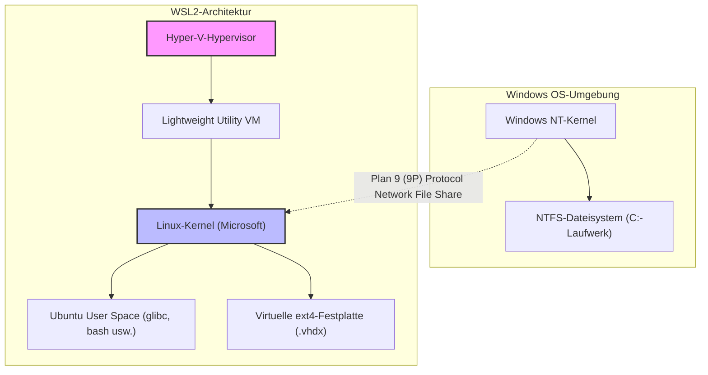
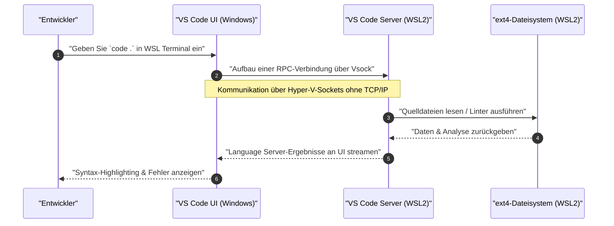

„WSL2 (Windows Subsystem for Linux 2)“, das eine native Linux-Entwicklungsumgebung unter Windows bietet, ist zu einem unverzichtbaren Werkzeug in der modernen Softwareentwicklung geworden. Es gibt jedoch einen himmelweiten Unterschied in Leistung und Entwicklungserfahrung zwischen der weiteren Nutzung im Standardzustand und dem Verständnis der Architektur zur entsprechenden Optimierung.

Dieser Artikel beginnt mit einer Erklärung der Architektur, die das Fundament von WSL2 bildet. Er behandelt ausführlich alle Schritte zum Aufbau der „ultimativen Entwicklungsumgebung“, die professionelle Ingenieure verlangen, einschließlich Konfigurationen zur Maximierung der Leistung, Aufbau einer komfortablen Terminalumgebung, nahtlose Integration mit Docker und VS Code sowie erweiterte Netzwerkeinstellungen, mit einem Umfang von über 10.000 Zeichen.

---

## 1. WSL2-Architektur und die Evolution von WSL1

Um das Potenzial von WSL2 voll auszuschöpfen, ist es wichtig, zuerst seine interne Struktur zu verstehen. Das erste WSL (WSL1) und WSL2 unterscheiden sich grundlegend in ihrem Ansatz, Linux-Binärdateien unter Windows auszuführen.

### WSL1: Systemcall-Übersetzungsebene
WSL1 verwendete einen Mechanismus zur Übersetzung von Linux-Systemaufrufen in Windows-NT-APIs in Echtzeit. Dies hatte den Vorteil eines sehr geringen Ressourcen-Overheads, da keine virtuelle Maschine (VM) verwendet wurde. Es war jedoch schwierig, komplexe Systemaufrufe wie Dateisystem-I/O-Operationen vollständig zu emulieren. Dies führte zu einer katastrophalen Leistungseinbuße, insbesondere bei der Verarbeitung einer großen Anzahl kleiner Dateien, wie z.B. `npm install` von Node.js oder Git-Repository-Operationen.

### WSL2: Lightweight Utility VM und vollständiger Linux-Kernel
Bei WSL2 wurde die Architektur erneuert, und ein von Microsoft erstellter echter Linux-Kernel läuft jetzt direkt auf einer **„Lightweight Utility VM“, die eine Teilmenge der Hyper-V-Architektur nutzt**. Dies garantiert 100%ige Kompatibilität von Systemaufrufen, und durch die Verwendung einer virtuellen Festplatte (VHDX) mit dem nativen Linux-Dateisystem ext4 hat sich die Datei-I/O-Leistung im Vergleich zu WSL1 dramatisch verbessert.

Das folgende Mermaid-Diagramm zeigt die strukturellen Unterschiede zwischen WSL1 und WSL2.



Die wichtigste Lektion aus dieser Struktur ist: **„Der Zugriff auf Dateien auf der Linux-Seite (innerhalb von VHDX) ist extrem schnell, aber der Zugriff auf Dateien auf der Windows-Seite (`/mnt/c/`) ist sehr langsam, da er über das 9P-Protokoll erfolgt.“** Der Quellcode für Ihre Projekte muss unter dem Home-Verzeichnis (`~`) auf der WSL-Seite abgelegt werden.

---

## 2. Mathematische Leistungsanalyse: Warum ist WSL2 schnell?

Lassen Sie uns die Leistungssteigerung von WSL2 mithilfe eines mathematischen Modells quantitativ bewerten. Eine der zeitaufwändigsten Operationen in der Softwareentwicklung ist die Verarbeitung, die mit einer großen Menge an Datei-I/O einhergeht (z.B. Bibliotheksinstallation und Build).

Die Gesamtausführungszeit $T_{total}$ eines bestimmten Prozesses wird durch die Summe der CPU-Berechnungszeit $T_{compute}$ und der Festplatten-I/O-Zeit $T_{io}$ ausgedrückt.

$$ T_{total} = T_{compute} + T_{io} $$

Im Fall von WSL1, da ein Overhead für die Konvertierung von Operationen auf der Linux-Seite in NTFS-Operationen entsteht, wird die I/O-Zeit wie folgt modelliert. Hierbei ist $n$ die Anzahl der Dateioperationen, $t_{ntfs\_syscall}$ die Ausführungszeit des Systemaufrufs auf der Windows-Seite und $t_{trans}$ der Overhead der Übersetzungsebene.

$$ T_{wsl1\_io} = \sum_{i=1}^{n} (t_{ntfs\_syscall_i} + t_{trans_i}) $$

Im Fall von WSL2, da der Kernel direkt I/O an das ext4-Dateisystem ausgibt, besteht der Overhead nur aus der sehr geringen Verzögerung $t_{virt}$ durch die Virtualisierung.

$$ T_{wsl2\_io} = \sum_{i=1}^{n} (t_{ext4_i} + t_{virt_i}) $$

In allgemeinen Dateisystemen ist $t_{ext4} \ll t_{ntfs\_syscall} + t_{trans}$. Wenn also $n$ sehr groß ist (Zehntausende bis Hunderttausende von Dateioperationen durchführen), vergrößert sich der Unterschied in der I/O-Zeit zwischen WSL1 und WSL2 exponentiell.

Wenn wir außerdem das Overhead-Verhältnis der CPU-Berechnung in einer virtualisierten Umgebung mit $\rho$ ansetzen, bleibt es bei der neuesten hardwareunterstützten Virtualisierung (Intel VT-x / AMD-V) bei etwa $\rho \approx 0.01 \sim 0.03$ (1-3%). Daher wird selbst bei reinen Rechenaufgaben eine Leistung von $97\% \sim 99\%$ erreicht, was der einer nativen Linux-Umgebung in nichts nachsteht.

---

## 3. Installation und Aufbau der Grundlagen

Unter Windows 10/11 ist die Installation von WSL2 sehr einfach geworden. Öffnen Sie einfach PowerShell mit Administratorrechten und führen Sie den folgenden Befehl aus.

```powershell
# WSL2 und Ubuntu werden standardmäßig installiert
wsl --install

# Wenn Sie eine bestimmte Distribution angeben
# Kann mit wsl --list --online überprüft werden
wsl --install -d Ubuntu-24.04
```

Nach der Installation und einem Neustart werden Sie beim ersten Start aufgefordert, einen UNIX-Benutzernamen und ein Passwort festzulegen. Dieser Benutzer ist unabhängig von Ihrem Windows-Benutzer und nur innerhalb von WSL gültig.

Wenn Sie bereits WSL1 verwenden, können Sie es mit den folgenden Befehlen in WSL2 konvertieren.

```powershell
# Konvertieren Sie die vorhandene Distribution in WSL2
wsl --set-version Ubuntu 2

# Machen Sie WSL2 zur Standardversion für zukünftige Distributionen
wsl --set-default-version 2
```

---

## 4. Das Geheimnis der Ressourcenkontrolle: .wslconfig und wsl.conf

Eine der größten Fallen von WSL2 ist der „unbegrenzte Speicherverbrauch (Aufblähen des Vmmem-Prozesses)“. Da WSL2 den Page Cache des Linux-Kernels verwendet, verbraucht es bei jedem I/O unendlich viel Host-Speicher (Windows). Um dies zu verhindern, ist es zwingend erforderlich, Ressourcen über Konfigurationsdateien zu begrenzen.

Es gibt zwei WSL2-Konfigurationsdateien: **`.wslconfig`, die das gesamte Windows betrifft**, und **`wsl.conf`, die das Innere jeder Distribution betrifft**.

### 4.1. .wslconfig (Windows-Seite)

Erstellen Sie eine Datei im Windows-Benutzerprofilverzeichnis (`C:\Users\<Benutzername>\.wslconfig`), um die Ressourcenzuweisung an die VM zu steuern.

```ini
# C:\Users\<Benutzername>\.wslconfig
[wsl2]
# Maximale Speichermenge, die der VM zugewiesen werden soll. Es werden etwa 50% bis 75% des gesamten Host-Speichers empfohlen
memory=16GB

# Anzahl der zu verwendenden CPU-Kerne (alle Kerne werden verwendet, wenn weggelassen)
processors=8

# Größe der Auslagerungsdatei
swap=8GB

# Speicherort der Auslagerungsdatei (wenn Sie Speicherplatz auf dem Laufwerk C sparen möchten)
# swapfile=D:\\wsl\\swap.vhdx

# Aktivieren Sie das Localhost-Forwarding (um auf WSL von der Windows-Seite über localhost zuzugreifen)
localhostForwarding=true

# Speicher automatisch freigeben (nur Windows 11)
# Gibt den Page Cache dynamisch frei und verhindert ein Aufblähen von Vmmem
autoMemoryReclaim=dropcache

[experimental]
# Erweiterte Netzwerkfunktionen für Windows 11 22H2 und neuer
# Dies ermöglicht IPv6-Unterstützung und die gemeinsame Nutzung derselben IP-Adresse zwischen WSL und Windows
networkingMode=mirrored
dnsTunneling=true
firewall=true
autoProxy=true
```

### 4.2. wsl.conf (Linux-Seite)

Bearbeiten Sie `/etc/wsl.conf` in WSL, um das distributionsspezifische Verhalten zu steuern.

```ini
# /etc/wsl.conf (In WSL bearbeitet)
[network]
# Deaktivieren Sie die Generierung von /etc/resolv.conf, das beim Start von WSL automatisch generiert wird
# Nützlich, wenn Sie ein eigenes DNS einrichten möchten (z. B. 8.8.8.8)
generateResolvConf=false

# Festlegen eines eigenen Hostnamens
hostname=WSL-DevNode

[automount]
# Einstellungen beim Mounten von Windows-Laufwerken
enabled=true
options="metadata,uid=1000,gid=1000,umask=022"
# Ändern Sie den Mount-Punkt des Laufwerks C von /mnt/c auf /c (verkürzt den Pfad)
root=/

[boot]
# systemd aktivieren (WSL 0.67.6 und neuer)
# Dadurch können snap und verschiedene Daemons (wie Docker) nativ ausgeführt werden
systemd=true

[user]
# Standardmäßig angemeldeter Benutzer
default=kenji
```

Um diese Einstellungen anzuwenden, müssen Sie `wsl --shutdown` in PowerShell ausführen, um die WSL-VM vollständig zu stoppen, und sie dann neu starten.

---

## 5. Die ultimative Terminal-Umgebung: Zsh + Powerlevel10k

Mit der Standard-Bash allein steigt Ihre Produktivität nicht. Durch die Kombination von Zsh, das sich durch leistungsstarke Vervollständigung und Sichtbarkeit auszeichnet, mit dem ultraschnellen Thema „Powerlevel10k“, bauen wir die stärkste Eingabeaufforderung.

### 5.1. Installation und Konfiguration von Windows Terminal
Installieren Sie „Windows Terminal“ aus dem Microsoft Store. Öffnen Sie die JSON-Einstellungen (`settings.json`), legen Sie das Standardprofil auf WSL (Ubuntu) fest und ändern Sie die Schriftart in einen Nerd Font für die Entwicklung (z.B. `HackGen Console NF` oder `MesloLGS NF`).

### 5.2. Zsh und Oh My Zsh installieren
Führen Sie die folgenden Befehle im WSL-Terminal aus.

```bash
# Pakete aktualisieren und Zsh installieren
sudo apt update && sudo apt upgrade -y
sudo apt install -y zsh git curl

# Führen Sie das Installationsskript für Oh My Zsh aus
sh -c "$(curl -fsSL https://raw.githubusercontent.com/ohmyzsh/ohmyzsh/master/tools/install.sh)"
```

### 5.3. Einführung von Powerlevel10k und Plugins
Wir werden Plugins (Syntax-Hervorhebung und Eingabevervollständigung) und das Powerlevel10k-Thema einführen, um Zsh weiter zu verbessern.

```bash
# Powerlevel10k
git clone --depth=1 https://github.com/romkatv/powerlevel10k.git ${ZSH_CUSTOM:-$HOME/.oh-my-zsh/custom}/themes/powerlevel10k

# zsh-autosuggestions
git clone https://github.com/zsh-users/zsh-autosuggestions ${ZSH_CUSTOM:-~/.oh-my-zsh/custom}/plugins/zsh-autosuggestions

# zsh-syntax-highlighting
git clone https://github.com/zsh-users/zsh-syntax-highlighting.git ${ZSH_CUSTOM:-~/.oh-my-zsh/custom}/plugins/zsh-syntax-highlighting
```

Bearbeiten Sie `~/.zshrc`, um das Thema und die Plugins zu aktivieren.

```bash
# Änderungen an ~/.zshrc
ZSH_THEME="powerlevel10k/powerlevel10k"

# Zum Plugin-Array hinzufügen
plugins=(git zsh-autosuggestions zsh-syntax-highlighting)
```

Wenn Sie es speichern und `source ~/.zshrc` ausführen, wird der Powerlevel10k-Konfigurationsassistent (`p10k configure`) gestartet. Folgen Sie den Anweisungen auf dem Bildschirm, um Ihre bevorzugte Eingabeaufforderung (Eingabeaufforderungsstil, ob Symbole vorhanden sind, anzuzeigende Informationen usw.) anzupassen. Der Git-Zweigname und -Status, die Node.js-Version, die Ausführungszeit von Befehlen usw. werden in Echtzeit angezeigt, wodurch die Entwicklungseffizienz drastisch verbessert wird.

---

## 6. VS Code Remote - Nahtlose Integration mit WSL

Für die Entwicklung auf WSL2 gibt es eine „Remote - WSL“-Erweiterung, die Ihnen den nahtlosen Zugriff auf Dateien innerhalb von WSL von der auf der Windows-Seite installierten IDE (Visual Studio Code) ermöglicht.

### Erklärung der Architektur

Das folgende Sequenzdiagramm zeigt, wie VS Code mit WSL2 kommuniziert.



Der VS Code auf der Windows-Seite fungiert als reiner „Thin Client (UI)“, und rechenintensive Aufgaben wie der Language Server, der Debugger und die Terminal-Ausführung werden alle vom „VS Code Server“ auf der WSL-Seite erledigt. Auf diese Weise können Sie die Umgebung auf der WSL-Seite sauber halten, ohne Node.js oder Python auf der Windows-Seite zu installieren.

### Wesentliche VS Code-Einstellungen
Installieren Sie **"WSL" (ms-vscode-remote.remote-wsl)** aus den "Erweiterungen" von VS Code. Navigieren Sie dann im WSL-Terminal zum Projektverzeichnis und führen Sie einfach `code .` aus, um den VS Code auf der Windows-Seite mit dem geöffneten Verzeichnis zu starten.

**Wichtiger Hinweis (Problem mit dem Zeilenumbruchcode):**
Windows und Linux haben unterschiedliche Zeilenumbruchcodes (Windows verwendet `CRLF`, Linux verwendet `LF`). Bei der Entwicklung in WSL stellen Sie bitte sicher, dass die Git-Einstellung `core.autocrlf` und die Standarddateieinstellungen von VS Code auf `LF` vereinheitlicht werden. Wenn Sie dies versäumen, werden Sie von mysteriösen Fehlern bei der Ausführung von Shell-Skripten oder Docker-Containern geplagt.

```bash
# Git-Zeilenumbruchcode-Einstellung auf der WSL-Seite
git config --global core.autocrlf input
```

Fügen Sie der `settings.json` (Remote-Einstellung) von VS Code auch Folgendes hinzu:

```json
{
    "files.eol": "\n",
    "terminal.integrated.defaultProfile.linux": "zsh"
}
```

---

## 7. Optimierung von Docker Desktop und WSL2 Integration

Es gibt hauptsächlich zwei Ansätze zur Verwendung von Docker in einer WSL2-Umgebung.

1. Installieren Sie **Docker Desktop für Windows** und aktivieren Sie die WSL2-Integrationsfunktion
2. Installieren Sie die **native Docker Engine** direkt innerhalb von WSL2 (z. B. Ubuntu)

### Ansatz 1: Docker Desktop (Empfohlen)
Dies wird in den meisten Fällen empfohlen, da es ein einfaches Management mit einer GUI und einen transparenten Zugriff auf Container zwischen Windows und WSL ermöglicht. Überprüfen Sie Folgendes in den Einstellungen von Docker Desktop (Settings).

- Aktivieren Sie `General` -> `Use the WSL 2 based engine`.
- Aktivieren Sie `Resources` -> `WSL Integration` -> `Enable integration with my default WSL distro` und aktivieren Sie die zu verwendende Distribution (Ubuntu) mit der Umschaltfläche.

Dies ermöglicht es Ihnen, den `docker`-Befehl direkt aus dem WSL2-Terminal auszuführen, und die Kommunikation mit dem Docker-Daemon erfolgt über dedizierte Lightweight-VMs (`docker-desktop` und `docker-desktop-data`), die von Docker Desktop verwaltet werden.

### Ansatz 2: Direkte Installation der nativen Docker Engine
Wenn Sie Unternehmensnetzwerkeinschränkungen haben (z. B. um die Kosten für Docker Desktop zu vermeiden) oder den Leistungs-Overhead so weit wie möglich reduzieren möchten, aktivieren Sie `systemd` in `/etc/wsl.conf` und installieren Sie Docker als reinen Ubuntu-Server.

```bash
# Auszug aus dem offiziellen Docker-Installationsverfahren auf WSL2 Ubuntu mit aktiviertem systemd
sudo apt-get update
sudo apt-get install ca-certificates curl gnupg
sudo install -m 0755 -d /etc/apt/keyrings
curl -fsSL https://download.docker.com/linux/ubuntu/gpg | sudo gpg --dearmor -o /etc/apt/keyrings/docker.gpg
sudo chmod a+r /etc/apt/keyrings/docker.gpg

# Repository hinzufügen
echo \
  "deb [arch="$(dpkg --print-architecture)" signed-by=/etc/apt/keyrings/docker.gpg] https://download.docker.com/linux/ubuntu \
  "$(. /etc/os-release && echo "$VERSION_CODENAME")" stable" | \
  sudo tee /etc/apt/sources.list.d/docker.list > /dev/null

sudo apt-get update
sudo apt-get install docker-ce docker-ce-cli containerd.io docker-buildx-plugin docker-compose-plugin

# Fügen Sie den aktuellen Benutzer zur docker-Gruppe hinzu (um ohne sudo auszuführen)
sudo usermod -aG docker $USER
```

Nach dem Neustart funktioniert `systemctl start docker` genau wie in einer nativen Linux-Umgebung und bietet hohe Leistung.

---

## 8. Integration von SSH-Schlüsseln: Nahtlose Authentifizierung in Windows und WSL

Bei der Durchführung von SSH-Klonen in Git oder Verbindungen zu Remote-Servern über SSH ist es sehr mühsam, separate SSH-Schlüssel auf der Windows- und der WSL-Seite zu verwalten. Um Sicherheit und Komfort in Einklang zu bringen, richten wir eine Brücke vom auf der Windows-Seite laufenden SSH-Agenten (oder einem Passwort-Manager wie 1Password) zur WSL-Seite ein.

Hier erklären wir die sicherste und modernste Methode, den **SSH-Agenten von 1Password** oder den **OpenSSH Authentication Agent von Windows** zu verwenden und ihn mithilfe von `npiperelay` oder `socat` an den UNIX-Domain-Socket von WSL2 weiterzuleiten.

### ssh-agent Socket-Weiterleitung

Normalerweise muss der als Named Pipe (benannte Pipe) in Windows bereitgestellte SSH-Agent in eine Socket-Datei auf der WSL-Seite konvertiert werden. Dies lässt sich mithilfe von `wsl-ssh-agent` oder Funktionen von 1Password leicht erreichen.

Aktivieren Sie im Einstellungsbildschirm von 1Password "Entwickler" -> "SSH-Agenten verwenden".
Fügen Sie als Nächstes die folgenden Einstellungen zur `~/.zshrc` oder `~/.bashrc` auf der WSL-Seite hinzu, um den Socket bei der Anmeldung automatisch zu binden.

```bash
# Zu ~/.zshrc hinzufügen (Beispiel für die Verwendung des 1Password SSH Agent)
export SSH_AUTH_SOCK=$HOME/.ssh/agent.sock
# Wenn der Socket beim Start von WSL nicht existiert oder der Prozess nicht gebunden ist, mit socat und npiperelay weiterleiten
ALREADY_RUNNING=$(ps -aux | grep "[n]piperelay.exe -ei -s //./pipe/openssh-ssh-agent" | wc -l)
if [ $ALREADY_RUNNING -eq 0 ]; then
    if [ -S $SSH_AUTH_SOCK ]; then
        rm $SSH_AUTH_SOCK
    fi
    # Starten Sie socat im Hintergrund und verbinden Sie die Named Pipe auf der Windows-Seite mit dem UNIX-Socket auf der WSL-Seite
    (setsid socat UNIX-LISTEN:$SSH_AUTH_SOCK,fork EXEC:"npiperelay.exe -ei -s //./pipe/openssh-ssh-agent",nofork &) >/dev/null 2>&1
fi
```
*Vorab müssen Sie `npiperelay.exe` auf der Windows-Seite installieren und den Pfad konfigurieren.

Nach Abschluss dieser Konfiguration wird bei Ausführung von `ssh-add -l` aus dem WSL-Terminal eine Liste der öffentlichen Schlüssel von SSH-Schlüsseln angezeigt, die in 1Password oder auf der Windows-Seite registriert sind. Auf diese Weise können Sie sich sicher authentifizieren, ohne die private Schlüsseldatei nach WSL kopieren zu müssen.

---

## 9. Wartung: Optimierung (Komprimierung) von aufgeblähten VHDX

Einer der größten Nachteile von WSL2 ist die Tatsache, dass die Dateigröße der virtuellen Festplatte (.vhdx) auf der Windows-Seite nicht automatisch reduziert wird, selbst wenn Sie Docker-Images oder Dateien löschen. Wenn Sie lange Zeit weiterentwickeln, bläht sich die Datei ext4.vhdx auf Dutzende bis Hunderte von GB auf.

Um Speicherplatz freizugeben, müssen Sie VHDX regelmäßig von der Windows-Seite aus optimieren (komprimieren).

1. Schalten Sie zunächst WSL vollständig aus.
   ```powershell
   wsl --shutdown
   ```
2. Öffnen Sie PowerShell mit Administratorrechten und führen Sie den folgenden Befehl `diskpart` oder den Befehl `Optimize-VHD` des Hyper-V-Moduls aus (letzteres kann nur verwendet werden, wenn Hyper-V aktiviert ist).

```powershell
# Wenn das Hyper-V-Modul verfügbar ist
Optimize-VHD -Path "$env:LOCALAPPDATA\Packages\CanonicalGroupLimited.Ubuntu_79rhkp1fndgsc\LocalState\ext4.vhdx" -Mode Full

# Wenn Sie diskpart verwenden
diskpart
# Geben Sie interaktiv innerhalb des folgenden Prompts ein
DISKPART> select vdisk file="C:\Users\<Benutzername>\AppData\Local\Packages\CanonicalGroupLimited.Ubuntu_79rhkp1fndgsc\LocalState\ext4.vhdx"
DISKPART> attach vdisk readonly
DISKPART> compact vdisk
DISKPART> detach vdisk
DISKPART> exit
```

Wenn Sie diesen Vorgang regelmäßig durchführen, können Sie die auf Laufwerk C verschwendete Kapazität zurückgewinnen.

---

## 10. Fazit

WSL2 hat den Rahmen eines bloßen „Zusatz-Linux, das unter Windows läuft“ komplett überschritten und sich zu einer leistungsstarken Entwicklungsplattform entwickelt, die einer MacOS- oder nativen Linux-Maschine in nichts nachsteht oder diese sogar übertrifft.

Durch die Anwendung aller hier erläuterten Einstellungen (Ressourcenoptimierung durch `.wslconfig`, Terminalerweiterung durch Zsh + Powerlevel10k, transparenter Zugriff durch VS Code Remote sowie SSH-Integration und VHDX-Wartung) wird eine stressfreie, schnelle und sichere „ultimative Entwicklungsumgebung“ vervollständigt.

Der Aufbau der Umgebung erfordert zwar etwas Aufwand, aber wenn Sie die Einstellungen einmal festgelegt haben, wird sich Ihre zukünftige Engineering-Produktivität zweifellos dramatisch verbessern. Erkunden Sie gerne weitere Anpassungen basierend auf diesem Leitfaden, um sie an Ihre eigenen Projekte und Vorlieben anzupassen.
