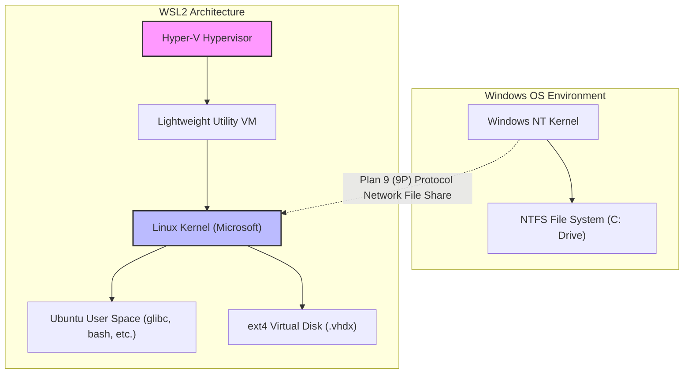
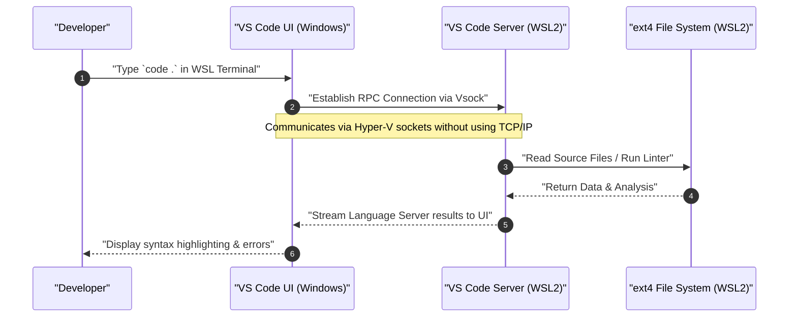

WSL2 (Windows Subsystem for Linux 2), which provides a Linux-native development environment on Windows, has become an indispensable tool in modern software development. However, there is a world of difference in performance and development experience between continuing to use it in its default state and understanding the architecture to apply appropriate tuning.

In this article, starting with an explanation of the architecture that forms the foundation of WSL2, we will thoroughly explain all the steps to build the "ultimate development environment" demanded by professional engineers in a volume of over 10,000 characters. This covers settings to maximize performance, building a comfortable terminal environment, seamless integration with Docker and VS Code, and advanced network configurations.

---

## 1. WSL2 Architecture and Evolution from WSL1

To fully unleash the potential of WSL2, it is important to first understand its internal structure. The approach to running Linux binaries on Windows is fundamentally different between the first-generation WSL (WSL1) and WSL2.

### WSL1: System Call Translation Layer
WSL1 adopted a mechanism that translates Linux system calls into Windows NT APIs in real-time. Because this did not use a virtual machine (VM), it had the advantage of very low resource overhead. However, it was difficult to perfectly emulate complex system calls, such as file system I/O operations, which led to devastating performance degradation, especially in processes dealing with large numbers of small files, such as Node.js `npm install` and Git repository operations.

### WSL2: Lightweight Utility VM and a Complete Linux Kernel
In WSL2, the architecture was revamped, and an authentic Linux kernel built by Microsoft now runs directly on a "lightweight utility VM" utilizing a subset of the Hyper-V architecture. This ensures 100% compatibility for system calls and dramatically improves file I/O performance compared to WSL1 by using a virtual disk (VHDX) that utilizes the Linux-native ext4 file system.

The following Mermaid diagram shows the structural differences between WSL1 and WSL2.



An important lesson to be learned from this structure is: **"Access to files on the Linux side (inside the VHDX) is extremely fast, but access to files on the Windows side (`/mnt/c/`) is very slow because it goes through the 9P protocol."** The source code of your projects must always be placed under the home directory (`~`) on the WSL side.

---

## 2. Mathematical Analysis of Performance: Why is WSL2 so fast?

Let's quantitatively evaluate the performance improvement of WSL2 using a mathematical model. One of the most time-consuming operations in software development is processing that involves a large amount of file I/O (e.g., library installation or building).

The total execution time $T_{total}$ of a certain process is expressed as the sum of the computing time by the CPU $T_{compute}$ and the time taken for disk I/O $T_{io}$.

$$ T_{total} = T_{compute} + T_{io} $$

In the case of WSL1, because an overhead occurs in translating Linux-side operations into NTFS operations, the I/O time is modeled as follows. Here, $n$ is the number of file operations, $t_{ntfs\_syscall}$ is the execution time of the Windows-side system call, and $t_{trans}$ is the overhead of the translation layer.

$$ T_{wsl1\_io} = \sum_{i=1}^{n} (t_{ntfs\_syscall_i} + t_{trans_i}) $$

On the other hand, in WSL2, since the kernel issues I/O directly to the ext4 file system, the overhead is only a very small delay $t_{virt}$ due to virtualization.

$$ T_{wsl2\_io} = \sum_{i=1}^{n} (t_{ext4_i} + t_{virt_i}) $$

In a general file system, since $t_{ext4} \ll t_{ntfs\_syscall} + t_{trans}$, when $n$ is very large (performing tens to hundreds of thousands of file operations), the difference in I/O time between WSL1 and WSL2 grows exponentially.

Also, assuming the overhead ratio of CPU computation in a virtualized environment is $\rho$, with modern hardware-assisted virtualization (Intel VT-x / AMD-V), it stays around $\rho \approx 0.01 \sim 0.03$ (1 to 3%). Therefore, even in pure computational tasks, it delivers a performance of $97\% \sim 99\%$ which is comparable to a native Linux environment.

---

## 3. Installation and Foundation Building

On Windows 10/11, installing WSL2 has become very simple. Just open PowerShell with administrator privileges and run the following command.

```powershell
# WSL2 and Ubuntu are installed by default
wsl --install

# When specifying a specific distribution
# You can check this with wsl --list --online
wsl --install -d Ubuntu-24.04
```

After installation, following a reboot, you will be prompted to set up a UNIX username and password upon the first launch. This user is independent of the Windows user and is only valid within WSL.

If you are already using WSL1, convert it to WSL2 with the following command.

```powershell
# Convert an existing distribution to WSL2
wsl --set-version Ubuntu 2

# Set WSL2 as the default version for any future distributions you add
wsl --set-default-version 2
```

---

## 4. The Secret of Resource Control: .wslconfig and wsl.conf

One of the biggest traps in WSL2 is the "unlimited consumption of memory (bloating of the Vmmem process)". Since WSL2 utilizes the Linux kernel's page cache, it will endlessly consume the host's (Windows) memory every time it performs I/O. To prevent this, it is essential to limit resources using configuration files.

WSL2 configuration files are divided into two: **`.wslconfig` which affects the entire Windows system**, and **`wsl.conf` which affects the inside of each distribution**.

### 4.1. .wslconfig (Windows side)

Create a file in the Windows user profile directory (`C:\Users\<username>\.wslconfig`) to control resource allocation for the VM.

```ini
# C:\Users\<username>\.wslconfig
[wsl2]
# Maximum memory allocated to the VM. We recommend about 50% to 75% of the host's total memory
memory=16GB

# Number of CPU cores to use (uses all cores if omitted)
processors=8

# Size of the swap file
swap=8GB

# Destination to save the swap file (useful if you want to save space on the C drive)
# swapfile=D:\\wsl\\swap.vhdx

# Enable localhost forwarding (to access WSL from the Windows side using localhost)
localhostForwarding=true

# Automatically free up memory (Windows 11 only)
# Dynamically releases page cache to prevent Vmmem bloating
autoMemoryReclaim=dropcache

[experimental]
# Advanced networking features available in Windows 11 22H2 and later
# This enables IPv6 support and allows sharing the same IP address between WSL and Windows
networkingMode=mirrored
dnsTunneling=true
firewall=true
autoProxy=true
```

### 4.2. wsl.conf (Linux side)

Edit `/etc/wsl.conf` inside WSL to control the distribution-specific behavior.

```ini
# /etc/wsl.conf (edit inside WSL)
[network]
# Disable the automatic generation of /etc/resolv.conf when WSL starts
# Useful when you want to set your own DNS (e.g., 8.8.8.8)
generateResolvConf=false

# Set a custom hostname
hostname=WSL-DevNode

[automount]
# Settings for mounting Windows drives
enabled=true
options="metadata,uid=1000,gid=1000,umask=022"
# Change the mount point of the C drive from /mnt/c to /c (to shorten the path)
root=/

[boot]
# Enable systemd (WSL 0.67.6 or later)
# This allows snaps and various daemons (like Docker) to run natively
systemd=true

[user]
# Default user to log in as
default=kenji
```

To apply these settings, you need to run `wsl --shutdown` in PowerShell to completely stop the WSL VM and then restart it.

---

## 5. The Ultimate Terminal Environment: Zsh + Powerlevel10k

Productivity won't improve if you stick with the default bash. Combine Zsh, which boasts powerful completion features and visibility, with the ultra-fast theme "Powerlevel10k" to build the strongest prompt.

### 5.1. Installing and Configuring Windows Terminal
Install "Windows Terminal" from the Microsoft Store. Open the JSON settings (`settings.json`), set the default profile to WSL (Ubuntu), and change the font to a Nerd Font for development (e.g., `HackGen Console NF` or `MesloLGS NF`).

### 5.2. Installing Zsh and Oh My Zsh
Run the following commands in the WSL terminal.

```bash
# Update packages and install Zsh
sudo apt update && sudo apt upgrade -y
sudo apt install -y zsh git curl

# Run the Oh My Zsh installation script
sh -c "$(curl -fsSL https://raw.githubusercontent.com/ohmyzsh/ohmyzsh/master/tools/install.sh)"
```

### 5.3. Introducing Powerlevel10k and Plugins
Introduce plugins that further enhance Zsh (syntax highlighting and auto-suggestions) and the Powerlevel10k theme.

```bash
# Powerlevel10k
git clone --depth=1 https://github.com/romkatv/powerlevel10k.git ${ZSH_CUSTOM:-$HOME/.oh-my-zsh/custom}/themes/powerlevel10k

# zsh-autosuggestions
git clone https://github.com/zsh-users/zsh-autosuggestions ${ZSH_CUSTOM:-~/.oh-my-zsh/custom}/plugins/zsh-autosuggestions

# zsh-syntax-highlighting
git clone https://github.com/zsh-users/zsh-syntax-highlighting.git ${ZSH_CUSTOM:-~/.oh-my-zsh/custom}/plugins/zsh-syntax-highlighting
```

Edit `~/.zshrc` to enable the theme and plugins.

```bash
# Changes in ~/.zshrc
ZSH_THEME="powerlevel10k/powerlevel10k"

# Add to the plugins array
plugins=(git zsh-autosuggestions zsh-syntax-highlighting)
```

After saving, running `source ~/.zshrc` will launch the Powerlevel10k configuration wizard (`p10k configure`). Follow the on-screen instructions to customize the prompt to your liking (prompt style, presence of icons, information to display, etc.). Information such as the Git branch name and status, Node.js version, and command execution time will be displayed in real-time, dramatically improving your development efficiency.

---

## 6. Seamless Integration with VS Code Remote - WSL

For development in WSL2, the "Remote - WSL" extension is the mechanism that seamlessly accesses files inside WSL from the IDE (Visual Studio Code) installed on the Windows side.

### Architecture Explanation

The following sequence diagram shows how VS Code communicates with WSL2.



The VS Code on the Windows side acts merely as a "thin client (UI)", and heavy processing such as the Language Server, debugger, and terminal execution are all handled by the "VS Code Server" on the WSL side. This allows you to keep your environment clean on the WSL side without installing Node.js or Python on the Windows side.

### Essential VS Code Settings
Install **"WSL" (ms-vscode-remote.remote-wsl)** from the "Extensions" in VS Code. After that, simply navigate to your project directory in the WSL terminal and run `code .`, which will launch the Windows-side VS Code with that directory open.

**Important Note (Line Ending Issue):**
Windows and Linux have different line endings (Windows uses `CRLF`, while Linux uses `LF`). When developing on WSL, be sure to unify Git's `core.autocrlf` setting and VS Code's default file setting to `LF`. Neglecting this will cause you to suffer from mysterious errors when executing shell scripts or Docker containers.

```bash
# Git line ending setting on the WSL side
git config --global core.autocrlf input
```

Also add the following to VS Code's `settings.json` (remote settings).

```json
{
    "files.eol": "\n",
    "terminal.integrated.defaultProfile.linux": "zsh"
}
```

---

## 7. Optimizing Docker Desktop and WSL2 Integration

There are mainly two approaches to using Docker in a WSL2 environment:

1. Install **Docker Desktop for Windows** and enable the WSL2 integration feature.
2. Directly install **native Docker Engine** inside WSL2 (e.g., Ubuntu).

### Approach 1: Docker Desktop (Recommended)
This is recommended in most cases because it is easy to manage via a GUI and allows transparent access to containers between Windows and WSL. Check the following in the Docker Desktop settings (Settings):

- Check `General` -> `Use the WSL 2 based engine`.
- Check `Resources` -> `WSL Integration` -> `Enable integration with my default WSL distro`, and turn on the toggle button for the distribution you use (Ubuntu).

This allows you to execute the `docker` command directly from the WSL2 terminal, and communication with the Docker daemon is done through dedicated lightweight VMs (`docker-desktop` and `docker-desktop-data`) managed by Docker Desktop.

### Approach 2: Direct Installation of Native Docker Engine
If there are corporate network restrictions (like avoiding paid Docker Desktop plans) or if you want to minimize performance overhead to the limit, enable `systemd` in `/etc/wsl.conf` and install Docker as a pure Ubuntu server.

```bash
# Excerpt of the official Docker installation steps on WSL2 Ubuntu with systemd enabled
sudo apt-get update
sudo apt-get install ca-certificates curl gnupg
sudo install -m 0755 -d /etc/apt/keyrings
curl -fsSL https://download.docker.com/linux/ubuntu/gpg | sudo gpg --dearmor -o /etc/apt/keyrings/docker.gpg
sudo chmod a+r /etc/apt/keyrings/docker.gpg

# Add repository
echo \
  "deb [arch="$(dpkg --print-architecture)" signed-by=/etc/apt/keyrings/docker.gpg] https://download.docker.com/linux/ubuntu \
  "$(. /etc/os-release && echo "$VERSION_CODENAME")" stable" | \
  sudo tee /etc/apt/sources.list.d/docker.list > /dev/null

sudo apt-get update
sudo apt-get install docker-ce docker-ce-cli containerd.io docker-buildx-plugin docker-compose-plugin

# Add the current user to the docker group (to execute without sudo)
sudo usermod -aG docker $USER
```

After a reboot, `systemctl start docker` will function exactly like a native Linux environment and deliver high performance.

---

## 8. SSH Key Integration: Seamless Authentication between Windows and WSL

Managing separate SSH keys on the Windows side and the WSL side when doing Git SSH cloning or SSH connecting to remote servers is extremely tedious. To balance security and convenience, configure a bridge for the SSH agent running on the Windows side (or a password manager like 1Password) to the WSL side.

Here, we will explain the most secure and modern approach: using the **1Password SSH Agent feature** or the **Windows OpenSSH Authentication Agent**, and forwarding it to a UNIX domain socket in WSL2 using `npiperelay` or `socat`.

### Socket Forwarding for ssh-agent

You need to convert the SSH agent typically provided as a Named Pipe in Windows into a socket file on the WSL side. This is easy if you use `wsl-ssh-agent` or the features provided by 1Password.

From the 1Password settings screen, enable "Developer" -> "Use SSH agent".
Next, add the following configuration to `~/.zshrc` or `~/.bashrc` on the WSL side so that it automatically binds to the socket upon login.

```bash
# Addition to ~/.zshrc (Example when using 1Password SSH Agent)
export SSH_AUTH_SOCK=$HOME/.ssh/agent.sock
# If the socket doesn't exist at WSL startup, or the process isn't bound, forward using socat and npiperelay
ALREADY_RUNNING=$(ps -aux | grep "[n]piperelay.exe -ei -s //./pipe/openssh-ssh-agent" | wc -l)
if [ $ALREADY_RUNNING -eq 0 ]; then
    if [ -S $SSH_AUTH_SOCK ]; then
        rm $SSH_AUTH_SOCK
    fi
    # Launch socat in the background to connect the Windows-side Named Pipe to the WSL-side UNIX socket
    (setsid socat UNIX-LISTEN:$SSH_AUTH_SOCK,fork EXEC:"npiperelay.exe -ei -s //./pipe/openssh-ssh-agent",nofork &) >/dev/null 2>&1
fi
```
*Note: You must install `npiperelay.exe` on the Windows side and add it to your PATH beforehand.*

Once this setup is complete, when you run `ssh-add -l` from the WSL terminal, a list of public keys for the SSH keys registered in 1Password or on the Windows side will be displayed. This allows you to securely pass authentication without copying your private key files into WSL.

---

## 9. Maintenance: Optimizing (Compacting) the Bloated VHDX

One of the biggest drawbacks of WSL2 is its behavior where "the file size of the virtual disk (.vhdx) on the Windows side is not automatically reduced even when Docker images or files are deleted". If you continue developing for a long time, the ext4.vhdx file will swell to tens or hundreds of gigabytes.

To free up disk space, you need to regularly optimize (Compact) the VHDX from the Windows side.

1. First, completely shut down WSL.
   ```powershell
   wsl --shutdown
   ```
2. Open PowerShell with administrator privileges and run the following `diskpart` command, or the `Optimize-VHD` command of the Hyper-V module (the latter can only be used if Hyper-V is enabled).

```powershell
# When the Hyper-V module is available
Optimize-VHD -Path "$env:LOCALAPPDATA\Packages\CanonicalGroupLimited.Ubuntu_79rhkp1fndgsc\LocalState\ext4.vhdx" -Mode Full

# When using diskpart
diskpart
# Enter interactively in the following prompt
DISKPART> select vdisk file="C:\Users\<username>\AppData\Local\Packages\CanonicalGroupLimited.Ubuntu_79rhkp1fndgsc\LocalState\ext4.vhdx"
DISKPART> attach vdisk readonly
DISKPART> compact vdisk
DISKPART> detach vdisk
DISKPART> exit
```

By performing this operation regularly, you can reclaim unnecessarily consumed space on your C drive.

---

## 10. Conclusion

WSL2 has completely transcended the framework of being just a "bonus Linux running on Windows" and has evolved into a powerful development platform that is equal to, or even better than, MacOS and native Linux machines.

By applying all the configurations explained here (resource optimization via `.wslconfig`, terminal enhancement with Zsh + Powerlevel10k, transparent access with VS Code Remote, and SSH integration and VHDX maintenance), a stress-free, fast, and secure "ultimate development environment" is completed.

Although setting up the environment takes a little effort, once the settings are solidified, there is no doubt that your future engineering productivity will improve dramatically. Please explore further customizations based on this guide to suit your projects and preferences.
