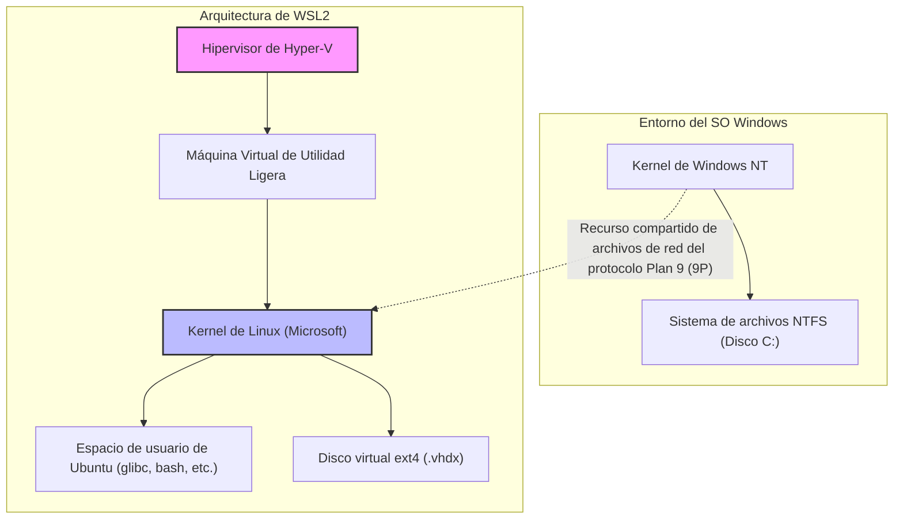
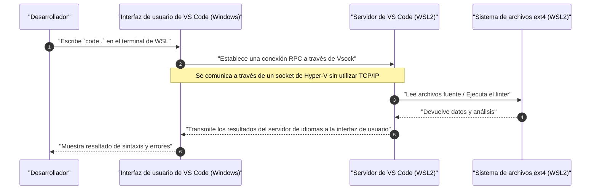

"WSL2 (Windows Subsystem for Linux 2)", que proporciona un entorno de desarrollo nativo de Linux en Windows, se ha convertido en una herramienta indispensable en el desarrollo de software moderno. Sin embargo, existe una gran diferencia en el rendimiento y la experiencia de desarrollo entre usarlo en su estado predeterminado y aplicar los ajustes adecuados al comprender su arquitectura.

En este artículo, comenzando con una explicación de la arquitectura fundamental de WSL2, explicaremos exhaustivamente todos los pasos para construir el "entorno de desarrollo definitivo" exigido por ingenieros profesionales, abarcando configuraciones para maximizar el rendimiento, la construcción de un entorno de terminal cómodo, la integración perfecta con Docker y VS Code, y configuraciones de red avanzadas, en un volumen de más de 10,000 caracteres.

---

## 1. Arquitectura de WSL2 y su evolución desde WSL1

Para aprovechar todo el potencial de WSL2, es importante comprender primero su estructura interna. El enfoque para ejecutar binarios de Linux en Windows difiere fundamentalmente entre el WSL original (WSL1) y WSL2.

### WSL1: Capa de traducción de llamadas al sistema
WSL1 adoptó un mecanismo que traducía (translation) las llamadas al sistema (system calls) de Linux a las APIs NT de Windows en tiempo real. Esto tenía la ventaja de una sobrecarga de recursos (overhead) muy pequeña porque no utilizaba máquinas virtuales (VM). Sin embargo, era difícil emular completamente llamadas al sistema complejas, como operaciones de E/S del sistema de archivos, lo que provocaba una degradación del rendimiento abismal, especialmente al manejar un gran número de archivos pequeños en procesos como `npm install` de Node.js u operaciones de repositorios de Git.

### WSL2: Máquina Virtual de Utilidad Ligera y un Kernel de Linux completo
En WSL2, la arquitectura se renovó y un verdadero kernel de Linux construido por Microsoft ahora se ejecuta directamente sobre una **"Máquina Virtual de Utilidad Ligera (Lightweight Utility VM)" que utiliza un subconjunto de la arquitectura de Hyper-V**. Esto garantiza el 100% de compatibilidad de llamadas al sistema, y al utilizar un disco virtual (VHDX) que emplea el sistema de archivos nativo ext4 de Linux, el rendimiento de E/S de archivos ha mejorado drásticamente en comparación con WSL1.

El siguiente diagrama de Mermaid ilustra las diferencias estructurales entre WSL1 y WSL2.



Una lección importante de esta estructura es que **"el acceso a los archivos en el lado de Linux (dentro del VHDX) es extremadamente rápido, pero el acceso a los archivos en el lado de Windows (`/mnt/c/`) es muy lento porque pasa por el protocolo 9P"**. El código fuente de tus proyectos siempre debe ubicarse bajo el directorio de inicio (`~`) en el lado de WSL.

---

## 2. Análisis matemático del rendimiento: ¿Por qué WSL2 es rápido?

Evaluemos cuantitativamente la mejora de rendimiento de WSL2 utilizando un modelo matemático. En el desarrollo de software, una de las operaciones que más tiempo consume es el procesamiento que implica operaciones intensivas de E/S de archivos (por ejemplo, instalación de bibliotecas o compilación).

El tiempo total de ejecución de cierto proceso $T_{total}$ se expresa como la suma del tiempo computacional por la CPU $T_{compute}$ y el tiempo que tardan las operaciones de E/S de disco $T_{io}$.

$$ T_{total} = T_{compute} + T_{io} $$

En el caso de WSL1, se produce una sobrecarga para traducir las operaciones del lado de Linux en operaciones NTFS, por lo que el tiempo de E/S se modela de la siguiente manera. Aquí, $n$ es el número de operaciones de archivo, $t_{ntfs\_syscall}$ es el tiempo de ejecución de la llamada al sistema en el lado de Windows y $t_{trans}$ es la sobrecarga de la capa de traducción.

$$ T_{wsl1\_io} = \sum_{i=1}^{n} (t_{ntfs\_syscall_i} + t_{trans_i}) $$

Por otro lado, en el caso de WSL2, dado que el kernel emite E/S directamente al sistema de archivos ext4, la sobrecarga es solo el ligero retraso $t_{virt}$ debido a la virtualización.

$$ T_{wsl2\_io} = \sum_{i=1}^{n} (t_{ext4_i} + t_{virt_i}) $$

En los sistemas de archivos generales, como $t_{ext4} \ll t_{ntfs\_syscall} + t_{trans}$, cuando $n$ es muy grande (realizando decenas de miles a cientos de miles de operaciones de archivo), la diferencia en el tiempo de E/S entre WSL1 y WSL2 crece exponencialmente.

Además, si la relación de sobrecarga del cálculo de la CPU en el entorno de virtualización es $\rho$, en la virtualización asistida por hardware moderna (Intel VT-x / AMD-V) se sitúa en alrededor de $\rho \approx 0.01 \sim 0.03$ (1 a 3%). Por lo tanto, incluso en tareas puramente computacionales, ofrece un rendimiento del $97\% \sim 99\%$, que es comparable al de un entorno Linux nativo.

---

## 3. Instalación y construcción de la base

En Windows 10/11, la instalación de WSL2 se ha vuelto muy sencilla. Simplemente abre PowerShell con privilegios de administrador y ejecuta el siguiente comando.

```powershell
# WSL2 y Ubuntu se instalarán por defecto
wsl --install

# Si especificas una distribución en particular
# Se puede comprobar con wsl --list --online
wsl --install -d Ubuntu-24.04
```

Después de la instalación, tras reiniciar, se te pedirá que configures un nombre de usuario y una contraseña de UNIX en el primer inicio. Este usuario es independiente del usuario de Windows y sólo es válido dentro de WSL.

Si ya estás usando WSL1, conviértelo a WSL2 con los siguientes comandos.

```powershell
# Convierte una distribución existente a WSL2
wsl --set-version Ubuntu 2

# Establece WSL2 como versión por defecto para las distribuciones que añadas en el futuro
wsl --set-default-version 2
```

---

## 4. El secreto del control de recursos: .wslconfig y wsl.conf

Una de las mayores trampas de WSL2 es el "consumo ilimitado de memoria (el aumento de tamaño del proceso Vmmem)". Como WSL2 utiliza la caché de páginas (page cache) del kernel de Linux, devora la memoria del host (Windows) sin cesar cada vez que realiza E/S. Para evitar esto, es imprescindible limitar los recursos usando un archivo de configuración.

Los archivos de configuración de WSL2 se dividen en dos: **`.wslconfig` que afecta a todo Windows** y **`wsl.conf` que afecta al interior de cada distribución**.

### 4.1. .wslconfig (Lado de Windows)

Crea un archivo en el directorio de perfil de usuario de Windows (`C:\Users\<nombre_de_usuario>\.wslconfig`) para controlar la asignación de recursos a la máquina virtual.

```ini
# C:\Users\<nombre_de_usuario>\.wslconfig
[wsl2]
# Cantidad máxima de memoria para asignar a la VM. Se recomienda alrededor del 50% al 75% de la memoria total del host
memory=16GB

# Número de núcleos de CPU a utilizar (si se omite, se usarán todos)
processors=8

# Tamaño del archivo de intercambio (swap)
swap=8GB

# Destino donde guardar el archivo de intercambio (si quieres ahorrar espacio en el disco C)
# swapfile=D:\\wsl\\swap.vhdx

# Habilitar el reenvío de localhost (para acceder a WSL desde Windows a través de localhost)
localhostForwarding=true

# Liberar memoria automáticamente (solo Windows 11)
# Libera dinámicamente la caché de páginas y previene el crecimiento excesivo de Vmmem
autoMemoryReclaim=dropcache

[experimental]
# Funciones de red avanzadas disponibles en Windows 11 22H2 y posteriores
# Esto habilita el soporte de IPv6 y compartir la misma dirección IP entre WSL y Windows
networkingMode=mirrored
dnsTunneling=true
firewall=true
autoProxy=true
```

### 4.2. wsl.conf (Lado de Linux)

Edita `/etc/wsl.conf` dentro de WSL para controlar el comportamiento específico de la distribución.

```ini
# /etc/wsl.conf (editar dentro de WSL)
[network]
# Deshabilitar la generación automática de /etc/resolv.conf al iniciar WSL
# Útil si quieres establecer tu propio DNS (ej. 8.8.8.8)
generateResolvConf=false

# Establecer tu propio nombre de host
hostname=WSL-DevNode

[automount]
# Configuración para cuando se montan unidades de Windows
enabled=true
options="metadata,uid=1000,gid=1000,umask=022"
# Cambiar el punto de montaje de la unidad C de /mnt/c a /c (hace la ruta más corta)
root=/

[boot]
# Habilitar systemd (WSL 0.67.6 y posteriores)
# Esto permite que snap y varios demonios (Docker, etc.) se ejecuten de forma nativa
systemd=true

[user]
# El usuario que inicia sesión por defecto
default=kenji
```

Para aplicar estas configuraciones, es necesario ejecutar `wsl --shutdown` en PowerShell para detener por completo la máquina virtual de WSL y luego reiniciarla.

---

## 5. El entorno de terminal definitivo: Zsh + Powerlevel10k

La productividad no mejorará con bash por defecto. Combinaremos Zsh, que cuenta con una gran capacidad de autocompletado y visibilidad, con el ultrarrápido tema "Powerlevel10k" para construir el prompt más potente.

### 5.1. Introducción y configuración de Windows Terminal
Instala "Windows Terminal" desde Microsoft Store. Abre la configuración JSON (`settings.json`), establece el perfil predeterminado en WSL (Ubuntu) y cambia la fuente a una fuente Nerd para desarrollo (por ejemplo: `HackGen Console NF` o `MesloLGS NF`).

### 5.2. Instalación de Zsh y Oh My Zsh
Ejecuta los siguientes comandos en el terminal de WSL.

```bash
# Actualizar los paquetes e instalar Zsh
sudo apt update && sudo apt upgrade -y
sudo apt install -y zsh git curl

# Ejecutar el script de instalación de Oh My Zsh
sh -c "$(curl -fsSL https://raw.githubusercontent.com/ohmyzsh/ohmyzsh/master/tools/install.sh)"
```

### 5.3. Introducción a Powerlevel10k y plugins
Instala el tema Powerlevel10k y plugins (resaltado de sintaxis y autocompletado) que potencian aún más a Zsh.

```bash
# Powerlevel10k
git clone --depth=1 https://github.com/romkatv/powerlevel10k.git ${ZSH_CUSTOM:-$HOME/.oh-my-zsh/custom}/themes/powerlevel10k

# zsh-autosuggestions
git clone https://github.com/zsh-users/zsh-autosuggestions ${ZSH_CUSTOM:-~/.oh-my-zsh/custom}/plugins/zsh-autosuggestions

# zsh-syntax-highlighting
git clone https://github.com/zsh-users/zsh-syntax-highlighting.git ${ZSH_CUSTOM:-~/.oh-my-zsh/custom}/plugins/zsh-syntax-highlighting
```

Edita `~/.zshrc` y activa el tema y los plugins.

```bash
# Cambios en ~/.zshrc
ZSH_THEME="powerlevel10k/powerlevel10k"

# Añadir a la matriz (array) de plugins
plugins=(git zsh-autosuggestions zsh-syntax-highlighting)
```

Al guardar y ejecutar `source ~/.zshrc`, se iniciará el asistente de configuración de Powerlevel10k (`p10k configure`). Sigue las instrucciones en pantalla para personalizar el prompt a tu gusto (estilo del prompt, con o sin iconos, información que mostrar, etc.). Podrás ver en tiempo real el nombre de la rama (branch) y el estado de Git, la versión de Node.js, el tiempo de ejecución del comando, lo que aumentará espectacularmente tu eficiencia en el desarrollo.

---

## 6. VS Code Remote - Integración perfecta con WSL

En el desarrollo con WSL2, la extensión "Remote - WSL" proporciona el mecanismo para acceder sin problemas a los archivos dentro de WSL desde un IDE (Visual Studio Code) instalado en el lado de Windows.

### Explicación de la arquitectura

El siguiente diagrama de secuencia muestra cómo VS Code se comunica con WSL2.



El VS Code en el lado de Windows funciona simplemente como un "cliente ligero (thin client / UI)", mientras que el procesamiento pesado, como el Language Server, el depurador (debugger) y la ejecución del terminal, son procesados íntegramente por el "Servidor de VS Code" en el lado de WSL. Esto te permite mantener tu entorno del lado de WSL limpio sin tener que instalar Node.js o Python en el lado de Windows.

### Configuraciones obligatorias en VS Code
Instala **"WSL" (ms-vscode-remote.remote-wsl)** desde la sección "Extensiones" de VS Code. Luego, ve al directorio del proyecto en el terminal de WSL y simplemente ejecuta `code .`, el VS Code del lado de Windows se abrirá en ese directorio.

**Nota importante (El problema del código de salto de línea):**
Los códigos de salto de línea difieren entre Windows y Linux (Windows es `CRLF`, Linux es `LF`). Si estás desarrollando en WSL, asegúrate siempre de unificar la configuración `core.autocrlf` de Git o la configuración de archivos por defecto de VS Code a `LF`. Si omites este paso, sufrirás errores misteriosos al ejecutar scripts de shell o contenedores de Docker.

```bash
# Configuración del código de salto de línea para Git en el lado de WSL
git config --global core.autocrlf input
```

Añade también lo siguiente en `settings.json` (configuración remota) de VS Code.

```json
{
    "files.eol": "\n",
    "terminal.integrated.defaultProfile.linux": "zsh"
}
```

---

## 7. Optimización de Docker Desktop e Integración con WSL2

Hay dos enfoques principales para usar Docker en el entorno WSL2:

1. Instalar **Docker Desktop for Windows** y habilitar la función de integración con WSL2.
2. Instalar el **Docker Engine nativo** directamente dentro de WSL2 (Ubuntu, etc.).

### Enfoque 1: Docker Desktop (Recomendado)
Se suele recomendar esto en muchos casos porque facilita la gestión mediante interfaz gráfica (GUI) y el acceso transparente de los contenedores entre Windows/WSL. Verifica lo siguiente en la configuración de Docker Desktop (Settings).

- Marca la casilla de `General` -> `Use the WSL 2 based engine`.
- Marca la casilla de `Resources` -> `WSL Integration` -> `Enable integration with my default WSL distro` y activa el interruptor (toggle button) de la distribución que vas a usar (Ubuntu).

Esto te permitirá ejecutar el comando `docker` directamente desde el terminal de WSL2 y la comunicación con el demonio de Docker (Docker daemon) se realizará a través de máquinas virtuales ligeras y exclusivas (`docker-desktop` y `docker-desktop-data`) gestionadas por Docker Desktop.

### Enfoque 2: Instalación directa de Docker Engine nativo
Si tienes restricciones por parte de la red corporativa (como evadir los costos de licencia de Docker Desktop) o deseas reducir la sobrecarga de rendimiento al extremo, instala Docker puramente como un servidor Ubuntu con `systemd` habilitado en `/etc/wsl.conf`.

```bash
# Fragmento de los pasos oficiales de instalación de Docker en WSL2 Ubuntu con systemd habilitado
sudo apt-get update
sudo apt-get install ca-certificates curl gnupg
sudo install -m 0755 -d /etc/apt/keyrings
curl -fsSL https://download.docker.com/linux/ubuntu/gpg | sudo gpg --dearmor -o /etc/apt/keyrings/docker.gpg
sudo chmod a+r /etc/apt/keyrings/docker.gpg

# Agregar el repositorio
echo \
  "deb [arch="$(dpkg --print-architecture)" signed-by=/etc/apt/keyrings/docker.gpg] https://download.docker.com/linux/ubuntu \
  "$(. /etc/os-release && echo "$VERSION_CODENAME")" stable" | \
  sudo tee /etc/apt/sources.list.d/docker.list > /dev/null

sudo apt-get update
sudo apt-get install docker-ce docker-ce-cli containerd.io docker-buildx-plugin docker-compose-plugin

# Agregar el usuario actual al grupo docker (para ejecutar sin sudo)
sudo usermod -aG docker $USER
```

Después de reiniciar, `systemctl start docker` funcionará exactamente igual que en un entorno Linux nativo, ofreciendo un alto rendimiento.

---

## 8. Integración de claves SSH: Autenticación perfecta entre Windows y WSL

Al hacer clones SSH de Git o conectarse por SSH a un servidor remoto, resulta muy molesto gestionar claves SSH separadas entre el lado de Windows y el lado de WSL. Para equilibrar seguridad y conveniencia, configuraremos un puente (bridge) para el agente SSH que se ejecuta en el lado de Windows (o un gestor de contraseñas como 1Password) hacia el lado de WSL.

Aquí explicaremos cómo reenviar al socket de dominio UNIX (UNIX domain socket) de WSL2 mediante `npiperelay` o `socat`, empleando la **función del agente SSH de 1Password** o el **Agente de autenticación de OpenSSH de Windows**, como los enfoques más modernos y seguros.

### Reenvío de sockets de ssh-agent

Normalmente, el agente SSH proporcionado como una tubería con nombre (Named Pipe) en Windows debe convertirse en un archivo de socket (socket file) en el lado de WSL. Es fácil utilizando la función de `wsl-ssh-agent` o la proporcionada por 1Password.

En la pantalla de configuración de 1Password, ve a "Desarrollador (Developer)" -> habilita "Usar el agente SSH (Use SSH agent)".
Luego, añade la siguiente configuración a `~/.zshrc` o `~/.bashrc` en el lado de WSL, para enlazar el socket automáticamente al iniciar sesión.

```bash
# Apunte en ~/.zshrc (Ejemplo usando 1Password SSH Agent)
export SSH_AUTH_SOCK=$HOME/.ssh/agent.sock
# Usar socat y npiperelay para reenviar si el socket no existe o el proceso no está enlazado al iniciar WSL
ALREADY_RUNNING=$(ps -aux | grep "[n]piperelay.exe -ei -s //./pipe/openssh-ssh-agent" | wc -l)
if [ $ALREADY_RUNNING -eq 0 ]; then
    if [ -S $SSH_AUTH_SOCK ]; then
        rm $SSH_AUTH_SOCK
    fi
    # Inicia socat en segundo plano (background) y conecta la tubería con nombre del lado de Windows al socket UNIX del lado de WSL
    (setsid socat UNIX-LISTEN:$SSH_AUTH_SOCK,fork EXEC:"npiperelay.exe -ei -s //./pipe/openssh-ssh-agent",nofork &) >/dev/null 2>&1
fi
```
*Es necesario instalar de antemano `npiperelay.exe` en el lado de Windows y añadirlo a la variable PATH (ruta).*

Una vez completada esta configuración, al ejecutar `ssh-add -l` desde el terminal de WSL, se mostrará una lista de claves públicas de las claves SSH registradas en 1Password o en el lado de Windows. Esto permite pasar la autenticación de forma segura sin copiar el archivo de la clave privada (private key) al interior de WSL.

---

## 9. Mantenimiento: Optimización (Compresión) de un VHDX inflado

Una de las mayores desventajas de WSL2 es la especificación en la que "el tamaño de archivo del disco virtual (.vhdx) del lado de Windows no se reduce automáticamente incluso al eliminar imágenes de Docker o borrar archivos". Si el desarrollo continúa durante mucho tiempo, el archivo ext4.vhdx se hincha de decenas a cientos de GB.

Para liberar espacio en disco, es necesario optimizar (comprimir - Compact) el VHDX periódicamente desde el lado de Windows.

1. En primer lugar, apaga WSL por completo.
   ```powershell
   wsl --shutdown
   ```
2. Abre PowerShell con privilegios de administrador y ejecuta el siguiente comando `diskpart`, o el comando `Optimize-VHD` del módulo de Hyper-V (este último solo se puede utilizar si Hyper-V está activado).

```powershell
# Si el módulo Hyper-V está disponible
Optimize-VHD -Path "$env:LOCALAPPDATA\Packages\CanonicalGroupLimited.Ubuntu_79rhkp1fndgsc\LocalState\ext4.vhdx" -Mode Full

# Si usas diskpart
diskpart
# Escribe interactivamente en la siguiente línea de comandos
DISKPART> select vdisk file="C:\Users\<nombre_de_usuario>\AppData\Local\Packages\CanonicalGroupLimited.Ubuntu_79rhkp1fndgsc\LocalState\ext4.vhdx"
DISKPART> attach vdisk readonly
DISKPART> compact vdisk
DISKPART> detach vdisk
DISKPART> exit
```

Realizar esta operación de forma regular te permitirá recuperar la capacidad desperdiciada del disco C.

---

## 10. Conclusión

WSL2 ha superado por completo los límites de ser solo un "extra de Linux ejecutándose en Windows" y ha evolucionado hacia una potente plataforma de desarrollo equivalente, o incluso superior, a un sistema MacOS o Linux nativo.

Al aplicar todas las configuraciones explicadas en este momento (optimización de recursos mediante `.wslconfig`, potenciación del terminal con Zsh + Powerlevel10k, acceso transparente con VS Code Remote y mantenimiento de VHDX e integración de SSH), se completará el "entorno de desarrollo definitivo", sin estrés, rápido y seguro.

Lleva un poco de tiempo configurarlo, pero una vez que hayas solidificado la configuración, no hay duda de que la productividad de la ingeniería mejorará drásticamente en el futuro. Anímate y explora futuras personalizaciones basadas en esta guía, según tus preferencias y proyectos.
