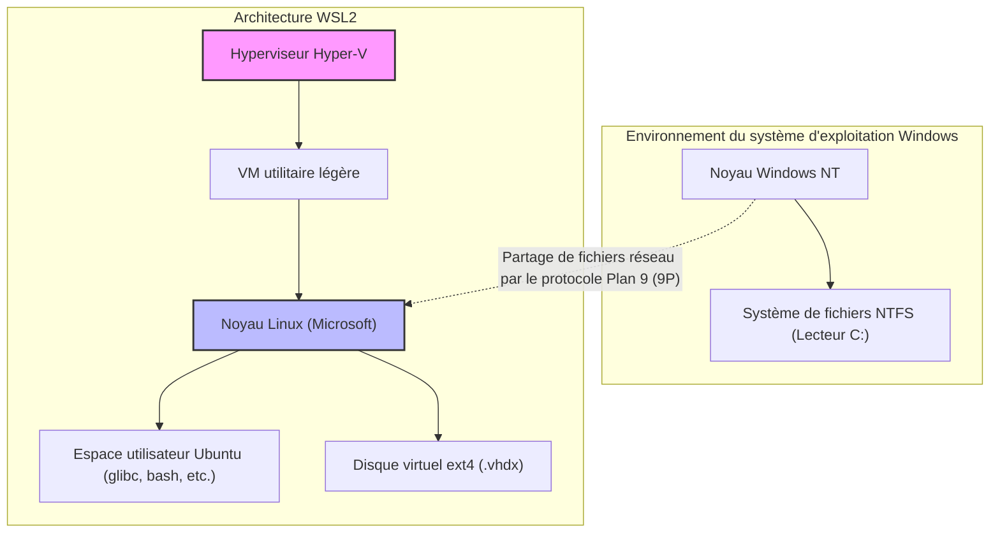
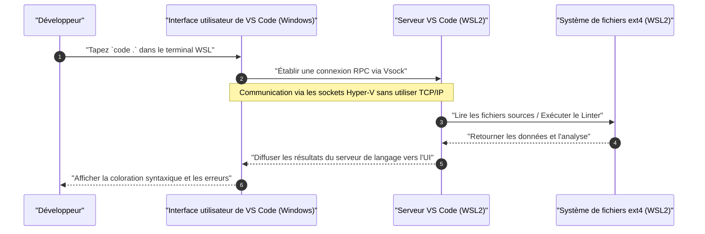

WSL2 (Windows Subsystem for Linux 2), qui offre un environnement de développement Linux natif sur Windows, est devenu un outil indispensable dans le développement de logiciels moderne. Cependant, il y a un monde de différence en termes de performances et d'expérience de développement entre l'utiliser dans son état par défaut et le régler de manière appropriée en comprenant son architecture.

Dans cet article, nous expliquerons de manière exhaustive, avec plus de 10 000 caractères, toutes les étapes pour construire l'« environnement de développement ultime » exigé par les ingénieurs professionnels, en commençant par l'explication de l'architecture fondamentale de WSL2, les paramètres pour maximiser les performances, la construction d'un environnement de terminal confortable, l'intégration transparente avec Docker et VS Code, et enfin les paramètres réseau avancés.

---

## 1. Architecture de WSL2 et évolution par rapport à WSL1

Afin de libérer tout le potentiel de WSL2, il est d'abord important de comprendre sa structure interne. L'approche pour exécuter des binaires Linux sur Windows est fondamentalement différente entre le premier WSL (WSL1) et WSL2.

### WSL1 : Couche de traduction des appels système
WSL1 a adopté un mécanisme qui traduisait les appels système Linux en API Windows NT en temps réel. Cela avait l'avantage d'une surcharge de ressources très faible, car aucune machine virtuelle (VM) n'était utilisée. Cependant, il était difficile d'émuler complètement les appels système complexes, tels que les opérations d'E/S du système de fichiers, ce qui entraînait des baisses de performances désespérantes, notamment dans les processus traitant un grand nombre de petits fichiers, comme `npm install` de Node.js ou les opérations sur les dépôts Git.

### WSL2 : VM utilitaire légère et noyau Linux complet
Dans WSL2, l'architecture a été remaniée pour qu'un véritable noyau Linux, construit par Microsoft, s'exécute directement sur une **« VM utilitaire légère » qui utilise un sous-ensemble de l'architecture Hyper-V**. Cela garantit une compatibilité à 100 % des appels système, et en utilisant un disque virtuel (VHDX) avec un système de fichiers natif Linux ext4, les performances d'E/S des fichiers ont été considérablement améliorées par rapport à WSL1.

Le diagramme Mermaid suivant illustre la différence structurelle entre WSL1 et WSL2.



La leçon importante à tirer de cette structure est que **« l'accès aux fichiers côté Linux (dans le VHDX) est extrêmement rapide, mais l'accès aux fichiers côté Windows (`/mnt/c/`) est très lent car il passe par le protocole 9P »**. Le code source de vos projets doit toujours être placé dans le répertoire personnel côté WSL (`~`).

---

## 2. Analyse mathématique des performances : Pourquoi WSL2 est-il rapide ?

Évaluons quantitativement l'amélioration des performances de WSL2 à l'aide d'un modèle mathématique. L'une des opérations les plus chronophages dans le développement de logiciels est le traitement impliquant des E/S pour un grand nombre de fichiers (ex. : installation de bibliothèques ou compilation).

Le temps d'exécution global $T_{total}$ d'un traitement est exprimé par la somme du temps de calcul par le processeur $T_{compute}$ et du temps consacré aux E/S disque $T_{io}$.

$$ T_{total} = T_{compute} + T_{io} $$

Dans le cas de WSL1, une surcharge se produit lors de la conversion des opérations côté Linux en opérations NTFS, le temps d'E/S est donc modélisé comme suit. Ici, $n$ est le nombre d'opérations sur les fichiers, $t_{ntfs\_syscall}$ est le temps d'exécution de l'appel système côté Windows, et $t_{trans}$ est la surcharge de la couche de traduction.

$$ T_{wsl1\_io} = \sum_{i=1}^{n} (t_{ntfs\_syscall_i} + t_{trans_i}) $$

D'autre part, dans le cas de WSL2, le noyau émet directement des E/S vers le système de fichiers ext4, de sorte que la surcharge n'est qu'un très léger retard $t_{virt}$ dû à la virtualisation.

$$ T_{wsl2\_io} = \sum_{i=1}^{n} (t_{ext4_i} + t_{virt_i}) $$

Dans un système de fichiers classique, comme $t_{ext4} \ll t_{ntfs\_syscall} + t_{trans}$, lorsque $n$ est très grand (des dizaines à des centaines de milliers d'opérations sur les fichiers), la différence de temps d'E/S entre WSL1 et WSL2 augmente de manière exponentielle.

De plus, si le taux de surcharge des calculs du processeur dans un environnement virtualisé est $\rho$, avec la dernière virtualisation assistée par matériel (Intel VT-x / AMD-V), il se situe autour de $\rho \approx 0.01 \sim 0.03$ (1 à 3 %). Par conséquent, même dans des tâches purement de calcul, des performances comparables à un environnement Linux natif de $97\% \sim 99\%$ sont atteintes.

---

## 3. Installation et construction des bases

Sur Windows 10/11, l'installation de WSL2 est devenue très simple. Il suffit d'ouvrir PowerShell avec les privilèges d'administrateur et d'exécuter la commande suivante.

```powershell
# WSL2 et Ubuntu sont installés par défaut
wsl --install

# Pour spécifier une distribution particulière
# Peut être vérifié avec wsl --list --online
wsl --install -d Ubuntu-24.04
```

Après l'installation et un redémarrage, il vous sera demandé de configurer un nom d'utilisateur et un mot de passe UNIX lors du premier lancement. Cet utilisateur est indépendant de l'utilisateur Windows et n'est valide qu'au sein de WSL.

Si vous utilisez déjà WSL1, vous pouvez le convertir en WSL2 avec les commandes suivantes.

```powershell
# Convertir une distribution existante en WSL2
wsl --set-version Ubuntu 2

# Définir WSL2 comme version par défaut pour les distributions ajoutées à l'avenir
wsl --set-default-version 2
```

---

## 4. Les secrets du contrôle des ressources : .wslconfig et wsl.conf

L'un des plus grands pièges de WSL2 est la « consommation illimitée de mémoire (gonflement du processus Vmmem) ». Comme WSL2 utilise le cache de page du noyau Linux, chaque opération d'E/S consomme de la mémoire de l'hôte (Windows) de manière infinie. Pour éviter cela, il est impératif de limiter les ressources via des fichiers de configuration.

Les fichiers de configuration de WSL2 sont divisés en deux : **`.wslconfig` qui affecte l'ensemble de Windows** et **`wsl.conf` qui affecte l'intérieur de chaque distribution**.

### 4.1. .wslconfig (Côté Windows)

Créez un fichier dans le répertoire de profil utilisateur de Windows (`C:\Users\<Nom_d_utilisateur>\.wslconfig`) pour contrôler l'allocation des ressources à la VM.

```ini
# C:\Users\<Nom_d_utilisateur>\.wslconfig
[wsl2]
# Quantité maximale de mémoire allouée à la VM. Il est recommandé d'utiliser environ 50 % à 75 % de la mémoire totale de l'hôte
memory=16GB

# Nombre de cœurs de processeur à utiliser (tous les cœurs sont utilisés si omis)
processors=8

# Taille du fichier d'échange (swap)
swap=8GB

# Emplacement du fichier d'échange (si vous souhaitez économiser de l'espace sur le lecteur C)
# swapfile=D:\\wsl\\swap.vhdx

# Activer le transfert localhost (pour accéder à WSL depuis Windows via localhost)
localhostForwarding=true

# Libérer automatiquement la mémoire (Windows 11 uniquement)
# Libère dynamiquement le cache de page et empêche le gonflement de Vmmem
autoMemoryReclaim=dropcache

[experimental]
# Fonctionnalités réseau avancées disponibles dans Windows 11 22H2 et versions ultérieures
# Cela permet la prise en charge d'IPv6 et le partage de la même adresse IP entre WSL et Windows
networkingMode=mirrored
dnsTunneling=true
firewall=true
autoProxy=true
```

### 4.2. wsl.conf (Côté Linux)

Modifiez `/etc/wsl.conf` à l'intérieur de WSL pour contrôler le comportement spécifique de la distribution.

```ini
# /etc/wsl.conf (Modifié à l'intérieur de WSL)
[network]
# Désactiver la génération automatique de /etc/resolv.conf au démarrage de WSL
# Utile si vous souhaitez configurer un DNS personnalisé (ex. : 8.8.8.8)
generateResolvConf=false

# Définir un nom d'hôte personnalisé
hostname=WSL-DevNode

[automount]
# Paramètres lors du montage de lecteurs Windows
enabled=true
options="metadata,uid=1000,gid=1000,umask=022"
# Changer le point de montage du lecteur C de /mnt/c à /c (pour raccourcir le chemin)
root=/

[boot]
# Activer systemd (WSL 0.67.6 et versions ultérieures)
# Cela permet à snap et à divers démons (tels que Docker) de fonctionner nativement
systemd=true

[user]
# Utilisateur connecté par défaut
default=kenji
```

Pour appliquer ces paramètres, vous devez exécuter `wsl --shutdown` dans PowerShell pour arrêter complètement la VM WSL avant de redémarrer.

---

## 5. L'environnement de terminal ultime : Zsh + Powerlevel10k

Rester avec le bash par défaut n'augmentera pas votre productivité. En combinant Zsh, qui se vante de puissantes capacités de complétion et de visibilité, avec le thème ultra-rapide « Powerlevel10k », nous allons construire l'invite de commande (prompt) la plus puissante.

### 5.1. Installation et configuration de Windows Terminal
Installez « Windows Terminal » à partir du Microsoft Store. Ouvrez la configuration JSON (`settings.json`), définissez le profil par défaut sur WSL (Ubuntu) et changez la police pour une Nerd Font orientée développement (par ex., `HackGen Console NF` ou `MesloLGS NF`).

### 5.2. Installation de Zsh et Oh My Zsh
Exécutez les commandes suivantes dans le terminal WSL.

```bash
# Mise à jour des paquets et installation de Zsh
sudo apt update && sudo apt upgrade -y
sudo apt install -y zsh git curl

# Exécuter le script d'installation de Oh My Zsh
sh -c "$(curl -fsSL https://raw.githubusercontent.com/ohmyzsh/ohmyzsh/master/tools/install.sh)"
```

### 5.3. Introduction de Powerlevel10k et des plugins
Nous allons introduire des plugins pour améliorer encore Zsh (coloration syntaxique et auto-complétion) ainsi que le thème Powerlevel10k.

```bash
# Powerlevel10k
git clone --depth=1 https://github.com/romkatv/powerlevel10k.git ${ZSH_CUSTOM:-$HOME/.oh-my-zsh/custom}/themes/powerlevel10k

# zsh-autosuggestions
git clone https://github.com/zsh-users/zsh-autosuggestions ${ZSH_CUSTOM:-~/.oh-my-zsh/custom}/plugins/zsh-autosuggestions

# zsh-syntax-highlighting
git clone https://github.com/zsh-users/zsh-syntax-highlighting.git ${ZSH_CUSTOM:-~/.oh-my-zsh/custom}/plugins/zsh-syntax-highlighting
```

Modifiez `~/.zshrc` pour activer le thème et les plugins.

```bash
# Changements dans ~/.zshrc
ZSH_THEME="powerlevel10k/powerlevel10k"

# Ajouter au tableau des plugins
plugins=(git zsh-autosuggestions zsh-syntax-highlighting)
```

Enregistrez et exécutez `source ~/.zshrc`, l'assistant de configuration de Powerlevel10k (`p10k configure`) se lancera. Suivez les instructions à l'écran pour personnaliser l'invite selon vos préférences (style de l'invite, présence d'icônes, informations à afficher, etc.). Le nom de la branche Git et son statut, la version de Node.js, le temps d'exécution des commandes, etc. seront affichés en temps réel, ce qui améliorera considérablement l'efficacité du développement.

---

## 6. Intégration transparente de VS Code Remote - WSL

Pour le développement dans WSL2, l'extension « Remote - WSL » est le mécanisme qui permet d'accéder de manière transparente aux fichiers dans WSL depuis l'IDE (Visual Studio Code) installé côté Windows.

### Explication de l'architecture

Le diagramme de séquence suivant montre comment VS Code communique avec WSL2.



Le VS Code côté Windows fonctionne comme un simple « client léger (UI) », et tous les traitements lourds tels que le Language Server, le débogueur et l'exécution du terminal sont gérés par le « VS Code Server » côté WSL. Cela vous permet de garder votre environnement propre uniquement du côté WSL, sans avoir à installer Node.js ou Python du côté Windows.

### Paramètres essentiels de VS Code
Installez **"WSL" (ms-vscode-remote.remote-wsl)** depuis les « Extensions » de VS Code. Ensuite, allez simplement dans le répertoire de votre projet dans le terminal WSL et exécutez `code .`, VS Code se lancera côté Windows avec ce répertoire ouvert.

**Point important (problème des codes de fin de ligne) :**
Les codes de fin de ligne diffèrent entre Windows et Linux (Windows utilise `CRLF`, Linux utilise `LF`). Lors d'un développement sur WSL, assurez-vous d'unifier le paramètre `core.autocrlf` de Git et les paramètres de fichier par défaut de VS Code à `LF`. Si vous négligez cela, vous rencontrerez des erreurs mystérieuses lors de l'exécution de scripts shell ou de conteneurs Docker.

```bash
# Configuration du code de fin de ligne de Git côté WSL
git config --global core.autocrlf input
```

Ajoutez également ce qui suit dans le fichier `settings.json` de VS Code (Paramètres distants).

```json
{
    "files.eol": "\n",
    "terminal.integrated.defaultProfile.linux": "zsh"
}
```

---

## 7. Optimisation de Docker Desktop et de l'intégration WSL2

Pour utiliser Docker dans un environnement WSL2, il existe principalement deux approches.

1. Installer **Docker Desktop pour Windows** et activer la fonctionnalité d'intégration WSL2
2. Installer **nativement le moteur Docker** directement à l'intérieur de WSL2 (ex. : Ubuntu)

### Approche 1 : Docker Desktop (Recommandé)
Dans la plupart des cas, cela est recommandé car la gestion via l'interface graphique et l'accès transparent aux conteneurs entre Windows/WSL sont faciles. Vérifiez les points suivants depuis les paramètres de Docker Desktop (Settings).

- Cochez `General` -> `Use the WSL 2 based engine`.
- Cochez `Resources` -> `WSL Integration` -> `Enable integration with my default WSL distro` et activez la distribution à utiliser (Ubuntu) avec le bouton à bascule.

Cela vous permet d'exécuter la commande `docker` directement depuis le terminal WSL2, et la communication avec le démon Docker s'effectue via des machines virtuelles légères dédiées (`docker-desktop` et `docker-desktop-data`) gérées par Docker Desktop.

### Approche 2 : Installation directe du moteur Docker natif
Si vous avez des contraintes de réseau d'entreprise (comme éviter la monétisation de Docker Desktop) ou si vous souhaitez réduire au maximum la surcharge de performances, installez Docker en tant que pur serveur Ubuntu après avoir activé `systemd` dans `/etc/wsl.conf`.

```bash
# Extrait des instructions officielles d'installation de Docker sur WSL2 Ubuntu avec systemd activé
sudo apt-get update
sudo apt-get install ca-certificates curl gnupg
sudo install -m 0755 -d /etc/apt/keyrings
curl -fsSL https://download.docker.com/linux/ubuntu/gpg | sudo gpg --dearmor -o /etc/apt/keyrings/docker.gpg
sudo chmod a+r /etc/apt/keyrings/docker.gpg

# Ajout du dépôt
echo \
  "deb [arch="$(dpkg --print-architecture)" signed-by=/etc/apt/keyrings/docker.gpg] https://download.docker.com/linux/ubuntu \
  "$(. /etc/os-release && echo "$VERSION_CODENAME")" stable" | \
  sudo tee /etc/apt/sources.list.d/docker.list > /dev/null

sudo apt-get update
sudo apt-get install docker-ce docker-ce-cli containerd.io docker-buildx-plugin docker-compose-plugin

# Ajouter l'utilisateur actuel au groupe docker (pour exécuter sans sudo)
sudo usermod -aG docker $USER
```

Après le redémarrage, `systemctl start docker` fonctionnera exactement comme dans un environnement Linux natif et offrira des performances élevées.

---

## 8. Intégration des clés SSH : Authentification transparente entre Windows et WSL

Lors de la réalisation de clones SSH Git ou de la connexion SSH à des serveurs distants, gérer des clés SSH séparées côté Windows et côté WSL est très fastidieux. Pour allier sécurité et commodité, nous allons configurer un pont pour transférer l'agent SSH en cours d'exécution côté Windows (ou un gestionnaire de mots de passe comme 1Password) vers le côté WSL.

Ici, nous expliquerons l'approche la plus sécurisée et moderne consistant à utiliser la **fonctionnalité d'agent SSH de 1Password** ou **l'OpenSSH Authentication Agent de Windows**, et à la transférer vers un socket de domaine UNIX de WSL2 en utilisant `npiperelay` et `socat`.

### Transfert de socket ssh-agent

Habituellement, l'agent SSH, qui est fourni en tant que Named Pipe (tube nommé) sous Windows, doit être converti en un fichier socket côté WSL. Il est facile d'utiliser des fonctionnalités fournies par `wsl-ssh-agent` ou 1Password.

Depuis l'écran des paramètres de 1Password, activez « Developer » -> « Use the SSH agent » (Utiliser l'agent SSH).
Ensuite, ajoutez la configuration suivante dans le fichier `~/.zshrc` ou `~/.bashrc` côté WSL pour lier automatiquement le socket lors de la connexion.

```bash
# Ajout dans ~/.zshrc (exemple lors de l'utilisation de 1Password SSH Agent)
export SSH_AUTH_SOCK=$HOME/.ssh/agent.sock
# Transférer avec socat et npiperelay si le socket n'existe pas ou si le processus n'est pas lié au démarrage de WSL
ALREADY_RUNNING=$(ps -aux | grep "[n]piperelay.exe -ei -s //./pipe/openssh-ssh-agent" | wc -l)
if [ $ALREADY_RUNNING -eq 0 ]; then
    if [ -S $SSH_AUTH_SOCK ]; then
        rm $SSH_AUTH_SOCK
    fi
    # Démarrer socat en arrière-plan et connecter le Named Pipe côté Windows au socket UNIX côté WSL
    (setsid socat UNIX-LISTEN:$SSH_AUTH_SOCK,fork EXEC:"npiperelay.exe -ei -s //./pipe/openssh-ssh-agent",nofork &) >/dev/null 2>&1
fi
```
* L'installation de `npiperelay.exe` et l'ajout à la variable d'environnement PATH côté Windows sont nécessaires au préalable.

Une fois cette configuration terminée, lors de l'exécution de `ssh-add -l` depuis le terminal WSL, la liste des clés publiques des clés SSH enregistrées dans 1Password ou côté Windows s'affichera. Cela vous permet de passer l'authentification en toute sécurité sans avoir à copier les fichiers de clé privée dans WSL.

---

## 9. Maintenance : Optimisation (compression) d'un VHDX gonflé

L'un des plus grands inconvénients de WSL2 est sa spécification selon laquelle « la taille du fichier du disque virtuel côté Windows (.vhdx) ne rétrécit pas automatiquement, même si vous supprimez des images Docker ou des fichiers ». Si vous continuez à développer pendant une longue période, le fichier ext4.vhdx va gonfler jusqu'à des dizaines ou des centaines de gigaoctets.

Pour libérer de l'espace disque, vous devez optimiser (Compacter) régulièrement le VHDX depuis le côté Windows.

1. Tout d'abord, arrêtez complètement WSL.
   ```powershell
   wsl --shutdown
   ```
2. Ouvrez PowerShell avec des privilèges d'administrateur et exécutez la commande `diskpart` suivante, ou la commande `Optimize-VHD` du module Hyper-V (cette dernière n'est disponible que si Hyper-V est activé).

```powershell
# Si le module Hyper-V est disponible
Optimize-VHD -Path "$env:LOCALAPPDATA\Packages\CanonicalGroupLimited.Ubuntu_79rhkp1fndgsc\LocalState\ext4.vhdx" -Mode Full

# Si vous utilisez diskpart
diskpart
# Entrez interactivement dans l'invite suivante
DISKPART> select vdisk file="C:\Users\<Nom_d_utilisateur>\AppData\Local\Packages\CanonicalGroupLimited.Ubuntu_79rhkp1fndgsc\LocalState\ext4.vhdx"
DISKPART> attach vdisk readonly
DISKPART> compact vdisk
DISKPART> detach vdisk
DISKPART> exit
```

En effectuant cette opération régulièrement, vous pouvez récupérer la capacité du lecteur C inutilement consommée.

---

## 10. Conclusion

WSL2 a complètement dépassé le cadre d'être un simple « Linux bonus fonctionnant sur Windows » et a évolué vers une puissante plateforme de développement qui n'est pas inférieure, et peut-être même supérieure, à macOS et aux machines Linux natives.

En appliquant tous les paramètres expliqués cette fois-ci (optimisation des ressources avec `.wslconfig`, amélioration du terminal avec Zsh + Powerlevel10k, accès transparent avec VS Code Remote, intégration SSH et maintenance VHDX), un « environnement de développement ultime » rapide, sécurisé et sans stress est achevé.

La configuration de l'environnement demande un peu d'effort, mais une fois les paramètres fixés, il ne fait aucun doute que votre future productivité en ingénierie s'améliorera considérablement. N'hésitez pas à explorer des personnalisations supplémentaires sur la base de ce guide, en fonction de vos propres projets et préférences.
