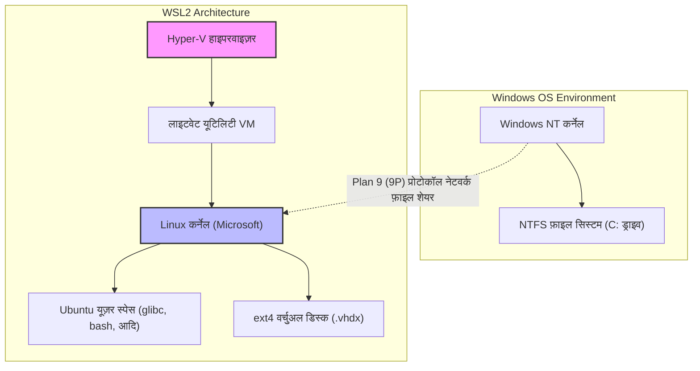
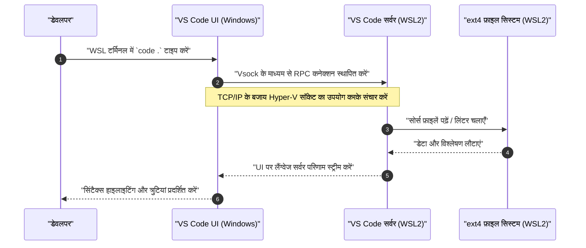

Windows पर Linux-नेटिव डेवलपमेंट एनवायरनमेंट प्रदान करने वाला "WSL2 (Windows Subsystem for Linux 2)" आधुनिक सॉफ्टवेयर डेवलपमेंट में एक अनिवार्य टूल बन गया है। हालाँकि, इसे डिफ़ॉल्ट स्थिति में उपयोग करने बनाम इसके आर्किटेक्चर को समझने और इसे ठीक से ट्यून करने के बीच परफॉरमेंस और डेवलपमेंट अनुभव में एक बड़ा अंतर है।

इस लेख में, हम WSL2 के मूल आर्किटेक्चर की व्याख्या से शुरू करेंगे और "अल्टीमेट डेवलपमेंट एनवायरनमेंट" बनाने के लिए सभी चरणों को विस्तार से (10,000 से अधिक वर्णों में) समझाएंगे जिसकी पेशेवर इंजीनियरों को आवश्यकता होती है। इसमें परफॉरमेंस को अधिकतम करने के लिए सेटिंग्स, एक आरामदायक टर्मिनल एनवायरनमेंट का निर्माण, Docker और VS Code के साथ सहज एकीकरण और उन्नत नेटवर्क कॉन्फ़िगरेशन शामिल हैं।

---

## 1. WSL2 का आर्किटेक्चर और WSL1 से इसका विकास

WSL2 की क्षमता को पूरी तरह से अनलॉक करने के लिए, सबसे पहले इसके आंतरिक ढांचे को समझना महत्वपूर्ण है। पहली पीढ़ी के WSL (WSL1) और WSL2 के बीच Windows पर Linux बायनेरिज़ को चलाने का दृष्टिकोण मौलिक रूप से अलग है।

### WSL1: सिस्टम कॉल ट्रांसलेशन लेयर
WSL1 ने एक तंत्र अपनाया जो Linux सिस्टम कॉल को वास्तविक समय में Windows NT API में अनुवाद (ट्रांसलेट) करता था। इसका फायदा यह था कि रिसोर्स का ओवरहेड बहुत कम था क्योंकि यह वर्चुअल मशीन (VM) का उपयोग नहीं करता था। हालाँकि, फ़ाइल सिस्टम I/O संचालन जैसे जटिल सिस्टम कॉल का पूरी तरह से अनुकरण करना मुश्किल था, जिससे विशेष रूप से बड़ी संख्या में छोटी फ़ाइलों को संभालने वाले ऑपरेशंस, जैसे Node.js के `npm install` या Git रिपॉजिटरी ऑपरेशंस में परफॉरमेंस में भारी गिरावट आई।

### WSL2: लाइटवेट यूटिलिटी VM और पूर्ण Linux कर्नेल
WSL2 में, आर्किटेक्चर को पूरी तरह से नया रूप दिया गया था, और Microsoft द्वारा निर्मित एक वास्तविक Linux कर्नेल अब सीधे **Hyper-V आर्किटेक्चर के सबसेट का उपयोग करके "लाइटवेट यूटिलिटी VM"** पर चलता है। यह सिस्टम कॉल के साथ 100% अनुकूलता सुनिश्चित करता है, और Linux-नेटिव ext4 फ़ाइल सिस्टम का उपयोग करने वाले वर्चुअल डिस्क (VHDX) का उपयोग करके फ़ाइल I/O परफॉरमेंस में WSL1 की तुलना में नाटकीय रूप से सुधार हुआ है।

नीचे दिया गया Mermaid डायग्राम WSL1 और WSL2 के बीच संरचनात्मक अंतर दिखाता है।



इस संरचना से सबसे महत्वपूर्ण सबक यह है कि **"Linux की तरफ (VHDX के अंदर) फ़ाइलों तक पहुंच बहुत तेज़ है, लेकिन Windows की तरफ (`/mnt/c/`) फ़ाइलों तक पहुंच बहुत धीमी है क्योंकि यह 9P प्रोटोकॉल के माध्यम से जाती है।"** इसलिए, प्रोजेक्ट के सोर्स कोड को हमेशा WSL के होम डायरेक्टरी (`~`) के अंतर्गत रखा जाना चाहिए।

---

## 2. परफॉरमेंस का गणितीय विश्लेषण: WSL2 इतना तेज़ क्यों है?

आइए एक गणितीय मॉडल का उपयोग करके WSL2 के परफॉरमेंस सुधार का मात्रात्मक मूल्यांकन करें। सॉफ्टवेयर डेवलपमेंट में सबसे अधिक समय लेने वाले ऑपरेशंस में से एक भारी फ़ाइल I/O (जैसे: लाइब्रेरी इंस्टॉलेशन या बिल्ड) है।

किसी भी प्रक्रिया का कुल निष्पादन समय $T_{total}$, CPU की गणना के समय $T_{compute}$ और डिस्क I/O में लगने वाले समय $T_{io}$ के योग के रूप में व्यक्त किया जा सकता है।

$$ T_{total} = T_{compute} + T_{io} $$

WSL1 के मामले में, Linux ऑपरेशंस को NTFS ऑपरेशंस में बदलने का ओवरहेड होता है, इसलिए I/O समय को इस प्रकार मॉडल किया जाता है। यहाँ, $n$ फ़ाइल ऑपरेशंस की संख्या है, $t_{ntfs\_syscall}$ Windows का सिस्टम कॉल निष्पादन समय है, और $t_{trans}$ ट्रांसलेशन लेयर का ओवरहेड है।

$$ T_{wsl1\_io} = \sum_{i=1}^{n} (t_{ntfs\_syscall_i} + t_{trans_i}) $$

दूसरी ओर, WSL2 में, कर्नेल सीधे ext4 फ़ाइल सिस्टम को I/O जारी करता है, इसलिए ओवरहेड केवल वर्चुअलाइजेशन के कारण होने वाली बहुत मामूली देरी $t_{virt}$ है।

$$ T_{wsl2\_io} = \sum_{i=1}^{n} (t_{ext4_i} + t_{virt_i}) $$

सामान्य फ़ाइल सिस्टम में, $t_{ext4} \ll t_{ntfs\_syscall} + t_{trans}$ होता है, इसलिए जब $n$ बहुत बड़ा होता है (हज़ारों से लाखों फ़ाइल ऑपरेशंस), WSL1 और WSL2 के I/O समय के बीच का अंतर घातीय (exponentially) रूप से बढ़ता है।

इसके अलावा, यदि वर्चुअलाइज्ड एनवायरनमेंट में CPU गणना ओवरहेड अनुपात $\rho$ है, तो नवीनतम हार्डवेयर-असिस्टेड वर्चुअलाइजेशन (Intel VT-x / AMD-V) के साथ, यह $\rho \approx 0.01 \sim 0.03$ (1-3%) तक सीमित रहता है। इसलिए, यहां तक कि शुद्ध कंप्यूटेशनल कार्यों में, यह एक नेटिव Linux एनवायरनमेंट के बराबर $97\% \sim 99\%$ परफॉरमेंस देता है।

---

## 3. इंस्टॉलेशन और फाउंडेशन सेटअप

Windows 10/11 पर WSL2 को इंस्टॉल करना बहुत आसान हो गया है। बस एडमिनिस्ट्रेटर अधिकारों के साथ PowerShell खोलें और निम्नलिखित कमांड चलाएँ:

```powershell
# WSL2 और Ubuntu डिफ़ॉल्ट रूप से इंस्टॉल हो जाएंगे
wsl --install

# यदि कोई विशिष्ट डिस्ट्रिब्यूशन चुनना हो
# आप इसे wsl --list --online से देख सकते हैं
wsl --install -d Ubuntu-24.04
```

इंस्टॉलेशन के बाद, सिस्टम रीबूट होता है, और पहले बूट पर, आपको UNIX यूज़रनेम और पासवर्ड सेट करने के लिए कहा जाएगा। यह यूज़र Windows यूज़र से स्वतंत्र होता है और केवल WSL के भीतर मान्य होता है।

यदि आप पहले से ही WSL1 का उपयोग कर रहे हैं, तो आप इसे निम्न कमांड के साथ WSL2 में बदल सकते हैं:

```powershell
# मौजूदा डिस्ट्रिब्यूशन को WSL2 में बदलें
wsl --set-version Ubuntu 2

# भविष्य में जोड़े जाने वाले डिस्ट्रिब्यूशन के लिए डिफ़ॉल्ट को WSL2 पर सेट करें
wsl --set-default-version 2
```

---

## 4. रिसोर्स नियंत्रण में महारत: .wslconfig और wsl.conf

WSL2 की सबसे बड़ी कमियों में से एक "अनलिमिटेड मेमोरी की खपत (Vmmem प्रक्रिया का विस्तार)" है। चूँकि WSL2 Linux कर्नेल पेज कैश का उपयोग करता है, यह I/O करते समय बिना किसी सीमा के होस्ट (Windows) की मेमोरी की खपत करता रहता है। इसे रोकने के लिए, कॉन्फ़िगरेशन फ़ाइलों के माध्यम से रिसोर्स को सीमित करना अनिवार्य है।

WSL2 की कॉन्फ़िगरेशन फ़ाइलों को दो भागों में विभाजित किया गया है: **`.wslconfig` जो पूरे Windows को प्रभावित करता है**, और **`wsl.conf` जो प्रत्येक डिस्ट्रिब्यूशन के अंदरूनी हिस्से को प्रभावित करता है**।

### 4.1. .wslconfig (Windows साइड)

Windows यूज़र प्रोफ़ाइल डायरेक्टरी (`C:\Users\<username>\.wslconfig`) में एक फ़ाइल बनाएँ और VM के रिसोर्स आवंटन को नियंत्रित करें।

```ini
# C:\Users\<username>\.wslconfig
[wsl2]
# VM को आवंटित अधिकतम मेमोरी। होस्ट की कुल मेमोरी का लगभग 50% से 75% अनुशंसित है
memory=16GB

# उपयोग किए जाने वाले CPU कोर की संख्या (यदि खाली छोड़ा गया तो सभी कोर उपयोग होंगे)
processors=8

# स्वैप फ़ाइल का आकार
swap=8GB

# स्वैप फ़ाइल का स्थान (यदि आप C ड्राइव पर स्थान बचाना चाहते हैं)
# swapfile=D:\\wsl\\swap.vhdx

# localhost फ़ॉरवर्डिंग सक्षम करें (Windows से localhost के माध्यम से WSL तक पहुँचने के लिए)
localhostForwarding=true

# स्वचालित रूप से मेमोरी मुक्त करें (केवल Windows 11)
# पेज कैश को डायनेमिक रूप से खाली करता है और Vmmem को बड़ा होने से रोकता है
autoMemoryReclaim=dropcache

[experimental]
# उन्नत नेटवर्क सुविधाएँ Windows 11 22H2 और बाद के वर्ज़न पर उपलब्ध हैं
# यह IPv6 समर्थन और WSL और Windows के बीच एक ही IP एड्रेस साझा करने की अनुमति देता है
networkingMode=mirrored
dnsTunneling=true
firewall=true
autoProxy=true
```

### 4.2. wsl.conf (Linux साइड)

डिस्ट्रिब्यूशन-विशिष्ट व्यवहार को नियंत्रित करने के लिए WSL के भीतर `/etc/wsl.conf` को संपादित करें।

```ini
# /etc/wsl.conf (WSL के अंदर संपादित करें)
[network]
# WSL स्टार्टअप पर स्वतः उत्पन्न होने वाले /etc/resolv.conf को अक्षम करें
# यदि आप अपना स्वयं का DNS सेट करना चाहते हैं (उदा: 8.8.8.8) तो उपयोगी है
generateResolvConf=false

# अपना खुद का होस्टनाम सेट करें
hostname=WSL-DevNode

[automount]
# Windows ड्राइव को माउंट करने के लिए सेटिंग्स
enabled=true
options="metadata,uid=1000,gid=1000,umask=022"
# C ड्राइव के माउंट पॉइंट को /mnt/c से /c में बदलें (पथ को छोटा करने के लिए)
root=/

[boot]
# systemd को सक्षम करें (WSL 0.67.6 या उच्चतर)
# यह snap और विभिन्न डेमन्स (Docker, आदि) को नेटिव रूप से चलाने की अनुमति देता है
systemd=true

[user]
# डिफ़ॉल्ट लॉगिन यूज़र
default=kenji
```

इन सेटिंग्स को लागू करने के लिए, आपको PowerShell में `wsl --shutdown` चलाकर WSL VM को पूरी तरह से रोकना होगा और फिर इसे फिर से शुरू करना होगा।

---

## 5. अल्टीमेट टर्मिनल एनवायरनमेंट: Zsh + Powerlevel10k

आप डिफ़ॉल्ट bash के साथ उत्पादकता नहीं बढ़ा सकते हैं। एक बेहतरीन प्रॉम्प्ट बनाने के लिए शक्तिशाली ऑटो-कम्प्लीट और उत्कृष्ट दृश्यता वाले Zsh को अति-तीव्र थीम "Powerlevel10k" के साथ संयोजित करें।

### 5.1. Windows Terminal स्थापित करना और कॉन्फ़िगर करना
Microsoft Store से "Windows Terminal" इंस्टॉल करें। JSON सेटिंग्स (`settings.json`) खोलें, डिफ़ॉल्ट प्रोफ़ाइल को WSL (Ubuntu) पर सेट करें, और फ़ॉन्ट को डेवलपमेंट के अनुकूल Nerd Font (जैसे `HackGen Console NF` या `MesloLGS NF`) में बदलें।

### 5.2. Zsh और Oh My Zsh इंस्टॉल करना
WSL टर्मिनल में निम्नलिखित कमांड चलाएँ:

```bash
# पैकेज अपडेट करें और Zsh इंस्टॉल करें
sudo apt update && sudo apt upgrade -y
sudo apt install -y zsh git curl

# Oh My Zsh इंस्टॉलेशन स्क्रिप्ट चलाएँ
sh -c "$(curl -fsSL https://raw.githubusercontent.com/ohmyzsh/ohmyzsh/master/tools/install.sh)"
```

### 5.3. Powerlevel10k और प्लगइन्स इंस्टॉल करना
Zsh को और बेहतर बनाने वाले प्लगइन्स (सिंटैक्स हाइलाइटिंग और ऑटो-कम्प्लीट) और Powerlevel10k थीम इंस्टॉल करें।

```bash
# Powerlevel10k
git clone --depth=1 https://github.com/romkatv/powerlevel10k.git ${ZSH_CUSTOM:-$HOME/.oh-my-zsh/custom}/themes/powerlevel10k

# zsh-autosuggestions
git clone https://github.com/zsh-users/zsh-autosuggestions ${ZSH_CUSTOM:-~/.oh-my-zsh/custom}/plugins/zsh-autosuggestions

# zsh-syntax-highlighting
git clone https://github.com/zsh-users/zsh-syntax-highlighting.git ${ZSH_CUSTOM:-~/.oh-my-zsh/custom}/plugins/zsh-syntax-highlighting
```

थीम और प्लगइन्स को सक्षम करने के लिए `~/.zshrc` संपादित करें।

```bash
# ~/.zshrc में बदलाव
ZSH_THEME="powerlevel10k/powerlevel10k"

# प्लगइन्स सरणी (array) में जोड़ें
plugins=(git zsh-autosuggestions zsh-syntax-highlighting)
```

सहेजें और `source ~/.zshrc` चलाएँ, और Powerlevel10k कॉन्फ़िगरेशन विज़ार्ड (`p10k configure`) शुरू हो जाएगा। अपने पसंदीदा प्रॉम्प्ट (प्रॉम्प्ट शैली, आइकन, प्रदर्शित की जाने वाली जानकारी, आदि) को अनुकूलित करने के लिए ऑन-स्क्रीन निर्देशों का पालन करें। Git ब्रांच का नाम और स्थिति, Node.js वर्ज़न, कमांड निष्पादन समय आदि वास्तविक समय में प्रदर्शित किए जाएंगे, जिससे डेवलपमेंट दक्षता में नाटकीय रूप से सुधार होगा।

---

## 6. VS Code Remote - WSL का सहज एकीकरण

WSL2 में डेवलपमेंट करते समय, "Remote - WSL" एक्सटेंशन वह तंत्र है जो आपको Windows पक्ष पर इंस्टॉल किए गए IDE (Visual Studio Code) से WSL के अंदर की फ़ाइलों तक सहजता से पहुंचने की अनुमति देता है।

### आर्किटेक्चर की व्याख्या

नीचे दिया गया अनुक्रम (sequence) आरेख दिखाता है कि VS Code कैसे WSL2 के साथ संचार करता है।



Windows पक्ष पर VS Code सिर्फ एक "पतले क्लाइंट (UI)" के रूप में कार्य करता है, और लैंग्वेज सर्वर, डिबगर, टर्मिनल निष्पादन जैसे सभी भारी कार्य WSL पक्ष पर "VS Code Server" द्वारा नियंत्रित किए जाते हैं। इससे आप Windows पक्ष पर Node.js या Python इंस्टॉल किए बिना WSL एनवायरनमेंट को साफ रख सकते हैं।

### आवश्यक VS Code सेटिंग्स
VS Code के "एक्सटेंशन" से **"WSL" (ms-vscode-remote.remote-wsl)** इंस्टॉल करें। इसके बाद, बस WSL टर्मिनल में प्रोजेक्ट डायरेक्टरी में जाएं और `code .` चलाएं, और Windows पक्ष का VS Code उस डायरेक्टरी को खोले हुए प्रारंभ हो जाएगा।

**महत्वपूर्ण नोट (लाइन ब्रेक कोड समस्या):**
Windows और Linux के लाइन ब्रेक कोड अलग-अलग होते हैं (Windows `CRLF` है, Linux `LF` है)। WSL पर डेवलप करते समय, सुनिश्चित करें कि Git की `core.autocrlf` सेटिंग और VS Code की डिफ़ॉल्ट फ़ाइल सेटिंग दोनों को `LF` पर सेट किया गया है। यदि आप ऐसा करने में विफल रहते हैं, तो शेल स्क्रिप्ट या Docker कंटेनर चलाते समय आपको अजीब त्रुटियों का सामना करना पड़ सकता है।

```bash
# WSL पर Git के लिए लाइन ब्रेक कोड सेटिंग
git config --global core.autocrlf input
```

अपने VS Code `settings.json` (रिमोट सेटिंग्स) में निम्न जोड़ें:

```json
{
    "files.eol": "\n",
    "terminal.integrated.defaultProfile.linux": "zsh"
}
```

---

## 7. Docker Desktop और WSL2 एकीकरण का ऑप्टिमाइज़ेशन

WSL2 एनवायरनमेंट में Docker का उपयोग करने के मुख्य रूप से दो तरीके हैं:

1. **Docker Desktop for Windows** इंस्टॉल करें और WSL2 एकीकरण सक्षम करें।
2. **नेटिव Docker Engine** को सीधे WSL2 के अंदर इंस्टॉल करें (जैसे Ubuntu में)।

### दृष्टिकोण 1: Docker Desktop (अनुशंसित)
ज्यादातर मामलों में, इसकी अनुशंसा की जाती है क्योंकि GUI के माध्यम से इसे प्रबंधित करना आसान है और Windows/WSL के बीच कंटेनरों तक पारदर्शी पहुंच प्रदान करता है। Docker Desktop की सेटिंग्स से निम्न जांचें:

- `General` -> `Use the WSL 2 based engine` को चेक करें।
- `Resources` -> `WSL Integration` -> `Enable integration with my default WSL distro` को चेक करें और जिस डिस्ट्रिब्यूशन का उपयोग करना है (Ubuntu) उसके लिए टॉगल चालू करें।

यह आपको सीधे WSL2 टर्मिनल से `docker` कमांड चलाने की अनुमति देता है, और Docker डेमन के साथ संचार Docker Desktop द्वारा प्रबंधित समर्पित हल्के VM (`docker-desktop` और `docker-desktop-data`) के माध्यम से किया जाता है।

### दृष्टिकोण 2: नेटिव Docker Engine की प्रत्यक्ष स्थापना
यदि कॉर्पोरेट नेटवर्क प्रतिबंध (जैसे Docker Desktop के भुगतान से बचना) या यदि आप परफॉरमेंस ओवरहेड को पूरी तरह से समाप्त करना चाहते हैं, तो `/etc/wsl.conf` में `systemd` को सक्षम करें और Docker को एक शुद्ध Ubuntu सर्वर के रूप में इंस्टॉल करें।

```bash
# systemd के इनेबल होने पर WSL2 Ubuntu में Docker के आधिकारिक इंस्टॉलेशन चरणों का अंश
sudo apt-get update
sudo apt-get install ca-certificates curl gnupg
sudo install -m 0755 -d /etc/apt/keyrings
curl -fsSL https://download.docker.com/linux/ubuntu/gpg | sudo gpg --dearmor -o /etc/apt/keyrings/docker.gpg
sudo chmod a+r /etc/apt/keyrings/docker.gpg

# रिपॉजिटरी जोड़ना
echo \
  "deb [arch="$(dpkg --print-architecture)" signed-by=/etc/apt/keyrings/docker.gpg] https://download.docker.com/linux/ubuntu \
  "$(. /etc/os-release && echo "$VERSION_CODENAME")" stable" | \
  sudo tee /etc/apt/sources.list.d/docker.list > /dev/null

sudo apt-get update
sudo apt-get install docker-ce docker-ce-cli containerd.io docker-buildx-plugin docker-compose-plugin

# वर्तमान यूज़र को docker समूह में जोड़ें (ताकि बिना sudo के चलाया जा सके)
sudo usermod -aG docker $USER
```

रीबूट करने के बाद, `systemctl start docker` बिल्कुल नेटिव Linux एनवायरनमेंट की तरह काम करेगा और उच्च प्रदर्शन प्रदान करेगा।

---

## 8. SSH कीज़ (Keys) का एकीकरण: Windows और WSL के बीच सहज प्रमाणीकरण

Git SSH क्लोन या रिमोट सर्वर से SSH कनेक्शन बनाते समय, Windows और WSL के लिए अलग-अलग SSH कुंजियों को प्रबंधित करना बहुत बोझिल होता है। सुरक्षा और सुविधा दोनों सुनिश्चित करने के लिए, आप Windows पर चलने वाले SSH एजेंट (या 1Password जैसे पासवर्ड मैनेजर) को WSL में ब्रिज कर सकते हैं।

यहां, सबसे सुरक्षित और आधुनिक दृष्टिकोण के रूप में, हम **1Password की SSH एजेंट सुविधा** या **Windows के OpenSSH ऑथेंटिकेशन एजेंट** का उपयोग करने और `npiperelay` या `socat` का उपयोग करके इसे WSL2 के UNIX डोमेन सॉकेट पर फॉरवर्ड करने का तरीका बताएंगे।

### ssh-agent का सॉकेट फॉरवर्डिंग

आमतौर पर, Windows के नेम्ड पाइप (Named Pipe) के रूप में प्रदान किए गए SSH एजेंट को WSL की तरफ एक सॉकेट फ़ाइल में परिवर्तित करने की आवश्यकता होती है। `wsl-ssh-agent` या 1Password द्वारा प्रदान की गई सुविधाओं का उपयोग करना आसान है।

1Password की सेटिंग्स स्क्रीन से, "Developer" -> "Use the SSH agent" सक्षम करें।
अगला, WSL में `~/.zshrc` या `~/.bashrc` में निम्न सेटिंग्स जोड़ें ताकि लॉगिन करते समय सॉकेट स्वतः बाइंड हो जाए।

```bash
# ~/.zshrc में जोड़ें (1Password SSH एजेंट का उपयोग करने का उदाहरण)
export SSH_AUTH_SOCK=$HOME/.ssh/agent.sock
# यदि WSL शुरू होने पर सॉकेट मौजूद नहीं है या प्रक्रिया बंधी नहीं है, तो फॉरवर्ड करने के लिए socat और npiperelay का उपयोग करें
ALREADY_RUNNING=$(ps -aux | grep "[n]piperelay.exe -ei -s //./pipe/openssh-ssh-agent" | wc -l)
if [ $ALREADY_RUNNING -eq 0 ]; then
    if [ -S $SSH_AUTH_SOCK ]; then
        rm $SSH_AUTH_SOCK
    fi
    # socat को बैकग्राउंड में शुरू करें और Windows के Named Pipe को WSL के UNIX सॉकेट से कनेक्ट करें
    (setsid socat UNIX-LISTEN:$SSH_AUTH_SOCK,fork EXEC:"npiperelay.exe -ei -s //./pipe/openssh-ssh-agent",nofork &) >/dev/null 2>&1
fi
```
* नोट: आपको Windows की तरफ `npiperelay.exe` इंस्टॉल करना होगा और पहले से उसका पथ (path) सेट करना होगा।

एक बार यह सेटअप पूरा हो जाने पर, WSL टर्मिनल से `ssh-add -l` चलाने पर 1Password या Windows में पंजीकृत SSH सार्वजनिक कुंजियों (public keys) की सूची दिखाई देगी। यह आपको निजी कुंजी (private key) फ़ाइल को WSL में कॉपी किए बिना प्रमाणीकरण (authentication) को सुरक्षित रूप से पास करने की अनुमति देता है।

---

## 9. रखरखाव: फूले हुए VHDX का ऑप्टिमाइज़ेशन (संपीड़न)

WSL2 की सबसे बड़ी खामियों में से एक यह है कि "Docker इमेज को हटाने या फ़ाइलों को हटाने पर भी Windows की तरफ वर्चुअल डिस्क (.vhdx) का फ़ाइल आकार स्वचालित रूप से कम नहीं होता है।" यदि आप लंबे समय तक विकास करते हैं, तो ext4.vhdx फ़ाइल दसियों से लेकर सैकड़ों गीगाबाइट (GB) तक फूल सकती है।

डिस्क स्पेस खाली करने के लिए, आपको समय-समय पर Windows की तरफ से VHDX को ऑप्टिमाइज़ (Compact) करना होगा।

1. सबसे पहले, WSL को पूरी तरह से शट डाउन करें।
   ```powershell
   wsl --shutdown
   ```
2. एडमिनिस्ट्रेटर अधिकारों के साथ PowerShell खोलें और निम्न `diskpart` कमांड या Hyper-V मॉड्यूल के `Optimize-VHD` कमांड को चलाएं (बाद वाले का उपयोग केवल तभी किया जा सकता है जब Hyper-V इनेबल हो)।

```powershell
# यदि Hyper-V मॉड्यूल उपलब्ध है
Optimize-VHD -Path "$env:LOCALAPPDATA\Packages\CanonicalGroupLimited.Ubuntu_79rhkp1fndgsc\LocalState\ext4.vhdx" -Mode Full

# यदि diskpart का उपयोग कर रहे हैं
diskpart
# निम्न प्रॉम्प्ट के भीतर इंटरैक्टिव रूप से दर्ज करें
DISKPART> select vdisk file="C:\Users\<username>\AppData\Local\Packages\CanonicalGroupLimited.Ubuntu_79rhkp1fndgsc\LocalState\ext4.vhdx"
DISKPART> attach vdisk readonly
DISKPART> compact vdisk
DISKPART> detach vdisk
DISKPART> exit
```

नियमित रूप से यह ऑपरेशन करके, आप C ड्राइव का बर्बाद हुआ स्पेस वापस पा सकते हैं।

---

## 10. निष्कर्ष

WSL2 "Windows पर चलने वाले एक बोनस Linux" से कहीं आगे बढ़कर एक शक्तिशाली डेवलपमेंट प्लेटफ़ॉर्म के रूप में विकसित हो गया है जो MacOS और नेटिव Linux मशीनों के बराबर या उससे बेहतर है।

यहां बताई गई सभी सेटिंग्स को लागू करके (`.wslconfig` के माध्यम से रिसोर्स ऑप्टिमाइज़ेशन, Zsh + Powerlevel10k के साथ टर्मिनल एन्हांसमेंट, VS Code Remote के माध्यम से पारदर्शी पहुंच, और SSH एकीकरण और VHDX रखरखाव), एक तनाव-मुक्त, तेज़ और सुरक्षित "अल्टीमेट डेवलपमेंट एनवायरनमेंट" पूरा हो जाएगा।

हालाँकि एनवायरनमेंट को सेट करने में कुछ प्रयास लगता है, एक बार सेटिंग्स पक्की हो जाने के बाद, इसमें कोई संदेह नहीं है कि भविष्य के इंजीनियरिंग कार्यों की उत्पादकता में नाटकीय रूप से सुधार होगा। कृपया इस गाइड को आधार के रूप में उपयोग करके अपने प्रोजेक्ट्स और प्राथमिकताओं के अनुरूप आगे के कस्टमाइज़ेशन का पता लगाने के लिए स्वतंत्र महसूस करें।
