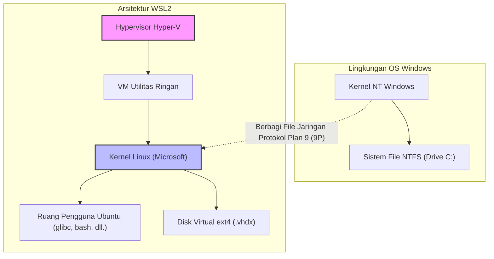
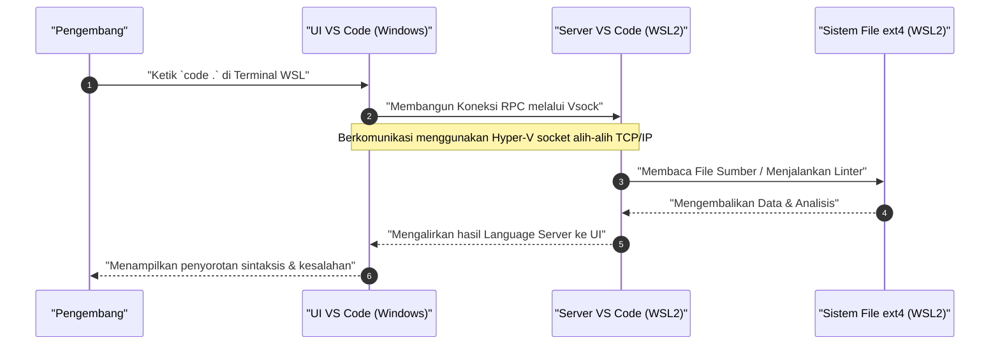

"WSL2 (Windows Subsystem for Linux 2)", yang menyediakan lingkungan pengembangan native Linux di Windows, telah menjadi alat yang sangat penting dalam pengembangan perangkat lunak modern. Namun, ada perbedaan besar dalam kinerja dan pengalaman pengembangan antara menggunakannya dalam status default dan memahaminya serta menyesuaikan arsitekturnya dengan tepat.

Artikel ini membahas segala hal mulai dari penjelasan arsitektur yang menjadi inti dari WSL2, hingga pengaturan untuk memaksimalkan kinerja, membangun lingkungan terminal yang nyaman, integrasi mulus dengan Docker dan VS Code, dan pengaturan jaringan lanjutan. Kami akan menjelaskan secara menyeluruh semua langkah untuk membangun "Lingkungan Pengembangan Ultimate" yang dibutuhkan oleh insinyur profesional dalam volume lebih dari 10.000 karakter.

---

## 1. Arsitektur WSL2 dan Evolusi dari WSL1

Untuk sepenuhnya memaksimalkan potensi WSL2, penting untuk memahami terlebih dahulu struktur internalnya. Pendekatan untuk menjalankan binari Linux di Windows sangat berbeda antara WSL generasi pertama (WSL1) dan WSL2.

### WSL1: Lapisan Konversi Panggilan Sistem
WSL1 mengadopsi mekanisme untuk mengonversi (menerjemahkan) panggilan sistem Linux ke API NT Windows secara real time. Ini memiliki keuntungan berupa overhead sumber daya yang sangat kecil karena tidak menggunakan mesin virtual (VM). Namun, sulit untuk sepenuhnya meniru panggilan sistem yang kompleks seperti operasi I/O sistem file, dan menyebabkan penurunan kinerja yang drastis, terutama pada proses yang menangani sejumlah besar file kecil, seperti `npm install` pada Node.js atau operasi repositori Git.

### WSL2: VM Utilitas Ringan dan Kernel Linux Penuh
Pada WSL2, arsitekturnya telah diperbarui, dan kernel Linux asli yang dibangun oleh Microsoft berjalan secara langsung di atas **"VM Utilitas Ringan" yang menggunakan subset dari arsitektur Hyper-V**. Ini menjamin kompatibilitas 100% untuk panggilan sistem dan secara dramatis meningkatkan kinerja I/O file dibandingkan dengan WSL1 dengan menggunakan disk virtual (VHDX) yang memanfaatkan sistem file ext4 native Linux.

Diagram Mermaid di bawah ini menunjukkan perbedaan struktural antara WSL1 dan WSL2.



Pelajaran penting yang dapat diambil dari struktur ini adalah **"Akses ke file di sisi Linux (di dalam VHDX) sangat cepat, namun akses ke file di sisi Windows (`/mnt/c/`) sangat lambat karena harus melalui protokol 9P"**. Kode sumber proyek harus selalu ditempatkan di bawah direktori home (`~`) pada sisi WSL.

---

## 2. Analisis Matematika Kinerja: Mengapa WSL2 Cepat?

Mari kita evaluasi peningkatan kinerja WSL2 secara kuantitatif menggunakan model matematika. Salah satu operasi yang paling memakan waktu dalam pengembangan perangkat lunak adalah proses yang melibatkan sejumlah besar I/O file (misalnya, menginstal pustaka atau mem-build).

Total waktu eksekusi $T_{total}$ untuk suatu proses dinyatakan sebagai jumlah waktu komputasi oleh CPU $T_{compute}$ dan waktu yang dibutuhkan untuk disk I/O $T_{io}$.

$$ T_{total} = T_{compute} + T_{io} $$

Dalam kasus WSL1, karena ada overhead untuk mengonversi operasi sisi Linux ke operasi NTFS, waktu I/O dimodelkan sebagai berikut. Di sini, $n$ adalah jumlah operasi file, $t_{ntfs\_syscall}$ adalah waktu eksekusi panggilan sistem sisi Windows, dan $t_{trans}$ adalah overhead dari lapisan konversi.

$$ T_{wsl1\_io} = \sum_{i=1}^{n} (t_{ntfs\_syscall_i} + t_{trans_i}) $$

Di sisi lain, pada kasus WSL2, karena kernel mengeluarkan I/O secara langsung ke sistem file ext4, overheadnya hanya berupa penundaan yang sangat kecil $t_{virt}$ akibat virtualisasi.

$$ T_{wsl2\_io} = \sum_{i=1}^{n} (t_{ext4_i} + t_{virt_i}) $$

Pada sistem file umum, karena $t_{ext4} \ll t_{ntfs\_syscall} + t_{trans}$, jika $n$ sangat besar (melakukan puluhan hingga ratusan ribu operasi file), perbedaan waktu I/O antara WSL1 dan WSL2 akan melebar secara eksponensial.

Selain itu, jika rasio overhead komputasi CPU di lingkungan virtualisasi adalah $\rho$, dengan virtualisasi berbantuan perangkat keras terbaru (Intel VT-x / AMD-V), rasio tersebut akan berada pada kisaran $\rho \approx 0.01 \sim 0.03$ (1 hingga 3%). Oleh karena itu, bahkan pada tugas komputasi murni, ia akan memberikan kinerja sebesar $97\% \sim 99\%$ yang sebanding dengan lingkungan native Linux.

---

## 3. Instalasi dan Pembangunan Fondasi

Pada Windows 10/11, instalasi WSL2 telah menjadi sangat sederhana. Cukup buka PowerShell dengan hak administrator dan jalankan perintah berikut.

```powershell
# WSL2 dan Ubuntu akan diinstal secara default
wsl --install

# Jika Anda ingin menentukan distribusi tertentu
# Dapat diperiksa dengan wsl --list --online
wsl --install -d Ubuntu-24.04
```

Setelah penginstalan dan melalui proses restart, Anda akan diminta untuk mengatur nama pengguna dan kata sandi UNIX saat pertama kali dijalankan. Pengguna ini terpisah dari pengguna Windows dan hanya valid di dalam WSL.

Jika Anda sudah menggunakan WSL1, konversikan ke WSL2 dengan perintah berikut.

```powershell
# Mengonversi distribusi yang ada ke WSL2
wsl --set-version Ubuntu 2

# Menjadikan WSL2 sebagai versi default untuk distribusi yang akan ditambahkan di masa mendatang
wsl --set-default-version 2
```

---

## 4. Rahasia Kontrol Sumber Daya: .wslconfig dan wsl.conf

Salah satu jebakan terbesar di WSL2 adalah "konsumsi memori tak terbatas (pembengkakan proses Vmmem)". Karena WSL2 menggunakan cache halaman dari kernel Linux, setiap kali I/O dilakukan, ia akan memakan memori host (Windows) tanpa batas. Untuk mencegah hal ini, perlu dilakukan pembatasan sumber daya melalui file konfigurasi.

File konfigurasi WSL2 dibagi menjadi dua: **`.wslconfig` yang memengaruhi Windows secara keseluruhan**, dan **`wsl.conf` yang memengaruhi internal setiap distribusi**.

### 4.1. .wslconfig (Sisi Windows)

Buat file di direktori profil pengguna Windows (`C:\Users\<Nama Pengguna>\.wslconfig`) untuk mengontrol alokasi sumber daya ke VM.

```ini
# C:\Users\<Nama Pengguna>\.wslconfig
[wsl2]
# Jumlah memori maksimum yang dialokasikan untuk VM. Disarankan sekitar 50% hingga 75% dari total memori host
memory=16GB

# Jumlah core CPU yang digunakan (Jika dihilangkan, semua core akan digunakan)
processors=8

# Ukuran file swap
swap=8GB

# Lokasi penyimpanan file swap (Jika ingin menghemat ruang di drive C)
# swapfile=D:\\wsl\\swap.vhdx

# Aktifkan penerusan localhost (Untuk mengakses WSL melalui localhost dari sisi Windows)
localhostForwarding=true

# Secara otomatis melepaskan memori (Hanya Windows 11)
# Secara dinamis melepaskan cache halaman untuk mencegah pembengkakan Vmmem
autoMemoryReclaim=dropcache

[experimental]
# Fitur jaringan lanjutan tersedia pada Windows 11 22H2 dan lebih baru
# Hal ini memungkinkan dukungan IPv6 dan berbagi alamat IP yang sama antara WSL dan Windows
networkingMode=mirrored
dnsTunneling=true
firewall=true
autoProxy=true
```

### 4.2. wsl.conf (Sisi Linux)

Edit `/etc/wsl.conf` di dalam WSL untuk mengontrol perilaku khusus distribusi.

```ini
# /etc/wsl.conf (Diedit di dalam WSL)
[network]
# Nonaktifkan pembuatan /etc/resolv.conf yang dibuat secara otomatis saat WSL dijalankan
# Berguna jika Anda ingin mengatur DNS kustom (misalnya: 8.8.8.8)
generateResolvConf=false

# Atur nama host kustom
hostname=WSL-DevNode

[automount]
# Pengaturan saat memasang drive Windows
enabled=true
options="metadata,uid=1000,gid=1000,umask=022"
# Ubah titik pemasangan (mount point) drive C dari /mnt/c ke /c (untuk mempersingkat jalur)
root=/

[boot]
# Aktifkan systemd (WSL 0.67.6 atau lebih baru)
# Ini memungkinkan snap dan berbagai daemon (seperti Docker) untuk berjalan secara native
systemd=true

[user]
# Pengguna default untuk login
default=kenji
```

Untuk menerapkan pengaturan ini, Anda perlu menjalankan `wsl --shutdown` di PowerShell untuk menghentikan sepenuhnya VM WSL sebelum menghidupkannya kembali.

---

## 5. Lingkungan Terminal Ultimate: Zsh + Powerlevel10k

Produktivitas tidak akan meningkat jika Anda tetap menggunakan bash bawaan. Kami akan membangun prompt terkuat dengan menggabungkan Zsh, yang menawarkan fitur pelengkapan otomatis dan visibilitas yang kuat, dengan tema super cepat "Powerlevel10k".

### 5.1. Pengenalan dan Pengaturan Windows Terminal
Instal "Windows Terminal" dari Microsoft Store. Buka pengaturan JSON (`settings.json`), tetapkan profil default ke WSL (Ubuntu), dan ubah font menjadi Nerd Font untuk pengembangan (misalnya: `HackGen Console NF` atau `MesloLGS NF`).

### 5.2. Menginstal Zsh dan Oh My Zsh
Jalankan perintah berikut di terminal WSL.

```bash
# Memperbarui paket dan menginstal Zsh
sudo apt update && sudo apt upgrade -y
sudo apt install -y zsh git curl

# Menjalankan skrip instalasi Oh My Zsh
sh -c "$(curl -fsSL https://raw.githubusercontent.com/ohmyzsh/ohmyzsh/master/tools/install.sh)"
```

### 5.3. Menginstal Powerlevel10k dan Plugin
Kami akan memperkenalkan plugin (penyorotan sintaksis dan pelengkapan otomatis input) untuk lebih meningkatkan Zsh, serta tema Powerlevel10k.

```bash
# Powerlevel10k
git clone --depth=1 https://github.com/romkatv/powerlevel10k.git ${ZSH_CUSTOM:-$HOME/.oh-my-zsh/custom}/themes/powerlevel10k

# zsh-autosuggestions
git clone https://github.com/zsh-users/zsh-autosuggestions ${ZSH_CUSTOM:-~/.oh-my-zsh/custom}/plugins/zsh-autosuggestions

# zsh-syntax-highlighting
git clone https://github.com/zsh-users/zsh-syntax-highlighting.git ${ZSH_CUSTOM:-~/.oh-my-zsh/custom}/plugins/zsh-syntax-highlighting
```

Edit `~/.zshrc` untuk mengaktifkan tema dan plugin.

```bash
# Perubahan pada ~/.zshrc
ZSH_THEME="powerlevel10k/powerlevel10k"

# Tambahkan ke array plugin
plugins=(git zsh-autosuggestions zsh-syntax-highlighting)
```

Simpan dan jalankan `source ~/.zshrc`, panduan konfigurasi Powerlevel10k (`p10k configure`) akan dimulai. Ikuti petunjuk di layar untuk menyesuaikan prompt Anda sendiri (gaya prompt, ada/tidaknya ikon, informasi yang ditampilkan, dll.). Nama cabang dan status Git, versi Node.js, waktu eksekusi perintah, dll. akan ditampilkan secara real-time, sehingga secara dramatis meningkatkan efisiensi pengembangan Anda.

---

## 6. VS Code Remote - Integrasi Mulus dengan WSL

Dalam pengembangan menggunakan WSL2, ekstensi "Remote - WSL" adalah mekanisme yang memungkinkan akses mulus ke file di dalam WSL dari IDE (Visual Studio Code) yang diinstal pada sisi Windows.

### Penjelasan Arsitektur

Diagram urutan di bawah ini menunjukkan bagaimana VS Code berkomunikasi dengan WSL2.



VS Code di sisi Windows hanya berfungsi sebagai "klien tipis (UI)", dan semua tugas berat seperti Language Server, debugger, dan eksekusi terminal diproses oleh "VS Code Server" di sisi WSL. Hal ini memungkinkan lingkungan yang bersih hanya di sisi WSL tanpa perlu menginstal Node.js atau Python di sisi Windows.

### Pengaturan VS Code yang Wajib
Instal **"WSL" (ms-vscode-remote.remote-wsl)** dari "Extensions" di VS Code. Setelah itu, cukup pindah ke direktori proyek di terminal WSL dan jalankan `code .`, dan VS Code di sisi Windows akan diluncurkan dengan direktori tersebut terbuka.

**Poin Penting (Masalah Kode Baris Baru):**
Kode baris baru berbeda antara Windows dan Linux (Windows menggunakan `CRLF`, Linux menggunakan `LF`). Saat mengembangkan di WSL, pastikan untuk mengatur pengaturan `core.autocrlf` Git dan pengaturan default file VS Code ke `LF`. Jika Anda mengabaikan hal ini, Anda akan diganggu oleh kesalahan misterius saat menjalankan skrip shell atau kontainer Docker.

```bash
# Pengaturan kode baris baru Git di sisi WSL
git config --global core.autocrlf input
```

Tambahkan juga hal berikut ini ke `settings.json` (pengaturan remote) di VS Code.

```json
{
    "files.eol": "\n",
    "terminal.integrated.defaultProfile.linux": "zsh"
}
```

---

## 7. Optimasi Docker Desktop dan Integrasi WSL2

Ada dua pendekatan utama untuk menggunakan Docker di lingkungan WSL2.

1. Menginstal **Docker Desktop for Windows** dan mengaktifkan fitur integrasi WSL2.
2. Menginstal langsung **Docker Engine Native** di dalam WSL2 (seperti Ubuntu).

### Pendekatan 1: Docker Desktop (Direkomendasikan)
Ini sering kali direkomendasikan karena mudah dikelola dengan GUI dan akses transparan ke kontainer antara Windows dan WSL. Periksa hal-hal berikut dari Pengaturan (Settings) Docker Desktop.

- Centang `General` -> `Use the WSL 2 based engine`.
- Centang `Resources` -> `WSL Integration` -> `Enable integration with my default WSL distro` dan nyalakan tombol geser untuk distribusi (Ubuntu) yang Anda gunakan.

Ini memungkinkan Anda menjalankan perintah `docker` langsung dari terminal WSL2, dan komunikasi dengan daemon Docker akan dialihkan melalui VM ringan khusus (`docker-desktop` dan `docker-desktop-data`) yang dikelola oleh Docker Desktop.

### Pendekatan 2: Pengenalan Langsung Docker Engine Native
Jika Anda memiliki batasan jaringan perusahaan (seperti menghindari versi berbayar Docker Desktop) atau ingin mengurangi overhead kinerja hingga batas ekstrem, aktifkan `systemd` di `/etc/wsl.conf` lalu instal Docker sebagai server Ubuntu murni.

```bash
# Kutipan dari prosedur instalasi resmi Docker di WSL2 Ubuntu dengan systemd diaktifkan
sudo apt-get update
sudo apt-get install ca-certificates curl gnupg
sudo install -m 0755 -d /etc/apt/keyrings
curl -fsSL https://download.docker.com/linux/ubuntu/gpg | sudo gpg --dearmor -o /etc/apt/keyrings/docker.gpg
sudo chmod a+r /etc/apt/keyrings/docker.gpg

# Menambahkan repositori
echo \
  "deb [arch="$(dpkg --print-architecture)" signed-by=/etc/apt/keyrings/docker.gpg] https://download.docker.com/linux/ubuntu \
  "$(. /etc/os-release && echo "$VERSION_CODENAME")" stable" | \
  sudo tee /etc/apt/sources.list.d/docker.list > /dev/null

sudo apt-get update
sudo apt-get install docker-ce docker-ce-cli containerd.io docker-buildx-plugin docker-compose-plugin

# Menambahkan pengguna saat ini ke grup docker (untuk menjalankan tanpa sudo)
sudo usermod -aG docker $USER
```

Setelah restart, `systemctl start docker` akan berfungsi persis seperti di lingkungan Linux native dan menawarkan kinerja yang tinggi.

---

## 8. Integrasi Kunci SSH: Otentikasi Mulus di Windows dan WSL

Saat melakukan kloning SSH dari Git atau koneksi SSH ke server jarak jauh, mengelola kunci SSH secara terpisah di sisi Windows dan sisi WSL sangatlah merepotkan. Untuk menyeimbangkan antara keamanan dan kenyamanan, kami akan mengonfigurasi jembatan untuk menghubungkan agen SSH (atau manajer kata sandi seperti 1Password) yang berjalan di Windows ke sisi WSL.

Di sini, kita akan membahas pendekatan yang paling aman dan modern, yaitu menggunakan **fitur agen SSH 1Password** atau **OpenSSH Authentication Agent dari Windows** dan meneruskannya ke soket domain UNIX WSL2 menggunakan `npiperelay` atau `socat`.

### Penerusan Soket ssh-agent

Biasanya, agen SSH yang disediakan sebagai Named Pipe (pipa bernama) di Windows perlu dikonversi ke file soket di sisi WSL. Anda dapat menggunakan `wsl-ssh-agent` atau fitur yang disediakan oleh 1Password untuk membuatnya lebih mudah.

Di layar pengaturan 1Password, aktifkan "Developer" -> "Gunakan Agen SSH".
Selanjutnya, tambahkan pengaturan berikut ke `~/.zshrc` atau `~/.bashrc` di sisi WSL untuk mengikat soket secara otomatis saat login.

```bash
# Menambahkan ke ~/.zshrc (Contoh jika menggunakan Agen SSH 1Password)
export SSH_AUTH_SOCK=$HOME/.ssh/agent.sock
# Jika soket tidak ada atau proses tidak terikat saat WSL dijalankan, teruskan menggunakan socat dan npiperelay
ALREADY_RUNNING=$(ps -aux | grep "[n]piperelay.exe -ei -s //./pipe/openssh-ssh-agent" | wc -l)
if [ $ALREADY_RUNNING -eq 0 ]; then
    if [ -S $SSH_AUTH_SOCK ]; then
        rm $SSH_AUTH_SOCK
    fi
    # Memulai socat di latar belakang dan menghubungkan Named Pipe di sisi Windows ke soket UNIX di sisi WSL
    (setsid socat UNIX-LISTEN:$SSH_AUTH_SOCK,fork EXEC:"npiperelay.exe -ei -s //./pipe/openssh-ssh-agent",nofork &) >/dev/null 2>&1
fi
```
*Anda harus menginstal `npiperelay.exe` dan menambahkannya ke path di sisi Windows terlebih dahulu.

Setelah pengaturan ini selesai, ketika Anda menjalankan `ssh-add -l` dari terminal WSL, daftar kunci publik dari kunci SSH yang terdaftar di 1Password atau di sisi Windows akan ditampilkan. Dengan demikian, Anda dapat lolos otentikasi dengan aman tanpa harus menyalin file kunci privat ke dalam WSL.

---

## 9. Pemeliharaan: Optimasi (Kompaksi) VHDX yang Membengkak

Salah satu kelemahan terbesar WSL2 adalah bahwa "ukuran file dari disk virtual di sisi Windows (.vhdx) tidak menyusut secara otomatis bahkan jika Anda menghapus image Docker atau menghapus file". Jika Anda terus mengembangkan untuk jangka waktu yang lama, file ext4.vhdx dapat membengkak hingga puluhan atau ratusan GB.

Untuk mengosongkan ruang disk, Anda perlu mengoptimalkan (Compact) VHDX dari sisi Windows secara berkala.

1. Pertama, matikan WSL sepenuhnya.
   ```powershell
   wsl --shutdown
   ```
2. Buka PowerShell dengan hak administrator, dan jalankan perintah `diskpart` di bawah ini, atau perintah `Optimize-VHD` dari modul Hyper-V (yang terakhir hanya dapat digunakan jika Hyper-V diaktifkan).

```powershell
# Jika modul Hyper-V tersedia
Optimize-VHD -Path "$env:LOCALAPPDATA\Packages\CanonicalGroupLimited.Ubuntu_79rhkp1fndgsc\LocalState\ext4.vhdx" -Mode Full

# Jika menggunakan diskpart
diskpart
# Masukkan secara interaktif dalam prompt di bawah ini
DISKPART> select vdisk file="C:\Users\<Nama Pengguna>\AppData\Local\Packages\CanonicalGroupLimited.Ubuntu_79rhkp1fndgsc\LocalState\ext4.vhdx"
DISKPART> attach vdisk readonly
DISKPART> compact vdisk
DISKPART> detach vdisk
DISKPART> exit
```

Dengan melakukan operasi ini secara berkala, Anda bisa memulihkan ruang kosong di drive C yang terbuang percuma.

---

## 10. Penutup

WSL2 telah sepenuhnya melampaui batasan sebagai "sekadar bonus Linux yang berjalan di Windows", dan telah berevolusi menjadi platform pengembangan yang kuat yang tidak kalah, atau bahkan lebih baik dari mesin macOS atau mesin Linux native.

Dengan menerapkan semua pengaturan yang dijelaskan dalam artikel ini (optimasi sumber daya dengan `.wslconfig`, peningkatan terminal dengan Zsh + Powerlevel10k, akses transparan dengan VS Code Remote, serta integrasi SSH dan pemeliharaan VHDX), Anda akan dapat melengkapi "Lingkungan Pengembangan Ultimate" yang bebas stres, cepat, dan aman.

Meskipun membutuhkan sedikit upaya untuk menyiapkan lingkungan tersebut, begitu Anda menetapkan pengaturannya, produktivitas rekayasa perangkat lunak Anda akan meningkat secara dramatis di masa mendatang. Kami harap Anda mengeksplorasi penyesuaian lebih lanjut berdasarkan panduan ini sesuai dengan proyek dan preferensi Anda.
