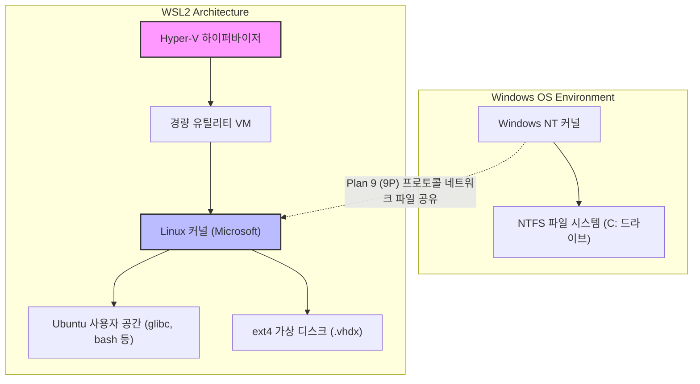
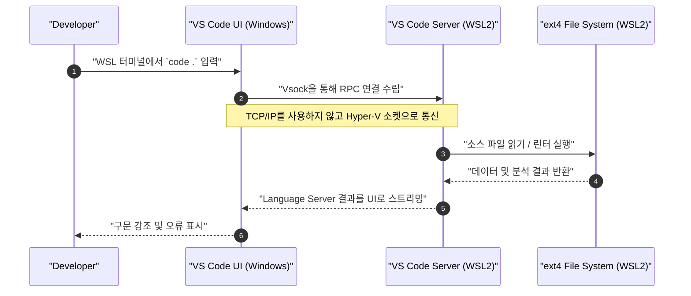

Windows 상에서 Linux 네이티브 개발 환경을 제공하는 'WSL2(Windows Subsystem for Linux 2)'는 현대 소프트웨어 개발에서 필수 불가결한 도구가 되었습니다. 하지만 기본 상태로 계속 사용하는 것과 아키텍처를 이해하고 적절하게 튜닝을 적용하는 것은 성능과 개발 경험에 엄청난 차이를 가져옵니다.

본 문서에서는 WSL2의 근간을 이루는 아키텍처 해설을 시작으로, 성능을 최대한으로 끌어올리기 위한 설정, 쾌적한 터미널 환경 구축, Docker 및 VS Code와의 원활한 연동, 그리고 고급 네트워크 설정까지 전문 엔지니어가 요구하는 '궁극의 개발 환경'을 구축하기 위한 모든 절차를 1만 자 이상의 분량으로 철저하게 해설합니다.

---

## 1. WSL2의 아키텍처와 WSL1으로부터의 진화

WSL2의 잠재력을 완전히 이끌어내기 위해서는 먼저 그 내부 구조를 이해하는 것이 중요합니다. 1세대 WSL(WSL1)과 WSL2는 Linux 바이너리를 Windows 상에서 실행하기 위한 접근 방식이 근본적으로 다릅니다.

### WSL1: 시스템 콜 변환 레이어
WSL1은 Linux의 시스템 콜을 실시간으로 Windows의 NT API로 변환(트랜슬레이션)하는 구조를 채택했습니다. 이는 가상 머신(VM)을 사용하지 않기 때문에 리소스 오버헤드가 매우 적다는 장점이 있었습니다. 하지만 파일 시스템의 I/O 작업 등 복잡한 시스템 콜을 완벽하게 에뮬레이션하기는 어려웠고, 특히 Node.js의 `npm install`이나 Git의 리포지토리 조작 등 다량의 작은 파일을 다루는 처리에서 절망적인 성능 저하를 초래했습니다.

### WSL2: 경량 유틸리티 VM과 완전한 Linux 커널
WSL2에서는 아키텍처가 쇄신되어 **Hyper-V 아키텍처의 서브셋을 이용한 '경량 유틸리티 VM'** 위에서 Microsoft가 빌드한 실제 Linux 커널이 직접 가동되게 되었습니다. 이로써 시스템 콜의 100% 호환성이 보장되었고, Linux 네이티브의 ext4 파일 시스템을 이용한 가상 디스크(VHDX)를 사용함으로써 파일 I/O 성능이 WSL1과 비교하여 극적으로 향상되었습니다.

아래의 Mermaid 다이어그램은 WSL1과 WSL2의 구조적인 차이를 보여줍니다.



이 구조에서 얻을 수 있는 중요한 교훈은 **"Linux 측의 파일(VHDX 내)에 대한 접근은 매우 빠르지만, Windows 측의 파일(`/mnt/c/`)에 대한 접근은 9P 프로토콜을 거치기 때문에 매우 느리다"**는 것입니다. 프로젝트의 소스 코드는 반드시 WSL 측의 홈 디렉토리(`~`) 아래에 배치해야 합니다.

---

## 2. 성능의 수학적 분석: 왜 WSL2는 빠른가?

WSL2의 성능 향상을 수학적인 모델을 사용하여 정량적으로 평가해 보겠습니다. 소프트웨어 개발에서 가장 시간이 많이 걸리는 작업 중 하나가 다량의 파일 I/O를 수반하는 처리(예: 라이브러리 설치나 빌드)입니다.

어떤 처리 전체의 실행 시간 $T_{total}$ 은 CPU에 의한 연산 시간 $T_{compute}$ 와 디스크 I/O에 걸리는 시간 $T_{io}$ 의 합으로 표현됩니다.

$$ T_{total} = T_{compute} + T_{io} $$

WSL1의 경우, Linux 측의 조작을 NTFS의 조작으로 변환하는 오버헤드가 발생하기 때문에, I/O 시간은 다음과 같이 모델링됩니다. 여기서 $n$ 은 파일 조작 횟수, $t_{ntfs\_syscall}$ 은 Windows 측의 시스템 콜 실행 시간, $t_{trans}$ 는 변환 레이어의 오버헤드입니다.

$$ T_{wsl1\_io} = \sum_{i=1}^{n} (t_{ntfs\_syscall_i} + t_{trans_i}) $$

반면, WSL2의 경우 ext4 파일 시스템에 대해 커널이 직접 I/O를 발행하기 때문에, 오버헤드는 가상화로 인한 아주 약간의 지연 $t_{virt}$ 뿐입니다.

$$ T_{wsl2\_io} = \sum_{i=1}^{n} (t_{ext4_i} + t_{virt_i}) $$

일반적인 파일 시스템에서 $t_{ext4} \ll t_{ntfs\_syscall} + t_{trans}$ 이므로, $n$ 이 매우 큰(수만~수십만 개의 파일 조작을 수행하는) 경우 WSL1과 WSL2의 I/O 시간 차이는 지수함수적으로 벌어집니다.

또한, 가상화 환경에서의 CPU 연산 오버헤드 비율을 $\rho$ 라고 하면, 최신 하드웨어 지원 가상화(Intel VT-x / AMD-V)에서는 $\rho \approx 0.01 \sim 0.03$ (1~3%) 정도에 머뭅니다. 따라서 순수한 계산 작업에서도 네이티브 Linux 환경과 손색없는 $97\% \sim 99\%$ 의 성능이 발휘됩니다.

---

## 3. 설치와 기반 구축

Windows 10/11에서는 WSL2의 설치가 매우 간단해졌습니다. 관리자 권한으로 PowerShell을 열고 다음 명령어를 실행하기만 하면 됩니다.

```powershell
# 기본적으로 WSL2와 Ubuntu가 설치됩니다
wsl --install

# 특정 배포판을 지정할 경우
# wsl --list --online 으로 확인 가능
wsl --install -d Ubuntu-24.04
```

설치 후 재부팅을 거쳐 첫 실행 시 UNIX 사용자 이름과 비밀번호 설정을 요구받게 됩니다. 이 사용자는 Windows 사용자와 독립적이며, WSL 내에서만 유효합니다.

이미 WSL1을 사용하고 있는 경우에는 다음 명령어로 WSL2로 변환합니다.

```powershell
# 기존 배포판을 WSL2로 변환
wsl --set-version Ubuntu 2

# 향후 추가할 배포판의 기본값을 WSL2로 설정
wsl --set-default-version 2
```

---

## 4. 리소스 제어의 비결: .wslconfig 와 wsl.conf

WSL2의 가장 큰 함정 중 하나가 '메모리의 무제한 소비(Vmmem 프로세스의 비대화)'입니다. WSL2는 Linux 커널의 페이지 캐시를 이용하기 때문에, I/O를 수행할 때마다 호스트(Windows)의 메모리를 끝없이 잠식해 들어갑니다. 이를 방지하기 위해 설정 파일을 통한 리소스 제한이 필수적입니다.

WSL2의 설정 파일은 **Windows 전체에 영향을 미치는 `.wslconfig`** 와 **각 배포판의 내부에 영향을 미치는 `wsl.conf`** 의 두 가지로 나뉩니다.

### 4.1. .wslconfig (Windows 측)

Windows의 사용자 프로필 디렉토리(`C:\Users\<사용자명>\.wslconfig`)에 파일을 생성하여 VM에 대한 리소스 할당을 제어합니다.

```ini
# C:\Users\<사용자명>\.wslconfig
[wsl2]
# VM에 할당할 최대 메모리 양. 호스트 총 메모리의 50%~75% 정도를 권장
memory=16GB

# 사용할 CPU 코어 수(생략 시 모든 코어 사용)
processors=8

# 스왑 파일의 크기
swap=8GB

# 스왑 파일의 저장 위치(C 드라이브의 용량을 절약하고 싶은 경우)
# swapfile=D:\\wsl\\swap.vhdx

# localhost 포워딩 활성화(Windows 측에서 localhost로 WSL에 접근하기 위해)
localhostForwarding=true

# 메모리를 자동으로 확보(Windows 11 전용)
# 페이지 캐시를 동적으로 해제하여 Vmmem의 비대화를 방지
autoMemoryReclaim=dropcache

[experimental]
# Windows 11 22H2 이후에서 이용 가능한 고급 네트워크 기능
# 이를 통해 IPv6 지원이나, WSL과 Windows 간의 동일한 IP 주소 공유가 가능해짐
networkingMode=mirrored
dnsTunneling=true
firewall=true
autoProxy=true
```

### 4.2. wsl.conf (Linux 측)

WSL 내의 `/etc/wsl.conf` 를 편집하여, 배포판 고유의 동작을 제어합니다.

```ini
# /etc/wsl.conf (WSL 내부에서 편집)
[network]
# WSL 시작 시 자동 생성되는 /etc/resolv.conf 의 생성을 비활성화
# 자체 DNS(예: 8.8.8.8)를 설정하고 싶은 경우에 유용
generateResolvConf=false

# 자체 호스트 이름 설정
hostname=WSL-DevNode

[automount]
# Windows 드라이브를 마운트할 때의 설정
enabled=true
options="metadata,uid=1000,gid=1000,umask=022"
# C 드라이브의 마운트 포인트를 /mnt/c 에서 /c 로 변경(경로를 짧게 하기 위해)
root=/

[boot]
# systemd 활성화(WSL 0.67.6 이후)
# 이를 통해 snap이나 각종 데몬(Docker 등)이 네이티브하게 작동하게 됨
systemd=true

[user]
# 기본으로 로그인할 사용자
default=kenji
```

이러한 설정을 반영하기 위해서는 PowerShell에서 `wsl --shutdown` 을 실행하여, WSL VM을 완전히 정지시킨 후 재시작해야 합니다.

---

## 5. 궁극의 터미널 환경: Zsh + Powerlevel10k

기본 bash 상태로는 생산성이 오르지 않습니다. 강력한 자동 완성 기능과 시인성을 자랑하는 Zsh에, 초고속 테마 'Powerlevel10k'를 결합하여 최강의 프롬프트를 구축합니다.

### 5.1. Windows Terminal 도입과 설정
Microsoft Store에서 'Windows Terminal'을 설치합니다. JSON 설정(`settings.json`)을 열고 기본 프로필을 WSL(Ubuntu)로 설정한 후, 폰트를 개발용 Nerd Font(예: `HackGen Console NF` 나 `MesloLGS NF`)로 변경합니다.

### 5.2. Zsh 및 Oh My Zsh 설치
WSL 터미널에서 다음 명령어를 실행합니다.

```bash
# 패키지 업데이트 및 Zsh 설치
sudo apt update && sudo apt upgrade -y
sudo apt install -y zsh git curl

# Oh My Zsh 설치 스크립트 실행
sh -c "$(curl -fsSL https://raw.githubusercontent.com/ohmyzsh/ohmyzsh/master/tools/install.sh)"
```

### 5.3. Powerlevel10k와 플러그인 도입
Zsh를 더욱 강화하는 플러그인(구문 강조와 입력 자동 완성) 및 Powerlevel10k 테마를 도입합니다.

```bash
# Powerlevel10k
git clone --depth=1 https://github.com/romkatv/powerlevel10k.git ${ZSH_CUSTOM:-$HOME/.oh-my-zsh/custom}/themes/powerlevel10k

# zsh-autosuggestions
git clone https://github.com/zsh-users/zsh-autosuggestions ${ZSH_CUSTOM:-~/.oh-my-zsh/custom}/plugins/zsh-autosuggestions

# zsh-syntax-highlighting
git clone https://github.com/zsh-users/zsh-syntax-highlighting.git ${ZSH_CUSTOM:-~/.oh-my-zsh/custom}/plugins/zsh-syntax-highlighting
```

`~/.zshrc` 를 편집하여, 테마와 플러그인을 활성화합니다.

```bash
# ~/.zshrc의 변경점
ZSH_THEME="powerlevel10k/powerlevel10k"

# 플러그인 배열에 추가
plugins=(git zsh-autosuggestions zsh-syntax-highlighting)
```

저장한 후 `source ~/.zshrc` 를 실행하면, Powerlevel10k 설정 마법사(`p10k configure`)가 시작됩니다. 화면의 지시에 따라 자신이 원하는 형태의 프롬프트(프롬프트 스타일, 아이콘 유무, 표시할 정보 등)로 커스터마이즈하십시오. Git의 브랜치명이나 상태, Node.js 버전, 명령어 실행 시간 등이 실시간으로 표시되어 개발 효율이 비약적으로 향상됩니다.

---

## 6. VS Code Remote - WSL의 원활한 통합

WSL2 환경에서의 개발에 있어, Windows 측에 설치된 IDE(Visual Studio Code)에서 WSL 내의 파일에 매끄럽게 접근하는 구조가 'Remote - WSL' 확장 기능입니다.

### 아키텍처 해설

아래의 시퀀스 다이어그램은 VS Code가 WSL2와 어떻게 통신하는지 보여줍니다.



Windows 측의 VS Code는 단순한 '얇은 클라이언트(UI)'로 기능하며, Language Server, 디버거, 터미널 실행 등의 무거운 처리는 모두 WSL 측의 'VS Code Server'에서 처리됩니다. 이를 통해 Windows 측에 Node.js나 Python을 설치하지 않고도, WSL 측에서만 환경을 깨끗하게 유지할 수 있습니다.

### 필수 VS Code 설정
VS Code의 '확장 기능'에서 **"WSL" (ms-vscode-remote.remote-wsl)** 을 설치합니다. 그 후 WSL의 터미널에서 프로젝트 디렉토리로 이동하여 `code .` 를 실행하기만 하면, 해당 디렉토리가 열린 상태로 Windows 측의 VS Code가 시작됩니다.

**중요한 주의점(줄바꿈 코드 문제):**
Windows와 Linux는 줄바꿈 코드가 다릅니다(Windows는 `CRLF`, Linux는 `LF`). WSL 상에서 개발을 진행할 경우, Git의 `core.autocrlf` 설정이나 VS Code의 파일 기본 설정을 반드시 `LF` 로 통일해야 합니다. 이를 소홀히 하면 쉘 스크립트나 Docker 컨테이너 실행 시 알 수 없는 오류로 고생하게 됩니다.

```bash
# WSL 측에서의 Git 줄바꿈 코드 설정
git config --global core.autocrlf input
```

VS Code의 `settings.json`(원격 설정)에도 다음을 추가합니다.

```json
{
    "files.eol": "\n",
    "terminal.integrated.defaultProfile.linux": "zsh"
}
```

---

## 7. Docker Desktop과 WSL2 Integration 최적화

WSL2 환경에서 Docker를 이용하려면 주로 2가지 접근 방식이 있습니다.

1. **Docker Desktop for Windows** 를 설치하고, WSL2 통합 기능을 활성화한다.
2. WSL2 내부(Ubuntu 등)에 **네이티브 Docker Engine** 을 직접 설치한다.

### 접근 방식 1: Docker Desktop (권장)
GUI를 통한 관리나 Windows/WSL 간의 투명한 컨테이너 접근이 용이하기 때문에, 많은 경우 이 방식이 권장됩니다. Docker Desktop의 설정(Settings)에서 다음을 확인합니다.

- `General` -> `Use the WSL 2 based engine` 에 체크합니다.
- `Resources` -> `WSL Integration` -> `Enable integration with my default WSL distro` 에 체크하고, 토글 버튼으로 사용할 배포판(Ubuntu)을 켭니다.

이를 통해 WSL2의 터미널에서 직접 `docker` 명령어를 실행할 수 있게 되며, Docker 데몬과의 통신은 Docker Desktop이 관리하는 전용 경량 VM(`docker-desktop` 및 `docker-desktop-data`)을 통해 이루어집니다.

### 접근 방식 2: 네이티브 Docker Engine 직접 도입
기업 네트워크의 제약(Docker Desktop 유료화 회피 등)이나 성능 오버헤드를 극한까지 줄이고 싶은 경우에는, `/etc/wsl.conf` 에서 `systemd` 를 활성화한 뒤, 순수한 Ubuntu 서버로서 Docker를 설치합니다.

```bash
# systemd가 활성화된 WSL2 Ubuntu에서의 Docker 공식 설치 절차 발췌
sudo apt-get update
sudo apt-get install ca-certificates curl gnupg
sudo install -m 0755 -d /etc/apt/keyrings
curl -fsSL https://download.docker.com/linux/ubuntu/gpg | sudo gpg --dearmor -o /etc/apt/keyrings/docker.gpg
sudo chmod a+r /etc/apt/keyrings/docker.gpg

# 리포지토리 추가
echo \
  "deb [arch="$(dpkg --print-architecture)" signed-by=/etc/apt/keyrings/docker.gpg] https://download.docker.com/linux/ubuntu \
  "$(. /etc/os-release && echo "$VERSION_CODENAME")" stable" | \
  sudo tee /etc/apt/sources.list.d/docker.list > /dev/null

sudo apt-get update
sudo apt-get install docker-ce docker-ce-cli containerd.io docker-buildx-plugin docker-compose-plugin

# 현재 사용자를 docker 그룹에 추가(sudo 없이 실행하기 위해)
sudo usermod -aG docker $USER
```

재부팅 후, 네이티브 Linux 환경과 완전히 동일하게 `systemctl start docker` 가 작동하며, 높은 성능을 발휘합니다.

---

## 8. SSH 키 통합: Windows와 WSL에서의 원활한 인증

Git의 SSH 클론이나 원격 서버에 SSH 접속을 수행할 때, Windows 측과 WSL 측에서 별도의 SSH 키를 관리하는 것은 매우 번거롭습니다. 보안과 편의성을 양립시키기 위해 Windows 측에서 가동 중인 SSH 에이전트(또는 1Password와 같은 암호 관리자)를 WSL 측에 브릿지하는 설정을 수행합니다.

여기에서는 가장 안전하고 모던한 접근 방식으로, **1Password의 SSH 에이전트 기능** 또는 **Windows의 OpenSSH Authentication Agent** 를 이용하고, `npiperelay` 나 `socat` 을 사용하여 WSL2의 UNIX 도메인 소켓으로 포워딩하는 방법을 설명합니다.

### ssh-agent의 소켓 포워딩

일반적으로 Windows의 Named Pipe(명명된 파이프)로 제공되는 SSH 에이전트를 WSL 측의 소켓 파일로 변환할 필요가 있습니다. `wsl-ssh-agent` 나 1Password가 제공하는 기능을 이용하면 간단합니다.

1Password의 설정 화면에서 'Developer' -> 'SSH 에이전트 사용'을 활성화합니다.
그 다음, WSL 측의 `~/.zshrc` 또는 `~/.bashrc` 에 다음 설정을 추가하여 로그인 시 자동으로 소켓을 바인딩하도록 합니다.

```bash
# ~/.zshrc 에 추가(1Password SSH Agent를 이용할 경우의 예)
export SSH_AUTH_SOCK=$HOME/.ssh/agent.sock
# WSL 시작 시 소켓이 존재하지 않거나, 프로세스가 바인딩되지 않은 경우 socat과 npiperelay를 사용하여 포워드
ALREADY_RUNNING=$(ps -aux | grep "[n]piperelay.exe -ei -s //./pipe/openssh-ssh-agent" | wc -l)
if [ $ALREADY_RUNNING -eq 0 ]; then
    if [ -S $SSH_AUTH_SOCK ]; then
        rm $SSH_AUTH_SOCK
    fi
    # 백그라운드에서 socat을 시작하여, Windows 측의 Named Pipe를 WSL 측의 UNIX 소켓에 연결
    (setsid socat UNIX-LISTEN:$SSH_AUTH_SOCK,fork EXEC:"npiperelay.exe -ei -s //./pipe/openssh-ssh-agent",nofork &) >/dev/null 2>&1
fi
```
※사전에 Windows 측에 `npiperelay.exe` 설치 및 환경 변수(Path) 등록 작업이 필요합니다.

이 설정이 완료되면, WSL 터미널에서 `ssh-add -l` 을 실행했을 때 1Password나 Windows 측에 등록한 SSH 키의 공개키 목록이 표시됩니다. 이를 통해 비밀키 편집을 WSL 내에 복사할 필요 없이 안전하게 인증을 통과할 수 있습니다.

---

## 9. 유지 보수: 비대해진 VHDX 최적화(압축)

WSL2의 가장 큰 단점 중 하나가 "Docker 이미지를 삭제하거나 파일을 삭제해도 Windows 측 가상 디스크(.vhdx)의 파일 크기가 자동으로 축소되지 않는다"는 사양입니다. 장기간 개발을 계속하다 보면 ext4.vhdx 파일이 수십 GB에서 수백 GB까지 부풀어 오릅니다.

디스크 용량을 확보하기 위해서는 주기적으로 Windows 측에서 VHDX를 최적화(Compact)해야 합니다.

1. 먼저, WSL을 완전히 종료합니다.
   ```powershell
   wsl --shutdown
   ```
2. 관리자 권한의 PowerShell을 열고, 다음의 `diskpart` 명령어, 또는 Hyper-V 모듈의 `Optimize-VHD` 명령어를 실행합니다(Hyper-V가 활성화되어 있는 경우에만 후자를 사용할 수 있습니다).

```powershell
# Hyper-V 모듈을 사용할 수 있는 경우
Optimize-VHD -Path "$env:LOCALAPPDATA\Packages\CanonicalGroupLimited.Ubuntu_79rhkp1fndgsc\LocalState\ext4.vhdx" -Mode Full

# diskpart를 사용하는 경우
diskpart
# 아래의 프롬프트에서 대화형으로 입력
DISKPART> select vdisk file="C:\Users\<사용자명>\AppData\Local\Packages\CanonicalGroupLimited.Ubuntu_79rhkp1fndgsc\LocalState\ext4.vhdx"
DISKPART> attach vdisk readonly
DISKPART> compact vdisk
DISKPART> detach vdisk
DISKPART> exit
```

주기적으로 이 작업을 수행함으로써, 낭비되었던 C 드라이브 용량을 되찾을 수 있습니다.

---

## 10. 맺음말

WSL2는 단순한 'Windows 상에서 구동되는 덤으로 주는 Linux'라는 틀을 완전히 넘어서, macOS나 네이티브 Linux 머신 못지않은, 혹은 그 이상의 강력한 개발 플랫폼으로 진화했습니다.

이번에 해설한 설정(`.wslconfig` 를 통한 리소스 최적화, Zsh + Powerlevel10k를 통한 터미널 강화, VS Code Remote를 통한 투명한 접근, 그리고 SSH 연동 및 VHDX 유지 보수)을 모두 적용함으로써, 스트레스 없고 빠르며 안전한 '궁극의 개발 환경'이 완성됩니다.

환경 구축에는 약간 수고가 들어가지만, 한 번 설정을 확립해두면 향후 엔지니어링의 생산성이 극적으로 향상될 것임에 틀림없습니다. 부디 자신의 프로젝트나 취향에 맞춰 이 가이드를 바탕으로 더 나은 커스터마이징을 탐구해 보시기 바랍니다.
