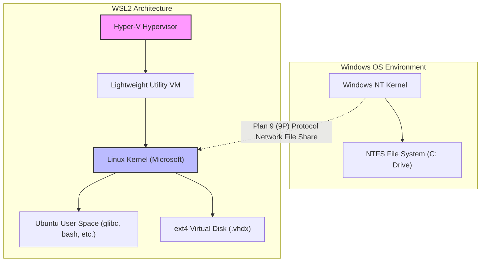
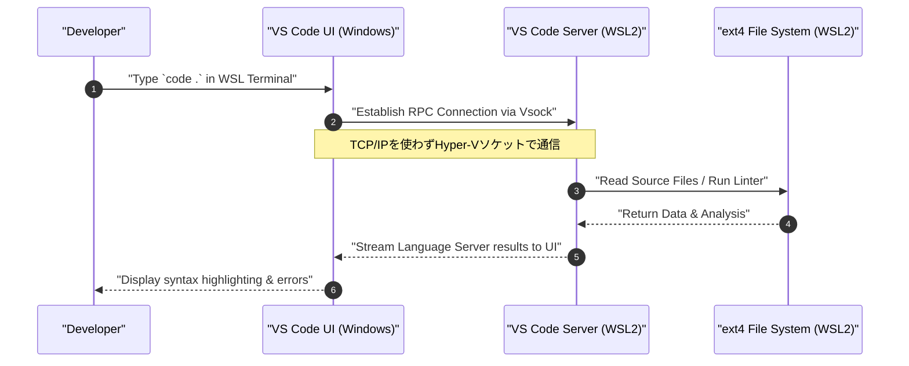

Windows上でLinuxネイティブな開発環境を提供する「WSL2（Windows Subsystem for Linux 2）」は、現代のソフトウェア開発において不可欠なツールとなりました。しかし、デフォルトの状態で使い続けるのと、アーキテクチャを理解して適切にチューニングを施すのとでは、パフォーマンスや開発体験に雲泥の差が生まれます。

本記事では、WSL2の根幹をなすアーキテクチャの解説から始まり、パフォーマンスを最大限に引き出すための設定、快適なターミナル環境の構築、DockerやVS Codeとのシームレスな連携、そして高度なネットワーク設定まで、プロフェッショナルなエンジニアが求める「究極の開発環境」を構築するための全手順を1万文字以上のボリュームで徹底的に解説します。

---

## 1. WSL2のアーキテクチャとWSL1からの進化

WSL2のポテンシャルを完全に引き出すためには、まずその内部構造を理解することが重要です。初代WSL（WSL1）とWSL2では、LinuxバイナリをWindows上で実行するためのアプローチが根本的に異なります。

### WSL1：システムコールの変換レイヤー
WSL1は、LinuxのシステムコールをリアルタイムでWindowsのNT APIに変換（トランスレーション）する仕組みを採用していました。これは仮想マシン（VM）を使用しないため、リソースのオーバーヘッドが非常に小さいという利点がありました。しかし、ファイルシステムのI/O操作など、複雑なシステムコールを完全にエミュレートすることは難しく、特にNode.jsの `npm install` やGitのリポジトリ操作など、大量の小さなファイルを扱う処理において絶望的なパフォーマンスの低下を招いていました。

### WSL2：軽量ユーティリティVMと完全なLinuxカーネル
WSL2ではアーキテクチャが刷新され、**Hyper-Vアーキテクチャのサブセットを利用した「軽量ユーティリティVM」** の上で、Microsoftがビルドした本物のLinuxカーネルが直接稼働するようになりました。これにより、システムコールの100%の互換性が保証され、Linuxネイティブのext4ファイルシステムを利用した仮想ディスク（VHDX）を使用することで、ファイルI/OのパフォーマンスがWSL1と比較して劇的に向上しました。

以下のMermaidダイアグラムは、WSL1とWSL2の構造的な違いを示しています。



この構造から得られる重要な教訓は、**「Linux側のファイル（VHDX内）へのアクセスは極めて高速だが、Windows側のファイル（`/mnt/c/`）へのアクセスは9Pプロトコルを介するため非常に遅い」** ということです。プロジェクトのソースコードは、必ずWSL側のホームディレクトリ（`~`）以下に配置する必要があります。

---

## 2. パフォーマンスの数学的分析：なぜWSL2は速いのか？

WSL2のパフォーマンス向上を、数学的なモデルを用いて定量的に評価してみましょう。ソフトウェアの開発において最も時間がかかる操作の1つが、大量のファイルのI/Oを伴う処理（例：ライブラリのインストールやビルド）です。

ある処理全体の実行時間 $T_{total}$ は、CPUによる演算時間 $T_{compute}$ と、ディスクI/Oにかかる時間 $T_{io}$ の和で表されます。

$$ T_{total} = T_{compute} + T_{io} $$

WSL1の場合、Linux側の操作をNTFSの操作に変換するオーバーヘッドが発生するため、I/O時間は以下のようにモデル化されます。ここで、$n$ はファイル操作の回数、$t_{ntfs\_syscall}$ はWindows側のシステムコール実行時間、$t_{trans}$ は変換レイヤーのオーバーヘッドです。

$$ T_{wsl1\_io} = \sum_{i=1}^{n} (t_{ntfs\_syscall_i} + t_{trans_i}) $$

一方、WSL2の場合、ext4ファイルシステムに対して直接カーネルがI/Oを発行するため、オーバーヘッドは仮想化によるごくわずかな遅延 $t_{virt}$ のみとなります。

$$ T_{wsl2\_io} = \sum_{i=1}^{n} (t_{ext4_i} + t_{virt_i}) $$

一般的なファイルシステムにおいて、$t_{ext4} \ll t_{ntfs\_syscall} + t_{trans}$ であるため、$n$ が非常に大きい（数万〜数十万のファイル操作を行う）場合、WSL1とWSL2のI/O時間の差は指数関数的に開きます。

また、仮想化環境におけるCPU演算のオーバーヘッド比率を $\rho$ とすると、最新のハードウェア支援仮想化（Intel VT-x / AMD-V）では $\rho \approx 0.01 \sim 0.03$ （1〜3%）程度に収まります。したがって、純粋な計算タスクにおいてもネイティブのLinux環境と遜色のない $97\% \sim 99\%$ のパフォーマンスが発揮されます。

---

## 3. インストールと基盤の構築

Windows 10/11では、WSL2のインストールは非常にシンプルになりました。管理者権限でPowerShellを開き、以下のコマンドを実行するだけです。

```powershell
# デフォルトでWSL2とUbuntuがインストールされます
wsl --install

# 特定のディストリビューションを指定する場合
# wsl --list --online で確認可能
wsl --install -d Ubuntu-24.04
```

インストール後、再起動を経て初回起動時にUNIXユーザー名とパスワードの設定を求められます。このユーザーはWindowsのユーザーとは独立しており、WSL内でのみ有効です。

すでにWSL1を使用している場合は、以下のコマンドでWSL2に変換します。

```powershell
# 既存のディストリビューションをWSL2に変換
wsl --set-version Ubuntu 2

# 今後追加するディストリビューションのデフォルトをWSL2にする
wsl --set-default-version 2
```

---

## 4. リソース制御の極意：.wslconfig と wsl.conf

WSL2の最大の罠の1つが「メモリの無制限な消費（Vmmemプロセスの肥大化）」です。WSL2はLinuxカーネルのページキャッシュを利用するため、I/Oを行うたびにホスト（Windows）のメモリを際限なく食い潰していきます。これを防ぐために、設定ファイルによるリソースの制限が必須です。

WSL2の設定ファイルは、**Windows全体に影響する `.wslconfig`** と、**各ディストリビューションの内部に影響する `wsl.conf`** の2つに分かれています。

### 4.1. .wslconfig (Windows側)

Windowsのユーザープロファイルディレクトリ（`C:\Users\<ユーザー名>\.wslconfig`）にファイルを作成し、VMに対するリソース割り当てを制御します。

```ini
# C:\Users\<ユーザー名>\.wslconfig
[wsl2]
# VMに割り当てる最大メモリ量。ホストの総メモリの50%〜75%程度を推奨
memory=16GB

# 使用するCPUコア数（省略時は全コア使用）
processors=8

# スワップファイルのサイズ
swap=8GB

# スワップファイルの保存先（Cドライブの容量を節約したい場合）
# swapfile=D:\\wsl\\swap.vhdx

# localhostのフォワーディングを有効化（Windows側からlocalhostでWSLにアクセスするため）
localhostForwarding=true

# メモリを自動的に解放する（Windows 11のみ）
# ページキャッシュを動的に解放し、Vmmemの肥大化を防ぐ
autoMemoryReclaim=dropcache

[experimental]
# Windows 11 22H2以降で利用可能な高度なネットワーク機能
# これにより、IPv6サポートや、WSLとWindows間の同じIPアドレスの共有が可能になる
networkingMode=mirrored
dnsTunneling=true
firewall=true
autoProxy=true
```

### 4.2. wsl.conf (Linux側)

WSL内の `/etc/wsl.conf` を編集し、ディストリビューション固有の動作を制御します。

```ini
# /etc/wsl.conf (WSL内部で編集)
[network]
# WSL起動時に自動生成される /etc/resolv.conf の生成を無効化する
# 独自のDNS（例: 8.8.8.8）を設定したい場合に有用
generateResolvConf=false

# 独自のホスト名を設定
hostname=WSL-DevNode

[automount]
# Windowsのドライブをマウントする際の設定
enabled=true
options="metadata,uid=1000,gid=1000,umask=022"
# Cドライブのマウントポイントを /mnt/c から /c に変更（パスを短くする）
root=/

[boot]
# systemdを有効化（WSL 0.67.6以降）
# これにより、snapや各種デーモン（Dockerなど）がネイティブに動くようになる
systemd=true

[user]
# デフォルトでログインするユーザー
default=kenji
```

これらの設定を反映させるためには、PowerShellで `wsl --shutdown` を実行し、WSLVMを完全に停止してから再起動する必要があります。

---

## 5. 究極のターミナル環境：Zsh + Powerlevel10k

デフォルトのbashのままでは生産性が上がりません。強力な補完機能と視認性を誇るZshに、超高速なテーマ「Powerlevel10k」を組み合わせて、最強のプロンプトを構築します。

### 5.1. Windows Terminalの導入と設定
Microsoft Storeから「Windows Terminal」をインストールします。JSON設定（`settings.json`）を開き、デフォルトプロファイルをWSL（Ubuntu）に設定し、フォントを開発向けのNerd Font（例: `HackGen Console NF` や `MesloLGS NF`）に変更します。

### 5.2. ZshとOh My Zshのインストール
WSLのターミナルで以下のコマンドを実行します。

```bash
# パッケージの更新とZshのインストール
sudo apt update && sudo apt upgrade -y
sudo apt install -y zsh git curl

# Oh My Zshのインストールスクリプトを実行
sh -c "$(curl -fsSL https://raw.githubusercontent.com/ohmyzsh/ohmyzsh/master/tools/install.sh)"
```

### 5.3. Powerlevel10kとプラグインの導入
Zshをさらに強化するプラグイン（シンタックスハイライトと入力補完）およびPowerlevel10kテーマを導入します。

```bash
# Powerlevel10k
git clone --depth=1 https://github.com/romkatv/powerlevel10k.git ${ZSH_CUSTOM:-$HOME/.oh-my-zsh/custom}/themes/powerlevel10k

# zsh-autosuggestions
git clone https://github.com/zsh-users/zsh-autosuggestions ${ZSH_CUSTOM:-~/.oh-my-zsh/custom}/plugins/zsh-autosuggestions

# zsh-syntax-highlighting
git clone https://github.com/zsh-users/zsh-syntax-highlighting.git ${ZSH_CUSTOM:-~/.oh-my-zsh/custom}/plugins/zsh-syntax-highlighting
```

`~/.zshrc` を編集し、テーマとプラグインを有効化します。

```bash
# ~/.zshrcの変更点
ZSH_THEME="powerlevel10k/powerlevel10k"

# プラグインの配列に追加
plugins=(git zsh-autosuggestions zsh-syntax-highlighting)
```

保存して `source ~/.zshrc` を実行すると、Powerlevel10kの設定ウィザード（`p10k configure`）が起動します。画面の指示に従って、自分好みのプロンプト（プロンプトのスタイル、アイコンの有無、表示する情報など）をカスタマイズしてください。Gitのブランチ名やステータス、Node.jsのバージョン、コマンドの実行時間などがリアルタイムに表示されるようになり、開発効率が飛躍的に向上します。

---

## 6. VS Code Remote - WSLのシームレスな統合

WSL2での開発において、Windows側にインストールされたIDE（Visual Studio Code）からWSL内のファイルにシームレスにアクセスする仕組みが「Remote - WSL」拡張機能です。

### アーキテクチャの解説

以下のシーケンス図は、VS CodeがどのようにWSL2と通信しているかを示しています。



Windows側のVS Codeは単なる「薄いクライアント（UI）」として機能し、Language Server、デバッガ、ターミナル実行などの重い処理はすべてWSL側の「VS Code Server」で処理されます。これにより、Windows側にNode.jsやPythonをインストールすることなく、WSL側だけで環境をクリーンに保つことができます。

### 必須のVS Code設定
VS Codeの「拡張機能」から **"WSL" (ms-vscode-remote.remote-wsl)** をインストールします。その後、WSLのターミナルでプロジェクトディレクトリに移動し、`code .` を実行するだけで、そのディレクトリを開いた状態でWindows側のVS Codeが起動します。

**重要な注意点（改行コード問題）：**
WindowsとLinuxでは改行コードが異なります（Windowsは `CRLF`、Linuxは `LF`）。WSL上で開発を行う場合、Gitの `core.autocrlf` 設定や、VS Codeのファイルのデフォルト設定を必ず `LF` に統一してください。これを怠ると、シェルスクリプトやDockerのコンテナ実行時に謎のエラーに悩まされることになります。

```bash
# WSL側でのGitの改行コード設定
git config --global core.autocrlf input
```

VS Codeの `settings.json`（リモート設定）にも以下を追加します。

```json
{
    "files.eol": "\n",
    "terminal.integrated.defaultProfile.linux": "zsh"
}
```

---

## 7. Docker DesktopとWSL2 Integrationの最適化

WSL2環境でDockerを利用するには、主に2つのアプローチがあります。

1. **Docker Desktop for Windows** をインストールし、WSL2統合機能を有効にする
2. WSL2内部（Ubuntu等）に **ネイティブのDocker Engine** を直接インストールする

### アプローチ1：Docker Desktop（推奨）
GUIでの管理やWindows/WSL間でのコンテナの透過的なアクセスが容易なため、多くの場合こちらが推奨されます。Docker Desktopの設定（Settings）から以下を確認します。

- `General` -> `Use the WSL 2 based engine` にチェックを入れる。
- `Resources` -> `WSL Integration` -> `Enable integration with my default WSL distro` にチェックを入れ、トグルボタンで使用するディストリビューション（Ubuntu）をオンにする。

これにより、WSL2のターミナルから直接 `docker` コマンドが実行できるようになり、Dockerデーモンとの通信はDocker Desktopが管理する専用の軽量VM（`docker-desktop` および `docker-desktop-data`）を通じて行われます。

### アプローチ2：ネイティブDocker Engineの直接導入
企業ネットワークの制約（Docker Desktopの有償化回避など）や、パフォーマンスのオーバーヘッドを極限まで削りたい場合は、`/etc/wsl.conf` で `systemd` を有効にした上で、純粋なUbuntuサーバーとしてDockerをインストールします。

```bash
# systemdが有効なWSL2 UbuntuでのDocker公式インストール手順の抜粋
sudo apt-get update
sudo apt-get install ca-certificates curl gnupg
sudo install -m 0755 -d /etc/apt/keyrings
curl -fsSL https://download.docker.com/linux/ubuntu/gpg | sudo gpg --dearmor -o /etc/apt/keyrings/docker.gpg
sudo chmod a+r /etc/apt/keyrings/docker.gpg

# リポジトリの追加
echo \
  "deb [arch="$(dpkg --print-architecture)" signed-by=/etc/apt/keyrings/docker.gpg] https://download.docker.com/linux/ubuntu \
  "$(. /etc/os-release && echo "$VERSION_CODENAME")" stable" | \
  sudo tee /etc/apt/sources.list.d/docker.list > /dev/null

sudo apt-get update
sudo apt-get install docker-ce docker-ce-cli containerd.io docker-buildx-plugin docker-compose-plugin

# 現在のユーザーをdockerグループに追加（sudoなしで実行するため）
sudo usermod -aG docker $USER
```

再起動後、ネイティブのLinux環境と全く同じように `systemctl start docker` が機能し、高いパフォーマンスを発揮します。

---

## 8. SSHキーの統合：WindowsとWSLでのシームレスな認証

GitのSSHクローンやリモートサーバーへのSSH接続を行う際、Windows側とWSL側で別々のSSHキーを管理するのは非常に手間です。セキュリティと利便性を両立させるため、Windows側で稼働しているSSHエージェント（または1Passwordなどのパスワードマネージャー）をWSL側にブリッジする設定を行います。

ここでは、最もセキュアでモダンなアプローチとして、**1PasswordのSSHエージェント機能** または **WindowsのOpenSSH Authentication Agent** を利用し、`npiperelay` や `socat` を使ってWSL2のUNIXドメインソケットに転送する方法を解説します。

### ssh-agentのソケットフォワーディング

通常、WindowsのNamed Pipe（名前付きパイプ）として提供されるSSHエージェントを、WSL側のソケットファイルに変換する必要があります。`wsl-ssh-agent` や 1Password提供の機能を利用すると簡単です。

1Passwordの設定画面から「Developer」->「SSHエージェントを使用する」を有効にします。
次に、WSL側の `~/.zshrc` または `~/.bashrc` に以下の設定を追記し、ログイン時に自動的にソケットをバインドするようにします。

```bash
# ~/.zshrcへの追記（1Password SSH Agentを利用する場合の例）
export SSH_AUTH_SOCK=$HOME/.ssh/agent.sock
# WSL起動時にソケットが存在しない、またはプロセスがバインドしていない場合にsocatとnpiperelayを使ってフォワード
ALREADY_RUNNING=$(ps -aux | grep "[n]piperelay.exe -ei -s //./pipe/openssh-ssh-agent" | wc -l)
if [ $ALREADY_RUNNING -eq 0 ]; then
    if [ -S $SSH_AUTH_SOCK ]; then
        rm $SSH_AUTH_SOCK
    fi
    # バックグラウンドでsocatを起動し、Windows側のNamed PipeをWSL側のUNIXソケットに接続
    (setsid socat UNIX-LISTEN:$SSH_AUTH_SOCK,fork EXEC:"npiperelay.exe -ei -s //./pipe/openssh-ssh-agent",nofork &) >/dev/null 2>&1
fi
```
※事前にWindows側に `npiperelay.exe` のインストールとパスを通す作業が必要です。

この設定が完了すると、WSLのターミナルから `ssh-add -l` を実行した際に、1PasswordやWindows側で登録したSSHキーの公開鍵一覧が表示されるようになります。これにより、秘密鍵のファイルをWSL内にコピーすることなく、安全に認証をパスできます。

---

## 9. メンテナンス：肥大化したVHDXの最適化（圧縮）

WSL2の最大の欠点の1つが、「Dockerイメージの削除やファイルを削除しても、Windows側の仮想ディスク（.vhdx）のファイルサイズが自動で縮小されない」という仕様です。長期間開発を続けていると、ext4.vhdxファイルが数十GB〜数百GBに膨れ上がります。

ディスク容量を解放するためには、定期的にWindows側からVHDXを最適化（Compact）する必要があります。

1. まず、WSLを完全にシャットダウンします。
   ```powershell
   wsl --shutdown
   ```
2. 管理者権限のPowerShellを開き、以下の `diskpart` コマンド、またはHyper-Vモジュールの `Optimize-VHD` コマンドを実行します（Hyper-Vが有効化されている場合のみ後者が使えます）。

```powershell
# Hyper-Vモジュールが利用可能な場合
Optimize-VHD -Path "$env:LOCALAPPDATA\Packages\CanonicalGroupLimited.Ubuntu_79rhkp1fndgsc\LocalState\ext4.vhdx" -Mode Full

# diskpartを使用する場合
diskpart
# 以下のプロンプト内で対話的に入力
DISKPART> select vdisk file="C:\Users\<ユーザー名>\AppData\Local\Packages\CanonicalGroupLimited.Ubuntu_79rhkp1fndgsc\LocalState\ext4.vhdx"
DISKPART> attach vdisk readonly
DISKPART> compact vdisk
DISKPART> detach vdisk
DISKPART> exit
```

定期的にこの操作を行うことで、無駄に消費されたCドライブの容量を取り戻すことができます。

---

## 10. おわりに

WSL2は、単なる「Windows上で動くオマケのLinux」という枠を完全に超え、MacOSやネイティブLinuxマシンにも劣らない、あるいはそれ以上の強力な開発プラットフォームへと進化しました。

今回解説した設定（`.wslconfig` によるリソース最適化、Zsh + Powerlevel10kによるターミナルの強化、VS Code Remoteによる透過的アクセス、そしてSSH連携やVHDXのメンテナンス）をすべて適用することで、ストレスフリーで高速、かつセキュアな「究極の開発環境」が完成します。

環境構築には少し手間がかかりますが、一度設定を固めてしまえば、今後のエンジニアリングの生産性が劇的に向上することは間違いありません。ぜひ、自身のプロジェクトや好みに合わせて、このガイドをベースにさらなるカスタマイズを探求してみてください。
