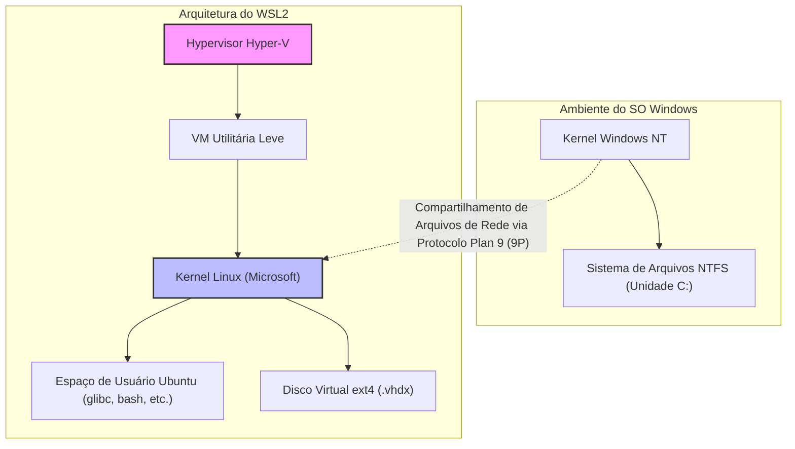
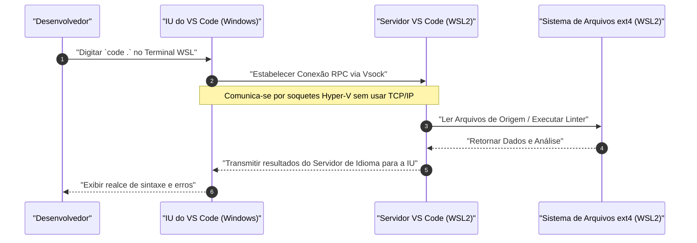

O "WSL2 (Windows Subsystem for Linux 2)", que fornece um ambiente de desenvolvimento nativo do Linux no Windows, tornou-se uma ferramenta indispensável no desenvolvimento de software moderno. No entanto, há uma diferença imensa em desempenho e experiência de desenvolvimento entre usá-lo em seu estado padrão e ajustá-lo adequadamente após entender sua arquitetura.

Neste artigo, explicaremos detalhadamente todo o processo para construir o "ambiente de desenvolvimento definitivo" exigido por engenheiros profissionais. Começando com uma explicação da arquitetura fundamental do WSL2, abordaremos configurações para maximizar o desempenho, a construção de um ambiente de terminal confortável, a integração perfeita com Docker e VS Code, e configurações avançadas de rede.

---

## 1. A Arquitetura do WSL2 e a Evolução a partir do WSL1

Para extrair totalmente o potencial do WSL2, é importante primeiro entender sua estrutura interna. O WSL original (WSL1) e o WSL2 têm abordagens fundamentalmente diferentes para executar binários do Linux no Windows.

### WSL1: Camada de Tradução de Chamadas de Sistema
O WSL1 adotava um mecanismo que traduzia chamadas de sistema do Linux para a API NT do Windows em tempo real. Isso tinha a vantagem de uma sobrecarga de recursos muito baixa, já que não usava uma máquina virtual (VM). No entanto, era difícil emular perfeitamente chamadas de sistema complexas, como operações de E/S do sistema de arquivos, resultando em uma degradação de desempenho terrível ao lidar com um grande número de arquivos pequenos, como `npm install` do Node.js ou operações de repositório do Git.

### WSL2: VM Utilitária Leve e Kernel Linux Completo
No WSL2, a arquitetura foi renovada, e um kernel Linux real construído pela Microsoft agora roda diretamente em uma **"VM utilitária leve" que utiliza um subconjunto da arquitetura Hyper-V**. Isso garante 100% de compatibilidade de chamadas de sistema, e o uso de um disco virtual (VHDX) com o sistema de arquivos ext4 nativo do Linux melhorou drasticamente o desempenho de E/S de arquivos em comparação com o WSL1.

O diagrama Mermaid a seguir mostra as diferenças estruturais entre o WSL1 e o WSL2.



A lição importante a ser tirada dessa estrutura é que **"o acesso aos arquivos no lado do Linux (dentro do VHDX) é extremamente rápido, mas o acesso aos arquivos no lado do Windows (`/mnt/c/`) é muito lento porque passa pelo protocolo 9P"**. O código-fonte do projeto deve ser sempre colocado no diretório inicial (`~`) do lado do WSL.

---

## 2. Análise Matemática do Desempenho: Por que o WSL2 é rápido?

Vamos avaliar quantitativamente a melhoria de desempenho do WSL2 usando um modelo matemático. Uma das operações mais demoradas no desenvolvimento de software é o processamento que envolve E/S de um grande número de arquivos (por exemplo, instalação de bibliotecas e compilação).

O tempo total de execução $T_{total}$ de um determinado processo é expresso como a soma do tempo de computação pela CPU $T_{compute}$ e o tempo de E/S de disco $T_{io}$.

$$ T_{total} = T_{compute} + T_{io} $$

No caso do WSL1, ocorre uma sobrecarga ao converter as operações do lado do Linux em operações NTFS, então o tempo de E/S é modelado da seguinte forma. Aqui, $n$ é o número de operações de arquivo, $t_{ntfs\_syscall}$ é o tempo de execução da chamada de sistema do lado do Windows, e $t_{trans}$ é a sobrecarga da camada de tradução.

$$ T_{wsl1\_io} = \sum_{i=1}^{n} (t_{ntfs\_syscall_i} + t_{trans_i}) $$

Por outro lado, no caso do WSL2, o kernel emite E/S diretamente para o sistema de arquivos ext4, então a sobrecarga é apenas um pequeno atraso $t_{virt}$ devido à virtualização.

$$ T_{wsl2\_io} = \sum_{i=1}^{n} (t_{ext4_i} + t_{virt_i}) $$

Em sistemas de arquivos comuns, como $t_{ext4} \ll t_{ntfs\_syscall} + t_{trans}$, quando $n$ é muito grande (dezenas a centenas de milhares de operações de arquivo), a diferença no tempo de E/S entre o WSL1 e o WSL2 aumenta exponencialmente.

Além disso, assumindo que a taxa de sobrecarga do cálculo da CPU em um ambiente virtualizado seja $\rho$, na virtualização mais recente assistida por hardware (Intel VT-x / AMD-V), ela fica em torno de $\rho \approx 0.01 \sim 0.03$ (1 a 3%). Portanto, mesmo em tarefas puramente computacionais, ele oferece $97\% \sim 99\%$ de desempenho comparável ao de um ambiente Linux nativo.

---

## 3. Instalação e Construção da Base

No Windows 10/11, a instalação do WSL2 tornou-se muito simples. Basta abrir o PowerShell com privilégios de administrador e executar o seguinte comando:

```powershell
# WSL2 e Ubuntu são instalados por padrão
wsl --install

# Ao especificar uma distribuição específica
# Pode ser verificado com wsl --list --online
wsl --install -d Ubuntu-24.04
```

Após a instalação e reinicialização, você será solicitado a configurar um nome de usuário UNIX e senha na primeira inicialização. Esse usuário é independente do usuário do Windows e é válido apenas dentro do WSL.

Se você já estiver usando o WSL1, poderá convertê-lo para o WSL2 com os seguintes comandos:

```powershell
# Converter uma distribuição existente para WSL2
wsl --set-version Ubuntu 2

# Definir o WSL2 como padrão para distribuições adicionadas no futuro
wsl --set-default-version 2
```

---

## 4. Os Segredos do Controle de Recursos: .wslconfig e wsl.conf

Uma das maiores armadilhas do WSL2 é o "consumo ilimitado de memória (inchaço do processo Vmmem)". Como o WSL2 usa o cache de página do kernel Linux, ele consome infinitamente a memória do host (Windows) a cada E/S. Para evitar isso, é essencial limitar os recursos por meio de arquivos de configuração.

Os arquivos de configuração do WSL2 são divididos em dois: **`.wslconfig` que afeta todo o Windows** e **`wsl.conf` que afeta o interior de cada distribuição**.

### 4.1. .wslconfig (Lado do Windows)

Crie um arquivo no diretório de perfil de usuário do Windows (`C:\Users\<NomeDoUsuario>\.wslconfig`) para controlar a alocação de recursos para a VM.

```ini
# C:\Users\<NomeDoUsuario>\.wslconfig
[wsl2]
# Quantidade máxima de memória alocada à VM. Recomenda-se cerca de 50% a 75% da memória total do host
memory=16GB

# Número de núcleos de CPU a serem usados (usa todos os núcleos se omitido)
processors=8

# Tamanho do arquivo de swap
swap=8GB

# Destino de salvamento do arquivo de swap (se desejar economizar espaço na unidade C)
# swapfile=D:\\wsl\\swap.vhdx

# Habilitar o encaminhamento do localhost (para acessar o WSL do lado do Windows através do localhost)
localhostForwarding=true

# Liberar memória automaticamente (Apenas Windows 11)
# Libera dinamicamente o cache de página para evitar o inchaço do Vmmem
autoMemoryReclaim=dropcache

[experimental]
# Recursos avançados de rede disponíveis no Windows 11 22H2 e posteriores
# Isso permite suporte a IPv6 e compartilhamento do mesmo endereço IP entre o WSL e o Windows
networkingMode=mirrored
dnsTunneling=true
firewall=true
autoProxy=true
```

### 4.2. wsl.conf (Lado do Linux)

Edite `/etc/wsl.conf` dentro do WSL para controlar o comportamento específico da distribuição.

```ini
# /etc/wsl.conf (Editado dentro do WSL)
[network]
# Desativa a geração automática de /etc/resolv.conf na inicialização do WSL
# Útil se você deseja definir um DNS personalizado (por exemplo, 8.8.8.8)
generateResolvConf=false

# Define um nome de host personalizado
hostname=WSL-DevNode

[automount]
# Configurações de montagem para unidades do Windows
enabled=true
options="metadata,uid=1000,gid=1000,umask=022"
# Muda o ponto de montagem da unidade C de /mnt/c para /c (encurta o caminho)
root=/

[boot]
# Ativa o systemd (WSL 0.67.6 e posteriores)
# Isso permite que snap e vários daemons (como o Docker) sejam executados nativamente
systemd=true

[user]
# Usuário de login padrão
default=kenji
```

Para aplicar essas configurações, você deve executar `wsl --shutdown` no PowerShell para parar completamente a VM do WSL antes de reiniciar.

---

## 5. O Ambiente de Terminal Definitivo: Zsh + Powerlevel10k

A produtividade não aumentará se você mantiver o bash padrão. Combinaremos o Zsh, que se orgulha de funções poderosas de autocompletar e visibilidade, com o tema ultrarrápido "Powerlevel10k" para construir o prompt mais forte.

### 5.1. Introdução e Configuração do Windows Terminal
Instale o "Windows Terminal" a partir da Microsoft Store. Abra as configurações JSON (`settings.json`), defina o perfil padrão para o WSL (Ubuntu) e altere a fonte para uma Nerd Font focada em desenvolvimento (por exemplo, `HackGen Console NF` ou `MesloLGS NF`).

### 5.2. Instalação do Zsh e Oh My Zsh
Execute os seguintes comandos no terminal do WSL:

```bash
# Atualização de pacotes e instalação do Zsh
sudo apt update && sudo apt upgrade -y
sudo apt install -y zsh git curl

# Executa o script de instalação do Oh My Zsh
sh -c "$(curl -fsSL https://raw.githubusercontent.com/ohmyzsh/ohmyzsh/master/tools/install.sh)"
```

### 5.3. Introdução ao Powerlevel10k e Plugins
Introduziremos plugins (realce de sintaxe e autocompletar) e o tema Powerlevel10k que aprimoram ainda mais o Zsh.

```bash
# Powerlevel10k
git clone --depth=1 https://github.com/romkatv/powerlevel10k.git ${ZSH_CUSTOM:-$HOME/.oh-my-zsh/custom}/themes/powerlevel10k

# zsh-autosuggestions
git clone https://github.com/zsh-users/zsh-autosuggestions ${ZSH_CUSTOM:-~/.oh-my-zsh/custom}/plugins/zsh-autosuggestions

# zsh-syntax-highlighting
git clone https://github.com/zsh-users/zsh-syntax-highlighting.git ${ZSH_CUSTOM:-~/.oh-my-zsh/custom}/plugins/zsh-syntax-highlighting
```

Edite `~/.zshrc` para ativar o tema e os plugins.

```bash
# Alterações em ~/.zshrc
ZSH_THEME="powerlevel10k/powerlevel10k"

# Adicionar ao array de plugins
plugins=(git zsh-autosuggestions zsh-syntax-highlighting)
```

Ao salvar e executar `source ~/.zshrc`, o assistente de configuração do Powerlevel10k (`p10k configure`) será iniciado. Siga as instruções na tela para personalizar o prompt ao seu gosto (estilo do prompt, presença de ícones, informações a serem exibidas, etc.). O nome e o status do branch do Git, a versão do Node.js, o tempo de execução do comando, entre outros, serão exibidos em tempo real, melhorando drasticamente a eficiência do desenvolvimento.

---

## 6. VS Code Remote - Integração Perfeita com o WSL

No desenvolvimento com o WSL2, a extensão "Remote - WSL" é o mecanismo que permite o acesso perfeito aos arquivos dentro do WSL a partir do IDE (Visual Studio Code) instalado no lado do Windows.

### Explicação da Arquitetura

O diagrama de sequência a seguir mostra como o VS Code se comunica com o WSL2.



O VS Code no lado do Windows funciona como um mero "cliente fino (IU)", e todos os processos pesados como Servidor de Linguagem (Language Server), depurador e execução no terminal são tratados pelo "VS Code Server" no lado do WSL. Isso permite que você mantenha seu ambiente limpo usando apenas o lado do WSL, sem ter que instalar o Node.js ou Python no lado do Windows.

### Configurações Essenciais do VS Code
Instale a extensão **"WSL" (ms-vscode-remote.remote-wsl)** a partir de "Extensões" no VS Code. Em seguida, navegue até o diretório do seu projeto no terminal do WSL e simplesmente execute `code .` para iniciar o VS Code no lado do Windows com esse diretório aberto.

**Nota importante (Problema com o código de quebra de linha):**
Windows e Linux usam códigos de quebra de linha diferentes (Windows usa `CRLF`, Linux usa `LF`). Ao desenvolver no WSL, certifique-se de unificar a configuração `core.autocrlf` do Git e as configurações padrão de arquivos do VS Code para `LF`. Se não fizer isso, você poderá sofrer com erros misteriosos ao executar scripts de shell ou contêineres Docker.

```bash
# Configuração do código de quebra de linha do Git no lado do WSL
git config --global core.autocrlf input
```

Adicione também o seguinte ao `settings.json` (configurações remotas) do VS Code:

```json
{
    "files.eol": "\n",
    "terminal.integrated.defaultProfile.linux": "zsh"
}
```

---

## 7. Otimização do Docker Desktop e Integração WSL2

Para usar o Docker no ambiente WSL2, existem principalmente duas abordagens:

1. Instalar o **Docker Desktop for Windows** e ativar o recurso de integração com o WSL2
2. Instalar o **Docker Engine nativo** diretamente dentro do WSL2 (Ubuntu, etc.)

### Abordagem 1: Docker Desktop (Recomendado)
Esta abordagem é recomendada na maioria dos casos porque facilita o gerenciamento via GUI e o acesso transparente a contêineres entre Windows/WSL. Verifique o seguinte nas Configurações (Settings) do Docker Desktop:

- Em `General`, marque a opção `Use the WSL 2 based engine`.
- Em `Resources` -> `WSL Integration`, marque a opção `Enable integration with my default WSL distro` e ligue a chave seletora para a distribuição (Ubuntu) a ser usada.

Isso permite que o comando `docker` seja executado diretamente do terminal do WSL2, e a comunicação com o daemon do Docker ocorra por meio de uma VM leve dedicada (`docker-desktop` e `docker-desktop-data`) gerenciada pelo Docker Desktop.

### Abordagem 2: Instalação Direta do Docker Engine Nativo
Se houver restrições de rede corporativa (como evitar taxas de licenciamento do Docker Desktop) ou se você quiser reduzir ao máximo a sobrecarga de desempenho, ative o `systemd` em `/etc/wsl.conf` e instale o Docker como um servidor Ubuntu puro.

```bash
# Trecho do procedimento oficial de instalação do Docker no Ubuntu WSL2 com systemd ativado
sudo apt-get update
sudo apt-get install ca-certificates curl gnupg
sudo install -m 0755 -d /etc/apt/keyrings
curl -fsSL https://download.docker.com/linux/ubuntu/gpg | sudo gpg --dearmor -o /etc/apt/keyrings/docker.gpg
sudo chmod a+r /etc/apt/keyrings/docker.gpg

# Adição do repositório
echo \
  "deb [arch="$(dpkg --print-architecture)" signed-by=/etc/apt/keyrings/docker.gpg] https://download.docker.com/linux/ubuntu \
  "$(. /etc/os-release && echo "$VERSION_CODENAME")" stable" | \
  sudo tee /etc/apt/sources.list.d/docker.list > /dev/null

sudo apt-get update
sudo apt-get install docker-ce docker-ce-cli containerd.io docker-buildx-plugin docker-compose-plugin

# Adicionar o usuário atual ao grupo docker (para executar sem sudo)
sudo usermod -aG docker $USER
```

Após a reinicialização, o `systemctl start docker` funcionará exatamente como em um ambiente Linux nativo, oferecendo alto desempenho.

---

## 8. Integração da Chave SSH: Autenticação Perfeita entre Windows e WSL

Ao clonar repositórios Git via SSH ou conectar-se a servidores remotos via SSH, é muito trabalhoso gerenciar chaves SSH separadamente nos lados do Windows e do WSL. Para equilibrar segurança e conveniência, configuraremos uma ponte entre o agente SSH em execução no lado do Windows (ou um gerenciador de senhas como o 1Password) e o lado do WSL.

Aqui, explicaremos o método de usar a **funcionalidade de agente SSH do 1Password** ou o **OpenSSH Authentication Agent do Windows** como a abordagem mais segura e moderna, encaminhando-o para o soquete de domínio UNIX do WSL2 usando `npiperelay` e `socat`.

### Encaminhamento de Soquete do ssh-agent

O agente SSH, que normalmente é fornecido como um Named Pipe (pipe nomeado) no Windows, deve ser convertido em um arquivo de soquete no lado do WSL. É fácil fazer isso usando recursos fornecidos pelo `wsl-ssh-agent` ou pelo 1Password.

Na tela de configurações do 1Password, ative "Developer" -> "Usar Agente SSH".
Em seguida, adicione as seguintes configurações ao `~/.zshrc` ou `~/.bashrc` do lado do WSL para vincular automaticamente o soquete ao fazer login.

```bash
# Adição ao ~/.zshrc (Exemplo ao usar o 1Password SSH Agent)
export SSH_AUTH_SOCK=$HOME/.ssh/agent.sock
# Encaminhar usando socat e npiperelay se o soquete não existir ou o processo não estiver vinculado quando o WSL iniciar
ALREADY_RUNNING=$(ps -aux | grep "[n]piperelay.exe -ei -s //./pipe/openssh-ssh-agent" | wc -l)
if [ $ALREADY_RUNNING -eq 0 ]; then
    if [ -S $SSH_AUTH_SOCK ]; then
        rm $SSH_AUTH_SOCK
    fi
    # Inicia o socat em segundo plano e conecta o Named Pipe do lado do Windows ao soquete UNIX do lado do WSL
    (setsid socat UNIX-LISTEN:$SSH_AUTH_SOCK,fork EXEC:"npiperelay.exe -ei -s //./pipe/openssh-ssh-agent",nofork &) >/dev/null 2>&1
fi
```
* É necessário instalar o `npiperelay.exe` no lado do Windows e adicionar seu caminho ao PATH antecipadamente.

Quando essa configuração estiver concluída, a execução de `ssh-add -l` a partir do terminal do WSL exibirá uma lista de chaves públicas das chaves SSH registradas no 1Password ou no lado do Windows. Isso permite que você passe pela autenticação com segurança, sem copiar arquivos de chave privada para dentro do WSL.

---

## 9. Manutenção: Otimização (Compactação) de VHDX Inchado

Uma das maiores falhas do WSL2 é a especificação de que "mesmo se você excluir imagens do Docker ou arquivos, o tamanho do arquivo do disco virtual do lado do Windows (.vhdx) não será reduzido automaticamente". Após um longo período de desenvolvimento, o arquivo ext4.vhdx pode inchar para dezenas a centenas de gigabytes.

Para liberar espaço em disco, você deve otimizar (Compactar) periodicamente o VHDX no lado do Windows.

1. Primeiro, desligue completamente o WSL.
   ```powershell
   wsl --shutdown
   ```
2. Abra o PowerShell com privilégios de administrador e execute o comando `diskpart` a seguir ou o comando `Optimize-VHD` do módulo Hyper-V (o último só pode ser usado se o Hyper-V estiver ativado).

```powershell
# Quando o módulo Hyper-V está disponível
Optimize-VHD -Path "$env:LOCALAPPDATA\Packages\CanonicalGroupLimited.Ubuntu_79rhkp1fndgsc\LocalState\ext4.vhdx" -Mode Full

# Quando usar o diskpart
diskpart
# Digite interativamente no prompt abaixo
DISKPART> select vdisk file="C:\Users\<NomeDoUsuario>\AppData\Local\Packages\CanonicalGroupLimited.Ubuntu_79rhkp1fndgsc\LocalState\ext4.vhdx"
DISKPART> attach vdisk readonly
DISKPART> compact vdisk
DISKPART> detach vdisk
DISKPART> exit
```

Ao executar essa operação regularmente, você pode recuperar o espaço consumido desnecessariamente na unidade C.

---

## 10. Conclusão

O WSL2 transcendeu completamente o quadro de ser apenas um "Linux de bônus rodando no Windows" e evoluiu para uma plataforma de desenvolvimento poderosa que rivaliza ou até supera o MacOS ou máquinas Linux nativas.

Ao aplicar todas as configurações explicadas desta vez (otimização de recursos com `.wslconfig`, aprimoramento de terminal com Zsh + Powerlevel10k, acesso transparente com VS Code Remote e integração SSH e manutenção de VHDX), o "ambiente de desenvolvimento definitivo" livre de estresse, rápido e seguro estará completo.

Demora um pouco para configurar o ambiente, mas uma vez que você consolide suas configurações, não há dúvida de que sua produtividade em engenharia melhorará drasticamente de agora em diante. Sinta-se à vontade para explorar mais personalizações com base neste guia para atender aos seus próprios projetos e preferências.
