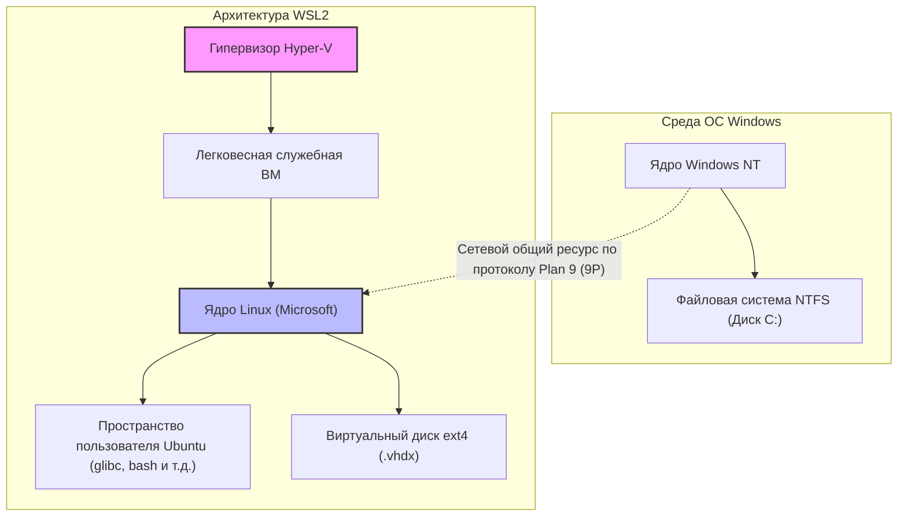
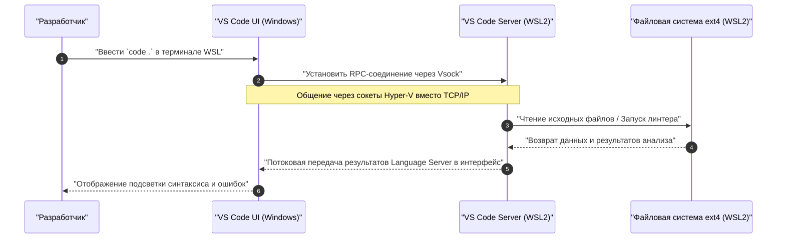

WSL2 (Windows Subsystem for Linux 2), предоставляющая нативную среду разработки Linux в Windows, стала незаменимым инструментом в современной разработке программного обеспечения. Однако существует огромная разница в производительности и удобстве разработки между использованием её по умолчанию и правильной настройкой с пониманием архитектуры.

В этой статье мы подробно, в объёме более 10 000 символов, рассмотрим все этапы создания "идеальной среды разработки", востребованной профессиональными инженерами: начиная с объяснения архитектуры, лежащей в основе WSL2, и заканчивая настройками для максимальной производительности, созданием комфортной терминальной среды, бесшовной интеграцией с Docker и VS Code, а также расширенными сетевыми настройками.

---

## 1. Архитектура WSL2 и эволюция от WSL1

Чтобы полностью раскрыть потенциал WSL2, важно сначала понять её внутреннюю структуру. В оригинальной WSL (WSL1) и WSL2 подходы к запуску бинарных файлов Linux на Windows принципиально отличаются.

### WSL1: Слой трансляции системных вызовов
WSL1 использовала механизм трансляции (перевода) системных вызовов Linux в API Windows NT в реальном времени. Поскольку виртуальная машина (ВМ) не использовалась, преимуществом были очень низкие накладные расходы на ресурсы. Однако было сложно полностью эмулировать сложные системные вызовы, такие как операции ввода-вывода файловой системы, что приводило к катастрофическому падению производительности при обработке большого количества мелких файлов, особенно в таких задачах, как `npm install` в Node.js или операции с репозиториями Git.

### WSL2: Легковесная служебная ВМ и полноценное ядро Linux
В WSL2 архитектура была полностью переработана: теперь настоящее ядро Linux, собранное Microsoft, работает напрямую на **"легковесной служебной ВМ" (Lightweight Utility VM), использующей подмножество архитектуры Hyper-V**. Это гарантирует 100% совместимость системных вызовов, а использование виртуального диска (VHDX) с нативной файловой системой Linux ext4 кардинально повысило производительность файлового ввода-вывода по сравнению с WSL1.

Следующая диаграмма Mermaid показывает структурные различия между WSL1 и WSL2.



Важный урок из этой структуры: **"Доступ к файлам на стороне Linux (внутри VHDX) работает чрезвычайно быстро, но доступ к файлам на стороне Windows (`/mnt/c/`) очень медленный, так как осуществляется через протокол 9P"**. Исходный код проекта обязательно должен располагаться в домашнем каталоге на стороне WSL (`~`).

---

## 2. Математический анализ производительности: Почему WSL2 такая быстрая?

Давайте количественно оценим прирост производительности WSL2 с использованием математической модели. Одной из самых ресурсоемких операций в разработке программного обеспечения является обработка большого количества файлового ввода-вывода (например, установка библиотек или сборка).

Общее время выполнения некоторого процесса $T_{total}$ выражается как сумма времени вычислений процессора $T_{compute}$ и времени дискового ввода-вывода $T_{io}$.

$$ T_{total} = T_{compute} + T_{io} $$

В случае WSL1 возникают накладные расходы на преобразование операций Linux в операции NTFS, поэтому время ввода-вывода моделируется следующим образом. Где $n$ — количество файловых операций, $t_{ntfs\_syscall_i}$ — время выполнения системного вызова на стороне Windows, а $t_{trans_i}$ — накладные расходы слоя трансляции.

$$ T_{wsl1\_io} = \sum_{i=1}^{n} (t_{ntfs\_syscall_i} + t_{trans_i}) $$

С другой стороны, в случае WSL2 ядро напрямую обращается к файловой системе ext4, поэтому накладные расходы составляют лишь незначительную задержку от виртуализации $t_{virt_i}$.

$$ T_{wsl2\_io} = \sum_{i=1}^{n} (t_{ext4_i} + t_{virt_i}) $$

В обычных файловых системах $t_{ext4} \ll t_{ntfs\_syscall} + t_{trans}$, поэтому когда $n$ очень велико (сотни тысяч файловых операций), разница во времени ввода-вывода между WSL1 и WSL2 растет экспоненциально.

Кроме того, если обозначить долю накладных расходов на вычисления CPU в виртуализированной среде как $\rho$, то благодаря современной аппаратной поддержке виртуализации (Intel VT-x / AMD-V) значение $\rho \approx 0.01 \sim 0.03$ (около 1–3%). Следовательно, даже в чисто вычислительных задачах производительность составляет от $97\% \sim 99\%$ и не уступает нативной среде Linux.

---

## 3. Установка и базовая настройка

В Windows 10/11 установка WSL2 стала очень простой. Достаточно открыть PowerShell от имени администратора и выполнить следующую команду.

```powershell
# По умолчанию установит WSL2 и Ubuntu
wsl --install

# Для указания конкретного дистрибутива
# Можно проверить с помощью wsl --list --online
wsl --install -d Ubuntu-24.04
```

После установки и перезагрузки при первом запуске вам будет предложено создать имя пользователя UNIX и пароль. Этот пользователь не зависит от пользователя Windows и действителен только внутри WSL.

Если вы уже используете WSL1, вы можете конвертировать её в WSL2 с помощью следующей команды:

```powershell
# Конвертировать существующий дистрибутив в WSL2
wsl --set-version Ubuntu 2

# Установить WSL2 по умолчанию для новых дистрибутивов
wsl --set-default-version 2
```

---

## 4. Секреты управления ресурсами: .wslconfig и wsl.conf

Одной из главных ловушек WSL2 является "безграничное потребление памяти (разрастание процесса Vmmem)". Поскольку WSL2 использует страничный кэш ядра Linux, каждая операция ввода-вывода безостановочно поглощает память хоста (Windows). Чтобы предотвратить это, обязательно нужно ограничить ресурсы через файлы конфигурации.

Конфигурационные файлы WSL2 разделены на два типа: **`.wslconfig` (влияет на всю Windows)** и **`wsl.conf` (влияет на внутреннюю часть каждого дистрибутива)**.

### 4.1. .wslconfig (на стороне Windows)

Создайте файл в каталоге профиля пользователя Windows (`C:\Users\<Имя_пользователя>\.wslconfig`), чтобы управлять выделением ресурсов для ВМ.

```ini
# C:\Users\<Имя_пользователя>\.wslconfig
[wsl2]
# Максимальный объем памяти, выделяемый ВМ. Рекомендуется около 50%–75% от общей памяти хоста.
memory=16GB

# Количество используемых ядер процессора (если не указано, используются все ядра).
processors=8

# Размер файла подкачки (swap).
swap=8GB

# Расположение файла подкачки (если хотите сэкономить место на диске C).
# swapfile=D:\\wsl\\swap.vhdx

# Включить переадресацию localhost (для доступа к WSL из Windows через localhost).
localhostForwarding=true

# Автоматически освобождать память (только для Windows 11).
# Динамически освобождает страничный кэш, предотвращая разрастание Vmmem.
autoMemoryReclaim=dropcache

[experimental]
# Расширенные сетевые функции, доступные в Windows 11 22H2 и новее.
# Включает поддержку IPv6 и использование одного и того же IP-адреса между WSL и Windows.
networkingMode=mirrored
dnsTunneling=true
firewall=true
autoProxy=true
```

### 4.2. wsl.conf (на стороне Linux)

Отредактируйте `/etc/wsl.conf` внутри WSL, чтобы управлять поведением конкретного дистрибутива.

```ini
# /etc/wsl.conf (Редактируется внутри WSL)
[network]
# Отключить автоматическую генерацию /etc/resolv.conf при запуске WSL.
# Полезно, если вы хотите установить собственный DNS (например, 8.8.8.8).
generateResolvConf=false

# Установить собственное имя хоста.
hostname=WSL-DevNode

[automount]
# Настройки монтирования дисков Windows.
enabled=true
options="metadata,uid=1000,gid=1000,umask=022"
# Изменить точку монтирования диска C с /mnt/c на /c (сокращает пути).
root=/

[boot]
# Включить systemd (WSL 0.67.6 и новее).
# Позволяет нативно запускать snap и различные демоны (например, Docker).
systemd=true

[user]
# Пользователь для входа по умолчанию.
default=kenji
```

Чтобы применить эти настройки, необходимо выполнить команду `wsl --shutdown` в PowerShell, полностью остановить ВМ WSL, а затем перезапустить её.

---

## 5. Идеальная терминальная среда: Zsh + Powerlevel10k

bash по умолчанию не способствует высокой продуктивности. Мы создадим мощную строку приглашения, объединив Zsh, который может похвастаться мощным автодополнением и отличной читаемостью, со сверхбыстрой темой "Powerlevel10k".

### 5.1. Установка и настройка Windows Terminal
Установите "Windows Terminal" из Microsoft Store. Откройте настройки JSON (`settings.json`), установите WSL (Ubuntu) в качестве профиля по умолчанию и измените шрифт на Nerd Font, подходящий для разработки (например, `HackGen Console NF` или `MesloLGS NF`).

### 5.2. Установка Zsh и Oh My Zsh
Выполните следующие команды в терминале WSL:

```bash
# Обновление пакетов и установка Zsh
sudo apt update && sudo apt upgrade -y
sudo apt install -y zsh git curl

# Запуск скрипта установки Oh My Zsh
sh -c "$(curl -fsSL https://raw.githubusercontent.com/ohmyzsh/ohmyzsh/master/tools/install.sh)"
```

### 5.3. Установка Powerlevel10k и плагинов
Мы установим плагины для дальнейшего расширения Zsh (подсветка синтаксиса и автодополнение ввода) и тему Powerlevel10k.

```bash
# Powerlevel10k
git clone --depth=1 https://github.com/romkatv/powerlevel10k.git ${ZSH_CUSTOM:-$HOME/.oh-my-zsh/custom}/themes/powerlevel10k

# zsh-autosuggestions
git clone https://github.com/zsh-users/zsh-autosuggestions ${ZSH_CUSTOM:-~/.oh-my-zsh/custom}/plugins/zsh-autosuggestions

# zsh-syntax-highlighting
git clone https://github.com/zsh-users/zsh-syntax-highlighting.git ${ZSH_CUSTOM:-~/.oh-my-zsh/custom}/plugins/zsh-syntax-highlighting
```

Отредактируйте `~/.zshrc`, чтобы включить тему и плагины:

```bash
# Изменения в ~/.zshrc
ZSH_THEME="powerlevel10k/powerlevel10k"

# Добавьте в массив плагинов
plugins=(git zsh-autosuggestions zsh-syntax-highlighting)
```

Сохраните изменения и выполните `source ~/.zshrc`, запустится мастер настройки Powerlevel10k (`p10k configure`). Следуйте инструкциям на экране, чтобы настроить строку приглашения на свой вкус (стиль приглашения, наличие иконок, отображаемая информация и т.д.). Имя ветки Git и статус, версия Node.js, время выполнения команд будут отображаться в реальном времени, что значительно повысит эффективность разработки.

---

## 6. VS Code Remote - Бесшовная интеграция с WSL

В разработке на WSL2 механизм бесшовного доступа к файлам внутри WSL из IDE (Visual Studio Code), установленной на Windows, обеспечивается расширением "Remote - WSL".

### Объяснение архитектуры

Следующая диаграмма последовательности показывает, как VS Code взаимодействует с WSL2.



VS Code на стороне Windows работает как простой "тонкий клиент (UI)", в то время как все тяжелые процессы, такие как Language Server, отладчик и выполнение терминала, обрабатываются "сервером VS Code" на стороне WSL. Благодаря этому вы можете поддерживать чистоту среды на стороне WSL без необходимости устанавливать Node.js или Python на Windows.

### Обязательные настройки VS Code
Из раздела "Расширения" в VS Code установите **"WSL" (ms-vscode-remote.remote-wsl)**. После этого просто перейдите в директорию вашего проекта в терминале WSL и выполните `code .`, и VS Code на стороне Windows запустится с открытой директорией.

**Важное замечание (проблема символов переноса строки):**
Символы переноса строки в Windows и Linux отличаются (в Windows — `CRLF`, в Linux — `LF`). При разработке в WSL обязательно унифицируйте настройки `core.autocrlf` в Git и настройки файлов по умолчанию в VS Code на `LF`. Игнорирование этого приведет к загадочным ошибкам при выполнении скриптов оболочки или запуске контейнеров Docker.

```bash
# Настройка символов переноса строки Git на стороне WSL
git config --global core.autocrlf input
```

Также добавьте следующее в `settings.json` (Удаленные настройки) VS Code:

```json
{
    "files.eol": "\n",
    "terminal.integrated.defaultProfile.linux": "zsh"
}
```

---

## 7. Docker Desktop и оптимизация интеграции с WSL2

В среде WSL2 существует два основных подхода к использованию Docker:

1. Установить **Docker Desktop for Windows** и включить функцию интеграции WSL2.
2. Установить **нативный Docker Engine** напрямую внутри WSL2 (например, Ubuntu).

### Подход 1: Docker Desktop (рекомендуется)
Этот вариант рекомендуется в большинстве случаев из-за простоты управления через GUI и прозрачного доступа к контейнерам между Windows и WSL. Проверьте следующие настройки (Settings) в Docker Desktop:

- Установите галочку `General` -> `Use the WSL 2 based engine`.
- Перейдите в `Resources` -> `WSL Integration` -> установите галочку на `Enable integration with my default WSL distro` и включите переключатель для используемого дистрибутива (Ubuntu).

Теперь команду `docker` можно будет вызывать прямо из терминала WSL2, а связь с демоном Docker будет осуществляться через специальную легковесную ВМ (`docker-desktop` и `docker-desktop-data`), управляемую Docker Desktop.

### Подход 2: Прямая установка нативного Docker Engine
Если у вас есть корпоративные сетевые ограничения (например, чтобы избежать платы за Docker Desktop) или вы хотите минимизировать накладные расходы до предела, включите `systemd` в `/etc/wsl.conf` и установите Docker напрямую, как на обычном сервере Ubuntu.

```bash
# Фрагмент официальной инструкции по установке Docker для WSL2 Ubuntu с включенным systemd
sudo apt-get update
sudo apt-get install ca-certificates curl gnupg
sudo install -m 0755 -d /etc/apt/keyrings
curl -fsSL https://download.docker.com/linux/ubuntu/gpg | sudo gpg --dearmor -o /etc/apt/keyrings/docker.gpg
sudo chmod a+r /etc/apt/keyrings/docker.gpg

# Добавление репозитория
echo \
  "deb [arch="$(dpkg --print-architecture)" signed-by=/etc/apt/keyrings/docker.gpg] https://download.docker.com/linux/ubuntu \
  "$(. /etc/os-release && echo "$VERSION_CODENAME")" stable" | \
  sudo tee /etc/apt/sources.list.d/docker.list > /dev/null

sudo apt-get update
sudo apt-get install docker-ce docker-ce-cli containerd.io docker-buildx-plugin docker-compose-plugin

# Добавьте текущего пользователя в группу docker (чтобы запускать команды без sudo)
sudo usermod -aG docker $USER
```

После перезагрузки `systemctl start docker` будет работать точно так же, как в нативной среде Linux, обеспечивая высокую производительность.

---

## 8. Интеграция SSH ключей: Бесшовная аутентификация в Windows и WSL

При клонировании через SSH в Git или подключении к удаленным серверам управлять отдельными SSH-ключами для Windows и WSL очень неудобно. Чтобы совместить безопасность и удобство, мы настроим мост (переадресацию) от SSH-агента, работающего на стороне Windows (или менеджера паролей, такого как 1Password), в сторону WSL.

Здесь мы рассмотрим самый современный и безопасный подход: использование **функции SSH-агента 1Password** или **OpenSSH Authentication Agent для Windows** и переадресацию их в UNIX-сокет домена в WSL2 с помощью `npiperelay` и `socat`.

### Переадресация сокета ssh-agent

Обычно SSH-агент в Windows предоставляется как Named Pipe (именованный канал), и его нужно преобразовать в файл сокета для WSL. Это легко сделать с помощью `wsl-ssh-agent` или функций, предлагаемых 1Password.

В настройках 1Password перейдите в "Developer" и включите "Использовать SSH-агент".
Затем добавьте следующие настройки в `~/.zshrc` или `~/.bashrc` на стороне WSL, чтобы автоматически привязывать сокет при входе в систему.

```bash
# Добавление в ~/.zshrc (Пример при использовании SSH-агента 1Password)
export SSH_AUTH_SOCK=$HOME/.ssh/agent.sock
# Если сокет не существует при запуске WSL или процесс не привязан, используйте socat и npiperelay для переадресации
ALREADY_RUNNING=$(ps -aux | grep "[n]piperelay.exe -ei -s //./pipe/openssh-ssh-agent" | wc -l)
if [ $ALREADY_RUNNING -eq 0 ]; then
    if [ -S $SSH_AUTH_SOCK ]; then
        rm $SSH_AUTH_SOCK
    fi
    # Запустите socat в фоновом режиме, чтобы соединить Named Pipe Windows с UNIX-сокетом WSL
    (setsid socat UNIX-LISTEN:$SSH_AUTH_SOCK,fork EXEC:"npiperelay.exe -ei -s //./pipe/openssh-ssh-agent",nofork &) >/dev/null 2>&1
fi
```
*Вам потребуется предварительно установить `npiperelay.exe` в Windows и добавить его в переменную среды PATH.

После завершения настройки при выполнении команды `ssh-add -l` в терминале WSL вы увидите список публичных ключей SSH, зарегистрированных в 1Password или на стороне Windows. Это позволяет безопасно проходить аутентификацию без необходимости копировать файлы секретных ключей внутрь WSL.

---

## 9. Обслуживание: Оптимизация (сжатие) раздутого VHDX

Один из самых больших недостатков WSL2 заключается в том, что "размер файла виртуального диска (.vhdx) в Windows не уменьшается автоматически даже после удаления образов Docker или удаления файлов". В течение длительной разработки размер файла ext4.vhdx может вырасти до десятков или сотен гигабайт.

Чтобы освободить дисковое пространство, необходимо регулярно оптимизировать (Compact) VHDX со стороны Windows.

1. Сначала полностью завершите работу WSL:
   ```powershell
   wsl --shutdown
   ```
2. Откройте PowerShell с правами администратора и выполните следующую команду `diskpart` или команду `Optimize-VHD` из модуля Hyper-V (последняя доступна, только если включен Hyper-V).

```powershell
# Если доступен модуль Hyper-V
Optimize-VHD -Path "$env:LOCALAPPDATA\Packages\CanonicalGroupLimited.Ubuntu_79rhkp1fndgsc\LocalState\ext4.vhdx" -Mode Full

# При использовании diskpart
diskpart
# Введите команды интерактивно в открывшемся окне
DISKPART> select vdisk file="C:\Users\<Имя_пользователя>\AppData\Local\Packages\CanonicalGroupLimited.Ubuntu_79rhkp1fndgsc\LocalState\ext4.vhdx"
DISKPART> attach vdisk readonly
DISKPART> compact vdisk
DISKPART> detach vdisk
DISKPART> exit
```

Регулярно выполняя эту операцию, вы сможете вернуть впустую израсходованное пространство на диске C.

---

## 10. Заключение

WSL2 полностью переросла рамки "просто бонуса Linux для Windows" и превратилась в мощную платформу разработки, не уступающую, а порой и превосходящую MacOS или нативные компьютеры на Linux.

Применив все описанные здесь настройки (оптимизацию ресурсов через `.wslconfig`, улучшение терминала с помощью Zsh + Powerlevel10k, прозрачный доступ с помощью VS Code Remote, а также настройку интеграции SSH и обслуживание VHDX), вы получите "идеальную среду разработки" — быструю, безопасную и не вызывающую стресса.

Настройка среды требует некоторых усилий, но как только всё будет настроено, ваша продуктивность как инженера обязательно возрастет. Не стесняйтесь использовать это руководство в качестве основы и исследовать дальнейшие настройки в соответствии с требованиями ваших проектов и вашими предпочтениями.
