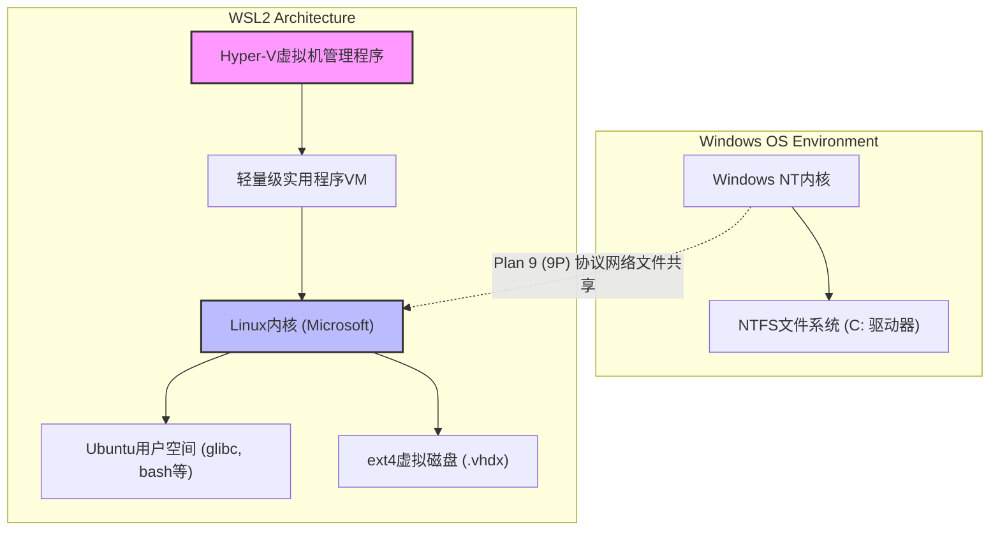
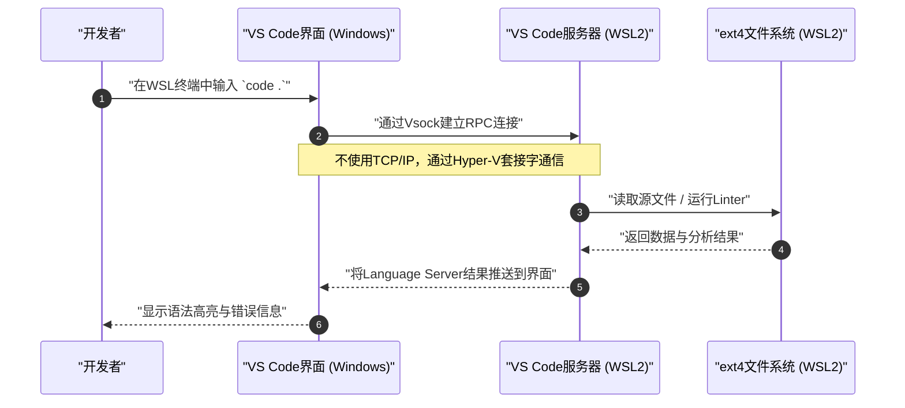

在Windows上提供Linux原生开发环境的“WSL2（Windows Subsystem for Linux 2）”，已经成为现代软件开发中不可或缺的工具。然而，是继续在默认状态下使用，还是在理解架构的基础上进行适当的调优，这在性能和开发体验上将会产生天壤之别。

在本文中，我们将从WSL2核心架构的解析开始，到最大化发挥性能的设置、舒适的终端环境的构建、与Docker和VS Code的无缝协同，以及高级网络配置，以超过1万字的篇幅，彻底为您讲解专业工程师所追求的“终极开发环境”的完整构建步骤。

---

## 1. WSL2的架构与从WSL1的演进

为了完全释放WSL2的潜力，首先理解其内部结构非常重要。初代WSL（WSL1）和WSL2在Windows上执行Linux二进制文件的方法有着根本的不同。

### WSL1：系统调用转换层
WSL1采用了一种将Linux系统调用实时转换（Translation）为Windows NT API的机制。由于它不使用虚拟机（VM），因此具有资源开销非常小的优点。然而，完全模拟文件系统的I/O操作等复杂的系统调用是非常困难的，特别是在处理Node.js的 `npm install` 和Git的仓库操作等涉及大量小文件的任务时，会导致令人绝望的性能下降。

### WSL2：轻量级实用程序VM和完整的Linux内核
WSL2的架构进行了革新，由微软构建的真正Linux内核直接运行在**利用Hyper-V架构子集的“轻量级实用程序VM”**之上。这保证了系统调用100%的兼容性，并且通过使用基于Linux原生的ext4文件系统的虚拟磁盘（VHDX），文件I/O的性能与WSL1相比得到了显著的提升。

下面的Mermaid图表展示了WSL1和WSL2在结构上的差异。



从这个架构中得出的重要教训是，**“对Linux端文件（VHDX内）的访问速度极快，但由于通过9P协议，对Windows端文件（`/mnt/c/`）的访问则非常缓慢”**。项目的源代码必须始终放置在WSL端的个人主目录（`~`）或其子目录下。

---

## 2. 性能的数学分析：为什么WSL2这么快？

让我们使用数学模型来定量评估WSL2的性能提升。在软件开发中，最耗时的操作之一就是涉及大量文件I/O的处理（例如：库的安装和编译）。

某个处理过程的整体执行时间 $T_{total}$，可以表示为CPU运算时间 $T_{compute}$ 与磁盘I/O耗时 $T_{io}$ 的总和。

$$ T_{total} = T_{compute} + T_{io} $$

在WSL1的情况下，由于需要将Linux端的操作转换为NTFS操作而产生开销，因此I/O时间可以建模如下。其中，$n$ 为文件操作的次数，$t_{ntfs\_syscall}$ 为Windows端的系统调用执行时间，$t_{trans}$ 为转换层的开销。

$$ T_{wsl1\_io} = \sum_{i=1}^{n} (t_{ntfs\_syscall_i} + t_{trans_i}) $$

另一方面，在WSL2的情况下，由于内核直接对ext4文件系统发出I/O，因此开销仅为虚拟化带来的极小延迟 $t_{virt}$。

$$ T_{wsl2\_io} = \sum_{i=1}^{n} (t_{ext4_i} + t_{virt_i}) $$

在常规的文件系统中，由于 $t_{ext4} \ll t_{ntfs\_syscall} + t_{trans}$，当 $n$ 非常大（进行数万到数十万次文件操作）时，WSL1和WSL2的I/O时间差将呈指数级拉开。

此外，假设虚拟化环境中CPU运算的开销比率为 $\rho$，在最新的硬件辅助虚拟化（Intel VT-x / AMD-V）下，$\rho \approx 0.01 \sim 0.03$（约1%~3%）。因此，即使在纯粹的计算任务中，也能发挥出与原生Linux环境相差无几的 $97\% \sim 99\%$ 的性能。

---

## 3. 安装与基础构建

在Windows 10/11中，WSL2的安装变得非常简单。只需以管理员权限打开PowerShell，并执行以下命令即可。

```powershell
# 默认会安装WSL2和Ubuntu
wsl --install

# 如果要指定特定的发行版
# 可以通过 wsl --list --online 查看支持的发行版
wsl --install -d Ubuntu-24.04
```

安装并重启后，首次启动时会要求您设置UNIX用户名和密码。该用户与Windows用户是独立的，仅在WSL内有效。

如果您已经在使用了WSL1，可以通过以下命令将其转换为WSL2。

```powershell
# 将现有的发行版转换为WSL2
wsl --set-version Ubuntu 2

# 将以后添加的发行版默认设置为WSL2
wsl --set-default-version 2
```

---

## 4. 资源控制的秘诀：.wslconfig 和 wsl.conf

WSL2最大的陷阱之一就是“内存的无限制消耗（Vmmem进程的膨胀）”。由于WSL2利用了Linux内核的页面缓存，每次进行I/O操作时都会无休止地吞噬主机（Windows）的内存。为了防止这种情况，必须通过配置文件来限制资源。

WSL2的配置文件分为两个：**影响整个Windows的 `.wslconfig`**，以及**影响各发行版内部的 `wsl.conf`**。

### 4.1. .wslconfig (Windows端)

在Windows的用户配置文件夹（`C:\Users\<用户名>\.wslconfig`）中创建文件，以控制对VM的资源分配。

```ini
# C:\Users\<用户名>\.wslconfig
[wsl2]
# 分配给VM的最大内存量。建议为主机总内存的50%~75%左右
memory=16GB

# 使用的CPU核心数（省略时使用全部核心）
processors=8

# 交换文件（Swap）的大小
swap=8GB

# 交换文件的保存位置（如果想要节省C盘空间）
# swapfile=D:\\wsl\\swap.vhdx

# 启用localhost转发（以便从Windows端通过localhost访问WSL）
localhostForwarding=true

# 自动释放内存（仅限Windows 11）
# 动态释放页面缓存，防止Vmmem膨胀
autoMemoryReclaim=dropcache

[experimental]
# Windows 11 22H2及之后版本可用的高级网络功能
# 这使得IPv6支持以及在WSL和Windows之间共享同一个IP地址成为可能
networkingMode=mirrored
dnsTunneling=true
firewall=true
autoProxy=true
```

### 4.2. wsl.conf (Linux端)

编辑WSL内的 `/etc/wsl.conf`，以控制发行版特有的行为。

```ini
# /etc/wsl.conf (在WSL内部编辑)
[network]
# 禁用WSL启动时自动生成的 /etc/resolv.conf
# 在想要设置自定义DNS（例: 8.8.8.8）时非常有用
generateResolvConf=false

# 设置自定义主机名
hostname=WSL-DevNode

[automount]
# 挂载Windows驱动器时的设置
enabled=true
options="metadata,uid=1000,gid=1000,umask=022"
# 将C盘的挂载点从 /mnt/c 更改为 /c（缩短路径）
root=/

[boot]
# 启用systemd（WSL 0.67.6及之后版本）
# 这使得snap和各种守护进程（如Docker等）能够原生运行
systemd=true

[user]
# 默认登录的用户
default=kenji
```

要使这些设置生效，需要在PowerShell中执行 `wsl --shutdown`，完全停止WSL VM后再重新启动。

---

## 5. 终极终端环境：Zsh + Powerlevel10k

仅仅使用默认的bash是无法提高生产力的。将拥有强大补全功能和绝佳可视性的Zsh，与超快的“Powerlevel10k”主题结合，能够打造出最强的命令提示符。

### 5.1. Windows Terminal的安装与设置
从Microsoft Store中安装“Windows Terminal”。打开JSON设置（`settings.json`），将默认配置文件设置为WSL（Ubuntu），并将字体更改为面向开发的Nerd Font（例如：`HackGen Console NF` 或 `MesloLGS NF`）。

### 5.2. Zsh与Oh My Zsh的安装
在WSL终端中执行以下命令。

```bash
# 更新软件包并安装Zsh
sudo apt update && sudo apt upgrade -y
sudo apt install -y zsh git curl

# 执行Oh My Zsh的安装脚本
sh -c "$(curl -fsSL https://raw.githubusercontent.com/ohmyzsh/ohmyzsh/master/tools/install.sh)"
```

### 5.3. Powerlevel10k与插件的安装
安装进一步增强Zsh功能的插件（语法高亮和输入补全）以及Powerlevel10k主题。

```bash
# Powerlevel10k
git clone --depth=1 https://github.com/romkatv/powerlevel10k.git ${ZSH_CUSTOM:-$HOME/.oh-my-zsh/custom}/themes/powerlevel10k

# zsh-autosuggestions
git clone https://github.com/zsh-users/zsh-autosuggestions ${ZSH_CUSTOM:-~/.oh-my-zsh/custom}/plugins/zsh-autosuggestions

# zsh-syntax-highlighting
git clone https://github.com/zsh-users/zsh-syntax-highlighting.git ${ZSH_CUSTOM:-~/.oh-my-zsh/custom}/plugins/zsh-syntax-highlighting
```

编辑 `~/.zshrc`，启用主题和插件。

```bash
# ~/.zshrc的修改点
ZSH_THEME="powerlevel10k/powerlevel10k"

# 添加到插件数组中
plugins=(git zsh-autosuggestions zsh-syntax-highlighting)
```

保存并执行 `source ~/.zshrc` 后，将启动Powerlevel10k的设置向导（`p10k configure`）。请按照屏幕上的指示，自定义您喜欢的提示符（提示符风格、是否有图标、显示的信息等）。Git的分支名及状态、Node.js的版本、命令的执行时间等都能实时显示，开发效率将得到飞跃性提升。

---

## 6. VS Code Remote - WSL的无缝集成

在WSL2开发中，能从Windows端安装的IDE（Visual Studio Code）无缝访问WSL内部文件的机制，就是“Remote - WSL”扩展功能。

### 架构解析

以下的时序图展示了VS Code是如何与WSL2进行通信的。



Windows端的VS Code仅仅作为一个“瘦客户端（UI）”发挥作用，而Language Server、调试器、终端执行等繁重的处理全部由WSL端的“VS Code服务器”来完成。这样一来，无需在Windows端安装Node.js或Python，只需在WSL端即可保持环境的整洁。

### 必备的VS Code设置
从VS Code的“扩展”中安装 **"WSL" (ms-vscode-remote.remote-wsl)**。之后，在WSL终端中进入项目目录，只需执行 `code .`，就能在Windows端以打开该目录的状态启动VS Code。

**重要注意事项（换行符问题）：**
Windows和Linux的换行符不同（Windows是 `CRLF`，Linux是 `LF`）。在WSL上进行开发时，请务必将Git的 `core.autocrlf` 设置以及VS Code中文件的默认设置统一为 `LF`。如果忽略这一点，您在执行Shell脚本或Docker容器时可能会被莫名其妙的错误所困扰。

```bash
# 在WSL端设置Git的换行符
git config --global core.autocrlf input
```

在VS Code的 `settings.json`（远程设置）中也添加以下内容。

```json
{
    "files.eol": "\n",
    "terminal.integrated.defaultProfile.linux": "zsh"
}
```

---

## 7. Docker Desktop与WSL2 Integration的优化

在WSL2环境中使用Docker，主要有两种方式。

1. 安装 **Docker Desktop for Windows**，并启用WSL2集成功能
2. 在WSL2内部（如Ubuntu等）直接安装 **原生的Docker Engine**

### 方式1：Docker Desktop（推荐）
由于在GUI中进行管理以及在Windows/WSL之间进行容器的透明访问更为容易，在大多数情况下推荐使用这种方式。请在Docker Desktop的设置（Settings）中确认以下内容。

- 勾选 `General` -> `Use the WSL 2 based engine`。
- 勾选 `Resources` -> `WSL Integration` -> `Enable integration with my default WSL distro`，并打开要使用的发行版（如Ubuntu）的开关。

如此一来，您就可以直接在WSL2的终端执行 `docker` 命令，与Docker守护进程的通信将通过Docker Desktop管理的专用轻量级VM（`docker-desktop` 以及 `docker-desktop-data`）来进行。

### 方式2：直接安装原生的Docker Engine
由于企业网络的限制（例如规避Docker Desktop的商业收费）或想要将性能开销降到最低的情况，可以在 `/etc/wsl.conf` 中启用 `systemd` 后，像在纯粹的Ubuntu服务器上一样安装Docker。

```bash
# 在启用了systemd的WSL2 Ubuntu上，Docker官方安装步骤的摘要
sudo apt-get update
sudo apt-get install ca-certificates curl gnupg
sudo install -m 0755 -d /etc/apt/keyrings
curl -fsSL https://download.docker.com/linux/ubuntu/gpg | sudo gpg --dearmor -o /etc/apt/keyrings/docker.gpg
sudo chmod a+r /etc/apt/keyrings/docker.gpg

# 添加仓库
echo \
  "deb [arch="$(dpkg --print-architecture)" signed-by=/etc/apt/keyrings/docker.gpg] https://download.docker.com/linux/ubuntu \
  "$(. /etc/os-release && echo "$VERSION_CODENAME")" stable" | \
  sudo tee /etc/apt/sources.list.d/docker.list > /dev/null

sudo apt-get update
sudo apt-get install docker-ce docker-ce-cli containerd.io docker-buildx-plugin docker-compose-plugin

# 将当前用户添加到docker组（以便无需sudo即可运行）
sudo usermod -aG docker $USER
```

重启后，`systemctl start docker` 就能像在原生Linux环境中一样正常运行，并发挥出极高的性能。

---

## 8. SSH密钥的集成：在Windows和WSL中无缝认证

在进行Git的SSH克隆或通过SSH连接远程服务器时，如果在Windows端和WSL端分别管理不同的SSH密钥会非常麻烦。为了兼顾安全性与便利性，我们将进行设置，把运行在Windows端的SSH Agent（或1Password等密码管理器）桥接到WSL端。

在此，我们将讲解一种最安全且现代的方式：利用**1Password的SSH Agent功能**或**Windows的OpenSSH Authentication Agent**，并通过 `npiperelay` 和 `socat` 将其转发到WSL2的UNIX域套接字的方法。

### ssh-agent的套接字转发

通常，作为Windows命名管道（Named Pipe）提供的SSH Agent，需要转换为WSL端的套接字文件。利用 `wsl-ssh-agent` 或1Password提供的功能可以很轻松地实现。

在1Password的设置界面中，启用“开发人员” -> “使用 SSH 代理”。
然后，在WSL端的 `~/.zshrc` 或 `~/.bashrc` 中添加以下设置，以便在登录时自动绑定套接字。

```bash
# 追加到 ~/.zshrc（使用1Password SSH Agent时的示例）
export SSH_AUTH_SOCK=$HOME/.ssh/agent.sock
# 如果WSL启动时套接字不存在，或进程未绑定，则使用socat和npiperelay进行转发
ALREADY_RUNNING=$(ps -aux | grep "[n]piperelay.exe -ei -s //./pipe/openssh-ssh-agent" | wc -l)
if [ $ALREADY_RUNNING -eq 0 ]; then
    if [ -S $SSH_AUTH_SOCK ]; then
        rm $SSH_AUTH_SOCK
    fi
    # 在后台启动socat，将Windows端的Named Pipe连接到WSL端的UNIX套接字
    (setsid socat UNIX-LISTEN:$SSH_AUTH_SOCK,fork EXEC:"npiperelay.exe -ei -s //./pipe/openssh-ssh-agent",nofork &) >/dev/null 2>&1
fi
```
※需要事先在Windows端安装 `npiperelay.exe` 并配置好环境变量路径。

此设置完成后，从WSL终端执行 `ssh-add -l` 时，就会显示在1Password或Windows端注册的SSH公钥列表。这样一来，无需将私钥文件复制到WSL内，也能安全地通过认证。

---

## 9. 维护：膨胀的VHDX的优化（压缩）

WSL2最大的缺点之一就是其设计机制：“即使删除了Docker镜像或文件，Windows端的虚拟磁盘（.vhdx）的文件大小也不会自动缩小”。如果长时间进行开发，ext4.vhdx文件可能会膨胀到几十GB甚至几百GB。

为了释放磁盘空间，需要定期从Windows端对VHDX进行优化（Compact）。

1. 首先，完全关闭WSL。
   ```powershell
   wsl --shutdown
   ```
2. 以管理员权限打开PowerShell，执行以下 `diskpart` 命令，或使用Hyper-V模块的 `Optimize-VHD` 命令（仅在启用了Hyper-V的情况下才能使用后者）。

```powershell
# 如果Hyper-V模块可用
Optimize-VHD -Path "$env:LOCALAPPDATA\Packages\CanonicalGroupLimited.Ubuntu_79rhkp1fndgsc\LocalState\ext4.vhdx" -Mode Full

# 如果使用diskpart
diskpart
# 在以下提示符中进行交互式输入
DISKPART> select vdisk file="C:\Users\<用户名>\AppData\Local\Packages\CanonicalGroupLimited.Ubuntu_79rhkp1fndgsc\LocalState\ext4.vhdx"
DISKPART> attach vdisk readonly
DISKPART> compact vdisk
DISKPART> detach vdisk
DISKPART> exit
```

定期执行此操作，可以收回C盘被白白浪费的容量。

---

## 10. 结语

WSL2已经完全超越了单纯“作为Windows上附赠的Linux”这一范畴，进化成了一个不亚于甚至超越macOS或原生Linux机器的强大开发平台。

只要全面应用本文所讲解的这些设置（通过 `.wslconfig` 进行资源优化、使用Zsh + Powerlevel10k增强终端、通过VS Code Remote实现透明访问，以及SSH集成和VHDX的维护），就能构建出一个零压力、高速且安全的“终极开发环境”。

虽然环境配置需要花费一点心思，但一旦设置妥当，毫无疑问将极大地提升您今后的工程生产力。请务必以本指南为基础，结合您自己的项目和喜好，探索出更多的定制可能。
