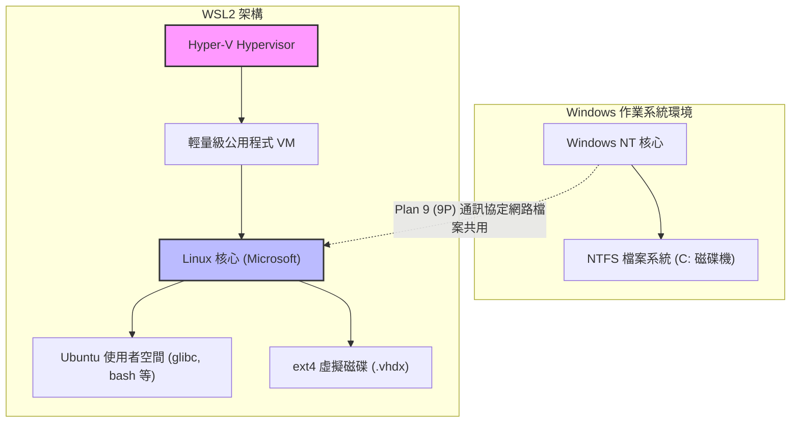
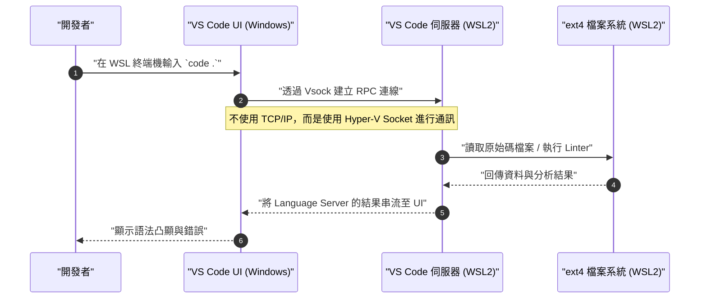

在 Windows 上提供原生 Linux 開發環境的「WSL2（Windows Subsystem for Linux 2）」已成為現代軟體開發中不可或缺的工具。然而，維持預設狀態使用，與了解架構並進行適當的調校相比，兩者在效能和開發體驗上會有天壤之別。

本文將從 WSL2 核心的架構解說開始，徹底解說能將效能發揮到極致的設定、建構舒適的終端機環境、與 Docker 和 VS Code 的無縫整合，以及進階的網路設定。為了建構專業工程師所追求的「終極開發環境」，我們將以超過一萬字以上的篇幅為您詳細說明所有的步驟。

---

## 1. WSL2 的架構與自 WSL1 的進化

為了完全發揮 WSL2 的潛力，首先必須了解其內部結構。第一代 WSL（WSL1）與 WSL2 在 Windows 上執行 Linux 二進位檔案的方法有著根本上的差異。

### WSL1：系統呼叫的轉換層
WSL1 採用了將 Linux 的系統呼叫即時轉換（Translation）為 Windows NT API 的機制。由於不使用虛擬機器（VM），這項作法具有資源負擔極小的優點。然而，要完全模擬檔案系統的 I/O 操作等複雜系統呼叫相當困難，特別是在執行 Node.js 的 `npm install` 或是 Git 的版本庫操作等處理大量小檔案的作業時，會導致效能出現絕望性的下降。

### WSL2：輕量級公用程式 VM 與完整的 Linux 核心
WSL2 重新設計了架構，在**利用 Hyper-V 架構子集的「輕量級公用程式 VM」** 上，直接執行由 Microsoft 建置的真正 Linux 核心。這確保了系統呼叫 100% 的相容性，並透過使用採用 Linux 原生 ext4 檔案系統的虛擬磁碟（VHDX），檔案 I/O 效能與 WSL1 相比有了戲劇性的提升。

以下的 Mermaid 圖表展示了 WSL1 與 WSL2 的結構差異。



從這個結構中獲得的重要教訓是，**「對 Linux 側的檔案（VHDX 內部）存取速度極快，但對 Windows 側的檔案（`/mnt/c/`）存取因為需要透過 9P 通訊協定而非常緩慢」**。專案的原始碼必須一律放置於 WSL 側的主目錄（`~`）之下。

---

## 2. 效能的數學分析：為什麼 WSL2 這麼快？

讓我們試著使用數學模型來定量評估 WSL2 的效能提升。在軟體開發中，最耗時的操作之一就是伴隨大量檔案 I/O 的處理程序（例如：安裝函式庫或建置）。

某個處理程序的總執行時間 $T_{total}$，可以表示為 CPU 運算時間 $T_{compute}$ 與磁碟 I/O 所需時間 $T_{io}$ 的總和。

$$ T_{total} = T_{compute} + T_{io} $$

在 WSL1 的情況下，由於會產生將 Linux 側的操作轉換為 NTFS 操作的負擔，因此 I/O 時間可以用以下模型表示。其中，$n$ 為檔案操作的次數，$t_{ntfs\_syscall}$ 為 Windows 側系統呼叫的執行時間，$t_{trans}$ 為轉換層的負擔。

$$ T_{wsl1\_io} = \sum_{i=1}^{n} (t_{ntfs\_syscall_i} + t_{trans_i}) $$

另一方面，在 WSL2 的情況下，因為核心會直接對 ext4 檔案系統發出 I/O，負擔僅有虛擬化造成的極微小延遲 $t_{virt}$。

$$ T_{wsl2\_io} = \sum_{i=1}^{n} (t_{ext4_i} + t_{virt_i}) $$

在一般的檔案系統中，因為 $t_{ext4} \ll t_{ntfs\_syscall} + t_{trans}$，當 $n$ 非常大（執行數萬到數十萬次的檔案操作）時，WSL1 與 WSL2 的 I/O 時間差距會呈指數級別拉開。

此外，若將虛擬化環境中 CPU 運算負擔的比例設為 $\rho$，在最新的硬體輔助虛擬化（Intel VT-x / AMD-V）下，$\rho \approx 0.01 \sim 0.03$（大約 1% 到 3%）。因此，即使在純粹的運算任務中，也能發揮出毫不遜色於原生 Linux 環境的 $97\% \sim 99\%$ 效能。

---

## 3. 安裝與基底建構

在 Windows 10/11 中，WSL2 的安裝變得非常簡單。只要以系統管理員權限開啟 PowerShell，並執行以下指令即可。

```powershell
# 預設將安裝 WSL2 與 Ubuntu
wsl --install

# 若要指定特定的發行版
# 可透過 wsl --list --online 進行確認
wsl --install -d Ubuntu-24.04
```

安裝後經過重新啟動，首次啟動時會要求設定 UNIX 的使用者名稱與密碼。這個使用者與 Windows 的使用者是獨立的，僅在 WSL 內部有效。

如果您已經在使用 WSL1，請使用以下指令轉換為 WSL2。

```powershell
# 將現有的發行版轉換為 WSL2
wsl --set-version Ubuntu 2

# 將未來新增的發行版預設為 WSL2
wsl --set-default-version 2
```

---

## 4. 資源控制的秘訣：.wslconfig 與 wsl.conf

WSL2 最大的陷阱之一就是「無限制地消耗記憶體（Vmmem 處理程序過度膨脹）」。由於 WSL2 會使用 Linux 核心的分頁快取（Page Cache），每次進行 I/O 操作都會無止盡地耗盡主機（Windows）的記憶體。為了防止這種情況，必須透過設定檔來限制資源。

WSL2 的設定檔分為兩個：**會影響整個 Windows 的 `.wslconfig`**，以及**會影響各個發行版內部的 `wsl.conf`**。

### 4.1. .wslconfig (Windows 側)

在 Windows 的使用者設定檔目錄（`C:\Users\<使用者名稱>\.wslconfig`）建立檔案，並控制配置給 VM 的資源。

```ini
# C:\Users\<使用者名稱>\.wslconfig
[wsl2]
# 分配給 VM 的最大記憶體量。建議為主機總記憶體的 50% 到 75% 左右
memory=16GB

# 使用的 CPU 核心數（省略時將使用全部核心）
processors=8

# 交換檔案（Swap file）的大小
swap=8GB

# 交換檔案的儲存位置（如果想節省 C 磁碟機空間的話）
# swapfile=D:\\wsl\\swap.vhdx

# 啟用 localhost 轉發（為了從 Windows 側透過 localhost 存取 WSL）
localhostForwarding=true

# 自動釋放記憶體（僅限 Windows 11）
# 動態釋放分頁快取，防止 Vmmem 過度膨脹
autoMemoryReclaim=dropcache

[experimental]
# Windows 11 22H2 之後可用的進階網路功能
# 藉此可以支援 IPv6，以及讓 WSL 與 Windows 之間共用同一個 IP 位址
networkingMode=mirrored
dnsTunneling=true
firewall=true
autoProxy=true
```

### 4.2. wsl.conf (Linux 側)

編輯 WSL 內的 `/etc/wsl.conf`，以控制發行版專屬的行為。

```ini
# /etc/wsl.conf (在 WSL 內部編輯)
[network]
# 停用 WSL 啟動時自動產生的 /etc/resolv.conf
# 如果想設定自訂的 DNS（例如：8.8.8.8）時會很有用
generateResolvConf=false

# 設定自訂的主機名稱
hostname=WSL-DevNode

[automount]
# 掛載 Windows 磁碟機時的設定
enabled=true
options="metadata,uid=1000,gid=1000,umask=022"
# 將 C 磁碟機的掛載點從 /mnt/c 變更為 /c（縮短路徑）
root=/

[boot]
# 啟用 systemd（WSL 0.67.6 之後）
# 藉此，snap 與各種守護行程（如 Docker 等）就能原生執行
systemd=true

[user]
# 預設登入的使用者
default=kenji
```

為了讓這些設定生效，必須在 PowerShell 執行 `wsl --shutdown`，完全停止 WSLVM 後再重新啟動。

---

## 5. 終極的終端機環境：Zsh + Powerlevel10k

如果繼續使用預設的 bash，生產力將無法提升。結合擁有強大自動補齊功能與高可視性的 Zsh，以及超快速的主題「Powerlevel10k」，來建構最強的命令提示字元（Prompt）。

### 5.1. 安裝與設定 Windows Terminal
從 Microsoft Store 安裝「Windows Terminal」。開啟 JSON 設定檔（`settings.json`），將預設設定檔設定為 WSL（Ubuntu），並將字型變更為適合開發的 Nerd Font（例如：`HackGen Console NF` 或 `MesloLGS NF`）。

### 5.2. 安裝 Zsh 與 Oh My Zsh
在 WSL 的終端機執行以下指令。

```bash
# 更新套件並安裝 Zsh
sudo apt update && sudo apt upgrade -y
sudo apt install -y zsh git curl

# 執行 Oh My Zsh 安裝指令碼
sh -c "$(curl -fsSL https://raw.githubusercontent.com/ohmyzsh/ohmyzsh/master/tools/install.sh)"
```

### 5.3. 匯入 Powerlevel10k 與外掛程式
匯入能進一步強化 Zsh 的外掛程式（語法凸顯與輸入補齊），以及 Powerlevel10k 主題。

```bash
# Powerlevel10k
git clone --depth=1 https://github.com/romkatv/powerlevel10k.git ${ZSH_CUSTOM:-$HOME/.oh-my-zsh/custom}/themes/powerlevel10k

# zsh-autosuggestions
git clone https://github.com/zsh-users/zsh-autosuggestions ${ZSH_CUSTOM:-~/.oh-my-zsh/custom}/plugins/zsh-autosuggestions

# zsh-syntax-highlighting
git clone https://github.com/zsh-users/zsh-syntax-highlighting.git ${ZSH_CUSTOM:-~/.oh-my-zsh/custom}/plugins/zsh-syntax-highlighting
```

編輯 `~/.zshrc`，啟用主題與外掛程式。

```bash
# ~/.zshrc 的變更點
ZSH_THEME="powerlevel10k/powerlevel10k"

# 新增至外掛程式的陣列中
plugins=(git zsh-autosuggestions zsh-syntax-highlighting)
```

存檔並執行 `source ~/.zshrc` 後，就會啟動 Powerlevel10k 的設定精靈（`p10k configure`）。請依照畫面指示，自訂您喜歡的提示字元（提示字元樣式、是否顯示圖示、要顯示的資訊等）。Git 的分支名稱與狀態、Node.js 的版本、指令的執行時間等將會即時顯示，開發效率將會有飛躍性的提升。

---

## 6. VS Code Remote - WSL 的無縫整合

在 WSL2 的開發中，能從安裝在 Windows 側的 IDE（Visual Studio Code）無縫存取 WSL 內檔案的機制就是「Remote - WSL」擴充功能。

### 架構解說

以下的循序圖展示了 VS Code 是如何與 WSL2 進行通訊的。



Windows 側的 VS Code 僅作為一個單純的「精簡型用戶端（UI）」運作，而 Language Server、除錯器（Debugger）、終端機執行等繁重的處理，全都在 WSL 側的「VS Code 伺服器」上進行。這樣一來，不需在 Windows 側安裝 Node.js 或 Python，就能只在 WSL 側保持環境的乾淨。

### 必備的 VS Code 設定
從 VS Code 的「擴充功能」中安裝 **"WSL" (ms-vscode-remote.remote-wsl)**。之後，只要在 WSL 的終端機切換至專案目錄，並執行 `code .`，就能在開啟該目錄的狀態下啟動 Windows 側的 VS Code。

**重要的注意事項（換行字元問題）：**
Windows 與 Linux 的換行字元不同（Windows 是 `CRLF`，Linux 是 `LF`）。在 WSL 上進行開發時，請務必將 Git 的 `core.autocrlf` 設定，以及 VS Code 的檔案預設設定統一為 `LF`。如果忽略這一點，在執行 Shell Script 或 Docker 容器時將會遇到莫名其妙的錯誤。

```bash
# 在 WSL 側設定 Git 的換行字元
git config --global core.autocrlf input
```

也在 VS Code 的 `settings.json`（遠端設定）中新增以下內容。

```json
{
    "files.eol": "\n",
    "terminal.integrated.defaultProfile.linux": "zsh"
}
```

---

## 7. Docker Desktop 與 WSL2 Integration 的最佳化

在 WSL2 環境中使用 Docker，主要有兩種方法。

1. 安裝 **Docker Desktop for Windows**，並啟用 WSL2 整合功能
2. 在 WSL2 內部（如 Ubuntu 等）直接安裝**原生的 Docker Engine**

### 方法 1：Docker Desktop（推薦）
由於可以透過 GUI 進行管理，且在 Windows/WSL 之間可以輕鬆透明地存取容器，因此大多情況下推薦使用此方法。從 Docker Desktop 的設定（Settings）中確認以下事項。

- 勾選 `General` -> `Use the WSL 2 based engine`。
- 勾選 `Resources` -> `WSL Integration` -> `Enable integration with my default WSL distro`，並將要使用的發行版（Ubuntu）的開關切換為開啟。

如此一來，就能從 WSL2 的終端機直接執行 `docker` 指令，並透過由 Docker Desktop 管理的專屬輕量級 VM（`docker-desktop` 與 `docker-desktop-data`）來與 Docker 守護行程進行通訊。

### 方法 2：直接匯入原生 Docker Engine
如果是受到企業網路的限制（為了避免 Docker Desktop 的收費等），或是想要將效能負擔降到極限，可以在 `/etc/wsl.conf` 中啟用 `systemd` 後，將其當作純粹的 Ubuntu 伺服器來安裝 Docker。

```bash
# 啟用 systemd 的 WSL2 Ubuntu 上的 Docker 官方安裝步驟摘錄
sudo apt-get update
sudo apt-get install ca-certificates curl gnupg
sudo install -m 0755 -d /etc/apt/keyrings
curl -fsSL https://download.docker.com/linux/ubuntu/gpg | sudo gpg --dearmor -o /etc/apt/keyrings/docker.gpg
sudo chmod a+r /etc/apt/keyrings/docker.gpg

# 新增版本庫
echo \
  "deb [arch="$(dpkg --print-architecture)" signed-by=/etc/apt/keyrings/docker.gpg] https://download.docker.com/linux/ubuntu \
  "$(. /etc/os-release && echo "$VERSION_CODENAME")" stable" | \
  sudo tee /etc/apt/sources.list.d/docker.list > /dev/null

sudo apt-get update
sudo apt-get install docker-ce docker-ce-cli containerd.io docker-buildx-plugin docker-compose-plugin

# 將目前的使用者加入 docker 群組（為了不需 sudo 即可執行）
sudo usermod -aG docker $USER
```

重新啟動後，`systemctl start docker` 就能和原生 Linux 環境完全一樣地運作，並發揮高效能。

---

## 8. SSH 金鑰的整合：Windows 與 WSL 的無縫驗證

在進行 Git 的 SSH 複製或 SSH 連線至遠端伺服器時，在 Windows 側和 WSL 側分別管理不同的 SSH 金鑰是一件非常麻煩的事。為了兼顧安全性與便利性，可以設定將 Windows 側執行的 SSH 代理（或是 1Password 等密碼管理工具）橋接至 WSL 側。

這裡將解說作為最安全且現代的方法：利用 **1Password 的 SSH 代理功能**或 **Windows 的 OpenSSH Authentication Agent**，並使用 `npiperelay` 或 `socat` 將其轉發至 WSL2 的 UNIX 網域通訊端（Domain Socket）的方法。

### ssh-agent 的通訊端轉發

通常以 Windows 具名管道（Named Pipe）提供的 SSH 代理，必須轉換為 WSL 側的通訊端檔案。利用 `wsl-ssh-agent` 或是 1Password 提供的功能就可以輕鬆達成。

從 1Password 的設定畫面中啟用「開發者」->「使用 SSH 代理」。
接著，在 WSL 側的 `~/.zshrc` 或 `~/.bashrc` 中加入以下設定，使其在登入時自動綁定通訊端。

```bash
# 寫入 ~/.zshrc 的內容（使用 1Password SSH Agent 的範例）
export SSH_AUTH_SOCK=$HOME/.ssh/agent.sock
# 當 WSL 啟動時通訊端不存在，或處理程序未綁定時，使用 socat 與 npiperelay 進行轉發
ALREADY_RUNNING=$(ps -aux | grep "[n]piperelay.exe -ei -s //./pipe/openssh-ssh-agent" | wc -l)
if [ $ALREADY_RUNNING -eq 0 ]; then
    if [ -S $SSH_AUTH_SOCK ]; then
        rm $SSH_AUTH_SOCK
    fi
    # 在背景啟動 socat，並將 Windows 側的 Named Pipe 連接至 WSL 側的 UNIX 通訊端
    (setsid socat UNIX-LISTEN:$SSH_AUTH_SOCK,fork EXEC:"npiperelay.exe -ei -s //./pipe/openssh-ssh-agent",nofork &) >/dev/null 2>&1
fi
```
※需要事先在 Windows 側安裝 `npiperelay.exe` 並設定好環境變數路徑。

設定完成後，從 WSL 的終端機執行 `ssh-add -l` 時，就會顯示在 1Password 或是 Windows 側所註冊的 SSH 金鑰公鑰清單。這樣一來，不需將私鑰檔案複製到 WSL 內，也能安全地通過驗證。

---

## 9. 維護：膨脹的 VHDX 最佳化（壓縮）

WSL2 最大的缺點之一是「即使刪除 Docker 映像檔或檔案，Windows 側虛擬磁碟（.vhdx）的檔案大小也不會自動縮小」的規格。長期開發下來，ext4.vhdx 檔案可能會膨脹到數十 GB 到數百 GB。

為了釋放磁碟空間，必須定期從 Windows 側將 VHDX 最佳化（Compact）。

1. 首先，完全關閉 WSL。
   ```powershell
   wsl --shutdown
   ```
2. 開啟擁有系統管理員權限的 PowerShell，並執行以下的 `diskpart` 指令，或是 Hyper-V 模組的 `Optimize-VHD` 指令（僅限啟用 Hyper-V 時才能使用後者）。

```powershell
# 能夠使用 Hyper-V 模組的情況
Optimize-VHD -Path "$env:LOCALAPPDATA\Packages\CanonicalGroupLimited.Ubuntu_79rhkp1fndgsc\LocalState\ext4.vhdx" -Mode Full

# 使用 diskpart 的情況
diskpart
# 在以下的提示字元中以互動方式輸入
DISKPART> select vdisk file="C:\Users\<使用者名稱>\AppData\Local\Packages\CanonicalGroupLimited.Ubuntu_79rhkp1fndgsc\LocalState\ext4.vhdx"
DISKPART> attach vdisk readonly
DISKPART> compact vdisk
DISKPART> detach vdisk
DISKPART> exit
```

定期執行此操作，就能找回被白白消耗的 C 磁碟機空間。

---

## 10. 結語

WSL2 已經完全超越了單純只是「在 Windows 上運作的附屬 Linux」的框架，進化成了不亞於 MacOS 或原生 Linux 機器，甚至更強大的開發平台。

藉由套用本次解說的所有設定（透過 `.wslconfig` 的資源最佳化、透過 Zsh + Powerlevel10k 的終端機強化、透過 VS Code Remote 的透明存取，以及 SSH 整合與 VHDX 的維護），就能完成一個無壓力、高速且安全的「終極開發環境」。

雖然建構環境需要花費一點功夫，但只要設定過一次，未來的工程開發的生產力絕對會有飛躍性的提升。請務必配合自身的專案與喜好，以此指南為基礎，探索更進階的自訂設定。
