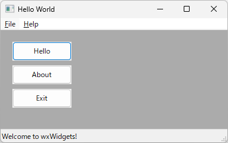

## wxWidgets क्या है

wxWidgets एक C++ GUI लाइब्रेरी है जो Windows, Mac, Linux, Android, iOS आदि प्लेटफॉर्म पर काम करती है।

## wxWidgets की स्थापना

1. https://www.wxwidgets.org/downloads/ खोलें और `Windows Installer` डाउनलोड करें।
2. स्थापित करने के लिए `wxMSW-3.2.2.1-Setup.exe` चलाएं।
3. इंस्टॉल किए गए फ़ोल्डर से "C:\wxWidgets-3.2.2.1\build\msw\wx_vc17.sln" खोलें।
4. `wx_vc17.sln` खोलने के बाद `Build` > `Batch Build` चुनें।
5. `Select All` बटन दबाएं, और फिर `Rebuild` बटन दबाएं।
6. निर्माण समाप्त होने के बाद, विज़ुअल स्टूडियो को अस्थायी रूप से बंद कर दें।

## उदाहरण प्रोजेक्ट बनाना

1. Visual Studio खोलें।
2. `File` > `New` > `Project` चुनें।
3. `Windows Desktop Application` चुनें (टैब हैं `C++`, `Windows`, `Desktop`)।
4. `Project name` में `wxWidgetsSample` दर्ज करें।
5. `Create` पर क्लिक करें।
6. `wxWidgetsSample` पर राइट-क्लिक करें और `Properties` चुनें।
7. `Configuration Properties` > `C/C++` > `Additional Include Directories` में `C:\wxWidgets-3.2.2.1\include` और `C:\wxWidgets-3.2.2.1\include\msvc` जोड़ें।
8. `Configuration Properties` > `Linker` > `Additional Library Directories` में `C:\wxWidgets-3.2.2.1\lib\vc_x64_lib` जोड़ें।
9. `wxWidgetsSample.cpp` खोलें और इसे नीचे दिए गए कोड से बदलें।
```cpp
#pragma comment(linker,"\"/manifestdependency:type='win32' name='Microsoft.Windows.Common-Controls' version='6.0.0.0' processorArchitecture='*' publicKeyToken='6595b64144ccf1df' language='*'\"")

#include <wx/wxprec.h>

#ifndef WX_PRECOMP
#include <wx/wx.h>
#endif

class MyApp : public wxApp
{
public:
	virtual bool OnInit();
};

class MyFrame : public wxFrame
{
public:
	MyFrame();
private:
	void OnHello(wxCommandEvent& event);
	void OnExit(wxCommandEvent& event);
	void OnAbout(wxCommandEvent& event);
};

enum
{
	ID_Hello = 1
};

wxIMPLEMENT_APP(MyApp);

bool MyApp::OnInit()
{
	MyFrame* frame = new MyFrame();
	frame->Show(true);
	return true;
}

MyFrame::MyFrame()
	: wxFrame(NULL, wxID_ANY, "Hello World")
{
	wxMenu* menuFile = new wxMenu;
	menuFile->Append(ID_Hello, "&Hello...\tCtrl-H",
		"Help string shown in status bar for this menu item");
	menuFile->AppendSeparator();
	menuFile->Append(wxID_EXIT);
	wxMenu* menuHelp = new wxMenu;
	menuHelp->Append(wxID_ABOUT);
	wxMenuBar* menuBar = new wxMenuBar;
	menuBar->Append(menuFile, "&File");
	menuBar->Append(menuHelp, "&Help");
	SetMenuBar(menuBar);

	wxButton* button1 = new wxButton(this, ID_Hello, _("Hello"), wxPoint(20, 20), wxSize(100, 32));
	Connect(ID_Hello, wxEVT_COMMAND_BUTTON_CLICKED, wxCommandEventHandler(MyFrame::OnHello));

	wxButton* button2 = new wxButton(this, wxID_ABOUT, _("About"), wxPoint(20, 60), wxSize(100, 32));
	Connect(wxID_ABOUT, wxEVT_COMMAND_BUTTON_CLICKED, wxCommandEventHandler(MyFrame::OnAbout));

	wxButton* button3 = new wxButton(this, wxID_EXIT, _("Exit"), wxPoint(20, 100), wxSize(100, 32));
	Connect(wxID_EXIT, wxEVT_COMMAND_BUTTON_CLICKED, wxCommandEventHandler(MyFrame::OnExit));

	CreateStatusBar();
	SetStatusText("Welcome to wxWidgets!");
	Bind(wxEVT_MENU, &MyFrame::OnHello, this, ID_Hello);
	Bind(wxEVT_MENU, &MyFrame::OnAbout, this, wxID_ABOUT);
	Bind(wxEVT_MENU, &MyFrame::OnExit, this, wxID_EXIT);
}

void MyFrame::OnExit(wxCommandEvent& event)
{
	Close(true);
}

void MyFrame::OnAbout(wxCommandEvent& event)
{
	wxMessageBox("This is a wxWidgets' Hello world sample",
		"About Hello World", wxOK | wxICON_INFORMATION);
}

void MyFrame::OnHello(wxCommandEvent& event)
{
	wxLogMessage("Hello world from wxWidgets!");
}
```
10. बिल्ड और रन करने पर, नीचे दिए गए अनुसार एक विंडो खुलेगी।




## संदर्भ

उदाहरण प्रोजेक्ट नीचे दिया गया है।
[wxWidgetsSample](https://github.com/kenjinote/wxWidgetsSample)

- [आधिकारिक वेबसाइट](https://www.wxwidgets.org)
- [C++ और wxWidgets का उपयोग करके गेम](https://ken-ohwada.hatenadiary.org/entry/2022/07/14/165213)

यही सब है।
