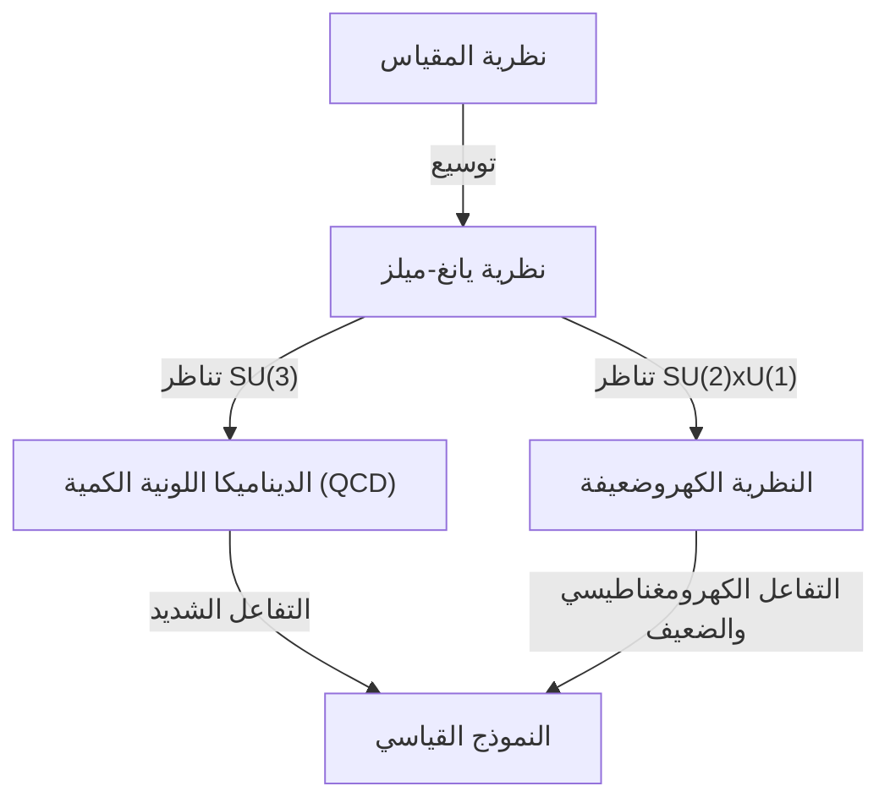

## 1. مقدمة: ما هي مسائل جائزة الألفية

في عام 2000، أعلن معهد كلاي للرياضيات عن جائزة قدرها مليون دولار لكل من سبع مسائل غير محلولة بالغة الأهمية في الرياضيات. وتسمى هذه بـ **مسائل جائزة الألفية**. وتشمل من بينها "فرضية ريمان" و"مسألة P مقابل NP" الشهيرتين، ولكن هناك مسألة واحدة ترتبط ارتباطًا وثيقًا بالفيزياء. وهي **"[معادلة يانغ-ميلز ومسألة الفجوة الكتلية](https://kenji.blog/p/yang-mills-mass-gap/)"** (Yang-Mills and Mass Gap).

تهدف هذه المسألة إلى تأسيس الأساس الرياضي لـ "النموذج القياسي" في فيزياء الجسيمات، والذي يصف القوى الأساسية في الطبيعة. لقد تم تأكيد سلوك المادة والقوى التي يتكون منها عالمنا تجريبيًا بدقة عالية جدًا، ولكن الإثبات الرياضي الدقيق لذلك يظل أحد أكبر التحديات في الرياضيات الحديثة.

في هذا المقال، سنتعمق في شرح ما هي نظرية يانغ-ميلز، وماذا تعني مسألة الفجوة الكتلية.

## 2. نظرية المقياس في الفيزياء

لفهم نظرية يانغ-ميلز، يجب أن نعرف أولاً عن **نظرية المقياس** (Gauge Theory). في الفيزياء، نظرية المقياس هي نظرية تتميز بأن شكل معادلاتها لا يتغير (يبقى ثابتًا) تحت تحويلات معينة (تحويلات المقياس).

### الكهرومغناطيسية ونظرية المقياس التبادلية

نظرية المقياس الأكثر دراية هي الكهرومغناطيسية. تصف معادلات ماكسويل، التي صاغها جيمس كليرك ماكسويل، سلوك المجالات الكهربائية والمغناطيسية. في إطار ميكانيكا الكم، يُطلق على الديناميكا الكهربائية الكمية (QED) التي تتعامل مع هذا اسم **نظرية المقياس U(1)**.

هنا، تلعب الكمية التي تسمى الطور دورًا مهمًا. حتى لو تغير طور الدالة الموجية للإلكترون بشكل مستقل عند كل نقطة في الفضاء (التحويل القياسي المحلي)، فإن الكميات الفيزيائية الملحوظة لا تتغير. للحفاظ على هذا الثبات، يتم إدخال **حقل المقياس**، وحقل المقياس في الكهرومغناطيسية يقابله الفوتون. ونظرًا لأن مجموعة U(1) هي مجموعة تبادلية (النتيجة هي نفسها حتى إذا تم تغيير ترتيب العمليات)، فإن QED تسمى نظرية مقياس تبادلية.

### نظرية المقياس غير التبادلية: ولادة نظرية يانغ-ميلز

في عام 1954، قام تشين نينغ يانغ وروبرت ميلز بتوسيع QED المبنية على المجموعات التبادلية، واقترحا نظرية مقياس مبنية على مجموعات غير تبادلية (مجموعات تتغير نتيجتها عند تغيير ترتيب العمليات). هذه هي **نظرية يانغ-ميلز**.

في البداية، بنوا نظرية تعتمد على تناظر اللف النظائري SU(2) لشرح "القوة الشديدة" التي تربط البروتونات والنيوترونات معًا. وفي وقت لاحق، تطورت هذه النظرية إلى النظرية التي تشكل أساس النموذج القياسي لفيزياء الجسيمات. يعتمد النموذج القياسي الحالي على نظريات المقياس غير التبادلية: الديناميكا اللونية الكمية (QCD) التي تصف القوة الشديدة وهي SU(3)، والنظرية الكهروضعيفة التي توحد القوة الضعيفة والكهرومغناطيسية وهي SU(2) × U(1).

تُكتب كثافة لاغرانجيان لنظرية يانغ-ميلز على النحو التالي:

$$ \mathcal{L} = -\frac{1}{4} F_{\mu\nu}^a F^{a\mu\nu} $$

حيث، $ F_{\mu\nu}^a $ هي قوة الحقل (موتر الانحناء)، وتُعرّف باستخدام حقل المقياس $ A_\mu^a $ على النحو التالي:

$$ F_{\mu\nu}^a = \partial_\mu A_\nu^a - \partial_\nu A_\mu^a + g f^{abc} A_\mu^b A_\nu^c $$

$ g $ هو ثابت الاقتران، و $ f^{abc} $ هو ثابت البنية لجبر لي. نظرًا لأنها نظرية غير تبادلية، يظهر الحد غير الخطي الأخير، والذي ينتج عنه الخاصية الفريدة التي تقول بأن **حقل المقياس يتفاعل مع نفسه**.

## 3. ما هي الفجوة الكتلية

حققت نظرية يانغ-ميلز نجاحًا مذهلاً في فيزياء الجسيمات. التوافق مع النتائج التجريبية جيد للغاية. ومع ذلك، عندما نحاول التعامل مع النظرية رياضيًا بشكل دقيق، فإننا نصطدم بحاجز كبير. وهي مسألة **الفجوة الكتلية** (Mass Gap).

### البوزونات المقياسية عديمة الكتلة في النظرية الكلاسيكية

عند حل معادلة يانغ-ميلز الكلاسيكية، نجد أن الجسيمات التي تنقل القوة (البوزونات المقياسية) كتلتها صفر، تمامًا مثل فوتون الكهرومغناطيسية. في الواقع، الموجات الكهرومغناطيسية في معادلات ماكسويل عديمة الكتلة وتنتشر بسرعة الضوء.

إذا كانت الغلوونات التي تنقل القوة الشديدة عديمة الكتلة، فيجب أن تعمل القوة الشديدة أيضًا على مسافات طويلة مثل القوة الكهرومغناطيسية. ومع ذلك، في العالم الفيزيائي الحقيقي، لا تعمل القوة الشديدة إلا على مسافات قصيرة جدًا بحجم النواة الذرية. هذا يعني أن الجسيمات التي تنقل القوة فعليًا **لها كتلة** (أو لها تأثير مكافئ).

### الحصر اللوني والفجوة الكتلية

في الديناميكا اللونية الكمية (QCD)، لا يمكن عزل الكواركات والغلوونات بمفردها، بل تُلاحظ دائمًا مجمعة في حالات يكون فيها اللون (الشحنة اللونية) متعادلًا (هادرونات). ويسمى هذا بـ **الحصر اللوني** (Color Confinement).

حتى لو كانت كتلة الكواركات والغلوونات صفرًا، فإن الهادرونات (البروتونات والميزونات، إلخ) المتكونة من ارتباطها القوي لها كتلة محدودة. عندما تكون طاقة حالة الفراغ للنظرية (الحالة ذات الطاقة الأقل) صفرًا، فإن طاقة الحالة التالية الأقل طاقة (حالة الإثارة الأولى، أي أخف جسيم) تكون $ \Delta > 0 $. وتسمى هذه الـ $ \Delta $ بـ **الفجوة الكتلية**.

البيان الرسمي لـ "[معادلة يانغ-ميلز ومسألة الفجوة الكتلية](https://kenji.blog/p/yang-mills-mass-gap/)" لمسائل جائزة الألفية في الرياضيات هو تقريبًا كالتالي:

> أثبت رياضيًا وبشكل دقيق أنه بالنسبة لأي مجموعة مقياس بسيطة ومضغوطة $ G $، توجد نظرية يانغ-ميلز كمية غير تافهة على $ \mathbb{R}^4 $، وأن لها فجوة كتلية محدودة $ \Delta > 0 $.

## 4. الصعوبات الرياضية: نظرية الحقل الكمي البنائية

يستخلص الفيزيائيون العديد من التنبؤات الفيزيائية من نظرية يانغ-ميلز باستخدام مخططات فاينمان وطرق مجموعة إعادة التطبيع. ومع ذلك، تعتمد هذه على نظرية الاضطراب (طريقة حساب تقريبية تفترض أن التفاعل ضعيف)، وتفتقر إلى الصرامة الرياضية. على وجه الخصوص، في منطقة الطاقة المنخفضة (المنطقة التي يصبح فيها ثابت الاقتران كبيرًا)، تنهار نظرية الاضطراب، وبالتالي لا يمكن إثبات الفجوة الكتلية أو الحصر.

يُطلق على المجال الذي يبني نظرية الحقل الكمي الصارمة رياضيًا اسم **نظرية الحقل الكمي البنائية** (Constructive Quantum Field Theory). حتى الآن، تم إجراء بناء دقيق لبعض النماذج في الزمكان ثنائي وثلاثي الأبعاد، لكن لم ينجح أحد في البناء الدقيق لنظرية المقياس غير التبادلية (نظرية يانغ-ميلز) في الزمكان الحقيقي رباعي الأبعاد.

### نظام بديهيات وايتمان

كإطار للتعامل مع الحقول الكمية بصرامة رياضية، يُعرف **نظام بديهيات وايتمان** (Wightman axioms) و **نظام بديهيات أوستروالدر-شريدر** (Osterwalder-Schrader axioms). هذه تحدد الخصائص التي يجب أن يمتلكها الحقل الكمي (تغاير بوانكاريه، التبادلية المحلية، الشرط الطيفي، إلخ) كبديهيات.

لحل مسألة جائزة الألفية، من الضروري أولاً إثبات أن نظرية يانغ-ميلز موجودة ككائن رياضي دقيق يرضي هذه البديهيات، ثم إثبات وجود فجوة في الحد الأدنى للطيف (القيم الذاتية للطاقة) (الفجوة الكتلية).

## 5. نهج نظرية المقياس الشبكية

كنقطة انطلاق نحو إثبات دقيق، غالبًا ما يستخدم الفيزيائيون نهجًا يسمى **نظرية المقياس الشبكية** (Lattice Gauge Theory). هذه طريقة تقسم الزمكان المستمر إلى شبكة منفصلة، وتصيغ النظرية عليها.

في هذا النهج الذي اقترحه كينيث ويلسون في عام 1974، يمكن تجنب (تنظيم) المشكلة التي تتباعد إلى ما لا نهاية بشكل طبيعي. من خلال محاكاة مونت كارلو باستخدام أجهزة الكمبيوتر، تم حساب طيف الكتلة للهادرونات في إطار نظرية المقياس الشبكية، مما يدعم عدديًا وبقوة وجود فجوة كتلية محدودة.

$$ S_W = \beta \sum_{P} \left( 1 - \frac{1}{N_c} \text{Re} \text{Tr} U_P \right) $$

هنا، $ U_P $ هو هولونومي حقل المقياس على طول البلاكيت (أصغر مربع في الشبكة)، و $ \beta $ هو معلمة مرتبطة بثابت الاقتران.

ومع ذلك، لمجرد أنه تم توضيحه عدديًا عن طريق المحاكاة لا يعني أنه تم الحصول على إثبات رياضي في الزمكان المستمر. من الصعب جدًا التحكم بصرامة في عملية أخذ النهاية التي تؤول فيها المسافة الشبكية إلى الصفر (النهاية المستمرة).

## 6. الخلاصة والتوقعات المستقبلية

تقع [معادلة يانغ-ميلز ومسألة الفجوة الكتلية](https://kenji.blog/p/yang-mills-mass-gap/) في أعمق منطقة وأكثرها تعقيدًا حيث تتقاطع الفيزياء الحديثة مع الرياضيات الحديثة. يستخدم الفيزيائيون بالفعل هذه النظرية لفك ألغاز الكون، لكن علماء الرياضيات لم يتمكنوا بعد من إثبات صحة قواعد "اللغة" التي تقوم عليها.

إذا تم حل هذه المشكلة، فستكتمل الرؤية الإطارية الرياضية القوية لنا لفهم الكون. وفي الوقت نفسه، سيكون حدثًا رائدًا يفتح مجالًا جديدًا في الرياضيات. على الرغم من عدم وجود دليل قاطع على الحل حتى الآن، يواصل العديد من العباقرة تحدي مسألة جائزة الألفية هذه.

**معادلة يانغ-ميلز** التي تصف القوى الأساسية للكون، و **الفجوة الكتلية** التي تجلب الكتلة إليها. ينتظر العالم بأسره اليوم الذي سيتم فيه كشف السر الرياضي المخبأ بين هذين الاثنين.
