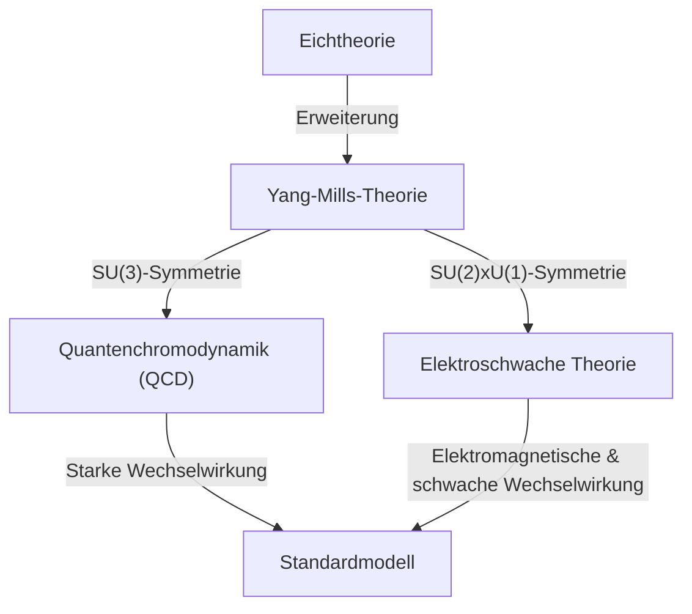

## 1. Einführung: Was sind die Millennium-Probleme?

Im Jahr 2000 setzte das Clay Mathematics Institute ein Preisgeld von jeweils 1 Million Dollar für die Lösung von sieben extrem wichtigen ungelösten mathematischen Problemen aus. Diese werden als **Millennium-Probleme** bezeichnet. Darunter befinden sich die berühmte "[Riemann](https://kenji.blog/de/p/riemann/)sche Vermutung" und das "P-NP-Problem", aber es gibt ein Problem, das tief mit der Physik verbunden ist. Das ist das **"Yang-Mills- und Massenlücken-Problem"** (Yang-Mills and Mass Gap).

Dieses Problem zielt darauf ab, die mathematischen Grundlagen des "Standardmodells" der Teilchenphysik zu etablieren, das die fundamentalen Kräfte der Natur beschreibt. Obwohl das Verhalten von Materie und Kräften, aus denen unsere Welt besteht, experimentell mit extrem hoher Präzision bestätigt wurde, ist der mathematisch strenge Beweis dafür eine der größten Herausforderungen in der modernen Mathematik.

In diesem Artikel werden wir tiefgründig erklären, was diese Yang-Mills-Theorie ist und was das Massenlücken-Problem bedeutet.

## 2. Eichtheorien in der Physik

Um die Yang-Mills-Theorie zu verstehen, müssen wir zunächst etwas über die **Eichtheorie** (Gauge Theory) wissen. In der Physik ist eine Eichtheorie eine Theorie, die die Eigenschaft hat, dass die Form der Gleichungen bei bestimmten Transformationen (Eichtransformationen) unverändert bleibt (invariant ist).

### Elektromagnetismus und abelsche Eichtheorien

Die bekannteste Eichtheorie ist der Elektromagnetismus. Die von James Clerk Maxwell formulierten Maxwell-Gleichungen beschreiben das Verhalten von elektrischen und magnetischen Feldern. Die Quantenelektrodynamik (QED), die dies im Rahmen der Quantenmechanik behandelt, wird als **U(1)-Eichtheorie** bezeichnet.

Hier spielt eine Größe namens Phase eine wichtige Rolle. Selbst wenn man die Phase der Wellenfunktion eines Elektrons an jedem Punkt im Raum unabhängig ändert (lokale Eichtransformation), ändern sich die physikalisch beobachtbaren Größen nicht. Um diese Invarianz aufrechtzuerhalten, wird das **Eichfeld** eingeführt, und das Eichfeld im Elektromagnetismus entspricht dem Photon. Da die U(1)-Gruppe eine abelsche (kommutative) Gruppe ist (das Vertauschen der Reihenfolge von Operationen liefert das gleiche Ergebnis), wird QED als abelsche Eichtheorie bezeichnet.

### Nicht-abelsche Eichtheorien: Die Geburt der Yang-Mills-Theorie

1954 schlugen Chen-Ning Yang und Robert Mills eine Eichtheorie vor, die die auf einer abelschen Gruppe basierende QED erweiterte und auf einer nicht-abelschen Gruppe basierte (eine Gruppe, bei der das Vertauschen der Reihenfolge von Operationen das Ergebnis ändert). Das ist die **Yang-Mills-Theorie**.

Ursprünglich konstruierten sie diese Theorie basierend auf der SU(2)-Isospin-Symmetrie, um die "starke Kraft", die Protonen und Neutronen bindet, zu erklären. Später entwickelte sich diese Theorie zu der Theorie, die den Kern des Standardmodells der Teilchenphysik bildet. Das aktuelle Standardmodell basiert auf nicht-abelschen Eichtheorien: Die Quantenchromodynamik (QCD), die die starke Kraft beschreibt, basiert auf SU(3), und die elektroschwache Theorie, die die schwache und elektromagnetische Kraft vereinheitlicht, basiert auf SU(2) × U(1).

Die [Lagrange](https://kenji.blog/de/p/lagrange/)-Dichte der Yang-Mills-Theorie wird wie folgt geschrieben:

$$ \mathcal{L} = -\frac{1}{4} F_{\mu\nu}^a F^{a\mu\nu} $$

Hier ist $ F_{\mu\nu}^a $ die Feldstärke (Krümmungstensor), die mithilfe des Eichfeldes $ A_\mu^a $ wie folgt definiert wird:

$$ F_{\mu\nu}^a = \partial_\mu A_\nu^a - \partial_\nu A_\mu^a + g f^{abc} A_\mu^b A_\nu^c $$

$ g $ ist die Kopplungskonstante und $ f^{abc} $ sind die Strukturkonstanten der Lie-Algebra. Da es sich um eine nicht-abelsche Theorie handelt, tritt der letzte nichtlineare Term auf, was zu der einzigartigen Eigenschaft führt, dass **das Eichfeld mit sich selbst wechselwirkt**.

## 3. Was ist eine Massenlücke?

Die Yang-Mills-Theorie war in der Teilchenphysik erstaunlich erfolgreich. Die Übereinstimmung mit experimentellen Ergebnissen ist extrem gut. Wenn man jedoch versucht, die Theorie mathematisch streng zu behandeln, stößt man auf eine große Wand. Das ist das Problem der **Massenlücke** (Mass Gap).

### Masselose Eichbosonen in der klassischen Theorie

Wenn man die klassischen Yang-Mills-Gleichungen löst, ist die Masse der Teilchen, die die Kraft vermitteln (Eichbosonen), genau wie beim Photon des Elektromagnetismus, null. Tatsächlich sind die elektromagnetischen Wellen der Maxwell-Gleichungen masselos und breiten sich mit Lichtgeschwindigkeit aus.

Wenn Gluonen, die die starke Kraft vermitteln, masselos wären, sollte die starke Kraft wie die elektromagnetische Kraft über große Entfernungen wirken. In der realen physikalischen Welt wirkt die starke Kraft jedoch nur auf extrem kurze Entfernungen in der Größenordnung eines Atomkerns. Das bedeutet, dass die die Kraft vermittelnden Teilchen effektiv **eine Masse besitzen** (oder einen dazu äquivalenten Effekt haben).

### Confinement und die Massenlücke

In der Quantenchromodynamik (QCD) können Quarks und Gluonen nicht einzeln extrahiert werden; sie werden immer als [Zustand](https://kenji.blog/de/p/state-management-history-redux-context-recoil-zustand/) beobachtet, in dem sich mehrere versammeln und die Farbe (Farbladung) neutralisiert ist (Hadronen). Dies wird **Confinement** (Color Confinement) genannt.

Selbst wenn die Masse der Quarks und Gluonen null ist, haben die durch ihre starke Bindung gebildeten Hadronen (wie Protonen und Mesonen) eine endliche Masse. Wenn wir die Energie des Vakuumzustands (den Zustand mit der niedrigsten Energie) der Theorie auf null setzen, dann ist die Energie des nächstniedrigeren Zustands (der erste angeregte Zustand, d.h. das leichteste Teilchen) $ \Delta > 0 $. Dieses $ \Delta $ wird als **Massenlücke** bezeichnet.

Die formale Aussage des "Yang-Mills- und Massenlücken-Problems" der Millennium-Probleme in der Mathematik lautet ungefähr wie folgt:

> Beweise mathematisch streng, dass für jede kompakte einfache Eichgruppe $ G $ eine nichttriviale Quanten-Yang-Mills-Theorie auf $ \mathbb{R}^4 $ existiert und dass sie eine endliche Massenlücke $ \Delta > 0 $ besitzt.

## 4. Mathematische Schwierigkeiten: Konstruktive Quantenfeldtheorie

Physiker leiten mithilfe von Feynman-Diagrammen und Methoden der Renormierungsgruppe viele physikalische Vorhersagen aus der Yang-Mills-Theorie ab. Diese basieren jedoch auf der Störungstheorie (einer Methode der näherungsweisen Berechnung unter der Annahme einer schwachen Wechselwirkung) und es mangelt ihnen an mathematischer Strenge. Insbesondere bei niedrigen Energien (wo die Kopplungskonstante groß wird) bricht die Störungstheorie zusammen, sodass es unmöglich ist, die Massenlücke oder das Confinement zu beweisen.

Das Gebiet, das streng eine Quantenfeldtheorie mathematisch konstruiert, wird als **Konstruktive Quantenfeldtheorie** (Constructive Quantum Field Theory) bezeichnet. Bisher wurden einige Modelle in zwei- oder dreidimensionalen Raumzeiten streng konstruiert, aber noch niemandem ist die strenge Konstruktion einer nicht-abelschen Eichtheorie (Yang-Mills-Theorie) in der realen vierdimensionalen Raumzeit gelungen.

### Axiomensysteme von Wightman

Als Rahmen zur mathematisch strengen Behandlung von Quantenfeldern sind die **Wightman-Axiome** (Wightman axioms) und die **Osterwalder-Schrader-Axiome** (Osterwalder-Schrader axioms) bekannt. Diese axiomatisieren die Eigenschaften, die Quantenfelder erfüllen müssen (wie [Poincaré](https://kenji.blog/de/p/poincare/)-Kovarianz, lokale Kommutativität, Spektralbedingung).

Um das Millennium-Problem zu lösen, muss zunächst gezeigt werden, dass die Yang-Mills-Theorie als strenges mathematisches Objekt existiert, das diese Axiome erfüllt, und dann muss bewiesen werden, dass es an der unteren Grenze des Spektrums (der Energieeigenwerte) eine Lücke gibt (die Massenlücke).

## 5. Der Ansatz der Gittereichtheorie

Ein von Physikern häufig verwendeter Ansatz als Sprungbrett für einen strengen Beweis ist die **Gittereichtheorie** (Lattice Gauge Theory). Dies ist eine Methode, bei der die kontinuierliche Raumzeit in ein diskretes Gitter unterteilt wird und die Theorie darauf formuliert wird.

Bei diesem 1974 von Kenneth Wilson vorgeschlagenen Ansatz kann das Problem unendlicher Divergenzen auf natürliche Weise vermieden (regularisiert) werden. Durch Monte-Carlo-Simulationen mit Computern wird das Massenspektrum der Hadronen im Rahmen der Gittereichtheorie berechnet, was numerisch stark die Existenz einer endlichen Massenlücke stützt.

$$ S_W = \beta \sum_{P} \left( 1 - \frac{1}{N_c} \text{Re} \text{Tr} U_P \right) $$

Hier ist $ U_P $ die Holonomie des Eichfeldes entlang eines Plaquettes (das kleinste Quadrat des Gitters) und $ \beta $ ist ein mit der Kopplungskonstante verbundener Parameter.

Jedoch bedeutet die numerische Demonstration in Simulationen nicht, dass ein mathematischer Beweis in kontinuierlicher Raumzeit erbracht wurde. Es ist äußerst schwierig, den Prozess der Grenzwertbildung, bei dem der Gitterabstand gegen Null geht (Kontinuumslimes), streng zu kontrollieren.

## 6. Zusammenfassung und zukünftige Aussichten

Die [Yang-Mills-Gleichungen und das Massenlücken-Problem](https://kenji.blog/de/p/yang-mills-mass-gap/) befinden sich in dem tiefsten und am schwersten verständlichen Bereich, in dem sich die moderne Physik und die moderne Mathematik überschneiden. Physiker haben diese Theorie bereits genutzt, um die Geheimnisse des Universums zu entschlüsseln, aber Mathematiker haben noch nicht bewiesen, dass die Grammatik der "Sprache", die ihre Grundlage bildet, korrekt ist.

Wenn dieses Problem gelöst wird, wird der leistungsstarke mathematische Rahmen, mit dem wir das Universum verstehen, vervollständigt sein. Es wäre gleichzeitig ein bahnbrechendes Ereignis, das ein neues Feld in der Mathematik erschließt. Obwohl es noch keine Hinweise auf eine endgültige Lösung gibt, stellen sich viele Genies weiterhin diesem Millennium-Problem.

Die **Yang-Mills-Gleichungen**, die die fundamentalen Kräfte des Universums beschreiben, und die **Massenlücke**, die ihnen Masse verleiht. Die ganze Welt wartet auf den Tag, an dem die mathematischen Geheimnisse gelöst werden, die zwischen diesen beiden verborgen liegen.
