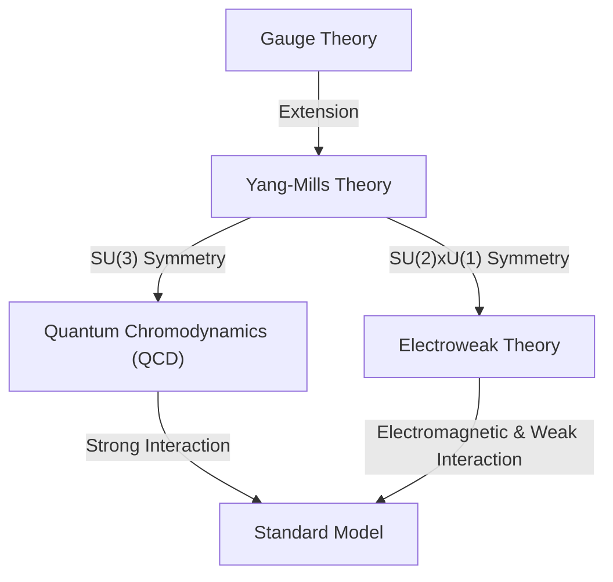

## 1. Introduction: What are the Millennium Prize Problems?

In 2000, the Clay Mathematics Institute offered a $1 million prize for each of seven immensely important unsolved problems in mathematics. These are called the **Millennium Prize Problems**. They include famous problems such as the "Riemann Hypothesis" and the "P versus NP Problem", but there is one problem deeply connected to physics. That is the **"Yang-Mills and Mass Gap"** problem.

The purpose of this problem is to establish the mathematical foundation of the "Standard Model" of particle physics, which describes the fundamental forces of nature. The behavior of the matter and forces that make up our world has been confirmed experimentally with extremely high precision, but rigorously proving it mathematically remains one of the greatest challenges in modern mathematics.

In this article, we will delve into what Yang-Mills theory is and what the mass gap problem means.

## 2. Gauge Theory in Physics

To understand Yang-Mills theory, one must first know about **Gauge Theory**. In physics, gauge theory is a theory that has the property of the equations remaining unchanged (invariant) under certain transformations (gauge transformations).

### Electromagnetism and Abelian Gauge Theory

The most familiar gauge theory is electromagnetism. Maxwell's equations, formulated by James Clerk Maxwell, describe the behavior of electric and magnetic fields. Quantum Electrodynamics (QED), which handles this in the framework of quantum mechanics, is called a **U(1) gauge theory**.

Here, a quantity called phase plays an important role. Even if the phase of the electron's wave function is changed independently at each point in space (local gauge transformation), the physically observable quantities do not change. To maintain this invariance, a **gauge field** is introduced, and the gauge field in electromagnetism corresponds to the photon. Because the U(1) group is an Abelian group (the result is the same even if the order of operations is swapped), QED is called an Abelian gauge theory.

### Non-Abelian Gauge Theory: The Birth of Yang-Mills Theory

In 1954, Chen-Ning Yang and Robert Mills extended QED, which is based on an Abelian group, and proposed a gauge theory based on a non-Abelian group (a group where swapping the order of operations changes the result). This is **Yang-Mills Theory**.

Initially, they constructed a theory based on SU(2) isospin symmetry to explain the "strong force" that binds protons and neutrons together. Later, this theory developed into the fundamental theory of the Standard Model of particle physics. The current Standard Model is based on non-Abelian gauge theories: Quantum Chromodynamics (QCD), which describes the strong force, is SU(3), and the Electroweak theory, which unifies the weak force and electromagnetic force, is SU(2) × U(1).

The Lagrangian density of Yang-Mills theory is written as follows:

$$ \mathcal{L} = -\frac{1}{4} F_{\mu\nu}^a F^{a\mu\nu} $$

Here, $ F_{\mu\nu}^a $ is the field strength (curvature tensor), which is defined using the gauge field $ A_\mu^a $ as follows:

$$ F_{\mu\nu}^a = \partial_\mu A_\nu^a - \partial_\nu A_\mu^a + g f^{abc} A_\mu^b A_\nu^c $$

$ g $ is the coupling constant, and $ f^{abc} $ are the structure constants of the Lie algebra. Because it is a non-Abelian theory, the last nonlinear term appears, which gives rise to the unique property that **the gauge fields themselves interact**.

## 3. What is the Mass Gap?

Yang-Mills theory has achieved remarkable success in particle physics. Its agreement with experimental results is extremely good. However, when trying to treat the theory with mathematical rigor, one runs into a massive wall. That is the **Mass Gap** problem.

### Massless Gauge Bosons in Classical Theory

When the classical Yang-Mills equations are solved, the mass of the particles that mediate the force (gauge bosons) becomes zero, just like the photons in electromagnetism. In fact, electromagnetic waves in Maxwell's equations are massless and propagate at the speed of light.

If the gluons that mediate the strong force were massless, the strong force should act over long distances like the electromagnetic force. However, in the real physical world, the strong force only acts over extremely short distances, on the scale of an atomic nucleus. This means that the particles mediating the force essentially **have mass** (or have an equivalent effect).

### Color Confinement and Mass Gap

In Quantum Chromodynamics (QCD), quarks and gluons cannot be isolated and are always observed in clusters where the color (color charge) is neutralized (hadrons). This is called **Color Confinement**.

Even if the mass of quarks and gluons is zero, the hadrons (such as protons and mesons) formed by their strong binding have finite mass. When the energy of the vacuum state (the lowest energy state) of the theory is taken to be zero, the energy of the next lowest state (the first excited state, i.e., the lightest particle) is $ \Delta > 0 $. This $ \Delta $ is called the **Mass Gap**.

The formal statement of the "Yang-Mills and Mass Gap" Millennium Prize Problem in mathematics is roughly as follows:

> Prove that for any compact simple gauge group $ G $, a non-trivial quantum Yang-Mills theory exists on $ \mathbb{R}^4 $ and has a mass gap $ \Delta > 0 $.

## 4. Mathematical Difficulties: Constructive Quantum Field Theory

Physicists have drawn many physical predictions from Yang-Mills theory using Feynman diagrams and renormalization group techniques. However, these are based on perturbation theory (an approximation technique assuming weak interactions) and lack mathematical rigor. In particular, perturbation theory breaks down in the low-energy region (where the coupling constant becomes large), so the mass gap and confinement cannot be proven this way.

The field that constructs mathematically rigorous quantum field theories is called **Constructive Quantum Field Theory**. So far, rigorous construction has been achieved for some models in 2D or 3D spacetime, but no one has succeeded in the rigorous construction of a non-Abelian gauge theory (Yang-Mills theory) in our realistic 4-dimensional spacetime.

### Wightman Axioms

As frameworks for treating quantum fields with mathematical rigor, the **Wightman axioms** and the **Osterwalder-Schrader axioms** are well-known. These establish properties that quantum fields must satisfy (such as Poincaré covariance, local commutativity, spectral condition, etc.) as axioms.

To solve the Millennium Prize Problem, one must first show that Yang-Mills theory exists as a rigorous mathematical object satisfying these axioms, and then prove that there is a gap at the lower bound of the spectrum (energy eigenvalues), which is the mass gap.

## 5. The Lattice Gauge Theory Approach

A method often used by physicists as a stepping stone towards a rigorous proof is **Lattice Gauge Theory**. This is a method that divides continuous spacetime into a discrete lattice and formulates the theory on it.

Proposed by Kenneth Wilson in 1974, this method can naturally avoid (regularize) the problem of diverging to infinity. Through Monte Carlo simulations using computers, the mass spectrum of hadrons is calculated within the framework of lattice gauge theory, and the existence of a finite mass gap is strongly supported numerically.

$$ S_W = \beta \sum_{P} \left( 1 - \frac{1}{N_c} \text{Re} \text{Tr} U_P \right) $$

Here, $ U_P $ is the holonomy of the gauge field along a plaquette (the smallest square of the lattice), and $ \beta $ is a parameter related to the coupling constant.

However, just because it is shown numerically in simulations does not mean that a mathematical proof in continuous spacetime has been obtained. Strictly controlling the process of taking the limit as the lattice spacing goes to zero (continuum limit) is extremely difficult.

## 6. Conclusion and Future Prospects

The Yang-Mills equation and mass gap problem are located in the deepest, most complex region where modern physics and modern mathematics intersect. Physicists are already using this theory to unravel the mysteries of the universe, but mathematicians have not yet been able to prove that the grammar of the "language" serving as its foundation is correct.

If this problem is solved, a powerful mathematical framework for us to understand the universe will be completed. At the same time, it will be a landmark event that opens up new fields of mathematics. Although no decisive clue to a solution has yet been found, many geniuses continue to tackle this Millennium Prize Problem.

The **Yang-Mills equation** that describes the fundamental forces of the universe, and the **Mass Gap** that gives mass to it. The world is eagerly waiting for the day when the mathematical secrets hidden between these two will be unraveled.
