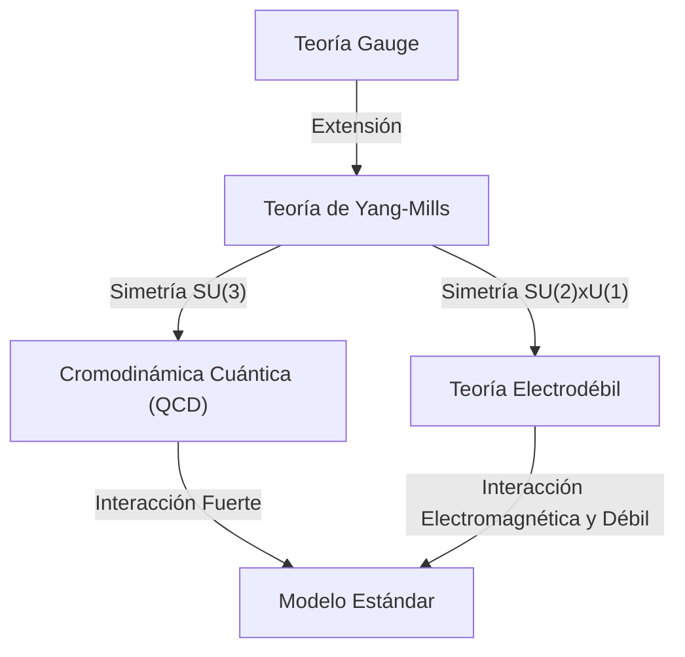

## 1. Introducción: ¿Qué son los Problemas del Milenio?

En el año 2000, el Instituto de Matemáticas Clay ofreció un premio de un millón de dólares por cada uno de los siete problemas no resueltos más importantes de las matemáticas. Estos se conocen como los **Problemas del Milenio**. Entre ellos se incluyen la famosa "Hipótesis de Riemann" y el "Problema P vs NP", pero hay un problema que está profundamente relacionado con la física. Se trata de las **"[Ecuaciones de Yang-Mills y el problema del salto de masa](https://kenji.blog/es/p/yang-mills-mass-gap/)"** (Yang-Mills and Mass Gap).

Este problema tiene como objetivo establecer una base matemática sólida para el "Modelo Estándar" de la física de partículas, que describe las fuerzas fundamentales de la naturaleza. Aunque el comportamiento de la materia y las fuerzas que componen nuestro mundo ha sido confirmado experimentalmente con una precisión extremadamente alta, demostrarlo matemáticamente con rigor sigue siendo uno de los mayores desafíos de las matemáticas modernas.

En este artículo, profundizaremos en qué es la teoría de Yang-Mills y qué significa el problema del salto de masa.

## 2. La Teoría Gauge en Física

Para entender la teoría de Yang-Mills, primero debemos conocer la **Teoría Gauge** (Gauge Theory). En física, una teoría de gauge es aquella que tiene la propiedad de que las ecuaciones no cambian de forma (son invariantes) ante ciertas transformaciones (transformaciones de gauge).

### Electromagnetismo y Teoría Gauge Abeliana

La teoría de gauge más familiar es el electromagnetismo. Las ecuaciones de Maxwell, formuladas por James Clerk Maxwell, describen el comportamiento de los campos eléctrico y magnético. La electrodinámica cuántica (QED), que trata esto en el marco de la mecánica cuántica, se llama **Teoría Gauge U(1)**.

Aquí, una cantidad llamada fase juega un papel importante. Incluso si la fase de la función de onda del electrón se cambia de forma independiente en cada punto del espacio (transformación de gauge local), las cantidades observables físicas no cambian. Para preservar esta invariancia, se introduce el **campo gauge**, y el campo gauge en el electromagnetismo corresponde al fotón. Dado que el grupo U(1) es un grupo abeliano o conmutativo (el orden de las operaciones no altera el resultado), la QED se denomina teoría gauge abeliana.

### Teoría Gauge No Abeliana: El nacimiento de la Teoría de Yang-Mills

En 1954, Chen Ning Yang y Robert Mills extendieron la QED basada en grupos abelianos y propusieron una teoría gauge basada en grupos no abelianos (grupos donde el orden de las operaciones cambia el resultado). Esta es la **Teoría de Yang-Mills**.

Inicialmente, construyeron una teoría basada en la simetría de isospín SU(2) para explicar la "fuerza fuerte" que une protones y neutrones. Posteriormente, esta teoría se desarrolló hasta convertirse en la teoría fundamental del Modelo Estándar de la física de partículas. El Modelo Estándar actual se basa en teorías gauge no abelianas: la cromodinámica cuántica (QCD), que describe la fuerza fuerte, es SU(3), y la teoría electrodébil, que unifica la fuerza débil y la electromagnética, es SU(2) × U(1).

La densidad lagrangiana de la teoría de Yang-Mills se escribe de la siguiente manera:

$$ \mathcal{L} = -\frac{1}{4} F_{\mu\nu}^a F^{a\mu\nu} $$

Donde $ F_{\mu\nu}^a $ es la intensidad del campo (tensor de curvatura) y se define utilizando el campo gauge $ A_\mu^a $ de la siguiente manera:

$$ F_{\mu\nu}^a = \partial_\mu A_\nu^a - \partial_\nu A_\mu^a + g f^{abc} A_\mu^b A_\nu^c $$

$ g $ es la constante de acoplamiento y $ f^{abc} $ son las constantes de estructura del álgebra de Lie. Debido a que es una teoría no abeliana, aparece el último término no lineal, que da lugar a la peculiar propiedad de que **los campos gauge interactúan entre sí**.

## 3. ¿Qué es el Salto de Masa?

La teoría de Yang-Mills ha logrado un éxito asombroso en la física de partículas. El acuerdo con los resultados experimentales es extremadamente bueno. Sin embargo, al intentar tratar la teoría con rigor matemático, nos encontramos con un gran obstáculo. Este es el problema del **salto de masa** (Mass Gap).

### Bosones gauge de masa cero en la teoría clásica

Si resolvemos las ecuaciones de Yang-Mills clásicas, al igual que los fotones en el electromagnetismo, la masa de las partículas que median las fuerzas (bosones gauge) es cero. De hecho, las ondas electromagnéticas en las ecuaciones de Maxwell tienen masa cero y se propagan a la velocidad de la luz.

Si los gluones, que median la fuerza fuerte, tuvieran masa cero, entonces la fuerza fuerte también actuaría a largas distancias, como la fuerza electromagnética. Sin embargo, en el mundo físico real, la fuerza fuerte solo actúa a distancias extremadamente cortas, del orden del núcleo atómico. Esto significa que las partículas que median la fuerza tienen efectivamente **masa** (o un efecto equivalente).

### Confinamiento de color y Salto de masa

En la cromodinámica cuántica (QCD), los quarks y los gluones no pueden extraerse de forma aislada; siempre se observan agrupados en estados donde el color (carga de color) está neutralizado (hadrones). A esto se le llama **confinamiento de color** (Color Confinement).

Aunque la masa de los quarks y gluones sea cero, los hadrones (como protones y mesones) formados por su fuerte enlace tienen una masa finita. Si definimos la energía del estado de vacío de la teoría (el estado de menor energía) como cero, la energía del siguiente estado de menor energía (el primer estado excitado, es decir, la partícula más ligera) será $ \Delta > 0 $. A este $ \Delta $ se le llama **salto de masa**.

El enunciado formal del problema del "Problema del salto de masa y las ecuaciones de Yang-Mills" en los Problemas del Milenio en matemáticas es aproximadamente el siguiente:

> Demuestre matemáticamente de manera rigurosa que, para cualquier grupo de gauge simple compacto $ G $, existe una teoría cuántica de Yang-Mills no trivial en $ \mathbb{R}^4 $ y que tiene un salto de masa finito $ \Delta > 0 $.

## 4. Dificultad matemática: Teoría Cuántica de Campos Constructiva

Los físicos han extraído muchas predicciones físicas de la teoría de Yang-Mills utilizando diagramas de Feynman y técnicas del grupo de renormalización. Sin embargo, estas se basan en la teoría de perturbaciones (un método de cálculo aproximado asumiendo que las interacciones son débiles) y carecen de rigor matemático. En particular, en la región de baja energía (donde la constante de acoplamiento es grande), la teoría de perturbaciones falla, por lo que no es posible demostrar el salto de masa o el confinamiento.

El campo que construye una teoría cuántica de campos matemáticamente rigurosa se llama **Teoría Cuántica de Campos Constructiva** (Constructive Quantum Field Theory). Hasta ahora, se han construido rigurosamente algunos modelos en el espacio-tiempo de 2 y 3 dimensiones, pero nadie ha logrado una construcción rigurosa de una teoría gauge no abeliana (teoría de Yang-Mills) en el espacio-tiempo realista de 4 dimensiones.

### Sistemas axiomáticos de Wightman

Como marco para tratar matemáticamente los campos cuánticos de forma rigurosa, se conocen los **axiomas de Wightman** (Wightman axioms) y los **axiomas de Osterwalder-Schrader** (Osterwalder-Schrader axioms). Estos definen como axiomas las propiedades que deben satisfacer los campos cuánticos (covarianza de Poincaré, conmutatividad local, condiciones espectrales, etc.).

Para resolver este Problema del Milenio, primero es necesario demostrar que la teoría de Yang-Mills existe como un objeto matemático riguroso que satisface estos axiomas, y luego demostrar que existe un salto en el límite inferior del espectro (valores propios de energía), es decir, un salto de masa.

## 5. El enfoque de la Teoría Gauge en el Retículo

Como trampolín hacia una prueba rigurosa, una técnica que los físicos utilizan a menudo es la **Teoría Gauge en el Retículo** (Lattice Gauge Theory). Este es un método en el que el espacio-tiempo continuo se divide en una cuadrícula discreta (retículo) y la teoría se formula sobre él.

En este método, propuesto por Kenneth Wilson en 1974, los problemas de divergencia al infinito pueden evitarse de forma natural (regularización). Mediante simulaciones de Montecarlo por ordenador, se han calculado los espectros de masa de los hadrones en el marco de la teoría gauge en el retículo, lo que apoya fuertemente de forma numérica la existencia de un salto de masa finito.

$$ S_W = \beta \sum_{P} \left( 1 - \frac{1}{N_c} \text{Re} \text{Tr} U_P \right) $$

Aquí, $ U_P $ es la holonomía del campo gauge a lo largo de una plaqueta (el cuadrado más pequeño del retículo) y $ \beta $ es un parámetro relacionado con la constante de acoplamiento.

Sin embargo, el hecho de que se haya demostrado numéricamente en una simulación no significa que se haya obtenido una prueba matemática en el espacio-tiempo continuo. Controlar rigurosamente el proceso de tomar el límite donde el espaciado del retículo tiende a cero (límite continuo) es extremadamente difícil.

## 6. Conclusión y perspectivas futuras

Las ecuaciones de Yang-Mills y el problema del salto de masa se sitúan en el área más profunda y compleja donde se cruzan la física moderna y las matemáticas modernas. Los físicos ya han utilizado esta teoría para desentrañar los misterios del universo, pero los matemáticos aún no han podido demostrar que la "gramática" del "lenguaje" fundamental sea correcta.

Si se resuelve este problema, se completará un poderoso marco matemático para que comprendamos el universo. Al mismo tiempo, será un evento histórico que abrirá un nuevo campo en las matemáticas. Aunque todavía no hay pistas concluyentes para una solución definitiva, muchos genios continúan desafiando este Problema del Milenio.

Las **ecuaciones de Yang-Mills** que describen las fuerzas fundamentales del universo, y el **salto de masa** que les otorga masa. El mundo entero espera el día en que se desvele el secreto matemático oculto entre estos dos conceptos.
