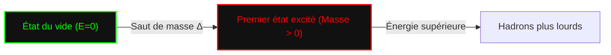

## 1. Introduction : Que sont les problèmes du prix du millénaire ?

En l'an 2000, l'Institut de mathématiques Clay a offert un million de dollars pour chacun des sept problèmes non résolus d'une importance capitale en mathématiques. Ce sont les **problèmes du prix du millénaire**. Parmi eux figurent des problèmes célèbres tels que l'« Hypothèse de [Riemann](https://kenji.blog/fr/p/riemann/) » et le problème « P = NP », mais il y a aussi un problème profondément lié à la physique. Il s'agit des **« équations de Yang-Mills et du problème du saut de masse »** (Yang-Mills and Mass Gap).

Ce problème vise à établir les bases mathématiques du « modèle standard » de la physique des particules, qui décrit les forces fondamentales de la nature. Bien que le comportement de la matière et des forces qui composent notre monde ait été confirmé expérimentalement avec une très grande précision, le prouver mathématiquement de manière rigoureuse reste l'un des plus grands défis des mathématiques modernes.

Dans cet article, nous allons explorer en profondeur ce qu'est la théorie de Yang-Mills et ce que signifie le problème du saut de masse.

## 2. La théorie de jauge en physique

Pour comprendre la théorie de Yang-Mills, il faut d'abord connaître la **théorie de jauge** (Gauge Theory). En physique, une théorie de jauge est une théorie dans laquelle la forme des équations ne change pas (est invariante) sous l'effet de certaines transformations (transformations de jauge).

### L'électromagnétisme et la théorie de jauge abélienne

La théorie de jauge la plus familière est l'électromagnétisme. Les équations de Maxwell, formulées par James Clerk Maxwell, décrivent le comportement des champs électrique et magnétique. L'électrodynamique quantique (QED), qui traite cela dans le cadre de la mécanique quantique, est appelée **théorie de jauge U(1)**.

Ici, une quantité appelée phase joue un rôle important. Même si la phase de la fonction d'onde de l'électron varie indépendamment à chaque point de l'espace (transformation de jauge locale), les observables physiques ne changent pas. Pour maintenir cette invariance, un **champ de jauge** est introduit, et le champ de jauge en électromagnétisme correspond au photon. Le groupe U(1) étant un groupe abélien (l'ordre des opérations ne modifie pas le résultat), la QED est appelée théorie de jauge abélienne.

### Théorie de jauge non abélienne : Naissance de la théorie de Yang-Mills

En 1954, Chen-Ning Yang et Robert Mills ont étendu la QED basée sur un groupe abélien pour proposer une théorie de jauge basée sur un groupe non abélien (un groupe où l'ordre des opérations modifie le résultat). C'est la **théorie de Yang-Mills**.

Initialement, ils ont construit une théorie basée sur la symétrie d'isospin SU(2) pour expliquer la « force forte » liant les protons et les neutrons. Par la suite, cette théorie a évolué pour devenir la base du modèle standard de la physique des particules. Le modèle standard actuel repose sur des théories de jauge non abéliennes : la chromodynamique quantique (QCD) décrivant la force forte est SU(3), et la théorie électrofaible unifiant la force faible et la force électromagnétique est SU(2) × U(1).

La densité de lagrangien de la théorie de Yang-Mills s'écrit comme suit :

$$ \mathcal{L} = -\frac{1}{4} F_{\mu\nu}^a F^{a\mu\nu} $$

Où $ F_{\mu\nu}^a $ est l'intensité du champ (tenseur de courbure), défini à l'aide du champ de jauge $ A_\mu^a $ de la manière suivante :

$$ F_{\mu\nu}^a = \partial_\mu A_\nu^a - \partial_\nu A_\mu^a + g f^{abc} A_\mu^b A_\nu^c $$

$ g $ est la constante de couplage, et $ f^{abc} $ sont les constantes de structure de l'algèbre de Lie. Étant donné qu'il s'agit d'une théorie non abélienne, le dernier terme non linéaire apparaît, ce qui crée la propriété singulière que **le champ de jauge interagit avec lui-même**.

```mermaid
graph TD
    A["Théorie de jauge"] -->|"Extension"| B["Théorie de Yang-Mills"]
    B -->|"Symétrie SU("3")"| C["Chromodynamique quantique (QCD)"]
    B -->|"Symétrie SU("2")xU("1")"| D["Théorie électrofaible"]
    C -->|"Interaction forte"| E["Modèle standard"]
    D -->|"Interaction électromagnétique et faible"| E
```

## 3. Qu'est-ce que le saut de masse ?

La théorie de Yang-Mills a connu un succès remarquable en physique des particules. L'accord avec les résultats expérimentaux est extrêmement bon. Cependant, lorsqu'on tente de traiter la théorie de manière mathématiquement rigoureuse, on se heurte à un grand mur. C'est le problème du **saut de masse** (Mass Gap).

### Bosons de jauge sans masse dans la théorie classique

Lorsqu'on résout les équations classiques de Yang-Mills, tout comme les photons de l'électromagnétisme, la masse des particules médiatrices des forces (bosons de jauge) devient nulle. En fait, les ondes électromagnétiques des équations de Maxwell sont sans masse et se propagent à la vitesse de la lumière.

Si les gluons, qui sont les médiateurs de la force forte, étaient sans masse, la force forte devrait également agir sur de longues distances comme la force électromagnétique. Cependant, dans le monde physique réel, la force forte n'agit que sur de très courtes distances de la taille du noyau atomique. Cela signifie que les particules médiatrices ont en fait **une masse** (ou un effet équivalent).

### Confinement de couleur et saut de masse

En chromodynamique quantique (QCD), les quarks et les gluons ne peuvent pas être isolés individuellement et sont toujours observés sous forme d'états où la couleur (charge de couleur) est neutralisée (hadrons). C'est ce qu'on appelle le **confinement de couleur** (Color Confinement).

Même si les quarks et les gluons ont une masse nulle, les hadrons formés par leur forte liaison (tels que les protons et les mésons) ont une masse finie. Si l'on fixe l'énergie de l'état du vide de la théorie (l'état de plus basse énergie) à zéro, l'énergie du prochain état de plus basse énergie (le premier état excité, c'est-à-dire la particule la plus légère) est $ \Delta > 0 $. Ce $ \Delta $ est appelé le **saut de masse**.

L'énoncé officiel du « problème des équations de Yang-Mills et du saut de masse » parmi les problèmes du prix du millénaire en mathématiques est à peu près le suivant :

> Prouvez mathématiquement et rigoureusement que, pour tout groupe de jauge simple compact $ G $, il existe une théorie quantique non triviale de Yang-Mills sur $ \mathbb{R}^4 $, et qu'elle possède un saut de masse fini $ \Delta > 0 $.



## 4. Difficulté mathématique : La théorie quantique des champs constructive

Les physiciens ont extrait de nombreuses prédictions physiques de la théorie de Yang-Mills en utilisant des diagrammes de Feynman et des techniques du groupe de renormalisation. Cependant, celles-ci sont basées sur la théorie des perturbations (une méthode de calcul approximatif supposant que l'interaction est faible) et manquent de rigueur mathématique. En particulier, à basse énergie (où la constante de couplage devient grande), la théorie des perturbations s'effondre, de sorte qu'il est impossible de prouver le saut de masse et le confinement.

Le domaine qui construit des théories quantiques des champs de manière mathématiquement rigoureuse s'appelle la **théorie quantique des champs constructive** (Constructive Quantum Field Theory). Jusqu'à présent, des constructions rigoureuses ont été réalisées pour certains modèles dans un espace-temps à 2 ou 3 dimensions, mais personne n'a réussi une construction rigoureuse d'une théorie de jauge non abélienne (théorie de Yang-Mills) dans un espace-temps à 4 dimensions réel.

### Les axiomes de Wightman

Les **axiomes de Wightman** ou les **axiomes d'Osterwalder-Schrader** sont connus comme un cadre pour traiter mathématiquement rigoureusement les champs quantiques. Ceux-ci définissent comme axiomes les propriétés qu'un champ quantique doit satisfaire (covariance de [Poincaré](https://kenji.blog/fr/p/poincare/), commutativité locale, condition spectrale, etc.).

Pour résoudre le problème du prix du millénaire, il est d'abord nécessaire de montrer que la théorie de Yang-Mills existe en tant qu'objet mathématique rigoureux satisfaisant à ces axiomes, puis de prouver qu'il existe un espace à la limite inférieure du spectre (valeur propre de l'énergie) (saut de masse).

## 5. L'approche de la théorie de jauge sur réseau

Comme point de départ pour une preuve rigoureuse, une méthode souvent utilisée par les physiciens est la **théorie de jauge sur réseau** (Lattice Gauge Theory). Il s'agit d'une méthode consistant à diviser l'espace-temps continu en un réseau discret et à y formuler la théorie.

Proposée par Kenneth Wilson en 1974, cette approche permet d'éviter (régulariser) naturellement les problèmes qui divergent vers l'infini. Grâce à des simulations de Monte Carlo sur ordinateur, le spectre de masse des hadrons est calculé dans le cadre de la théorie de jauge sur réseau, ce qui soutient numériquement fortement l'existence d'un saut de masse fini.

$$ S_W = \beta \sum_{P} \left( 1 - \frac{1}{N_c} \text{Re} \text{Tr} U_P \right) $$

Où $ U_P $ est l'holonomie du champ de jauge le long d'une plaquette (le plus petit carré du réseau), et $ \beta $ est un paramètre lié à la constante de couplage.

Cependant, le fait qu'il ait été démontré numériquement par simulation ne signifie pas qu'une preuve mathématique dans l'espace-temps continu a été obtenue. Contrôler rigoureusement le processus de prise de la limite où l'espacement du réseau tend vers zéro (limite continue) est extrêmement difficile.

## 6. Conclusion et perspectives d'avenir

Les équations de Yang-Mills et le problème du saut de masse se situent dans la région la plus profonde et la plus complexe où se croisent la physique moderne et les mathématiques modernes. Les physiciens utilisent déjà cette théorie pour percer les mystères de l'univers, mais les mathématiciens n'ont pas encore pu prouver que la grammaire de la "langue" qui en constitue la base est correcte.

Si ce problème est résolu, un puissant cadre mathématique pour notre compréhension de l'univers sera achevé. Ce sera en même temps un événement révolutionnaire ouvrant un nouveau domaine des mathématiques. Bien qu'aucun indice de solution décisive ne soit encore en vue, de nombreux génies continuent de s'attaquer à ce problème du prix du millénaire.

Les **équations de Yang-Mills** qui décrivent les forces fondamentales de l'univers, et le **saut de masse** qui y apporte la masse. Le monde entier attend le jour où le secret mathématique caché entre les deux sera révélé.
