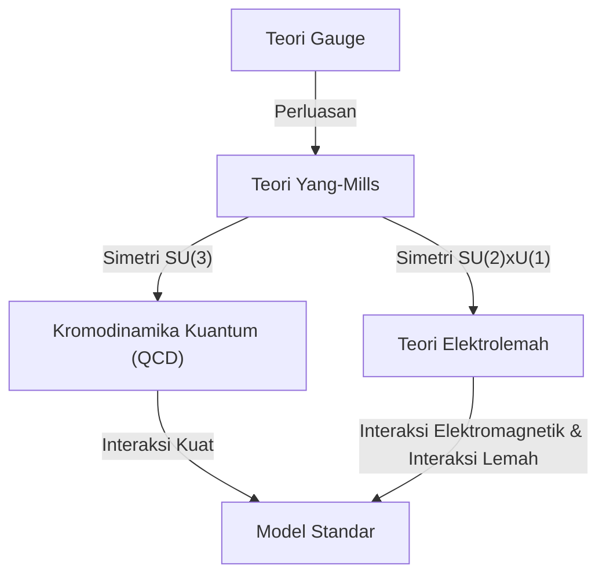
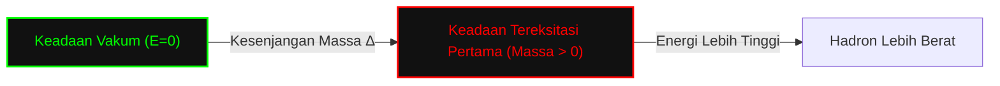

## 1. Pendahuluan: Apa itu Masalah Hadiah Milenium?

Pada tahun 2000, Clay Mathematics Institute menawarkan hadiah masing-masing sebesar 1 juta dolar untuk 7 masalah matematika terpenting yang belum terpecahkan. Masalah-masalah ini disebut **Masalah Hadiah Milenium** (Millennium Prize Problems). Di antaranya terdapat masalah terkenal seperti "Hipotesis Riemann" dan "Masalah P vs NP", namun ada satu masalah yang sangat berkaitan erat dengan fisika. Masalah tersebut adalah **"[Persamaan Yang-Mills dan Masalah Kesenjangan Massa](https://kenji.blog/id/p/yang-mills-mass-gap/)"** (Yang-Mills and Mass Gap).

Masalah ini bertujuan untuk menetapkan dasar matematika dari "Model Standar" fisika partikel yang mendeskripsikan gaya-gaya dasar di alam semesta. Perilaku materi dan gaya yang membentuk dunia kita telah dikonfirmasi dengan akurasi yang sangat tinggi melalui eksperimen, namun pembuktian secara matematis dan ketat (rigor) merupakan salah satu tantangan terbesar dalam matematika modern.

Dalam artikel ini, kita akan menggali lebih dalam dan menjelaskan apa itu teori Yang-Mills, serta apa arti dari masalah kesenjangan massa.

## 2. Teori Gauge dalam Fisika

Untuk memahami teori Yang-Mills, pertama-tama kita perlu mengetahui tentang **Teori Gauge** (Gauge Theory). Dalam fisika, teori gauge adalah sebuah teori yang memiliki sifat di mana bentuk persamaannya tidak berubah (invarian) terhadap transformasi tertentu (transformasi gauge).

### Elektromagnetisme dan Teori Gauge Abelian

Teori gauge yang paling akrab adalah elektromagnetisme. Persamaan Maxwell yang dirumuskan oleh James Clerk Maxwell mendeskripsikan perilaku medan listrik dan medan magnet. Elektrodinamika Kuantum (QED) yang menangani hal ini dalam kerangka mekanika kuantum disebut sebagai **Teori Gauge U(1)**.

Di sini, besaran yang disebut fase memainkan peran penting. Sekalipun fase fungsi gelombang elektron diubah secara independen pada setiap titik di ruang (transformasi gauge lokal), kuantitas observasi fisik tidak akan berubah. **Medan gauge** diperkenalkan untuk menjaga invariansi ini, dan medan gauge dalam elektromagnetisme setara dengan foton (photon). Karena grup U(1) adalah grup abelian (komutatif, urutan operasi dapat ditukar tanpa mengubah hasil), QED disebut teori gauge abelian.

### Teori Gauge Non-Abelian: Lahirnya Teori Yang-Mills

Pada tahun 1954, Chen-Ning Yang dan Robert Mills memperluas QED yang berbasis pada grup abelian, dan mengusulkan teori gauge yang berbasis pada grup non-abelian (grup non-komutatif, di mana urutan operasi mengubah hasil). Inilah yang disebut **Teori Yang-Mills**.

Awalnya, mereka membangun teori berdasarkan simetri isospin SU(2) untuk menjelaskan "gaya kuat" yang mengikat proton dan neutron. Kemudian, teori ini berkembang menjadi dasar dari Model Standar dalam fisika partikel. Model Standar saat ini didasarkan pada teori gauge non-abelian, di mana Kromodinamika Kuantum (QCD) yang mendeskripsikan gaya kuat memiliki grup SU(3), dan teori elektrolemah yang menyatukan gaya lemah dan gaya elektromagnetik memiliki grup SU(2) × U(1).

Kerapatan Lagrangian dari teori Yang-Mills dituliskan sebagai berikut:

$$ \mathcal{L} = -\frac{1}{4} F_{\mu\nu}^a F^{a\mu\nu} $$

Di mana, $ F_{\mu\nu}^a $ adalah kekuatan medan (tensor kelengkungan), dan didefinisikan menggunakan medan gauge $ A_\mu^a $ sebagai berikut:

$$ F_{\mu\nu}^a = \partial_\mu A_\nu^a - \partial_\nu A_\mu^a + g f^{abc} A_\mu^b A_\nu^c $$

$ g $ adalah konstanta kopling, dan $ f^{abc} $ adalah konstanta struktur dari aljabar Lie. Karena ini adalah teori non-abelian, suku non-linear terakhir muncul, yang menciptakan sifat unik di mana **medan gauge berinteraksi dengan dirinya sendiri**.

## 3. Apa itu Kesenjangan Massa?

Teori Yang-Mills telah mencapai kesuksesan luar biasa dalam fisika partikel. Kesesuaiannya dengan hasil eksperimen sangatlah baik. Namun, ketika mencoba menangani teori ini secara matematis dengan ketat, kita akan menemui kendala besar. Itulah masalah **Kesenjangan Massa** (Mass Gap).

### Boson Gauge Bermassa Nol dalam Teori Klasik

Jika kita menyelesaikan persamaan klasik Yang-Mills, sama seperti foton dalam elektromagnetisme, partikel yang memediasi gaya (boson gauge) memiliki massa nol. Faktanya, gelombang elektromagnetik dalam persamaan Maxwell memiliki massa nol dan merambat dengan kecepatan cahaya.

Jika gluon yang memediasi gaya kuat memiliki massa nol, maka gaya kuat seharusnya juga bekerja pada jarak jauh seperti halnya gaya elektromagnetik. Namun, di dunia fisik yang nyata, gaya kuat hanya bekerja pada jarak yang sangat pendek seukuran inti atom. Hal ini berarti bahwa partikel yang memediasi gaya tersebut secara efektif **memiliki massa** (atau memiliki efek yang setara).

### Pengurungan Warna dan Kesenjangan Massa

Dalam Kromodinamika Kuantum (QCD), quark dan gluon tidak dapat diekstraksi sendirian, melainkan selalu diamati terkumpul dalam keadaan yang menetralkan warna (muatan warna), yang disebut sebagai hadron. Hal ini disebut **Pengurungan Warna** (Color Confinement).

Bahkan jika massa quark dan gluon adalah nol, hadron (seperti proton atau meson) yang terbentuk dari ikatan kuat mereka memiliki massa yang terhingga. Ketika energi keadaan vakum dari teori (keadaan dengan energi terendah) dianggap nol, energi dari keadaan terendah berikutnya (keadaan tereksitasi pertama, yaitu partikel teringan) adalah $ \Delta > 0 $. $ \Delta $ inilah yang disebut **Kesenjangan Massa**.

Pernyataan resmi dari "[Persamaan Yang-Mills dan Masalah Kesenjangan Massa](https://kenji.blog/id/p/yang-mills-mass-gap/)" dalam Masalah Hadiah Milenium matematika kira-kira berbunyi sebagai berikut:

> Untuk sembarang grup gauge sederhana kompak $ G $, buktikan secara ketat secara matematis bahwa teori kuantum Yang-Mills nontrivial ada di $ \mathbb{R}^4 $ dan memiliki kesenjangan massa $ \Delta > 0 $ yang terhingga.

## 4. Kesulitan Matematika: Teori Medan Kuantum Konstruktif

Fisikawan menggunakan teknik diagram Feynman dan grup renormalisasi untuk menarik banyak prediksi fisik dari teori Yang-Mills. Namun, ini didasarkan pada teori perturbasi (metode perhitungan perkiraan dengan asumsi bahwa interaksinya lemah), dan kurang memiliki ketatnya matematika. Khususnya, di daerah energi rendah (di mana konstanta kopling menjadi besar), teori perturbasi gagal beroperasi, sehingga kesenjangan massa dan pengurungan tidak dapat dibuktikan.

Bidang yang membangun teori medan kuantum secara matematis dengan ketat disebut **Teori Medan Kuantum Konstruktif** (Constructive Quantum Field Theory). Sejauh ini, konstruksi ketat telah berhasil dilakukan untuk beberapa model dalam ruang-waktu 2 dimensi atau 3 dimensi, namun belum ada yang berhasil membangun secara ketat teori gauge non-abelian (teori Yang-Mills) dalam ruang-waktu 4 dimensi yang nyata.

### Aksioma Wightman

Sebagai kerangka kerja untuk menangani medan kuantum secara matematis dengan ketat, dikenal **Aksioma Wightman** (Wightman axioms) dan **Aksioma Osterwalder-Schrader** (Osterwalder-Schrader axioms). Ini menetapkan sifat-sifat yang harus dipenuhi oleh medan kuantum (seperti kovariansi Poincaré, komutativitas lokal, kondisi spektral, dll.) sebagai aksioma.

Untuk menyelesaikan Masalah Hadiah Milenium, pertama-tama perlu ditunjukkan bahwa teori Yang-Mills eksis sebagai objek matematis yang ketat yang memenuhi aksioma-aksioma ini, dan kemudian harus dibuktikan bahwa terdapat batas bawah yang memiliki kesenjangan (kesenjangan massa) pada spektrum (nilai eigen energi).

## 5. Pendekatan Teori Gauge Kisi

Sebagai batu loncatan menuju pembuktian yang ketat, metode yang sering digunakan oleh fisikawan adalah **Teori Gauge Kisi** (Lattice Gauge Theory). Ini adalah metode yang merumuskan teori dengan membagi ruang-waktu yang kontinu menjadi bentuk kisi diskrit (kotak-kotak).

Dalam metode yang diusulkan oleh Kenneth Wilson pada tahun 1974 ini, masalah penyebaran (divergensi) hingga tak terhingga dapat dihindari (diregularisasi) secara alami. Melalui simulasi Monte Carlo menggunakan komputer, spektrum massa hadron dihitung dalam kerangka teori gauge kisi, dan keberadaan kesenjangan massa yang terhingga sangat didukung secara numerik.

$$ S_W = \beta \sum_{P} \left( 1 - \frac{1}{N_c} \text{Re} \text{Tr} U_P \right) $$

Di sini, $ U_P $ adalah holonomi medan gauge di sepanjang plaquette (persegi terkecil dari kisi), dan $ \beta $ adalah parameter yang terkait dengan konstanta kopling.

Namun, hanya karena itu telah ditunjukkan secara numerik melalui simulasi, bukan berarti bukti matematis dalam ruang-waktu kontinu telah diperoleh. Mengendalikan secara ketat proses mengambil batas (limit kontinu) ketika jarak antar kisi mendekati nol adalah sangat sulit.

## 6. Kesimpulan dan Prospek ke Depan

[Persamaan Yang-Mills dan Masalah Kesenjangan Massa](https://kenji.blog/id/p/yang-mills-mass-gap/) berada di area yang terdalam dan tersulit di mana fisika modern dan matematika modern bersilangan. Fisikawan telah menggunakan teori ini untuk memecahkan misteri alam semesta, tetapi para matematikawan belum mampu membuktikan bahwa tata bahasa dari "bahasa" dasar teori ini adalah benar.

Jika masalah ini terpecahkan, kerangka matematika yang kuat untuk pemahaman kita tentang alam semesta akan menjadi lengkap. Pada saat yang sama, hal itu akan menjadi peristiwa penting yang membuka bidang matematika yang baru. Meskipun belum ada petunjuk penyelesaian yang pasti terlihat, banyak orang jenius terus menantang Masalah Hadiah Milenium ini.

**Persamaan Yang-Mills** yang mendeskripsikan gaya fundamental di alam semesta, dan **Kesenjangan Massa** yang memberikan massa padanya. Seluruh dunia sedang menantikan hari di mana rahasia matematika yang tersembunyi di antara keduanya terpecahkan.
