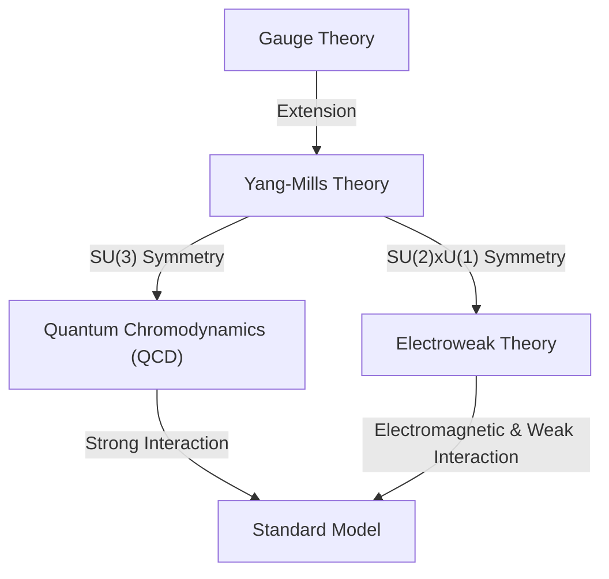

## 1. はじめに：ミレニアム懸賞問題とは

2000年、クレイ数学研究所は数学における7つの極めて重要な未解決問題に対して、それぞれ100万ドルの懸賞金をかけました。これを **ミレニアム懸賞問題** と呼びます。その中には、有名な「[リーマン予想](https://kenji.blog/p/riemann-hypothesis-prime-distribution-cryptography/)」や「P対NP問題」などが含まれていますが、物理学と深い関わりを持つ問題が一つあります。それが **「[ヤン＝ミルズ方程式と質量ギャップ問題](https://kenji.blog/p/yang-mills-mass-gap/)」** （Yang-Mills and Mass Gap）です。

この問題は、自然界の基本的な力を記述する素粒子物理学の「標準模型」の数学的な基礎を確立することを目的としています。私たちの世界を構成する物質や力の振る舞いは、実験的には極めて高い精度で確認されていますが、それを数学的に厳密に証明することは、現代数学における最大の挑戦の一つとなっています。

本記事では、このヤン＝ミルズ理論とは何か、そして質量ギャップ問題とは何を意味しているのかについて、深く掘り下げて解説します。

## 2. 物理学におけるゲージ理論

ヤン＝ミルズ理論を理解するためには、まず **ゲージ理論** （Gauge Theory）について知る必要があります。物理学において、ゲージ理論とは、特定の変換（ゲージ変換）に対して方程式の形が変わらない（不変である）という性質を持つ理論のことです。

### 電磁気学と可換ゲージ理論

最も身近なゲージ理論は、電磁気学です。ジェームズ・クラーク・マクスウェルによって定式化されたマクスウェル方程式は、電場と磁場の振る舞いを記述します。量子力学の枠組みでこれを扱う量子電磁力学（QED）は、 **U(1)ゲージ理論** と呼ばれます。

ここでは、位相と呼ばれる量が重要な役割を果たします。電子の波動関数の位相を空間の各点で独立に変化させても（局所ゲージ変換）、物理的な観測量は変化しません。この[不変性](https://kenji.blog/p/functional-programming-concepts-pure-functions-monads/)を保つために導入されるのが **ゲージ場** であり、電磁気学におけるゲージ場は光子（フォトン）に相当します。U(1)群は可換群（演算の順序を入れ替えても結果が同じ）であるため、QEDは可換ゲージ理論と呼ばれます。

### 非可換ゲージ理論：ヤン＝ミルズ理論の誕生

1954年、チェンニン・ヤンとロバート・ミルズは、可換群に基づくQEDを拡張し、非可換群（演算の順序を入れ替えると結果が変わる群）に基づくゲージ理論を提唱しました。これが **ヤン＝ミルズ理論** です。

当初、彼らは陽子と中性子を結びつける「強い力」を説明するために、SU(2)アイソスピン対称性に基づく理論を構築しました。その後、この理論は素粒子物理学の標準模型の根幹をなす理論へと発展しました。現在の標準模型は、強い力を記述する量子色力学（QCD）がSU(3)、弱い力と電磁気力を統一する電弱理論がSU(2) × U(1)という非可換ゲージ理論に基づいています。

ヤン＝ミルズ理論のラグランジアン密度は次のように書かれます：

$$ \mathcal{L} = -\frac{1}{4} F_{\mu\nu}^a F^{a\mu\nu} $$

ここで、$ F_{\mu\nu}^a $ は場の強さ（曲率テンソル）であり、ゲージ場 $ A_\mu^a $ を用いて以下のように定義されます：

$$ F_{\mu\nu}^a = \partial_\mu A_\nu^a - \partial_\nu A_\mu^a + g f^{abc} A_\mu^b A_\nu^c $$

$ g $ は結合定数、$ f^{abc} $ はリー代数の構造定数です。非可換理論であるため、最後の非線形項が現れ、これにより **ゲージ場自身が相互作用する** という特異な性質が生まれます。

## 3. 質量ギャップとは何か

ヤン＝ミルズ理論は、素粒子物理学において驚くべき成功を収めました。実験結果との一致は極めて良好です。しかし、理論を数学的に厳密に取り扱おうとすると、大きな壁にぶつかります。それが **質量ギャップ** （Mass Gap）の問題です。

### 古典論における質量ゼロのゲージボソン

古典的なヤン＝ミルズ方程式を解くと、電磁気学の光子と同じように、力を媒介する粒子（ゲージボソン）の質量はゼロになります。実際、マクスウェル方程式の電磁波は質量ゼロであり、光速で伝播します。

もし強い力を媒介するグルーオンが質量ゼロであるならば、強い力も電磁力のように長距離にわたって作用するはずです。しかし、現実の物理世界では、強い力は原子核程度の極めて短い距離でしか働きません。これは、力を媒介する粒子が実質的に **質量を持っている** （あるいはそれに等価な効果がある）ことを意味します。

### カラー閉じ込めと質量ギャップ

量子色力学（QCD）では、クォークやグルーオンは単独で取り出すことができず、常に複数集まってカラー（色電荷）が中和された状態（ハドロン）として観測されます。これを **カラー閉じ込め** （Color Confinement）と呼びます。

クォークやグルーオンの質量がゼロであっても、それらが強く結びついて形成されるハドロン（陽子や中間子など）は有限の質量を持ちます。理論の真空状態（最もエネルギーが低い状態）のエネルギーをゼロとしたとき、次にエネルギーの低い状態（最初の励起状態、つまり最も軽い粒子）のエネルギーは $ \Delta > 0 $ となります。この $ \Delta $ を **質量ギャップ** と呼びます。

数学におけるミレニアム懸賞問題の「[ヤン＝ミルズ方程式と質量ギャップ問題](https://kenji.blog/p/yang-mills-mass-gap/)」の正式なステートメントは、おおよそ次のようなものです。

> 任意のコンパクトな単純ゲージ群 $ G $ に対して、非自明な量子ヤン＝ミルズ理論が $ \mathbb{R}^4 $ 上に存在し、それが有限の質量ギャップ $ \Delta > 0 $ を持つことを数学的に厳密に証明せよ。

## 4. 数学的な困難：構成的場の量子論

物理学者は、ファインマン・ダイアグラムや繰り込み群の手法を用いて、ヤン＝ミルズ理論から多くの物理的予測を引き出しています。しかし、これらは摂動論（相互作用が弱いと仮定して近似的に計算する手法）に基づいており、数学的な厳密性を欠いています。特に、低エネルギー領域（結合定数が大きくなる領域）では摂動論が破綻するため、質量ギャップや閉じ込めを証明することができません。

数学的に厳密な場の量子論を構築する分野を **構成的場の量子論** （Constructive Quantum Field Theory）と呼びます。これまでに、2次元や3次元の時空におけるいくつかのモデルについては厳密な構築が行われていますが、現実の4次元時空における非可換ゲージ理論（ヤン＝ミルズ理論）の厳密な構築には誰も成功していません。

### ワイトマンの公理系

量子場を数学的に厳密に扱うための枠組みとして、 **ワイトマンの公理系** （Wightman axioms）や **オスターワルダー＝シュレーダーの公理系** （Osterwalder-Schrader axioms）が知られています。これらは、量子場が満たすべき性質（[ポアンカレ](https://kenji.blog/p/poincare/)共変性、局所可換性、スペクトル条件など）を公理として定めたものです。

ミレニアム懸賞問題を解決するためには、まずヤン＝ミルズ理論がこれらの公理を満たすような厳密な数学的対象として存在することを示し、その上でスペクトル（エネルギー[固有値](/p/eigenvalues-and-eigenvectors/)）の下限にギャップが存在すること（質量ギャップ）を証明する必要があります。

## 5. 格子ゲージ理論というアプローチ

厳密な証明への足がかりとして、物理学者がよく用いる手法に **格子ゲージ理論** （Lattice Gauge Theory）があります。これは、連続的な時空を離散的な格子状に分割し、その上で理論を定式化する手法です。

1974年にケネス・ウィルソンによって提唱されたこの手法では、無限大に発散する問題を自然に回避（正則化）することができます。コンピュータを用いたモンテカルロ・シミュレーションにより、格子ゲージ理論の枠組みではハドロンの質量スペクトルが計算され、有限の質量ギャップが存在することが数値的に強く支持されています。

$$ S_W = \beta \sum_{P} \left( 1 - \frac{1}{N_c} \text{Re} \text{Tr} U_P \right) $$

ここで、$ U_P $ はプラケット（格子の最小の正方形）に沿ったゲージ場のホロノミー、$ \beta $ は結合定数に関連するパラメータです。

しかし、シミュレーションで数値的に示されたからといって、連続時空における数学的な証明が得られたわけではありません。格子間隔をゼロにする極限（連続極限）を取る過程を厳密に制御することは非常に困難です。

## 6. まとめと今後の展望

[ヤン＝ミルズ方程式と質量ギャップ問題](https://kenji.blog/p/yang-mills-mass-gap/)は、現代物理学と現代数学が交差する最も深く、最も難解な領域に位置しています。物理学者はすでにこの理論を使って宇宙の謎を解き明かしていますが、数学者はまだその基礎となる「言語」の文法が正しいことを証明できていません。

この問題が解決されれば、私たちが宇宙を理解するための強力な数学的枠組みが完成することになります。それは同時に、数学の新たな分野を切り拓く画期的な出来事となるでしょう。未だに決定的な解決の糸口は見えていませんが、多くの天才たちがこのミレニアム懸賞問題に挑み続けています。

宇宙の根源的な力を記述する **ヤン＝ミルズ方程式** と、そこに質量をもたらす **質量ギャップ** 。この二つの間に隠された数学的な秘密が解き明かされる日を、世界中が待ち望んでいます。
