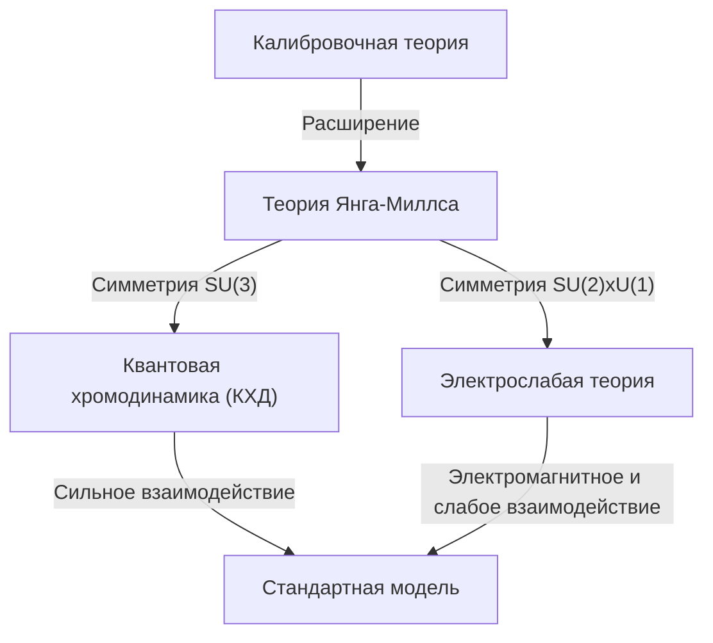

## 1. Введение: Что такое Задачи тысячелетия

В 2000 году Математический институт Клэя назначил премию в 1 миллион долларов за каждую из семи важнейших нерешенных математических проблем. Они известны как **Задачи тысячелетия**. Среди них знаменитая «Гипотеза Римана» и «Равенство классов P и NP», но есть и одна проблема, тесно связанная с физикой. Это **«Уравнения Янга-Миллса и проблема массовой щели»** (Yang-Mills and Mass Gap).

Цель этой проблемы — установить математические основы «Стандартной модели» физики элементарных частиц, описывающей фундаментальные силы природы. Поведение материи и сил, составляющих наш мир, подтверждено экспериментально с высочайшей точностью, однако строгое математическое доказательство этого является одним из величайших вызовов современной математики.

В этой статье мы подробно рассмотрим, что такое теория Янга-Миллса и что означает проблема массовой щели.

## 2. Калибровочная теория в физике

Чтобы понять теорию Янга-Миллса, необходимо сначала узнать о **калибровочной теории** (Gauge Theory). В физике калибровочная теория — это теория, обладающая свойством неизменности (инвариантности) формы уравнений относительно определенных преобразований (калибровочных преобразований).

### Электромагнетизм и абелева калибровочная теория

Самая знакомая калибровочная теория — это электромагнетизм. Уравнения Максвелла, сформулированные Джеймсом Клерком Максвеллом, описывают поведение электрического и магнитного полей. Квантовая электродинамика (КЭД), которая рассматривает это в рамках квантовой механики, называется **калибровочной теорией U(1)**.

Здесь важную роль играет величина, называемая фазой. Даже если мы независимо изменяем фазу волновой функции электрона в каждой точке пространства (локальное калибровочное преобразование), физически наблюдаемые величины не изменяются. Для сохранения этой инвариантности вводится **калибровочное поле**, и калибровочное поле в электромагнетизме соответствует фотону. Поскольку группа U(1) является коммутативной или абелевой группой (результат не меняется при изменении порядка операций), КЭД называется абелевой калибровочной теорией.

### Неабелева калибровочная теория: рождение теории Янга-Миллса

В 1954 году Чжэньнин Янг и Роберт Миллс расширили КЭД, основанную на абелевой группе, и предложили калибровочную теорию, основанную на неабелевой группе (группе, где результат меняется при изменении порядка операций). Это и есть **теория Янга-Миллса**.

Изначально они построили теорию на основе изоспиновой симметрии SU(2), чтобы объяснить «сильное взаимодействие», связывающее протоны и нейтроны. Впоследствии эта теория развилась в фундаментальную теорию Стандартной модели физики элементарных частиц. Современная Стандартная модель основана на неабелевых калибровочных теориях: квантовая хромодинамика (КХД), описывающая сильное взаимодействие, базируется на SU(3), а электрослабая теория, объединяющая слабое и электромагнитное взаимодействия, — на SU(2) × U(1).

Плотность лагранжиана теории Янга-Миллса записывается следующим образом:

$$ \mathcal{L} = -\frac{1}{4} F_{\mu\nu}^a F^{a\mu\nu} $$

Где $ F_{\mu\nu}^a $ — напряженность поля (тензор кривизны), которая определяется с помощью калибровочного поля $ A_\mu^a $ следующим образом:

$$ F_{\mu\nu}^a = \partial_\mu A_\nu^a - \partial_\nu A_\mu^a + g f^{abc} A_\mu^b A_\nu^c $$

$ g $ — константа связи, $ f^{abc} $ — структурные константы алгебры Ли. Поскольку это неабелева теория, появляется последний нелинейный член, порождающий уникальное свойство, при котором **калибровочные поля взаимодействуют сами с собой**.

## 3. Что такое массовая щель

Теория Янга-Миллса достигла удивительного успеха в физике элементарных частиц. Согласие с экспериментальными результатами исключительно хорошее. Однако при попытке строго математически рассмотреть эту теорию мы сталкиваемся с огромным препятствием. Это проблема **массовой щели** (Mass Gap).

### Безмассовые калибровочные бозоны в классической теории

Решение классических уравнений Янга-Миллса показывает, что, как и фотоны в электромагнетизме, частицы, переносящие взаимодействие (калибровочные бозоны), имеют нулевую массу. Действительно, электромагнитные волны в уравнениях Максвелла безмассовые и распространяются со скоростью света.

Если бы глюоны, переносящие сильное взаимодействие, имели нулевую массу, сильное взаимодействие действовало бы на больших расстояниях, подобно электромагнитному. Однако в реальном физическом мире сильное взаимодействие действует только на крайне малых расстояниях, порядка размеров атомного ядра. Это означает, что частицы, переносящие взаимодействие, фактически **обладают массой** (или существует эквивалентный эффект).

### Конфайнмент цвета и массовая щель

В квантовой хромодинамике (КХД) кварки и глюоны не могут быть изолированы и всегда наблюдаются группами в состояниях с нейтральным цветом (цветовым зарядом) (в виде адронов). Это явление называется **конфайнментом цвета** (Color Confinement).

Даже если масса кварков и глюонов равна нулю, образуемые из них сильно связанные адроны (такие как протоны и мезоны) имеют конечную массу. Если принять энергию вакуумного состояния (состояния с наименьшей энергией) теории за ноль, то энергия следующего состояния с наименьшей энергией (первого возбужденного состояния, то есть самой легкой частицы) будет $ \Delta > 0 $. Эта величина $ \Delta $ называется **массовой щелью**.

Официальная формулировка математической Задачи тысячелетия «Уравнения Янга-Миллса и проблема массовой щели» звучит примерно так:

> Докажите математически строго, что для любой компактной простой калибровочной группы $ G $ нетривиальная квантовая теория Янга-Миллса существует на $ \mathbb{R}^4 $ и имеет конечную массовую щель $ \Delta > 0 $.

## 4. Математические трудности: конструктивная квантовая теория поля

Физики извлекают множество физических предсказаний из теории Янга-Миллса, используя диаграммы Фейнмана и методы ренормализационной группы. Однако эти методы основаны на теории возмущений (приближенный метод вычислений, предполагающий слабое взаимодействие) и лишены математической строгости. В частности, в области низких энергий (где константа связи велика) теория возмущений не работает, поэтому доказать массовую щель или конфайнмент с её помощью невозможно.

Область, занимающаяся построением математически строгой квантовой теории поля, называется **конструктивной квантовой теорией поля** (Constructive Quantum Field Theory). К настоящему времени удалось строго построить некоторые модели в 2- и 3-мерном пространстве-времени, но никому не удалось строго построить неабелеву калибровочную теорию (теорию Янга-Миллса) в реальном 4-мерном пространстве-времени.

### Аксиомы Уайтмана

В качестве основы для математически строгого рассмотрения квантовых полей известны **аксиомы Уайтмана** (Wightman axioms) и **аксиомы Остервальдера-Шрадера** (Osterwalder-Schrader axioms). В них в качестве аксиом определены свойства, которым должны удовлетворять квантовые поля (пуанкаре-ковариантность, локальная коммутативность, спектральное условие и т. д.).

Для решения этой Задачи тысячелетия необходимо сначала показать, что теория Янга-Миллса существует как строгий математический объект, удовлетворяющий этим аксиомам, а затем доказать, что существует щель в нижней границе спектра (собственных значений энергии) (массовая щель).

## 5. Подход решеточной калибровочной теории

Одним из методов, часто используемых физиками в качестве ступени к строгому доказательству, является **решеточная калибровочная теория** (Lattice Gauge Theory). Это метод, при котором непрерывное пространство-время разбивается на дискретную решетку, на которой формулируется теория.

В этом подходе, предложенном Кеннетом Вильсоном в 1974 году, можно естественным образом избежать проблемы расходимостей до бесконечности (регуляризация). Компьютерное моделирование методом Монте-Карло в рамках решеточной калибровочной теории позволило рассчитать спектр масс адронов, что дало сильное численное подтверждение существованию конечной массовой щели.

$$ S_W = \beta \sum_{P} \left( 1 - \frac{1}{N_c} \text{Re} \text{Tr} U_P \right) $$

Здесь $ U_P $ — голономия калибровочного поля вдоль плакета (наименьшего квадрата решетки), а $ \beta $ — параметр, связанный с константой связи.

Однако численная демонстрация в симуляциях не дает математического доказательства в непрерывном пространстве-времени. Строго контролировать процесс перехода к пределу, при котором шаг решетки стремится к нулю (непрерывный предел), чрезвычайно сложно.

## 6. Заключение и перспективы

Проблема уравнений Янга-Миллса и массовой щели находится в самой глубокой и сложной области пересечения современной физики и математики. Физики уже используют эту теорию для разгадки тайн Вселенной, но математики еще не доказали, что грамматика её базового «языка» верна.

Если эта проблема будет решена, мы получим мощную математическую основу для понимания Вселенной. В то же время это станет эпохальным событием, открывающим новые области математики. Решающий ключ к разгадке еще не найден, но многие гении продолжают штурмовать эту Задачу тысячелетия.

Мир ждет того дня, когда будут раскрыты математические тайны, скрытые между **уравнениями Янга-Миллса**, описывающими фундаментальные силы Вселенной, и **массовой щелью**, наделяющей их массой.
