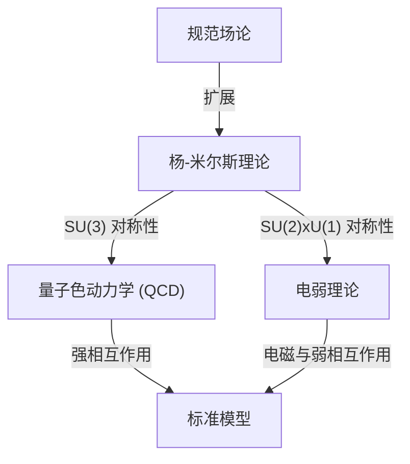

## 1. 引言：什么是千禧年大奖难题

2000年，克雷数学研究所为数学领域中七个极其重要的未解决问题各悬赏了100万美元。这被称为 **千禧年大奖难题** 。其中包括著名的「黎曼猜想」和「P/NP问题」，但有一个问题与物理学有着深厚的联系。那就是 **「[杨-米尔斯方程与质量间隙问题](https://kenji.blog/zh-cn/p/yang-mills-mass-gap/)」** （Yang-Mills and Mass Gap）。

这个问题的旨在为描述自然界基本力的粒子物理学「标准模型」奠定数学基础。构成我们世界的物质和力的行为在实验中已经得到了极高精度的证实，但在数学上严格证明它，已成为现代数学中最大的挑战之一。

本文将深入探讨杨-米尔斯理论是什么，以及质量间隙问题意味着什么。

## 2. 物理学中的规范场论

为了理解杨-米尔斯理论，我们首先需要了解 **规范场论** （Gauge Theory）。在物理学中，规范场论是指对于特定的变换（规范变换），方程的形式保持不变（不变性）的一种理论。

### 电磁学与阿贝尔规范场论

最常见的规范场论是电磁学。由詹姆斯·克拉克·麦克斯韦形式化的麦克斯韦方程组描述了电场和磁场的行为。在量子力学框架下处理这个问题的量子电动力学（QED），被称为 **U(1)规范场论** 。

在这里，称为相位的量起着重要作用。即使在空间的每一点独立地改变电子波函数的相位（局部规范变换），物理可观测的量也不会改变。为了保持这种不变性而引入的是 **规范场** ，在电磁学中，规范场相当于光子（Photon）。由于U(1)群是阿贝尔群（即使改变运算顺序，结果也相同），因此QED被称为阿贝尔规范场论。

### 非阿贝尔规范场论：杨-米尔斯理论的诞生

1954年，杨振宁（Chen-Ning Yang）和罗伯特·米尔斯（Robert Mills）扩展了基于阿贝尔群的QED，提出了一种基于非阿贝尔群（改变运算顺序结果会改变的群）的规范场论。这就是 **杨-米尔斯理论** 。

最初，他们为了解释结合质子和中子之间的「强相互作用」，构建了基于SU(2)同位旋对称性的理论。此后，该理论发展成为构成粒子物理学标准模型核心的理论。当前的标准模型，描述强相互作用的量子色动力学（QCD）是SU(3)，而统一弱相互作用和电磁力的电弱理论是基于SU(2) × U(1)的非阿贝尔规范场论。

杨-米尔斯理论的拉格朗日密度可以写成如下形式：

$$ \mathcal{L} = -\frac{1}{4} F_{\mu\nu}^a F^{a\mu\nu} $$

这里，$ F_{\mu\nu}^a $ 是场强（曲率张量），使用规范场 $ A_\mu^a $ 定义如下：

$$ F_{\mu\nu}^a = \partial_\mu A_\nu^a - \partial_\nu A_\mu^a + g f^{abc} A_\mu^b A_\nu^c $$

$ g $ 是耦合常数，$ f^{abc} $ 是李代数的结构常数。由于是非阿贝尔理论，出现了最后的非线性项，这产生了一个特殊的性质，即 **规范场自身也会发生相互作用** 。

## 3. 什么是质量间隙

杨-米尔斯理论在粒子物理学中取得了惊人的成功。它与实验结果的吻合度极高。然而，当我们试图在数学上严格处理该理论时，就会遇到一堵巨大的墙。这就是 **质量间隙** （Mass Gap）问题。

### 经典理论中的零质量规范玻色子

当我们求解经典的杨-米尔斯方程时，就像电磁学中的光子一样，传递力的粒子（规范玻色子）的质量变为零。事实上，麦克斯韦方程中的电磁波是无质量的，并以光速传播。

如果传递强相互作用的胶子质量为零，那么强相互作用也应该像电磁力一样在长距离上起作用。但在现实的物理世界中，强相互作用只在原子核般极短的距离内起作用。这意味着传递力的粒子实际上 **具有质量** （或者具有等效的效应）。

### 色禁闭与质量间隙

在量子色动力学（QCD）中，夸克和胶子不能被单独提取出来，它们总是多个聚集在一起，以颜色（色荷）被中和的状态（强子）被观测到。这被称为 **色禁闭** （Color Confinement）。

即使夸克和胶子的质量为零，它们紧密结合形成的强子（如质子和介子等）也具有有限的质量。如果将理论中真空态（能量最低的状态）的能量设为零，那么下一个最低能量状态（第一激发态，即最轻的粒子）的能量就是 $ \Delta > 0 $ 。这个 $ \Delta $ 就被称为 **质量间隙** 。

数学中千禧年大奖难题的「[杨-米尔斯方程与质量间隙问题](https://kenji.blog/zh-cn/p/yang-mills-mass-gap/)」的正式陈述大致如下：

> 对于任意紧致的单规范群 $ G $ ，必须在数学上严格证明非平凡的量子杨-米尔斯理论在 $ \mathbb{R}^4 $ 上存在，并且具有有限的质量间隙 $ \Delta > 0 $ 。

## 4. 数学上的困难：构造性量子场论

物理学家利用费曼图和重整化群的方法，从杨-米尔斯理论中推导出了许多物理预测。然而，这些方法是基于微扰论（假设相互作用较弱来进行近似计算的方法），缺乏数学上的严密性。特别是在低能区域（耦合常数变大的区域），微扰论失效，因此无法证明质量间隙和禁闭现象。

构建数学上严格的量子场论的领域被称为 **构造性量子场论** （Constructive Quantum Field Theory）。迄今为止，对于二维和三维时空中的一些模型，已经进行了严格的构建，但对于现实的四维时空中的非阿贝尔规范场论（杨-米尔斯理论），还没有人成功进行严格的构建。

### 怀特曼公理系统

作为在数学上严格处理量子场的框架， **怀特曼公理系统** （Wightman axioms）和 **奥斯特瓦尔德-施拉德公理系统** （Osterwalder-Schrader axioms）为人所知。这些将量子场应满足的性质（如庞加莱协变性、局域可交换性、谱条件等）设定为公理。

为了解决千禧年大奖难题，首先需要证明杨-米尔斯理论作为满足这些公理的严格数学对象而存在，然后必须证明光谱（能量本征值）的下界存在间隙（质量间隙）。

## 5. 格点规范场论的方法

作为通往严格证明的垫脚石，物理学家常用的一种方法是 **格点规范场论** （Lattice Gauge Theory）。这是一种将连续的时空划分为离散的网格，并在此基础上系统阐述理论的方法。

在1974年由肯尼斯·威尔逊（Kenneth Wilson）提出的这种方法中，可以自然地避免（正则化）发散到无穷大的问题。通过使用计算机进行蒙特卡罗模拟，在格点规范场论的框架下计算了强子的质量光谱，并且在数值上强烈支持有限质量间隙的存在。

$$ S_W = \beta \sum_{P} \left( 1 - \frac{1}{N_c} \text{实部} \text{迹} U_P \right) $$

这里，$ U_P $ 是沿着普拉克特（格子的最小正方形）规范场的和乐（Holonomy），$ \beta $ 是与耦合常数相关的参数。

然而，仅仅因为通过模拟在数值上展示了这一点，并不意味着我们获得了连续时空中数学上的证明。取格点间距趋于零的极限（连续极限）的过程是非常难以严格控制的。

## 6. 总结与未来展望

[杨-米尔斯方程与质量间隙问题](https://kenji.blog/zh-cn/p/yang-mills-mass-gap/)处于现代物理学和现代数学交汇的最深邃、最难解的领域。物理学家们已经使用这个理论来解开宇宙的奥秘，但数学家们尚未能证明其基础「语言」的语法是正确的。

如果这个问题得到解决，我们将完成一个强大的理解宇宙的数学框架。与此同时，这也将成为开辟数学新领域的划时代事件。虽然尚未看到决定性的解决线索，但许多天才们仍在不断挑战这个千禧年大奖难题。

描述宇宙基本力量的 **杨-米尔斯方程** ，以及赋予其质量的 **质量间隙** 。全世界都在期待着这两者之间隐藏的数学秘密被揭开的那一天。
