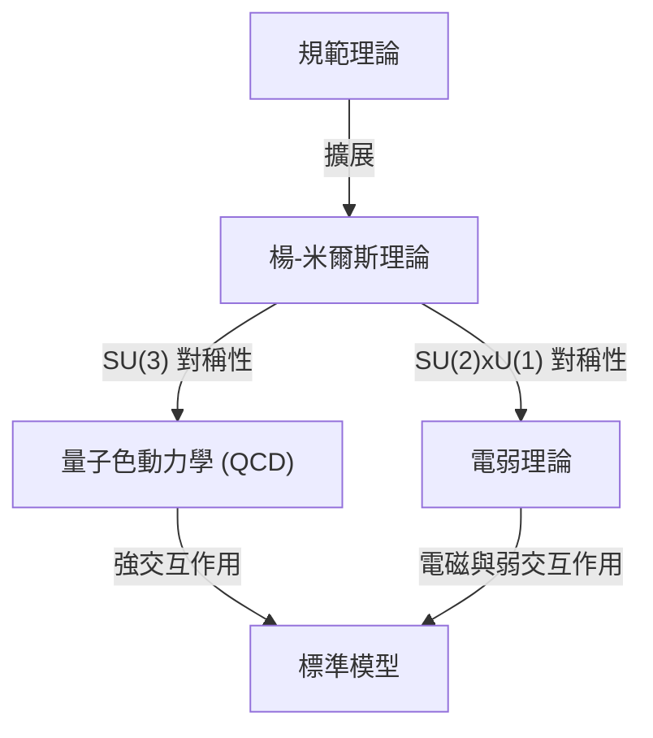

## 1. 前言：何謂千禧年大獎難題

2000年，克雷數學研究所針對數學中七個極為重要的未解決問題，分別懸賞了100萬美元的獎金。這被稱為 **千禧年大獎難題** 。其中包含了著名的「黎曼猜想」與「P/NP問題」等，但有一個問題與物理學有著深厚的關聯。那就是 **「[楊-米爾斯方程式與質量間隙問題](https://kenji.blog/p/yang-mills-mass-gap/)」** （Yang-Mills and Mass Gap）。

這個問題的目的，在於確立描述自然界基本力的粒子物理學「標準模型」的數學基礎。構成我們世界物質與力的行為，在實驗上已經以極高的精確度被證實，但要在數學上嚴格證明這一點，已成為現代數學中最大的挑戰之一。

本文將深入探討何謂楊-米爾斯理論，以及質量間隙問題代表著什麼意義。

## 2. 物理學中的規範理論

為了理解楊-米爾斯理論，我們首先必須了解 **規範理論** （Gauge Theory）。在物理學中，規範理論是指對於特定轉換（規範轉換）方程式的形式不會改變（不變量）的理論。

### 電磁學與阿貝爾規範理論

最為人熟知的規範理論就是電磁學。由詹姆斯·克拉克·馬克士威所建立的馬克士威方程組，描述了電場與磁場的行為。在量子力學的框架下處理這個問題的量子電動力學（QED），被稱為 **U(1)規範理論** 。

在這裡，稱為相位的量扮演著重要的角色。即使在空間的各個點獨立地改變電子的波函數相位（局部規範轉換），物理上的可觀測量也不會改變。為了保持這種不變性而引入的就是 **規範場** ，而電磁學中的規範場相當於光子（photon）。由於 U(1) 群是阿貝爾群（即使改變運算順序結果也相同），因此 QED 被稱為阿貝爾規範理論。

### 非阿貝爾規範理論：楊-米爾斯理論的誕生

1954年，楊振寧與羅伯特·米爾斯擴展了基於阿貝爾群的 QED，提出了基於非阿貝爾群（改變運算順序結果會改變的群）的規範理論。這就是 **楊-米爾斯理論** 。

起初，他們為了建立解釋質子與中子結合的「強作用力」，建構了基於 SU(2) 同位旋對稱性的理論。隨後，這個理論發展成為構成粒子物理學標準模型基礎的理論。目前的標準模型，描述強作用力的量子色動力學（QCD）是基於 SU(3)，統一弱作用力與電磁力的電弱理論則是基於 SU(2) × U(1) 這樣的非阿貝爾規範理論。

楊-米爾斯理論的拉格朗日密度可以寫成如下形式：

$$ \mathcal{L} = -\frac{1}{4} F_{\mu\nu}^a F^{a\mu\nu} $$

這裡，$ F_{\mu\nu}^a $ 是場的強度（曲率張量），使用規範場 $ A_\mu^a $ 定義如下：

$$ F_{\mu\nu}^a = \partial_\mu A_\nu^a - \partial_\nu A_\mu^a + g f^{abc} A_\mu^b A_\nu^c $$

$ g $ 是耦合常數，$ f^{abc} $ 是李代數的結構常數。由於是非阿貝爾理論，因此出現了最後的非線性項，這產生了 **規範場自身會產生交互作用** 的特異性質。

## 3. 何謂質量間隙

楊-米爾斯理論在粒子物理學中取得了驚人的成功。與實驗結果的吻合度極高。然而，當試圖在數學上嚴格處理該理論時，卻遇到了一堵高牆。這就是 **質量間隙** （Mass Gap）問題。

### 古典理論中質量為零的規範玻色子

如果解古典的楊-米爾斯方程式，會發現與電磁學的光子一樣，傳遞力的粒子（規範玻色子）的質量會是零。事實上，馬克士威方程組中的電磁波質量為零，並以光速傳播。

如果傳遞強作用力的膠子質量為零，那麼強作用力也應該像電磁力一樣在長距離內作用。然而，在現實的物理世界中，強作用力只在原子核程度的極短距離內起作用。這意味著傳遞力的粒子實質上 **具有質量** （或具有與之等效的效應）。

### 色禁閉與質量間隙

在量子色動力學（QCD）中，夸克與膠子無法單獨取出，而是總以多個聚集並中和顏色（色電荷）的狀態（強子）被觀測到。這被稱為 **色禁閉** （Color Confinement）。

即使夸克與膠子的質量為零，由它們強烈結合形成的強子（如質子與介子）也具有有限的質量。當理論的真空狀態（能量最低的狀態）的能量設為零時，下一個能量較低的狀態（第一個激發態，也就是最輕的粒子）的能量為 $ \Delta > 0 $。這個 $ \Delta $ 就被稱為 **質量間隙** 。

數學中千禧年大獎難題的「[楊-米爾斯方程式與質量間隙問題](https://kenji.blog/p/yang-mills-mass-gap/)」正式陳述，大致如下：

> 對於任何緊緻的單純規範群 $ G $，請在數學上嚴格證明非平庸的量子楊-米爾斯理論存在於 $ \mathbb{R}^4 $ 上，並且它具有有限的質量間隙 $ \Delta > 0 $。

## 4. 數學上的困難：構造性量子場論

物理學家利用費曼圖與重整化群的手法，從楊-米爾斯理論中得出了許多物理上的預測。然而，這些是基於微擾論（假設交互作用很弱而近似計算的手法），缺乏數學上的嚴格性。特別是在低能量區域（耦合常數變大的區域）微擾論會失效，因此無法證明質量間隙與色禁閉。

在數學上嚴格建構量子場論的領域被稱為 **構造性量子場論** （Constructive Quantum Field Theory）。到目前為止，雖然已經在2維或3維時空的一些模型中進行了嚴格的建構，但在現實的4維時空中，還沒有人成功嚴格建構出非阿貝爾規範理論（楊-米爾斯理論）。

### 懷特曼公理系

為了在數學上嚴格處理量子場的框架， **懷特曼公理系** （Wightman axioms）與 **奧斯特瓦爾德-施拉德公理系** （Osterwalder-Schrader axioms）為人所知。這些是將量子場應滿足的性質（龐加萊協變性、局部對易性、譜條件等）定為公理。

為了解決千禧年大獎難題，首先必須證明楊-米爾斯理論作為滿足這些公理的嚴格數學對象而存在，接著必須證明頻譜（能量特徵值）的下界存在間隙（質量間隙）。

## 5. 晶格規範理論的方法

作為嚴格證明的一個踏腳石，物理學家經常使用的方法是 **晶格規範理論** （Lattice Gauge Theory）。這是將連續的時空分割成離散的晶格狀，並在上面定式化理論的手法。

這個由肯尼斯·威爾遜於1974年提出的手法，可以自然地迴避（正規化）發散到無限大的問題。透過使用電腦進行蒙地卡羅模擬，在晶格規範理論的框架下計算出強子的質量譜，並且在數值上強烈支持有限質量間隙的存在。

$$ S_W = \beta \sum_{P} \left( 1 - \frac{1}{N_c} \text{Re} \text{Tr} U_P \right) $$

在這裡，$ U_P $ 是沿著普拉克特（晶格最小的正方形）的規範場和樂（holonomy），$ \beta $ 是與耦合常數相關的參數。

不過，即使在模擬中以數值方式顯示出來，也並不意味著已經獲得了連續時空中的數學證明。嚴格控制將晶格間距取向零的極限（連續極限）過程是非常困難的。

## 6. 總結與未來展望

[楊-米爾斯方程式與質量間隙問題](https://kenji.blog/p/yang-mills-mass-gap/)，位於現代物理學與現代數學交會處最深奧、最難解的領域。物理學家雖然已經使用這個理論解開了宇宙的謎團，但數學家仍未能證明作為其基礎的「語言」文法是正確的。

如果這個問題被解決，我們理解宇宙的強大數學框架將會完成。這同時也將成為開拓數學新領域的劃時代事件。儘管決定性的解決線索尚未出現，但仍有許多天才持續挑戰這個千禧年大獎難題。

描述宇宙根本力的 **楊-米爾斯方程式** ，以及為其帶來質量的 **質量間隙** 。全世界都在引頸期盼這兩者之間隱藏的數學秘密被解開的那一天。
