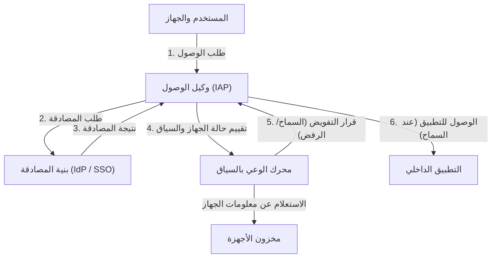

# انهيار الدفاع المحيطي: وهم 'الداخل الموثوق'

في مجال الأمن السيبراني الحديث، يجري تحول نموذجي تاريخي. يقع في صميم هذا التحول مفهوم 'بنية انعدام الثقة' (Zero Trust Architecture)، وقد كانت مبادرة 'BeyondCorp' من Google هي أول من حقق ذلك على نطاق واسع في العالم.

لعقود من الزمان، اعتمد أمن شبكات الشركات على نموذج 'القلعة والخندق' (Castle and Moat)، أي **الأمن القائم على المحيط**. الفكرة الأساسية لهذا النموذج بسيطة للغاية.
إنها ثنائية تقول إن 'المستخدمين والأجهزة الموجودة داخل (الخندق) المتمثل في جدران الحماية وشبكات VPN (شبكة الشركة) آمنة، بينما أولئك الموجودون في الخارج (الإنترنت) يمثلون خطرًا'.

ومع ذلك، فإن هذا النهج كان يعاني من عيب قاتل.
بمجرد أن يخترق المهاجم المحيط ويكتسب إمكانية الوصول إلى الشبكة الداخلية، ونظرًا لأن الداخل يعتبر منطقة 'موثوقة'، يمكنه التحرك بحرية (الحركة الجانبية أو Lateral Movement). إن أساليب الهجوم الحديثة مثل الإصابة بالبرامج الضارة، والتهديدات الداخلية، وسرقة بيانات الاعتماد من خلال التصيد الاحتيالي، تتجاوز الدفاع المحيطي بسهولة تامة. وبشكل خاص، مع انتشار الخدمات السحابية وتحول العمل عن بُعد إلى الوضع الطبيعي الجديد، لم يعد 'المحيط الذي يجب حمايته' موجودًا ماديًا، ووصل الدفاع المحيطي إلى حدوده القصوى.

## حدود VPN وخطر الحركة الجانبية

كانت الشبكات الافتراضية الخاصة (VPN) التقليدية تعمل كنفق لجلب المستخدمين الخارجيين بأمان إلى الشبكة الداخلية. ومع ذلك، تمنح شبكات VPN 'وصولاً على مستوى الشبكة'. غالبًا ما يصبح بإمكان المستخدم الذي يجتاز المصادقة الوصول عبر الشبكة إلى أنظمة وقواعد بيانات داخلية أخرى لا يحتاجها في الواقع.

إذا حصل المهاجم على بيانات اعتماد VPN الخاصة بموظف عادي، فسيتمكن من شن عمليات مسح للشبكة وهجمات استغلال الثغرات حتى ضد خوادم المعلومات السرية التي لا ينبغي أن يمتلك الموظف حق الوصول إليها. هذا هو الخطر المرعب للحركة الجانبية، وهو أكبر نقطة ضعف في نموذج الدفاع المحيطي.

---

# المبدأ الأساسي لانعدام الثقة: 'لا تثق أبدًا، وتحقق دائمًا'

مفهوم 'انعدام الثقة' (Zero Trust)، الذي اقترحه جون كيندرفاغ من Forrester Research في عام 2010، هو مفهوم يهدف إلى حل هذه المشكلة الأساسية.
الفكرة الجوهرية لانعدام الثقة هي فكرة واحدة فقط:
**'لا تثق افتراضيًا بأي مستخدم أو جهاز أو نظام، بغض النظر عن موقع الشبكة (سواء داخل الشركة أو خارجها). يجب التحقق من جميع طلبات الوصول دائمًا.'**

في بنية انعدام الثقة، تفقد مفاهيم 'الداخل' و 'الخارج' معناها. سواء كان جهاز كمبيوتر متصلاً بشبكة LAN سلكية في المكتب، أو هاتفًا ذكيًا متصلاً بشبكة Wi-Fi في ستاربكس، يجب أن يخضع لنفس عملية المصادقة والتفويض الصارمة تمامًا.

## المبادئ الثلاثة لانعدام الثقة

1. **المصادقة والتفويض الآمن للوصول إلى جميع الموارد**
   يتم التحكم في الوصول بناءً على الهوية (من) والسياق (ما هي الحالة)، وليس موقع الشبكة.
2. **التطبيق الصارم لمبدأ الامتياز الأقل (PoLP: Principle of Least Privilege)**
   يُمنح المستخدمون والأجهزة الحد الأدنى فقط من الامتيازات اللازمة لأداء مهامهم، وللوقت المطلوب فقط.
3. **المراقبة والتحقق المستمران**
   مجرد اجتياز المصادقة مرة واحدة لا يعني الوثوق بتلك الجلسة إلى الأبد. تتم مراقبة الحالة الأمنية للجهاز وسلوك المستخدم في الوقت الفعلي، وإذا تم اكتشاف أي شذوذ، يتم قطع الوصول على الفور.

---

# Google BeyondCorp: تجسيد انعدام الثقة

اتخذت Google قرارًا بإصلاح بنية شبكتها الداخلية من الألف إلى الياء استجابةً للهجوم السيبراني المتطور من الصين (عملية أورورا - Operation Aurora) الذي حدث في عام 2009. المشروع الذي نشأ عن ذلك كان 'BeyondCorp'.

BeyondCorp هو أول حالة في العالم تثبت مفهوم انعدام الثقة على مستوى المؤسسات، وأصبح المخطط الأساسي للعديد من حلول انعدام الثقة الحالية (مثل IAP: Identity-Aware Proxy).

## العناصر الأساسية المكونة لـ BeyondCorp

تتكون بنية BeyondCorp من مكونات متعددة تعمل معًا بشكل وثيق.

### 1. مخزون الأجهزة (Device Inventory)
لم تولِ Google أهمية كبيرة فقط لمن 'يصل' إلى الشبكة، بل أيضًا 'من أي جهاز'. قامت ببناء مستودع مركزي لمعلومات الأجهزة المُدارة (Managed Device) التي تتحكم فيها الشركة وتم تأكيد أمانها.
يتم إصدار شهادة فريدة (Device Certificate) لكل جهاز، وتتم مزامنة معلومات أجهزة الكمبيوتر، وإصدار نظام التشغيل، وحالة التشفير بشكل مستمر مع قاعدة البيانات.

### 2. إدارة المستخدمين والمجموعات (Identity Management)
يتم دمجه مع بنية تحتية مركزية للهوية (IAM)، حيث تتم إدارة معلومات السمات الخاصة بالمستخدمين بدقة مثل الانتماءات، والألقاب الوظيفية، والمشاريع. المصادقة متعددة العوامل (MFA) هي مطلب إلزامي، ولا يُسمح بمصادقة كلمة المرور البسيطة.

### 3. محرك الوعي بالسياق (Trust Inference / Context-Aware Access)
هذا المحرك هو عقل BeyondCorp. يقوم بتحليل هوية المستخدم وحالة الجهاز في الوقت الفعلي لحساب 'درجة الثقة' ديناميكيًا.
على سبيل المثال، حتى لو كان 'مستخدمًا صحيحًا'، إذا كان طلب الوصول من 'جهاز لم يتم تطبيق تصحيحات نظام التشغيل عليه'، أو من 'عنوان IP خارجي غير معتاد'، فسيتم تقييم الخطر على أنه مرتفع، وسيتم رفض الوصول أو طلب مصادقة إضافية.

### 4. وكيل الوصول (Access Proxy)
إنها البوابة التي تعمل كمدخل لجميع التطبيقات الداخلية. بدلاً من الاتصال على مستوى الشبكة مثل VPN، يعمل كوكيل عكسي (Reverse Proxy) لكل تطبيق على حدة.
يتلقى الوكيل الطلبات من المستخدمين والأجهزة، ويستعلم محرك الوعي بالسياق لتحديد ما إذا كان يجب السماح بالوصول (التفويض). فقط في حالة السماح، يقوم الوكيل بتوجيه الطلب إلى تطبيق الواجهة الخلفية.

### 5. محرك التحكم في الوصول (Access Control Engine)
يدير بشكل مركزي قواعد حقوق الوصول لموارد كل تطبيق (من يمكنه الوصول، ومن أي حالة جهاز)، ويتعاون مع الوكيل لفرض السياسات.

---

# رسم توضيحي للبنية: تدفق الوصول في BeyondCorp

يوضح الشكل أدناه تدفق معالجة طلبات الوصول في بنية BeyondCorp.

من خلال هذا التدفق، يختفي مفهوم الشبكة الداخلية، ويتم تشفير جميع الاتصالات على الإنترنت، مما يحقق بيئة يتم فيها تنفيذ المصادقة والتفويض لكل طلب على حدة.

---

# القيمة الحقيقية لمبدأ الامتياز الأقل (PoLP) والتحكم الديناميكي في الوصول

لا تكمن القيمة الحقيقية لانعدام الثقة و BeyondCorp في مجرد تعزيز الأمن فحسب، بل في **تحسين المرونة والإنتاجية**.

في نموذج الدفاع المحيطي، كانت محاولة تعزيز الأمن تؤدي إلى قيود أكثر صرامة على VPN، مما يقلل من راحة المستخدمين. ومع ذلك، في نموذج BeyondCorp، طالما كان لدى المستخدمين اتصال بالإنترنت، يمكنهم الوصول بأمان وسلاسة إلى التطبيقات الداخلية من أي مكان في العالم. لا توجد متاعب في تشغيل عميل VPN، ولا يوجد تأخير في الشبكة.

علاوة على ذلك، يتيح 'التحكم الديناميكي في الوصول' تطبيق سياسات أمان مرنة بناءً على الموقف.
- **السيناريو أ:** في حالة الوصول من جهاز كمبيوتر مقدم من الشركة (يلبي متطلبات الأمان بالكامل)، يُسمح بالوصول إلى مستودع التعليمات البرمجية المصدرية شديد السرية.
- **السيناريو ب:** إذا وصل نفس المستخدم من هاتفه الذكي الشخصي (BYOD)، فيُسمح له بقراءة رسائل البريد الإلكتروني، ولكن يُحظر عليه تنزيل التعليمات البرمجية المصدرية.

بهذه الطريقة، تعد القدرة على التحكم الدقيق (Granular) في الامتيازات بناءً على السياق هي الأساس الذي يدعم أساليب العمل المتنوعة الحديثة (والتي تسمى 'عمليات في أي مكان' أو 'Anywhere Operations' في سياق انعدام الثقة).

# مستقبل انعدام الثقة: نحو معيار الأمن للجيل القادم

بدأت مبادرة BeyondCorp من Google كنظام خاص بشركة معينة، ولكن هذا المفهوم سرعان ما أصبح معيارًا للصناعة. نشر المعهد الوطني للمعايير والتكنولوجيا (NIST) المبادئ التوجيهية القياسية لبنية انعدام الثقة باسم 'SP 800-207'، كما ألزم الوكالات الحكومية الأمريكية باعتمادها.

في عصر التقنيات السحابية الأصلية (Cloud-Native)، يتم تحويل البنية التحتية إلى تعليمات برمجية (Infrastructure as Code)، ويتم توزيع التطبيقات كخدمات مصغرة (Microservices). في هذه البيئة المعقدة، من المستحيل حماية الأنظمة بالدفاع المحيطي التقليدي.

على الرغم من أن مبدأ انعدام الثقة 'لا تثق بأحد' له وقع بارد للوهلة الأولى، إلا أنه يقدم بشكل متناقض رؤية لشبكة مستقبلية مفتوحة ومرنة للغاية: **'مع وجود المصادقة والتحقق الدقيقين، يمكن لأي شخص الوصول بحرية وأمان إلى البيانات بغض النظر عن الموقع أو الجهاز.'**

لم تعد بنية انعدام الثقة مجرد مصطلح طنان، بل يمكن القول إنها النقطة الحتمية للتطور الذي يجب أن تهدف إليه جميع المنظمات.
