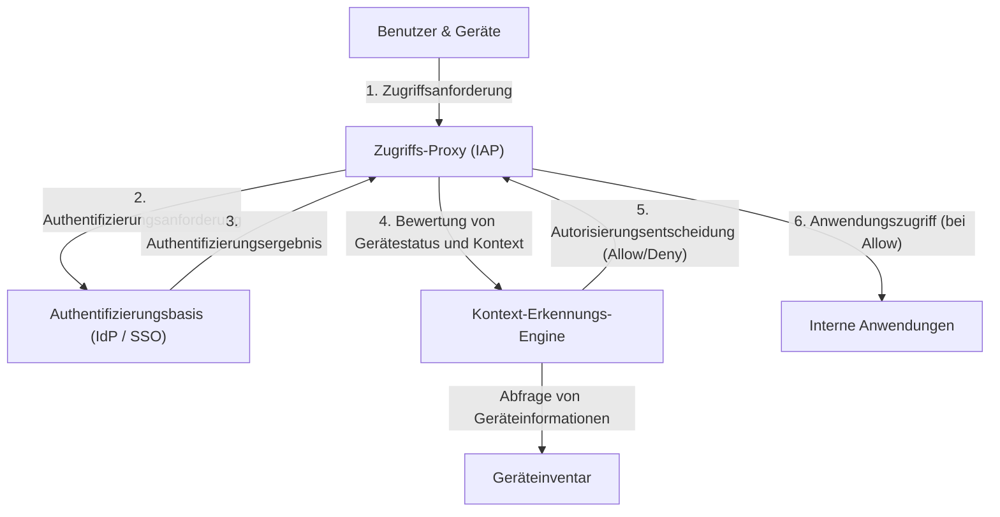

# Der Zusammenbruch der Perimeter-Verteidigung: Die Illusion des "vertrauenswürdigen Inneren"

In der modernen Cybersicherheit vollzieht sich ein historischer Paradigmenwechsel. Im Zentrum steht das Konzept der "Zero-Trust-Architektur", das von Googles "BeyondCorp" weltweit als erstes und in großem Maßstab umgesetzt wurde.

Jahrzehntelang verließ sich die Netzwerksicherheit von Unternehmen auf das "Burg und Wassergraben"-Modell (Castle and Moat), also auf **Perimeter-basierte Sicherheit**. Der Grundgedanke dieses Modells ist extrem simpel.
Es ist eine Dualität: "Benutzer und Geräte innerhalb des 'Wassergrabens' wie Firewalls und VPNs (Unternehmensnetzwerk) sind sicher, während alles außerhalb (Internet) gefährlich ist."

Dieser Ansatz wies jedoch einen fatalen Fehler auf.
Sobald ein Angreifer den Perimeter durchbricht und Zugang zum internen Netzwerk erlangt, kann er sich frei bewegen (Lateral Movement: seitliche Bewegung), da das Innere als "vertrauenswürdiger" Bereich gilt. Moderne Angriffsmethoden wie Malware-Infektionen, Insider-Bedrohungen und der Diebstahl von Anmeldedaten durch Phishing umgehen die Perimeter-Verteidigung mit Leichtigkeit. Besonders durch die Verbreitung von Cloud-Diensten und die Normalisierung von Remote-Arbeit existiert der "zu schützende Perimeter" physisch nicht mehr, wodurch die Perimeter-Verteidigung an ihre Grenzen stieß.

## Die Grenzen von VPNs und die Bedrohung durch Lateral Movement

Traditionelle VPNs (Virtual Private Networks) fungierten als Tunnel, um externe Benutzer sicher in das interne Netzwerk zu bringen. Allerdings gewähren VPNs "Zugang auf Netzwerkebene". Nach erfolgreicher Authentifizierung können Benutzer oft auf andere interne Systeme oder Datenbanken zugreifen, die sie eigentlich nicht benötigen.

Wenn ein Angreifer die VPN-Anmeldedaten eines normalen Mitarbeiters stiehlt, kann er Netzwerkscans oder Schwachstellenangriffe selbst gegen Server mit vertraulichen Informationen durchführen, für die dieser Mitarbeiter keine Zugriffsrechte haben sollte. Dies ist die Gefahr des Lateral Movements und die größte Schwachstelle des Perimeter-Verteidigungsmodells.

---

# Das Grundprinzip von Zero Trust: "Niemals vertrauen, immer verifizieren"

Das 2010 von John Kindervag (Forrester Research) vorgeschlagene Konzept "Zero Trust" soll dieses grundlegende Problem lösen.
Der Kerngedanke von Zero Trust ist einzig und allein:
**"Unabhängig vom Netzwerkstandort (intern oder extern) wird standardmäßig keinem Benutzer, Gerät oder System vertraut. Jede Zugriffsanforderung muss immer verifiziert werden."**

In der Zero-Trust-Architektur haben die Konzepte von "intern" und "extern" keine Bedeutung. Ein über das kabelgebundene LAN im Büro verbundener PC muss genau denselben strengen Authentifizierungs- und Autorisierungsprozess durchlaufen wie ein Smartphone, das mit dem Starbucks-WLAN verbunden ist.

## Die drei Prinzipien von Zero Trust

1. **Sichere Authentifizierung und Autorisierung für den Zugriff auf alle Ressourcen**
   Der Zugriff wird basierend auf Identität (Wer) und Kontext (Welcher Zustand) gesteuert, nicht auf dem Netzwerkstandort.
2. **Strikte Einhaltung des Prinzips der geringsten Rechte (PoLP: Principle of Least Privilege)**
   Benutzern und Geräten werden nur die minimalen Berechtigungen erteilt, die zur Ausführung ihrer Aufgaben erforderlich sind, und das nur für die benötigte Zeit.
3. **Kontinuierliche Überwachung und Verifizierung**
   Eine erfolgreiche Authentifizierung bedeutet nicht, dass der Sitzung ewig vertraut wird. Der Sicherheitsstatus des Geräts und das Verhalten des Benutzers werden in Echtzeit überwacht. Werden Anomalien erkannt, wird der Zugriff sofort blockiert.

---

# Google BeyondCorp: Die Realisierung von Zero Trust

Ausgelöst durch einen hochentwickelten Cyberangriff aus China im Jahr 2009 (Operation Aurora) beschloss Google, die Architektur seines internen Netzwerks grundlegend zu überarbeiten. Das daraus resultierende Projekt war "BeyondCorp".

BeyondCorp ist das weltweit erste Beispiel, das das Zero-Trust-Konzept im Unternehmensmaßstab demonstriert hat, und dient als Blaupause für viele heutige Zero-Trust-Lösungen (z. B. IAP: Identity-Aware Proxy).

## Die Kernelemente von BeyondCorp

Die Architektur von BeyondCorp basiert auf der engen Zusammenarbeit mehrerer Komponenten.

### 1. Geräteinventar (Device Inventory)
Google legte nicht nur großen Wert darauf, "wer" zugreift, sondern auch "von welchem Gerät" zugegriffen wird. Es wurde ein zentrales Repository mit Informationen zu vom Unternehmen verwalteten und als sicher bestätigten Geräten (Managed Devices) aufgebaut.
Jedes Gerät erhält ein eindeutiges Zertifikat (Device Certificate), und Hardwareinformationen, OS-Versionen, Verschlüsselungsstatus usw. des Geräts werden kontinuierlich mit der Datenbank synchronisiert.

### 2. Identitäts- und Gruppenverwaltung (Identity Management)
Integriert in eine zentrale Identitätsbasis (IAM) werden Attributinformationen wie Abteilung, Position und Projekte des Benutzers genau verwaltet. Multi-Faktor-Authentifizierung (MFA) ist eine zwingende Voraussetzung; eine einfache Passwort-Authentifizierung ist nicht zulässig.

### 3. Kontext-Erkennungs-Engine (Trust Inference / Context-Aware Access)
Diese Engine ist das Gehirn von BeyondCorp. Sie analysiert die Benutzeridentität und den Gerätestatus in Echtzeit und berechnet dynamisch einen "Vertrauenswert" (Trust Score).
Wenn beispielsweise ein Zugriffsversuch von einem "richtigen Benutzer", aber von einem "Gerät ohne angewendete OS-Patches" oder von einer "ungewöhnlichen IP-Adresse aus dem Ausland" erfolgt, wird das Risiko als hoch eingestuft und der Zugriff verweigert oder eine zusätzliche Authentifizierung gefordert.

### 4. Zugriffs-Proxy (Access Proxy)
Das Gateway, das als Eingangstor zu allen internen Anwendungen dient. Anstelle einer Verbindung auf Netzwerkebene wie bei einem VPN fungiert es als Reverse-Proxy für jede einzelne Anwendung.
Der Proxy empfängt Anfragen von Benutzern und Geräten, fragt die Kontext-Erkennungs-Engine ab und entscheidet, ob der Zugriff gewährt werden soll (Autorisierung). Nur wenn er gewährt wird, leitet der Proxy die Anfrage an die Backend-Anwendung weiter.

### 5. Zugriffskontroll-Engine (Access Control Engine)
Sie verwaltet zentral die Zugriffsregeln für die Ressourcen jeder Anwendung (wer kann von welchem Gerätestatus aus zugreifen) und setzt Richtlinien in Zusammenarbeit mit dem Proxy durch.

---

# Architekturdiagramm: Der Zugriffsfluss von BeyondCorp

Das folgende Diagramm zeigt den Verarbeitungsfluss von Zugriffsanforderungen in der BeyondCorp-Architektur.

Durch diesen Ablauf verschwindet das Konzept eines internen Netzwerks. Es entsteht eine Umgebung, in der die gesamte Kommunikation über das Internet verschlüsselt ist und für jede Anfrage eine Authentifizierung und Autorisierung durchgeführt wird.

---

# Die wahre Stärke von PoLP (Prinzip der geringsten Rechte) und dynamischer Zugriffskontrolle

Der wahre Wert von Zero Trust und BeyondCorp liegt nicht nur in der Erhöhung der Sicherheit, sondern auch in der **Verbesserung von Flexibilität und Produktivität**.

Im Perimeter-Verteidigungsmodell führten Versuche, die Sicherheit zu erhöhen, zu strengeren VPN-Einschränkungen, was den Komfort für die Benutzer verringerte. Im BeyondCorp-Modell können Benutzer jedoch von überall auf der Welt nahtlos und sicher auf interne Anwendungen zugreifen, solange sie eine Internetverbindung haben. Es gibt weder den Aufwand, einen VPN-Client zu starten, noch Netzwerkverzögerungen.

Darüber hinaus ermöglicht die "dynamische Zugriffskontrolle" die Anwendung flexibler, situationsabhängiger Sicherheitsrichtlinien.
- **Szenario A:** Wenn der Zugriff über einen vom Unternehmen bereitgestellten PC (der alle Sicherheitsanforderungen erfüllt) erfolgt, wird der Zugriff auf stark vertrauliche Quellcode-Repositories gewährt.
- **Szenario B:** Wenn derselbe Benutzer über sein privates Smartphone (BYOD) zugreift, darf er E-Mails lesen, das Herunterladen von Quellcode ist jedoch verboten.

Diese Fähigkeit, Berechtigungen je nach Kontext granular zu steuern, ist das Fundament, das moderne, vielfältige Arbeitsstile (im Kontext von Zero Trust auch "Anywhere Operations" genannt) unterstützt.

# Die Zukunft von Zero Trust: Der Standard für die Sicherheit der nächsten Generation

Googles BeyondCorp begann als proprietäres System eines bestimmten Unternehmens, aber das Konzept wurde schnell zum Industriestandard. Das NIST (National Institute of Standards and Technology) hat Standardrichtlinien für Zero-Trust-Architekturen als "SP 800-207" veröffentlicht und verlangt deren Übernahme durch US-Regierungsbehörden.

In der Cloud-Native-Ära wird Infrastruktur als Code (Infrastructure as Code) definiert und Anwendungen werden als Microservices dezentralisiert. In dieser komplexen Umgebung ist es unmöglich, Systeme durch traditionelle Perimeter-Verteidigung vollständig zu schützen.

Zero Trust mag mit seinem Grundsatz "Niemandem vertrauen" auf den ersten Blick kalt klingen, aber paradoxerweise präsentiert es eine extrem offene und flexible Form des zukünftigen Netzwerks: **"Solange eine genaue Authentifizierung und Verifizierung vorliegt, kann jeder, unabhängig von Standort oder Gerät, frei und sicher auf Daten zugreifen."**

Die Zero-Trust-Architektur ist nicht länger nur ein Modewort, sondern der unvermeidliche evolutionäre Endpunkt, den jede Organisation anstreben sollte.
