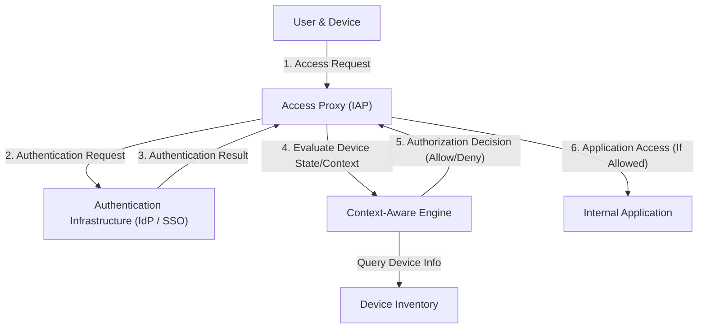

# The Collapse of Perimeter Defense: The Illusion of the "Trusted Inside"

A historic paradigm shift is underway in modern cybersecurity. At the center of this transformation lies the concept of "Zero Trust Architecture," which was realized earlier and on a larger scale than anywhere else by Google's "BeyondCorp."

For decades, enterprise network security has relied on the "Castle and Moat" model, namely **perimeter-based security**. The fundamental philosophy of this model is extremely simple.
It is a binary approach: "Users and devices inside the 'moat' (the corporate network) formed by firewalls and VPNs are safe, while everything outside (the internet) is dangerous."

However, this approach harbored a fatal flaw.
Once an attacker breaches the perimeter and gains access to the internal network, they can move around freely (lateral movement) because the inside is considered a "trusted" zone. Modern attack methods such as malware infections, insider threats, and credential theft via phishing can easily bypass perimeter defenses. Furthermore, with the widespread adoption of cloud services and the normalization of remote work, the "perimeter to defend" itself has physically disappeared, bringing perimeter defense to its limits.

## The Limitations of VPNs and the Threat of Lateral Movement

Traditional VPNs (Virtual Private Networks) functioned as a tunnel to securely bring external users into the internal network. However, a VPN grants "network-level access." Users who pass authentication often become network-reachable to other internal systems and databases that they do not inherently need to access.

If an attacker steals a regular employee's VPN credentials, they can launch network scans or exploit vulnerabilities against confidential information servers that the employee shouldn't even have access to. This is the terror of lateral movement and the greatest weakness of the perimeter defense model.

---

# The Core Principle of Zero Trust: "Never Trust, Always Verify"

Proposed in 2010 by John Kindervag of Forrester Research, "Zero Trust" is a concept designed to solve this fundamental problem.
The core philosophy of Zero Trust is just one thing:
**"Regardless of the network location (internal or external), no user, device, or system is trusted by default. Every access request must always be verified."**

In a Zero Trust Architecture, the concepts of "internal" and "external" have no meaning. Whether it is a PC connected to the office's wired LAN or a smartphone connected to a Starbucks Wi-Fi, it must pass through the exact same rigorous authentication and authorization processes.

## The Three Principles of Zero Trust

1. **Securely authenticate and authorize access to all resources**
   Access is controlled based on identity (who) and context (what state), not on network location.
2. **Strict enforcement of the Principle of Least Privilege (PoLP)**
   Users and devices are granted only the minimum privileges necessary to perform their tasks, and only for the required amount of time.
3. **Continuous monitoring and verification**
   Just because authentication was passed once does not mean the session is trusted forever. The security posture of the device and user behavior are monitored in real-time, and access is immediately cut off if anomalies are detected.

---

# Google BeyondCorp: The Embodiment of Zero Trust

Prompted by a highly sophisticated cyberattack from China in 2009 (Operation Aurora), Google made the decision to fundamentally overhaul its internal network architecture. The resulting project was "BeyondCorp."

BeyondCorp is the world's first case of demonstrating the Zero Trust concept on an enterprise scale, and it serves as the blueprint for many of today's Zero Trust solutions (such as IAP: Identity-Aware Proxy).

## Core Elements Constituting BeyondCorp

The architecture of BeyondCorp is built upon the close integration of several components.

### 1. Device Inventory
Google placed immense importance not only on "who" is accessing but also on "from which device." They built a central repository of information on devices managed by the enterprise and verified as safe (Managed Devices).
Each device is issued a unique certificate (Device Certificate), and hardware information, OS version, encryption status, and other details of the device are continuously synchronized with the database.

### 2. Identity Management
Integrated with a centralized Identity and Access Management (IAM) infrastructure, attribute information such as the user's affiliation, job title, and projects are accurately managed. Multi-Factor Authentication (MFA) is a mandatory requirement; mere password authentication is not permitted.

### 3. Trust Inference / Context-Aware Access Engine
This engine is the brain of BeyondCorp. It analyzes the user's identity and device state in real-time to dynamically calculate a "trust score."
For instance, even if it is the "right user," if the access request comes from a "device missing OS patches" or from an "unusual overseas IP address," it is judged as high-risk, and access may be denied or additional authentication requested.

### 4. Access Proxy
This is the gateway that serves as the entrance to all internal applications. Rather than a network-level connection like a VPN, it functions as a reverse proxy for each application.
The proxy receives requests from users and devices, queries the context-aware engine, and decides whether access should be permitted (authorization). Only when authorized does the proxy forward the request to the backend application.

### 5. Access Control Engine
It centrally manages the access right rules for each application's resources (who can access it and from what device state) and enforces policies in coordination with the proxy.

---

# Architectural Diagram: BeyondCorp Access Flow

Below is a diagram illustrating the processing flow of an access request in the BeyondCorp architecture.

Through this flow, the concept of an internal network vanishes, realizing an environment where all communications on the internet are encrypted, and authentication and authorization are executed for every single request.

---

# The True Value of PoLP and Dynamic Access Control

The true value of Zero Trust and BeyondCorp lies not merely in strengthening security, but in **enhancing flexibility and productivity**.

In the perimeter defense model, attempts to strengthen security led to stricter VPN constraints, reducing user convenience. However, in the BeyondCorp model, users can seamlessly and securely access internal applications from anywhere in the world as long as they have the internet. There is no hassle of launching a VPN client, nor is there network latency.

Furthermore, "dynamic access control" enables the application of flexible security policies tailored to the situation.
- **Scenario A:** If accessed from a company-issued PC (which fully meets security requirements), access to highly confidential source code repositories is permitted.
- **Scenario B:** If the same user accesses from a personal smartphone (BYOD), reading emails is allowed, but downloading source code is prohibited.

This ability to granularly control privileges based on context forms the foundation supporting modern, diverse work styles (referred to as "Anywhere Operations" in the context of Zero Trust).

# The Future of Zero Trust: Toward the Standard for Next-Generation Security

Google's BeyondCorp began as a proprietary system for a specific company, but its concepts rapidly became an industry standard. NIST (National Institute of Standards and Technology) published standard guidelines for Zero Trust Architecture as "SP 800-207," and it has even mandated its adoption by U.S. government agencies.

In the cloud-native era, infrastructure is treated as code, and applications are decentralized as microservices. In this complex environment, it is impossible to fully protect systems with traditional perimeter defenses.

"Trust no one" may sound cold at first, but paradoxically, it presents a vision for a highly open and flexible future network: **"As long as there is accurate authentication and verification, anyone can freely and securely access data, regardless of location or device."**

Zero Trust Architecture is no longer just a buzzword; it can be said to be the inevitable evolutionary destination that every organization should aim for.
