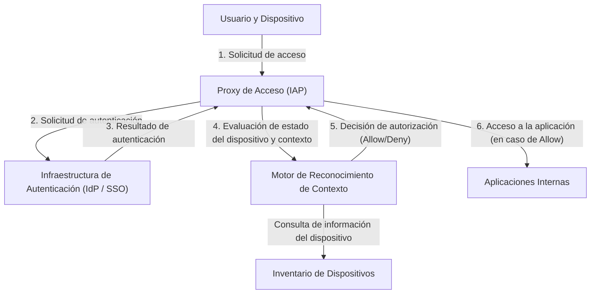

# El colapso de la defensa perimetral: La ilusión del "interior confiable"

Un cambio de paradigma histórico está en marcha en la ciberseguridad moderna. En el centro de esto se encuentra el concepto de "Arquitectura Zero Trust" (Confianza Cero), que fue materializado por primera vez y a mayor escala en el mundo por "BeyondCorp" de Google.

Durante décadas, la seguridad de las redes corporativas ha dependido del modelo de "Castillo y Foso" (Castle and Moat), es decir, la **seguridad basada en el perímetro**. La idea básica de este modelo es sumamente simple.
Es un dualismo que dice: "Los usuarios y dispositivos dentro del 'foso' (la red corporativa) creado por firewalls o VPNs son seguros, mientras que lo que está afuera (Internet) es peligroso".

Sin embargo, este enfoque tenía un defecto fatal.
Una vez que un atacante traspasa el perímetro y obtiene acceso a la red interna, al ser considerada un área "confiable", puede moverse libremente (movimiento lateral). Los métodos de ataque modernos, como las infecciones por malware, las amenazas internas y el robo de credenciales mediante phishing, evaden fácilmente la defensa perimetral. En particular, con la popularización de los servicios en la nube y la normalización del trabajo remoto, el "perímetro a defender" ya no existe físicamente, llevando a la defensa perimetral a su límite.

## Las limitaciones de las VPN y la amenaza del movimiento lateral

Las VPN (Redes Privadas Virtuales) tradicionales funcionaban como un túnel para llevar de manera segura a los usuarios externos hacia la red interna. Sin embargo, las VPN otorgan "acceso a nivel de red". Un usuario que pasa la autenticación a menudo puede alcanzar otros sistemas y bases de datos internos que originalmente no necesitaba a nivel de red.

Si un atacante roba las credenciales VPN de un empleado común, puede lanzar escaneos de red o ataques de vulnerabilidad incluso contra servidores de información confidencial a los que ese empleado no debería tener acceso. Esta es la amenaza del movimiento lateral y la mayor debilidad del modelo de defensa perimetral.

---

# El principio fundamental de Zero Trust: "Nunca confíes, siempre verifica"

"Zero Trust", propuesto en 2010 por John Kindervag de Forrester Research, es un concepto diseñado para resolver este problema fundamental.
La idea central de Zero Trust es solo una:
**"Independientemente de la ubicación en la red (interna o externa), ningún usuario, dispositivo o sistema es confiable por defecto. Todas las solicitudes de acceso deben ser verificadas siempre."**

En la arquitectura Zero Trust, los conceptos de "interno" y "externo" no tienen sentido. Ya sea una PC conectada a la red cableada de la oficina o un smartphone conectado al Wi-Fi de un Starbucks, ambos deben pasar por procesos de autenticación y autorización estrictamente idénticos.

## Los 3 principios de Zero Trust

1. **Autenticar y autorizar de forma segura el acceso a todos los recursos**
   El acceso se controla en función de la identidad (quién) y el contexto (en qué estado), no de la ubicación en la red.
2. **Aplicación estricta del Principio de Mínimo Privilegio (PoLP)**
   A los usuarios y dispositivos se les otorgan solo los privilegios mínimos necesarios para realizar sus tareas, y solo durante el tiempo necesario.
3. **Monitoreo y verificación continuos**
   Pasar la autenticación una vez no significa que la sesión sea confiable para siempre. Se monitorea en tiempo real el estado de seguridad del dispositivo y el comportamiento del usuario, cortando el acceso inmediatamente si se detecta una anomalía.

---

# Google BeyondCorp: La encarnación de Zero Trust

A raíz de un ataque cibernético avanzado desde China en 2009 (Operación Aurora), Google decidió rediseñar radicalmente la arquitectura de su red interna. El proyecto resultante fue "BeyondCorp".

BeyondCorp es el primer caso en el mundo en demostrar el concepto de Zero Trust a escala empresarial, y sirve de modelo para muchas soluciones actuales de Zero Trust (como IAP: Identity-Aware Proxy).

## Elementos centrales que componen BeyondCorp

La arquitectura de BeyondCorp se compone de varios componentes que trabajan en estrecha colaboración.

### 1. Inventario de Dispositivos (Device Inventory)
Google dio suma importancia no solo a "quién" está accediendo, sino "desde qué dispositivo". Construyó un repositorio central de información de dispositivos gestionados por la empresa y cuya seguridad ha sido confirmada (Managed Device).
A cada dispositivo se le emite un certificado único (Device Certificate), y su información de hardware, versión del sistema operativo y estado de cifrado se sincronizan continuamente con la base de datos.

### 2. Gestión de Identidades (Identity Management)
Integrado con una infraestructura centralizada de Identidad y Acceso (IAM), se gestionan de forma precisa los atributos del usuario, como su departamento, cargo y proyectos. La Autenticación Multifactor (MFA) es un requisito obligatorio; la autenticación de solo contraseña no está permitida.

### 3. Motor de Reconocimiento de Contexto (Trust Inference / Context-Aware Access)
Este motor es el cerebro de BeyondCorp. Analiza la identidad del usuario y el estado del dispositivo en tiempo real para calcular dinámicamente una "puntuación de confianza".
Por ejemplo, incluso si es el "usuario correcto", si la solicitud de acceso proviene de "un dispositivo sin parches del sistema operativo aplicados" o desde "una dirección IP extranjera inusual", considerará el riesgo alto y denegará el acceso o solicitará autenticación adicional.

### 4. Proxy de Acceso (Access Proxy)
Es la puerta de entrada a todas las aplicaciones internas. En lugar de una conexión a nivel de red como una VPN, funciona como un proxy inverso por cada aplicación.
El proxy recibe las solicitudes del usuario y el dispositivo, y consulta al motor de reconocimiento de contexto para decidir si debe conceder el acceso (autorización). Solo si se concede, el proxy reenvía la solicitud a la aplicación en el backend.

### 5. Motor de Control de Acceso (Access Control Engine)
Gestiona de forma centralizada las reglas de derechos de acceso a los recursos de cada aplicación (quién puede acceder y desde qué estado del dispositivo) y colabora con el proxy para hacer cumplir las políticas.

---

# Diagrama de Arquitectura: Flujo de acceso en BeyondCorp

A continuación se muestra un diagrama que ilustra el flujo de procesamiento de una solicitud de acceso en la arquitectura de BeyondCorp.

Con este flujo, desaparece el concepto de red interna y se logra un entorno donde todas las comunicaciones en Internet están cifradas y se ejecuta autenticación y autorización en cada solicitud.

---

# El verdadero valor del Principio de Mínimo Privilegio (PoLP) y el Control de Acceso Dinámico

El verdadero valor de Zero Trust y BeyondCorp no radica solo en fortalecer la seguridad, sino en **mejorar la flexibilidad y la productividad**.

En el modelo de defensa perimetral, los intentos de fortalecer la seguridad endurecían las restricciones de la VPN, disminuyendo la comodidad del usuario. Sin embargo, en el modelo BeyondCorp, los usuarios pueden acceder de forma segura y sin problemas a las aplicaciones internas desde cualquier parte del mundo siempre que tengan Internet. No hay necesidad de iniciar clientes VPN ni lidiar con latencia de red.

Además, el "control de acceso dinámico" permite la aplicación de políticas de seguridad flexibles adaptadas a la situación.
- **Escenario A:** En el caso de acceso desde una PC provista por la empresa (que cumple plenamente con los requisitos de seguridad), se permite el acceso a repositorios de código fuente altamente confidenciales.
- **Escenario B:** Si el mismo usuario accede desde su smartphone personal (BYOD), se le permite leer correos electrónicos, pero se le prohíbe descargar código fuente.

De esta manera, la capacidad de controlar los privilegios de manera granular según el contexto es la base que soporta las formas de trabajo diversas y modernas (conocidas en el contexto de Zero Trust como "Anywhere Operations").

# El futuro de Zero Trust: Hacia el estándar de seguridad de próxima generación

BeyondCorp de Google comenzó como un sistema propietario de una empresa específica, pero su concepto se convirtió rápidamente en un estándar de la industria. El NIST (Instituto Nacional de Estándares y Tecnología de EE. UU.) emitió la directriz estándar para la Arquitectura Zero Trust como "SP 800-207", y ha exigido su adopción a las agencias gubernamentales de los Estados Unidos.

En la era nativa de la nube, la infraestructura se codifica y las aplicaciones se descentralizan como microservicios. En este entorno complejo, es imposible proteger los sistemas con las defensas perimetrales tradicionales.

Aunque Zero Trust, que significa "no confiar en nadie", suena algo frío a primera vista, paradójicamente presenta una red del futuro extremadamente abierta y flexible donde **"con la autenticación y verificación correctas, cualquier persona puede acceder libre y de forma segura a los datos, independientemente de la ubicación o el dispositivo"**.

La Arquitectura Zero Trust ya no es simplemente una palabra de moda, sino el punto culminante de una evolución inevitable a la que todas las organizaciones deberían aspirar.
