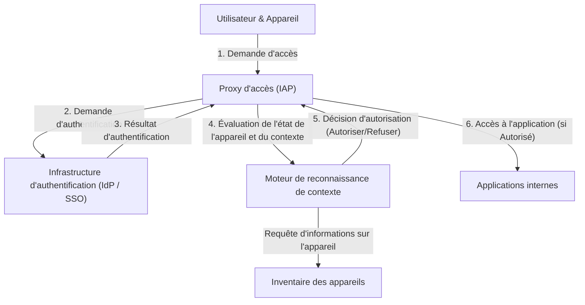

# L'effondrement de la défense périmétrique : l'illusion de l'"intérieur de confiance"

Un changement de paradigme historique est en cours dans la cybersécurité moderne. Au cœur de cette évolution se trouve le concept d'"Architecture Zero Trust", qui a été mis en œuvre pour la première fois à grande échelle dans le monde par Google avec "BeyondCorp".

Pendant des décennies, la sécurité des réseaux d'entreprise s'est appuyée sur le modèle "du château et de ses douves (Castle and Moat)", c'est-à-dire **la sécurité basée sur le périmètre**. L'idée fondamentale de ce modèle est extrêmement simple.
C'est une dualité selon laquelle "les utilisateurs et les appareils situés à l'intérieur des 'douves' (le réseau d'entreprise), comme les pare-feu ou les VPN, sont en sécurité, tandis que ce qui se trouve à l'extérieur (Internet) est dangereux".

Cependant, cette approche présentait un défaut fatal.
Une fois qu'un attaquant franchit le périmètre et obtient l'accès au réseau interne, l'intérieur étant considéré comme une zone "de confiance", il peut s'y déplacer librement (mouvement latéral). Les méthodes d'attaque modernes telles que les infections par des malwares, les menaces internes, et le vol d'identifiants par hameçonnage contournent très facilement la défense périmétrique. Avec l'adoption généralisée des services cloud et la normalisation du télétravail, le "périmètre à protéger" a cessé d'exister physiquement, marquant ainsi les limites de la défense périmétrique.

## Les limites du VPN et la menace du mouvement latéral

Les VPN (Virtual Private Network) traditionnels fonctionnaient comme des tunnels pour amener en toute sécurité les utilisateurs externes dans le réseau interne. Cependant, un VPN accorde un "accès au niveau du réseau". Une fois authentifié, un utilisateur obtient souvent un accès réseau à d'autres systèmes ou bases de données internes dont il n'a pas fondamentalement besoin.

Si un attaquant s'empare des identifiants VPN d'un employé ordinaire, il peut lancer des scans de réseau ou exploiter des vulnérabilités sur des serveurs contenant des informations confidentielles auxquels l'employé n'est pas censé avoir accès. C'est le danger du mouvement latéral et la plus grande faiblesse du modèle de défense périmétrique.

---

# Le principe fondamental du Zero Trust : "Ne jamais faire confiance, toujours vérifier"

Proposé en 2010 par John Kindervag de Forrester Research, le "Zero Trust" est un concept destiné à résoudre ce problème fondamental.
L'idée centrale du Zero Trust est unique :
**"Quel que soit l'emplacement sur le réseau (interne ou externe), aucun utilisateur, appareil ou système n'est fiable par défaut. Toutes les demandes d'accès doivent toujours être vérifiées."**

Dans une architecture Zero Trust, les concepts d'"intérieur" et d'"extérieur" n'ont plus de sens. Qu'il s'agisse d'un PC connecté au réseau filaire du bureau ou d'un smartphone connecté au Wi-Fi d'un café, tous doivent passer par des processus d'authentification et d'autorisation tout aussi stricts.

## Les trois principes du Zero Trust

1. **Authentifier et autoriser de manière sécurisée l'accès à toutes les ressources**
   L'accès est contrôlé en fonction de l'identité (qui) et du contexte (dans quel état), et non de l'emplacement sur le réseau.
2. **Application stricte du principe du moindre privilège (PoLP)**
   Les utilisateurs et les appareils se voient accorder uniquement les privilèges minimaux nécessaires pour exécuter leur tâche, et seulement pour la durée nécessaire.
3. **Surveillance et vérification continues**
   Ce n'est pas parce qu'une session a passé l'authentification une fois qu'elle est fiable indéfiniment. L'état de sécurité de l'appareil et le comportement de l'utilisateur sont surveillés en temps réel, et l'accès est immédiatement bloqué si une anomalie est détectée.

---

# Google BeyondCorp : l'incarnation du Zero Trust

À la suite d'une cyberattaque sophistiquée en provenance de Chine (Opération Aurora) en 2009, Google a décidé de revoir de fond en comble l'architecture de son réseau interne. Le projet né de cette décision est "BeyondCorp".

BeyondCorp est le premier exemple mondial d'application du concept Zero Trust à l'échelle de l'entreprise et sert de modèle à de nombreuses solutions Zero Trust actuelles (comme IAP : Identity-Aware Proxy).

## Les composants fondamentaux de BeyondCorp

L'architecture de BeyondCorp repose sur la collaboration étroite de plusieurs composants.

### 1. Inventaire des appareils (Device Inventory)
Google a accordé une importance primordiale non seulement à "qui" accède, mais aussi "depuis quel appareil". Un référentiel centralisé d'informations sur les appareils gérés et sécurisés par l'entreprise (Managed Devices) a été créé.
Un certificat unique (Device Certificate) est délivré à chaque appareil, et les informations matérielles, la version de l'OS, l'état de chiffrement, etc., sont continuellement synchronisés avec la base de données.

### 2. Gestion des utilisateurs et des groupes (Identity Management)
Intégrée à une infrastructure d'identité centralisée (IAM), elle gère avec précision les attributs tels que l'affiliation, le poste et les projets de l'utilisateur. L'authentification multifacteur (MFA) est une exigence absolue ; la simple authentification par mot de passe n'est pas autorisée.

### 3. Moteur de reconnaissance de contexte (Trust Inference / Context-Aware Access)
Ce moteur est le véritable cerveau de BeyondCorp. Il analyse en temps réel l'identité de l'utilisateur et l'état de l'appareil pour calculer dynamiquement un "score de confiance".
Par exemple, même si l'utilisateur est légitime, si la demande d'accès provient d'un "appareil dont le correctif de l'OS n'a pas été appliqué" ou d'une "adresse IP étrangère inhabituelle", le risque est jugé élevé, ce qui entraîne le refus de l'accès ou la demande d'une authentification supplémentaire.

### 4. Proxy d'accès (Access Proxy)
C'est la passerelle d'entrée vers toutes les applications internes. Plutôt que de fournir une connexion au niveau du réseau comme un VPN, il fonctionne comme un proxy inverse pour chaque application.
Le proxy reçoit les requêtes des utilisateurs et des appareils, interroge le moteur de reconnaissance de contexte pour déterminer si l'accès doit être accordé (autorisation). C'est seulement s'il est autorisé que le proxy transmet la requête à l'application backend.

### 5. Moteur de contrôle d'accès (Access Control Engine)
Il gère de manière centralisée les règles de droits d'accès aux ressources de chaque application (qui peut y accéder et à partir de quel état de l'appareil) et travaille avec le proxy pour appliquer ces politiques.

---

# Illustration de l'architecture : le flux d'accès de BeyondCorp

Le diagramme ci-dessous montre le flux de traitement des demandes d'accès dans l'architecture BeyondCorp.

Grâce à ce flux, le concept de réseau interne disparaît, toutes les communications sur Internet sont chiffrées, et l'authentification ainsi que l'autorisation sont exécutées à chaque requête.

---

# La véritable valeur du principe de moindre privilège (PoLP) et du contrôle d'accès dynamique

La véritable valeur du Zero Trust et de BeyondCorp ne réside pas seulement dans le renforcement de la sécurité, mais aussi dans **l'amélioration de la flexibilité et de la productivité**.

Dans le modèle de défense périmétrique, les tentatives de renforcement de la sécurité entraînaient des restrictions VPN plus strictes, réduisant la commodité pour l'utilisateur. Cependant, avec le modèle BeyondCorp, les utilisateurs peuvent accéder de manière fluide et sécurisée aux applications internes de n'importe où dans le monde, tant qu'ils disposent d'Internet. Il n'est plus nécessaire de lancer un client VPN, ni de subir de latence réseau.

De plus, le "contrôle d'accès dynamique" permet l'application de politiques de sécurité flexibles adaptées à la situation.
- **Scénario A :** Lors d'un accès depuis un PC fourni par l'entreprise (qui répond pleinement aux exigences de sécurité), l'accès au dépôt de code source hautement confidentiel est autorisé.
- **Scénario B :** Lorsque le même utilisateur accède depuis son smartphone personnel (BYOD), la lecture des e-mails est autorisée, mais le téléchargement du code source est interdit.

Cette capacité à contrôler de manière granulaire (Granular) les privilèges en fonction du contexte constitue le fondement des modes de travail diversifiés d'aujourd'hui (appelés "Anywhere Operations" dans le contexte du Zero Trust).

# L'avenir du Zero Trust : vers la norme de sécurité de nouvelle génération

Le BeyondCorp de Google a commencé comme un système propriétaire d'une entreprise spécifique, mais son concept est rapidement devenu un standard de l'industrie. Le NIST (National Institute of Standards and Technology des États-Unis) a publié la directive standard de l'architecture Zero Trust sous la référence "SP 800-207" et a rendu son adoption obligatoire pour les agences gouvernementales américaines.

À l'ère du cloud natif, l'infrastructure est codée et les applications sont décentralisées sous forme de microservices. Dans cet environnement complexe, il est impossible de protéger le système avec une défense périmétrique traditionnelle.

Bien que le "Zero Trust" puisse sembler froid par son idée de "ne faire confiance à personne", il propose paradoxalement l'image d'un réseau futur extrêmement ouvert et flexible : **"Avec une authentification et une vérification précises, n'importe qui peut accéder aux données librement et en toute sécurité, indépendamment de l'emplacement ou de l'appareil."**

L'architecture Zero Trust n'est plus un simple mot à la mode, mais la destination évolutive inévitable vers laquelle toutes les organisations doivent tendre.
