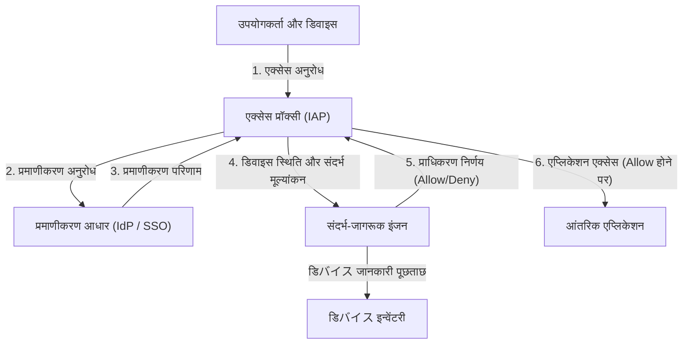

# परिधि सुरक्षा का पतन: 'भरोसेमंद अंदरूनी नेटवर्क' का भ्रम

आधुनिक साइबर सुरक्षा में एक ऐतिहासिक प्रतिमान बदलाव (paradigm shift) हो रहा है। इसके केंद्र में 'ज़ीरो ट्रस्ट आर्किटेक्चर' (Zero Trust Architecture) की अवधारणा है, और इसे दुनिया में सबसे पहले और बड़े पैमाने पर साकार करने वाला गूगल (Google) का 'बियॉन्डकॉर्प' (BeyondCorp) है।

दशकों से, कॉर्पोरेट नेटवर्क सुरक्षा 'कैसल और मोट' (Castle and Moat - किला और खाई) मॉडल, यानी **परिधि (Perimeter) आधारित सुरक्षा** पर निर्भर रही है। इस मॉडल का मूल विचार बहुत सरल है।
यह इस द्वैतवाद पर आधारित है कि "फ़ायरवॉल (Firewall) या वीपीएन (VPN) रूपी 'खाई' के अंदर (कॉर्पोरेट नेटवर्क में) मौजूद उपयोगकर्ता और डिवाइस सुरक्षित हैं, जबकि बाहर (इंटरनेट पर) मौजूद सब कुछ खतरनाक है।"

हालाँकि, इस दृष्टिकोण में एक बहुत बड़ी खामी थी।
एक बार जब कोई हमलावर परिधि को भेद देता है और आंतरिक नेटवर्क तक पहुँच प्राप्त कर लेता है, तो आंतरिक हिस्सा 'भरोसेमंद' क्षेत्र होने के कारण, वह स्वतंत्र रूप से कहीं भी आ-जा सकता है (इसे लेटरल मूवमेंट या Lateral Movement कहा जाता है)। मैलवेयर (Malware) का संक्रमण, अंदरूनी खतरे, और फ़िशिंग (Phishing) के माध्यम से क्रेडेंशियल (Credentials) की चोरी जैसी आधुनिक हमले की तकनीकें परिधि सुरक्षा को बहुत आसानी से पार कर लेती हैं। विशेष रूप से क्लाउड सेवाओं के प्रसार और रिमोट वर्क (Remote Work) के सामान्य होने के कारण, 'बचाव की जाने वाली परिधि' भौतिक रूप से मौजूद ही नहीं है, और परिधि सुरक्षा अपनी सीमा तक पहुँच गई है।

## VPN की सीमाएँ और लेटरल मूवमेंट का खतरा

पारंपरिक वीपीएन (वर्चुअल प्राइवेट नेटवर्क) एक सुरक्षित टनल (Tunnel) के रूप में कार्य करता था ताकि बाहर के उपयोगकर्ताओं को सुरक्षित रूप से आंतरिक नेटवर्क में लाया जा सके। हालाँकि, वीपीएन "नेटवर्क-स्तरीय एक्सेस" (Network-level Access) प्रदान करता है। प्रमाणीकरण (Authentication) पास करने वाले उपयोगकर्ता अक्सर आंतरिक सिस्टम और डेटाबेस तक भी नेटवर्क के माध्यम से पहुँचने में सक्षम हो जाते हैं, जिनकी उन्हें वास्तव में आवश्यकता नहीं होती है।

यदि कोई हमलावर किसी सामान्य कर्मचारी के वीपीएन क्रेडेंशियल चुरा लेता है, तो वह उन गोपनीय सूचना सर्वरों पर भी नेटवर्क स्कैन या भेद्यता (vulnerability) हमले कर सकता है, जिन तक उस कर्मचारी की पहुँच नहीं होनी चाहिए। यह लेटरल मूवमेंट का सबसे बड़ा खतरा है और परिधि सुरक्षा मॉडल की सबसे बड़ी कमजोरी है।

---

# ज़ीरो ट्रस्ट का मूल सिद्धांत: "कभी विश्वास न करें, हमेशा सत्यापित करें" (Never Trust, Always Verify)

2010 में फॉरेस्टर रिसर्च (Forrester Research) के जॉन किंडरवाग (John Kindervag) द्वारा प्रस्तावित 'ज़ीरो ट्रस्ट' (Zero Trust), इस मूलभूत समस्या को हल करने की एक अवधारणा है।
ज़ीरो ट्रस्ट का मुख्य विचार सिर्फ एक है:
**"नेटवर्क के स्थान (चाहे वह कंपनी के अंदर हो या बाहर) की परवाह किए बिना, किसी भी उपयोगकर्ता, डिवाइस या सिस्टम पर डिफ़ॉल्ट रूप से भरोसा नहीं किया जाना चाहिए। सभी एक्सेस अनुरोधों (Access Requests) को हमेशा सत्यापित किया जाना चाहिए।"**

ज़ीरो ट्रस्ट आर्किटेक्चर में, 'आंतरिक' और 'बाहरी' जैसी अवधारणाओं का कोई मतलब नहीं है। चाहे वह कार्यालय के वायर्ड लैन (Wired LAN) से जुड़ा पीसी (PC) हो, या स्टारबक्स (Starbucks) के वाई-फाई (Wi-Fi) से जुड़ा स्मार्टफोन हो, दोनों को समान रूप से सख्त प्रमाणीकरण (Authentication) और प्राधिकरण (Authorization) प्रक्रियाओं से गुज़रना होगा।

## ज़ीरो ट्रस्ट के 3 सिद्धांत

1. **सभी संसाधनों तक पहुँच को सुरक्षित रूप से प्रमाणित और अधिकृत करें**
   पहुँच को नेटवर्क के स्थान के आधार पर नहीं, बल्कि पहचान (वह कौन है) और संदर्भ (Context - उसकी स्थिति क्या है) के आधार पर नियंत्रित किया जाता है।
2. **न्यूनतम विशेषाधिकार का सिद्धांत (PoLP: Principle of Least Privilege) लागू करना**
   उपयोगकर्ताओं या उपकरणों को उनके कार्यों को करने के लिए केवल आवश्यक न्यूनतम अधिकार (Permissions), और केवल आवश्यक समय के लिए ही दिए जाते हैं।
3. **निरंतर निगरानी और सत्यापन**
   सिर्फ इसलिए कि किसी ने एक बार प्रमाणीकरण (Authentication) पास कर लिया है, इसका मतलब यह नहीं है कि उस सत्र (Session) पर हमेशा के लिए भरोसा किया जाएगा। डिवाइस की सुरक्षा स्थिति और उपयोगकर्ता के व्यवहार की वास्तविक समय (Real-time) में निगरानी की जाती है, और यदि किसी भी असामान्यता का पता चलता है, तो एक्सेस तुरंत रोक दिया जाता है।

---

# गूगल बियॉन्डकॉर्प (Google BeyondCorp): ज़ीरो ट्रस्ट का साकार रूप

2009 में चीन से हुए एक उन्नत साइबर हमले (ऑपरेशन औरोरा - Operation Aurora) के बाद, गूगल ने अपने कॉर्पोरेट नेटवर्क आर्किटेक्चर को पूरी तरह से फिर से डिज़ाइन करने का फैसला किया। इसके परिणामस्वरूप जो प्रोजेक्ट सामने आया वह "बियॉन्डकॉर्प" (BeyondCorp) था।

बियॉन्डकॉर्प एक उद्यम स्तर (Enterprise-scale) पर ज़ीरो ट्रस्ट अवधारणा को प्रदर्शित करने वाला दुनिया का पहला उदाहरण था, और यह आज के कई ज़ीरो ट्रस्ट समाधानों (जैसे IAP: Identity-Aware Proxy) का खाका (Blueprint) बन गया है।

## बियॉन्डकॉर्प के मुख्य घटक (Core Components)

बियॉन्डकॉर्प का आर्किटेक्चर कई घटकों (Components) के एक साथ मिलकर काम करने पर आधारित है।

### 1. डिवाइस इन्वेंटरी (Device Inventory)
गूगल ने इस बात पर बहुत जोर दिया कि न केवल "कौन" एक्सेस कर रहा है, बल्कि "किस डिवाइस से" एक्सेस किया जा रहा है। कंपनी द्वारा प्रबंधित और सुरक्षित उपकरणों (Managed Devices) की जानकारी के लिए एक केंद्रीय रिपॉजिटरी बनाई गई।
प्रत्येक डिवाइस को एक विशिष्ट प्रमाणपत्र (Device Certificate) जारी किया जाता है, और डिवाइस की हार्डवेयर जानकारी, ओएस (OS) संस्करण, एन्क्रिप्शन (Encryption) स्थिति आदि को डेटाबेस के साथ लगातार सिंक (Sync) किया जाता है।

### 2. पहचान प्रबंधन (Identity Management - उपयोगकर्ता और समूह)
यह एक केंद्रीकृत पहचान (IAM) बुनियादी ढांचे के साथ एकीकृत है, जहां उपयोगकर्ता का विभाग, नौकरी का शीर्षक, परियोजना आदि जैसी विशेषता जानकारी को सटीक रूप से प्रबंधित किया जाता है। बहु-कारक प्रमाणीकरण (MFA - Multi-Factor Authentication) एक अनिवार्य आवश्यकता है, और केवल पासवर्ड से प्रमाणीकरण की अनुमति नहीं है।

### 3. संदर्भ-जागरूक इंजन (Trust Inference / Context-Aware Access)
यह इंजन बियॉन्डकॉर्प का दिमाग है। यह वास्तविक समय में उपयोगकर्ता की पहचान और डिवाइस की स्थिति का विश्लेषण करता है, और गतिशील (Dynamically) रूप से "ट्रस्ट स्कोर" (Trust Score) की गणना करता है।
उदाहरण के लिए, यदि कोई "सही उपयोगकर्ता" भी किसी "ऐसे डिवाइस से एक्सेस करने का अनुरोध करता है जिसमें ओएस पैच (OS Patch) लागू नहीं है" या "किसी असामान्य विदेशी आईपी पते" से एक्सेस करने की कोशिश करता है, तो इसे उच्च जोखिम वाला माना जाता है, और एक्सेस को अस्वीकार कर दिया जाता है या अतिरिक्त प्रमाणीकरण का अनुरोध किया जाता है।

### 4. एक्सेस प्रॉक्सी (Access Proxy)
यह सभी आंतरिक अनुप्रयोगों (Internal Applications) तक पहुंचने का गेटवे (Gateway) है। यह वीपीएन जैसे नेटवर्क-स्तरीय कनेक्शन के बजाय प्रति-अनुप्रयोग (Per-application) रिवर्स प्रॉक्सी के रूप में कार्य करता है।
प्रॉक्सी उपयोगकर्ता और डिवाइस से अनुरोध प्राप्त करता है, और यह तय करने के लिए संदर्भ-जागरूक इंजन (Context-aware Engine) से पूछताछ करता है कि क्या एक्सेस की अनुमति दी जानी चाहिए (प्राधिकरण - Authorization)। केवल अनुमति मिलने पर ही प्रॉक्सी बैकएंड (Backend) एप्लिकेशन को अनुरोध अग्रेषित (Forward) करता है।

### 5. एक्सेस कंट्रोल इंजन (Access Control Engine)
यह प्रत्येक एप्लिकेशन के संसाधनों तक पहुँच अधिकारों के नियमों (कौन एक्सेस कर सकता है, और किस डिवाइस की स्थिति से) को केंद्रीय रूप से प्रबंधित करता है, और नीतियों को लागू करने के लिए प्रॉक्सी के साथ मिलकर काम करता है।

---

# आर्किटेक्चर आरेख: बियॉन्डकॉर्प एक्सेस फ्लो (Access Flow)

बियॉन्डकॉर्प आर्किटेक्चर में एक्सेस अनुरोध के प्रोसेसिंग फ्लो को नीचे दिए गए आरेख (Diagram) में दिखाया गया है:

इस फ्लो के कारण, आंतरिक नेटवर्क (Internal Network) की अवधारणा समाप्त हो गई है, इंटरनेट पर सभी संचार एन्क्रिप्ट (Encrypt) किए जाते हैं, और एक ऐसा वातावरण प्राप्त किया गया है जहां प्रत्येक अनुरोध के लिए प्रमाणीकरण और प्राधिकरण निष्पादित किया जाता है।

---

# न्यूनतम विशेषाधिकार का सिद्धांत (PoLP) और गतिशील एक्सेस नियंत्रण का वास्तविक मूल्य

ज़ीरो ट्रस्ट और बियॉन्डकॉर्प का वास्तविक मूल्य न केवल सुरक्षा को मजबूत करना है, बल्कि **लचीलापन (Flexibility) और उत्पादकता (Productivity) बढ़ाना** भी है।

परिधि रक्षा (Perimeter Defense) मॉडल में, जब सुरक्षा को मजबूत करने का प्रयास किया गया, तो वीपीएन (VPN) के प्रतिबंध सख्त हो गए, जिससे उपयोगकर्ता की सुविधा कम হ্রাস गई। हालाँकि, बियॉन्डकॉर्प मॉडल में, जब तक उपयोगकर्ताओं के पास इंटरनेट है, वे दुनिया में कहीं से भी निर्बाध और सुरक्षित रूप से कॉर्पोरेट एप्लिकेशन तक पहुँच सकते हैं। वीपीएन क्लाइंट (VPN Client) शुरू करने की कोई परेशानी नहीं है, और कोई नेटवर्क देरी (Network Latency) नहीं है।

इसके अलावा, "गतिशील एक्सेस नियंत्रण" (Dynamic Access Control) स्थिति के आधार पर लचीली सुरक्षा नीतियों के अनुप्रयोग की अनुमति देता है।
- **परिदृश्य A (Scenario A):** कंपनी द्वारा दिए गए पीसी (जो सुरक्षा आवश्यकताओं को पूरी तरह से पूरा करता है) से एक्सेस करने के मामले में, अत्यधिक गोपनीय स्रोत कोड रिपॉजिटरी तक पहुँच की अनुमति दी जाती है।
- **परिदृश्य B (Scenario B):** यदि वही उपयोगकर्ता अपने निजी स्मार्टफोन (BYOD) से एक्सेस करता है, तो उसे ईमेल पढ़ने की अनुमति है, लेकिन स्रोत कोड डाउनलोड करने की मनाही है।

इस तरह, संदर्भ के आधार पर अनुमतियों (Permissions) को बारीकी से (Granular) नियंत्रित करने की क्षमता आधुनिक विविध कार्य शैलियों (जिसे ज़ीरो ट्रस्ट के संदर्भ में "Anywhere Operations" कहा जाता है) का समर्थन करने वाली नींव बन गई है।

# ज़ीरो ट्रस्ट का भविष्य: अगली पीढ़ी की सुरक्षा का मानक (Standard)

गूगल (Google) का बियॉन्डकॉर्प (BeyondCorp) एक विशिष्ट कंपनी के मालिकाना (Proprietary) सिस्टम के रूप में शुरू हुआ, लेकिन यह अवधारणा जल्द ही एक उद्योग मानक (Industry Standard) बन गई। NIST (नेशनल इंस्टीट्यूट ऑफ स्टैंडर्ड्स एंड टेक्नोलॉजी) ने "SP 800-207" के रूप में ज़ीरो ट्रस्ट आर्किटेक्चर के लिए मानक दिशानिर्देश (Standard Guidelines) प्रकाशित किए हैं, और अमेरिकी सरकारी एजेंसियों के लिए इसे अपनाना अनिवार्य कर दिया है।

क्लाउड-नेटिव (Cloud-native) युग में, बुनियादी ढांचे (Infrastructure) को कोड (Code) के रूप में बनाया गया है, और एप्लिकेशन माइक्रो-सर्विसेज (Microservices) के रूप में वितरित (Distributed) किए गए हैं। इस जटिल वातावरण में, पारंपरिक परिधि सुरक्षा (Perimeter Security) के साथ सिस्टम की रक्षा करना असंभव है।

हालाँकि ज़ीरो ट्रस्ट में "किसी पर विश्वास न करने" की थोड़ी ठंडी आवाज़ है, लेकिन विरोधाभासी रूप से यह भविष्य के नेटवर्क का एक अत्यंत खुला और लचीला रूप प्रस्तुत करता है: **"जब तक सटीक प्रमाणीकरण (Authentication) और सत्यापन (Verification) है, तब तक कोई भी स्थान या डिवाइस की परवाह किए बिना स्वतंत्र रूप से और सुरक्षित रूप से डेटा तक पहुँच सकता है।"**

ज़ीरो ट्रस्ट आर्किटेक्चर अब केवल एक आकर्षक शब्द (Buzzword) नहीं रह गया है, बल्कि इसे एक अपरिहार्य (Inevitable) विकास बिंदु कहा जा सकता है जिसका सभी संगठनों को लक्ष्य रखना चाहिए।
