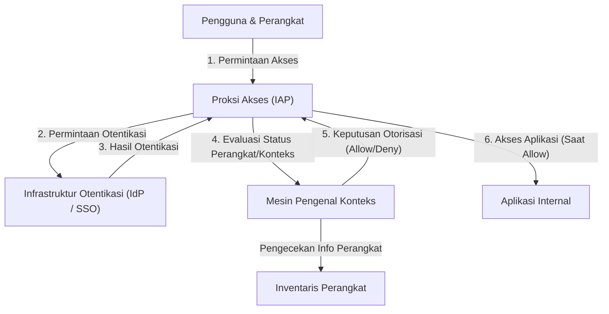

# Runtuhnya Pertahanan Batas: Ilusi "Internal yang Tepercaya"

Dalam keamanan siber modern, pergeseran paradigma bersejarah sedang berlangsung. Di pusatnya adalah konsep "Arsitektur Zero Trust", dan pihak yang mewujudkannya paling awal dan dalam skala terbesar di dunia adalah "BeyondCorp" dari Google.

Selama beberapa dekade, keamanan jaringan perusahaan bergantung pada model "Kastil dan Parit" (Castle and Moat), yaitu **keamanan berbasis perimeter (batas)**. Ide dasar dari model ini sangat sederhana.
Ini adalah dualisme: "Pengguna dan perangkat yang berada di dalam 'parit' seperti firewall dan VPN (jaringan perusahaan) aman, sedangkan mereka yang berada di luar (internet) adalah berbahaya".

Namun, pendekatan ini memiliki kelemahan fatal.
Begitu penyerang menembus batas dan mendapatkan hak akses ke jaringan internal, karena bagian internal adalah area "tepercaya", mereka dapat bergerak bebas (pergerakan lateral / lateral movement). Infeksi malware, ancaman orang dalam, dan pencurian informasi kredensial melalui phishing—metode serangan modern dapat dengan mudah melewati pertahanan batas ini. Secara khusus, karena meluasnya layanan cloud dan normalisasi kerja jarak jauh, "batas yang harus dipertahankan" itu sendiri secara fisik tidak ada lagi, dan pertahanan batas telah mencapai batasnya.

## Keterbatasan VPN dan Ancaman Pergerakan Lateral

VPN (Virtual Private Network) konvensional berfungsi sebagai terowongan untuk menarik pengguna eksternal ke dalam jaringan internal dengan aman. Namun, VPN memberikan "akses tingkat jaringan". Pengguna yang telah melewati otentikasi sering kali dapat menjangkau sistem dan basis data internal lainnya secara jaringan yang sebenarnya tidak mereka perlukan.

Jika penyerang meretas kredensial VPN seorang karyawan biasa, penyerang tersebut dapat melancarkan pemindaian jaringan dan serangan kerentanan terhadap server informasi rahasia yang seharusnya tidak dapat diakses oleh karyawan tersebut. Inilah bahayanya pergerakan lateral, dan kelemahan terbesar dari model pertahanan batas.

---

# Filosofi Dasar Zero Trust: "Jangan Pernah Percaya, Selalu Verifikasi"

Diusulkan oleh John Kindervag dari Forrester Research pada tahun 2010, "Zero Trust" adalah konsep untuk memecahkan masalah mendasar ini.
Ide inti dari Zero Trust hanya satu:
**"Terlepas dari lokasi jaringan (internal atau eksternal), tidak ada pengguna, perangkat, atau sistem apa pun yang dipercaya secara default. Semua permintaan akses harus selalu diverifikasi."**

Dalam arsitektur Zero Trust, konsep "internal" dan "eksternal" tidak memiliki arti. Baik itu PC yang terhubung ke LAN kabel di kantor, maupun ponsel pintar yang terhubung ke Wi-Fi di Starbucks, keduanya harus melewati proses otentikasi dan otorisasi yang sama ketatnya.

## 3 Prinsip Zero Trust

1. **Otentikasi dan otorisasi dengan aman untuk semua akses ke sumber daya**
   Kontrol akses didasarkan pada identitas (siapa) dan konteks (kondisi seperti apa), bukan pada lokasi jaringan.
2. **Penerapan Ketat Prinsip Hak Istimewa Terkecil (PoLP: Principle of Least Privilege)**
   Pengguna dan perangkat hanya diberikan hak minimum yang diperlukan untuk menjalankan tugas mereka, dan hanya untuk durasi waktu yang diperlukan.
3. **Pemantauan dan verifikasi berkelanjutan**
   Lolos otentikasi satu kali tidak berarti sesi tersebut dipercaya selamanya. Kondisi keamanan perangkat dan perilaku pengguna dipantau secara real-time, dan akses akan segera diputus jika terdeteksi adanya anomali.

---

# Google BeyondCorp: Perwujudan dari Zero Trust

Pascalserangan siber canggih dari Tiongkok (Operation Aurora) pada tahun 2009, Google memutuskan untuk merombak total arsitektur jaringan internalnya dari dasar. Proyek yang lahir dari hal tersebut adalah "BeyondCorp".

BeyondCorp adalah studi kasus pertama di dunia yang membuktikan konsep Zero Trust dalam skala perusahaan, dan telah menjadi cetak biru bagi banyak solusi Zero Trust saat ini (seperti IAP: Identity-Aware Proxy).

## Komponen Inti yang Membentuk BeyondCorp

Arsitektur BeyondCorp dibangun atas dasar kolaborasi erat dari beberapa komponen.

### 1. Inventaris Perangkat (Device Inventory)
Google tidak hanya mementingkan "siapa" yang mengakses, tetapi juga "dari perangkat mana" mereka mengakses. Mereka membangun repositori terpusat untuk informasi perangkat yang dikelola perusahaan dan keamanannya terverifikasi (Managed Device).
Setiap perangkat diterbitkan sertifikat unik (Device Certificate), dan informasi perangkat keras, versi OS, serta status enkripsi disinkronkan secara terus-menerus ke dalam basis data.

### 2. Manajemen Pengguna dan Grup (Identity Management)
Terintegrasi dengan infrastruktur Identitas (IAM) terpusat, informasi atribut seperti afiliasi pengguna, jabatan, dan proyek dikelola secara akurat. Otentikasi Multifaktor (MFA) adalah syarat mutlak, dan otentikasi kata sandi biasa tidak diizinkan.

### 3. Mesin Pengenal Konteks (Trust Inference / Context-Aware Access)
Mesin inilah yang menjadi otak dari BeyondCorp. Ia menganalisis identitas pengguna dan status perangkat secara real-time untuk menghitung "Skor Kepercayaan" secara dinamis.
Misalnya, meskipun "pengguna yang benar", jika permintaan akses berasal dari "perangkat dengan OS yang belum di-patch", atau dari "alamat IP luar negeri yang tidak biasa", mesin akan menganggapnya berisiko tinggi dan dapat menolak akses atau meminta otentikasi tambahan.

### 4. Proksi Akses (Access Proxy)
Ini adalah gerbang yang menjadi pintu masuk ke semua aplikasi internal. Alih-alih koneksi tingkat jaringan seperti VPN, ia berfungsi sebagai proksi balik (reverse proxy) untuk setiap aplikasi.
Proksi menerima permintaan dari pengguna dan perangkat, lalu bertanya kepada Mesin Pengenal Konteks untuk menentukan apakah akses harus diizinkan (otorisasi). Proksi hanya akan meneruskan permintaan ke aplikasi backend jika diizinkan.

### 5. Mesin Kontrol Akses (Access Control Engine)
Mesin ini memusatkan manajemen aturan hak akses (siapa yang dapat mengakses, dan dari perangkat dalam kondisi apa) untuk sumber daya di setiap aplikasi, dan bekerja sama dengan proksi untuk menegakkan kebijakan.

---

# Ilustrasi Arsitektur: Alur Akses BeyondCorp

Di bawah ini adalah diagram yang menunjukkan alur pemrosesan permintaan akses dalam arsitektur BeyondCorp.

Melalui alur ini, konsep jaringan internal menghilang, lalu terwujudlah lingkungan di mana semua komunikasi di internet dienkripsi, dan otentikasi serta otorisasi dieksekusi pada setiap permintaan.

---

# Nilai Sebenarnya dari Prinsip Hak Istimewa Terkecil (PoLP) dan Kontrol Akses Dinamis

Nilai sebenarnya dari Zero Trust dan BeyondCorp tidak hanya memperkuat keamanan, tetapi juga **meningkatkan fleksibilitas dan produktivitas**.

Dalam model pertahanan batas, jika kita mencoba memperkuat keamanan, batasan VPN akan menjadi lebih ketat, dan kenyamanan pengguna pun menurun. Namun, dalam model BeyondCorp, selama pengguna memiliki internet, mereka dapat mengakses aplikasi internal dari mana saja di seluruh dunia dengan mulus dan aman. Tidak perlu lagi repot-repot menyalakan klien VPN, dan tidak ada lagi penundaan (latensi) jaringan.

Lebih jauh lagi, "kontrol akses dinamis" memungkinkan penerapan kebijakan keamanan yang fleksibel dan sesuai dengan situasi.
- **Skenario A:** Jika akses berasal dari PC yang disediakan perusahaan (memenuhi persyaratan keamanan sepenuhnya), akses ke repositori kode sumber yang sangat rahasia diizinkan.
- **Skenario B:** Jika pengguna yang sama mengakses dari ponsel pintar pribadinya (BYOD), membaca email diizinkan, tetapi mengunduh kode sumber dilarang.

Dengan cara ini, kemampuan untuk mengontrol hak secara spesifik (Granular) berdasarkan konteks telah menjadi dasar yang mendukung beragam gaya kerja modern (dalam konteks Zero Trust disebut sebagai "Anywhere Operations").

# Masa Depan Zero Trust: Menuju Standar Keamanan Generasi Berikutnya

BeyondCorp milik Google berawal dari sistem tertutup (proprietary) di perusahaan tertentu, tetapi konsep ini dengan cepat menjadi standar industri. NIST (National Institute of Standards and Technology AS) telah menerbitkan pedoman standar untuk Arsitektur Zero Trust melalui "SP 800-207", dan bahkan mewajibkan penerapannya di lembaga pemerintah AS.

Di era cloud-native, infrastruktur diubah menjadi kode (infrastructure as code), dan aplikasi didesentralisasi sebagai layanan mikro (microservices). Dalam lingkungan yang kompleks ini, mustahil untuk melindungi sistem sepenuhnya dengan pertahanan batas konvensional.

Zero Trust, dengan nada suara yang sekilas terkesan dingin karena "tidak memercayai siapa pun", secara paradoks menghadirkan bentuk jaringan masa depan yang sangat terbuka dan fleksibel: **"Asalkan ada otentikasi dan verifikasi yang akurat, siapa pun dapat mengakses data dengan bebas dan aman tanpa terbatas oleh lokasi maupun perangkat."**

Arsitektur Zero Trust kini bukan sekadar kata kunci (buzzword), melainkan titik akhir evolusi tak terelakkan yang harus dicapai oleh semua organisasi.
