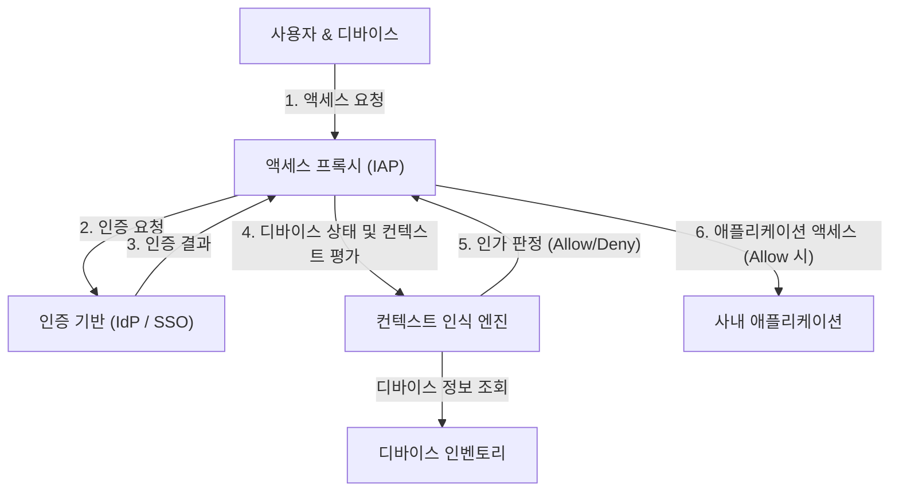

# 경계 방어의 붕괴: '신뢰할 수 있는 내부'라는 환상

현대 사이버 보안에 있어 역사적인 패러다임 전환이 진행되고 있습니다. 그 중심에 있는 것이 '제로 트러스트 아키텍처(Zero Trust Architecture)'라는 개념이며, 이를 세계에서 가장 빠르고 대규모로 실현한 것이 Google의 'BeyondCorp(비욘드코프)'입니다.

수십 년 동안 기업의 네트워크 보안은 '성과 해자(Castle and Moat)' 모델, 즉 **경계(Perimeter) 기반 보안**에 의존해 왔습니다. 이 모델의 기본 사상은 매우 단순합니다.
'방화벽이나 VPN이라는 해자 안쪽(기업 네트워크)에 있는 사용자나 디바이스는 안전하며, 바깥쪽(인터넷)에 있는 것은 위험하다'는 이분법입니다.

하지만 이 접근 방식은 치명적인 결함을 안고 있었습니다.
일단 공격자가 경계를 돌파하여 내부 네트워크에 대한 액세스 권한을 얻게 되면, 내부는 '신뢰할 수 있는' 영역이기 때문에 자유롭게 이동(래터럴 무브먼트: 횡적 이동)하는 것이 가능해집니다. 악성코드 감염, 내부 범죄, 피싱을 통한 인증 정보 탈취 등 현대의 공격 수단은 경계 방어를 아주 쉽게 빠져나갑니다. 특히 클라우드 서비스의 보급과 원격 근무의 일상화로 인해 '지켜야 할 경계' 자체가 물리적으로 존재하지 않게 되면서, 경계 방어는 한계를 맞이했습니다.

## VPN의 한계와 래터럴 무브먼트의 위협

기존의 VPN(가상 사설망)은 외부에 있는 사용자를 안전하게 내부 네트워크로 끌어들이기 위한 터널 역할을 했습니다. 그러나 VPN은 '네트워크 수준의 액세스'를 부여합니다. 인증을 통과한 사용자는 본래 필요 없는 사내의 다른 시스템이나 데이터베이스에도 네트워크적으로 도달 가능해지는 경우가 많습니다.

공격자가 일반 직원의 VPN 자격 증명을 탈취할 경우, 해당 직원이 액세스 권한을 가지고 있지 않아야 할 기밀 정보 서버에 대해서도 네트워크 스캔이나 취약점 공격을 가할 수 있게 됩니다. 이것이 래터럴 무브먼트의 무서움이며, 경계 방어 모델의 가장 큰 약점입니다.

---

# 제로 트러스트의 기본 이념: "절대 신뢰하지 말고, 항상 검증하라"

2010년 Forrester Research의 John Kindervag가 제창한 '제로 트러스트(Zero Trust)'는 이 근본적인 문제를 해결하기 위한 개념입니다.
제로 트러스트의 핵심 사상은 단 하나입니다.
**"네트워크의 위치(사내인지 사외인지)와 관계없이, 어떠한 사용자, 디바이스, 시스템도 기본적으로 신뢰하지 않는다. 모든 액세스 요청은 항상 검증되어야 한다."**

제로 트러스트 아키텍처에서는 '내부'나 '외부'라는 개념이 무의미합니다. 사무실 내 유선 LAN에 연결된 PC이든, 스타벅스의 Wi-Fi에 연결된 스마트폰이든 똑같이 엄격한 인증 및 인가 프로세스를 통과해야 합니다.

## 제로 트러스트의 3가지 원칙

1. **모든 리소스에 대한 액세스를 안전하게 인증하고 인가한다**
   네트워크 위치가 아닌, 아이덴티티(누구인지)와 컨텍스트(어떤 상태인지)를 기반으로 액세스를 제어합니다.
2. **최소 권한의 원칙(PoLP: Principle of Least Privilege)의 철저한 적용**
   사용자나 디바이스에는 해당 작업을 수행하는 데 필요한 최소한의 권한만을 필요한 시간 동안만 부여합니다.
3. **지속적인 모니터링 및 검증**
   한 번 인증을 통과했다고 해서 그 세션을 영원히 신뢰하는 것은 아닙니다. 디바이스의 보안 상태나 사용자의 행동을 실시간으로 모니터링하고 이상이 감지되면 즉시 액세스를 차단합니다.

---

# Google BeyondCorp: 제로 트러스트의 구현

Google은 2009년 발생한 중국발 고도 사이버 공격(Operation Aurora)을 계기로 사내 네트워크 아키텍처를 근본부터 재검토하기로 결정했습니다. 그 결과 탄생한 프로젝트가 'BeyondCorp'입니다.

BeyondCorp는 제로 트러스트 개념을 엔터프라이즈 규모로 입증한 세계 최초의 사례이며, 현재 많은 제로 트러스트 솔루션(IAP: Identity-Aware Proxy 등)의 청사진이 되었습니다.

## BeyondCorp를 구성하는 핵심 요소

BeyondCorp의 아키텍처는 여러 구성 요소가 긴밀하게 연계되어 작동합니다.

### 1. 디바이스 인벤토리(Device Inventory)
Google은 '누가' 액세스하고 있는지뿐만 아니라 '어떤 디바이스에서' 액세스하고 있는지를 매우 중요하게 여겼습니다. 기업이 관리하고 안전성이 확인된 디바이스(Managed Device) 정보의 중앙 저장소를 구축했습니다.
각 디바이스에는 고유한 인증서(Device Certificate)가 발급되며, 디바이스의 하드웨어 정보, OS 버전, 암호화 상태 등이 지속적으로 데이터베이스와 동기화됩니다.

### 2. 사용자 및 그룹 관리(Identity Management)
중앙 집중형 아이덴티티(IAM) 인프라와 통합되어, 사용자의 소속, 직책, 프로젝트 등의 속성 정보가 정확하게 관리됩니다. 다중 인증(MFA)은 필수 요건이며 단순한 비밀번호 인증은 허용되지 않습니다.

### 3. 컨텍스트 인식 엔진(Trust Inference / Context-Aware Access)
이 엔진이야말로 BeyondCorp의 두뇌입니다. 사용자의 아이덴티티와 디바이스 상태를 실시간으로 분석하여 '신뢰 점수'를 동적으로 산출합니다.
예를 들어 '올바른 사용자'이더라도 'OS 패치가 적용되지 않은 디바이스'에서, 혹은 '평소와 다른 해외 IP 주소'에서 액세스 요청이 온 경우, 위험이 높다고 판단하여 액세스를 거부하거나 추가 인증을 요구합니다.

### 4. 액세스 프록시(Access Proxy)
모든 사내 애플리케이션으로 들어가는 관문(게이트웨이)입니다. VPN과 같은 네트워크 수준의 연결이 아니라 애플리케이션별 리버스 프록시로 기능합니다.
프록시는 사용자 및 디바이스로부터 요청을 받고, 컨텍스트 인식 엔진에 조회하여 액세스를 허용할지(인가)를 결정합니다. 허용된 경우에만 프록시가 백엔드 애플리케이션으로 요청을 전달합니다.

### 5. 액세스 제어 엔진(Access Control Engine)
각 애플리케이션의 리소스에 대한 접근 권한 규칙(누가, 어떤 상태의 디바이스에서 액세스할 수 있는지)을 일원화하여 관리하고, 프록시와 연계하여 정책을 강제합니다.

---

# 아키텍처 도해: BeyondCorp의 액세스 흐름

다음은 BeyondCorp 아키텍처에서 액세스 요청의 처리 흐름을 보여주는 다이어그램입니다.

이 흐름을 통해 사내 네트워크라는 개념은 소멸하고, 인터넷상의 모든 통신이 암호화되며, 요청마다 인증과 인가가 실행되는 환경이 실현되었습니다.

---

# 최소 권한의 원칙(PoLP)과 동적 액세스 제어의 진가

제로 트러스트와 BeyondCorp의 진가는 단순히 보안을 강화하는 것뿐만 아니라 **유연성과 생산성을 향상시키는** 데에 있습니다.

경계 방어 모델에서는 보안을 강화하려고 하면 VPN의 제약이 엄격해져 사용자의 편의성이 떨어졌습니다. 하지만 BeyondCorp 모델에서는 사용자가 인터넷만 있으면 세계 어디서든 사내 애플리케이션에 원활하고 안전하게 액세스할 수 있습니다. VPN 클라이언트를 실행하는 수고도, 네트워크 지연도 없습니다.

또한, '동적 액세스 제어'를 통해 상황에 맞는 유연한 보안 정책 적용이 가능해집니다.
- **시나리오 A:** 회사 지급 PC(보안 요건을 완전히 충족함)에서 액세스할 경우 기밀성이 높은 소스 코드 리포지토리에 대한 액세스를 허용한다.
- **시나리오 B:** 같은 사용자가 개인 스마트폰(BYOD)에서 액세스할 경우 이메일 열람은 허용하지만 소스 코드 다운로드는 금지한다.

이처럼 컨텍스트에 따라 권한을 세밀하게(Granular) 제어할 수 있다는 점이 현대의 다양한 업무 방식(제로 트러스트 맥락에서는 'Anywhere Operations'라 불림)을 뒷받침하는 기반이 되고 있습니다.

# 제로 트러스트의 미래: 차세대 보안의 표준으로

Google의 BeyondCorp는 특정 기업의 독점적인 시스템에서 시작되었지만, 그 개념은 순식간에 업계 표준이 되었습니다. NIST(미국 국립표준기술연구소)는 'SP 800-207'로서 제로 트러스트 아키텍처의 표준 가이드라인을 발행하고 미국 정부 기관에도 그 도입을 의무화하고 있습니다.

클라우드 네이티브 시대에 인프라는 코드화되고 애플리케이션은 마이크로서비스로 분산되어 있습니다. 이 복잡한 환경에서 기존의 경계 방어만으로 시스템을 온전히 지키는 창조는 불가능합니다.

'아무도 믿지 않는다'는 겉보기엔 차가운 어감을 가진 제로 트러스트이지만, 이는 역설적으로 **"정확한 인증과 검증만 있다면 장소나 디바이스에 얽매이지 않고 누구나 자유롭고 안전하게 데이터에 액세스할 수 있다"**는, 지극히 개방적이고 유연한 미래의 네트워크 형태를 제시하고 있는 것입니다.

제로 트러스트 아키텍처는 이제 단순한 유행어가 아니라 모든 조직이 지향해야 할 필연적인 진화의 도달점이라 할 수 있습니다.
