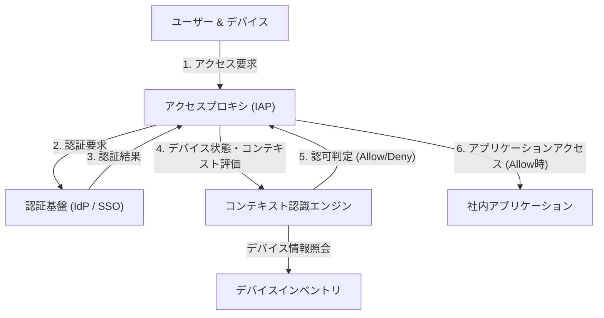

# 境界防御の崩壊：「信頼された内部」という幻想

現代のサイバーセキュリティにおいて、歴史的なパラダイムシフトが進行しています。その中心にあるのが「ゼロトラストアーキテクチャ」という概念であり、それを世界で最も早く、かつ大規模に実現したのがGoogleの「BeyondCorp（ビヨンドコープ）」です。

数十年にわたり、企業のネットワークセキュリティは「お城と堀（Castle and Moat）」モデル、すなわち**ペリメタ（境界）ベース・セキュリティ**に依存してきました。このモデルの基本思想は極めて単純です。
「ファイアウォールやVPNという『堀』の内側（企業ネットワーク）にいるユーザーやデバイスは安全であり、外側（インターネット）にいるものは危険である」という二元論です。

しかし、このアプローチは致命的な欠陥を抱えていました。
一度攻撃者が境界を突破し、内部ネットワークへのアクセス権を得てしまえば、内部は「信頼された」領域であるため、自由に動き回ること（ラテラルムーブメント：横方向への移動）が可能になります。マルウェアの感染、内部犯行、フィッシングによる認証情報の窃取など、現代の攻撃手法は境界防御をいとも簡単にすり抜けます。特にクラウドサービスの普及やリモートワークの常態化により、「守るべき境界」自体が物理的に存在しなくなり、境界防御は限界を迎えました。

## VPNの限界とラテラルムーブメントの脅威

従来のVPN（仮想プライベートネットワーク）は、外部にいるユーザーを安全に内部ネットワークに引き入れるためのトンネルとして機能しました。しかし、VPNは「ネットワークレベルのアクセス」を付与します。認証を通過したユーザーは、本来必要のない社内の他のシステムやデータベースにもネットワーク的に到達可能になってしまうことが多いのです。

攻撃者が一般社員のVPNクレデンシャルを奪取した場合、その社員がアクセス権を持たないはずの機密情報サーバーに対しても、ネットワークスキャンや脆弱性攻撃を仕掛けることが可能になります。これがラテラルムーブメントの恐ろしさであり、境界防御モデル最大の弱点です。

---

# ゼロトラストの基本理念：「決して信頼せず、常に検証せよ」

2010年、Forrester ResearchのJohn Kindervag氏によって提唱された「ゼロトラスト（Zero Trust）」は、この根本的な問題を解決するための概念です。
ゼロトラストの核となる思想はただ一つ：
**「ネットワークの場所（社内か社外か）に関わらず、いかなるユーザー、デバイス、システムもデフォルトで信頼しない。すべてのアクセス要求は、常に検証されなければならない」**

ゼロトラストアーキテクチャにおいては、「内部」や「外部」という概念は意味を持ちません。オフィス内の有線LANに接続しているPCであっても、スターバックスのWi-Fiに接続しているスマートフォンであっても、全く同じように厳格な認証と認可のプロセスを通過する必要があります。

## ゼロトラストの3つの原則

1. **すべてのリソースへのアクセスを、セキュアに認証・認可する**
   ネットワークの場所ではなく、アイデンティティ（誰か）とコンテキスト（どのような状態か）に基づいてアクセスを制御します。
2. **最小権限の原則（PoLP: Principle of Least Privilege）の徹底**
   ユーザーやデバイスには、そのタスクを実行するために必要な最小限の権限のみを、必要な時間だけ付与します。
3. **継続的な監視と検証**
   一度認証を通過したからといって、そのセッションを永遠に信頼するわけではありません。デバイスのセキュリティ状態やユーザーの振る舞いをリアルタイムで監視し、異常が検知されれば即座にアクセスを遮断します。

---

# Google BeyondCorp：ゼロトラストの具現化

Googleは2009年に発生した中国からの高度なサイバー攻撃（Operation Aurora）を契機に、社内ネットワークのアーキテクチャを根本から見直す決断を下しました。その結果生まれたプロジェクトが「BeyondCorp」です。

BeyondCorpは、ゼロトラストの概念をエンタープライズ規模で実証した世界初の事例であり、現在の多くのゼロトラストソリューション（IAP: Identity-Aware Proxyなど）の青写真となっています。

## BeyondCorpを構成する中核要素

BeyondCorpのアーキテクチャは、複数のコンポーネントが密接に連携することで成り立っています。

### 1. デバイスインベントリ（Device Inventory）
Googleは「誰が」アクセスしているかだけでなく、「どのデバイスから」アクセスしているかを極めて重要視しました。企業が管理し、安全性が確認されたデバイス（Managed Device）情報の中央リポジトリを構築しました。
各デバイスには固有の証明書（Device Certificate）が発行され、デバイスのハードウェア情報、OSのバージョン、暗号化の状態などが継続的にデータベースと同期されます。

### 2. ユーザーとグループの管理（Identity Management）
中央集権型のアイデンティティ（IAM）基盤と統合され、ユーザーの所属、役職、プロジェクトなどの属性情報が正確に管理されます。多要素認証（MFA）は必須要件であり、単なるパスワード認証は許可されません。

### 3. コンテキスト認識エンジン（Trust Inference / Context-Aware Access）
このエンジンこそがBeyondCorpの頭脳です。ユーザーのアイデンティティとデバイスの状態をリアルタイムで分析し、「信頼スコア」を動的に算出します。
例えば、「正しいユーザー」であっても、「OSのパッチが未適用なデバイス」から、あるいは「通常とは異なる海外のIPアドレス」からのアクセス要求であった場合、リスクが高いと判断し、アクセスを拒否したり、追加の認証を求めたりします。

### 4. アクセスプロキシ（Access Proxy）
すべての社内アプリケーションへの入り口となるゲートウェイです。VPNのようなネットワークレベルの接続ではなく、アプリケーションごとのリバースプロキシとして機能します。
プロキシは、ユーザーとデバイスからのリクエストを受け取り、コンテキスト認識エンジンに問い合わせてアクセスを許可すべきか（認可）を決定します。許可された場合のみ、プロキシがバックエンドのアプリケーションへリクエストを転送します。

### 5. アクセスコントロールエンジン（Access Control Engine）
各アプリケーションのリソースに対するアクセス権のルール（誰が、どの状態のデバイスからアクセスできるか）を一元管理し、プロキシと連携してポリシーを強制します。

---

# アーキテクチャ図解：BeyondCorpのアクセスフロー

以下は、BeyondCorpアーキテクチャにおけるアクセス要求の処理フローを示した図です。

このフローにより、社内ネットワークという概念は消滅し、インターネット上のすべての通信が暗号化され、リクエストごとに認証と認可が実行される環境が実現しました。

---

# 最小権限の原則（PoLP）と動的アクセス制御の真価

ゼロトラストとBeyondCorpの真価は、単にセキュリティを強化するだけでなく、**柔軟性と生産性を向上させる**点にあります。

境界防御モデルでは、セキュリティを強化しようとするとVPNの制約が厳しくなり、ユーザーの利便性が低下していました。しかし、BeyondCorpモデルでは、ユーザーはインターネットさえあれば、世界中のどこからでも社内アプリケーションにシームレスかつ安全にアクセスできます。VPNクライアントを起動する手間も、ネットワークの遅延もありません。

さらに、「動的アクセス制御」により、状況に応じた柔軟なセキュリティポリシーの適用が可能になります。
- **シナリオA:** 会社の支給PC（セキュリティ要件を完全に満たしている）からのアクセスの場合、機密性の高いソースコードリポジトリへのアクセスを許可する。
- **シナリオB:** 同じユーザーが私物のスマートフォン（BYOD）からアクセスした場合、メールの閲覧は許可するが、ソースコードのダウンロードは禁止する。

このように、コンテキストに応じて権限を細かく（Granular）コントロールできることが、現代の多様な働き方（ゼロトラストの文脈では「Anywhere Operations」と呼ばれる）を支える基盤となっています。

# ゼロトラストの未来：次世代セキュリティの標準へ

GoogleのBeyondCorpは、特定の企業のプロプライエタリなシステムから始まりましたが、その概念は瞬く間に業界標準となりました。NIST（米国国立標準技術研究所）は「SP 800-207」としてゼロトラスト・アーキテクチャの標準的なガイドラインを発行し、米国政府機関にもその採用を義務付けています。

クラウドネイティブな時代において、インフラストラクチャはコード化され、アプリケーションはマイクロサービスとして分散化しています。この複雑な環境において、従来の境界防御でシステムを守り切ることは不可能です。

「誰も信じない」という一見冷たい響きを持つゼロトラストですが、それは逆説的に、**「正確な認証と検証さえあれば、場所やデバイスにとらわれず、誰もが自由かつ安全にデータにアクセスできる」**という、極めてオープンで柔軟な未来のネットワークの形を提示しているのです。

ゼロトラストアーキテクチャは、もはや単なるバズワードではなく、すべての組織が目指すべき必然的な進化の到達点と言えるでしょう。
