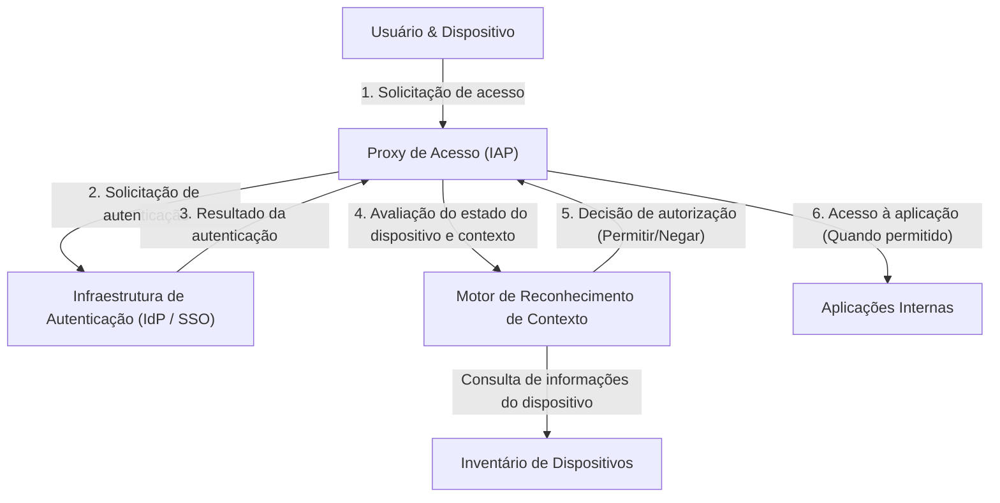

# O Colapso da Defesa de Perímetro: A Ilusão do "Interior Confiável"

Na segurança cibernética moderna, uma mudança de paradigma histórica está em andamento. No centro disso está o conceito de "Arquitetura Zero Trust", e quem o concretizou mais cedo e em maior escala no mundo foi o "BeyondCorp" do Google.

Durante décadas, a segurança de rede corporativa dependeu do modelo "Castelo e Fosso" (Castle and Moat), ou seja, **segurança baseada em perímetro**. A filosofia básica desse modelo é extremamente simples.
É um dualismo que diz: "Usuários e dispositivos dentro do 'fosso' (rede corporativa), como firewalls e VPNs, estão seguros, enquanto aqueles fora (Internet) são perigosos".

No entanto, essa abordagem continha uma falha fatal.
Uma vez que os invasores rompem o perímetro e obtêm direitos de acesso à rede interna, a parte interna torna-se uma área "confiável", permitindo-lhes mover-se livremente (movimento lateral). Infecções por malware, ameaças internas e roubo de credenciais por phishing contornam facilmente as defesas de perímetro na moderna metodologia de ataque. Especialmente com a difusão de serviços em nuvem e a normalização do trabalho remoto, o próprio "perímetro a ser defendido" deixou de existir fisicamente, e a defesa de perímetro atingiu seus limites.

## As Limitações das VPNs e a Ameaça do Movimento Lateral

As VPNs (Redes Privadas Virtuais) tradicionais funcionavam como um túnel para trazer usuários externos de forma segura para a rede interna. No entanto, as VPNs concedem "acesso em nível de rede". Os usuários que passam pela autenticação muitas vezes conseguem se conectar, em nível de rede, a outros sistemas internos ou bancos de dados dos quais eles originalmente não precisam.

Se um invasor roubar as credenciais de VPN de um funcionário comum, ele poderá lançar varreduras de rede e explorar vulnerabilidades, até mesmo contra servidores de informações confidenciais aos quais esse funcionário não deveria ter acesso. Essa é a ameaça do movimento lateral, e é a maior fraqueza do modelo de defesa de perímetro.

---

# A Filosofia Básica do Zero Trust: "Nunca Confie, Sempre Verifique"

O "Zero Trust", proposto em 2010 por John Kindervag da Forrester Research, é um conceito para resolver esse problema fundamental.
A ideia central do Zero Trust é apenas uma:
**"Independentemente da localização na rede (interna ou externa), nenhum usuário, dispositivo ou sistema é confiável por padrão. Todas as solicitações de acesso devem ser verificadas o tempo todo."**

Na Arquitetura Zero Trust, os conceitos de "interno" ou "externo" não fazem sentido. Seja um PC conectado à LAN cabeada no escritório, ou um smartphone conectado ao Wi-Fi do Starbucks, eles devem passar pelos processos rigorosos e exatos de autenticação e autorização.

## Os 3 Princípios do Zero Trust

1. **Autenticar e autorizar de forma segura o acesso a todos os recursos**
   O controle de acesso é baseado na identidade (quem) e no contexto (qual o estado), e não no local da rede.
2. **Aplicação rigorosa do Princípio do Menor Privilégio (PoLP: Principle of Least Privilege)**
   Usuários e dispositivos recebem apenas os privilégios mínimos necessários para executar a tarefa, e apenas pelo tempo necessário.
3. **Monitoramento e verificação contínuos**
   Passar pela autenticação uma vez não significa confiar nessa sessão para sempre. O estado de segurança do dispositivo e o comportamento do usuário são monitorados em tempo real, e o acesso é cortado imediatamente se uma anomalia for detectada.

---

# Google BeyondCorp: A Materialização do Zero Trust

O Google decidiu revisar fundamentalmente sua arquitetura de rede interna na sequência de um ataque cibernético altamente sofisticado (Operation Aurora) proveniente da China em 2009. O projeto resultante foi o "BeyondCorp".

BeyondCorp é o primeiro caso do mundo a demonstrar o conceito de Zero Trust em escala empresarial, servindo como modelo para muitas das soluções atuais de Zero Trust (como o IAP: Identity-Aware Proxy).

## Elementos Centrais que Compõem o BeyondCorp

A arquitetura do BeyondCorp é baseada na colaboração estreita de vários componentes.

### 1. Inventário de Dispositivos (Device Inventory)
O Google atribuiu extrema importância não apenas a "quem" está acessando, mas de "qual dispositivo" o acesso é feito. Eles construíram um repositório central de informações sobre dispositivos gerenciados pela empresa e confirmados como seguros (Managed Devices).
Um certificado exclusivo (Device Certificate) é emitido para cada dispositivo, e as informações de hardware, versão do sistema operacional e status de criptografia são continuamente sincronizadas com o banco de dados.

### 2. Gerenciamento de Identidade (Identity Management)
Integrado a uma infraestrutura de identidade (IAM) centralizada, informações de atributos como afiliação, cargo e projetos do usuário são gerenciadas de forma precisa. A Autenticação Multifator (MFA) é um requisito obrigatório; a autenticação simples por senha não é permitida.

### 3. Motor de Reconhecimento de Contexto (Trust Inference / Context-Aware Access)
Este motor é o "cérebro" do BeyondCorp. Ele analisa a identidade do usuário e o estado do dispositivo em tempo real, calculando dinamicamente uma "pontuação de confiança" (Trust Score).
Por exemplo, mesmo que seja o "usuário correto", se a solicitação de acesso vier de um "dispositivo sem o patch do SO aplicado" ou de um "endereço IP estrangeiro incomum", será considerado de alto risco e o acesso poderá ser negado, ou uma autenticação adicional poderá ser solicitada.

### 4. Proxy de Acesso (Access Proxy)
É o gateway que atua como ponto de entrada para todas as aplicações internas. Em vez de uma conexão de nível de rede como uma VPN, ele funciona como um proxy reverso para cada aplicação.
O proxy recebe solicitações de usuários e dispositivos, consulta o motor de reconhecimento de contexto e decide se deve permitir o acesso (autorização). Somente quando permitido, o proxy encaminha a solicitação para a aplicação no back-end.

### 5. Motor de Controle de Acesso (Access Control Engine)
Ele gerencia centralmente as regras de direitos de acesso (quem pode acessar e a partir de qual estado de dispositivo) para os recursos de cada aplicação, e trabalha em conjunto com o proxy para impor as políticas.

---

# Diagrama de Arquitetura: O Fluxo de Acesso do BeyondCorp

Abaixo está um diagrama mostrando o fluxo de processamento de solicitações de acesso na arquitetura do BeyondCorp.

Com este fluxo, o conceito de rede interna corporativa desaparece. Foi implementado um ambiente onde todas as comunicações na Internet são criptografadas, e a autenticação e autorização são executadas para cada solicitação.

---

# O Princípio do Menor Privilégio (PoLP) e o Verdadeiro Valor do Controle de Acesso Dinâmico

O verdadeiro valor do Zero Trust e do BeyondCorp reside não apenas no aprimoramento da segurança, mas também na **melhoria da flexibilidade e produtividade**.

No modelo de defesa de perímetro, quando se tentava aumentar a segurança, as restrições de VPN tornavam-se mais rígidas e a conveniência do usuário caía. No entanto, no modelo BeyondCorp, desde que os usuários tenham acesso à Internet, eles podem acessar as aplicações da empresa perfeitamente e com segurança, de qualquer lugar do mundo. Não há o trabalho de iniciar um cliente VPN nem atrasos de rede.

Além disso, o "Controle de Acesso Dinâmico" permite a aplicação de políticas de segurança flexíveis de acordo com a situação.
- **Cenário A:** Em caso de acesso a partir de um PC fornecido pela empresa (que atende perfeitamente aos requisitos de segurança), o acesso a repositórios de código-fonte altamente sensíveis é permitido.
- **Cenário B:** Quando o mesmo usuário acessa de seu smartphone pessoal (BYOD), a visualização de e-mails é permitida, mas o download do código-fonte é proibido.

Desta forma, poder controlar granularmente as permissões de acordo com o contexto é a base que sustenta os diversos estilos de trabalho modernos (conhecidos no contexto do Zero Trust como "Anywhere Operations").

# O Futuro do Zero Trust: Em Direção ao Padrão de Segurança de Próxima Geração

O BeyondCorp do Google começou como um sistema proprietário de uma empresa específica, mas seu conceito rapidamente se tornou um padrão do setor. O NIST (Instituto Nacional de Padrões e Tecnologia dos EUA) publicou uma diretriz padrão para a arquitetura Zero Trust como "SP 800-207" e tornou sua adoção obrigatória para agências do governo dos EUA.

Na era cloud-native, a infraestrutura é transformada em código, e os aplicativos são descentralizados como microsserviços. Neste ambiente complexo, é impossível proteger os sistemas com defesas de perímetro tradicionais.

O Zero Trust, com sua frase de aparência fria "não confie em ninguém", paradoxalmente apresenta uma forma extremamente aberta e flexível da rede do futuro: **"Desde que haja autenticação e verificação precisas, qualquer pessoa pode acessar os dados livremente e com segurança, independentemente do local ou dispositivo."**

A arquitetura Zero Trust já não é uma mera palavra da moda; pode-se dizer que é o ponto culminante inevitável da evolução para a qual todas as organizações devem apontar.
