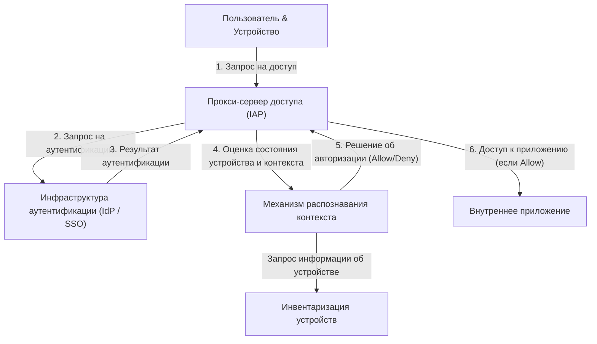

# Крах периметральной защиты: иллюзия "надежной внутренней среды"

В современной кибербезопасности происходит исторический сдвиг парадигмы. В его центре находится концепция "архитектуры нулевого доверия" (Zero Trust Architecture), а первым и самым масштабным ее воплощением в мире стал проект Google "BeyondCorp".

На протяжении десятилетий сетевая безопасность компаний опиралась на модель "замок и ров" (Castle and Moat), то есть на **безопасность на основе периметра**. Базовая философия этой модели предельно проста:
Это дуализм, утверждающий, что "пользователи и устройства внутри 'рва' в виде межсетевых экранов и VPN (в корпоративной сети) — в безопасности, а все, что находится снаружи (в интернете) — представляет угрозу".

Однако этот подход содержал фатальный недостаток.
Как только злоумышленник прорывает периметр и получает доступ к внутренней сети, он может свободно перемещаться по ней (боковое перемещение или lateral movement), так как внутренняя среда считается "надежной". Заражение вредоносным ПО, инсайдерские угрозы, кража учетных данных с помощью фишинга — современные методы атак с легкостью обходят периметральную защиту. В частности, с распространением облачных сервисов и переходом на удаленную работу физического "периметра, который нужно защищать" больше не существует, что привело концепцию защиты периметра к пределу своих возможностей.

## Ограничения VPN и угроза бокового перемещения

Традиционные VPN (виртуальные частные сети) служили туннелем для безопасного подключения внешних пользователей к внутренней сети. Однако VPN предоставляет "доступ на сетевом уровне". Пройдя аутентификацию, пользователи зачастую получают сетевой доступ и к другим внутренним системам или базам данных компании, которые им на самом деле не нужны.

Если злоумышленник похищает учетные данные VPN рядового сотрудника, он получает возможность проводить сканирование сети или атаковать уязвимости даже на тех серверах с конфиденциальной информацией, к которым этот сотрудник не должен иметь доступа. В этом и кроется опасность бокового перемещения и главная слабость модели периметральной защиты.

---

# Базовая философия Zero Trust: "Никогда не доверяй, всегда проверяй"

Концепция "Нулевого доверия" (Zero Trust), предложенная Джоном Киндервагом из Forrester Research в 2010 году, призвана решить эту фундаментальную проблему.
Ключевая идея Zero Trust заключается лишь в одном:
**"Независимо от расположения в сети (внутри или снаружи компании), ни один пользователь, устройство или система не пользуются доверием по умолчанию. Каждый запрос на доступ должен постоянно проходить проверку".**

В архитектуре Zero Trust понятия "внутри" и "снаружи" теряют всякий смысл. Будь то ПК, подключенный к проводной сети в офисе, или смартфон, подключенный к Wi-Fi в Starbucks — они обязаны проходить абсолютно одинаковые, строгие процессы аутентификации и авторизации.

## Три принципа Zero Trust

1. **Безопасная аутентификация и авторизация для доступа ко всем ресурсам**
   Управление доступом осуществляется не на основе расположения в сети, а на основе идентичности (кто это) и контекста (в каком он состоянии).
2. **Строгое соблюдение принципа наименьших привилегий (PoLP)**
   Пользователям и устройствам предоставляются только минимально необходимые права для выполнения конкретной задачи и только на необходимое время.
3. **Непрерывный мониторинг и проверка**
   Прохождение аутентификации один раз не означает, что сессии можно доверять вечно. Состояние безопасности устройства и поведение пользователя отслеживаются в режиме реального времени, и при обнаружении аномалий доступ немедленно блокируется.

---

# Google BeyondCorp: воплощение Zero Trust

В результате сложной кибератаки из Китая в 2009 году (Operation Aurora), Google принял решение радикально пересмотреть архитектуру своей внутренней сети. Результатом стал проект "BeyondCorp".

BeyondCorp — это первый в мире пример реализации концепции Zero Trust в масштабах крупного предприятия, послуживший прототипом для многих современных решений (таких как IAP: Identity-Aware Proxy).

## Ключевые компоненты архитектуры BeyondCorp

Архитектура BeyondCorp строится на тесном взаимодействии нескольких компонентов.

### 1. Инвентаризация устройств (Device Inventory)
Для Google было крайне важно не только то, "кто" получает доступ, но и "с какого устройства". Был создан центральный репозиторий информации об управляемых устройствах (Managed Devices), безопасность которых подтверждена и контролируется компанией.
Каждому устройству выдается уникальный сертификат (Device Certificate), а информация об аппаратном обеспечении, версии ОС, состоянии шифрования и прочих параметрах постоянно синхронизируется с базой данных.

### 2. Управление пользователями и группами (Identity Management)
Система интегрирована с централизованной инфраструктурой управления идентификацией (IAM), которая точно отслеживает атрибуты пользователей: их принадлежность к отделам, должности, проекты. Многофакторная аутентификация (MFA) является обязательным требованием, а доступ только по паролю запрещен.

### 3. Механизм распознавания контекста (Trust Inference / Context-Aware Access)
Этот механизм — мозг BeyondCorp. Он анализирует идентичность пользователя и состояние устройства в режиме реального времени, динамически вычисляя "оценку доверия".
Например, даже если это "правильный пользователь", но запрос исходит от "устройства без последних обновлений ОС" или с "необычного зарубежного IP-адреса", система расценивает риск как высокий и может отказать в доступе или потребовать дополнительную аутентификацию.

### 4. Прокси-сервер доступа (Access Proxy)
Это шлюз, который служит точкой входа ко всем внутренним приложениям. Он работает не как сетевое подключение наподобие VPN, а как обратный прокси-сервер для каждого отдельного приложения.
Прокси принимает запросы от пользователей и устройств, обращается к механизму распознавания контекста и решает, следует ли разрешить доступ (авторизация). Только в случае положительного решения прокси перенаправляет запрос к бэкенд-приложению.

### 5. Механизм управления доступом (Access Control Engine)
Он централизованно управляет правилами доступа к ресурсам каждого приложения (кто и с устройства в каком состоянии может получить доступ) и взаимодействует с прокси для применения политик.

---

# Схема архитектуры: поток доступа в BeyondCorp

Ниже приведена схема, иллюстрирующая процесс обработки запроса на доступ в архитектуре BeyondCorp.

Благодаря этому потоку само понятие внутренней сети исчезает. Создается среда, в которой все интернет-соединения зашифрованы, а аутентификация и авторизация выполняются для каждого отдельного запроса.

---

# Истинная ценность принципа наименьших привилегий (PoLP) и динамического управления доступом

Истинная ценность Zero Trust и BeyondCorp заключается не только в усилении безопасности, но и в **повышении гибкости и продуктивности**.

В модели защиты периметра усиление безопасности приводило к ужесточению ограничений VPN, что снижало удобство для пользователей. В модели BeyondCorp пользователи могут беспрепятственно и безопасно получать доступ к внутренним приложениям из любой точки мира, имея лишь подключение к интернету. Нет ни необходимости запускать VPN-клиент, ни задержек в сети.

Более того, "динамическое управление доступом" позволяет применять гибкие политики безопасности в зависимости от ситуации.
- **Сценарий A:** При доступе с корпоративного ПК (полностью соответствующего требованиям безопасности) предоставляется доступ к высококонфиденциальному репозиторию исходного кода.
- **Сценарий B:** Если тот же пользователь обращается с личного смартфона (BYOD), ему разрешается чтение почты, но загрузка исходного кода блокируется.

Именно такая возможность детального (гранулярного) контроля привилегий в зависимости от контекста служит фундаментом для современных разнообразных стилей работы (что в контексте Zero Trust называется "Anywhere Operations").

# Будущее Zero Trust: к стандарту безопасности нового поколения

Проект BeyondCorp от Google начинался как проприетарная система отдельной компании, но его концепция мгновенно стала отраслевым стандартом. NIST (Национальный институт стандартов и технологий США) выпустил стандартное руководство по архитектуре Zero Trust в виде документа "SP 800-207" и обязал правительственные учреждения США к его внедрению.

В эпоху cloud-native инфраструктура представлена в виде кода (Infrastructure as Code), а приложения децентрализованы и состоят из микросервисов. В этой сложной среде защитить систему традиционной периметральной защитой просто невозможно.

Несмотря на то, что фраза "никому нельзя доверять" может звучать холодно, Zero Trust парадоксальным образом предлагает концепцию крайне открытой и гибкой сети будущего: **"при наличии точной аутентификации и проверки любой человек может свободно и безопасно получать доступ к данным независимо от местоположения и используемого устройства"**.

Архитектура Zero Trust больше не является просто модным словечком; можно смело утверждать, что это неизбежная точка эволюции, к которой должна стремиться каждая организация.
