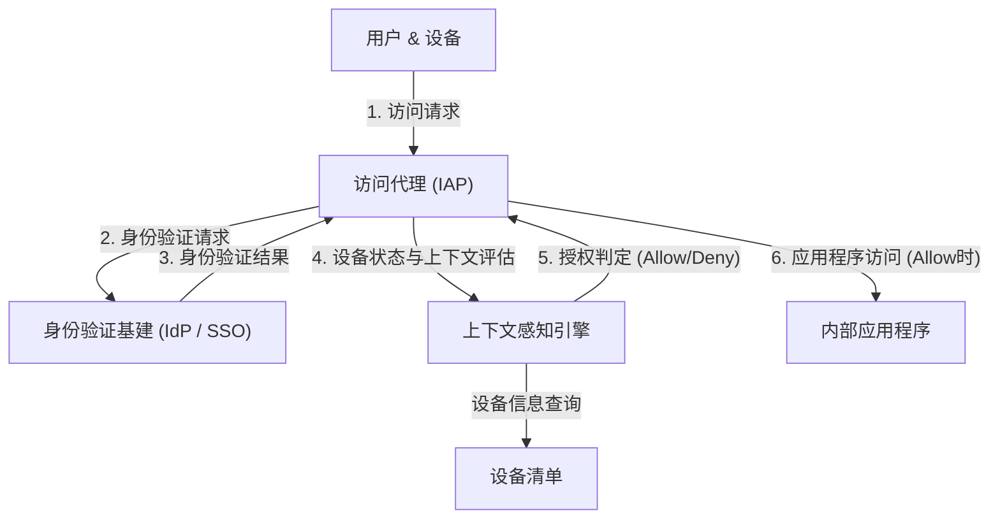

# 边界防御的崩溃：“受信任的内部”这一幻想

在现代网络安全中，一场历史性的范式转变正在进行。其核心是“零信任架构”（Zero Trust Architecture）这一概念，而在全球范围内最早且最大规模实现这一架构的，便是 Google 的“BeyondCorp”。

几十年来，企业的网络安全一直依赖于“城堡与护城河（Castle and Moat）”模型，即**基于边界（Perimeter）的安全防护**。这种模型的基本思想极其简单。
这是一种二元论：“处于防火墙和 VPN 这一'护城河'内部（企业网络）的用户和设备是安全的，而处于外部（互联网）的则是危险的”。

然而，这种方法存在着致命的缺陷。
一旦攻击者突破边界，获得了内部网络的访问权限，由于内部被视为“受信任的”区域，他们就可以自由行动（横向移动：Lateral Movement）。恶意软件感染、内部犯罪、通过钓鱼攻击窃取凭证等现代攻击手法，可以轻而易举地绕过边界防御。特别是随着云服务的普及和远程办公的常态化，“需要保护的边界”本身在物理上已不复存在，边界防御迎来了它的极限。

## VPN 的局限性与横向移动的威胁

传统的 VPN（虚拟专用网络）作为一个隧道，能够将外部用户安全地引入内部网络。但是，VPN 赋予的是“网络级别的访问权限”。通过身份验证的用户，往往在网络上也能够访问他们原本不需要的其他内部系统和数据库。

如果攻击者窃取了普通员工的 VPN 凭证，他们就可以对该员工本无权访问的机密信息服务器发起网络扫描和漏洞攻击。这就是横向移动的可怕之处，也是边界防御模型的最大弱点。

---

# 零信任的基本理念：“从不信任，始终验证”

2010 年，Forrester Research 的 John Kindervag 提出了“零信任（Zero Trust）”这一概念，旨在解决这个根本性问题。
零信任的核心思想只有一个：
**“无论网络位置（在公司内还是在公司外），默认情况下不信任任何用户、设备和系统。所有的访问请求都必须始终经过验证。”**

在零信任架构中，“内部”或“外部”的概念毫无意义。无论是在办公室连接有线局域网的 PC，还是在星巴克连接 Wi-Fi 的智能手机，都必须通过完全相同的、严格的身份验证和授权流程。

## 零信任的三大原则

1. **安全地对所有资源的访问进行身份验证和授权**
   不基于网络位置，而是基于身份（是谁）和上下文（处于何种状态）来控制访问。
2. **彻底贯彻最小权限原则（PoLP: Principle of Least Privilege）**
   只在所需的时间内，赋予用户和设备执行其任务所需的最低限度权限。
3. **持续的监控与验证**
   不能仅仅因为通过了一次身份验证，就永远信任该会话。需要实时监控设备的安全状态和用户的行为，一旦检测到异常，便立即切断访问。

---

# Google BeyondCorp：零信任的具体实现

Google 在 2009 年遭遇了来自中国的高级网络攻击（极光行动，Operation Aurora）之后，决定从根本上重新审视其内部网络的架构。由此诞生的项目就是“BeyondCorp”。

BeyondCorp 是全球首个在企业规模上验证零信任概念的案例，成为了当今许多零信任解决方案（如 IAP: Identity-Aware Proxy）的蓝图。

## 构成 BeyondCorp 的核心要素

BeyondCorp 的架构由多个紧密协作的组件构成。

### 1. 设备清单（Device Inventory）
Google 不仅非常重视“谁”在访问，而且极其看重“从哪台设备”访问。他们构建了一个中心化的存储库，用于保存由企业管理且确认安全的设备（Managed Device）信息。
每台设备都会获发一份唯一的证书（Device Certificate），设备的硬件信息、操作系统版本、加密状态等都会持续与数据库同步。

### 2. 用户与群组管理（Identity Management）
它与集中式身份（IAM）基础架构集成，精确管理用户的部门、职位、项目等属性信息。多因素身份验证（MFA）是必须的要求，不允许使用单纯的密码验证。

### 3. 上下文感知引擎（Trust Inference / Context-Aware Access）
这个引擎正是 BeyondCorp 的大脑。它实时分析用户的身份和设备的状态，动态计算出“信任分数”。
例如，即便是“正确的用户”，如果访问请求来自“未安装操作系统补丁的设备”，或者来自“异常的海外 IP 地址”，引擎就会判定风险较高，从而拒绝访问，或要求进行额外的身份验证。

### 4. 访问代理（Access Proxy）
它是进入所有内部应用程序的网关。它不再像 VPN 那样提供网络级别的连接，而是作为各个应用程序的反向代理运行。
代理接收来自用户和设备的请求，然后向上下文感知引擎查询是否应该允许访问（授权）。只有在获得允许的情况下，代理才会将请求转发给后端的应用程序。

### 5. 访问控制引擎（Access Control Engine）
它集中管理对各个应用程序资源的访问权限规则（允许谁、从何种状态的设备进行访问），并与代理协同实施策略。

---

# 架构图解：BeyondCorp 的访问流

以下是展示 BeyondCorp 架构中访问请求处理流程的图表。

通过这一流程，内部网络的概念不复存在，互联网上的所有通信都被加密，实现了一个在每个请求上都执行身份验证和授权的环境。

---

# 最小权限原则（PoLP）与动态访问控制的真正价值

零信任和 BeyondCorp 的真正价值，不仅在于强化了安全性，更在于**提高了灵活性和生产力**。

在边界防御模型中，如果要加强安全性，VPN 的限制就会变得严格，从而降低用户的便利性。但是在 BeyondCorp 模型中，用户只要有互联网连接，就可以从世界任何地方无缝且安全地访问内部应用程序。既不需要启动 VPN 客户端的麻烦，也没有网络延迟。

此外，“动态访问控制”使得根据不同情况应用灵活的安全策略成为可能。
- **场景 A:** 当通过公司配发的 PC（完全满足安全要求）进行访问时，允许访问机密性高的源代码仓库。
- **场景 B:** 当同一用户通过私人智能手机（BYOD）进行访问时，允许查看邮件，但禁止下载源代码。

像这样，能够根据上下文进行精细（Granular）的权限控制，正是支撑当今多样化工作方式（在零信任语境下称为“Anywhere Operations”）的基石。

# 零信任的未来：走向下一代安全标准

Google 的 BeyondCorp 始于特定企业的专有系统，但其概念瞬间成为了行业标准。NIST（美国国家标准与技术研究院）发布了作为零信任架构标准指南的“SP 800-207”，并要求美国政府机构必须采用。

在云原生时代，基础设施被代码化，应用程序被分散为微服务。在这个复杂的环境中，想用传统的边界防御来保护系统已经是不可能的了。

“从不信任”这一理念听起来似乎很冷漠，但它实际上悖论般地展现了一个极其开放且灵活的未来网络形态：**“只要有准确的身份验证和评估，任何人都可以不受地点和设备的限制，自由且安全地访问数据”**。

可以说，零信任架构已经不再是一个单纯的热门词汇，而是所有组织都应该致力于实现的、必然的进化终点。
