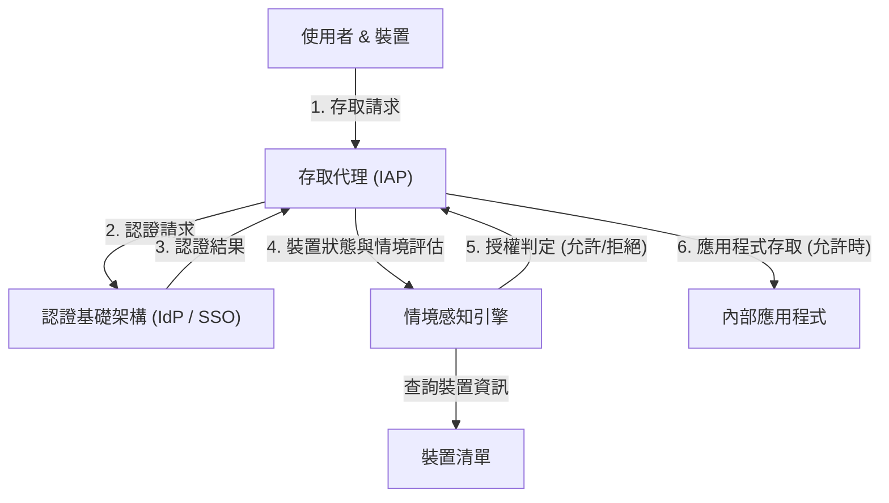

# 邊界防禦的瓦解：「受信任的內部」之幻想

在現代的網路安全中，一場歷史性的典範轉移正在進行。其核心正是「零信任架構」的概念，而在全球最早且最大規模實現這一點的，就是 Google 的「BeyondCorp」。

幾十年來，企業的網路安全一直依賴於「城堡與護城河（Castle and Moat）」模型，亦即**基於邊界（Perimeter）的安全性**。這個模型的基本思想極其簡單。
這是一種二元論：「位在防火牆和 VPN 這些『護城河』內部（企業網路）的使用者和裝置是安全的，而在外部（網際網路）的則是危險的」。

然而，這種方法存在著致命的缺陷。
一旦攻擊者突破了邊界並獲得內部網路的存取權限，由於內部是「受信任」的區域，他們便能自由地橫向移動（Lateral Movement）。無論是惡意軟體感染、內部犯罪，還是透過釣魚攻擊竊取憑證，現代的攻擊手法都能輕易繞過邊界防禦。特別是隨著雲端服務的普及和遠距工作的常態化，「應保護的邊界」本身在物理上已不復存在，邊界防禦也達到了極限。

## VPN 的極限與橫向移動的威脅

傳統的 VPN（虛擬私人網路）作為將外部使用者安全地引入內部網路的通道而發揮作用。但是，VPN 賦予的是「網路層級的存取權」。通過認證的使用者，往往也能在網路上連接到原本不需要存取的公司其他系統或資料庫。

當攻擊者奪取了一般員工的 VPN 憑證，就能對該員工原本沒有權限存取的機密資訊伺服器進行網路掃描或弱點攻擊。這就是橫向移動的恐怖之處，也是邊界防禦模型最大的弱點。

---

# 零信任的基本理念：「永不信任，始終驗證」

2010 年，Forrester Research 的 John Kindervag 提出的「零信任（Zero Trust）」正是為了解決這個根本問題的概念。
零信任的核心思想只有一個：
**「無論網路位置為何（公司內部或外部），預設不信任任何使用者、裝置或系統。所有的存取請求都必須始終經過驗證。」**

在零信任架構中，「內部」與「外部」的概念不再具有意義。即使是連接辦公室內有線區域網路的 PC，或是連接星巴克 Wi-Fi 的智慧型手機，都必須通過完全相同、嚴格的認證與授權流程。

## 零信任的三大原則

1. **安全地認證與授權所有資源的存取**
   根據身分（是誰）和情境（處於什麼狀態）來控制存取，而非網路位置。
2. **徹底落實最小權限原則（PoLP: Principle of Least Privilege）**
   僅賦予使用者和裝置執行該任務所需的最小權限，且僅在必要的時間內有效。
3. **持續的監控與驗證**
   並非一旦通過認證，該工作階段就會被永遠信任。系統會即時監控裝置的安全狀態和使用者行為，若偵測到異常，便會立即阻斷存取。

---

# Google BeyondCorp：零信任的具體實現

Google 以 2009 年遭受來自中國的高階網路攻擊（極光行動，Operation Aurora）為契機，決定從根本重新審視內部網路的架構。其結果誕生的專案就是「BeyondCorp」。

BeyondCorp 是全球首個在企業規模上驗證零信任概念的案例，也成為如今許多零信任解決方案（如 IAP：Identity-Aware Proxy 等）的藍圖。

## 構成 BeyondCorp 的核心要素

BeyondCorp 的架構建立在多個元件緊密協作的基礎之上。

### 1. 裝置清單（Device Inventory）
Google 不僅極度重視「是誰」在存取，更重視是「從哪個裝置」進行存取。他們建立了一個中央儲存庫，用於存放由企業管理且確認為安全的裝置（Managed Device）資訊。
每個裝置都會獲發專屬憑證（Device Certificate），且裝置的硬體資訊、作業系統版本、加密狀態等都會持續與資料庫同步。

### 2. 使用者與群組管理（Identity Management）
這與集中式的身分（IAM）基礎架構整合，精確管理使用者的所屬單位、職位、專案等屬性資訊。多因素認證（MFA）是必要條件，單純的密碼認證是不被允許的。

### 3. 情境感知引擎（Trust Inference / Context-Aware Access）
這個引擎正是 BeyondCorp 的大腦。它會即時分析使用者的身分與裝置狀態，動態計算出「信任分數」。
例如，即便是「正確的使用者」，若是來自「未套用 OS 修補程式的裝置」，或是「與平時不同的海外 IP 位址」的存取請求，引擎會判斷風險較高，進而拒絕存取，或要求進行額外的認證。

### 4. 存取代理（Access Proxy）
這是通往所有內部應用程式入口的閘道。它不像 VPN 那樣提供網路層級的連線，而是作為每個應用程式的反向代理運作。
代理會接收來自使用者和裝置的請求，並向情境感知引擎查詢以決定是否該允許存取（授權）。唯有在允許的情況下，代理才會將請求轉發給後端的應用程式。

### 5. 存取控制引擎（Access Control Engine）
它集中管理針對各個應用程式資源的存取權限規則（誰可以從何種狀態的裝置存取），並與代理協作以強制執行策略。

---

# 架構圖解：BeyondCorp 的存取流程

以下是 BeyondCorp 架構中處理存取請求的流程圖。

透過這個流程，內部網路的概念便消滅了，網際網路上的所有通訊都被加密，實現了一個每次請求都會執行認證與授權的環境。

---

# 最小權限原則（PoLP）與動態存取控制的真正價值

零信任與 BeyondCorp 的真正價值，不僅僅在於強化安全性，更在於**提升了靈活性與生產力**。

在邊界防禦模型中，若要強化安全，VPN 的限制就會變得嚴格，導致使用者便利性下降。但在 BeyondCorp 模型中，使用者只要有網際網路，無論身在世界何處，都能無縫且安全地存取內部應用程式。既沒有啟動 VPN 用戶端的麻煩，也沒有網路延遲。

此外，透過「動態存取控制」，得以根據情況套用靈活的安全策略。
- **情境 A:** 當從公司配發的 PC（完全符合安全要求）進行存取時，允許存取機密性極高的原始碼儲存庫。
- **情境 B:** 若同一位使用者從私人的智慧型手機（BYOD）進行存取，則允許瀏覽電子郵件，但禁止下載原始碼。

像這樣能夠根據情境進行精細（Granular）權限控制的能力，正是支撐現代多樣化工作模式（在零信任語境中被稱為「Anywhere Operations」）的基石。

# 零信任的未來：邁向次世代安全標準

Google 的 BeyondCorp 雖然始於特定企業的專有系統，但其概念卻在轉瞬之間成為了業界標準。NIST（美國國家標準暨技術研究院）發布了「SP 800-207」作為零信任架構的標準指南，並強制美國政府機構採用。

在雲端原生的時代，基礎架構被程式碼化，應用程式則分散為微服務。在這個複雜的環境中，已經不可能再靠傳統的邊界防禦來保護系統了。

「不信任任何人」這句話聽起來或許冷酷，但在零信任的架構下，它卻反直覺地提示了一個極其開放且靈活的未來網路型態：**「只要有正確的認證與驗證，任何人都能不受地點與裝置的限制，自由且安全地存取資料。」**

零信任架構早已不再只是個流行語，而是所有組織都應當追求的必然演進終點。
