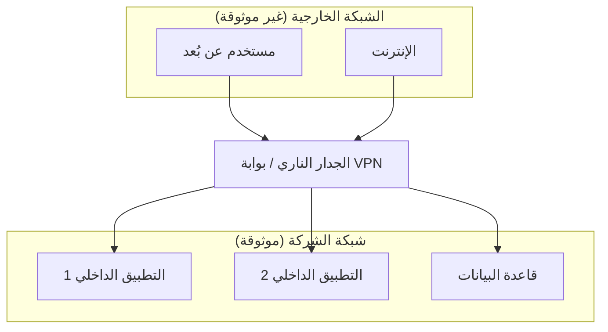
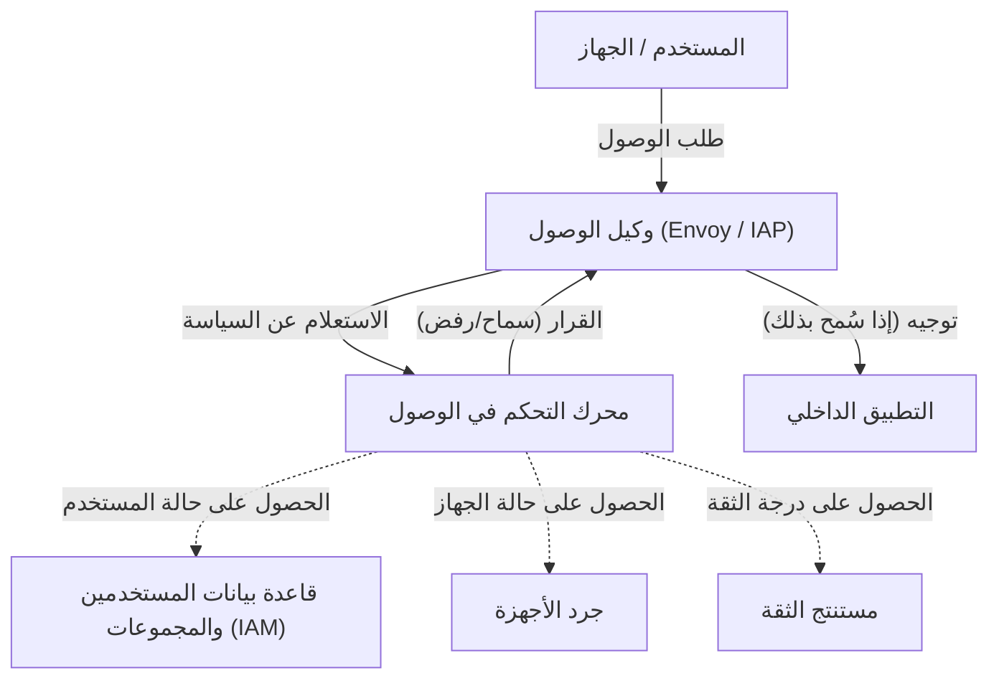

يشهد مفهوم الأمن السيبراني في شبكات المؤسسات الحديثة نقطة تحول جذرية. في هذه المقالة، سنشرح بالتفصيل الجوهر الحقيقي لـ **بنية شبكة انعدام الثقة** والابتعاد عن الدفاع المحيطي، مع اتخاذ مبادرة **BeyondCorp** من Google كمثال.

## 1. قيود وانهيار الدفاع المحيطي التقليدي

في الماضي، كانت البنية التحتية لتكنولوجيا المعلومات في المؤسسات تُصمم بناءً على ثنائية بسيطة تتمثل في "الداخل" و"الخارج". هذا ما يُعرف بـ **الدفاع المحيطي** (Perimeter Security).

### 1.1 النموذج الأساسي للدفاع المحيطي
في الدفاع المحيطي، يتم بناء جدار قوي بين الشبكة الداخلية (الداخل الآمن) والإنترنت (الخارج الخطير) باستخدام أجهزة أمنية مثل الجدران النارية (Firewalls)، وشبكات VPN، وأنظمة IPS/IDS. يُعتبر المستخدمون والأجهزة التي تتمكن من عبور هذا الجدار "موثوقين" من حيث المبدأ، ويُسمح لهم بالوصول إلى مختلف الموارد داخل الشبكة الداخلية.



### 1.2 خلفية الوصول إلى القيود
ومع ذلك، فإن هذا النموذج بدأ ينهار بسبب انتشار الحوسبة السحابية، والوضع الطبيعي الجديد للعمل عن بُعد، والتوسع في استخدام تطبيقات SaaS.

1. **غموض الحدود** : أصبحت البيانات والتطبيقات لا تقتصر على مراكز البيانات المحلية فحسب، بل أصبحت موزعة عبر بيئات سحابية متعددة. أصبح من الصعب تحديد "الحدود" التي يجب حمايتها بوضوح.
2. **تفاقم التهديدات الداخلية** : هذا النموذج يكون عاجزاً أمام المهاجمين الذين تمكنوا بالفعل من اختراق الشبكة الداخلية (مثل البرمجيات الخبيثة أو التهديدات من الداخل). هناك خطر كبير من تفاقم الأضرار بسبب الحركة الجانبية (Lateral Movement).
3. **تحديات الأداء والأمان في VPN** : إن توجيه جميع حركة المرور (Traffic) عبر VPN إلى الشبكة الداخلية يتسبب في استهلاك النطاق الترددي وزيادة زمن الوصول، مما يؤدي إلى تدهور ملحوظ في تجربة المستخدم.

## 2. تعريف انعدام الثقة (NIST SP 800-207)

انعدام الثقة (Zero Trust) ليس مجرد منتج أو تقنية، بل هو مفهوم للأمان وإطار عمل للبنية. يقدم الإصدار **NIST SP 800-207** الصادر عن المعهد الوطني للمعايير والتقنية (NIST) في الولايات المتحدة، تعريفاً معيارياً لانعدام الثقة.

الفلسفة الأساسية لانعدام الثقة هي " **لا تثق أبداً، تحقق دائماً** " (Never Trust, Always Verify). افتراضياً، لا يتم الوثوق بأي شيء، بغض النظر عن موقع الشبكة (سواء داخل الشركة أو خارجها).

### 7 مبادئ أساسية في NIST SP 800-207
1. **اعتبار جميع مصادر البيانات وخدمات الحوسبة كموارد.** 
2. **حماية جميع الاتصالات بغض النظر عن موقع الشبكة.** 
3. **منح الوصول إلى موارد المؤسسة الفردية على أساس كل جلسة (Session).** 
4. **تحديد الوصول إلى الموارد بواسطة سياسة ديناميكية تعتمد على هوية العميل، والتطبيق، وحالة الأصول المطلوبة، وغيرها من السمات السلوكية والبيئية.** 
5. **مراقبة وقياس سلامة وحالة الأمان لجميع الأصول المملوكة والمرتبطة بها.** 
6. **إجراء جميع عمليات المصادقة والتفويض للموارد بشكل ديناميكي، وتطبيقها بصرامة قبل السماح بالوصول.** 
7. **جمع أكبر قدر ممكن من المعلومات حول الوضع الحالي للأصول، والبنية التحتية للشبكة، والاتصالات، واستخدامها لتحسين تدابير الأمان.** 

## 3. Google BeyondCorp: تجسيد انعدام الثقة

استجابةً للهجوم السيبراني واسع النطاق المعروف باسم عملية أورورا (Operation Aurora) في عام 2009، قامت شركة Google بمراجعة بنية شبكتها الداخلية من جذورها. ونتيجة لذلك، وُلدت مبادرة **BeyondCorp** .

ألغت BeyondCorp شبكات المؤسسات ذات الامتيازات، ونقلت التحكم في الوصول من "حدود الشبكة" إلى "المستخدمين والأجهزة الفردية".

### 3.1 بنية BeyondCorp

يوضح مخطط Mermaid التالي التدفق الأساسي للتحكم في الوصول في BeyondCorp.



### 3.2 تفاصيل المكونات

* **وكيل الوصول (Access Proxy)** : هو وكيل عكسي (Reverse Proxy) يعمل كمدخل لجميع التطبيقات. يقوم بإنهاء TLS، وموازنة الأحمال، والأهم من ذلك، تطبيق التحكم في الوصول (Enforcement).
* **جرد الأجهزة (Device Inventory)** : هو قاعدة بيانات لجميع الأجهزة التي تديرها المؤسسة. يقوم بجمع المعلومات باستمرار مثل الشهادات، وإصدار نظام التشغيل، وحالة تطبيق التصحيحات، وتشفير القرص، ويدير حالتها.
* **قاعدة بيانات المستخدمين والمجموعات (IAM)** : تدير معلومات مثل معرف المستخدم (ID)، والمجموعات التي ينتمي إليها، والأدوار. توفر مصادقة قوية (مثل MFA) باستخدام SAML أو [OIDC](https://kenji.blog/ar/p/oauth2-oidc-authentication-authorization-difference/).
* **مستنتج الثقة (Trust Inferer)** : يحلل بيانات جرد الأجهزة والمعلومات السياقية للمستخدم في الوقت الفعلي لحساب "درجة الثقة" الحالية.
* **محرك التحكم في الوصول (Access Control Engine)** : هو محرك سياسات يستقبل الطلبات من وكيل الوصول (Access Proxy)، ويقارن بين درجة ثقة المستخدم والجهاز الطالب لمتطلبات موارد التطبيق المستهدف، ليقرر ما إذا كان سيسمح بالوصول أم يرفضه.

## 4. نموذج حساب تقييم الثقة ودرجة المخاطر

في بيئة انعدام الثقة، لا يتم اتخاذ قرارات السماح بالوصول بناءً على قواعد ثابتة، بل بناءً على درجات مخاطر ديناميكية.

يمكن تعريف درجة المخاطر الإجمالية $Risk(U, D, R)$ عندما يحصل المستخدم $U$ والجهاز $D$ على المورد $R$، كدالة لعدة عوامل.

$ Risk(U, D, R) = w_1 \cdot P_{user}(U) + w_2 \cdot P_{device}(D) + w_3 \cdot P_{context}(C) $

حيث:
* $P_{user}(U)$ هو ملف تعريف مخاطر المستخدم (قوة المصادقة، وجود المصادقة متعددة العوامل MFA، السلوك المشبوه في الماضي، إلخ).
* $P_{device}(D)$ هو ملف تعريف مخاطر الجهاز (نقاط الضعف في نظام التشغيل، الاشتباه في الإصابة ببرامج ضارة، صلاحية الشهادة، إلخ).
* $P_{context}(C)$ هي مخاطر السياق (عنوان IP المصدر، الوقت، الموقع الجغرافي، إلخ).
* $w_i$ هي عوامل الترجيح لكل عنصر ($\sum w_i = 1$).

يتم التعبير عن الثقة $Trust$ كمقلوب للمخاطر، أو كقيمة مطروحة من حد معين.
على سبيل المثال، يمكن صياغة شرط السماح بالوصول على النحو التالي:

$ Trust(U, D, R) = 1 - Risk(U, D, R) \geq Threshold(R) $

حيث $Threshold(R)$ هو مستوى الثقة المطلوب بناءً على حساسية المورد $R$ المستهدف. يتم تعيين حدود أعلى للوصول إلى البيانات المالية شديدة الحساسية.

## 5. دور التجزئة الدقيقة (Microsegmentation)

عنصر آخر ضروري لبناء شبكة انعدام الثقة هو **التجزئة الدقيقة** (Microsegmentation).

فهي تتحكم في الاتصالات بشكل أدق بكثير من تجزئة الشبكة التقليدية القائمة على VLAN، حيث تتم على مستوى عبء العمل (Workload)، أو مستوى التطبيق، أو مستوى العملية (Process). يتيح ذلك تقليل الحركة الجانبية (Lateral Movement) إلى الحد الأدنى نحو المكونات الأخرى، حتى في حالة اختراق أحد المكونات.

باستخدام الشبكات المعرفة بالبرمجيات (SDN) أو الجدران النارية القائمة على الهوية، يتم تعريف سياسات الاتصال بدقة بين كل مكون (من يمكنه التواصل مع من، وعلى أي منفذ/بروتوكول)، مما يؤدي إلى قطع مسارات الاتصال غير الضرورية تماماً.

## 6. مثال تطبيقي: سياسات IAM وإعدادات الوكيل

فيما يلي نعرض أمثلة لمفاهيم الإعدادات العملية لتنفيذ بنية انعدام الثقة.

### 6.1 مثال على سياسة IAM بتنسيق JSON (على غرار AWS IAM)

JSON التالي هو مثال لسياسة تسمح بالوصول إلى موارد محددة فقط للمستخدمين الذين يصلون من نطاق عناوين IP معينة وتمت مصادقتهم باستخدام MFA. في بيئة انعدام الثقة، يتم تعيين مثل هذه الشروط القائمة على السياق بدقة.

```json
{
  "Version": "2012-10-17",
  "Statement": [
    {
      "Sid": "ZeroTrustAccessPolicyExample",
      "Effect": "Allow",
      "Action": [
        "s3:GetObject",
        "s3:ListBucket"
      ],
      "Resource": [
        "arn:aws:s3:::corporate-confidential-data",
        "arn:aws:s3:::corporate-confidential-data/*"
      ],
      "Condition": {
        "IpAddress": {
          "aws:SourceIp": "192.0.2.0/24"
        },
        "Bool": {
          "aws:MultiFactorAuthPresent": "true"
        },
        "NumericGreaterThan": {
          "custom:DeviceTrustScore": "80"
        }
      }
    }
  ]
}
```
*(ملاحظة: `custom:DeviceTrustScore` هو مفتاح شرط مخصص من الناحية المفاهيمية.)*

### 6.2 مثال مفاهيمي للتحكم في الوصول باستخدام وكيل Envoy

في Envoy، الذي يعمل كـ Access Proxy، يتم تنفيذ التحكم في الوصول بالتعاون مع خدمة مصادقة وتفويض خارجية (ExtAuthz).

```yaml
# مثال لمقتطف إعدادات سلسلة عوامل تصفية Envoy
filters:
  - name: envoy.filters.network.http_connection_manager
    typed_config:
      "@type": type.googleapis.com/envoy.extensions.filters.network.http_connection_manager.v3.HttpConnectionManager
      route_config:
        name: local_route
        virtual_hosts:
          - name: backend_service
            domains: ["*"]
            routes:
              - match: { prefix: "/" }
                route: { cluster: backend_app_cluster }
      http_filters:
        - name: envoy.filters.http.ext_authz
          typed_config:
            "@type": type.googleapis.com/envoy.extensions.filters.http.ext_authz.v3.ExtAuthz
            grpc_service:
              envoy_grpc:
                cluster_name: access_control_engine_cluster
              timeout: 0.5s
            transport_api_version: V3
            metadata_context_namespaces:
              - "envoy.filters.http.jwt_authn"
        - name: envoy.filters.http.router
```

من خلال هذا الإعداد، يقوم Envoy قبل توجيه جميع طلبات HTTP، بإرسال البيانات الوصفية (Metadata) للطلب إلى `access_control_engine_cluster` (محرك التحكم في الوصول)، ويستعلم عما إذا كان التصريح مقبولاً أم لا.

## الخلاصة

إن الانتقال إلى بنية شبكة انعدام الثقة لا يكتمل بين عشية وضحاها. إنها مبادرة طويلة الأجل تتطلب التكامل مع الأنظمة القديمة الحالية، وتغيير الثقافة التنظيمية، والمراقبة والضبط المستمرين.

ولكن، كما أثبتت **BeyondCorp** من Google، فإن تنفيذ التحكم في الوصول بناءً على "الهوية والسياق" بدلاً من "موقع الشبكة"، يجعل من الممكن بناء أساس أمني أكثر مرونة وقوة ضد التهديدات المتنوعة في عصر السحابة.
