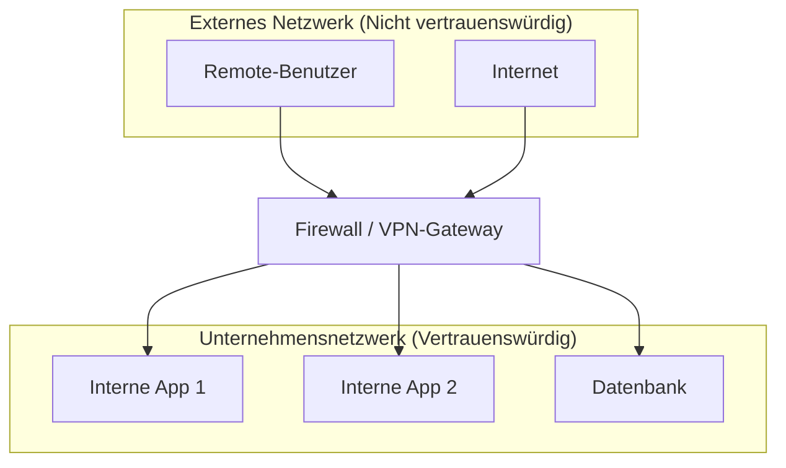
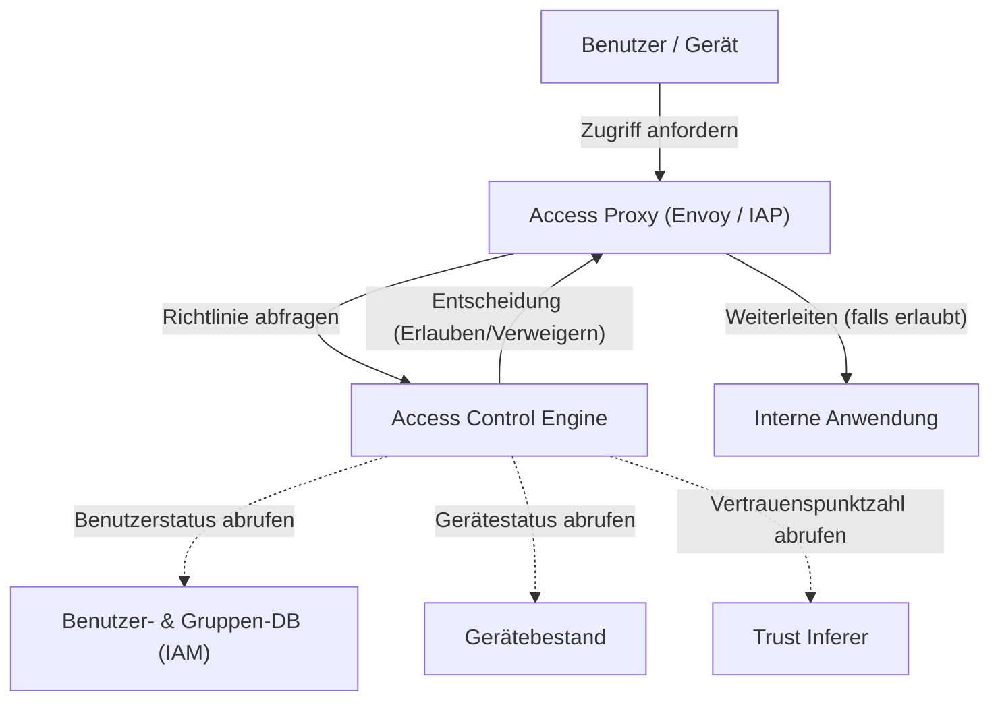

In modernen Unternehmensnetzwerken erlebt das Konzept der Cybersicherheit einen dramatischen Wendepunkt. In diesem Artikel erklären wir die Abkehr von der Perimeter-Verteidigung und die Essenz der **Zero-Trust-Netzwerkarchitektur** sehr detailliert, am Beispiel der **BeyondCorp**-Initiative von Google.

## 1. Grenzen und Zusammenbruch der traditionellen Perimeter-Verteidigung

In der Vergangenheit wurde die IT-Infrastruktur von Unternehmen auf der Grundlage einer einfachen Dualität von „innen“ und „außen“ entworfen. Dies ist die **Perimeter-Verteidigung** (Perimeter Security).

### 1.1 Grundmodell der Perimeter-Verteidigung
Bei der Perimeter-Verteidigung werden Sicherheitsgeräte wie Firewalls, VPNs und IPS/IDS verwendet, um eine starke Mauer zwischen dem internen Netzwerk (sicheres Inneres) und dem Internet (gefährliches Äußeres) zu errichten. Benutzer und Geräte, die diese Mauer passieren konnten, wurden grundsätzlich als „vertrauenswürdig“ angesehen und erhielten Zugriff auf verschiedene Ressourcen im Unternehmensnetzwerk.



### 1.2 Hintergründe für das Erreichen der Grenzen
Mit der Verbreitung von Cloud Computing, der Normalisierung von Remote-Arbeit und der zunehmenden Nutzung von SaaS-Anwendungen bricht dieses Modell jedoch zusammen.

1. **Verschwimmen der Grenzen**: Daten und Anwendungen befinden sich nicht mehr nur in lokalen Rechenzentren, sondern sind über mehrere Cloud-Umgebungen verteilt. Es wird immer schwieriger, klar zu definieren, wo die zu schützende „Grenze“ liegt.
2. **Zunehmende Bedrohungen von innen**: Es ist machtlos gegenüber Angreifern (Malware oder böswillige Insider), die bereits in das Innere eingedrungen sind. Durch Lateral Movement (seitliche Ausbreitung) besteht die Gefahr, dass der Schaden enorm wird.
3. **Leistungs- und Sicherheitsprobleme von VPNs**: Der Ansatz, den gesamten Datenverkehr über ein VPN in das Unternehmensnetzwerk zu leiten, verursacht Bandbreitenengpässe und Latenzzeiten und beeinträchtigt die Benutzererfahrung erheblich.

## 2. Definition von Zero Trust (NIST SP 800-207)

Zero Trust ist nicht einfach ein Produkt oder eine Technologie, sondern ein Sicherheitskonzept und ein Architektur-Framework. Das National Institute of Standards and Technology (NIST) hat in **NIST SP 800-207** eine Standarddefinition von Zero Trust veröffentlicht.

Das Grundprinzip von Zero Trust lautet „**Never Trust, Always Verify** (Niemals vertrauen, immer verifizieren)“. Unabhängig vom Netzwerkstandort (innerhalb oder außerhalb des Unternehmens) wird standardmäßig nichts vertraut.

### Die 7 Grundprinzipien in NIST SP 800-207
1. **Alle Datenquellen und Computing-Dienste werden als Ressourcen betrachtet.**
2. **Die gesamte Kommunikation wird unabhängig vom Netzwerkstandort gesichert.**
3. **Der Zugriff auf einzelne Unternehmensressourcen wird auf Sitzungsbasis gewährt.**
4. **Der Zugriff auf Ressourcen wird durch dynamische Richtlinien bestimmt, die die Identität des Clients, die Anwendung, den Status der angeforderten Assets sowie andere Verhaltens- und Umgebungsattribute umfassen.**
5. **Die Integrität und der Sicherheitsstatus aller eigenen und zugehörigen Assets werden überwacht und gemessen.**
6. **Die Authentifizierung und Autorisierung aller Ressourcen erfolgt dynamisch und wird strikt durchgesetzt, bevor der Zugriff gewährt wird.**
7. **Es werden so viele Informationen wie möglich über den aktuellen [Zustand](https://kenji.blog/de/p/state-management-history-redux-context-recoil-zustand/) von Assets, Netzwerkinfrastruktur und Kommunikation gesammelt und zur Verbesserung der Sicherheitsmaßnahmen genutzt.**

## 3. Google BeyondCorp: Die Realisierung von Zero Trust

Ausgelöst durch einen massiven Cyberangriff namens Operation Aurora im Jahr 2009 überarbeitete Google die Architektur seines Unternehmensnetzwerks von Grund auf. Das Ergebnis war **BeyondCorp**.

BeyondCorp schaffte das privilegierte Unternehmensnetzwerk ab und verlagerte die Zugriffskontrolle von der „Netzwerkgrenze“ auf „einzelne Benutzer und Geräte“.

### 3.1 Architektur von BeyondCorp

Das folgende Mermaid-Diagramm zeigt den grundlegenden Zugriffskontrollfluss in BeyondCorp.



### 3.2 Details der Komponenten

* **Access Proxy**: Ein Reverse-Proxy, der als Einstiegspunkt zu allen Anwendungen dient. Er führt TLS-Terminierung, Lastausgleich und, am wichtigsten, die Durchsetzung der Zugriffskontrolle (Enforcement) durch.
* **Device Inventory**: Eine Datenbank aller vom Unternehmen verwalteten Geräte. Sie sammelt kontinuierlich Informationen wie Zertifikate, Betriebssystemversion, Patch-Status und das Vorhandensein von Festplattenverschlüsselung, um den Status zu verwalten.
* **User and Group Database (IAM)**: Verwaltet Informationen wie Benutzeridentitäten, Gruppenzugehörigkeiten und Rollen. Sie bietet eine starke Authentifizierung (z. B. MFA) unter Verwendung von SAML oder [OIDC](https://kenji.blog/de/p/oauth2-oidc-authentication-authorization-difference/).
* **Trust Inferer**: Analysiert Gerätebestandsdaten und Benutzerkontextinformationen in Echtzeit, um die aktuelle „Vertrauenspunktzahl (Trust Score)“ zu berechnen.
* **Access Control Engine**: Eine Policy-Engine, die Anfragen vom Access Proxy empfängt und entscheidet, ob der Zugriff gewährt oder verweigert wird, indem sie den anfragenden Benutzer, die Vertrauenswürdigkeit des Geräts und die Ressourcenanforderungen der Zielanwendung abgleicht.

## 4. Bewertungs- und Risikoscore-Berechnungsmodell für Vertrauen

Bei Zero Trust basieren Entscheidungen zur Zugriffsgewährung nicht auf statischen Regeln, sondern auf dynamischen Risikoscores.

Der Gesamtrisikoscore $Risk(U, D, R)$ für einen Benutzer $U$ und ein Gerät $D$, die auf eine Ressource $R$ zugreifen, kann als Funktion verschiedener Faktoren definiert werden.

$ Risk(U, D, R) = w_1 \cdot P_{user}(U) + w_2 \cdot P_{device}(D) + w_3 \cdot P_{context}(C) $

Dabei gilt:
* $P_{user}(U)$ ist das Risikoprofil des Benutzers (Authentifizierungsstärke, Vorhandensein von MFA, verdächtiges Verhalten in der Vergangenheit usw.).
* $P_{device}(D)$ ist das Risikoprofil des Geräts (Betriebssystemschwachstellen, Verdacht auf Malware-Infektion, Gültigkeit des Zertifikats usw.).
* $P_{context}(C)$ ist das Kontextrisiko (Quell-IP-Adresse, Tageszeit, Geolokation usw.).
* $w_i$ sind die Gewichtungsfaktoren für jedes Element ($\sum w_i = 1$).

Das Vertrauen $Trust$ wird als Kehrwert des Risikos oder als Wert ausgedrückt, bei dem das Risiko von einem bestimmten Schwellenwert abgezogen wird.
Beispielsweise kann die Bedingung zur Gewährung des Zugriffs wie folgt formuliert werden:

$ Trust(U, D, R) = 1 - Risk(U, D, R) \geq Threshold(R) $

Hierbei ist $Threshold(R)$ das erforderliche Vertrauensniveau, das basierend auf der Sensibilität der Zielressource $R$ festgelegt wird. Für den Zugriff auf hochsensible Finanzdaten wird ein höherer Schwellenwert festgelegt.

## 5. Die Rolle der Mikrosegmentierung

Ein weiteres wesentliches Element beim Aufbau eines Zero-Trust-Netzwerks ist die **Mikrosegmentierung**.

Sie steuert die Kommunikation noch granularer als die herkömmliche VLAN-basierte Netzwerksegmentierung, und zwar auf Workload-, Anwendungs- oder Prozessebene. Dadurch wird, selbst im unwahrscheinlichen Fall, dass eine Komponente kompromittiert wird, die seitliche Ausbreitung (Lateral Movement) auf andere Komponenten auf ein Minimum reduziert.

Mithilfe von Software-Defined Networking (SDN) und identitätsbasierten Firewalls werden die Kommunikationsrichtlinien zwischen den einzelnen Komponenten (wer darf mit wem über welchen Port/welches Protokoll kommunizieren) strikt definiert und unnötige Kommunikationspfade vollständig blockiert.

## 6. Implementierungsbeispiel: IAM-Richtlinien und Proxy-Einstellungen

Hier zeigen wir konkrete Konfigurationskonzepte zur Implementierung der Zero-Trust-Architektur.

### 6.1 JSON-Beispiel einer IAM-Richtlinie (im AWS IAM-Stil)

Das folgende JSON ist ein Beispiel für eine Richtlinie, die den Zugriff auf bestimmte Ressourcen nur Benutzern gestattet, die von einem bestimmten IP-Adressbereich zugreifen und über MFA authentifiziert sind. Bei Zero Trust werden solche kontextbasierten Bedingungen detailliert konfiguriert.

```json
{
  "Version": "2012-10-17",
  "Statement": [
    {
      "Sid": "ZeroTrustAccessPolicyExample",
      "Effect": "Allow",
      "Action": [
        "s3:GetObject",
        "s3:ListBucket"
      ],
      "Resource": [
        "arn:aws:s3:::corporate-confidential-data",
        "arn:aws:s3:::corporate-confidential-data/*"
      ],
      "Condition": {
        "IpAddress": {
          "aws:SourceIp": "192.0.2.0/24"
        },
        "Bool": {
          "aws:MultiFactorAuthPresent": "true"
        },
        "NumericGreaterThan": {
          "custom:DeviceTrustScore": "80"
        }
      }
    }
  ]
}
```
*(Hinweis: `custom:DeviceTrustScore` ist ein konzeptioneller, benutzerdefinierter Bedingungsschlüssel.)*

### 6.2 Konzeptionsbeispiel für Zugriffskontrolle mit Envoy-Proxy

Envoy, der als Access Proxy fungiert, integriert sich mit einem externen Authentifizierungs-/Autorisierungsdienst (ExtAuthz), um die Zugriffskontrolle zu implementieren.

```yaml
# Beispiel-Snippet für Envoy-Filterketten-Konfiguration
filters:
  - name: envoy.filters.network.http_connection_manager
    typed_config:
      "@type": type.googleapis.com/envoy.extensions.filters.network.http_connection_manager.v3.HttpConnectionManager
      route_config:
        name: local_route
        virtual_hosts:
          - name: backend_service
            domains: ["*"]
            routes:
              - match: { prefix: "/" }
                route: { cluster: backend_app_cluster }
      http_filters:
        - name: envoy.filters.http.ext_authz
          typed_config:
            "@type": type.googleapis.com/envoy.extensions.filters.http.ext_authz.v3.ExtAuthz
            grpc_service:
              envoy_grpc:
                cluster_name: access_control_engine_cluster
              timeout: 0.5s
            transport_api_version: V3
            metadata_context_namespaces:
              - "envoy.filters.http.jwt_authn"
        - name: envoy.filters.http.router
```

Durch diese Konfiguration sendet Envoy die Metadaten der Anfrage an den `access_control_engine_cluster` (Access Control Engine), um die Autorisierung abzufragen, bevor alle HTTP-Anfragen weitergeleitet werden.

## Fazit

Der Übergang zu einer Zero-Trust-Netzwerkarchitektur lässt sich nicht über Nacht vollziehen. Es ist ein langfristiges Unterfangen, das die Integration mit bestehenden Legacy-Systemen, einen Wandel der Unternehmenskultur sowie kontinuierliche Überwachung und Feinabstimmung erfordert.

Wie jedoch Googles **BeyondCorp** beweist, ermöglicht die Implementierung von Zugriffskontrollen, die auf „Identität und Kontext“ statt auf „Netzwerkstandort“ basieren, den Aufbau einer robusteren und flexibleren Sicherheitsgrundlage gegen die vielfältigen Bedrohungen im Cloud-Zeitalter.
