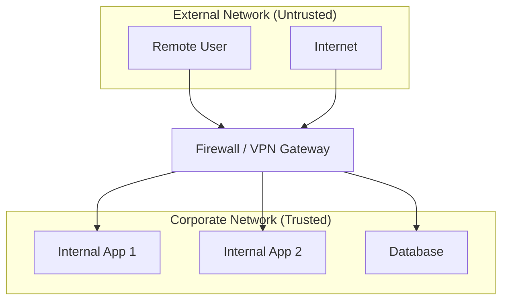
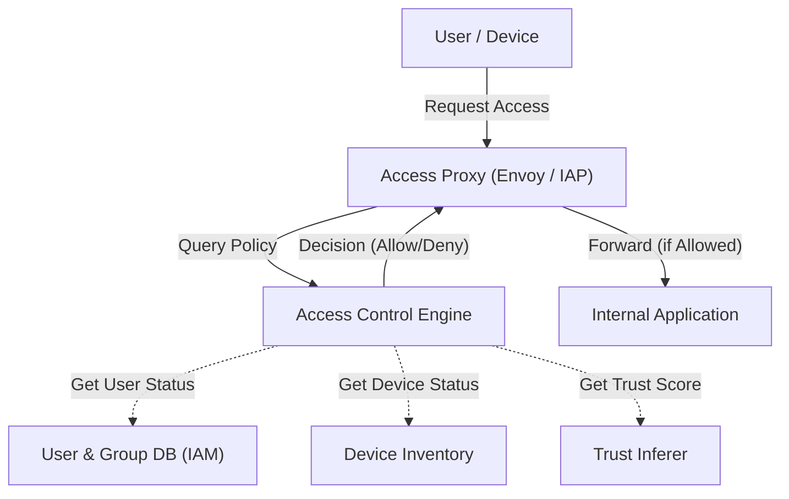

In modern corporate networks, the concept of cybersecurity is experiencing a dramatic turning point. In this article, we will explain in great detail the departure from perimeter defense and the essence of **Zero Trust Network Architecture**, taking Google's **BeyondCorp** initiative as an example.

## 1. The Limits and Collapse of Traditional Perimeter Defense

In the past, corporate IT infrastructure was designed based on a simple dichotomy of "inside" and "outside." This is known as **Perimeter Security**.

### 1.1 The Basic Model of Perimeter Defense
In perimeter defense, strong walls are built between the corporate network (the safe inside) and the internet (the dangerous outside) using security appliances such as firewalls, VPNs, and IPS/IDS. Users and devices that can pass through this wall are generally considered "trusted" and are granted access to various resources within the corporate network.



### 1.2 Background of Reaching the Limits
However, with the popularization of cloud computing, the normalization of remote work, and the expanding use of SaaS applications, this model is beginning to collapse.

1. **Blurring of the Perimeter** : Data and applications are no longer located just in on-premises data centers, but are distributed across multiple cloud environments. It has become difficult to clearly define where the "perimeter" to protect actually is.
2. **Aggravation of Insider Threats** : It is powerless against attackers (malware or malicious insiders) who have already penetrated the inside. There is a risk of severe damage due to lateral movement.
3. **VPN Performance and Security Challenges** : The method of routing all traffic to the corporate network via VPN causes bandwidth constraints and latency, significantly impairing the user experience.

## 2. Definition of Zero Trust (NIST SP 800-207)

Zero Trust is not just a product or technology, but a concept for security and a framework for architecture. The National Institute of Standards and Technology (NIST) in the United States published **NIST SP 800-207**, which provides a standard definition of Zero Trust.

The basic philosophy of Zero Trust is "**Never Trust, Always Verify**". Regardless of the network location (internal or external to the company), nothing is trusted by default.

### 7 Basic Tenets in NIST SP 800-207
1. **All data sources and computing services are considered resources.**
2. **All communication is secured regardless of network location.**
3. **Access to individual enterprise resources is granted on a per-session basis.**
4. **Access to resources is determined by dynamic policy—including the observable state of client identity, application/service, and the requesting asset—and may include other behavioral and environmental attributes.**
5. **The enterprise monitors and measures the integrity and security posture of all owned and associated assets.**
6. **All resource authentication and authorization are dynamic and strictly enforced before access is allowed.**
7. **The enterprise collects as much information as possible about the current state of assets, network infrastructure and communications and uses it to improve its security posture.**

## 3. Google BeyondCorp: The Embodiment of Zero Trust

Prompted by a large-scale cyberattack known as Operation Aurora in 2009, Google fundamentally overhauled the architecture of its corporate network. The result of this was the birth of **BeyondCorp**.

BeyondCorp eliminated the privileged corporate network and shifted access control from the "network perimeter" to "individual users and devices."

### 3.1 Architecture of BeyondCorp

The following Mermaid diagram shows the basic access control flow of BeyondCorp.



### 3.2 Details of the Components

* **Access Proxy** : A reverse proxy that serves as the entry point for all applications. It handles TLS termination, load balancing, and most importantly, access control enforcement.
* **Device Inventory** : A database of all devices managed by the enterprise. It continuously collects and manages state information such as certificates, OS versions, patch status, and the presence of disk encryption.
* **User and Group Database (IAM)** : Manages information such as user identities, group affiliations, and roles. It provides strong authentication (such as MFA) utilizing SAML and [OIDC](https://kenji.blog/en/p/oauth2-oidc-authentication-authorization-difference/).
* **Trust Inferer** : Analyzes device inventory data and user context information in real-time to calculate the current "trust score."
* **Access Control Engine** : A policy engine that receives requests from the Access Proxy, compares the requesting user and device's trust level against the resource requirements of the target application, and decides whether to allow or deny access.

## 4. Trust Evaluation and Risk Score Calculation Model

In Zero Trust, access authorization decisions are made based on dynamic risk scores rather than static rules.

The overall risk score $Risk(U, D, R)$ when user $U$ and device $D$ access resource $R$ can be defined as a function of various factors.

$ Risk(U, D, R) = w_1 \cdot P_{user}(U) + w_2 \cdot P_{device}(D) + w_3 \cdot P_{context}(C) $

Where:
* $P_{user}(U)$ is the user's risk profile (authentication strength, presence of MFA, past suspicious behavior, etc.).
* $P_{device}(D)$ is the device's risk profile (OS vulnerabilities, suspected malware infection, certificate validity, etc.).
* $P_{context}(C)$ is the contextual risk (source IP address, time of day, geolocation, etc.).
* $w_i$ are the weighting coefficients for each factor ($\sum w_i = 1$).

The trust level $Trust$ is expressed as the inverse of the risk, or as the value subtracted from a certain threshold.
For example, the condition for allowing access can be formulated as follows:

$ Trust(U, D, R) = 1 - Risk(U, D, R) \geq Threshold(R) $

Here, $Threshold(R)$ is the required trust level set based on the sensitivity of the target resource $R$. A higher threshold is set for access to highly sensitive financial data.

## 5. The Role of Micro-segmentation

Another essential element in building a Zero Trust network is **Micro-segmentation**.

It controls communication more granularly than traditional VLAN-based network segmentation, on a per-workload, per-application, or per-process basis. This minimizes lateral movement to other components in the unlikely event that one component is compromised.

Using Software-Defined Networking (SDN) and identity-based firewalls, communication policies between each component (who can communicate with whom, and on which ports/protocols) are strictly defined, completely blocking unnecessary communication paths.

## 6. Implementation Example: IAM Policy and Proxy Configuration

Here are examples of specific configuration concepts for implementing Zero Trust architecture.

### 6.1 Example of IAM Policy JSON (AWS IAM Style)

The following JSON is an example of a policy that allows access to specific resources only for users authenticated with MFA and accessing from a specific IP address range. In Zero Trust, such context-based conditions are configured granularly.

```json
{
  "Version": "2012-10-17",
  "Statement": [
    {
      "Sid": "ZeroTrustAccessPolicyExample",
      "Effect": "Allow",
      "Action": [
        "s3:GetObject",
        "s3:ListBucket"
      ],
      "Resource": [
        "arn:aws:s3:::corporate-confidential-data",
        "arn:aws:s3:::corporate-confidential-data/*"
      ],
      "Condition": {
        "IpAddress": {
          "aws:SourceIp": "192.0.2.0/24"
        },
        "Bool": {
          "aws:MultiFactorAuthPresent": "true"
        },
        "NumericGreaterThan": {
          "custom:DeviceTrustScore": "80"
        }
      }
    }
  ]
}
```
*(Note: `custom:DeviceTrustScore` is a conceptual custom condition key.)*

### 6.2 Conceptual Example of Access Control Using Envoy Proxy

In Envoy, which acts as an Access Proxy, access control is implemented in integration with an external authentication and authorization service (ExtAuthz).

```yaml
# Example snippet of Envoy filter chain configuration
filters:
  - name: envoy.filters.network.http_connection_manager
    typed_config:
      "@type": type.googleapis.com/envoy.extensions.filters.network.http_connection_manager.v3.HttpConnectionManager
      route_config:
        name: local_route
        virtual_hosts:
          - name: backend_service
            domains: ["*"]
            routes:
              - match: { prefix: "/" }
                route: { cluster: backend_app_cluster }
      http_filters:
        - name: envoy.filters.http.ext_authz
          typed_config:
            "@type": type.googleapis.com/envoy.extensions.filters.http.ext_authz.v3.ExtAuthz
            grpc_service:
              envoy_grpc:
                cluster_name: access_control_engine_cluster
              timeout: 0.5s
            transport_api_version: V3
            metadata_context_namespaces:
              - "envoy.filters.http.jwt_authn"
        - name: envoy.filters.http.router
```

With this configuration, before routing all HTTP requests, Envoy sends the request metadata to the `access_control_engine_cluster` (access control engine) to query whether authorization is granted.

## Conclusion

The transition to a Zero Trust Network Architecture is not something that can be completed overnight. It is a long-term endeavor that requires integration with existing legacy systems, organizational culture change, and continuous monitoring and tuning.

However, as Google's **BeyondCorp** demonstrates, by implementing access control based on "identity and context" rather than "network location," it becomes possible to build a more resilient and flexible security foundation against the diversifying threats in the cloud era.
